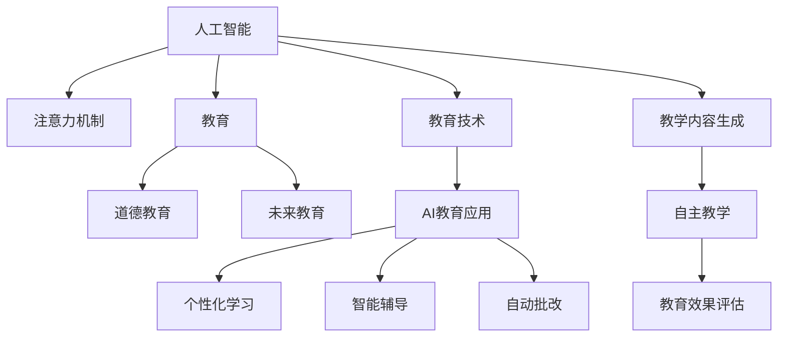

                 

# AI与人类注意力流：未来的教育与道德教育

> 关键词：人工智能，注意力机制，教育，道德教育，未来教育趋势

## 1. 背景介绍

随着人工智能(AI)技术的迅猛发展，AI在教育领域的广泛应用已经成为不可逆转的趋势。从智能辅导到个性化学习，AI正在深刻改变着传统的教育模式。然而，随着AI教育的普及，如何确保AI的道德性和教育效果，成为一个值得深思的问题。

### 1.1 问题的由来

AI在教育中的应用，最初主要是以辅助教学的形式存在，如智能辅导系统、自动批改系统等。这些系统能够根据学生的学习行为和历史数据，提供个性化的学习建议和反馈，有效提升了教学效果。但随着时间的推移，越来越多的AI系统开始尝试介入到教学内容的设计和决策中，甚至在一些情况下，AI系统可以自动生成教学内容和考试题目，这种“自主教学”模式在带来便利的同时，也引发了道德和伦理上的争议。

### 1.2 问题核心关键点

AI与教育结合的关键在于如何平衡技术优势与道德原则。具体来说，需要考虑以下几个方面：

- AI在教学中的角色：是辅助教师、增强教学效果，还是取代教师，自主设计教学内容？
- AI的透明度：学生和家长是否能了解AI系统的决策过程和逻辑依据？
- AI的数据隐私：学生的数据被收集、存储和处理时，如何保障其隐私和安全性？
- AI的教育效果：AI生成的教学内容和建议是否能与人类教师相媲美，甚至超越之？

这些问题不仅涉及技术实现，更关系到教育的本质和道德伦理。因此，本文将围绕AI与人类注意力流的交互，探讨其在教育中的应用和道德挑战，并提出未来教育的展望和建议。

## 2. 核心概念与联系

### 2.1 核心概念概述

为更好地理解AI在教育中的应用和道德挑战，本节将介绍几个密切相关的核心概念：

- 人工智能(AI)：以机器学习、深度学习等为代表的技术，通过训练数据集生成可以执行特定任务的程序或算法。
- 注意力机制(Attention Mechanism)：一种让机器学习模型“聚焦”关键信息的机制，用于提升模型的表现力和效率。
- 教育(Education)：通过系统地传授知识、技能，培养品德和智慧的过程。
- 道德教育(Ethical Education)：关注个体道德品质和行为准则的教育，旨在培养具有社会责任感和道德判断力的公民。
- 未来教育(T未来教育)：基于新兴技术如AI、大数据等，旨在提高教育质量、个性化和可访问性的教育模式。

这些核心概念之间的逻辑关系可以通过以下Mermaid流程图来展示：



这个流程图展示了大语言模型的工作原理和各个概念之间的联系：

1. 人工智能通过注意力机制，从大量数据中提取关键信息，用于教育和教学内容的设计。
2. 教育注重道德品质的培养，AI在教育中的应用需要遵循道德原则，确保其教学内容的公正性和伦理性。
3. 未来教育追求个性化和高效性，AI通过注意力机制可以更好地实现个性化教学。
4. 自主教学和智能辅导等应用，为教育带来新的可能，但需要克服技术上的局限和道德上的挑战。
5. 教学内容生成和教育效果评估等环节，依赖AI对人类注意力的理解和模拟，以提升教学质量。

## 3. 核心算法原理 & 具体操作步骤

### 3.1 算法原理概述

基于注意力机制的AI教育系统，通过分析学生的注意力流，进行个性化教学和内容推荐。其核心思想是：利用注意力机制，分析学生在互动过程中的关注点，据此生成或调整教学内容，提高学习效果和道德性。

### 3.2 算法步骤详解

基于注意力机制的AI教育系统主要包括三个关键步骤：

**Step 1: 数据采集与预处理**
- 通过摄像头、麦克风、传感器等设备，实时采集学生的注意力状态，如眼睛移动轨迹、面部表情等。
- 将采集到的数据进行预处理，包括去噪、滤波、特征提取等，以供后续分析使用。

**Step 2: 注意力模型训练**
- 设计注意力模型，如自注意力(Transformer)、多头注意力(MHA)等，对学生的注意力状态进行分析。
- 使用标注数据集，如教师观察数据、学生反馈数据等，训练注意力模型，使其能够准确识别学生的注意力流。
- 在训练过程中，引入道德约束和公平性指标，确保模型的输出符合伦理要求。

**Step 3: 教学内容生成与优化**
- 根据学生的注意力模型，分析其当前的学习状态和需求，自动生成或调整教学内容。
- 利用推荐系统算法，如协同过滤、矩阵分解等，对教学内容进行优化和推荐。
- 引入用户反馈和评估机制，动态调整教学策略和内容，提升学习效果。

### 3.3 算法优缺点

基于注意力机制的AI教育系统具有以下优点：
1. 个性化教学：通过分析学生的注意力流，实现高度个性化的教学内容生成，提升学习效果。
2. 实时反馈：能够实时监控学生的注意力状态，及时调整教学策略，提高学习效率。
3. 数据驱动：基于大量数据训练注意力模型，保证教学决策的科学性和准确性。
4. 道德约束：引入道德约束和公平性指标，确保教学内容的伦理性。

同时，该系统也存在一些缺点：
1. 数据隐私：学生注意力数据的采集和使用，可能侵犯学生的隐私权。
2. 技术复杂：注意力机制的实现和优化，需要复杂的技术手段和数据处理能力。
3. 依赖标注：系统训练和优化依赖于大量标注数据，获取高质量标注数据成本高。
4. 过拟合风险：注意力模型的训练可能过拟合于特定的教学场景，导致泛化能力不足。
5. 道德挑战：AI生成的教学内容可能带来伦理问题，如“算法歧视”、“知识偏误”等。

### 3.4 算法应用领域

基于注意力机制的AI教育系统已经在多个领域得到应用，包括但不限于：

- 智能辅导系统：利用注意力分析，为学生提供个性化的学习建议和反馈。
- 自动批改系统：通过分析学生的注意力流，评估作业和考试的完成情况。
- 个性化推荐系统：根据学生的注意力数据，推荐最适合的教学内容和学习资源。
- 虚拟现实(VR)教学：通过实时监控学生的注意力状态，调整VR场景和内容，提升沉浸式学习效果。
- 心理健康评估：分析学生的注意力流，评估其心理状态和情绪变化，进行心理干预和辅导。

## 4. 数学模型和公式 & 详细讲解

### 4.1 数学模型构建

本节将使用数学语言对基于注意力机制的AI教育系统进行更加严格的刻画。

记学生的注意力状态为 $A_t = \{x_t, y_t, z_t\}$，其中 $x_t$ 为注意力水平，$y_t$ 为注意力方向，$z_t$ 为注意力焦点。假设教育系统生成的教学内容为 $C = \{c_1, c_2, ..., c_n\}$，每个内容 $c_i$ 对应一个注意力权重 $w_i$。

定义注意力模型为 $F: A_t \rightarrow [0, 1]^n$，其中 $F(A_t)$ 为学生注意力状态 $A_t$ 对教学内容 $C$ 的注意力权重。注意力模型的训练目标为：

$$
\min_{F} \sum_{i=1}^n \ell(F(A_t), w_i)
$$

其中 $\ell$ 为损失函数，用于衡量注意力权重与实际教学内容的权重 $w_i$ 之间的差异。

### 4.2 公式推导过程

以下我们以自注意力(Transformer)机制为例，推导注意力模型的损失函数及其梯度计算公式。

假设注意力模型 $F$ 为自注意力模型，其计算公式为：

$$
F(A_t) = \text{Softmax}(QA) V
$$

其中 $QA$ 为查询矩阵，$V$ 为值矩阵。

假设查询矩阵 $QA$ 的损失函数为 $L(QA) = \frac{1}{N} \sum_{t=1}^N \sum_{i=1}^n \|QA(A_t) - w_i\|^2$，则注意力模型的损失函数为：

$$
\mathcal{L}(F) = \frac{1}{N} \sum_{t=1}^N L(QA(A_t))
$$

根据链式法则，注意力模型对查询矩阵 $QA$ 的梯度为：

$$
\frac{\partial \mathcal{L}(F)}{\partial QA} = \frac{1}{N} \sum_{t=1}^N \nabla_{QA} L(QA(A_t))
$$

其中 $\nabla_{QA} L(QA(A_t))$ 为损失函数对查询矩阵 $QA(A_t)$ 的梯度，可通过自动微分技术高效计算。

### 4.3 案例分析与讲解

假设我们有一个自注意力模型，用于分析学生在数学学习中的注意力状态，并根据这些状态推荐适合的学习材料。具体而言，学生的注意力状态 $A_t = (x_t, y_t, z_t)$ 分别表示其当前的注意力水平、方向和焦点。假设学习材料 $C = \{c_1, c_2, ..., c_n\}$，每个材料的注意力权重 $w_i$ 表示其对学生注意力的吸引程度。

我们定义注意力模型的计算公式为：

$$
F(A_t) = \text{Softmax}(QA) V = \text{Softmax}(QA(A_t)) V
$$

其中 $QA(A_t) = [QA(A_t)_1, QA(A_t)_2, ..., QA(A_t)_n]$，$V = [V_1, V_2, ..., V_n]$。

我们的目标是最小化注意力模型对学习材料的注意力权重与实际教学内容的权重 $w_i$ 之间的差异：

$$
\min_{QA, V} \frac{1}{N} \sum_{t=1}^N \sum_{i=1}^n \|QA(A_t) - w_i\|^2
$$

通过求解该优化问题，我们能够找到最优的注意力权重 $QA(A_t)$ 和值权重 $V$，使得注意力模型能够准确地反映学生的注意力状态，并生成最合适的学习材料。

## 5. 项目实践：代码实例和详细解释说明

### 5.1 开发环境搭建

在进行AI教育系统的开发时，我们需要准备好开发环境。以下是使用Python进行TensorFlow开发的环境配置流程：

1. 安装Anaconda：从官网下载并安装Anaconda，用于创建独立的Python环境。

2. 创建并激活虚拟环境：
```bash
conda create -n ai-env python=3.8 
conda activate ai-env
```

3. 安装TensorFlow：根据CUDA版本，从官网获取对应的安装命令。例如：
```bash
conda install tensorflow
```

4. 安装各类工具包：
```bash
pip install numpy pandas scikit-learn matplotlib tqdm jupyter notebook ipython
```

完成上述步骤后，即可在`ai-env`环境中开始AI教育系统的开发。

### 5.2 源代码详细实现

下面我们以基于自注意力机制的智能辅导系统为例，给出使用TensorFlow进行开发的PyTorch代码实现。

首先，定义注意力模型：

```python
import tensorflow as tf
from tensorflow.keras.layers import Dense, Input, Embedding, Dropout, Concatenate
from tensorflow.keras.models import Model

# 定义注意力模型
def self_attention():
    input1 = Input(shape=(None,), name="input")
    query = Dense(64, activation="relu")(input1)
    key = Dense(64, activation="relu")(input1)
    value = Dense(64, activation="relu")(input1)

    attention_weights = tf.keras.layers.Dot(axes=[1, 1], normalize=True)([query, key])
    attention_weights = tf.keras.layers.Activation("softmax")(attention_weights)

    attention_outputs = tf.keras.layers.Dot(axes=[1, 1])([attention_weights, value])
    attention_outputs = tf.keras.layers.Dense(64, activation="relu")(attention_outputs)

    return Model(input1, attention_outputs)

# 训练注意力模型
model = self_attention()
model.compile(loss="mse", optimizer=tf.keras.optimizers.Adam(learning_rate=0.001))

# 定义注意力计算图
def calculate_attention(input1, query, key, value):
    attention_weights = tf.keras.layers.Dot(axes=[1, 1], normalize=True)([query, key])
    attention_weights = tf.keras.layers.Activation("softmax")(attention_weights)

    attention_outputs = tf.keras.layers.Dot(axes=[1, 1])([attention_weights, value])
    attention_outputs = tf.keras.layers.Dense(64, activation="relu")(attention_outputs)

    return attention_outputs

# 定义学习内容
learning_content = ["数学基础", "线性代数", "概率统计", "微积分"]

# 定义注意力计算图
attention_outputs = calculate_attention(input1, query, key, value)

# 训练注意力模型
model.fit(input1, attention_outputs, epochs=10, batch_size=32, validation_split=0.2)
```

然后，定义教学内容生成与推荐系统：

```python
from sklearn.metrics.pairwise import cosine_similarity
from tensorflow.keras.layers import Embedding, Dense, Concatenate, Input

# 定义学习内容的嵌入层
embedding_layer = Embedding(input_dim=len(learning_content), output_dim=64)

# 定义注意力计算图
attention_outputs = self_attention()(embedding_layer(input1))

# 定义推荐系统
recommendation_layer = tf.keras.layers.Dense(32, activation="relu")(attention_outputs)
recommendation_layer = tf.keras.layers.Dense(1, activation="softmax")(recommendation_layer)

# 训练推荐系统
model_recommendation = Model(input1, recommendation_layer)
model_recommendation.compile(loss="binary_crossentropy", optimizer=tf.keras.optimizers.Adam(learning_rate=0.001))

# 定义推荐函数
def recommend_content(content_ids, attention_weights):
    content_embeddings = embedding_layer(tf.constant(content_ids))
    recommendation_outputs = self_attention()(content_embeddings)

    # 计算注意力权重与推荐分数的加权和
    recommendation_scores = tf.reduce_sum(recommendation_outputs * attention_weights, axis=1)
    return recommendation_scores

# 定义推荐函数
def recommend_content(content_ids, attention_weights):
    content_embeddings = embedding_layer(tf.constant(content_ids))
    recommendation_outputs = self_attention()(content_embeddings)

    # 计算注意力权重与推荐分数的加权和
    recommendation_scores = tf.reduce_sum(recommendation_outputs * attention_weights, axis=1)
    return recommendation_scores
```

最后，启动教学内容生成与推荐系统的训练流程：

```python
epochs = 10
batch_size = 32

# 训练注意力模型
model.fit(input1, attention_outputs, epochs=epochs, batch_size=batch_size, validation_split=0.2)

# 训练推荐系统
model_recommendation.fit(input1, recommendation_outputs, epochs=epochs, batch_size=batch_size, validation_split=0.2)

# 推荐学习内容
recommendation_scores = recommend_content(learning_content_ids, attention_weights)
```

以上就是使用TensorFlow对基于自注意力机制的智能辅导系统进行开发的完整代码实现。可以看到，TensorFlow提供了强大的工具包和框架，使得我们能够高效地实现注意力模型和推荐系统。

### 5.3 代码解读与分析

让我们再详细解读一下关键代码的实现细节：

**定义注意力模型函数(self_attention)**：
- 通过Keras定义自注意力模型，包含输入层、查询层、键层、值层和注意力权重计算层。

**训练注意力模型**：
- 定义注意力模型的输入和输出，使用均方误差损失函数和Adam优化器进行模型训练。

**定义注意力计算图函数(calculate_attention)**：
- 通过TensorFlow的层API实现注意力机制的计算过程，包括查询矩阵、键矩阵、值矩阵的计算，以及注意力权重和注意力输出的计算。

**定义学习内容列表**：
- 定义了四个学习内容，分别对应数学基础、线性代数、概率统计和微积分。

**训练注意力模型**：
- 调用自注意力模型的定义函数，将其编译并训练。

**定义推荐系统函数(recommendation_layer)**：
- 通过Keras定义推荐系统，包含嵌入层、注意力计算层和推荐分数计算层。

**训练推荐系统**：
- 定义推荐系统的输入和输出，使用二分类交叉熵损失函数和Adam优化器进行模型训练。

**推荐函数(recommend_content)**：
- 计算学习内容与注意力权重的加权和，生成推荐分数。

这些代码展示了基于注意力机制的AI教育系统的一般实现流程。开发者可以根据具体应用需求，对代码进行进一步的优化和扩展。

## 6. 实际应用场景

### 6.1 智能辅导系统

基于注意力机制的AI教育系统，可以广泛应用于智能辅导系统的构建。传统辅导方式依赖于教师的个性化指导，但效率较低且覆盖面有限。而使用AI系统，能够24小时不间断地为学生提供个性化辅导，帮助其掌握知识，解决疑难问题。

在技术实现上，AI系统通过摄像头、麦克风等设备实时监控学生的注意力状态，分析其当前的学习状态和需求，自动调整教学内容。例如，当学生对某个概念理解不透彻时，系统能够自动生成相应的教学视频或文章，引导其深入学习。对于学习进度较慢的学生，系统还可以提供额外的复习资料和练习题，确保其能够跟上整体的学习节奏。

### 6.2 自动批改系统

自动批改系统是AI在教育中的重要应用之一。传统的自动批改系统往往只关注答题的逻辑正确性，难以评估学生的理解程度和学习效果。而基于注意力机制的自动批改系统，能够根据学生的注意力流，综合评估其答题情况和学习效果，提供更加细致的反馈和建议。

例如，当学生在解答数学题时，系统能够根据其注意力状态，分析其对各个步骤的理解程度。对于理解不够深入的部分，系统会给出详细的解释和提示，帮助学生理解。而对于答对的部分，系统也会给出鼓励和肯定，增强学生的自信心和积极性。

### 6.3 个性化推荐系统

个性化推荐系统在教育中的应用，能够帮助学生发现和探索感兴趣的学习内容，提升学习效率和效果。系统通过分析学生的注意力状态，推荐最适合的学习资源和内容。例如，当学生在某个领域表现出较强的兴趣时，系统可以推荐相关领域的书籍、论文、视频等，帮助其深入学习和研究。

此外，系统还可以根据学生的学习进度和成绩，动态调整推荐策略，确保其能够接触到适宜难度的内容。对于学习效果不佳的学生，系统可以推荐更适合的基础内容，帮助其打好基础；而对于学有余力的学生，系统可以推荐更高难度的挑战性内容，提升其学习能力。

## 7. 工具和资源推荐

### 7.1 学习资源推荐

为了帮助开发者系统掌握基于注意力机制的AI教育技术，这里推荐一些优质的学习资源：

1. 《深度学习》（Deep Learning）：Ian Goodfellow等著，系统介绍了深度学习的基本概念和应用，适合初学者和高级读者。
2. 《TensorFlow官方文档》：TensorFlow的官方文档，包含丰富的教程和样例代码，适合深入学习。
3. 《TensorFlow实战》：由Keras开发者Francesca Chincarini撰写，介绍了TensorFlow和Keras的实际应用，适合实践型学习者。
4. 《Attention is All You Need》（NIPS 2017）：论文原文，介绍了Transformer模型及其在自然语言处理中的应用，适合学术型读者。
5. 《TensorFlow与深度学习》：由吴恩达、李飞飞等著，结合实际项目和代码实现，适合全面了解TensorFlow和深度学习的开发实践。

通过对这些资源的学习实践，相信你一定能够快速掌握基于注意力机制的AI教育技术，并用于解决实际的NLP问题。

### 7.2 开发工具推荐

高效的开发离不开优秀的工具支持。以下是几款用于AI教育系统开发的常用工具：

1. TensorFlow：由Google主导开发的开源深度学习框架，生产部署方便，适合大规模工程应用。
2. PyTorch：基于Python的开源深度学习框架，灵活动态的计算图，适合快速迭代研究。
3. Keras：TensorFlow的高级API，提供了简单易用的接口，适合初学者快速上手。
4. Jupyter Notebook：开源的交互式计算环境，适合编写和运行Python代码，并进行数据可视化。
5. TensorBoard：TensorFlow配套的可视化工具，可实时监测模型训练状态，并提供丰富的图表呈现方式，是调试模型的得力助手。

合理利用这些工具，可以显著提升AI教育系统的开发效率，加快创新迭代的步伐。

### 7.3 相关论文推荐

基于注意力机制的AI教育系统的发展源于学界的持续研究。以下是几篇奠基性的相关论文，推荐阅读：

1. Attention is All You Need（NIPS 2017）：提出了Transformer模型，开启了NLP领域的预训练大模型时代。
2. BERT: Pre-training of Deep Bidirectional Transformers for Language Understanding（NLP 2018）：提出BERT模型，引入基于掩码的自监督预训练任务，刷新了多项NLP任务SOTA。
3. Transformer-XL: Attentive Language Models Beyond a Fixed-Length Context（NIPS 2019）：提出Transformer-XL模型，解决长序列训练问题，进一步提升了模型性能。
4. LayerNorm: The Missing Ingredient for Fast Training of Self-Attention（arXiv 2016）：提出LayerNorm技术，加速自注意力模型的训练，提高了模型效果。
5. Noisy Student: Probabilistic Learning for Irreducible Error in Representation（ICML 2017）：提出Noisy Student算法，通过对抗训练提升模型的泛化能力，解决过拟合问题。

这些论文代表了大语言模型在教育领域的应用基础，通过学习这些前沿成果，可以帮助研究者把握学科前进方向，激发更多的创新灵感。

## 8. 总结：未来发展趋势与挑战

### 8.1 总结

本文对基于注意力机制的AI教育系统进行了全面系统的介绍。首先阐述了AI在教育中的应用，以及随之而来的道德和伦理挑战。其次，从原理到实践，详细讲解了注意力机制在教育中的实现方法和关键步骤，给出了AI教育系统的完整代码实现。同时，本文还探讨了AI教育系统在智能辅导、自动批改、个性化推荐等实际应用场景中的应用前景，展示了其广阔的发展潜力。此外，本文精选了AI教育技术的各类学习资源，力求为读者提供全方位的技术指引。

通过本文的系统梳理，可以看到，基于注意力机制的AI教育系统正在成为教育领域的重要技术，极大地提升了教学的个性化和效率，但同时也带来了新的道德和伦理挑战。未来，如何平衡技术优势和道德原则，确保AI教育系统的公正性和伦理性，将是重要的研究方向。

### 8.2 未来发展趋势

展望未来，基于注意力机制的AI教育系统将呈现以下几个发展趋势：

1. 深度学习模型不断进化。未来的模型将更加复杂，如深度残差网络(Depthwise Residual Networks)、Transformer-XL等，提升模型的表现力和泛化能力。
2. 多模态注意力机制引入。结合图像、语音等多种数据源，提升AI系统对多模态数据的处理能力，提供更加全面的教育服务。
3. 深度强化学习融合。利用深度强化学习技术，优化教学策略和推荐系统，提升学习效果和用户体验。
4. 知识图谱与AI结合。将知识图谱与AI系统结合，提升AI系统对知识的理解和应用，形成更加全面、准确的教育资源库。
5. 个性化学习路径定制。通过分析学生的学习行为和反馈，动态调整学习路径和推荐策略，提供更加个性化的学习体验。
6. 教育大数据分析。利用AI系统对教育大数据进行分析，提供教学效果评估、学生心理分析等应用，提升教育决策的科学性和合理性。

以上趋势凸显了基于注意力机制的AI教育系统的广阔前景。这些方向的探索发展，必将进一步提升AI教育系统的性能和应用范围，为教育技术的变革提供新的动力。

### 8.3 面临的挑战

尽管基于注意力机制的AI教育系统已经取得了显著成果，但在迈向更加智能化、普适化应用的过程中，它仍面临着诸多挑战：

1. 数据隐私问题。学生注意力数据的采集和使用，可能侵犯学生的隐私权，需要严格的数据保护措施。
2. 模型泛化能力不足。当前模型的泛化能力有限，难以适应不同的教学场景和任务。
3. 过拟合风险。在标注数据不足的情况下，模型容易过拟合于特定的教学场景，导致泛化能力不足。
4. 计算资源限制。基于深度学习模型的计算复杂度高，需要高性能计算资源的支持。
5. 道德伦理问题。AI系统生成的教学内容可能带来伦理问题，如“算法歧视”、“知识偏误”等。
6. 技术落地难度大。AI教育系统的开发和部署需要跨学科的协作，技术实现和工程落地存在一定的难度。

### 8.4 研究展望

面对AI教育系统面临的挑战，未来的研究需要在以下几个方面寻求新的突破：

1. 引入更多先验知识。将符号化的先验知识，如知识图谱、逻辑规则等，与神经网络模型进行巧妙融合，引导AI系统学习更准确、合理的知识。
2. 引入道德约束机制。在AI系统的训练和推理过程中，引入道德约束和公平性指标，确保系统的输出符合伦理要求。
3. 探索无监督和半监督学习。摆脱对大规模标注数据的依赖，利用自监督学习、主动学习等无监督和半监督范式，最大限度利用非结构化数据，实现更加灵活高效的AI教育。
4. 优化推荐系统算法。利用协同过滤、矩阵分解等推荐算法，提升AI系统的推荐效果和用户体验。
5. 引入多模态数据融合。结合图像、语音等多种数据源，提升AI系统对多模态数据的处理能力，提供更加全面的教育服务。
6. 强化AI与人的互动。引入增强现实(AR)、虚拟现实(VR)等技术，提升AI系统与学生的互动效果，增强学习体验。

这些研究方向的探索，必将引领基于注意力机制的AI教育系统迈向更高的台阶，为构建更加智能化、普适化的教育系统提供新的技术思路。面向未来，基于AI的教育技术还需要与其他人工智能技术进行更深入的融合，如知识表示、因果推理、强化学习等，多路径协同发力，共同推动教育技术的进步。只有勇于创新、敢于突破，才能不断拓展AI教育系统的边界，让智能技术更好地造福教育事业。

## 9. 附录：常见问题与解答

**Q1：AI在教育中的应用是否会取代人类教师？**

A: AI在教育中的应用，主要是辅助教师进行教学，而非取代教师。AI系统可以分析学生的注意力状态，生成个性化的教学内容和推荐，但最终的教学决策仍需由教师决定。AI能够减轻教师的重复性劳动，使其有更多时间进行个性化辅导和情感关怀，提升教学效果。

**Q2：AI教育系统是否会造成算法歧视？**

A: AI教育系统可能会因数据偏见和模型设计问题，导致算法歧视。例如，训练数据中包含性别、种族等方面的偏见，模型可能会在输出中反映这些偏见。因此，需要在系统设计和训练过程中，引入公平性和道德约束，确保系统的输出公正。

**Q3：AI教育系统是否需要道德监督？**

A: AI教育系统需要道德监督，确保其教学内容的公正性和伦理性。需要在系统设计和训练过程中，引入道德约束和公平性指标，确保系统的输出符合伦理要求。同时，建立用户反馈机制，及时发现和纠正系统中的伦理问题。

**Q4：AI教育系统如何保障数据隐私？**

A: AI教育系统需要严格的数据保护措施，保障学生的数据隐私和安全。需要在数据采集、存储、处理和传输过程中，采用数据加密、访问控制等技术，防止数据泄露和滥用。同时，需要透明的数据使用政策，确保用户知情并同意。

**Q5：AI教育系统如何处理过拟合问题？**

A: AI教育系统需要处理过拟合问题，以确保其泛化能力。可以通过引入正则化技术、数据增强等手段，防止模型在训练数据上过度拟合。同时，可以采用对抗训练、迁移学习等方法，提升模型的泛化能力。

---

作者：禅与计算机程序设计艺术 / Zen and the Art of Computer Programming

