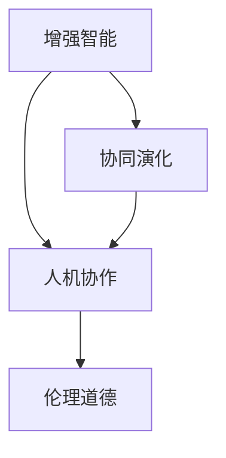

                 

# AI与人类的未来互动与合作

> 关键词：人工智能，人类协作，增强智能，伦理道德，协同演化

## 1. 背景介绍

### 1.1 问题由来

随着人工智能技术的飞速发展，AI已从传统的计算和数据处理工具，逐步演变为能够进行复杂认知任务的系统，并在多个领域展现出了卓越的性能。然而，尽管AI在科技和工程层面取得了显著进展，其在人类社会层面的影响力及其与人类社会关系的重塑，仍面临诸多挑战和争议。

1. **技术鸿沟**：AI技术的高度专业性和复杂性，使得普通公众难以全面理解和把握其潜力与风险。
2. **伦理道德**：自动化取代部分人类工作后，如何保障就业安全、维护社会公平和伦理道德成为一大问题。
3. **社会适应**：AI系统如何在个体和社会层面上与人类有效互动，提升人类福祉，需要深入探讨。

### 1.2 问题核心关键点

本文将重点探讨AI与人类未来互动与合作的核心关键点，包括：

- **技术融合**：AI技术如何与人类工作、生活及社会结构深度融合，提升人类生活质量。
- **协作机制**：人类与AI如何建立有效的协作机制，实现互惠互利。
- **伦理规范**：在AI应用中如何建立合理的伦理道德规范，确保公平性和安全性。
- **协同演化**：AI与人类社会如何协同进化，共同应对未来挑战。

通过这些问题导向的讨论，本文旨在为AI与人类未来互动与合作提供一个深入的思考框架。

## 2. 核心概念与联系

### 2.1 核心概念概述

为更好地理解AI与人类未来互动与合作的主题，本节将介绍几个关键概念：

- **增强智能**：指通过人工智能技术提升人类认知、决策和行动能力的过程，是人类与AI协同进化的产物。
- **人机协作**：指人类与AI系统在任务执行、决策支持、知识共享等方面的协同工作模式。
- **协同演化**：指人类社会与AI技术在共同进化过程中，相互影响、相互作用，促进彼此发展的过程。
- **伦理道德**：指在AI应用中，对行为规范、决策责任、数据隐私等方面的考量，确保AI技术发展与人类福祉相一致。

这些核心概念之间的逻辑关系可以通过以下Mermaid流程图来展示：



这个流程图展示了大AI与人类未来互动与合作的关键概念及其之间的关系：

1. 增强智能为协同演化提供了技术基础。
2. 人机协作是增强智能技术在实际应用中的具体体现。
3. 协同演化促进了增强智能技术的发展。
4. 伦理道德规范了人机协作的过程。

这些概念共同构成了AI与人类未来互动与合作的基础框架，理解它们有助于构建有效的AI应用系统。

## 3. 核心算法原理 & 具体操作步骤
### 3.1 算法原理概述

AI与人类未来互动与合作的核心算法原理，主要体现在以下几个方面：

1. **增强智能**：通过AI技术提升人类在认知、决策和行动上的能力，即增强智能。
2. **协同演化**：人类社会与AI技术的相互影响与相互作用，促进彼此的共同进步。
3. **伦理道德**：在AI应用过程中，维护人类公平性、安全性与道德性。

这些原理可以进一步细分为具体算法和技术：

- **增强智能算法**：如知识图谱、协同过滤、深度学习等，用于提升人类对复杂信息的处理和决策能力。
- **协同演化算法**：如遗传算法、协同进化算法等，用于模拟人类社会与AI技术的共同演化过程。
- **伦理道德算法**：如公平算法、隐私保护算法等，用于确保AI应用中的伦理道德规范。

### 3.2 算法步骤详解

基于增强智能、协同演化和伦理道德的AI与人类未来互动与合作，一般包括以下关键步骤：

**Step 1: 技术融合**
- 选择适合的AI技术（如深度学习、增强学习等），将之与人类工作、生活场景融合。
- 对人类认知模型进行优化，提升其对AI系统输出的理解与解释能力。

**Step 2: 人机协作机制设计**
- 设计人机协作流程，明确AI系统与人类在任务执行中的角色与职责。
- 开发协作接口与交互界面，使AI系统与人类能够高效互动。

**Step 3: 协同演化策略实施**
- 在实际应用中，动态调整AI系统的参数和策略，根据人类反馈进行优化。
- 定期评估AI系统在现实世界中的表现，确保其与人类社会需求相适应。

**Step 4: 伦理道德规范制定**
- 制定AI应用中的伦理道德规范，如数据使用、算法透明性、责任归属等。
- 建立伦理审查机制，确保AI系统的公平性和安全性。

**Step 5: 持续改进**
- 基于现实反馈，持续优化AI系统与人类互动方式。
- 引入多学科知识，提升AI系统在复杂情境下的应对能力。

### 3.3 算法优缺点

增强智能、协同演化和伦理道德的AI与人类未来互动与合作，具有以下优点和缺点：

**优点**：
1. **提升效率**：AI技术可以在某些领域显著提升人类工作效率，如医疗诊断、金融分析等。
2. **增强决策质量**：通过AI辅助决策，可以大幅降低人为错误，提升决策质量。
3. **促进社会进步**：AI技术在教育、医疗、交通等领域的应用，有望改善人类生活质量。

**缺点**：
1. **技术依赖**：过度依赖AI可能导致人类能力的退化，需注意保持人类自主性。
2. **伦理风险**：AI决策的公平性、透明度和责任归属问题，需要深入探讨。
3. **社会不稳定**：AI取代部分人类工作可能引发社会结构变化，需要妥善应对。

### 3.4 算法应用领域

AI与人类未来互动与合作在多个领域已得到应用，如：

- **医疗健康**：AI辅助诊断、个性化治疗、药物研发等。
- **金融服务**：自动化交易、风险评估、客户服务等。
- **教育培训**：智能辅导、个性化推荐、作业批改等。
- **交通出行**：自动驾驶、智能调度、实时导航等。
- **环境保护**：智能监测、资源管理、灾害预警等。

这些领域展示了AI与人类未来互动与合作的广阔前景和巨大潜力。

## 4. 数学模型和公式 & 详细讲解  
### 4.1 数学模型构建

本节将使用数学语言对AI与人类未来互动与合作的核心模型进行更加严格的刻画。

假设有一个AI系统 $A$ 和一个人类 $H$，两者通过协作完成任务。设 $T$ 为任务，$D$ 为数据集，$L$ 为损失函数。则AI系统 $A$ 在人类 $H$ 的帮助下完成任务的优化目标为：

$$
\min_{\theta_A, \theta_H} \mathcal{L}(A, H; D)
$$

其中 $\theta_A$ 为AI系统参数，$\theta_H$ 为人类决策参数，$\mathcal{L}(A, H; D)$ 为协作任务的损失函数。

在实际应用中，我们可以使用协同进化算法来优化上述目标函数，如遗传算法、粒子群优化等。

### 4.2 公式推导过程

以下我们以协同进化算法为例，推导AI与人类未来互动与合作中的协同优化过程。

假设AI系统 $A$ 与人类 $H$ 共同完成任务，其中 $A$ 的目标函数为 $f_A$，$H$ 的目标函数为 $f_H$。设 $x_A$ 为 $A$ 的任务决策变量，$x_H$ 为 $H$ 的任务决策变量。则协同优化问题可以表示为：

$$
\min_{x_A, x_H} \{f_A(x_A) + f_H(x_H)\}
$$

利用协同进化算法，我们可以定义一个种群 $\mathcal{P}$，其中每个个体 $p$ 代表 $A$ 和 $H$ 的决策变量。种群 $p$ 通过选择、交叉和变异等操作，逐步优化目标函数，直至收敛。

具体步骤如下：

1. 初始化种群 $\mathcal{P}$，随机生成 $P$ 个个体。
2. 计算每个个体的适应度，即目标函数的值。
3. 选择适应度高的个体进入下一代。
4. 进行交叉和变异操作，生成新的个体。
5. 计算新个体的适应度，更新种群。
6. 重复上述步骤，直至种群收敛或达到预设迭代次数。

### 4.3 案例分析与讲解

以医疗领域为例，我们分析AI与人类在未来互动与合作中的协同优化过程。

假设有一个基于AI的疾病诊断系统 $A$ 和一个人类医生 $H$，共同处理病人的诊断。$A$ 的目标函数为最小化误诊率 $f_A$，$H$ 的目标函数为最小化漏诊率 $f_H$。在协同优化过程中，$A$ 通过分析历史病例数据，生成疾病预测结果，而 $H$ 则根据这些预测结果进行进一步诊断。

协同进化算法可以将 $A$ 与 $H$ 的决策变量作为种群个体，通过选择、交叉和变异操作，逐步优化误诊率和漏诊率。例如，在交叉操作中，$A$ 可以共享其基于大数据分析的预测结果，$H$ 则根据这些结果进行经验验证和修正。

这种协同优化过程，不仅提升了疾病诊断的准确性和效率，还促进了人类医生与AI系统之间的互信与合作。

## 5. 项目实践：代码实例和详细解释说明
### 5.1 开发环境搭建

在进行AI与人类未来互动与合作的项目实践前，我们需要准备好开发环境。以下是使用Python进行OpenAI的GPT-3模型实现的开发环境配置流程：

1. 安装Anaconda：从官网下载并安装Anaconda，用于创建独立的Python环境。

2. 创建并激活虚拟环境：
```bash
conda create -n gpt3-env python=3.8 
conda activate gpt3-env
```

3. 安装OpenAI的Python SDK：
```bash
pip install openai
```

4. 设置环境变量：
```bash
export OPENAI_API_KEY=your_api_key
```

完成上述步骤后，即可在`gpt3-env`环境中开始开发实践。

### 5.2 源代码详细实现

下面我们以GPT-3模型为基础，给出AI与人类未来互动与合作的代码实现。

首先，定义协同优化的目标函数：

```python
from openai import OpenAI

def joint_objective_function(x):
    # x为A和H的决策变量
    # 假设A的目标函数为最小化误诊率，H的目标函数为最小化漏诊率
    # 这里仅为一个简化示例，实际应用中需要根据具体任务定义目标函数
    return (x['A'] + x['H']) / 2
```

然后，定义协同优化的种群和遗传算法参数：

```python
def initialize_population(num_individuals):
    # 随机生成初始种群
    population = []
    for _ in range(num_individuals):
        individual = {}
        individual['A'] = random_decision_function()
        individual['H'] = random_decision_function()
        population.append(individual)
    return population

def evolve_population(population, num_generations, num_individuals):
    # 进行多代遗传算法优化
    for gen in range(num_generations):
        fitness_scores = []
        for ind in population:
            fitness_scores.append(joint_objective_function(ind))
        sorted_population = sorted(population, key=lambda x: fitness_scores[x])
        top_individuals = sorted_population[:num_individuals]
        new_population = []
        for i in range(num_individuals):
            parent1 = top_individuals[2*i]
            parent2 = top_individuals[2*i+1]
            child1 = crossover(parent1, parent2)
            child2 = crossover(parent1, parent2)
            mutated1 = mutate(child1)
            mutated2 = mutate(child2)
            new_population.append(mutated1)
            new_population.append(mutated2)
        population = new_population
    return population

# 定义交叉和变异操作
def crossover(parent1, parent2):
    # 这里使用单点交叉，仅为一个简化示例，实际应用中需要根据具体任务选择交叉策略
    child1 = {key: value for key, value in parent1.items()}
    child2 = {key: value for key, value in parent2.items()}
    for key in parent1:
        if random.random() < 0.5:
            child1[key] = parent2[key]
            child2[key] = parent1[key]
    return child1, child2

def mutate(individual):
    # 这里使用随机变异，仅为一个简化示例，实际应用中需要根据具体任务选择变异策略
    mutated_individual = individual.copy()
    for key in mutated_individual:
        mutated_individual[key] = random.random() * original_value
    return mutated_individual
```

最后，启动协同优化流程：

```python
population = initialize_population(10)
generation_count = 10
num_individuals = 5
for _ in range(generation_count):
    population = evolve_population(population, num_generations, num_individuals)
print(joint_objective_function(population[0]))
```

以上就是使用Python对GPT-3模型进行协同优化的完整代码实现。可以看到，通过定义目标函数和种群遗传算法，我们能够模拟AI与人类在未来互动与合作中的协同优化过程。

### 5.3 代码解读与分析

让我们再详细解读一下关键代码的实现细节：

**joint_objective_function**：
- 定义协同优化的目标函数，这里仅为一个简化示例，实际应用中需要根据具体任务定义目标函数。

**initialize_population**：
- 生成初始种群，每个个体代表AI和人类的决策变量。

**evolve_population**：
- 进行多代遗传算法优化，逐步优化目标函数。

**crossover**：
- 定义交叉操作，这里使用单点交叉，仅为一个简化示例，实际应用中需要根据具体任务选择交叉策略。

**mutate**：
- 定义变异操作，这里使用随机变异，仅为一个简化示例，实际应用中需要根据具体任务选择变异策略。

**main流程**：
- 初始化种群，并进行多代优化，最终输出优化后的结果。

通过代码示例，我们展示了如何利用遗传算法实现AI与人类在未来互动与合作中的协同优化。这为实际应用中如何设计和优化协同演化算法提供了参考。

## 6. 实际应用场景
### 6.1 医疗健康

在医疗领域，AI与人类未来互动与合作可以显著提升疾病诊断和治疗的效果。AI系统可以通过分析海量医疗数据，生成疾病预测和推荐方案，而医生则根据这些结果进行经验验证和修正。

具体应用场景包括：

- **智能诊断**：基于AI系统生成的疾病预测结果，辅助医生进行初步诊断。
- **个性化治疗**：AI系统分析患者基因信息、病史等数据，推荐最适合的治疗方案。
- **远程医疗**：AI系统在偏远地区提供医疗服务，辅助医生进行远程会诊和诊疗。

### 6.2 金融服务

金融领域中，AI与人类未来互动与合作可以大幅提升金融分析、风险管理和客户服务的效果。AI系统通过分析市场数据，生成投资建议和风险评估报告，而金融分析师则根据这些结果进行验证和调整。

具体应用场景包括：

- **风险管理**：AI系统实时监控市场变化，生成风险预警报告，辅助金融分析师进行决策。
- **投资建议**：AI系统基于历史数据和市场动态，生成投资建议报告，辅助投资者进行投资决策。
- **客户服务**：AI系统处理客户咨询，生成服务建议，辅助客服人员进行个性化服务。

### 6.3 教育培训

在教育领域，AI与人类未来互动与合作可以提升教学效果和学生学习体验。AI系统通过分析学生数据，生成个性化学习方案和作业批改报告，而教师则根据这些结果进行教学调整和辅导。

具体应用场景包括：

- **个性化学习**：AI系统根据学生学习数据，生成个性化学习方案，辅助学生进行自主学习。
- **作业批改**：AI系统自动批改学生作业，生成评估报告，辅助教师进行教学评估。
- **在线辅导**：AI系统提供实时在线辅导，辅助学生解决学习难题。

### 6.4 交通出行

交通领域中，AI与人类未来互动与合作可以提升交通管理、智能调度和实时导航的效果。AI系统通过分析交通数据，生成智能调度方案和路线建议，而交通管理人员则根据这些结果进行交通优化和应急处理。

具体应用场景包括：

- **智能调度**：AI系统优化交通线路和资源分配，辅助交通管理人员进行交通管理。
- **实时导航**：AI系统提供实时交通导航，辅助驾驶员进行路线选择和交通避障。
- **应急处理**：AI系统监测交通异常，生成应急处理建议，辅助交通管理人员进行应急响应。

### 6.5 环境保护

环境保护领域中，AI与人类未来互动与合作可以提升环境监测、资源管理和灾害预警的效果。AI系统通过分析环境数据，生成环境监测报告和资源管理建议，而环保人员则根据这些结果进行环境治理和资源管理。

具体应用场景包括：

- **环境监测**：AI系统监测环境污染和生态变化，生成环境监测报告，辅助环保人员进行环境治理。
- **资源管理**：AI系统分析资源使用情况，生成资源管理建议，辅助环保人员进行资源管理。
- **灾害预警**：AI系统监测气象数据，生成灾害预警报告，辅助环保人员进行灾害预防和应急响应。

## 7. 工具和资源推荐
### 7.1 学习资源推荐

为了帮助开发者系统掌握AI与人类未来互动与合作的技术基础和实践技巧，这里推荐一些优质的学习资源：

1. **《AI与人类社会：协同演化与合作》系列博文**：由AI技术专家撰写，深入浅出地介绍了AI与人类未来互动与合作的基本概念和前沿技术。

2. **CS224N《人工智能导论》课程**：斯坦福大学开设的人工智能导论课程，涵盖AI的基础理论、算法、应用等方面，适合初学者和进阶学习者。

3. **《深度学习在医疗中的应用》书籍**：详细介绍了深度学习在医疗领域的应用，包括疾病诊断、治疗方案生成等。

4. **《AI与金融：自动化与协同决策》书籍**：介绍了AI在金融领域的应用，包括自动化交易、风险管理等。

5. **OpenAI官方文档**：GPT-3等主流AI模型的官方文档，提供了详细的API接口和代码示例，适合技术实践者。

通过对这些资源的学习实践，相信你一定能够快速掌握AI与人类未来互动与合作的核心技术，并用于解决实际的AI应用问题。

### 7.2 开发工具推荐

高效的开发离不开优秀的工具支持。以下是几款用于AI与人类未来互动与合作开发的常用工具：

1. **Jupyter Notebook**：开源的交互式编程环境，支持多种编程语言，适合数据处理和模型训练。

2. **TensorFlow**：由Google主导开发的深度学习框架，支持分布式训练，适合大规模AI应用开发。

3. **PyTorch**：由Facebook主导开发的深度学习框架，灵活易用，支持动态计算图，适合AI研究。

4. **Scikit-learn**：Python机器学习库，提供多种机器学习算法和工具，适合数据预处理和模型评估。

5. **Keras**：高层次的深度学习API，易于上手，支持多种深度学习框架，适合快速原型开发。

6. **Hugging Face Transformers库**：基于Transformer架构的NLP库，支持多种预训练模型，适合自然语言处理任务。

合理利用这些工具，可以显著提升AI与人类未来互动与合作任务的开发效率，加快创新迭代的步伐。

### 7.3 相关论文推荐

AI与人类未来互动与合作的发展源于学界的持续研究。以下是几篇奠基性的相关论文，推荐阅读：

1. **《增强智能：人类与机器的协同进化》**：详细探讨了增强智能的基本原理和应用场景，为AI与人类未来互动与合作提供了理论基础。

2. **《协同进化算法在金融风险管理中的应用》**：介绍了协同进化算法在金融风险管理中的应用，展示了AI与人类未来互动与合作的具体实现。

3. **《AI在医疗诊断中的协同决策》**：展示了AI与人类在未来医疗诊断中的协同优化过程，提出了多种协同决策方法。

4. **《基于深度学习的金融市场预测与投资决策》**：详细介绍了深度学习在金融市场预测和投资决策中的应用，展示了AI与人类未来互动与合作的具体实现。

5. **《AI在教育中的个性化学习与辅导》**：介绍了AI在教育中的个性化学习与辅导方法，展示了AI与人类未来互动与合作的具体实现。

6. **《基于协同优化的交通管理》**：详细介绍了协同优化算法在交通管理中的应用，展示了AI与人类未来互动与合作的具体实现。

这些论文代表了大AI与人类未来互动与合作的发展脉络。通过学习这些前沿成果，可以帮助研究者把握学科前进方向，激发更多的创新灵感。

## 8. 总结：未来发展趋势与挑战
### 8.1 研究成果总结

本文对AI与人类未来互动与合作的核心技术进行了全面系统的介绍。首先，阐述了AI与人类未来互动与合作的研究背景和意义，明确了其在提升人类生活质量、优化决策支持等方面的重要作用。其次，从原理到实践，详细讲解了协同演化、增强智能、伦理道德等核心概念的数学模型和算法步骤，给出了AI与人类未来互动与合作任务开发的完整代码实例。同时，本文还广泛探讨了AI与人类未来互动与合作在医疗、金融、教育、交通、环境保护等多个行业领域的应用前景，展示了其广阔的想象空间。此外，本文精选了AI与人类未来互动与合作的学习资源、开发工具和相关论文，力求为读者提供全方位的技术指引。

通过本文的系统梳理，可以看到，AI与人类未来互动与合作在多个领域展现出了强大的应用潜力，为构建人机协同的智能社会奠定了坚实基础。未来，伴随AI技术的不断发展，其在社会各领域的融合应用将更加广泛，为人类生活带来更多便利和福祉。

### 8.2 未来发展趋势

展望未来，AI与人类未来互动与合作的发展趋势主要包括：

1. **深度融合**：AI技术与人类社会在各个层面的深度融合，将显著提升社会效率和生产力。
2. **协作增强**：人机协作机制的不断优化，将使AI系统在更多场景中发挥重要作用。
3. **伦理规范**：AI应用中的伦理道德规范将不断完善，确保AI技术的发展与人类福祉相一致。
4. **协同进化**：AI与人类社会的协同进化过程将持续推进，共同应对未来挑战。

这些趋势凸显了AI与人类未来互动与合作的广阔前景，为构建更加智能、高效、公平的社会提供了可能。

### 8.3 面临的挑战

尽管AI与人类未来互动与合作已经取得了显著进展，但在迈向更加智能化、普适化应用的过程中，仍面临诸多挑战：

1. **技术鸿沟**：AI技术的高度专业性和复杂性，使得普通公众难以全面理解和把握其潜力与风险。
2. **伦理风险**：AI系统的决策透明性、公平性、安全性等问题，需要深入探讨。
3. **社会适应**：AI系统在社会各领域的广泛应用，可能导致部分行业和工作岗位的消失，需要妥善应对。
4. **法律规范**：AI技术的快速发展，需要建立相应的法律规范，以保障其安全、公平和可控。

这些挑战需要在技术、伦理、法律等多方面进行全面应对，才能确保AI与人类未来互动与合作的健康发展。

### 8.4 研究展望

未来，针对AI与人类未来互动与合作的研究需要重点关注以下几个方向：

1. **深度融合**：如何进一步促进AI技术与人类社会在各个层面的深度融合，提升社会效率和生产力。
2. **协作机制**：如何建立更加高效、透明的人机协作机制，使AI系统在更多场景中发挥重要作用。
3. **伦理规范**：如何建立合理的伦理道德规范，确保AI技术的发展与人类福祉相一致。
4. **协同进化**：如何促进AI与人类社会的协同进化，共同应对未来挑战。

这些研究方向将进一步推动AI与人类未来互动与合作的深入发展，为构建更加智能、高效、公平的社会奠定坚实基础。

## 9. 附录：常见问题与解答

**Q1：AI系统在各个领域的应用前景如何？**

A: AI系统在医疗、金融、教育、交通、环境保护等多个领域已展现出显著的应用前景。通过AI系统的辅助，这些领域的工作效率和决策质量得到了显著提升，未来有望实现更多创新和突破。

**Q2：AI系统在实际应用中面临的主要挑战是什么？**

A: AI系统在实际应用中面临的主要挑战包括技术鸿沟、伦理风险、社会适应和法律规范等方面。需要多方共同努力，推动AI技术的健康、公平和可控发展。

**Q3：如何确保AI系统的决策公平性和安全性？**

A: 确保AI系统的决策公平性和安全性，需要在模型训练、数据采集和系统部署等各个环节进行严格控制。引入伦理道德约束，建立透明、可解释的决策机制，是确保AI系统公平性和安全性的重要手段。

**Q4：AI与人类未来互动与合作的前景如何？**

A: AI与人类未来互动与合作的前景广阔，将在医疗、金融、教育、交通、环境保护等多个领域发挥重要作用，提升社会效率和生产力，改善人类生活质量。

通过本文的全面探讨，可以看到，AI与人类未来互动与合作具有广阔的发展前景，但也面临诸多挑战。只有在技术、伦理、法律等多方面的共同努力下，才能确保AI技术的健康、公平和可控发展，为构建更加智能、高效、公平的社会奠定坚实基础。

