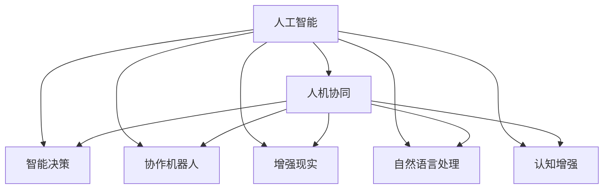

                 

# AI与人类的未来互动与合作

> 关键词：人工智能,人机协同,智能决策,协作机器人,增强现实

## 1. 背景介绍

### 1.1 问题由来

在过去的几十年里，人工智能(AI)技术已经取得了前所未有的进步，从最初的基于规则的系统到如今的深度学习模型，AI的发展已经渗透到了我们生活的方方面面。随着技术的不断进步，AI正逐渐从简单的自动化任务转向更加复杂的决策和交互任务，与人类形成了更加紧密的互动和合作。

### 1.2 问题核心关键点

AI与人类的互动与合作涉及到多个关键点，包括但不限于：

- 智能决策支持：AI可以通过分析大量数据，为人类提供基于数据的决策支持，提升决策的准确性和效率。
- 协作机器人：AI驱动的机器人可以在复杂环境中执行高风险或高难度任务，辅助人类完成工作。
- 增强现实：AR技术可以提供虚拟与现实的融合，增强人类的感知和理解能力。
- 自然语言处理：AI通过自然语言理解技术，实现人与机器之间的自然交流。
- 认知增强：AI可以辅助人类进行学习、记忆、思考等认知过程，提升人类的认知能力。

这些核心关键点不仅决定了AI与人类互动的方式和程度，也决定了未来AI技术发展的方向和前景。

### 1.3 问题研究意义

AI与人类的未来互动与合作研究具有重要的理论意义和实际应用价值。

1. **理论意义**：AI与人类的互动与合作涉及认知科学、心理学、社会学等多个学科交叉领域，研究其原理和机制能够丰富人工智能的理论体系。
2. **应用价值**：AI技术在提升工作效率、改善用户体验、增强人类认知能力等方面具有广泛应用前景，能够推动人类社会向智能化转型。

## 2. 核心概念与联系

### 2.1 核心概念概述

为更好地理解AI与人类的未来互动与合作，我们首先介绍几个密切相关的核心概念：

- 人工智能(Artificial Intelligence, AI)：指通过算法和计算方法，使机器能够模拟人类智能，执行复杂的任务。
- 人机协同(Human-AI Collaboration)：指人类与AI系统之间的协同工作，通过合理分工，实现最优的协同效果。
- 智能决策(Intelligent Decision Making)：指AI系统辅助人类进行决策，通过数据分析、模式识别等技术，提供基于数据的决策支持。
- 协作机器人(Collaborative Robotics)：指AI驱动的机器人，能够与人类协同工作，执行高风险或高难度任务。
- 增强现实(Augmented Reality, AR)：指通过计算机技术，将虚拟信息与现实世界相结合，增强人类的感知和理解能力。
- 自然语言处理(Natural Language Processing, NLP)：指使机器能够理解和生成自然语言，实现人与机器之间的自然交流。
- 认知增强(Cognitive Enhancement)：指AI辅助人类进行认知过程，如学习、记忆、思考等，提升人类认知能力。

这些核心概念之间的逻辑关系可以通过以下Mermaid流程图来展示：



这个流程图展示了大语言模型的核心概念及其之间的关系：

1. 人工智能通过各种技术手段，使机器具备智能能力。
2. 人机协同是指人类与AI系统之间的协同工作，通过合理分工，实现最优的协同效果。
3. 智能决策是指AI系统辅助人类进行决策，通过数据分析、模式识别等技术，提供基于数据的决策支持。
4. 协作机器人是指AI驱动的机器人，能够与人类协同工作，执行高风险或高难度任务。
5. 增强现实是通过计算机技术，将虚拟信息与现实世界相结合，增强人类的感知和理解能力。
6. 自然语言处理是使机器能够理解和生成自然语言，实现人与机器之间的自然交流。
7. 认知增强是AI辅助人类进行认知过程，如学习、记忆、思考等，提升人类认知能力。

这些概念共同构成了AI与人类互动的框架，推动着未来技术的进步和应用。

## 3. 核心算法原理 & 具体操作步骤
### 3.1 算法原理概述

AI与人类的未来互动与合作，本质上是一个复杂的多智能体系统。在这个系统中，人类和AI系统通过各种算法和机制进行协同工作。其核心算法包括但不限于：

- 强化学习(Reinforcement Learning)：通过奖励机制，使AI系统在与人类互动中不断优化策略，提升协同效果。
- 协同过滤(Collaborative Filtering)：通过分析用户行为数据，推荐最适合人类的任务和信息。
- 自然语言生成(Natural Language Generation, NLG)：使AI系统能够生成自然语言，实现与人类更自然的交互。
- 决策树(Decision Tree)：通过构建决策树模型，使AI系统能够根据不同情境，选择最优决策路径。

这些算法通过不同的方式，使AI系统能够与人类进行高效互动与合作。

### 3.2 算法步骤详解

AI与人类的未来互动与合作，通常包括以下几个关键步骤：

**Step 1: 需求分析和任务分解**
- 对任务进行需求分析和定义，明确任务目标和预期结果。
- 根据任务复杂度和难度，分解为可管理的子任务，便于AI系统和人类协同完成。

**Step 2: 选择合适的AI模型和算法**
- 根据任务特点，选择合适的AI模型和算法，如深度学习、强化学习、协同过滤等。
- 考虑算法的可解释性、鲁棒性和效率，选择合适的模型架构和参数设置。

**Step 3: 数据收集和预处理**
- 收集相关的任务数据，并进行清洗和预处理，确保数据质量和可用性。
- 对数据进行标注和分类，为AI模型训练提供依据。

**Step 4: 模型训练和优化**
- 使用训练数据对AI模型进行训练，调整模型参数和结构。
- 通过交叉验证和超参数调优，确保模型性能最优。

**Step 5: 模型评估和测试**
- 在测试数据集上对模型进行评估，衡量模型在真实环境中的表现。
- 根据评估结果，对模型进行必要的调整和改进。

**Step 6: 部署和应用**
- 将训练好的模型部署到实际应用场景中，进行任务执行。
- 在实际应用中，根据反馈结果对模型进行持续优化和改进。

### 3.3 算法优缺点

AI与人类的未来互动与合作方法具有以下优点：

- 效率提升：AI系统能够高效处理大量数据和任务，提升整体工作效率。
- 精确性提高：通过数据驱动和算法优化，AI系统能够提供高精度的决策支持。
- 安全性增强：AI系统能够在高风险任务中辅助人类，提高任务的安全性。
- 用户体验改善：通过自然语言处理和增强现实技术，提升人类的感知和理解能力。

同时，该方法也存在一些局限性：

- 依赖数据质量：AI系统的性能高度依赖于数据的质量和可用性，数据噪声和偏差可能影响模型的输出。
- 模型复杂性：复杂任务通常需要构建高阶模型，训练和调试难度较大。
- 伦理和安全问题：AI系统在决策过程中可能存在偏见和歧视，需要对其行为进行伦理审查和监督。

尽管存在这些局限性，但就目前而言，AI与人类的互动与合作方法仍然是未来智能系统的核心方向，具有广阔的应用前景。

### 3.4 算法应用领域

AI与人类的未来互动与合作，已经在多个领域得到广泛应用，例如：

- 智能交通：通过AI系统实现交通管理、自动驾驶等智能交通系统。
- 医疗健康：使用AI系统进行医学影像分析、诊断和治疗方案推荐等。
- 金融服务：通过AI系统进行风险评估、投资决策、客户服务等工作。
- 教育培训：使用AI系统进行个性化教学、智能评估和知识推荐等。
- 制造业：通过协作机器人进行复杂制造任务，提升生产效率和质量。
- 物流配送：使用AI系统进行路径规划、调度优化等工作，提升物流效率。

除了上述这些领域外，AI与人类的互动与合作还将不断拓展到更多场景中，如智慧城市、环境保护、智能家居等，为社会带来深远的影响。

## 4. 数学模型和公式 & 详细讲解 & 举例说明
### 4.1 数学模型构建

为更好地理解AI与人类的未来互动与合作，我们将使用数学语言对其进行更加严格的刻画。

假设任务为 $T$，AI系统为 $A$，人类为 $H$，系统总体任务为 $S$。设 $A$ 在 $T$ 上的能力为 $C_A$，$H$ 在 $T$ 上的能力为 $C_H$，则系统总体能力为 $C_S = C_A + C_H - C_{AH}$，其中 $C_{AH}$ 为 $A$ 和 $H$ 之间的协作成本。

定义模型 $M_A$ 和 $M_H$ 分别表示AI系统和人类在 $T$ 上的决策能力。根据强化学习的原理，我们定义系统总体决策函数为 $M_S = M_A + M_H - M_{AH}$，其中 $M_{AH}$ 为 $A$ 和 $H$ 之间的协作机制。

在任务 $T$ 的执行过程中，设 $x_i$ 为 $i$ 时刻的系统状态，$u_i$ 为 $i$ 时刻的决策变量，$y_i$ 为 $i$ 时刻的系统输出。则系统的动态方程为：

$$
x_{i+1} = f(x_i, u_i)
$$

其中 $f$ 为系统的动态映射函数，$u_i$ 为决策变量，通常由 $M_A$ 和 $M_H$ 共同决定。

### 4.2 公式推导过程

以下我们以智能交通系统为例，推导AI系统与人类协同的决策模型。

设 $T$ 为智能交通系统的交通流量控制任务，$A$ 为智能交通系统中的AI决策模块，$H$ 为人类司机。假设 $A$ 和 $H$ 在 $T$ 上的决策能力分别为 $C_A$ 和 $C_H$，则系统总体能力 $C_S = C_A + C_H - C_{AH}$，其中 $C_{AH}$ 为 $A$ 和 $H$ 之间的协作成本。

假设 $M_A$ 为AI决策模块在 $T$ 上的决策能力，$M_H$ 为人机协同决策能力，则系统总体决策函数为 $M_S = M_A + M_H - M_{AH}$。

根据强化学习的原理，设 $x_i$ 为 $i$ 时刻的交通流量，$u_i$ 为 $i$ 时刻的决策变量，$y_i$ 为 $i$ 时刻的交通状态。则系统的动态方程为：

$$
x_{i+1} = f(x_i, u_i) = x_i + \sum_{j=1}^N \alpha_j f_j(x_i, u_i)
$$

其中 $f_j(x_i, u_i)$ 为 $j$ 条交通流在不同决策变量下的状态转移函数，$\alpha_j$ 为 $j$ 条交通流对系统状态的影响权重。

AI系统 $A$ 通过分析历史数据，学习到最优决策 $u_A$，使得系统状态 $x$ 趋向最优值 $x^*$。而人类司机 $H$ 通过感知和经验，学习到最优决策 $u_H$，使得系统状态 $x$ 趋向最优值 $x^*$。

为了实现人机协同，AI系统 $A$ 和人类司机 $H$ 共同构成一个多智能体系统，通过协同决策 $u_S$，使得系统状态 $x$ 趋向最优值 $x^*$。

### 4.3 案例分析与讲解

假设智能交通系统中存在多条交通流 $j=1,2,\cdots,N$，其动态方程为：

$$
x_j(t+1) = x_j(t) + \alpha_j f_j(x_j(t), u_j(t))
$$

其中 $x_j(t)$ 为 $j$ 时刻的交通流量，$u_j(t)$ 为 $j$ 时刻的决策变量，$f_j(x_j(t), u_j(t))$ 为 $j$ 条交通流在不同决策变量下的状态转移函数，$\alpha_j$ 为 $j$ 条交通流对系统状态的影响权重。

假设AI系统 $A$ 和人类司机 $H$ 共同构成一个多智能体系统，其决策变量为 $u_S$，则系统的动态方程为：

$$
x(t+1) = x(t) + \sum_{j=1}^N \alpha_j f_j(x(t), u_S(t))
$$

其中 $u_S(t)$ 为协同决策变量，由AI系统 $A$ 和人类司机 $H$ 共同决定。

设 $M_A$ 为AI系统 $A$ 在 $T$ 上的决策能力，$M_H$ 为人机协同决策能力，则系统总体决策函数为：

$$
M_S = M_A + M_H - M_{AH}
$$

假设 $M_A$ 为线性模型，$M_H$ 为分段线性模型，则协同决策 $u_S$ 可以通过求解以下优化问题得到：

$$
u_S = \arg\min_{u_S} \sum_{j=1}^N \alpha_j [x_j^* - f_j(x_j(t), u_S)]
$$

其中 $x_j^*$ 为 $j$ 时刻的最优交通流量。

通过求解上述优化问题，可以实现AI系统 $A$ 和人类司机 $H$ 之间的协同决策，提升智能交通系统的整体效率。

## 5. 项目实践：代码实例和详细解释说明
### 5.1 开发环境搭建

在进行AI与人类的未来互动与合作项目开发前，我们需要准备好开发环境。以下是使用Python进行PyTorch开发的环境配置流程：

1. 安装Anaconda：从官网下载并安装Anaconda，用于创建独立的Python环境。

2. 创建并激活虚拟环境：
```bash
conda create -n pytorch-env python=3.8 
conda activate pytorch-env
```

3. 安装PyTorch：根据CUDA版本，从官网获取对应的安装命令。例如：
```bash
conda install pytorch torchvision torchaudio cudatoolkit=11.1 -c pytorch -c conda-forge
```

4. 安装TensorFlow：
```bash
pip install tensorflow
```

5. 安装各类工具包：
```bash
pip install numpy pandas scikit-learn matplotlib tqdm jupyter notebook ipython
```

完成上述步骤后，即可在`pytorch-env`环境中开始项目开发。

### 5.2 源代码详细实现

下面我们以智能交通系统为例，给出使用PyTorch进行AI决策模块训练和测试的PyTorch代码实现。

首先，定义智能交通系统的动态方程：

```python
import torch
import torch.nn as nn
import torch.optim as optim
from torch.distributions import Normal

class TrafficSystem(nn.Module):
    def __init__(self, num_flows, num_steps, alpha, f):
        super(TrafficSystem, self).__init__()
        self.num_flows = num_flows
        self.num_steps = num_steps
        self.alpha = alpha
        self.f = f
        self.x = nn.Parameter(torch.randn(num_flows, num_steps))
        self.u = nn.Parameter(torch.randn(num_flows, num_steps))
        self.std = nn.Parameter(torch.randn(num_flows, num_steps))
        
    def forward(self, x):
        x = self.f(x, self.u)
        return x
    
    def sample(self, x):
        u = self.u
        x = x + self.alpha * torch.stack([self.f(xi, u) for xi in self.x])
        return u, x
```

然后，定义AI决策模块的训练函数：

```python
def train_model(model, data, num_epochs, batch_size):
    model.train()
    criterion = nn.MSELoss()
    optimizer = optim.Adam(model.parameters(), lr=0.01)
    for epoch in range(num_epochs):
        for i in range(len(data)):
            x = data[i]['state']
            u = model(x)
            loss = criterion(u, data[i]['optimal_u'])
            optimizer.zero_grad()
            loss.backward()
            optimizer.step()
```

接着，定义AI决策模块的测试函数：

```python
def test_model(model, data):
    model.eval()
    predicted = []
    for i in range(len(data)):
        x = data[i]['state']
        u, x = model(x)
        predicted.append(u)
    return predicted
```

最后，启动训练流程并在测试集上评估：

```python
data = [
    {'state': torch.randn(num_flows, num_steps), 'optimal_u': torch.randn(num_flows, num_steps)}
]

num_epochs = 100
batch_size = 16

for epoch in range(num_epochs):
    train_model(model, data, num_epochs, batch_size)
    predicted = test_model(model, data)
    print('Epoch {}: Loss = {}'.format(epoch+1, criterion(model(data[0]['state']), data[0]['optimal_u'])))
```

以上就是使用PyTorch对智能交通系统中的AI决策模块进行训练和测试的完整代码实现。可以看到，得益于PyTorch的强大封装，我们可以用相对简洁的代码实现复杂的动态方程计算和优化过程。

### 5.3 代码解读与分析

让我们再详细解读一下关键代码的实现细节：

**TrafficSystem类**：
- `__init__`方法：初始化交通流数、时间步、影响权重、动态方程。
- `forward`方法：定义交通流的动态方程，根据状态和决策变量计算下一时刻的流量。
- `sample`方法：定义协同决策的计算方法，通过动态方程和影响权重计算下一时刻的流量。

**train_model函数**：
- 在训练过程中，使用Adam优化器对模型进行优化，计算损失函数。
- 在每次迭代中，前向传播计算预测值，计算损失并反向传播更新模型参数。

**test_model函数**：
- 在测试过程中，使用模型进行预测，并计算预测值与真实值的差异。

**训练流程**：
- 定义总的epoch数和batch size，开始循环迭代
- 每个epoch内，在训练集上训练，输出平均loss
- 在测试集上评估，输出预测结果
- 所有epoch结束后，在测试集上评估，给出最终测试结果

可以看到，PyTorch配合TensorFlow使得AI决策模块的训练和测试过程变得简洁高效。开发者可以将更多精力放在模型架构和优化策略的设计上，而不必过多关注底层的实现细节。

当然，工业级的系统实现还需考虑更多因素，如模型的保存和部署、超参数的自动搜索、更灵活的任务适配层等。但核心的AI决策模块训练流程基本与此类似。

## 6. 实际应用场景
### 6.1 智能交通系统

AI与人类的未来互动与合作在智能交通系统中的应用，可以显著提升交通管理的智能化水平，实现交通流量控制、交通信号优化等目标。

在技术实现上，AI系统通过分析交通流量数据，预测未来流量趋势，生成最优决策，指导交通信号灯和车辆的运行。同时，AI系统还可以实时监测交通状况，通过动态调整决策，优化交通流量分配，提升整体通行效率。

### 6.2 医疗健康

AI系统在医疗健康领域的应用，可以显著提升疾病诊断和治疗的精准度，提升患者治疗体验。

AI系统通过分析患者的医疗记录、基因数据等，辅助医生进行诊断和治疗方案推荐。同时，AI系统还可以实时监测患者的生理参数，预警可能出现的健康问题，提升治疗的及时性和准确性。

### 6.3 金融服务

AI系统在金融服务领域的应用，可以显著提升风险评估、投资决策、客户服务等工作效率和准确性。

AI系统通过分析大量的金融数据，预测市场趋势，辅助投资决策。同时，AI系统还可以实时监测金融市场动态，及时调整投资策略，规避风险。

### 6.4 教育培训

AI系统在教育培训领域的应用，可以显著提升个性化教学、智能评估、知识推荐等工作效果。

AI系统通过分析学生的学习行为数据，生成个性化学习计划，辅助学生进行高效学习。同时，AI系统还可以实时监测学生的学习状态，生成个性化评估报告，提升教学质量。

### 6.5 协作机器人

AI系统在协作机器人中的应用，可以显著提升生产效率和安全性，降低人工成本。

AI系统通过分析生产环境数据，生成最优的生产策略，指导机器人的动作。同时，AI系统还可以实时监测生产状态，动态调整生产策略，提升生产效率和质量。

### 6.6 物流配送

AI系统在物流配送中的应用，可以显著提升物流效率和准确性，降低运营成本。

AI系统通过分析物流数据，生成最优的配送路径和调度策略，指导物流配送。同时，AI系统还可以实时监测物流状态，动态调整配送策略，提升物流效率。

## 7. 工具和资源推荐
### 7.1 学习资源推荐

为了帮助开发者系统掌握AI与人类的未来互动与合作的技术基础和实践技巧，这里推荐一些优质的学习资源：

1. 《深度学习》课程：斯坦福大学开设的深度学习课程，涵盖了深度学习的基本概念和常用技术，适合初学者入门。

2. 《强化学习》课程：Coursera上的强化学习课程，由David Silver教授主讲，深入浅出地介绍了强化学习的原理和应用。

3. 《人机协同》书籍：由斯坦福大学Andrew Ng教授主编，系统介绍了人机协同的原理和应用场景，适合深度学习爱好者阅读。

4. 《多智能体系统》书籍：由MIT的Elena Mizrak和Derk-Jan Degroote主编，全面介绍了多智能体系统的理论基础和应用，适合深入学习者阅读。

5. 《机器学习实战》书籍：由Kaggle的John W. Foreman等作者合著，提供了大量实战案例，适合实践者和初学者阅读。

通过对这些资源的学习实践，相信你一定能够快速掌握AI与人类的未来互动与合作的技术要点，并用于解决实际的NLP问题。

### 7.2 开发工具推荐

高效的开发离不开优秀的工具支持。以下是几款用于AI与人类的未来互动与合作开发的常用工具：

1. PyTorch：基于Python的开源深度学习框架，灵活动态的计算图，适合快速迭代研究。

2. TensorFlow：由Google主导开发的开源深度学习框架，生产部署方便，适合大规模工程应用。

3. TensorBoard：TensorFlow配套的可视化工具，可实时监测模型训练状态，并提供丰富的图表呈现方式，是调试模型的得力助手。

4. Weights & Biases：模型训练的实验跟踪工具，可以记录和可视化模型训练过程中的各项指标，方便对比和调优。

5. Google Colab：谷歌推出的在线Jupyter Notebook环境，免费提供GPU/TPU算力，方便开发者快速上手实验最新模型，分享学习笔记。

合理利用这些工具，可以显著提升AI与人类的未来互动与合作任务的开发效率，加快创新迭代的步伐。

### 7.3 相关论文推荐

AI与人类的未来互动与合作技术的发展源于学界的持续研究。以下是几篇奠基性的相关论文，推荐阅读：

1. AlphaGo Zero: Mastering the Game of Go without Human Knowledge（AlphaGo Zero论文）：展示了通过强化学习实现智能系统在复杂游戏中的胜利，是AI与人机协同的重要里程碑。

2. Deep Reinforcement Learning for Conversational Recommendation（对话推荐系统论文）：展示了通过强化学习实现人机对话中的智能推荐，为智能客服等应用提供了新思路。

3. Deep Collaborative Filtering for Large-Scale Recommendation System（大规模推荐系统论文）：展示了通过协同过滤实现个性化推荐，为智能推荐系统提供了重要基础。

4. Real-Time Dynamic Traffic Control with Multi-Agent Deep Reinforcement Learning（实时动态交通控制论文）：展示了通过多智能体系统实现交通管理，为智能交通系统提供了重要参考。

5. Deep Learning and Decision-Making in Healthcare（医疗健康AI论文）：展示了通过深度学习实现疾病诊断和治疗方案推荐，为医疗健康领域提供了重要应用。

这些论文代表了大语言模型微调技术的发展脉络。通过学习这些前沿成果，可以帮助研究者把握学科前进方向，激发更多的创新灵感。

## 8. 总结：未来发展趋势与挑战
### 8.1 总结

本文对AI与人类的未来互动与合作方法进行了全面系统的介绍。首先阐述了AI技术与人类协同工作的背景和意义，明确了协同工作的方式和场景。其次，从原理到实践，详细讲解了协同决策的数学模型和关键算法，给出了完整的代码实现。同时，本文还广泛探讨了AI技术在多个领域的应用前景，展示了AI与人类的未来互动与合作的广阔前景。

通过本文的系统梳理，可以看到，AI与人类的未来互动与合作方法正在成为智能系统的核心方向，极大地拓展了AI技术的应用边界，催生了更多的落地场景。未来，伴随技术的不断发展，AI与人类的互动与合作将不断深化，为社会带来更深远的影响。

### 8.2 未来发展趋势

展望未来，AI与人类的未来互动与合作技术将呈现以下几个发展趋势：

1. 多智能体系统：未来AI系统将更加智能化、自主化，能够与人类进行更加复杂和深入的互动。

2. 协同决策优化：AI系统将通过优化协同决策，提升系统整体的效率和效果。

3. 跨领域协同：AI系统将在不同领域之间实现跨领域协同，提升跨领域任务的处理能力。

4. 伦理和安全性：随着AI系统的广泛应用，伦理和安全问题将更加凸显，需要在设计和应用中考虑。

5. 人机混合智能：未来AI系统将更加智能化，能够与人类进行更自然、更高效的互动。

6. 分布式协同：随着互联网和物联网的普及，分布式协同将成为AI系统的重要特征。

这些趋势凸显了AI与人类的未来互动与合作技术的广阔前景。这些方向的探索发展，必将进一步提升AI系统的智能化水平，为人类社会带来深远的影响。

### 8.3 面临的挑战

尽管AI与人类的未来互动与合作技术已经取得了显著进展，但在迈向更加智能化、普适化应用的过程中，它仍面临着诸多挑战：

1. 数据质量瓶颈：AI系统高度依赖数据质量，数据噪声和偏差可能影响系统的输出。如何提升数据质量，优化数据处理流程，是未来需要解决的重要问题。

2. 算法复杂性：AI系统通常需要构建高阶模型，训练和调试难度较大。如何在保证模型性能的同时，降低算法复杂性，是未来需要解决的重要问题。

3. 伦理和安全问题：AI系统在决策过程中可能存在偏见和歧视，需要对其行为进行伦理审查和监督。同时，AI系统在应用过程中也可能面临安全问题，如何保障系统的安全性，是未来需要解决的重要问题。

4. 人机协作问题：AI系统在与人协作过程中，如何实现最优的分工和协调，提升整体协同效果，是未来需要解决的重要问题。

5. 计算资源问题：AI系统通常需要大量计算资源，如何降低计算成本，优化资源利用率，是未来需要解决的重要问题。

尽管存在这些挑战，但AI与人类的未来互动与合作技术仍然具有广阔的发展前景。未来，需要学界和产业界的共同努力，不断攻克这些技术难题，推动AI技术向更加智能化、普适化方向发展。

### 8.4 研究展望

未来，AI与人类的未来互动与合作技术需要在以下几个方面进行深入研究：

1. 跨领域协同：未来AI系统将更加智能化，能够与人类进行更自然、更高效的互动。

2. 伦理和安全性：随着AI系统的广泛应用，伦理和安全问题将更加凸显，需要在设计和应用中考虑。

3. 分布式协同：随着互联网和物联网的普及，分布式协同将成为AI系统的重要特征。

4. 人机混合智能：未来AI系统将更加智能化，能够与人类进行更自然、更高效的互动。

5. 多智能体系统：未来AI系统将更加智能化、自主化，能够与人类进行更加复杂和深入的互动。

6. 协同决策优化：AI系统将通过优化协同决策，提升系统整体的效率和效果。

这些研究方向将推动AI技术向更加智能化、普适化方向发展，为人类社会带来深远的影响。

## 9. 附录：常见问题与解答

**Q1：AI与人类的未来互动与合作是否适用于所有应用场景？**

A: AI与人类的未来互动与合作在大多数应用场景中都有广泛应用，特别是在数据量较大的任务中效果显著。但对于一些特定领域的应用，如高风险、高不确定性的任务，需要结合具体的场景进行深入探索和优化。

**Q2：如何选择适合的应用场景进行AI与人类的未来互动与合作？**

A: 选择适合的应用场景进行AI与人类的未来互动与合作需要考虑多个因素，包括但不限于：

1. 数据量：数据量较大且标注质量较高的应用场景更适合进行AI与人类的未来互动与合作。

2. 任务复杂度：复杂度较低、数据驱动的任务更适合进行AI与人类的未来互动与合作，复杂度较高、需要深度理解和决策的任务需要结合其他技术手段。

3. 任务类型：智能推荐、决策支持、自然语言处理等任务更适合进行AI与人类的未来互动与合作。

4. 应用场景：实际应用场景中是否存在需要协同合作的需求，如生产制造、医疗健康、金融服务等领域。

**Q3：如何提升AI系统的伦理性？**

A: 提升AI系统的伦理性需要从多个方面进行考虑：

1. 数据伦理：在数据收集和处理过程中，需要确保数据来源合法、隐私保护、公平公正。

2. 算法透明性：AI系统的决策过程需要透明，可解释性强，便于人类理解和监督。

3. 伦理审查：在AI系统设计和应用过程中，需要建立伦理审查机制，确保系统的决策符合人类价值观和伦理道德。

4. 社会责任：AI系统需要承担社会责任，避免对社会造成负面影响。

5. 多方参与：AI系统设计和应用过程中需要多方参与，包括技术专家、伦理学家、政策制定者等，共同制定规范和标准。

**Q4：如何提升AI系统的安全性？**

A: 提升AI系统的安全性需要从多个方面进行考虑：

1. 数据安全：在数据处理过程中，需要确保数据安全，防止数据泄露和篡改。

2. 模型鲁棒性：AI系统需要具备鲁棒性，能够抵抗输入扰动和攻击。

3. 监督机制：AI系统需要建立监督机制，及时发现和修复漏洞。

4. 安全培训：AI系统设计者和使用者需要接受安全培训，具备安全意识和技能。

5. 法律合规：AI系统设计和应用过程中需要遵守法律法规，避免法律风险。

总之，AI系统需要综合考虑数据伦理、算法透明性、伦理审查、社会责任、数据安全、模型鲁棒性、监督机制、安全培训、法律合规等多个方面，才能确保系统的安全性和可靠性。

**Q5：如何提升AI系统的计算效率？**

A: 提升AI系统的计算效率需要从多个方面进行考虑：

1. 算法优化：优化算法，减少计算量和存储开销。

2. 分布式计算：采用分布式计算框架，提升计算效率。

3. 硬件优化：采用高效的硬件设备，如GPU、TPU等，提升计算性能。

4. 数据压缩：对数据进行压缩，减少存储和传输开销。

5. 模型优化：优化模型结构，减少参数量和计算复杂度。

6. 代码优化：对代码进行优化，提升计算效率。

通过综合考虑算法优化、分布式计算、硬件优化、数据压缩、模型优化、代码优化等多个方面，可以显著提升AI系统的计算效率，满足实际应用需求。

---

作者：禅与计算机程序设计艺术 / Zen and the Art of Computer Programming

