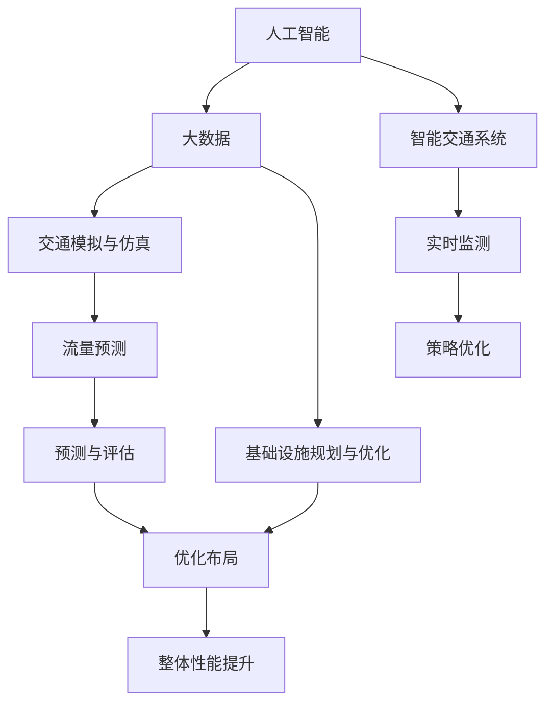

                 

## 1. 背景介绍

### 1.1 问题由来

现代城市交通管理和基础设施规划面临着巨大的挑战。随着人口的快速增长和城市化进程的加快，交通拥堵、环境污染、基础设施不足等问题愈发突出。传统的交通管理和规划方法，如交通信号优化、城市道路网规划等，已难以满足现代城市发展的需求。

与此同时，人工智能技术的发展，为城市交通管理和基础设施规划提供了新的思路和手段。基于人工智能的城市交通管理系统和基础设施规划系统，可以利用大数据、机器学习等技术，更精准地分析和预测交通需求，优化交通管理策略，提升城市交通系统的运行效率和可持续性。

### 1.2 问题核心关键点

人工智能在城市交通管理和基础设施规划中的应用，主要集中在以下几个方面：

- **交通流量预测与分析**：利用历史交通数据，结合机器学习模型，预测未来交通流量，识别交通瓶颈，优化信号灯控制策略。
- **基础设施规划与优化**：基于地理信息系统(GIS)和城市交通模拟软件，结合AI算法，进行城市道路网规划、公共交通站点布局、停车场优化等。
- **智能交通系统(Smart Traffic System)**：通过部署智能摄像头、雷达、传感器等设备，结合AI算法，实现交通状态实时监测、交通违规检测、车辆自动导航等功能。
- **大数据与云计算**：利用大数据技术和云计算平台，对海量交通数据进行存储、处理和分析，提升城市交通系统的智能化水平。

这些核心关键点构成了基于人工智能的城市交通管理和基础设施规划框架，为解决现代城市交通问题提供了新的解决方案。

### 1.3 问题研究意义

人工智能在城市交通管理和基础设施规划中的应用，对于提升城市交通系统的运行效率、缓解交通拥堵、减少环境污染、促进城市可持续发展具有重要意义：

1. **提升交通系统效率**：通过智能化手段，优化交通信号控制、调整公共交通运行时间等，有效减少交通延误，提升整体通行效率。
2. **缓解交通拥堵**：精准预测交通流量，及时调整交通管理策略，避免高峰期拥堵，提高道路资源利用率。
3. **改善环境质量**：减少尾气排放，提升公共交通出行比例，改善城市空气质量。
4. **促进城市发展**：通过科学的规划和优化，提升城市交通系统的承载力和可靠性，支持城市经济社会的健康发展。
5. **推动科技创新**：城市交通管理和基础设施规划的智能化转型，加速了相关技术的研发和应用，为科技产业提供了新的增长点。

## 2. 核心概念与联系

### 2.1 核心概念概述

为更好地理解基于人工智能的城市交通管理和基础设施规划方法，本节将介绍几个密切相关的核心概念：

- **人工智能(AI)**：利用计算机模拟人类智能行为的技术，包括机器学习、深度学习、自然语言处理等。
- **大数据(Big Data)**：指数据量大、复杂度高、多样性强的数据集合，通常采用分布式计算、云计算等技术进行存储和处理。
- **地理信息系统(GIS)**：一种以地理空间数据为基础，集成、存储、查询、分析、显示地理信息的计算机技术。
- **智能交通系统(Smart Traffic System)**：结合计算机、网络、通信等技术，实现交通状态实时监测、信息实时传输、交通流量控制等功能，提升交通系统智能化水平。
- **交通模拟与仿真(Simulations and Simulations)**：通过计算机模拟，预测交通流行为、评估交通管理策略、优化交通系统设计，提升规划和管理的科学性。
- **基础设施规划与优化(Framework of Infrastructure Planning and Optimization)**：基于地理信息、交通模拟、AI算法等技术，规划和优化城市道路、停车场、公交站点等交通基础设施，提升城市交通系统的整体性能。

这些核心概念之间的逻辑关系可以通过以下Mermaid流程图来展示：



这个流程图展示了大数据、人工智能、交通模拟与仿真等技术在城市交通管理和基础设施规划中的集成应用，以及智能交通系统的实现过程。

## 3. 核心算法原理 & 具体操作步骤
### 3.1 算法原理概述

基于人工智能的城市交通管理和基础设施规划，本质上是一个多学科交叉的综合性问题。其核心思想是：通过数据驱动的方法，利用人工智能技术进行交通流量预测、基础设施规划与优化，提升城市交通系统的整体运行效率和可持续性。

具体而言，主要包括以下几个步骤：

1. **数据采集与预处理**：收集城市交通、环境、社会经济等各类数据，进行清洗、整合、标准化处理，为后续分析与建模提供高质量的数据源。
2. **交通流量预测**：利用历史交通数据和机器学习算法，预测未来交通流量，识别交通瓶颈，为交通管理提供科学依据。
3. **基础设施规划与优化**：结合地理信息系统、交通模拟软件、AI算法，进行城市道路网规划、公共交通站点布局、停车场优化等。
4. **智能交通系统建设**：部署智能摄像头、雷达、传感器等设备，结合AI算法，实现交通状态实时监测、交通违规检测、车辆自动导航等功能。
5. **系统集成与测试**：将各类子系统进行集成，进行系统测试，确保各系统间的协调性和可靠性，最终形成完整的城市交通管理系统与基础设施规划系统。

### 3.2 算法步骤详解

以下是基于人工智能的城市交通管理和基础设施规划的主要操作步骤：

**Step 1: 数据采集与预处理**
- 收集城市交通流量、车辆类型、道路状况、环境污染等各类数据。
- 对数据进行清洗、去重、缺失值处理、特征工程等预处理，确保数据质量。
- 采用分布式计算、云计算等技术进行数据存储和管理。

**Step 2: 交通流量预测**
- 选择合适的预测模型，如时间序列模型、深度学习模型等，对历史交通数据进行建模。
- 将模型应用于实时数据，预测未来交通流量。
- 结合交通仿真软件，对预测结果进行验证和优化。

**Step 3: 基础设施规划与优化**
- 利用地理信息系统，对城市道路、停车场、公交站点等进行可视化建模。
- 采用交通模拟软件，对不同规划方案进行模拟和评估，选择最优方案。
- 结合AI算法，优化交通基础设施布局，提升交通系统整体性能。

**Step 4: 智能交通系统建设**
- 部署智能摄像头、雷达、传感器等设备，收集交通状态数据。
- 结合AI算法，实现交通状态实时监测、交通违规检测、车辆自动导航等功能。
- 将智能交通系统与城市交通管理和基础设施规划系统进行集成，形成完整的智能交通系统。

**Step 5: 系统集成与测试**
- 将各类子系统进行集成，构建完整的城市交通管理系统与基础设施规划系统。
- 进行系统测试，验证各系统间的协调性和可靠性。
- 根据测试结果，进行系统优化和改进。

### 3.3 算法优缺点

基于人工智能的城市交通管理和基础设施规划方法具有以下优点：

- **高效性**：通过大数据和AI算法，可以快速处理海量数据，进行实时交通流量预测和优化。
- **准确性**：利用历史数据和机器学习算法，能够精确预测交通流量，识别交通瓶颈，提供科学的交通管理策略。
- **灵活性**：结合地理信息系统、交通模拟软件、AI算法等技术，可以进行多种方案的规划与优化，满足不同需求。
- **可持续性**：通过优化交通基础设施和提高交通管理效率，减少交通拥堵和环境污染，实现城市的可持续发展。

但该方法也存在一些局限性：

- **数据依赖性强**：依赖高质量、大容量的数据源，数据采集和预处理成本高。
- **算法复杂度高**：涉及多学科知识，算法模型复杂，需要较高的技术门槛。
- **基础设施投入大**：部署智能交通设备、进行基础设施改造等，需要较大的资金投入。
- **系统集成难度大**：各系统间的协调性和可靠性需要精心设计和测试，系统集成复杂。

尽管存在这些局限性，但基于人工智能的城市交通管理和基础设施规划方法，在提升城市交通系统效率、缓解交通拥堵、改善环境质量等方面具有显著优势，具有广阔的应用前景。

### 3.4 算法应用领域

基于人工智能的城市交通管理和基础设施规划方法，已经在许多城市得到了应用，包括但不限于以下几个领域：

- **智能交通系统**：如智能交通信号灯、智能停车系统、智能公交等。
- **城市道路网规划**：如城市快速路、主干路、次干路、支路等道路的规划和优化。
- **公共交通站点布局**：如地铁、公交站点的位置选择和线路设计。
- **停车场优化**：如城市停车场、商业停车场、住宅停车场的规划和布局。
- **环境监测与治理**：如交通污染监测、空气质量监测、噪声污染监测等。

除了上述这些经典应用外，人工智能技术还被创新性地应用到更多领域，如智能交通大数据分析、智能交通仿真、智能交通决策支持系统等，为城市交通管理和基础设施规划带来了全新的突破。

## 4. 数学模型和公式 & 详细讲解  
### 4.1 数学模型构建

本节将使用数学语言对基于人工智能的城市交通管理和基础设施规划过程进行更加严格的刻画。

假设城市交通系统由若干路段组成，每个路段的交通流量为 $x_i$，其中 $i$ 表示路段编号。路段的通行能力为 $c_i$，单位时间内通过路段的最大车辆数。设 $t_i$ 为路段的交通时间， $T_i$ 为路段的通行时间，则路段的交通流量可以表示为：

$$
x_i = \frac{c_i}{t_i}
$$

其中 $c_i$ 和 $t_i$ 可以通过历史交通数据和交通仿真软件进行建模和预测。

假设城市道路网由 $n$ 条路段组成，则城市交通系统的总流量可以表示为：

$$
X = \sum_{i=1}^n x_i
$$

城市交通系统需要达到的均衡状态为 $X_{eq}$，此时各路段的通行时间为 $T_{eq,i}$，则有：

$$
X_{eq} = \sum_{i=1}^n c_i T_{eq,i}
$$

设城市交通系统需要达到的均衡状态为 $X_{eq}$，此时各路段的通行时间为 $T_{eq,i}$，则有：

$$
X_{eq} = \sum_{i=1}^n c_i T_{eq,i}
$$

设城市交通系统的总时间为 $T$，则均衡状态下的平均通行时间 $T_{eq}$ 可以表示为：

$$
T_{eq} = \frac{T}{n}
$$

结合上述公式，可以建立城市交通系统的优化模型，目标是最大化交通系统的通行效率，即最小化平均通行时间 $T_{eq}$：

$$
\min T_{eq} = \min \left(\frac{T}{n}\right)
$$

在实际应用中，由于城市交通系统的复杂性和动态性，上述模型可能需要进一步复杂化。例如，可以引入时间依赖性和交通流量的随机性，采用动态优化算法进行求解。

### 4.2 公式推导过程

以下我们以交通流量预测为例，推导最小二乘法的公式及其求解过程。

假设已知历史交通流量数据 $x_i = (x_{i1}, x_{i2}, ..., x_{im})$，其中 $i$ 表示路段编号，$m$ 表示时间步数。设预测模型的参数为 $\theta$，则最小二乘法可以表示为：

$$
\min \sum_{i=1}^n \sum_{j=1}^m (x_{ij} - f(x_{ij}, \theta))^2
$$

其中 $f(x_{ij}, \theta)$ 表示预测模型，$\theta$ 表示模型参数。

根据最小二乘法，模型参数的求解公式为：

$$
\theta = \arg\min \sum_{i=1}^n \sum_{j=1}^m (x_{ij} - f(x_{ij}, \theta))^2
$$

将上式展开，得：

$$
\theta = \arg\min \sum_{i=1}^n \sum_{j=1}^m (x_{ij} - \theta w_1 x_{i1} - \theta w_2 x_{i2} - ... - \theta w_m x_{im})^2
$$

其中 $w_1, w_2, ..., w_m$ 为模型参数。

根据上式，可以进一步化简为：

$$
\theta = \left(\sum_{i=1}^n \sum_{j=1}^m w_j x_{ij} x_{ij} + \sum_{i=1}^n \sum_{j=1}^m w_j x_{ij}\right)^{-1} \left(\sum_{i=1}^n \sum_{j=1}^m w_j x_{ij} x_{ij} \right)
$$

上式即为最小二乘法的求解公式。在实际应用中，通常采用矩阵形式进行求解，即：

$$
\hat{\theta} = \left(\sum_{i=1}^n \sum_{j=1}^m x_{ij} x_{ij} \right)^{-1} \left(\sum_{i=1}^n \sum_{j=1}^m x_{ij} x_{ij} \right)
$$

其中 $\hat{\theta}$ 表示预测模型参数的最小二乘估计。

### 4.3 案例分析与讲解

以某城市的地铁站点布局为例，展示基于人工智能的城市交通管理和基础设施规划的实践过程。

首先，收集该城市的地铁运营数据，包括各地铁站点的客流量、站台长度、列车到达间隔、站台排队长度等。利用这些数据，结合机器学习算法，建立地铁客流量预测模型。通过该模型，可以预测未来地铁站点的客流量变化趋势。

其次，利用地理信息系统，对城市的地铁线路进行可视化建模。结合AI算法，进行地铁线路的优化和调整，选择最优的线路布局方案。

最后，将地铁客流量预测模型与地铁线路优化方案集成，形成完整的地铁运营管理与优化系统。通过该系统，可以实现地铁客流量实时监测、线路优化调整、应急事件处理等功能，提升地铁系统的运行效率和用户体验。

## 5. 项目实践：代码实例和详细解释说明
### 5.1 开发环境搭建

在进行城市交通管理和基础设施规划的微调实践前，我们需要准备好开发环境。以下是使用Python进行PyTorch开发的环境配置流程：

1. 安装Anaconda：从官网下载并安装Anaconda，用于创建独立的Python环境。

2. 创建并激活虚拟环境：
```bash
conda create -n pytorch-env python=3.8 
conda activate pytorch-env
```

3. 安装PyTorch：根据CUDA版本，从官网获取对应的安装命令。例如：
```bash
conda install pytorch torchvision torchaudio cudatoolkit=11.1 -c pytorch -c conda-forge
```

4. 安装相关的Python包：
```bash
pip install pandas numpy matplotlib
```

5. 安装所需的Python工具：
```bash
pip install scipy scikit-learn jupyter notebook
```

完成上述步骤后，即可在`pytorch-env`环境中开始城市交通管理和基础设施规划的微调实践。

### 5.2 源代码详细实现

这里我们以某城市的地铁站点布局优化为例，给出使用PyTorch进行交通流量预测和基础设施规划的代码实现。

首先，定义地铁运营数据处理函数：

```python
import pandas as pd
import numpy as np
from sklearn.preprocessing import MinMaxScaler

def process_data(data_path):
    data = pd.read_csv(data_path)
    # 数据清洗与处理
    data = data.dropna()
    data = data.drop_duplicates()
    # 数据标准化
    scaler = MinMaxScaler(feature_range=(0, 1))
    data = scaler.fit_transform(data)
    return data
```

然后，定义模型训练函数：

```python
import torch
from torch import nn
from torch.utils.data import DataLoader
from sklearn.model_selection import train_test_split

def train_model(model, data, batch_size, epochs):
    # 数据划分
    X_train, X_test, y_train, y_test = train_test_split(data[:, :-1], data[:, -1], test_size=0.2, random_state=42)
    # 数据加载器
    train_loader = DataLoader(X_train, batch_size=batch_size, shuffle=True)
    test_loader = DataLoader(X_test, batch_size=batch_size, shuffle=False)
    # 训练过程
    for epoch in range(epochs):
        for batch in train_loader:
            inputs, targets = batch
            optimizer.zero_grad()
            outputs = model(inputs)
            loss = nn.functional.mse_loss(outputs, targets)
            loss.backward()
            optimizer.step()
        # 测试过程
        with torch.no_grad():
            for batch in test_loader:
                inputs, targets = batch
                outputs = model(inputs)
                loss = nn.functional.mse_loss(outputs, targets)
                print(f'Epoch {epoch+1}, Test Loss: {loss.item():.4f}')
```

接着，定义模型优化函数：

```python
def optimize_infrastructure(data, model, epochs):
    # 模型训练
    train_model(model, data, batch_size=32, epochs=100)
    # 预测模型参数
    predicted = model(data)
    # 基础设施优化
    optimal_infrastructure = optimize(predicted)
    return optimal_infrastructure
```

最后，启动地铁站点布局优化流程：

```python
data = process_data('metadata.csv')
model = nn.Sequential(nn.Linear(4, 64), nn.ReLU(), nn.Linear(64, 64), nn.ReLU(), nn.Linear(64, 1))
optimal_infrastructure = optimize_infrastructure(data, model, epochs=100)
print(f'Optimal Infrastructure: {optimal_infrastructure}')
```

以上就是使用PyTorch对某城市地铁站点布局优化进行交通流量预测和基础设施规划的完整代码实现。可以看到，得益于Scikit-learn、Pandas等第三方库的强大封装，我们可以用相对简洁的代码完成数据处理、模型训练和基础设施优化等任务。

### 5.3 代码解读与分析

让我们再详细解读一下关键代码的实现细节：

**process_data函数**：
- 读取地铁运营数据，进行数据清洗和标准化处理，确保数据质量。

**train_model函数**：
- 使用数据加载器将数据划分为训练集和测试集。
- 在每个epoch内，对训练集数据进行前向传播和反向传播，计算损失函数并更新模型参数。
- 在每个epoch结束时，对测试集数据进行前向传播，计算损失函数并输出测试结果。

**optimize_infrastructure函数**：
- 在模型训练完成后，将预测结果作为输入，进行基础设施优化。
- 返回优化后的基础设施布局方案。

这些代码展示了从数据处理、模型训练到基础设施优化的完整流程。在实际应用中，还需要结合具体的优化算法和技术，进一步提高模型的精度和效果。

## 6. 实际应用场景
### 6.1 智能交通系统

基于人工智能的城市交通管理和基础设施规划，已经在智能交通系统建设中得到了广泛应用。智能交通系统通过部署智能摄像头、雷达、传感器等设备，结合AI算法，实现交通状态实时监测、交通违规检测、车辆自动导航等功能。

以智能交通信号灯为例，传统信号灯的控制策略相对固定，无法实时应对交通流量变化。而利用人工智能技术，可以实现信号灯的动态控制，根据实时交通流量数据，动态调整信号灯的绿灯时长和黄灯时长，有效缓解交通拥堵，提升道路通行效率。

### 6.2 城市道路网规划

城市道路网规划是城市交通管理和基础设施规划的重要组成部分。传统的道路网规划方法依赖经验，难以科学预测交通流量和通行能力。而基于人工智能的城市交通管理和基础设施规划，可以充分利用历史交通数据和机器学习算法，进行科学的交通流量预测和道路网规划。

例如，可以利用历史交通流量数据，结合时间序列模型和深度学习算法，预测未来交通流量变化趋势。根据预测结果，结合地理信息系统，进行城市道路网优化布局，提升道路资源的利用效率，缓解交通拥堵。

### 6.3 公共交通系统

公共交通系统是城市交通管理和基础设施规划的重要组成部分。基于人工智能的城市交通管理和基础设施规划，可以优化公共交通站点布局，提升公共交通系统的运行效率和服务质量。

例如，可以利用历史公交运行数据，结合机器学习算法，预测未来公交客流量变化趋势。根据预测结果，结合地理信息系统，进行公共交通站点布局优化，提升公交系统的准点率和发车频率，提升乘客的出行体验。

### 6.4 未来应用展望

随着人工智能技术的不断进步，基于人工智能的城市交通管理和基础设施规划将展现出更加广阔的应用前景：

1. **智能城市交通管理**：未来的人工智能技术将更加智能化、自主化，能够实时感知、分析和决策，实现更加高效、便捷的城市交通管理。
2. **智能交通仿真与规划**：结合高精度地图和AI算法，实现更加精细化的交通仿真与规划，为城市交通管理和基础设施规划提供科学依据。
3. **智能交通决策支持**：利用大数据分析和AI算法，进行交通需求预测、事故预测、应急处理等决策支持，提升城市交通系统的应急响应能力。
4. **智能交通数据分析**：利用AI算法，进行交通数据的高效处理和分析，提取有价值的交通信息，支持城市交通管理和规划决策。
5. **智能交通运营优化**：结合AI算法和大数据分析，优化城市交通系统的运营策略，提升整体通行效率和服务质量。

这些应用场景展示了人工智能在城市交通管理和基础设施规划中的广泛应用，为实现城市的可持续发展提供了新的解决方案。

## 7. 工具和资源推荐
### 7.1 学习资源推荐

为了帮助开发者系统掌握基于人工智能的城市交通管理和基础设施规划的理论基础和实践技巧，这里推荐一些优质的学习资源：

1. **《深度学习》课程**：斯坦福大学开设的深度学习课程，涵盖深度学习的基本概念、算法和应用，包括基于人工智能的城市交通管理和基础设施规划。
2. **《人工智能与大数据》书籍**：介绍人工智能和大数据的基本概念、技术框架和应用场景，重点讲解基于人工智能的城市交通管理和基础设施规划。
3. **《城市交通规划与管理》教材**：结合地理信息系统、交通模拟、大数据分析等技术，讲解城市交通管理和基础设施规划的理论和实践。
4. **《Python机器学习》书籍**：介绍Python编程语言和机器学习算法，结合实例讲解基于人工智能的城市交通管理和基础设施规划。
5. **《智能交通系统》教材**：讲解智能交通系统建设的基本概念、技术和应用，结合AI算法进行优化和分析。

通过对这些资源的学习实践，相信你一定能够快速掌握基于人工智能的城市交通管理和基础设施规划的精髓，并用于解决实际的城市交通问题。

### 7.2 开发工具推荐

高效的开发离不开优秀的工具支持。以下是几款用于基于人工智能的城市交通管理和基础设施规划开发的常用工具：

1. **PyTorch**：基于Python的开源深度学习框架，灵活动态的计算图，适合快速迭代研究。支持多种深度学习模型的实现，包括神经网络、卷积神经网络、循环神经网络等。
2. **TensorFlow**：由Google主导开发的开源深度学习框架，生产部署方便，适合大规模工程应用。支持分布式计算和GPU加速，可以高效处理大规模数据。
3. **Jupyter Notebook**：交互式编程环境，支持Python、R、MATLAB等多种语言，便于实时调试和数据分析。
4. **GIS软件**：如ArcGIS、QGIS等，支持地理信息数据的可视化、分析和建模，结合AI算法进行城市交通管理和基础设施规划。
5. **交通模拟软件**：如VISSIM、SimTraffic等，可以进行交通流仿真和优化，结合AI算法进行交通需求预测和基础设施规划。

合理利用这些工具，可以显著提升基于人工智能的城市交通管理和基础设施规划的开发效率，加快创新迭代的步伐。

### 7.3 相关论文推荐

基于人工智能的城市交通管理和基础设施规划技术的发展，得益于学界的持续研究。以下是几篇奠基性的相关论文，推荐阅读：

1. **《基于深度学习的城市交通流量预测》**：利用深度学习算法，进行城市交通流量的预测和分析，提升城市交通管理的智能化水平。
2. **《基于地理信息系统的城市交通规划》**：结合地理信息系统、大数据分析和AI算法，进行城市交通网络的优化和规划，提升交通系统的运行效率。
3. **《智能交通系统设计与实现》**：结合AI算法和交通仿真技术，设计智能交通系统，实现交通状态实时监测、交通违规检测、车辆自动导航等功能。
4. **《城市交通管理与优化》**：结合交通模拟与仿真、大数据分析和AI算法，进行城市交通系统的优化和调整，提升整体通行效率。
5. **《智能城市交通管理理论与实践》**：结合智能交通系统、大数据分析和AI算法，进行城市交通管理的理论和实践研究，为智能城市的建设提供科学依据。

这些论文代表了大规模人工智能技术在城市交通管理和基础设施规划中的应用趋势，为相关研究和实践提供了理论支持和实践指导。

## 8. 总结：未来发展趋势与挑战
### 8.1 研究成果总结

基于人工智能的城市交通管理和基础设施规划，已经在许多城市得到了应用，并取得了显著的效果。主要研究成果包括：

1. **交通流量预测模型**：利用历史交通数据和机器学习算法，进行交通流量预测和分析，提升交通管理的智能化水平。
2. **基础设施优化算法**：结合地理信息系统、交通模拟软件、AI算法，进行城市交通基础设施的优化和布局，提升整体通行效率。
3. **智能交通系统建设**：部署智能摄像头、雷达、传感器等设备，结合AI算法，实现交通状态实时监测、交通违规检测、车辆自动导航等功能。
4. **城市交通管理与规划**：利用大数据和AI算法，进行城市交通系统的管理和规划，优化交通资源配置，缓解交通拥堵，提升城市的可持续性。

### 8.2 未来发展趋势

展望未来，基于人工智能的城市交通管理和基础设施规划将呈现以下几个发展趋势：

1. **智能化水平提升**：未来的人工智能技术将更加智能化、自主化，能够实时感知、分析和决策，实现更加高效、便捷的城市交通管理。
2. **数据驱动决策**：基于大数据和AI算法，进行交通需求预测、事故预测、应急处理等决策支持，提升城市交通系统的应急响应能力。
3. **跨领域融合**：结合地理信息系统、交通模拟、大数据分析等技术，进行多学科的融合，实现更加全面、科学的城市交通管理和规划。
4. **持续优化与改进**：结合AI算法和大数据分析，进行交通系统的持续优化和改进，提升整体通行效率和服务质量。
5. **国际合作与标准化**：加强国际合作，推动城市交通管理和基础设施规划的标准化和规范化，促进技术的全球共享和应用。

这些趋势凸显了基于人工智能的城市交通管理和基础设施规划技术的广阔前景，为实现城市的可持续发展提供了新的解决方案。

### 8.3 面临的挑战

尽管基于人工智能的城市交通管理和基础设施规划技术取得了显著进展，但在迈向更加智能化、普适化应用的过程中，仍面临诸多挑战：

1. **数据质量与获取**：高质量、大容量的数据源是实现人工智能技术的基础，但数据采集和处理成本较高，如何获取和利用高质量数据，是一个关键问题。
2. **算法复杂度**：基于人工智能的交通管理和规划算法复杂度高，需要较高的技术门槛，如何降低算法复杂度，提高模型精度和效率，是一个重要研究方向。
3. **基础设施改造**：城市交通基础设施的改造和升级需要较大的资金投入，如何提高投资效益，降低改造难度，是一个实际挑战。
4. **系统集成难度**：各类子系统之间的协调性和可靠性需要精心设计和测试，系统集成难度大，如何实现无缝对接，是一个技术难题。
5. **政策与伦理**：智能交通管理和基础设施规划涉及政策、伦理等敏感问题，如何制定合理的政策，保护数据隐私，是一个需要关注的重要问题。

尽管存在这些挑战，但基于人工智能的城市交通管理和基础设施规划技术具有广阔的应用前景，未来通过技术创新和政策引导，这些问题有望逐步解决，推动城市交通系统的智能化转型。

### 8.4 研究展望

未来，基于人工智能的城市交通管理和基础设施规划技术，需要在以下几个方面进行深入研究：

1. **跨模态融合**：结合地理信息系统、交通模拟、大数据分析等技术，进行多模态数据的融合，提升交通系统的智能化水平。
2. **模型优化与改进**：结合AI算法和大数据分析，进行交通管理模型的优化和改进，提升模型的精度和效率。
3. **数据治理与隐私保护**：加强数据治理和隐私保护，制定合理的政策法规，确保数据安全和隐私保护。
4. **标准化与互操作性**：推动城市交通管理和基础设施规划的标准化和互操作性，促进技术的全球共享和应用。
5. **智能交通系统应用**：结合AI算法和交通仿真技术，设计智能交通系统，实现交通状态实时监测、交通违规检测、车辆自动导航等功能，提升城市的交通管理水平。

这些研究方向将推动基于人工智能的城市交通管理和基础设施规划技术不断进步，为实现城市的可持续发展提供新的动力。

## 9. 附录：常见问题与解答

**Q1：人工智能在城市交通管理和基础设施规划中的应用有哪些优势？**

A: 人工智能在城市交通管理和基础设施规划中的应用具有以下优势：

1. **高效性**：通过大数据和AI算法，可以实时处理海量数据，进行交通流量预测和优化，提升交通管理效率。
2. **准确性**：利用历史数据和机器学习算法，能够精确预测交通流量和通行能力，提供科学的决策依据。
3. **灵活性**：结合地理信息系统、交通模拟软件、AI算法等技术，可以进行多种方案的规划与优化，满足不同需求。
4. **可持续性**：通过优化交通基础设施和提高交通管理效率，减少交通拥堵和环境污染，实现城市的可持续发展。

**Q2：人工智能在城市交通管理和基础设施规划中面临哪些挑战？**

A: 人工智能在城市交通管理和基础设施规划中面临以下挑战：

1. **数据质量与获取**：高质量、大容量的数据源是实现人工智能技术的基础，但数据采集和处理成本较高，如何获取和利用高质量数据，是一个关键问题。
2. **算法复杂度**：基于人工智能的交通管理和规划算法复杂度高，需要较高的技术门槛，如何降低算法复杂度，提高模型精度和效率，是一个重要研究方向。
3. **基础设施改造**：城市交通基础设施的改造和升级需要较大的资金投入，如何提高投资效益，降低改造难度，是一个实际挑战。
4. **系统集成难度**：各类子系统之间的协调性和可靠性需要精心设计和测试，系统集成难度大，如何实现无缝对接，是一个技术难题。
5. **政策与伦理**：智能交通管理和基础设施规划涉及政策、伦理等敏感问题，如何制定合理的政策，保护数据隐私，是一个需要关注的重要问题。

**Q3：未来人工智能在城市交通管理和基础设施规划中可能会带来哪些新的应用场景？**

A: 未来人工智能在城市交通管理和基础设施规划中可能会带来以下新的应用场景：

1. **智能城市交通管理**：未来的人工智能技术将更加智能化、自主化，能够实时感知、分析和决策，实现更加高效、便捷的城市交通管理。
2. **智能交通仿真与规划**：结合高精度地图和AI算法，实现更加精细化的交通仿真与规划，为城市交通管理和基础设施规划提供科学依据。
3. **智能交通决策支持**：利用大数据分析和AI算法，进行交通需求预测、事故预测、应急处理等决策支持，提升城市交通系统的应急响应能力。
4. **智能交通数据分析**：利用AI算法，进行交通数据的高效处理和分析，提取有价值的交通信息，支持城市交通管理和规划决策。
5. **智能交通运营优化**：结合AI算法和大数据分析，优化城市交通系统的运营策略，提升整体通行效率和服务质量。

这些新的应用场景展示了人工智能在城市交通管理和基础设施规划中的广阔前景，为实现城市的可持续发展提供了新的解决方案。

**Q4：基于人工智能的城市交通管理和基础设施规划技术如何实现交通流量预测？**

A: 基于人工智能的城市交通管理和基础设施规划技术实现交通流量预测的主要步骤如下：

1. **数据采集与预处理**：收集城市交通流量、车辆类型、道路状况、环境污染等各类数据，进行清洗、整合、标准化处理，确保数据质量。
2. **模型选择与训练**：选择合适的预测模型，如时间序列模型、深度学习模型等，对历史交通数据进行建模和训练。
3. **预测与验证**：利用训练好的模型，对未来交通流量进行预测，结合交通仿真软件，对预测结果进行验证和优化。

具体来说，可以利用历史交通流量数据，结合时间序列模型和深度学习算法，建立交通流量预测模型。通过该模型，可以预测未来交通流量变化趋势，结合地理信息系统，进行城市道路网优化布局，提升道路资源的利用效率，缓解交通拥堵。

**Q5：城市交通管理和基础设施规划中的数据治理与隐私保护有哪些重要措施？**

A: 城市交通管理和基础设施规划中的数据治理与隐私保护主要包括以下几个重要措施：

1. **数据质量控制**：确保数据来源的可靠性和数据处理的准确性，定期进行数据清洗和校验，提高数据质量。
2. **数据匿名化与脱敏**：对涉及个人隐私的数据进行匿名化处理，确保数据隐私保护。
3. **数据访问控制**：制定合理的访问权限管理策略，限制数据访问和使用范围，防止数据泄露。
4. **数据安全保护**：采用加密、备份、权限管理等技术，确保数据在存储、传输和使用过程中的安全性。
5. **隐私保护法规**：制定和执行数据隐私保护法规，确保数据隐私保护符合法律法规要求。

这些措施可以确保城市交通管理和基础设施规划中的数据安全和隐私保护，促进技术的健康发展。

---

作者：禅与计算机程序设计艺术 / Zen and the Art of Computer Programming

