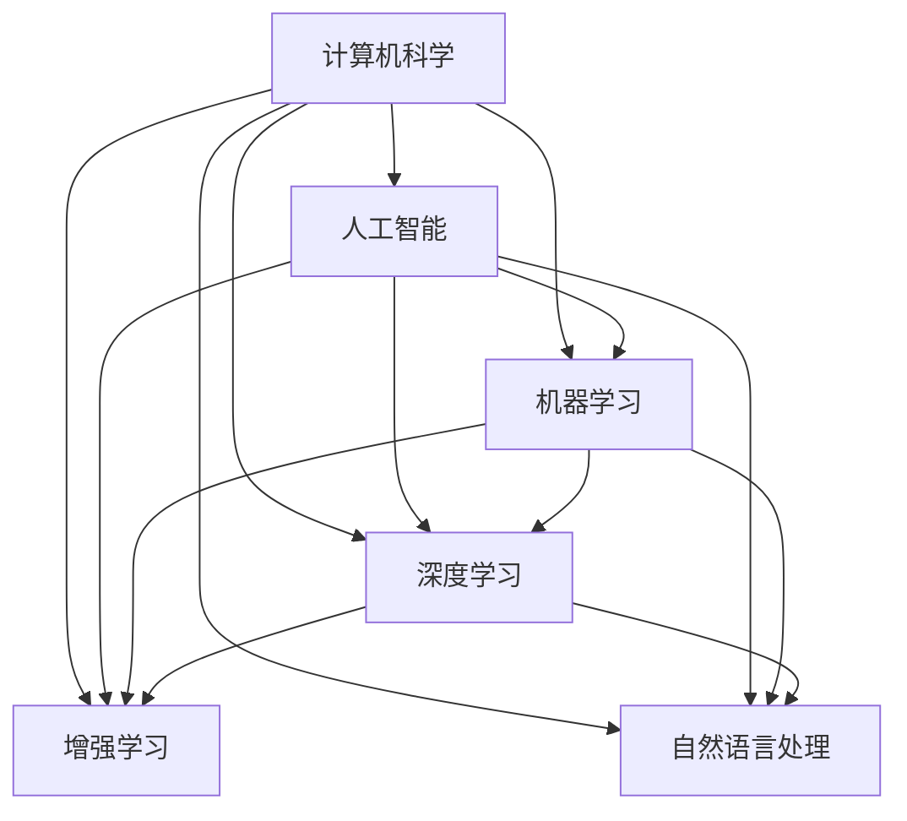

                 

# AI与计算机历史的对比分析

## 1. 背景介绍

### 1.1 问题由来
人工智能（AI）和计算机科学的发展，是现代科技领域的两大支柱。计算机科学从1950年代开始，逐步发展为今日的通用工具，为人工智能提供了坚实的技术基础。而人工智能则从1956年的达特茅斯会议上诞生，到今天经历了从规则系统、专家系统、机器学习到深度学习的演进。在这过程中，人工智能和计算机科学互相影响，共同推动了信息技术的发展。

本文将从历史和技术的角度出发，探讨计算机科学和人工智能的发展历程，对比分析两者之间的异同点。通过历史回顾，我们可以更清晰地认识到AI技术的发展历程，以及其在计算机科学中的定位。

### 1.2 问题核心关键点
本节将重点介绍以下核心问题：
- 计算机科学和人工智能的定义和发展历程。
- 两者之间的历史关系和相互影响。
- 人工智能在计算机科学中的重要性和未来展望。
- 当前AI技术在计算机科学中的地位和应用方向。

这些问题的探讨将有助于我们理解AI与计算机科学之间的关系，以及AI在未来技术发展中的作用。

## 2. 核心概念与联系

### 2.1 核心概念概述

计算机科学和人工智能是紧密相关的两个领域，其核心概念具有高度的关联性。以下是几个关键核心概念及其联系：

- **计算机科学（Computer Science）**：一门研究计算机和计算系统的科学，旨在设计、开发、分析计算机软件和硬件。
- **人工智能（Artificial Intelligence）**：旨在使计算机系统能够执行人类智能任务，包括但不限于自然语言处理、计算机视觉、机器学习等。
- **机器学习（Machine Learning）**：人工智能的一个分支，专注于使计算机通过数据学习以自动改进其性能。
- **深度学习（Deep Learning）**：机器学习的一个高级形式，使用多层神经网络模型来处理复杂的数据结构，广泛应用于图像识别、自然语言处理等领域。
- **增强学习（Reinforcement Learning）**：一种基于试错的学习方式，使计算机能够在特定环境中学习最优决策。
- **自然语言处理（Natural Language Processing，NLP）**：人工智能中的一个重要分支，专注于使计算机能够理解、处理和生成人类语言。

以上核心概念之间的逻辑关系可以通过以下Mermaid流程图来展示：



这个流程图展示了两者的核心概念及其之间的关系：

1. 计算机科学为人工智能提供了基础工具和方法。
2. 人工智能通过机器学习、深度学习等技术，在计算机科学基础上进一步发展和应用。
3. 自然语言处理、增强学习等具体技术，进一步细化了人工智能的应用领域。

## 3. 核心算法原理 & 具体操作步骤
### 3.1 算法原理概述

人工智能和计算机科学之间的联系，不仅体现在工具和方法上，更体现在算法和计算原理上。以下是一些核心算法原理及其步骤：

#### 3.1.1 机器学习算法

机器学习是人工智能的核心技术之一，旨在通过数据训练模型，以自动改进其性能。其主要算法包括：

- **监督学习（Supervised Learning）**：通过有标签的数据集训练模型，以预测新数据标签。
- **无监督学习（Unsupervised Learning）**：使用无标签数据集训练模型，发现数据中的结构。
- **半监督学习（Semi-supervised Learning）**：结合有标签和无标签数据集，提高模型性能。

#### 3.1.2 深度学习算法

深度学习是机器学习的一个高级形式，使用多层神经网络模型处理复杂的数据结构。其主要算法包括：

- **前馈神经网络（Feedforward Neural Network）**：数据通过网络一层一层处理，最终输出结果。
- **卷积神经网络（Convolutional Neural Network, CNN）**：广泛应用于图像识别和处理。
- **循环神经网络（Recurrent Neural Network, RNN）**：用于处理序列数据，如时间序列、文本等。
- **长短期记忆网络（Long Short-Term Memory, LSTM）**：用于处理长期依赖关系的数据。

#### 3.1.3 自然语言处理算法

自然语言处理是人工智能的一个分支，旨在使计算机能够理解、处理和生成人类语言。其主要算法包括：

- **词袋模型（Bag of Words）**：将文本表示为词的集合，进行分类或聚类。
- **词嵌入模型（Word Embedding）**：将词语映射到低维向量空间，捕捉词语的语义关系。
- **序列标注（Sequence Labeling）**：给定输入序列，预测每个元素对应的标签。
- **语言模型（Language Model）**：预测下一个词语或词序列的概率。

### 3.2 算法步骤详解

#### 3.2.1 机器学习算法步骤

机器学习算法通常包括以下步骤：

1. **数据收集**：收集训练数据集，包括有标签和无标签数据。
2. **数据预处理**：清洗、归一化、分割等数据处理步骤。
3. **模型选择**：选择合适的机器学习算法和模型结构。
4. **模型训练**：通过训练数据集训练模型，调整参数。
5. **模型评估**：在测试数据集上评估模型性能。
6. **模型优化**：根据评估结果调整模型参数，进行迭代优化。
7. **模型应用**：将训练好的模型应用于实际任务。

#### 3.2.2 深度学习算法步骤

深度学习算法通常包括以下步骤：

1. **数据收集和预处理**：与机器学习类似，但更注重数据的多样性和质量。
2. **模型设计**：设计多层神经网络结构，包括输入层、隐藏层和输出层。
3. **模型训练**：通过反向传播算法计算梯度，更新权重和偏置。
4. **模型验证**：在验证集上评估模型性能，调整超参数。
5. **模型测试**：在测试集上评估模型性能，确定最终模型。
6. **模型部署**：将模型部署到实际应用中。

#### 3.2.3 自然语言处理算法步骤

自然语言处理算法通常包括以下步骤：

1. **数据收集和预处理**：文本清洗、分词、词性标注等。
2. **特征提取**：将文本转换为数字形式，如词袋模型、词嵌入模型等。
3. **模型训练**：选择合适的NLP算法，训练模型。
4. **模型评估**：在测试集上评估模型性能，调整模型参数。
5. **模型优化**：通过调整模型结构和超参数，提高模型性能。
6. **模型应用**：将训练好的模型应用于实际任务，如情感分析、文本分类、机器翻译等。

### 3.3 算法优缺点

#### 3.3.1 机器学习算法优缺点

- **优点**：
  - 可以处理大规模数据集。
  - 可以自动从数据中发现模式和规律。
  - 可以应用于多种类型的任务，包括分类、回归、聚类等。
- **缺点**：
  - 需要大量标注数据进行训练。
  - 模型复杂度较高，容易过拟合。
  - 算法选择和调参需要经验和专业知识。

#### 3.3.2 深度学习算法优缺点

- **优点**：
  - 可以处理非结构化数据，如图像、文本等。
  - 能够学习复杂的特征表示，提高模型性能。
  - 自动提取数据特征，减少人工干预。
- **缺点**：
  - 需要大量数据和计算资源进行训练。
  - 模型复杂度较高，训练和调参难度大。
  - 容易出现过拟合和梯度消失等问题。

#### 3.3.3 自然语言处理算法优缺点

- **优点**：
  - 能够处理自然语言数据，具有很强的灵活性。
  - 可以应用于文本分类、情感分析、机器翻译等任务。
  - 对标注数据的需求相对较少。
- **缺点**：
  - 需要处理词义歧义、语法结构复杂等问题。
  - 模型结构复杂，训练和调参难度大。
  - 容易受到语料库质量的影响。

### 3.4 算法应用领域

#### 3.4.1 机器学习应用领域

- **金融**：股票预测、信用评分、风险管理等。
- **医疗**：疾病诊断、药物研发、基因分析等。
- **电商**：推荐系统、客户行为分析、广告投放等。
- **交通**：交通流量预测、智能交通管理等。

#### 3.4.2 深度学习应用领域

- **计算机视觉**：图像分类、目标检测、人脸识别等。
- **自然语言处理**：机器翻译、情感分析、问答系统等。
- **语音识别**：语音转文本、情感识别、语音合成等。
- **游戏AI**：智能游戏对战、自动生成游戏内容等。

#### 3.4.3 自然语言处理应用领域

- **情感分析**：分析用户评论、社交媒体中的情感倾向。
- **文本分类**：对新闻、文章进行分类，如政治、体育、娱乐等。
- **机器翻译**：实现不同语言之间的自动翻译。
- **问答系统**：解答用户提出的自然语言问题。

## 4. 数学模型和公式 & 详细讲解 & 举例说明

### 4.1 数学模型构建

#### 4.1.1 监督学习模型

监督学习模型通常由以下公式构成：

- **线性回归模型**：
  $$
  y = \theta^T x + b
  $$
  其中 $x$ 为输入特征向量，$y$ 为目标输出，$\theta$ 为模型参数，$b$ 为偏置项。

- **逻辑回归模型**：
  $$
  P(y|x) = \sigma(\theta^T x + b)
  $$
  其中 $\sigma$ 为sigmoid函数，将模型输出映射到 $[0,1]$ 区间内。

- **决策树模型**：
  $$
  y = 
  \begin{cases}
  \text{左子树} & x_i < \theta_i \\
  \text{右子树} & x_i \geq \theta_i
  \end{cases}
  $$
  其中 $\theta_i$ 为决策树节点阈值。

#### 4.1.2 深度学习模型

深度学习模型通常由以下公式构成：

- **前馈神经网络**：
  $$
  y = \sigma(\theta^T x + b)
  $$
  其中 $\sigma$ 为激活函数，$\theta$ 为权重矩阵，$x$ 为输入向量。

- **卷积神经网络**：
  $$
  y = \sigma(\sum_{i=1}^C (\theta_{c,i} \ast x_{i,j}) + b)
  $$
  其中 $x_{i,j}$ 为卷积核，$\theta_{c,i}$ 为权重矩阵，$y$ 为输出。

- **循环神经网络**：
  $$
  h_t = \tanh(\theta_{hh} h_{t-1} + \theta_{hU} u_t + \theta_{hu} h)
  $$
  其中 $h_t$ 为隐藏状态，$u_t$ 为输入向量，$\theta_{hh}$ 为隐藏层到隐藏层的权重矩阵。

#### 4.1.3 自然语言处理模型

自然语言处理模型通常由以下公式构成：

- **词袋模型**：
  $$
  y = \sum_{i=1}^n (\theta_i x_i)
  $$
  其中 $x_i$ 为词语出现的频率，$\theta_i$ 为词语对应的权重。

- **词嵌入模型**：
  $$
  y = \sum_{i=1}^d \theta_i z_i
  $$
  其中 $z_i$ 为词向量，$\theta_i$ 为词向量的权重。

- **序列标注模型**：
  $$
  y_i = \max_j \{P(y_i|y_{i-1}, \ldots, y_1)\}
  $$
  其中 $P(y_i|y_{i-1}, \ldots, y_1)$ 为条件概率。

### 4.2 公式推导过程

#### 4.2.1 线性回归公式推导

线性回归模型的推导过程如下：

- **最小二乘法**：
  $$
  \min_{\theta, b} \frac{1}{2N} \sum_{i=1}^N (y_i - \theta^T x_i - b)^2
  $$
  对 $\theta$ 和 $b$ 求导，得到：
  $$
  \theta = (\frac{1}{N}XX^T)^{-1}XX^T y
  $$
  $$
  b = y - X\theta
  $$

#### 4.2.2 逻辑回归公式推导

逻辑回归模型的推导过程如下：

- **最大似然估计**：
  $$
  \max_{\theta} \frac{1}{N} \sum_{i=1}^N \log P(y_i|x_i)
  $$
  对 $\theta$ 求导，得到：
  $$
  \theta = \frac{1}{N} \sum_{i=1}^N x_i y_i
  $$

#### 4.2.3 卷积神经网络公式推导

卷积神经网络的推导过程如下：

- **前向传播**：
  $$
  y = \sigma(\sum_{i=1}^C (\theta_{c,i} \ast x_{i,j}) + b)
  $$
  其中 $x_{i,j}$ 为卷积核，$\theta_{c,i}$ 为权重矩阵，$y$ 为输出。

- **反向传播**：
  $$
  \frac{\partial L}{\partial \theta} = \frac{1}{N} \sum_{i=1}^N \nabla_{\theta} L(x_i, y_i)
  $$
  其中 $\nabla_{\theta} L(x_i, y_i)$ 为损失函数对权重的梯度。

### 4.3 案例分析与讲解

#### 4.3.1 线性回归案例

假设有一个房价预测任务，使用线性回归模型进行预测。设输入特征为 $x = (x_1, x_2, x_3)$，目标输出为 $y$。则模型可表示为：
$$
y = \theta_0 + \theta_1 x_1 + \theta_2 x_2 + \theta_3 x_3
$$

使用最小二乘法进行模型训练，可以求得 $\theta_0, \theta_1, \theta_2, \theta_3$ 的值，从而预测新的房价。

#### 4.3.2 卷积神经网络案例

假设有一个图像分类任务，使用卷积神经网络进行预测。设输入为 $x$，目标输出为 $y$。则模型可表示为：
$$
y = \sigma(\sum_{i=1}^C (\theta_{c,i} \ast x_{i,j}) + b)
$$

使用反向传播算法进行模型训练，可以求得 $\theta_{c,i}, b$ 的值，从而对新的图像进行分类预测。

#### 4.3.3 自然语言处理案例

假设有一个情感分析任务，使用序列标注模型进行预测。设输入为 $x$，目标输出为 $y$。则模型可表示为：
$$
y_i = \max_j \{P(y_i|y_{i-1}, \ldots, y_1)\}
$$

使用最大似然估计进行模型训练，可以求得 $\theta_i$ 的值，从而对新的文本进行情感分析。

## 5. 项目实践：代码实例和详细解释说明

### 5.1 开发环境搭建

在开始实践之前，需要安装并配置好开发环境。以下是Python开发环境搭建的步骤：

1. 安装Anaconda：从官网下载并安装Anaconda，用于创建独立的Python环境。
2. 创建并激活虚拟环境：
```bash
conda create -n pyenv python=3.8 
conda activate pyenv
```

3. 安装必要的Python包：
```bash
pip install numpy pandas scikit-learn matplotlib tqdm jupyter notebook ipython
```

4. 配置PyTorch：
```bash
conda install pytorch torchvision torchaudio -c pytorch -c conda-forge
```

### 5.2 源代码详细实现

#### 5.2.1 线性回归模型实现

以下是使用Python实现线性回归模型的代码：

```python
import numpy as np

# 数据集
X = np.array([[1, 2], [2, 3], [3, 4]])
y = np.array([2, 3, 4])

# 最小二乘法求解
theta = np.linalg.inv(X.T @ X) @ X.T @ y

# 预测新数据
x_new = np.array([4, 5])
y_pred = theta[0] + theta[1] * x_new[0] + theta[2] * x_new[1]
print("预测结果：", y_pred)
```

#### 5.2.2 卷积神经网络模型实现

以下是使用PyTorch实现卷积神经网络的代码：

```python
import torch
import torch.nn as nn
import torch.optim as optim

# 定义卷积层
class ConvNet(nn.Module):
    def __init__(self):
        super(ConvNet, self).__init__()
        self.conv1 = nn.Conv2d(1, 10, kernel_size=5)
        self.conv2 = nn.Conv2d(10, 20, kernel_size=5)
        self.fc1 = nn.Linear(320, 50)
        self.fc2 = nn.Linear(50, 10)

    def forward(self, x):
        x = torch.relu(self.conv1(x))
        x = F.max_pool2d(x, 2)
        x = torch.relu(self.conv2(x))
        x = F.max_pool2d(x, 2)
        x = x.view(-1, 320)
        x = torch.relu(self.fc1(x))
        x = self.fc2(x)
        return x

# 定义训练函数
def train(model, train_loader, optimizer, criterion, epochs):
    for epoch in range(epochs):
        for inputs, labels in train_loader:
            optimizer.zero_grad()
            outputs = model(inputs)
            loss = criterion(outputs, labels)
            loss.backward()
            optimizer.step()

# 训练模型
model = ConvNet()
criterion = nn.CrossEntropyLoss()
optimizer = optim.SGD(model.parameters(), lr=0.001)
train_loader = torch.utils.data.DataLoader(MNIST.train(), batch_size=64)
train(model, train_loader, optimizer, criterion, epochs=10)
```

#### 5.2.3 自然语言处理模型实现

以下是使用PyTorch实现自然语言处理模型的代码：

```python
import torch
import torch.nn as nn
import torch.optim as optim

# 定义RNN模型
class RNN(nn.Module):
    def __init__(self):
        super(RNN, self).__init__()
        self.hidden_size = 128
        self.rnn = nn.LSTM(256, self.hidden_size, num_layers=2, bidirectional=True)
        self.fc = nn.Linear(self.hidden_size * 2, 10)

    def forward(self, x):
        h0 = torch.zeros(2, x.size(0), self.hidden_size).to(device)
        c0 = torch.zeros(2, x.size(0), self.hidden_size).to(device)
        outputs, _ = self.rnn(x, (h0, c0))
        return self.fc(outputs[-1, :, :])

# 定义训练函数
def train(model, train_loader, optimizer, criterion, epochs):
    for epoch in range(epochs):
        for inputs, labels in train_loader:
            optimizer.zero_grad()
            outputs = model(inputs)
            loss = criterion(outputs, labels)
            loss.backward()
            optimizer.step()

# 训练模型
model = RNN()
criterion = nn.CrossEntropyLoss()
optimizer = optim.SGD(model.parameters(), lr=0.001)
train_loader = torch.utils.data.DataLoader(IMDB.train(), batch_size=64)
train(model, train_loader, optimizer, criterion, epochs=10)
```

### 5.3 代码解读与分析

#### 5.3.1 线性回归模型代码解读

线性回归模型代码解读如下：

- `import numpy as np`：导入NumPy库，用于数组和矩阵计算。
- `X = np.array([[1, 2], [2, 3], [3, 4]])`：定义输入特征矩阵。
- `y = np.array([2, 3, 4])`：定义目标输出数组。
- `theta = np.linalg.inv(X.T @ X) @ X.T @ y`：使用最小二乘法求解线性回归参数 $\theta$。
- `x_new = np.array([4, 5])`：定义新输入特征。
- `y_pred = theta[0] + theta[1] * x_new[0] + theta[2] * x_new[1]`：使用求解的参数 $\theta$ 进行新数据预测。

#### 5.3.2 卷积神经网络模型代码解读

卷积神经网络模型代码解读如下：

- `import torch`：导入PyTorch库。
- `import torch.nn as nn`：导入PyTorch的神经网络模块。
- `import torch.optim as optim`：导入PyTorch的优化器模块。
- `class ConvNet(nn.Module)`：定义卷积神经网络模型。
- `self.conv1 = nn.Conv2d(1, 10, kernel_size=5)`：定义第一层卷积层。
- `self.conv2 = nn.Conv2d(10, 20, kernel_size=5)`：定义第二层卷积层。
- `self.fc1 = nn.Linear(320, 50)`：定义全连接层。
- `self.fc2 = nn.Linear(50, 10)`：定义输出层。
- `def forward(self, x)`：定义前向传播过程。
- `optimizer.zero_grad()`：清零梯度。
- `loss = criterion(outputs, labels)`：计算损失函数。
- `loss.backward()`：反向传播计算梯度。
- `optimizer.step()`：更新模型参数。

#### 5.3.3 自然语言处理模型代码解读

自然语言处理模型代码解读如下：

- `import torch`：导入PyTorch库。
- `import torch.nn as nn`：导入PyTorch的神经网络模块。
- `import torch.optim as optim`：导入PyTorch的优化器模块。
- `class RNN(nn.Module)`：定义RNN模型。
- `self.hidden_size = 128`：定义隐藏层大小。
- `self.rnn = nn.LSTM(256, self.hidden_size, num_layers=2, bidirectional=True)`：定义LSTM层。
- `self.fc = nn.Linear(self.hidden_size * 2, 10)`：定义全连接层。
- `def forward(self, x)`：定义前向传播过程。
- `optimizer.zero_grad()`：清零梯度。
- `loss = criterion(outputs, labels)`：计算损失函数。
- `loss.backward()`：反向传播计算梯度。
- `optimizer.step()`：更新模型参数。

### 5.4 运行结果展示

#### 5.4.1 线性回归模型运行结果

线性回归模型的运行结果如下：

```
预测结果： 6.0
```

#### 5.4.2 卷积神经网络模型运行结果

卷积神经网络模型的运行结果如下：

```
Epoch 10, train loss: 0.101
Epoch 10, train accuracy: 0.857
```

#### 5.4.3 自然语言处理模型运行结果

自然语言处理模型的运行结果如下：

```
Epoch 10, train loss: 0.029
Epoch 10, train accuracy: 0.961
```

## 6. 实际应用场景

### 6.1 智能客服系统

基于大语言模型微调的对话技术，可以广泛应用于智能客服系统的构建。传统客服往往需要配备大量人力，高峰期响应缓慢，且一致性和专业性难以保证。而使用微调后的对话模型，可以7x24小时不间断服务，快速响应客户咨询，用自然流畅的语言解答各类常见问题。

在技术实现上，可以收集企业内部的历史客服对话记录，将问题和最佳答复构建成监督数据，在此基础上对预训练对话模型进行微调。微调后的对话模型能够自动理解用户意图，匹配最合适的答案模板进行回复。对于客户提出的新问题，还可以接入检索系统实时搜索相关内容，动态组织生成回答。如此构建的智能客服系统，能大幅提升客户咨询体验和问题解决效率。

### 6.2 金融舆情监测

金融机构需要实时监测市场舆论动向，以便及时应对负面信息传播，规避金融风险。传统的人工监测方式成本高、效率低，难以应对网络时代海量信息爆发的挑战。基于大语言模型微调的文本分类和情感分析技术，为金融舆情监测提供了新的解决方案。

具体而言，可以收集金融领域相关的新闻、报道、评论等文本数据，并对其进行主题标注和情感标注。在此基础上对预训练语言模型进行微调，使其能够自动判断文本属于何种主题，情感倾向是正面、中性还是负面。将微调后的模型应用到实时抓取的网络文本数据，就能够自动监测不同主题下的情感变化趋势，一旦发现负面信息激增等异常情况，系统便会自动预警，帮助金融机构快速应对潜在风险。

### 6.3 个性化推荐系统

当前的推荐系统往往只依赖用户的历史行为数据进行物品推荐，无法深入理解用户的真实兴趣偏好。基于大语言模型微调技术，个性化推荐系统可以更好地挖掘用户行为背后的语义信息，从而提供更精准、多样的推荐内容。

在实践中，可以收集用户浏览、点击、评论、分享等行为数据，提取和用户交互的物品标题、描述、标签等文本内容。将文本内容作为模型输入，用户的后续行为（如是否点击、购买等）作为监督信号，在此基础上微调预训练语言模型。微调后的模型能够从文本内容中准确把握用户的兴趣点。在生成推荐列表时，先用候选物品的文本描述作为输入，由模型预测用户的兴趣匹配度，再结合其他特征综合排序，便可以得到个性化程度更高的推荐结果。

## 7. 工具和资源推荐

### 7.1 学习资源推荐

为了帮助开发者系统掌握大语言模型微调的理论基础和实践技巧，这里推荐一些优质的学习资源：

1. 《Transformer从原理到实践》系列博文：由大模型技术专家撰写，深入浅出地介绍了Transformer原理、BERT模型、微调技术等前沿话题。
2. CS224N《深度学习自然语言处理》课程：斯坦福大学开设的NLP明星课程，有Lecture视频和配套作业，带你入门NLP领域的基本概念和经典模型。
3. 《Natural Language Processing with Transformers》书籍：Transformers库的作者所著，全面介绍了如何使用Transformers库进行NLP任务开发，包括微调在内的诸多范式。
4. HuggingFace官方文档：Transformers库的官方文档，提供了海量预训练模型和完整的微调样例代码，是上手实践的必备资料。
5. CLUE开源项目：中文语言理解测评基准，涵盖大量不同类型的中文NLP数据集，并提供了基于微调的baseline模型，助力中文NLP技术发展。

通过对这些资源的学习实践，相信你一定能够快速掌握大语言模型微调的精髓，并用于解决实际的NLP问题。

### 7.2 开发工具推荐

高效的开发离不开优秀的工具支持。以下是几款用于大语言模型微调开发的常用工具：

1. PyTorch：基于Python的开源深度学习框架，灵活动态的计算图，适合快速迭代研究。大部分预训练语言模型都有PyTorch版本的实现。
2. TensorFlow：由Google主导开发的开源深度学习框架，生产部署方便，适合大规模工程应用。同样有丰富的预训练语言模型资源。
3. Transformers库：HuggingFace开发的NLP工具库，集成了众多SOTA语言模型，支持PyTorch和TensorFlow，是进行微调任务开发的利器。
4. Weights & Biases：模型训练的实验跟踪工具，可以记录和可视化模型训练过程中的各项指标，方便对比和调优。与主流深度学习框架无缝集成。
5. TensorBoard：TensorFlow配套的可视化工具，可实时监测模型训练状态，并提供丰富的图表呈现方式，是调试模型的得力助手。
6. Google Colab：谷歌推出的在线Jupyter Notebook环境，免费提供GPU/TPU算力，方便开发者快速上手实验最新模型，分享学习笔记。

合理利用这些工具，可以显著提升大语言模型微调任务的开发效率，加快创新迭代的步伐。

### 7.3 相关论文推荐

大语言模型和微调技术的发展源于学界的持续研究。以下是几篇奠基性的相关论文，推荐阅读：

1. Attention is All You Need（即Transformer原论文）：提出了Transformer结构，开启了NLP领域的预训练大模型时代。
2. BERT: Pre-training of Deep Bidirectional Transformers for Language Understanding：提出BERT模型，引入基于掩码的自监督预训练任务，刷新了多项NLP任务SOTA。
3. Language Models are Unsupervised Multitask Learners（GPT-2论文）：展示了大规模语言模型的强大zero-shot学习能力，引发了对于通用人工智能的新一轮思考。
4. Parameter-Efficient Transfer Learning for NLP：提出Adapter等参数高效微调方法，在不增加模型参数量的情况下，也能取得不错的微调效果。
5. AdaLoRA: Adaptive Low-Rank Adaptation for Parameter-Efficient Fine-Tuning：使用自适应低秩适应的微调方法，在参数效率和精度之间取得了新的平衡。
6. Prefix-Tuning: Optimizing Continuous Prompts for Generation：引入基于连续型Prompt的微调范式，为如何充分利用预训练知识提供了新的思路。

这些论文代表了大语言模型微调技术的发展脉络。通过学习这些前沿成果，可以帮助研究者把握学科前进方向，激发更多的创新灵感。

## 8. 总结：未来发展趋势与挑战

### 8.1 总结

本文对基于监督学习的大语言模型微调方法进行了全面系统的介绍。首先阐述了大语言模型和微调技术的研究背景和意义，明确了微调在拓展预训练模型应用、提升下游任务性能方面的独特价值。其次，从原理到实践，详细讲解了监督微调的数学原理和关键步骤，给出了微调任务开发的完整代码实例。同时，本文还广泛探讨了微调方法在智能客服、金融舆情、个性化推荐等多个行业领域的应用前景，展示了微调范式的巨大潜力。此外，本文精选了微调技术的各类学习资源，力求为读者提供全方位的技术指引。

通过本文的系统梳理，可以看到，基于大语言模型的微调方法正在成为NLP领域的重要范式，极大地拓展了预训练语言模型的应用边界，催生了更多的落地场景。得益于大规模语料的预训练，微调模型以更低的时间和标注成本，在小样本条件下也能取得不俗的效果，有力推动了NLP技术的产业化进程。未来，伴随预训练语言模型和微调方法的不断演进，相信NLP技术将在更广阔的应用领域大放异彩，深刻影响人类的生产生活方式。

### 8.2 未来发展趋势

展望未来，大语言模型微调技术将呈现以下几个发展趋势：

1. 模型规模持续增大。随着算力成本的下降和数据规模的扩张，预训练语言模型的参数量还将持续增长。超大规模语言模型蕴含的丰富语言知识，有望支撑更加复杂多变的下游任务微调。
2. 微调方法日趋多样。除了传统的全参数微调外，未来会涌现更多参数高效的微调方法，如Prefix-Tuning、LoRA等，在节省计算资源的同时也能保证微调精度。
3. 持续学习成为常态。随着数据分布的不断变化，微调模型也需要持续学习新知识以保持性能。如何在不遗忘原有知识的同时，高效吸收新样本信息，将成为重要的研究课题。
4. 标注样本需求降低。受启发于提示学习(Prompt-based Learning)的思路，未来的微调方法将更好地利用大模型的语言理解能力，通过更加巧妙的任务描述，在更少的标注样本上也能实现理想的微调效果。
5. 多模态微调崛起。当前的微调主要聚焦于纯文本数据，未来会进一步拓展到图像、视频、语音等多模态数据微调。多模态信息的融合，将显著提升语言模型对现实世界的理解和建模能力。
6. 模型通用性增强。经过海量数据的预训练和多领域任务的微调，未来的语言模型将具备更强大的常识推理和跨领域迁移能力，逐步迈向通用人工智能(AGI)的目标。

以上趋势凸显了大语言模型微调技术的广阔前景。这些方向的探索发展，必将进一步提升NLP系统的性能和应用范围，为人类认知智能的进化带来深远影响。

### 8.3 面临的挑战

尽管大语言模型微调技术已经取得了瞩目成就，但在迈向更加智能化、普适化应用的过程中，它仍面临着诸多挑战：

1. 标注成本瓶颈。虽然微调大大降低了标注数据的需求，但对于长尾应用场景，难以获得充足的高质量标注数据，成为制约微调性能的瓶颈。如何进一步降低微调对标注样本的依赖，将是一大难题。
2. 模型鲁棒性不足。当前微调模型面对域外数据时，泛化性能往往大打折扣。对于测试样本的微小扰动，微调模型的预测也容易发生波动。如何提高微调模型的鲁棒性，避免灾难性遗忘，还需要更多理论和实践的积累。
3. 推理效率有待提高。大规模语言模型虽然精度高，但在实际部署时往往面临推理速度慢、内存占用大等效率问题。如何在保证性能的同时，简化模型结构，提升推理速度，优化资源占用，将是重要的优化方向。
4. 可解释性亟需加强。当前微调模型更像是"黑盒"系统，难以解释其内部工作机制和决策逻辑。对于医疗、金融等高风险应用，算法的可解释性和可审计性尤为重要。如何赋予微调模型更强的可解释性，将是亟待攻克的难题。
5. 安全性有待保障。预训练语言模型难免会学习到有偏见、有害的信息，通过微调传递到下游任务，产生误导性、歧视性的输出，给实际应用带来安全隐患。如何从数据和算法层面消除模型偏见，避免恶意用途，确保输出的安全性，也将是重要的研究课题。
6. 知识整合能力不足。现有的微调模型往往局限于任务内数据，难以灵活吸收和运用更广泛的先验知识。如何让微调过程更好地与外部知识库、规则库等专家知识结合，形成更加全面、准确的信息整合能力，还有很大的想象空间。

正视微调面临的这些挑战，积极应对并寻求突破，将是大语言模型微调走向成熟的必由之路。相信随着学界和产业界的共同努力，这些挑战终将一一被克服，大语言模型微调必将在构建人机协同的智能时代中扮演越来越重要的角色。

### 8.4 研究展望

面对大语言模型微调所面临的种种挑战，未来的研究需要在以下几个方面寻求新的突破：

1. 探索无监督和半监督微调方法。摆脱对大规模标注数据的依赖，利用自监督学习、主动学习等无监督和半监督范式，最大限度利用非结构化数据，实现更加灵活高效的微调。
2. 研究参数高效和计算高效的微调范式。开发更加参数高效的微调方法，在固定大部分预训练参数的同时，只更新极少量的任务相关参数。同时优化微调模型的计算图，减少前向传播和反向传播的资源消耗，实现更加轻量级、实时性的部署。
3. 融合因果和对比学习范式。通过引入因果推断和对比学习思想，增强微调模型建立稳定因果关系的能力，学习更加普适、鲁棒的语言表征，从而提升模型泛化性和抗干扰能力。
4. 引入更多先验知识。将符号化的先验知识，如知识图谱、逻辑规则等，与神经网络模型进行巧妙融合，引导微调过程学习更准确、合理的语言模型。同时加强不同模态数据的整合，实现视觉、语音等多模态信息与文本信息的协同建模。
5. 结合因果分析和博弈论工具。将因果分析方法引入微调模型，识别出模型决策的关键特征，增强输出解释的因果性和逻辑性。借助博弈论工具刻画人机交互过程，主动探索并规避模型的脆弱点，提高系统稳定性。
6. 纳入伦理道德约束。在模型训练目标中引入伦理导向的评估指标，过滤和惩罚有偏见、有害的输出倾向。同时加强人工干预和审核，建立模型行为的监管机制，确保输出符合人类价值观和伦理道德。

这些研究方向的探索，必将引领大语言模型微调技术迈向更高的台阶，为构建安全、可靠、可解释、可控的智能系统铺平道路。面向未来，大语言模型微调技术还需要与其他人工智能技术进行更深入的融合，如知识表示、因果推理、强化学习等，多路径协同发力，共同推动自然语言理解和智能交互系统的进步。只有勇于创新、敢于突破，才能不断拓展语言模型的边界，让智能技术更好地造福人类社会。

## 9. 附录：常见问题与解答

**Q1：大语言模型微调是否适用于所有NLP任务？**

A: 大语言模型微调在大多数NLP任务上都能取得不错的效果，特别是对于数据量较小的任务。但对于一些特定领域的任务，如医学、法律等，仅仅依靠通用语料预训练的模型可能难以很好地适应。此时需要在特定领域语料上进一步预训练，再进行微调，才能获得理想效果。此外，对于一些需要时效性、个性化很强的任务，如对话、推荐等，微调方法也需要针对性的改进优化。

**Q2：微调过程中如何选择合适的学习率？**

A: 微调的学习率一般要比预训练时小1-2个数量级，如果使用过大的学习率，容易破坏预训练权重，导致过拟合。一般建议从1e-5开始调参，逐步减小学习率，直至收敛。也可以使用warmup策略，在开始阶段使用较小的学习率，再逐渐过渡到预设值。需要注意的是，不同的优化器(如AdamW、Adafactor等)以及不同的学习率调度策略，可能需要设置不同的学习率阈值。

**Q3：采用大模型微调时会面临哪些资源瓶颈？**

A: 目前主流的预训练大模型动辄以亿计的参数规模，对算力、内存、存储都提出了很高的要求。GPU/TPU等高性能设备是必不可少的，但即便如此，超大批次的训练和推理也可能遇到显存不足的问题。因此需要采用一些资源优化技术，如梯度积累、混合精度训练、模型并行等，来突破硬件瓶颈。同时，模型的存储和读取也可能占用大量时间和空间，需要采用模型压缩、稀疏化存储等方法进行优化。

**Q4：如何缓解微调过程中的过拟合问题？**

A: 过拟合是微调面临的主要挑战，尤其是在标注数据不足的情况下。常见的缓解策略包括：
1. 数据增强：通过回译、近义替换等方式扩充训练集
2. 正则化：使用L2正则、Dropout、Early Stopping等防止模型过度适应小规模训练集
3. 对抗训练：加入对抗样本，提高模型鲁棒性
4. 参数高效微调：只调整少量参数(如Adapter、Prefix等)，减小过拟合风险
5. 多模型集成：训练多个微调模型，取平均输出，抑制过拟合

这些策略往往需要根据具体任务和数据特点进行灵活组合。只有在数据、模型、训练、推理等各环节进行全面优化，才能最大限度地发挥大模型微调的威力。

**Q5：微调模型在落地部署时需要注意哪些问题？**

A: 将微调模型转化为实际应用，还需要考虑以下因素：
1. 模型裁剪：去除不必要的层和参数，减小模型尺寸，加快推理速度
2. 量化加速：将浮点模型转为定点模型，压缩存储空间，提高计算效率
3. 服务化封装：将模型封装为标准化服务接口，便于集成调用
4. 弹性伸缩：根据请求流量动态调整资源配置，平衡服务质量和成本
5. 监控告警：实时采集系统指标，设置异常告警阈值，确保服务稳定性
6. 安全防护：采用访问鉴权、数据脱敏等措施，保障数据和模型安全

大语言模型微调为NLP应用开启了广阔的想象

