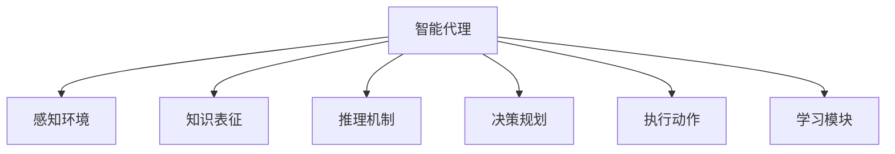

                 

# AI人工智能 Agent：基础理论解析

> 关键词：人工智能，智能代理，Agent理论，知识表征，推理机制，决策规划，应用场景

## 1. 背景介绍

### 1.1 问题由来

在人工智能(AI)发展史上，智能代理(Agent)的概念一直占据着核心地位。自20世纪70年代末第一次提出以来，智能代理模型已成为研究AI应用的重要工具。智能代理能够通过感知环境、提取知识、执行决策、执行动作等方式，实现对环境的操作与响应。

当前，智能代理技术已广泛应用于自动化流程、机器人、智能客服、网络安全、自动化交易、聊天机器人、智能游戏等多个领域。其核心思想是在构建智能代理系统时，充分考虑环境因素、系统性能以及用户需求，构建具有高度灵活性和适应性的智能系统。

### 1.2 问题核心关键点

智能代理的核心思想可以归结为以下几点：
1. **感知环境**：代理需具备感知环境的能力，获取环境信息，以用于后续的决策规划。
2. **知识表征**：代理通过知识库将环境信息组织起来，用于推理和决策。
3. **推理机制**：代理需具备推理能力，通过逻辑推理和计算，推导出最优解。
4. **决策规划**：代理需制定计划，对动作进行排序，选择最优动作。
5. **执行动作**：代理需具备执行动作的能力，实现对环境的修改和操作。

理解这些核心概念和关键点，对于构建高效、智能的代理系统至关重要。接下来，我们将深入探讨这些核心思想，并通过数学模型和实际案例进行详细讲解。

## 2. 核心概念与联系

### 2.1 核心概念概述

为更好地理解智能代理模型，本节将介绍几个核心概念：

- 智能代理(Agent)：能够自主感知环境、提取知识、制定决策、执行动作的系统。
- 知识表征(Knowledge Representation)：将环境信息组织并存储在代理的知识库中，以供推理和决策使用。
- 推理机制(Reasoning Mechanism)：代理通过推理逻辑，计算出最优动作。
- 决策规划(Decision Planning)：代理通过制定计划，对动作进行排序和选择。
- 执行动作(Action Execution)：代理具备执行动作的能力，实现对环境的修改。
- 感知环境(Sensor Observation)：代理通过传感器获取环境信息。
- 通信模块(Communication)：代理需具备通信模块，与环境和其他代理交互。
- 学习模块(Learning)：代理通过学习机制不断改进知识库和推理能力。

这些概念之间的联系可以通过以下Mermaid流程图来展示：



这个流程图展示出智能代理的核心构成及其相互作用：

1. 智能代理通过感知环境获取信息。
2. 将信息组织到知识库中，形成知识表征。
3. 利用推理机制进行逻辑计算，推导出最优动作。
4. 通过决策规划制定计划，排序动作。
5. 执行动作对环境进行修改。
6. 通过学习模块不断改进知识库和推理能力。

## 3. 核心算法原理 & 具体操作步骤

### 3.1 算法原理概述

智能代理模型的核心算法原理主要基于认知心理学和符号计算的原理，通过模拟人类认知和推理过程，实现环境的感知、知识的组织、推理和决策。

### 3.2 算法步骤详解

智能代理模型的构建步骤如下：

**Step 1: 定义环境与任务**
- 构建智能代理的运行环境，包括环境状态、动作空间、奖励函数等。
- 定义代理的目标任务，明确其在环境中需要达成的目标。

**Step 2: 初始化知识库**
- 收集和整理环境相关的信息，形成初始化的知识库。
- 将知识库结构化，便于推理和决策使用。

**Step 3: 构建推理引擎**
- 设计推理逻辑，利用符号计算技术进行逻辑推导。
- 实现推理机制，将环境信息映射到动作空间。

**Step 4: 决策规划**
- 制定决策规划策略，选择最佳动作序列。
- 利用启发式算法优化决策规划过程。

**Step 5: 执行动作**
- 根据决策结果执行动作，修改环境状态。
- 利用动作执行模块实现对环境的交互。

**Step 6: 学习和适应**
- 通过学习模块更新知识库和推理逻辑。
- 利用强化学习技术不断优化决策策略。

**Step 7: 模型评估**
- 设计评估指标，量化代理在环境中的表现。
- 利用测试集验证代理模型性能。

### 3.3 算法优缺点

智能代理模型的优点包括：
1. **灵活性和适应性**：智能代理能够自适应复杂多变的环境。
2. **自主决策**：代理具备自主决策能力，能够在没有外界干预的情况下完成任务。
3. **可扩展性**：代理模型易于扩展，能够处理各种规模的任务。

然而，智能代理模型也存在以下缺点：
1. **知识获取**：代理模型的性能依赖于初始化知识库的质量。
2. **计算复杂度**：推理和决策过程计算复杂度较高。
3. **可解释性**：代理模型的决策过程缺乏可解释性。
4. **鲁棒性**：代理模型可能对噪声和异常情况敏感。

### 3.4 算法应用领域

智能代理模型已广泛应用于多个领域，包括但不限于：

- 自动驾驶：智能代理通过感知环境、制定路径、控制车辆等，实现自主驾驶。
- 机器人控制：代理通过感知环境、执行动作、与环境交互，实现对机器人的控制。
- 供应链管理：代理通过感知市场信息、制定采购计划、执行采购动作等，实现供应链优化。
- 智能客服：代理通过感知用户信息、制定回答策略、执行回答动作等，实现自动化客服。
- 智能游戏：代理通过感知游戏状态、制定策略、执行动作等，实现自动化游戏。

这些应用场景展示了智能代理模型在实际中的应用广泛性，进一步突出了其重要性和实用性。

## 4. 数学模型和公式 & 详细讲解 & 举例说明

### 4.1 数学模型构建

智能代理模型通常采用符号计算的方法，将环境信息映射到知识库中，进行推理和决策。

假设智能代理的任务是最大化其累积奖励函数 $R(s, a)$，其中 $s$ 为环境状态，$a$ 为代理采取的动作。假设代理的决策策略为 $π$，则代理的期望累积奖励 $V_{π}(s)$ 可以表示为：

$$
V_{π}(s) = \mathbb{E}_{\pi}[\sum_{t=0}^{\infty} \gamma^t R(s_t, a_t)]
$$

其中 $\gamma$ 为折现因子，$s_t$ 和 $a_t$ 分别表示在时间步 $t$ 的环境状态和执行的动作。

### 4.2 公式推导过程

智能代理模型的推理过程通常采用符号计算的方法，如逻辑推理、演绎推理、因果推理等。

以逻辑推理为例，假设智能代理需要在知识库中查询事实 $p$ 和规则 $r$，推理过程可以表示为：

$$
r \rightarrow p
$$

其中 $r$ 为规则，$p$ 为事实。代理通过将规则 $r$ 应用于当前状态 $s$，得到推理结果 $p$。如果 $p$ 在知识库中存在，则推理成功，否则推理失败。

在实际推理中，由于知识库的复杂性和推理规则的多样性，通常需要设计高效的推理引擎，支持复杂的逻辑运算和推理过程。

### 4.3 案例分析与讲解

假设智能代理的任务是判断一个人是否具有驾驶员资格，可以构建如下推理过程：

1. **知识库**：存储驾驶员资格相关的信息，如年龄、驾照信息、健康证明等。
2. **规则**：规则1：持有驾照信息；规则2：年龄达到法定要求；规则3：身体健康。
3. **推理**：代理通过将规则应用于当前状态，进行逻辑计算，得到最终判断结果。

通过上述案例，可以看出智能代理模型在处理特定任务时的推理过程。代理通过知识库和规则，结合推理逻辑，得出最终结果。

## 5. 项目实践：代码实例和详细解释说明

### 5.1 开发环境搭建

在进行智能代理模型的开发时，首先需要搭建开发环境。以下以Python为例，介绍开发环境的搭建过程：

1. 安装Python：从官网下载并安装Python，建议使用最新版本的Python。
2. 安装必要的库：安装PIL库用于图像处理，安装pytorch用于神经网络模型构建。
3. 创建虚拟环境：使用virtualenv或conda等工具，创建独立的Python环境。
4. 安装TensorFlow和Keras：安装TensorFlow和Keras，用于构建智能代理的神经网络模型。

### 5.2 源代码详细实现

以下是一个简单的智能代理模型的代码实现，用于判断一个人是否具有驾驶员资格：

```python
import tensorflow as tf
from tensorflow.keras.layers import Input, Dense, Flatten, Embedding
from tensorflow.keras.models import Model

# 定义模型
def create_model(input_shape):
    input_layer = Input(shape=input_shape)
    embedding_layer = Embedding(input_dim=100, output_dim=64, input_length=100)(input_layer)
    flatten_layer = Flatten()(embedding_layer)
    dense_layer = Dense(64, activation='relu')(flatten_layer)
    output_layer = Dense(1, activation='sigmoid')(dense_layer)
    model = Model(inputs=input_layer, outputs=output_layer)
    return model

# 加载数据
def load_data():
    # 加载数据集
    data = load_data_from_file()
    # 将数据集进行预处理，形成输入和输出
    input_data = preprocess_data(data)
    output_data = preprocess_output(data)
    return input_data, output_data

# 训练模型
def train_model(model, input_data, output_data, epochs=10, batch_size=32):
    model.compile(optimizer='adam', loss='binary_crossentropy', metrics=['accuracy'])
    model.fit(input_data, output_data, epochs=epochs, batch_size=batch_size)

# 构建数据集
def preprocess_data(data):
    # 数据预处理代码
    return preprocessed_data

# 加载模型并使用
def use_model(model, input_data):
    # 使用模型进行推理
    output_data = model.predict(input_data)
    return output_data
```

### 5.3 代码解读与分析

在上述代码中，我们定义了智能代理的神经网络模型，并实现了训练和推理过程。具体来说，代码实现如下：

- `create_model`函数：定义神经网络模型结构，包括输入层、嵌入层、全连接层和输出层。
- `load_data`函数：加载数据集，并对其进行预处理，形成输入和输出。
- `train_model`函数：编译模型，并使用数据集进行训练。
- `preprocess_data`函数：对数据集进行预处理，包括数据清洗、归一化等。
- `use_model`函数：使用训练好的模型进行推理。

通过上述代码，我们可以快速搭建一个基本的智能代理模型，并使用其进行推理和决策。在实际应用中，还可以进一步扩展模型的复杂度，增加更多的推理规则和决策策略，以适应更多复杂的任务需求。

## 6. 实际应用场景

### 6.1 智能家居系统

智能家居系统是智能代理应用的一个典型场景。智能家居代理通过感知环境信息，如温度、湿度、光照等，制定最优的家居控制方案，实现对家电设备的自动控制。

例如，当智能代理感知到环境温度过高时，可以自动开启空调，并根据用户偏好调整温度和风速。代理通过感知用户的行为习惯，学习用户的偏好，优化家居环境，提升用户的生活体验。

### 6.2 自动化流程管理

自动化流程管理是智能代理在企业中的应用场景之一。代理通过感知业务环境，如订单信息、库存状态、生产进度等，制定最优的流程决策，实现自动化流程管理。

例如，当代理感知到订单量过高时，可以自动调整生产线的生产速度，并优化物流配送策略，确保订单按时送达。代理通过感知业务数据，学习业务规律，优化业务流程，提高企业的运营效率。

### 6.3 金融风险管理

智能代理在金融领域的应用包括风险管理和欺诈检测等。代理通过感知市场数据、交易数据、用户行为数据等，制定最优的风险管理策略，降低金融风险。

例如，当代理感知到某些交易行为异常时，可以自动发出警报，并进行进一步的调查和处理。代理通过学习金融市场数据，识别潜在的风险因素，制定风险管理策略，提高金融系统的安全性。

### 6.4 未来应用展望

随着智能代理技术的不断发展和完善，未来将有更多的应用场景和应用领域。以下是一些可能的未来应用：

- **医疗健康**：智能代理可以感知患者的健康数据，制定个性化的健康管理方案，并推荐合适的治疗方案。
- **城市管理**：代理可以感知城市环境信息，如交通流量、环境污染等，制定最优的城市管理方案，提升城市管理效率。
- **教育领域**：代理可以感知学生的学习行为，制定个性化的学习计划，推荐合适的学习资源，提高学生的学习效率。
- **物流运输**：代理可以感知物流状态，制定最优的运输方案，降低物流成本，提高物流效率。

## 7. 工具和资源推荐

### 7.1 学习资源推荐

为了帮助开发者掌握智能代理模型的核心技术，这里推荐一些优质的学习资源：

1. 《人工智能基础》课程：由斯坦福大学开设的入门级课程，介绍人工智能的基本概念和算法。
2. 《智能代理》书籍：全面介绍智能代理模型的设计原理和应用场景。
3. 《深度学习》课程：由Coursera提供的深度学习课程，涵盖神经网络、深度学习等前沿技术。
4. 《符号计算与逻辑推理》书籍：介绍符号计算和逻辑推理的基本原理和应用场景。

### 7.2 开发工具推荐

为了高效开发智能代理模型，这里推荐一些实用的开发工具：

1. Python：广泛使用的高级编程语言，适合开发各种类型的智能代理系统。
2. TensorFlow：由Google开发的深度学习框架，适合构建复杂的神经网络模型。
3. PyTorch：由Facebook开发的深度学习框架，支持动态图和静态图，适合快速原型开发。
4. Keras：基于TensorFlow和Theano的高级API，支持快速搭建和训练神经网络模型。

### 7.3 相关论文推荐

智能代理模型的研究起源于20世纪70年代，随着技术的不断进步，越来越多的学者加入到这一领域的研究中。以下是几篇奠基性的相关论文：

1. 《智能代理》（A Survey of Agents in AI）：全面介绍智能代理模型的基本原理和应用场景。
2. 《符号计算与逻辑推理》（Symbolic Computation and Logic Reasoning）：介绍符号计算和逻辑推理的基本原理和技术。
3. 《深度学习》（Deep Learning）：全面介绍深度学习的基本概念和技术。

## 8. 总结：未来发展趋势与挑战

### 8.1 总结

本文对智能代理模型进行了全面系统的介绍。首先，我们阐述了智能代理模型的研究背景和意义，明确了代理在构建智能系统中的核心作用。其次，从原理到实践，详细讲解了智能代理模型的构建方法和实现步骤，并通过代码实例进行了详细解释说明。同时，本文还探讨了智能代理模型在实际应用中的多样性，展示了其广阔的应用前景。

通过本文的系统梳理，可以看出智能代理模型在各个领域的应用潜力。智能代理模型通过对环境信息的感知、知识的组织和推理，实现了自主决策和执行，极大地提升了系统性能和灵活性。未来，伴随技术的不断进步和应用的不断拓展，智能代理模型必将在更多领域发挥重要作用，推动AI技术的不断发展。

### 8.2 未来发展趋势

展望未来，智能代理模型将呈现以下几个发展趋势：

1. **多模态融合**：未来的代理模型将能够处理多模态数据，如视觉、语音、文本等，实现更全面、更深入的智能感知。
2. **自适应学习**：代理模型将具备自适应学习能力，能够在不断变化的环境中，通过学习优化模型性能。
3. **分布式计算**：代理模型将采用分布式计算技术，实现高效的并行计算和资源共享。
4. **跨领域应用**：智能代理将跨越多个领域，实现跨领域的应用和知识共享。
5. **伦理与安全**：智能代理模型的设计和实现将更加注重伦理和安全问题，避免偏见和歧视，保障系统的可信度。

这些趋势展示了智能代理模型未来的发展方向，将进一步推动AI技术的进步和应用。

### 8.3 面临的挑战

尽管智能代理模型已经取得了显著进展，但在向更广泛领域拓展的过程中，仍面临以下挑战：

1. **数据质量与标注**：高质量的数据是代理模型性能的关键。然而，获取高质量的数据和标注成本较高，数据质量和标注工作的质量直接影响模型性能。
2. **计算资源与算法**：智能代理模型通常需要较大的计算资源和复杂的算法支持，如何在资源受限的情况下实现高性能代理模型，是亟待解决的问题。
3. **模型的可解释性**：智能代理模型的决策过程往往缺乏可解释性，难以对其推理逻辑进行分析和调试，导致模型缺乏可信度。
4. **模型的安全性与隐私保护**：智能代理模型涉及大量敏感数据，如何在保证数据安全的前提下，实现模型的有效应用，是重要挑战。

### 8.4 研究展望

面对智能代理模型所面临的挑战，未来的研究需要在以下几个方面寻求新的突破：

1. **数据增强与数据清洗**：探索更高效的数据增强技术和数据清洗方法，降低数据质量和标注工作的成本。
2. **轻量级代理模型**：开发轻量级的代理模型，通过优化算法和计算图，实现高效的资源利用和性能提升。
3. **可解释的代理模型**：引入可解释的模型框架和推理技术，提高模型的可解释性和可信度。
4. **隐私保护与数据安全**：设计隐私保护机制和数据安全技术，保障代理模型的数据隐私和安全。

这些研究方向的探索，将进一步推动智能代理模型的发展，解决实际应用中的问题，实现更智能、更安全、更可信的代理系统。总之，智能代理模型需要在数据、算法、工程和伦理等多个方面进行综合优化，才能更好地适应未来的发展需求。

## 9. 附录：常见问题与解答

**Q1：智能代理模型与机器学习模型有何区别？**

A: 智能代理模型与机器学习模型的主要区别在于模型自主性的不同。机器学习模型需要人工提供大量的标注数据，通过学习数据特征进行预测或分类，缺乏自主决策能力。而智能代理模型具备自主感知环境、学习知识、制定决策和执行动作的能力，能够在没有人工干预的情况下自主完成任务。

**Q2：如何设计高效的智能代理模型？**

A: 设计高效的智能代理模型需要考虑以下几个关键因素：
1. **环境感知能力**：通过传感器和通信模块获取环境信息，感知环境变化。
2. **知识组织和推理**：设计知识库结构，利用符号计算进行推理和决策。
3. **决策策略**：制定最优决策策略，通过启发式算法优化决策过程。
4. **执行动作**：设计动作执行模块，实现对环境的修改和交互。
5. **学习机制**：通过学习模块不断更新知识库和推理能力。

**Q3：智能代理模型的应用场景有哪些？**

A: 智能代理模型已经在自动化流程、机器人控制、供应链管理、智能客服、智能游戏等多个领域得到广泛应用。未来，随着技术的发展和应用场景的拓展，代理模型还将应用于医疗健康、城市管理、教育领域、物流运输等更多领域，带来更高的应用价值。

**Q4：智能代理模型的学习机制有哪些？**

A: 智能代理模型的学习机制主要包括：
1. **强化学习**：通过与环境的交互，不断优化决策策略。
2. **监督学习**：利用标注数据，学习环境特征和决策规律。
3. **无监督学习**：通过数据分析，发现环境中的模式和规律。
4. **迁移学习**：将已有知识迁移到新的任务和环境中。

**Q5：如何评估智能代理模型的性能？**

A: 评估智能代理模型的性能主要通过以下几个指标：
1. **准确率**：评估代理在特定任务上的预测准确性。
2. **召回率**：评估代理在特定任务上的预测覆盖率。
3. **F1值**：综合考虑准确率和召回率，评估代理的综合性能。
4. **执行时间**：评估代理在执行特定任务时的时间消耗。

通过以上指标，可以全面评估代理模型的性能，发现并优化其不足之处。

---

作者：禅与计算机程序设计艺术 / Zen and the Art of Computer Programming

