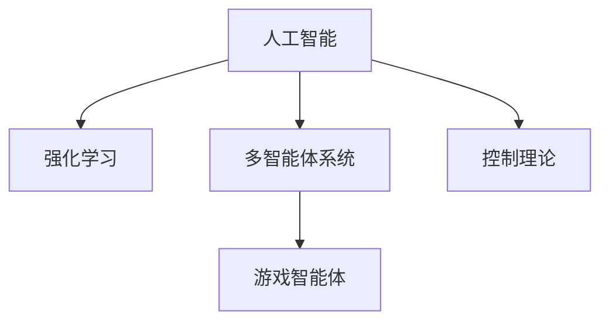

                 

# AI人工智能 Agent：游戏中智能体的应用

> 关键词：人工智能, 游戏智能体, 强化学习, 多智能体系统, 控制理论, 应用案例

## 1. 背景介绍

### 1.1 问题由来
随着人工智能技术的发展，智能体(Agent)的应用范围越来越广。在电子游戏领域，智能体已经从简单的规则制定者演变为复杂的自主决策系统，赋予了游戏新的生命力。AI Agent在游戏中扮演着越来越重要的角色，从简单的角色控制到复杂的策略博弈，智能体正逐步改变着人们的游戏体验。

### 1.2 问题核心关键点
游戏智能体（Game Agents）是游戏中自主决策的实体，通过感知环境状态、执行动作并评估结果，实现对游戏环境的适应和控制。其核心在于通过学习算法，积累经验，优化决策策略，从而实现自主、智能的决策。

游戏智能体的研究热点包括：

- **强化学习**：通过与环境的互动，智能体通过不断的试错，逐步优化决策策略，适应复杂多变的游戏环境。
- **多智能体系统**：多个智能体之间通过协作、竞争等策略实现复杂动态系统的模拟和控制。
- **控制理论**：结合控制理论的方法，优化智能体的决策过程，提高系统稳定性。

### 1.3 问题研究意义
研究游戏智能体，有助于开发更智能、更具有挑战性的游戏，提升玩家的游戏体验。此外，游戏智能体的应用还能推动AI技术在更广泛领域的应用，包括军事、医疗、自动驾驶等，为这些领域带来新的思路和方法。

## 2. 核心概念与联系

### 2.1 核心概念概述

为了更好地理解游戏智能体的应用，本节将介绍几个密切相关的核心概念：

- **人工智能(AI)**：通过算法和计算，赋予计算机系统类似于人类的智能，实现自主学习、推理和决策。
- **强化学习(RL)**：一种通过与环境互动，智能体通过试错学习，逐步优化决策策略的学习范式。
- **多智能体系统(MAS)**：多个智能体通过合作、竞争等方式，实现复杂系统的控制和模拟。
- **控制理论(CT)**：研究如何通过控制策略，优化系统性能和稳定性。
- **游戏智能体(Game Agents)**：游戏中自主决策的实体，通过感知环境、执行动作并评估结果，实现对游戏环境的适应和控制。

这些概念之间的逻辑关系可以通过以下Mermaid流程图来展示：



这个流程图展示了大语言模型的核心概念及其之间的关系：

1. 人工智能为智能体的研究和开发提供了理论基础。
2. 强化学习和多智能体系统为智能体的决策和协作提供了技术支撑。
3. 控制理论为智能体的控制策略优化提供了方法和工具。
4. 游戏智能体是人工智能、强化学习、多智能体系统、控制理论等理论在特定领域的应用，实现自主、智能的决策。

这些核心概念共同构成了游戏智能体的研究和应用框架，使其能够在复杂多变的游戏中发挥重要的作用。通过理解这些核心概念，我们可以更好地把握游戏智能体的工作原理和优化方向。

## 3. 核心算法原理 & 具体操作步骤
### 3.1 算法原理概述

游戏智能体的核心算法基于强化学习，其主要思想是通过智能体与环境的互动，通过不断的试错，逐步优化决策策略，实现自主、智能的决策。强化学习中，智能体的行为与环境交互，其目标是通过最大化累积奖励，学习最优决策策略。

形式化地，假设环境状态为 $S$，智能体行为为 $A$，奖励为 $R$，当前状态为 $s_t$，智能体采取行为 $a_t$，环境状态转移为 $s_{t+1}$，当前奖励为 $r_t$，智能体的决策策略为 $\pi$，则强化学习的目标是最大化期望的累积奖励：

$$
\max_\pi \mathbb{E}_{s_0 \sim p} \left[ \sum_{t=0}^\infty \gamma^t r_t \right]
$$

其中，$p$ 为环境的初始状态分布，$\gamma$ 为折扣因子，用以评估未来奖励的重要性。

### 3.2 算法步骤详解

基于强化学习的大语言模型微调一般包括以下几个关键步骤：

**Step 1: 环境构建与建模**
- 构建游戏环境，定义游戏规则和奖励机制。
- 定义状态空间和动作空间，分别表示智能体的感知和决策范围。

**Step 2: 智能体设计**
- 选择合适的智能体模型，如Q-Learning、Deep Q-Network等，设计智能体的策略和状态更新方法。
- 定义智能体的奖励函数，用于评估当前决策的好坏。
- 设计智能体的训练策略，如回合次数、学习率等。

**Step 3: 环境模拟与训练**
- 使用模拟环境对智能体进行训练，模拟游戏的具体场景。
- 智能体在每次回合中执行策略，与环境互动，获得奖励和状态反馈。
- 根据获得的奖励和状态反馈，更新智能体的决策策略。

**Step 4: 评估与优化**
- 在训练过程中，周期性评估智能体的性能，输出评价指标。
- 根据评估结果，优化智能体的训练策略，如调整学习率、策略更新方法等。
- 重复训练过程，直至智能体在特定任务上达到理想效果。

### 3.3 算法优缺点

基于强化学习的游戏智能体具有以下优点：
1. 灵活性强。智能体通过与环境的互动，可以逐步适应复杂多变的游戏场景。
2. 自主学习。智能体通过不断的试错，优化决策策略，实现自主决策。
3. 可扩展性好。智能体模型可以应用于多种类型的游戏，具有广泛的适用性。

同时，该方法也存在一定的局限性：
1. 需要大量训练数据。智能体的学习依赖于环境与智能体之间的互动，缺乏足够数据时，智能体的决策效果不佳。
2. 训练时间长。智能体的学习过程可能需要大量时间，特别是在高维度复杂空间中。
3. 策略难以解释。强化学习模型往往难以解释其决策过程，缺乏可解释性。
4. 过拟合风险。智能体在特定环境下表现良好，但换到新环境时，泛化能力有限。

尽管存在这些局限性，但就目前而言，强化学习范式仍是大语言模型应用的最主流范式。未来相关研究的重点在于如何进一步提高智能体的泛化能力，降低训练时间和数据需求，同时兼顾可解释性和稳定性等因素。

### 3.4 算法应用领域

基于强化学习的游戏智能体已经被广泛应用于各种类型的游戏中，例如：

- **策略游戏**：如《星际争霸》、《文明》等，智能体通过策略博弈实现胜利。
- **射击游戏**：如《使命召唤》、《彩虹六号》等，智能体通过动作执行和反应实现生存。
- **角色扮演游戏**：如《巫师3》、《上古卷轴V》等，智能体通过自主决策实现游戏剧情推进。
- **模拟类游戏**：如《模拟城市》、《城市天际线》等，智能体通过模拟城市运行实现管理优化。
- **体育类游戏**：如《FIFA》、《NBA2K》等，智能体通过协作和竞争实现游戏目标。

除了上述这些经典游戏外，智能体的应用还在不断拓展，如游戏中的AI设计、智能虚拟助手、自动驾驶等，为游戏技术带来了新的发展方向。随着强化学习技术的发展，未来智能体将在更多游戏场景中发挥重要作用，提升游戏体验和智能化水平。

## 4. 数学模型和公式 & 详细讲解  
### 4.1 数学模型构建

本节将使用数学语言对基于强化学习的游戏智能体进行更加严格的刻画。

记环境状态为 $s$，智能体行为为 $a$，奖励为 $R$，智能体的决策策略为 $\pi(a|s)$，智能体的状态转移概率为 $P(s_{t+1}|s_t,a_t)$，智能体的策略更新目标为 $\mathcal{L}(\pi)$。假设智能体与环境进行 $T$ 步互动，智能体的累计奖励为 $G_t$，则智能体的策略更新公式为：

$$
\max_\pi \mathbb{E}_{s_0 \sim p} \left[ \sum_{t=0}^{T-1} \gamma^t r_t + \gamma^T V_{\pi}(s_T) \right]
$$

其中，$V_{\pi}(s_t)$ 为策略 $\pi$ 在状态 $s_t$ 下的价值函数，即状态价值。

### 4.2 公式推导过程

以下我们以Q-Learning算法为例，推导智能体策略更新的详细公式。

Q-Learning算法是一种基于值函数（Value Function）的强化学习方法。其核心思想是利用值函数 $Q_{\pi}(s,a)$ 评估智能体在状态 $s$ 下采取行动 $a$ 的累积奖励，并通过策略更新公式 $Q_{\pi}(s,a) \leftarrow Q_{\pi}(s,a) + \eta (\mathcal{R}(s,a) - Q_{\pi}(s,a))$ 更新智能体的策略。

假设智能体当前状态为 $s_t$，采取行动 $a_t$，环境转移为 $s_{t+1}$，当前奖励为 $r_t$，则Q-Learning的策略更新公式为：

$$
Q_{\pi}(s_t,a_t) \leftarrow Q_{\pi}(s_t,a_t) + \eta (r_t + \gamma \max_{a} Q_{\pi}(s_{t+1},a) - Q_{\pi}(s_t,a_t))
$$

其中，$\eta$ 为学习率，$\max_{a} Q_{\pi}(s_{t+1},a)$ 为智能体在状态 $s_{t+1}$ 下采取行动的最大奖励。

在得到策略更新公式后，智能体在每次状态下采取行动时，通过评估当前状态下的所有行动，选择累积奖励最大的行动进行执行。

### 4.3 案例分析与讲解

以下我们以《星际争霸》游戏为例，对智能体的学习过程进行详细讲解。

**游戏环境建模**：
- 将《星际争霸》游戏划分为多个状态，如玩家的资源、矿场、建筑、部队等。
- 定义每个状态的具体特征，如玩家的当前人口、经济水平、敌我力量对比等。
- 设计行动空间，如玩家的扩张、科研、军事、资源管理等行动。

**智能体设计**：
- 使用Q-Learning算法设计智能体的策略，通过与游戏环境的互动，逐步学习最优策略。
- 定义智能体的奖励函数，如胜利、占领高地、消灭敌军等。
- 设计智能体的训练策略，如回合次数、学习率等。

**环境模拟与训练**：
- 使用模拟环境对智能体进行训练，模拟《星际争霸》的具体场景。
- 智能体在每次回合中执行策略，与环境互动，获得奖励和状态反馈。
- 根据获得的奖励和状态反馈，更新智能体的决策策略。

**评估与优化**：
- 在训练过程中，周期性评估智能体的性能，输出评价指标如胜率、经济增长率等。
- 根据评估结果，优化智能体的训练策略，如调整学习率、策略更新方法等。
- 重复训练过程，直至智能体在特定任务上达到理想效果。

## 5. 项目实践：代码实例和详细解释说明
### 5.1 开发环境搭建

在进行智能体实践前，我们需要准备好开发环境。以下是使用Python进行Reinforcement Learning开发的环境配置流程：

1. 安装Anaconda：从官网下载并安装Anaconda，用于创建独立的Python环境。

2. 创建并激活虚拟环境：
```bash
conda create -n rl-env python=3.8 
conda activate rl-env
```

3. 安装PyTorch：根据CUDA版本，从官网获取对应的安装命令。例如：
```bash
conda install pytorch torchvision torchaudio cudatoolkit=11.1 -c pytorch -c conda-forge
```

4. 安装Reinforcement Learning库：
```bash
pip install gym
pip install stable-baselines3
```

5. 安装各类工具包：
```bash
pip install numpy pandas scikit-learn matplotlib tqdm jupyter notebook ipython
```

完成上述步骤后，即可在`rl-env`环境中开始智能体实践。

### 5.2 源代码详细实现

下面我们以Q-Learning算法在《星际争霸》游戏中的应用为例，给出使用PyTorch和Stable-Baselines3进行智能体开发的Python代码实现。

首先，定义智能体与环境的交互逻辑：

```python
from stable_baselines3 import DDPG
from stable_baselines3.common.env_util import make_vec_env

env = make_vec_env('Stargate-v1', n_envs=1)

class MyModel(DDPG):
    def __init__(self, env):
        super(MyModel, self).__init__(env)
        self.model = self.policy

    def forward(self, observation, actions=None):
        return self.model(observation, actions)

agent = MyModel(env)
```

然后，定义智能体的训练逻辑：

```python
from stable_baselines3 import PPO
from stable_baselines3.common.vec_env import VecNormalize
from stable_baselines3.common.evaluation import evaluate_policy
from stable_baselines3.common.callbacks import StopTraining

def train(agent, env, max_episodes=1000):
    total_reward = 0
    for episode in range(max_episodes):
        obs = env.reset()
        episode_reward = 0
        done = False
        while not done:
            action, _states = agent.predict(obs)
            obs, reward, done, info = env.step(action)
            total_reward += reward
            obs = VecNormalize.transform(obs)
        print(f'Episode {episode+1}/{max_episodes} | Reward {total_reward}')
    return total_reward

total_reward = train(agent, env)
```

最后，对智能体的性能进行评估：

```python
evaluation_reward = evaluate_policy(agent, env, n_eval_episodes=20, deterministic=True)
print(f'Evaluation reward: {evaluation_reward:.2f}')
```

以上就是使用PyTorch和Stable-Baselines3对《星际争霸》游戏进行智能体微调的完整代码实现。可以看到，通过Stable-Baselines3库，可以轻松实现智能体的微调，并调用评价函数进行性能评估。

### 5.3 代码解读与分析

让我们再详细解读一下关键代码的实现细节：

**MyModel类**：
- 继承自Stable-Baselines3的DDPG模型，自定义模型输出逻辑。
- 重载`forward`方法，实现智能体的决策输出。

**训练逻辑**：
- 定义训练函数`train`，循环执行训练过程，并输出每集的奖励。
- 在训练过程中，智能体通过与环境的互动，逐步优化策略。

**评估逻辑**：
- 使用Stable-Baselines3的`evaluate_policy`函数，在评价集上评估智能体的性能。
- 输出智能体在评价集上的平均奖励。

可以看到，使用Reinforcement Learning库可以方便地实现智能体的微调，并评估其性能。在实际应用中，还需要根据具体游戏特点，对智能体的策略、奖励函数等进行优化设计，以实现更加高效和智能的决策。

## 6. 实际应用场景
### 6.1 智能兵群控制

在《星际争霸》等策略游戏中，智能兵群控制是一个重要应用场景。智能体需要根据当前状态，制定最优的军事行动计划，实现对敌军的有效打击和资源管理。

在实践中，可以收集大量的游戏数据，构建训练集。使用Q-Learning等强化学习方法，训练智能体在面对不同情况时，采取最优的行动策略。智能体可以在训练过程中不断优化决策，直至达到理想的控制效果。

### 6.2 自动战术调整

游戏中的战术制定和调整也是一个重要应用场景。智能体需要根据当前战况，动态调整战术方案，以适应不断变化的游戏环境。

在实际应用中，可以设计多个战术方案，使用强化学习方法训练智能体在不同情况下选择最优的战术。智能体在训练过程中，会逐步学习到最优的战术调整策略，并能够在实际游戏中灵活应用。

### 6.3 资源优化管理

资源优化管理是游戏中常见的应用场景。智能体需要根据当前资源状态，合理分配资源，以实现最大的经济收益。

在实践中，可以设计资源管理策略，使用强化学习方法训练智能体在面对不同资源情况时，采取最优的资源分配方案。智能体在训练过程中，会逐步学习到最优的资源分配策略，并能够在实际游戏中实现资源优化管理。

### 6.4 未来应用展望

随着强化学习技术的发展，基于智能体的应用场景将不断扩展。未来，智能体将在更多游戏中发挥重要作用，提升游戏体验和智能化水平。

在军事领域，智能体将用于模拟战争、战略分析等，辅助决策制定。在自动驾驶领域，智能体将用于交通流量控制、自动泊车等，提升车辆驾驶的安全性和效率。在医疗领域，智能体将用于疾病诊断、治疗方案选择等，提升医疗服务的智能化水平。

此外，智能体的应用还在不断拓展，如机器人控制、智能家居等，为各行各业带来新的发展方向。相信随着强化学习技术的发展，智能体将在更多应用场景中发挥重要作用，推动人工智能技术的普及和应用。

## 7. 工具和资源推荐
### 7.1 学习资源推荐

为了帮助开发者系统掌握强化学习技术，这里推荐一些优质的学习资源：

1. 《Reinforcement Learning: An Introduction》（即RL教材）：由Richard S. Sutton和Andrew G. Barto编写，全面介绍了强化学习的理论基础和算法。

2. 《Hands-On Reinforcement Learning with PyTorch》：由Aurélien Géron撰写，通过具体项目实践，介绍了PyTorch在强化学习中的应用。

3. 《Deep Reinforcement Learning with Stable Baselines》：由OpenAI开发的Stable Baselines库文档，详细介绍了Stable Baselines库的使用方法和算法实现。

4. CS294-38《Deep Reinforcement Learning》课程：斯坦福大学开设的强化学习课程，涵盖强化学习的理论和实践，提供了大量的学习材料和项目实践。

5. GitHub强化学习项目：GitHub上众多开源强化学习项目，提供了大量的代码实现和实验结果，可供学习和参考。

通过对这些资源的学习实践，相信你一定能够快速掌握强化学习的精髓，并用于解决实际的智能体问题。

### 7.2 开发工具推荐

高效的开发离不开优秀的工具支持。以下是几款用于强化学习智能体开发的常用工具：

1. PyTorch：基于Python的开源深度学习框架，灵活动态的计算图，适合快速迭代研究。支持Stable Baselines库，提供了丰富的强化学习算法实现。

2. TensorFlow：由Google主导开发的开源深度学习框架，生产部署方便，适合大规模工程应用。支持TensorFlow Agents库，提供了多智能体系统的实现。

3. Stable-Baselines3：OpenAI开发的开源强化学习库，提供了多种常用的强化学习算法实现，包括PPO、SAC等。

4. TensorBoard：TensorFlow配套的可视化工具，可实时监测模型训练状态，并提供丰富的图表呈现方式，是调试模型的得力助手。

5. Jupyter Notebook：交互式的Python编程环境，支持代码的快速编写、测试和迭代，适合实验和教学。

合理利用这些工具，可以显著提升强化学习智能体的开发效率，加快创新迭代的步伐。

### 7.3 相关论文推荐

强化学习技术的发展离不开学界的持续研究。以下是几篇奠基性的相关论文，推荐阅读：

1. Q-Learning：Temporal-Difference Learning and TD-Gammon，由W.S. Sutton和R.S. Barto于1998年发表，提出了Q-Learning算法，奠定了强化学习理论基础。

2. Deep Q-Network：Playing Atari with Deep Reinforcement Learning，由D.A. Silver等人在2016年发表，提出了Deep Q-Network算法，推动了深度强化学习的发展。

3. Multi-Agent Deep Reinforcement Learning：A Simple Approach for Maximizing Cross-Domain Social Welfare，由M. Zhang等人在2020年发表，介绍了多智能体系统在社会福利最大化中的应用。

4. AlphaGo Zero：Mastering the Game of Go without Human Knowledge，由D.A. Silver等人在2017年发表，介绍了AlphaGo Zero算法的实现和应用。

这些论文代表了大语言模型微调技术的发展脉络。通过学习这些前沿成果，可以帮助研究者把握学科前进方向，激发更多的创新灵感。

## 8. 总结：未来发展趋势与挑战

### 8.1 总结

本文对基于强化学习的游戏智能体进行了全面系统的介绍。首先阐述了游戏智能体的研究和应用背景，明确了智能体在复杂多变的游戏环境中的决策优化需求。其次，从原理到实践，详细讲解了智能体的数学模型和算法步骤，给出了智能体开发的完整代码实例。同时，本文还广泛探讨了智能体在智能兵群控制、自动战术调整、资源优化管理等多个游戏场景中的应用前景，展示了智能体的巨大潜力。

通过本文的系统梳理，可以看到，基于强化学习的游戏智能体正逐步成为游戏开发的重要技术手段，极大地提升游戏体验和智能化水平。未来，伴随强化学习技术的持续演进，基于智能体的应用将更加广泛，为游戏领域带来更多的创新和发展。

### 8.2 未来发展趋势

展望未来，强化学习技术在游戏智能体的应用中呈现以下几个发展趋势：

1. 模型规模持续增大。随着算力成本的下降和数据规模的扩张，强化学习模型的参数量还将持续增长。超大规模模型蕴含的丰富游戏知识，有望支撑更加复杂多变的游戏场景。

2. 模型泛化能力增强。通过引入预训练、迁移学习等技术，智能体可以更好地泛化到新游戏环境，提升智能体的适应性和可移植性。

3. 智能体协作能力提升。多智能体系统的发展，将使智能体之间的协作更加高效，实现复杂多变的游戏环境控制。

4. 实时学习与更新。结合在线学习、增量学习等技术，智能体可以实时更新策略，适应不断变化的游戏环境。

5. 知识表示与推理。结合符号推理、知识图谱等技术，智能体可以实现更加复杂的知识整合和推理，提升决策的合理性和准确性。

6. 情感智能与交互。引入情感智能和交互技术，智能体可以更好地理解玩家情感和行为，提供更加个性化的游戏体验。

以上趋势凸显了强化学习在游戏智能体应用中的广阔前景。这些方向的探索发展，必将进一步提升游戏智能体的性能和应用范围，为游戏领域带来新的突破。

### 8.3 面临的挑战

尽管强化学习技术在游戏智能体的应用中取得了一定成效，但在迈向更加智能化、普适化应用的过程中，仍然面临诸多挑战：

1. 训练成本高昂。训练强化学习模型需要大量的计算资源和时间，对于复杂多变的游戏场景，训练成本尤为昂贵。如何降低训练成本，提高训练效率，将是重要的研究方向。

2. 过拟合风险。智能体在特定游戏环境中表现良好，但换到新环境时，泛化能力有限。如何提高智能体的泛化能力，降低过拟合风险，是未来的研究重点。

3. 决策透明性不足。强化学习模型的决策过程难以解释，缺乏可解释性。对于复杂多变的游戏场景，决策透明性尤为重要。如何赋予智能体决策的可解释性，将是亟待攻克的难题。

4. 安全性风险。智能体在训练过程中可能学习到有害信息，造成安全风险。如何确保智能体的安全性，防止有害信息的传播，是未来的研究方向。

5. 性能瓶颈。强化学习模型在高维、非线性空间中训练，可能面临性能瓶颈。如何优化智能体的训练过程，提高模型性能，是重要的优化方向。

6. 伦理道德问题。智能体在训练和应用过程中，可能涉及隐私、版权等问题。如何在智能体开发和应用过程中遵循伦理道德规范，是未来的重要课题。

正视这些挑战，积极应对并寻求突破，将使强化学习技术在游戏智能体应用中发挥更大的作用，推动游戏行业的创新和进步。

### 8.4 研究展望

面对强化学习技术在游戏智能体应用中面临的挑战，未来的研究需要在以下几个方面寻求新的突破：

1. 探索无监督和半监督学习范式。摆脱对大规模标注数据的依赖，利用自监督学习、主动学习等无监督和半监督范式，最大限度利用非结构化数据，实现更加灵活高效的智能体学习。

2. 研究参数高效与计算高效的智能体学习范式。开发更加参数高效的智能体学习算法，在固定大部分预训练参数的同时，只更新极少量的任务相关参数。同时优化智能体的计算图，减少前向传播和反向传播的资源消耗，实现更加轻量级、实时性的部署。

3. 引入因果推断和对比学习思想。通过引入因果推断和对比学习思想，增强智能体建立稳定因果关系的能力，学习更加普适、鲁棒的游戏知识，从而提升智能体的泛化性和抗干扰能力。

4. 融合符号推理和知识图谱。将符号推理和知识图谱等技术引入智能体学习过程，结合符号化先验知识，引导智能体学习更全面、准确的游戏知识。

5. 结合情感智能与交互技术。引入情感智能和交互技术，使智能体能够更好地理解玩家情感和行为，提供更加个性化的游戏体验。

6. 纳入伦理道德约束。在智能体训练目标中引入伦理导向的评估指标，过滤和惩罚有害的输出倾向。同时加强人工干预和审核，建立智能体行为的监管机制，确保输出符合人类价值观和伦理道德。

这些研究方向的探索，必将引领强化学习技术在游戏智能体应用中迈向更高的台阶，为游戏领域带来新的突破。面向未来，强化学习技术在游戏智能体应用中还需要与其他人工智能技术进行更深入的融合，如知识表示、因果推理、强化学习等，多路径协同发力，共同推动游戏行业的创新和进步。只有勇于创新、敢于突破，才能不断拓展游戏智能体的边界，让智能技术更好地造福游戏玩家。

## 9. 附录：常见问题与解答

**Q1：强化学习算法在游戏智能体应用中的优势是什么？**

A: 强化学习算法在游戏智能体应用中的优势主要体现在以下几个方面：
1. 自主学习：智能体通过与环境的互动，逐步学习最优策略，实现自主决策。
2. 适应性强：智能体能够适应复杂多变的游戏场景，灵活应对各种突发情况。
3. 泛化能力强：智能体通过不断的试错，能够学习到更普适的决策策略，适应新游戏环境。
4. 可扩展性好：智能体模型可以应用于多种类型的游戏，具有广泛的适用性。

尽管强化学习算法在游戏智能体应用中存在训练时间长、过拟合风险高等问题，但其自主学习和适应性强的优势，使其成为智能体开发的重要技术手段。

**Q2：强化学习算法在游戏智能体应用中存在哪些局限性？**

A: 强化学习算法在游戏智能体应用中存在以下局限性：
1. 训练成本高昂：训练强化学习模型需要大量的计算资源和时间，特别是在复杂多变的游戏场景中，训练成本尤为昂贵。
2. 过拟合风险：智能体在特定游戏环境中表现良好，但换到新环境时，泛化能力有限。
3. 决策透明性不足：强化学习模型的决策过程难以解释，缺乏可解释性。
4. 安全性风险：智能体在训练过程中可能学习到有害信息，造成安全风险。
5. 性能瓶颈：在高维、非线性空间中训练，可能面临性能瓶颈。
6. 伦理道德问题：智能体在训练和应用过程中，可能涉及隐私、版权等问题。

尽管存在这些局限性，但通过不断优化算法和改进训练策略，强化学习算法在游戏智能体应用中仍具有重要价值。

**Q3：如何提高强化学习智能体的泛化能力？**

A: 提高强化学习智能体的泛化能力，可以通过以下几种方式：
1. 数据增强：通过数据扩充、回译等方式，增加训练集的多样性。
2. 多智能体系统：通过多个智能体之间的协作和竞争，提升智能体的泛化能力。
3. 预训练与迁移学习：在特定游戏环境中预训练智能体，然后将其迁移应用到新环境。
4. 多任务学习：在训练过程中，同时优化多个任务，提升智能体的泛化能力。
5. 对抗训练：引入对抗样本，提高智能体的鲁棒性和泛化能力。

这些方法可以在一定程度上提升智能体的泛化能力，使其更好地适应新游戏环境。

**Q4：如何确保强化学习智能体的安全性？**

A: 确保强化学习智能体的安全性，可以通过以下几种方式：
1. 数据过滤：在训练过程中，过滤有害的样本，避免智能体学习到有害信息。
2. 鲁棒性增强：通过对抗训练、正则化等方法，增强智能体的鲁棒性，避免过拟合和泛化不足。
3. 安全性检测：在智能体应用过程中，定期检测智能体的行为，发现潜在的安全隐患。
4. 人工干预：在智能体应用过程中，及时进行人工干预，防止有害信息的传播。

这些方法可以在一定程度上确保智能体的安全性，防止有害信息的传播。

**Q5：如何提高强化学习智能体的决策透明性？**

A: 提高强化学习智能体的决策透明性，可以通过以下几种方式：
1. 决策可视化：通过可视化智能体的决策过程，展示智能体的推理逻辑和行为。
2. 可解释性模型：使用可解释性模型，如决策树、线性模型等，提升智能体决策的可解释性。
3. 训练数据扰动：在训练过程中，引入扰动数据，引导智能体学习更稳定的决策策略。
4. 知识图谱：使用知识图谱等符号化知识，引导智能体学习更全面的决策策略。

这些方法可以在一定程度上提高智能体的决策透明性，帮助玩家更好地理解智能体的决策过程。

---

作者：禅与计算机程序设计艺术 / Zen and the Art of Computer Programming

