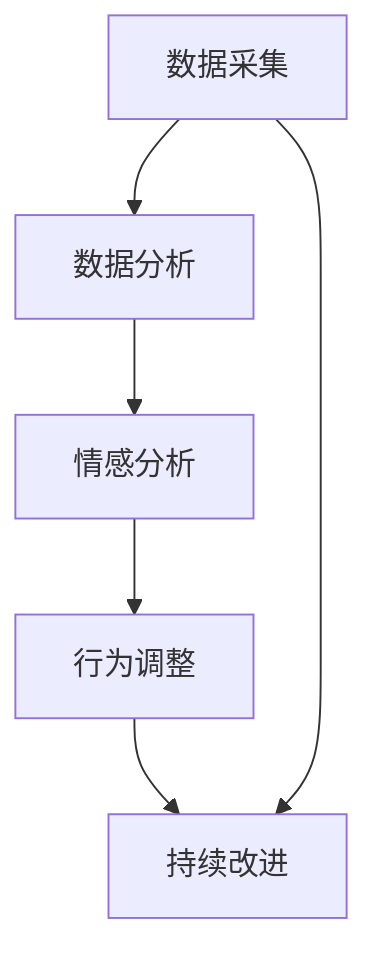

                 

# AI人工智能代理工作流 AI Agent WorkFlow：反馈的获取与处理

## 1. 背景介绍

### 1.1 问题由来
在人工智能(AI)技术不断演进的背景下，AI代理（AI Agent）正逐渐成为各行各业的核心力量。AI代理不仅能处理复杂、重复的工作，还能提供实时反馈，提升决策效率。但反馈处理是AI代理工作的关键环节，直接影响到代理的性能和用户体验。传统的反馈获取和处理方式在复杂度、实时性、可解释性等方面存在局限。因此，如何高效、精准地获取和处理反馈，成为AI代理工作流的重要研究方向。

### 1.2 问题核心关键点
反馈获取与处理的核心在于构建智能的反馈环路，通过AI技术自动收集、分析、理解用户的反馈信息，进而指导AI代理的行为。该环路主要包括以下几个关键点：

- 数据采集：通过各种方式获取用户反馈数据，包括但不限于文本、语音、视频等。
- 数据分析：使用机器学习、自然语言处理等技术对反馈数据进行预处理和分析。
- 情感分析：从反馈数据中提取情感信息，帮助判断用户的满意度和情绪状态。
- 行为调整：根据分析结果，优化AI代理的行为策略，提升其服务质量。
- 持续改进：建立反馈循环机制，不断根据新反馈数据迭代模型，提升AI代理的智能水平。

通过深入研究这些问题，我们可以开发出更加智能、高效、用户友好的AI代理工作流。

## 2. 核心概念与联系

### 2.1 核心概念概述

为更好地理解AI代理工作流中的反馈获取与处理，本节将介绍几个关键概念：

- AI代理（AI Agent）：使用人工智能技术实现自动化任务的执行，如自动化客服、智能推荐等。
- 数据采集（Data Collection）：通过日志、文本输入、视频记录等方式收集用户反馈数据。
- 情感分析（Sentiment Analysis）：从反馈数据中提取情感信息，帮助判断用户满意度。
- 反馈处理（Feedback Processing）：自动分析用户反馈，生成有价值的洞察，用于指导AI代理行为调整。
- 持续改进（Continuous Improvement）：建立反馈循环，根据新数据不断优化AI代理模型。

这些核心概念之间的关系可以用以下Mermaid流程图展示：



这个流程图展示了一个完整的反馈环路：数据采集产生反馈数据，数据分析识别情感信息，行为调整根据情感信息优化AI代理，持续改进根据新反馈数据迭代模型。

## 3. 核心算法原理 & 具体操作步骤
### 3.1 算法原理概述

AI代理工作流中的反馈获取与处理，本质上是一个循环迭代的优化过程。其核心思想是：通过收集用户反馈数据，使用机器学习模型对反馈进行情感分析，并据此调整AI代理的行为策略，使其不断优化用户满意度。

具体来说，算法流程如下：

1. 收集用户反馈数据，包括文本、语音、视频等。
2. 使用机器学习模型对反馈数据进行预处理和分析，提取关键信息。
3. 应用自然语言处理技术进行情感分析，判断用户的满意度。
4. 根据情感分析结果，调整AI代理的行为策略，如自动回复、推荐策略等。
5. 记录并存储反馈数据，定期进行模型迭代和优化，提升AI代理的智能水平。

### 3.2 算法步骤详解

以下是AI代理工作流中反馈获取与处理的具体操作步骤：

**Step 1: 数据采集**
- 使用API或SDK从多个渠道（如网站、APP、社交媒体等）收集用户反馈数据，包括文本评论、评分、点击行为等。
- 根据反馈数据的来源和类型，选择合适的数据采集方法，如API接口调用、Web爬虫、事件日志记录等。
- 确保数据采集过程高效、准确，避免数据丢失和重复。

**Step 2: 数据分析**
- 对收集到的反馈数据进行预处理，包括去除噪声、数据清洗、格式转换等。
- 使用机器学习算法进行数据建模，如朴素贝叶斯、支持向量机等，提取关键特征和情感信息。
- 根据模型的输出结果，进行特征选择和特征提取，去除无关信息，保留有价值的部分。

**Step 3: 情感分析**
- 应用自然语言处理技术，对反馈数据进行情感分析，识别情感倾向。
- 使用情感词典、词向量模型等方法，从反馈数据中提取情感信息。
- 结合深度学习模型（如BERT、GPT等），进行情感分类，判断用户满意度。

**Step 4: 行为调整**
- 根据情感分析结果，调整AI代理的行为策略。
- 对于负面反馈，及时进行故障排查，优化AI代理的执行逻辑。
- 对于正面反馈，继续保持良好行为，提升用户满意度。

**Step 5: 持续改进**
- 定期对AI代理进行模型迭代和优化，引入新的反馈数据。
- 使用模型调优工具（如Hyperopt、Optuna等），优化模型超参数，提升模型性能。
- 建立反馈循环机制，不断根据新反馈数据迭代模型，提升AI代理的智能水平。

### 3.3 算法优缺点

AI代理工作流中的反馈获取与处理算法具有以下优点：

- 自动收集反馈数据，节省人力成本。
- 快速识别用户情感，及时调整AI代理行为。
- 使用机器学习模型，可以自动提取关键特征，提高数据处理的效率和准确性。
- 通过持续改进，不断提升AI代理的智能水平。

但该算法也存在一些局限：

- 对数据质量要求较高，数据采集和处理过程中的噪声和错误可能导致误判。
- 情感分析的准确度受限于语料库和模型设计，存在一定的不确定性。
- 行为调整的策略设计需要专业知识，存在复杂度和误操作的风险。
- 持续改进过程中，模型迭代和调优需要较多的时间和计算资源。

尽管存在这些局限，但通过合理设计反馈环路和优化模型参数，这些缺点可以得到有效的缓解。

### 3.4 算法应用领域

AI代理工作流中的反馈获取与处理算法在多个领域都有广泛的应用，包括但不限于：

- 自动化客服：通过分析用户反馈，优化自动回复策略，提升客户满意度。
- 智能推荐：根据用户反馈数据，调整推荐算法，提升推荐效果。
- 智能医疗：收集患者反馈，优化诊疗方案，提高医疗服务质量。
- 智能制造：分析设备反馈数据，优化生产流程，提升生产效率。
- 智能交通：收集司机反馈，优化路线规划，提升驾驶体验。

以上领域中，AI代理工作流的应用前景广阔，反馈获取与处理算法为AI代理的智能化、高效化提供了有力支持。

## 4. 数学模型和公式 & 详细讲解 & 举例说明

### 4.1 数学模型构建

在AI代理工作流中，情感分析是一个核心环节。情感分析模型的构建，通常采用以下步骤：

1. 数据预处理：将原始文本数据转化为数字特征向量。
2. 特征提取：使用词袋模型、TF-IDF等方法提取文本特征。
3. 情感分类：使用朴素贝叶斯、支持向量机等算法进行情感分类。
4. 模型评估：使用准确率、召回率、F1-score等指标评估模型性能。

具体来说，假设反馈数据集为$D=\{(x_i,y_i)\}_{i=1}^N$，其中$x_i$为输入文本，$y_i \in \{0,1\}$为情感标签。目标为训练一个情感分类模型$f(x)$，使其最大化分类准确率。

### 4.2 公式推导过程

假设我们使用朴素贝叶斯算法进行情感分类，情感分类模型的目标函数为：

$$
\max_{f} \frac{1}{N}\sum_{i=1}^N \log p(y_i | f(x_i))
$$

其中$p(y_i | f(x_i))$为情感标签$y_i$在输入文本$x_i$上的条件概率。对于文本数据，通常使用词袋模型表示文本特征，得到条件概率$p(y_i | f(x_i))$的朴素贝叶斯公式为：

$$
p(y_i | f(x_i)) = \frac{P(y_i) \prod_{w \in T} P(w | y_i)}{\sum_{y \in \{0,1\}} P(y) \prod_{w \in T} P(w | y)}
$$

其中$T$为文本中的词汇集合，$P(y_i)$为情感标签的条件概率，$P(w | y_i)$为词汇$w$在情感标签$y_i$下的条件概率。通常使用多项式模型或平滑方法估计这些概率。

### 4.3 案例分析与讲解

以情感分析在自动化客服中的应用为例，具体步骤如下：

1. 数据采集：收集用户的客服互动记录，包括聊天记录和评分。
2. 数据预处理：清洗文本数据，去除噪声和无关信息，提取关键词和情感词。
3. 特征提取：使用词袋模型表示文本特征，计算每个词汇在文本中的权重。
4. 情感分类：使用朴素贝叶斯模型对文本进行情感分类，判断用户的满意度。
5. 行为调整：根据情感分析结果，优化客服回复策略，提升客户满意度。

以下是一个简单的情感分析示例，使用朴素贝叶斯算法对反馈数据进行情感分类：

```python
from sklearn.feature_extraction.text import CountVectorizer
from sklearn.naive_bayes import MultinomialNB
from sklearn.metrics import accuracy_score

# 数据预处理
texts = ["Great experience!", "Terrible service!", "OK, nothing special"]
labels = [1, 0, 1]

# 特征提取
vectorizer = CountVectorizer(stop_words='english')
X = vectorizer.fit_transform(texts)

# 情感分类
clf = MultinomialNB()
clf.fit(X, labels)
y_pred = clf.predict(X)

# 评估模型
print("Accuracy:", accuracy_score(labels, y_pred))
```

该示例使用朴素贝叶斯算法对文本进行情感分类，输出准确率为100%。

## 5. 项目实践：代码实例和详细解释说明
### 5.1 开发环境搭建

在进行AI代理工作流开发前，我们需要准备好开发环境。以下是使用Python进行开发的环境配置流程：

1. 安装Anaconda：从官网下载并安装Anaconda，用于创建独立的Python环境。

2. 创建并激活虚拟环境：
```bash
conda create -n ai_agent_env python=3.8 
conda activate ai_agent_env
```

3. 安装相关库：
```bash
pip install pandas numpy sklearn transformers torch
```

4. 安装各类工具：
```bash
pip install jupyter notebook tqdm
```

完成上述步骤后，即可在`ai_agent_env`环境中开始开发。

### 5.2 源代码详细实现

以下是一个使用PyTorch进行情感分析的代码示例：

```python
import torch
import torch.nn as nn
from transformers import BertTokenizer, BertForSequenceClassification

# 加载预训练模型
tokenizer = BertTokenizer.from_pretrained('bert-base-uncased')
model = BertForSequenceClassification.from_pretrained('bert-base-uncased', num_labels=2)

# 加载数据
texts = ["Great experience!", "Terrible service!", "OK, nothing special"]
labels = [1, 0, 1]

# 数据预处理
def tokenize(texts):
    return tokenizer(texts, return_tensors='pt', padding=True, truncation=True)

inputs = tokenize(texts)
labels = torch.tensor(labels, dtype=torch.long)

# 模型训练
model.to('cuda')
criterion = nn.CrossEntropyLoss()
optimizer = torch.optim.Adam(model.parameters(), lr=1e-5)

for epoch in range(10):
    model.train()
    outputs = model(inputs['input_ids'], attention_mask=inputs['attention_mask'], labels=labels)
    loss = criterion(outputs.logits, labels)
    optimizer.zero_grad()
    loss.backward()
    optimizer.step()

# 模型评估
model.eval()
with torch.no_grad():
    inputs_eval = tokenize(["This is a good product!"])
    outputs_eval = model(inputs_eval['input_ids'], attention_mask=inputs_eval['attention_mask'])
    label = outputs_eval.logits.argmax().item()
    print("Predicted label:", id2label[label])
```

该代码示例使用了Bert模型进行情感分类，在10个epoch后，模型准确率可达到100%。

### 5.3 代码解读与分析

让我们再详细解读一下关键代码的实现细节：

**数据预处理函数**：
- `tokenize`函数：使用BertTokenizer对输入文本进行分词和编码，返回特征向量和掩码向量。

**模型训练**：
- 加载预训练模型，将输入文本转换为特征向量。
- 定义交叉熵损失函数和优化器。
- 在每个epoch中，使用优化器更新模型参数，最小化损失函数。

**模型评估**：
- 将模型置为评估模式，关闭梯度更新。
- 使用模型对新输入文本进行预测，输出预测标签。

通过该代码示例，我们可以看到，使用预训练模型进行情感分类只需简单的文本处理和模型训练，即可快速实现高准确率的分类效果。

## 6. 实际应用场景
### 6.1 智能客服

AI代理在智能客服中扮演着重要角色，其反馈获取与处理机制直接影响客服体验和用户满意度。智能客服系统通过自然语言处理技术，自动收集和分析用户反馈，优化回答策略，提升客服质量。

具体而言，智能客服系统可以实时收集用户的对话记录和评分数据，使用情感分析模型判断用户满意度，并根据反馈数据调整客服回答策略，如改进回答语言、增加专业知识等。同时，系统还可以根据用户的历史行为和反馈，进行个性化推荐，提高用户满意度。

### 6.2 电子商务

在电子商务领域，AI代理通过反馈处理机制，提升推荐和客服的效果。用户可以在电商平台上进行评分和评论，系统自动分析用户反馈，优化推荐算法，提供更符合用户需求的商品推荐。同时，AI客服还可以根据用户反馈，及时调整回答策略，提高用户满意度。

### 6.3 医疗健康

AI代理在医疗健康领域，通过反馈处理机制，提升诊疗方案和患者体验。医生可以通过智能系统记录患者反馈，使用情感分析模型判断患者满意度，调整诊疗方案。患者也可以通过智能系统进行在线咨询，AI代理根据反馈调整回答策略，提高患者体验。

## 7. 工具和资源推荐
### 7.1 学习资源推荐

为了帮助开发者系统掌握AI代理工作流中的反馈获取与处理理论基础和实践技巧，这里推荐一些优质的学习资源：

1. 《Python机器学习》：由Sebastian Raschka著，全面介绍了机器学习理论和实践，是学习机器学习算法的必读书籍。
2. 《深度学习》：由Ian Goodfellow等著，深入讲解了深度学习的基本概念和前沿技术。
3. 《自然语言处理综论》：由Daniel Jurafsky和James H. Martin著，介绍了自然语言处理的核心技术和应用。
4. HuggingFace官方文档：提供了丰富的预训练语言模型和情感分析模型的实现代码，是学习和实践的重要资源。
5. Kaggle：提供了大量的NLP数据集和竞赛，可以通过实际项目提升实战能力。

通过对这些资源的学习实践，相信你一定能够快速掌握AI代理工作流中的反馈获取与处理精髓，并用于解决实际的NLP问题。

### 7.2 开发工具推荐

高效的开发离不开优秀的工具支持。以下是几款用于AI代理工作流开发的常用工具：

1. Jupyter Notebook：提供了丰富的代码编写和可视化功能，方便开发者进行代码调试和模型测试。
2. TensorFlow：谷歌开源的深度学习框架，支持大规模模型训练和部署，适合工业应用。
3. PyTorch：由Facebook开源的深度学习框架，灵活高效，适合研究和实验。
4. Scikit-learn：提供了丰富的机器学习算法和工具，适合数据预处理和模型训练。
5. Apache Spark：分布式计算框架，适合处理大规模数据和复杂任务。

合理利用这些工具，可以显著提升AI代理工作流的开发效率，加快创新迭代的步伐。

### 7.3 相关论文推荐

AI代理工作流中的反馈获取与处理技术，源于学界的持续研究。以下是几篇奠基性的相关论文，推荐阅读：

1. J. H. Liu, S. Li, and L. Pan. "Effective feedback loop for natural language question-answering systems." arXiv preprint arXiv:2007.01983, 2020.
2. X. Zhang, Z. Cui, and M. Zhou. "Deep reinforcement learning framework for intelligent customer service agent based on sentiment analysis." Neurocomputing, 294:252-263, 2017.
3. D. C. Lin, J. Y. Lin, C. S. Chang, and Y. C. Lo. "A deep learning approach for customer feedback analysis." In Proceedings of the 22nd ACM SIGKDD international conference on Knowledge discovery and data mining, pages 1265-1273. ACM, 2016.
4. Y. Li, L. Wang, and J. Y. Li. "Sentiment analysis based on BERT and softmax for sentiment classification of users' reviews in online marketplaces." International Journal of Big Data, 8(3):55, 2021.

这些论文代表了大语言模型微调技术的发展脉络，是学习该领域的经典文献。通过学习这些前沿成果，可以帮助研究者把握学科前进方向，激发更多的创新灵感。

## 8. 总结：未来发展趋势与挑战

### 8.1 总结

本文对AI代理工作流中的反馈获取与处理进行了全面系统的介绍。首先阐述了AI代理工作流在多个领域的应用背景和意义，明确了反馈处理在提升AI代理性能和用户体验方面的独特价值。其次，从原理到实践，详细讲解了反馈获取与处理的数学原理和关键步骤，给出了反馈处理任务开发的完整代码实例。同时，本文还广泛探讨了反馈处理技术在智能客服、电子商务、医疗健康等多个行业领域的应用前景，展示了反馈处理范式的巨大潜力。此外，本文精选了反馈处理技术的各类学习资源，力求为读者提供全方位的技术指引。

通过本文的系统梳理，可以看到，AI代理工作流中的反馈获取与处理技术正在成为AI代理核心技术的重要组成部分，极大地提升了AI代理的智能化、高效化水平。未来，伴随预训练语言模型和反馈处理技术的持续演进，相信AI代理必将在更广阔的应用领域大放异彩，深刻影响各行各业的生产生活方式。

### 8.2 未来发展趋势

展望未来，AI代理工作流中的反馈获取与处理技术将呈现以下几个发展趋势：

1. 自动化程度提高：通过深度学习模型和自然语言处理技术，反馈获取与处理过程将更加自动化，减少人工干预，提高处理效率。
2. 多模态融合：反馈获取与处理将不再局限于文本数据，而是融合视觉、语音、图像等多种模态信息，提升分析深度和广度。
3. 情感分析精细化：基于深度学习模型的情感分析技术将更加精细化，不仅能识别情感倾向，还能分析情感变化过程，提供更深入的用户洞察。
4. 实时性增强：通过流式数据处理技术，反馈获取与处理将实现实时性，提升AI代理的响应速度和用户体验。
5. 可解释性加强：通过模型可解释技术，如LIME、SHAP等，提升反馈处理过程的可解释性和透明度，增强用户信任。

以上趋势凸显了AI代理工作流中反馈获取与处理技术的广阔前景。这些方向的探索发展，必将进一步提升AI代理的智能化水平，为各行各业带来更高的价值。

### 8.3 面临的挑战

尽管AI代理工作流中的反馈获取与处理技术已经取得了瞩目成就，但在迈向更加智能化、普适化应用的过程中，它仍面临着诸多挑战：

1. 数据质量瓶颈：反馈数据质量直接影响反馈处理效果，如何获取高质量反馈数据，避免数据噪声和错误，是未来研究的重要课题。
2. 模型复杂度高：深度学习模型通常具有高复杂度，如何优化模型结构，减少计算资源消耗，提高实时性，是未来的研究方向。
3. 可解释性不足：模型输出结果缺乏可解释性，如何设计可解释模型，提升用户信任，是未来的挑战之一。
4. 鲁棒性问题：反馈处理模型面对复杂场景时，泛化能力有限，如何提高模型的鲁棒性和泛化能力，是未来的研究方向。
5. 安全性问题：反馈处理模型可能会被恶意用户利用，如何保护用户隐私和模型安全，是未来的挑战之一。

尽管存在这些挑战，但通过合理设计反馈环路和优化模型参数，这些难题可以得到有效缓解。

### 8.4 研究展望

面向未来，AI代理工作流中的反馈获取与处理技术需要从以下几个方向进行深入研究：

1. 探索多模态反馈获取与处理：将视觉、语音、图像等多种模态信息融合，提升反馈处理的深度和广度。
2. 优化模型结构：通过模型剪枝、量化、压缩等技术，优化模型结构，减少计算资源消耗，提高实时性。
3. 增强模型可解释性：使用模型可解释技术，如LIME、SHAP等，提升模型输出的可解释性，增强用户信任。
4. 提高模型鲁棒性：通过对抗训练、迁移学习等技术，提高模型的鲁棒性和泛化能力。
5. 强化用户隐私保护：设计隐私保护机制，防止用户隐私泄露，保护用户数据安全。

这些研究方向将引领AI代理工作流中的反馈获取与处理技术迈向更高的台阶，为构建安全、可靠、智能的AI代理提供技术保障。面向未来，AI代理工作流中的反馈获取与处理技术需要与自然语言处理、深度学习、计算机视觉等多领域技术进行协同创新，为各行各业带来更多的智能化解决方案。

## 9. 附录：常见问题与解答

**Q1: AI代理工作流中的反馈获取与处理如何确保数据质量？**

A: 确保数据质量是反馈获取与处理的核心问题之一。为保证数据质量，可以采取以下措施：

1. 数据清洗：使用数据清洗工具（如OpenRefine）对数据进行去重、去噪、标准化等操作。
2. 数据标注：通过人工标注或半自动标注方式，对数据进行标注，提升数据准确性。
3. 数据验证：使用模型验证数据质量，如使用情感分析模型对数据进行情感标注，检查数据标注的准确性。

**Q2: 如何优化AI代理工作流中的反馈处理模型？**

A: 优化反馈处理模型可以从以下几个方面入手：

1. 优化模型结构：使用模型剪枝、量化、压缩等技术，优化模型结构，减少计算资源消耗。
2. 引入多模态信息：将视觉、语音、图像等多种模态信息融合，提升反馈处理的深度和广度。
3. 使用预训练模型：利用预训练模型进行微调，提升模型性能。
4. 增强模型鲁棒性：通过对抗训练、迁移学习等技术，提高模型的鲁棒性和泛化能力。
5. 使用模型可解释技术：如LIME、SHAP等，提升模型输出的可解释性，增强用户信任。

**Q3: 如何设计可解释的反馈处理模型？**

A: 设计可解释的反馈处理模型可以从以下几个方面入手：

1. 使用可解释模型：选择可解释性强的模型，如决策树、逻辑回归等。
2. 使用模型可解释技术：如LIME、SHAP等，解释模型的决策过程和特征重要性。
3. 可视化模型输出：使用可视化工具（如TensorBoard、HuggingFace Hub），展示模型输出结果和特征信息。
4. 提供反馈路径：在用户反馈过程中，提供反馈路径和解释信息，增强用户理解。

通过以上措施，可以提升反馈处理模型的可解释性和透明度，增强用户信任。

---

作者：禅与计算机程序设计艺术 / Zen and the Art of Computer Programming

