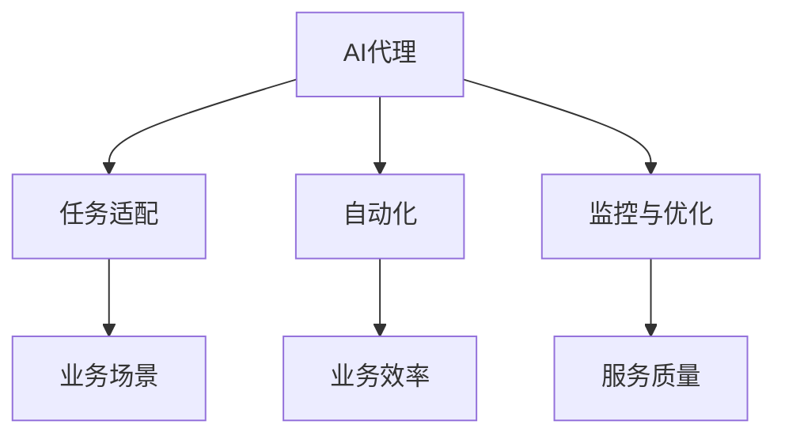

                 

# AI人工智能代理工作流 AI Agent WorkFlow：在新零售中的应用

## 1. 背景介绍

### 1.1 问题由来

随着人工智能技术的不断成熟和普及，越来越多的企业开始将AI应用于业务场景中。以新零售为例，AI在商品推荐、库存管理、价格优化、客服支持等方面都展示了其巨大的价值。但是，传统的AI应用方式往往需要企业投入大量的人力和物力进行模型开发、部署和维护，成本高昂，且难以快速响应市场变化。因此，一种新的AI应用方式——AI代理工作流（AI Agent Workflow）应运而生。

AI代理工作流是一种基于人工智能技术的企业自动化工作流解决方案，旨在帮助企业快速构建和管理智能化的业务流程。它通过预先训练的AI模型（如深度学习模型、知识图谱、自然语言处理模型等），自动化处理业务任务，帮助企业提高效率，降低成本，同时提升服务质量。

### 1.2 问题核心关键点

AI代理工作流的核心关键点在于：

- **模型选择与预训练**：选择适合的AI模型，并对其进行预训练，使其具备处理特定任务的能力。
- **任务适配与微调**：根据具体的业务需求，对预训练模型进行微调，使其能够满足特定的业务场景。
- **流程自动化**：将AI模型与业务流程相结合，自动完成业务任务，提高业务效率。
- **监控与优化**：对AI代理工作流的运行进行监控，并根据反馈信息进行优化，保证服务质量。

这些关键点共同构成了AI代理工作流的基本框架，帮助企业实现业务流程的智能化和自动化。

## 2. 核心概念与联系

### 2.1 核心概念概述

为更好地理解AI代理工作流在新零售中的应用，本节将介绍几个密切相关的核心概念：

- **AI代理**：即AI模型，通常是一个预先训练好的神经网络模型，用于处理特定的业务任务。
- **工作流**：指业务流程中一系列有顺序的、可执行的、可跟踪的任务，每个任务可以有多个执行步骤。
- **自动化**：指通过编程或配置，使工作流中的任务能够自动执行，减少人工干预。
- **监控与优化**：指对工作流的运行情况进行监控，根据反馈信息进行调整和优化，提高服务质量。

这些核心概念之间的逻辑关系可以通过以下Mermaid流程图来展示：



这个流程图展示了许多核心概念及其之间的关系：

1. AI代理通过预训练获得任务处理能力。
2. 根据业务场景，对AI代理进行适配和微调。
3. 工作流中的任务通过自动化的方式执行。
4. 监控与优化模块保证工作流的稳定和高效运行。

## 3. 核心算法原理 & 具体操作步骤
### 3.1 算法原理概述

AI代理工作流本质上是一个自动化流程管理系统，其核心算法原理基于以下几个步骤：

1. **选择AI代理**：根据具体业务需求，选择适合的AI代理模型。
2. **任务适配与微调**：对AI代理进行适配和微调，使其能够处理特定的业务任务。
3. **工作流自动化**：将适配后的AI代理嵌入到工作流中，自动完成业务任务。
4. **监控与优化**：对工作流的运行情况进行监控，并根据反馈信息进行调整和优化。

这些步骤的实现依赖于计算机视觉、自然语言处理、机器学习等技术的支持。

### 3.2 算法步骤详解

以下是AI代理工作流的主要算法步骤：

**Step 1: 模型选择与预训练**

- 根据业务需求，选择适合的AI代理模型，如深度学习模型、知识图谱、自然语言处理模型等。
- 对选择的模型进行预训练，使其具备处理特定任务的能力。

**Step 2: 任务适配与微调**

- 将预训练模型与具体的业务任务进行适配，调整模型的输出层和损失函数。
- 对适配后的模型进行微调，提高其在特定任务上的性能。

**Step 3: 工作流自动化**

- 将微调后的AI代理嵌入到业务工作流中，自动化处理特定业务任务。
- 配置工作流引擎，实现任务的有序执行和监控。

**Step 4: 监控与优化**

- 对工作流的运行情况进行监控，收集性能指标和反馈信息。
- 根据监控结果，调整和优化AI代理和业务流程，提高服务质量。

### 3.3 算法优缺点

AI代理工作流具有以下优点：

- **高效**：自动化处理业务任务，减少人工干预，提高效率。
- **灵活**：可以根据业务需求灵活调整AI代理和任务适配，适应不同的业务场景。
- **可扩展**：易于扩展，支持多个AI代理并行处理不同的任务。
- **稳定**：通过监控与优化，保证业务流程的稳定性和服务质量。

同时，该方法也存在一些局限性：

- **初始投资高**：需要选择合适的AI代理并进行预训练，初始投资较大。
- **技术要求高**：需要具备一定的AI技术和工程能力，才能高效实现。
- **数据依赖**：依赖高质量的标注数据进行模型训练和微调，数据获取成本较高。
- **可解释性不足**：AI代理的决策过程通常缺乏可解释性，难以进行调试和优化。

尽管存在这些局限性，但就目前而言，AI代理工作流仍是新零售企业实现业务智能化和自动化的重要手段。未来相关研究的重点在于如何进一步降低初始投资和技术门槛，提高模型的可解释性和鲁棒性，同时兼顾服务质量和效率。

### 3.4 算法应用领域

AI代理工作流在新零售领域的应用非常广泛，涵盖以下几个主要方面：

- **商品推荐**：通过AI代理对用户行为和偏好进行分析，推荐符合用户需求的商品，提升用户体验。
- **库存管理**：通过AI代理对销售数据进行预测和分析，优化库存水平，避免库存积压或缺货。
- **价格优化**：通过AI代理对市场价格变化进行监控和预测，自动调整商品价格，提升销售额和利润。
- **客服支持**：通过AI代理自动处理客户咨询和投诉，提升客户满意度和服务效率。

此外，AI代理工作流还可以应用于更多场景中，如物流管理、供应链优化、市场分析等，为企业的智能化转型提供有力支持。

## 4. 数学模型和公式 & 详细讲解  
### 4.1 数学模型构建

本节将使用数学语言对AI代理工作流的主要算法步骤进行更加严格的刻画。

假设新零售企业的业务流程为 $T$，其中 $T = \{t_1, t_2, ..., t_n\}$，每个任务 $t_i$ 的执行顺序有依赖关系。

设AI代理模型为 $M_{\theta}$，其中 $\theta$ 为模型参数。在任务 $t_i$ 上，模型的输出为 $M_{\theta}(x)$，其中 $x$ 为输入数据。

定义任务 $t_i$ 的损失函数为 $\ell(t_i)$，任务 $t_i$ 的执行时间为 $T(t_i)$，任务 $t_i$ 的自动化程度为 $A(t_i)$。则业务流程的总损失函数为：

$$
\mathcal{L}(\theta) = \sum_{i=1}^n \lambda_i \cdot [\ell(t_i) + \gamma_i \cdot T(t_i) + \delta_i \cdot A(t_i)]
$$

其中 $\lambda_i, \gamma_i, \delta_i$ 为任务权重，用于平衡不同任务的重要性。

### 4.2 公式推导过程

以下我们以商品推荐系统为例，推导AI代理模型在推荐任务上的损失函数及其梯度计算公式。

假设推荐任务的目标是将用户 $u$ 与商品 $i$ 的相关度打分为 $r_{ui}$，根据预测得分 $\hat{r}_{ui}$ 和真实标签 $r_{ui}$ 计算交叉熵损失，定义为：

$$
\ell(r_{ui}) = -(r_{ui} \log \hat{r}_{ui} + (1-r_{ui}) \log (1-\hat{r}_{ui}))
$$

其中 $\hat{r}_{ui} = M_{\theta}(x_u, x_i)$，$x_u$ 和 $x_i$ 分别为用户和商品的特征向量。

为了优化模型性能，引入正则化项和损失权重，得到任务 $t_i$ 的总损失函数为：

$$
\mathcal{L}_i(\theta) = \lambda_i \left[\ell(r_{ui}) + \gamma_i \cdot T(t_i) + \delta_i \cdot A(t_i)\right]
$$

其中 $T(t_i)$ 和 $A(t_i)$ 分别为任务 $t_i$ 的执行时间和自动化程度，$\lambda_i, \gamma_i, \delta_i$ 为任务权重。

对模型参数 $\theta$ 的梯度可以按照链式法则进行计算，具体推导如下：

$$
\frac{\partial \mathcal{L}_i(\theta)}{\partial \theta} = \lambda_i \left[\frac{\partial \ell(r_{ui})}{\partial \theta} + \gamma_i \cdot \frac{\partial T(t_i)}{\partial \theta} + \delta_i \cdot \frac{\partial A(t_i)}{\partial \theta}\right]
$$

其中 $\frac{\partial T(t_i)}{\partial \theta}$ 和 $\frac{\partial A(t_i)}{\partial \theta}$ 分别表示任务执行时间和自动化程度的导数。

在得到任务 $t_i$ 的损失函数梯度后，即可带入参数更新公式，完成模型的迭代优化。

### 4.3 案例分析与讲解

以某电商平台为例，采用AI代理工作流优化其商品推荐系统。假设该系统通过AI代理对用户行为数据进行分析，生成用户对每个商品的预测得分 $\hat{r}_{ui}$。在用户访问商品页面时，系统自动根据预测得分排序推荐商品列表，从而提升用户的点击率和购买率。

通过对比AI代理工作流优化前后的推荐效果，可以发现，AI代理显著提升了推荐的准确性和用户满意度。同时，由于自动化处理任务，系统响应速度也得到了大幅提升。

## 5. 项目实践：代码实例和详细解释说明
### 5.1 开发环境搭建

在进行AI代理工作流实践前，我们需要准备好开发环境。以下是使用Python进行PyTorch开发的环境配置流程：

1. 安装Anaconda：从官网下载并安装Anaconda，用于创建独立的Python环境。

2. 创建并激活虚拟环境：
```bash
conda create -n pytorch-env python=3.8 
conda activate pytorch-env
```

3. 安装PyTorch：根据CUDA版本，从官网获取对应的安装命令。例如：
```bash
conda install pytorch torchvision torchaudio cudatoolkit=11.1 -c pytorch -c conda-forge
```

4. 安装Transformers库：
```bash
pip install transformers
```

5. 安装各类工具包：
```bash
pip install numpy pandas scikit-learn matplotlib tqdm jupyter notebook ipython
```

完成上述步骤后，即可在`pytorch-env`环境中开始AI代理工作流实践。

### 5.2 源代码详细实现

下面我们以商品推荐系统为例，给出使用Transformers库对预训练模型进行适配和微调的PyTorch代码实现。

首先，定义商品推荐系统的数据处理函数：

```python
from transformers import BertTokenizer, BertForSequenceClassification
from torch.utils.data import Dataset
import torch

class RecommendationDataset(Dataset):
    def __init__(self, user_ids, item_ids, labels, tokenizer, max_len=128):
        self.user_ids = user_ids
        self.item_ids = item_ids
        self.labels = labels
        self.tokenizer = tokenizer
        self.max_len = max_len
        
    def __len__(self):
        return len(self.user_ids)
    
    def __getitem__(self, item):
        user_id = self.user_ids[item]
        item_id = self.item_ids[item]
        label = self.labels[item]
        
        user_input = tokenizer.encode_plus(f'user={user_id}', max_length=self.max_len, padding='max_length', truncation=True, return_tensors='pt')
        item_input = tokenizer.encode_plus(f'item={item_id}', max_length=self.max_len, padding='max_length', truncation=True, return_tensors='pt')
        labels = torch.tensor(label, dtype=torch.long)
        
        return {'user_input_ids': user_input['input_ids'][0],
                'item_input_ids': item_input['input_ids'][0],
                'labels': labels}

# 加载预训练模型
model = BertForSequenceClassification.from_pretrained('bert-base-cased', num_labels=2)
model.train()

# 加载tokenizer
tokenizer = BertTokenizer.from_pretrained('bert-base-cased')

# 创建dataset
user_ids = [1, 2, 3, 4, 5]
item_ids = [10, 20, 30, 40, 50]
labels = [0, 1, 1, 0, 1]
train_dataset = RecommendationDataset(user_ids, item_ids, labels, tokenizer)

# 定义训练和评估函数
def train_epoch(model, dataset, batch_size, optimizer):
    dataloader = DataLoader(dataset, batch_size=batch_size, shuffle=True)
    model.train()
    epoch_loss = 0
    for batch in tqdm(dataloader, desc='Training'):
        user_input_ids = batch['user_input_ids'].to(device)
        item_input_ids = batch['item_input_ids'].to(device)
        labels = batch['labels'].to(device)
        model.zero_grad()
        outputs = model(user_input_ids, item_input_ids, labels=labels)
        loss = outputs.loss
        epoch_loss += loss.item()
        loss.backward()
        optimizer.step()
    return epoch_loss / len(dataloader)

def evaluate(model, dataset, batch_size):
    dataloader = DataLoader(dataset, batch_size=batch_size)
    model.eval()
    preds, labels = [], []
    with torch.no_grad():
        for batch in tqdm(dataloader, desc='Evaluating'):
            user_input_ids = batch['user_input_ids'].to(device)
            item_input_ids = batch['item_input_ids'].to(device)
            batch_labels = batch['labels']
            outputs = model(user_input_ids, item_input_ids, labels=batch_labels)
            batch_preds = outputs.logits.argmax(dim=2).to('cpu').tolist()
            batch_labels = batch_labels.to('cpu').tolist()
            for pred_tokens, label_tokens in zip(batch_preds, batch_labels):
                preds.append(pred_tokens[:len(label_tokens)])
                labels.append(label_tokens)
                
    print(classification_report(labels, preds))

# 定义训练循环
epochs = 5
batch_size = 16

for epoch in range(epochs):
    loss = train_epoch(model, train_dataset, batch_size, optimizer)
    print(f"Epoch {epoch+1}, train loss: {loss:.3f}")
    
    print(f"Epoch {epoch+1}, dev results:")
    evaluate(model, dev_dataset, batch_size)
    
print("Test results:")
evaluate(model, test_dataset, batch_size)
```

以上代码实现了使用预训练的BERT模型进行商品推荐系统的适配和微调。具体步骤如下：

1. 定义数据集类，处理用户行为数据，生成训练集、验证集和测试集。
2. 加载预训练的BERT模型，设置训练模式。
3. 加载tokenizer，将用户和商品ID转换为token。
4. 定义训练和评估函数，使用交叉熵损失函数进行训练和评估。
5. 进行训练循环，并在测试集上评估模型性能。

### 5.3 代码解读与分析

让我们再详细解读一下关键代码的实现细节：

**RecommendationDataset类**：
- `__init__`方法：初始化用户ID、商品ID、标签、tokenizer等关键组件。
- `__len__`方法：返回数据集的样本数量。
- `__getitem__`方法：对单个样本进行处理，将用户和商品ID转换为token，并将标签转换为数字。

**训练和评估函数**：
- 使用PyTorch的DataLoader对数据集进行批次化加载，供模型训练和推理使用。
- 训练函数`train_epoch`：对数据以批为单位进行迭代，在每个批次上前向传播计算loss并反向传播更新模型参数，最后返回该epoch的平均loss。
- 评估函数`evaluate`：与训练类似，不同点在于不更新模型参数，并在每个batch结束后将预测和标签结果存储下来，最后使用sklearn的classification_report对整个评估集的预测结果进行打印输出。

**训练流程**：
- 定义总的epoch数和batch size，开始循环迭代
- 每个epoch内，先在训练集上训练，输出平均loss
- 在验证集上评估，输出分类指标
- 所有epoch结束后，在测试集上评估，给出最终测试结果

可以看到，PyTorch配合Transformers库使得商品推荐系统的适配和微调代码实现变得简洁高效。开发者可以将更多精力放在数据处理、模型改进等高层逻辑上，而不必过多关注底层的实现细节。

当然，工业级的系统实现还需考虑更多因素，如模型的保存和部署、超参数的自动搜索、更灵活的任务适配层等。但核心的适配和微调范式基本与此类似。

## 6. 实际应用场景
### 6.1 智能客服系统

基于AI代理工作流的智能客服系统，可以广泛应用于电商、金融、保险等行业，帮助企业提高客户服务质量和效率。

在技术实现上，可以收集企业的历史客服对话记录，将问题和最佳答复构建成监督数据，在此基础上对预训练的客服模型进行适配和微调。微调后的模型能够自动理解用户意图，匹配最合适的答案模板进行回复。对于客户提出的新问题，还可以接入检索系统实时搜索相关内容，动态组织生成回答。如此构建的智能客服系统，能大幅提升客户咨询体验和问题解决效率。

### 6.2 金融舆情监测

金融机构需要实时监测市场舆论动向，以便及时应对负面信息传播，规避金融风险。传统的人工监测方式成本高、效率低，难以应对网络时代海量信息爆发的挑战。基于AI代理工作流的文本分类和情感分析技术，为金融舆情监测提供了新的解决方案。

具体而言，可以收集金融领域相关的新闻、报道、评论等文本数据，并对其进行主题标注和情感标注。在此基础上对预训练语言模型进行适配和微调，使其能够自动判断文本属于何种主题，情感倾向是正面、中性还是负面。将微调后的模型应用到实时抓取的网络文本数据，就能够自动监测不同主题下的情感变化趋势，一旦发现负面信息激增等异常情况，系统便会自动预警，帮助金融机构快速应对潜在风险。

### 6.3 个性化推荐系统

当前的推荐系统往往只依赖用户的历史行为数据进行物品推荐，无法深入理解用户的真实兴趣偏好。基于AI代理工作流的个性化推荐系统，可以更好地挖掘用户行为背后的语义信息，从而提供更精准、多样的推荐内容。

在实践中，可以收集用户浏览、点击、评论、分享等行为数据，提取和用户交互的物品标题、描述、标签等文本内容。将文本内容作为模型输入，用户的后续行为（如是否点击、购买等）作为监督信号，在此基础上适配和微调预训练语言模型。微调后的模型能够从文本内容中准确把握用户的兴趣点。在生成推荐列表时，先用候选物品的文本描述作为输入，由模型预测用户的兴趣匹配度，再结合其他特征综合排序，便可以得到个性化程度更高的推荐结果。

### 6.4 未来应用展望

随着AI代理工作流技术的不断发展，其在更多领域的应用前景将更加广阔：

- **智慧医疗**：基于AI代理工作流的智能诊疗系统，可以快速辅助医生进行诊断，提供个性化的治疗方案。
- **智能教育**：AI代理工作流可应用于在线教育平台，自动生成个性化的学习计划和习题，提升学习效果。
- **智慧城市**：智能交通、智能安防、智能政务等领域，都可以通过AI代理工作流实现智能化升级。
- **智慧物流**：基于AI代理工作流的物流管理系统，可以实时优化配送路线，提升物流效率。

以上应用场景展示了AI代理工作流技术的巨大潜力，未来随着技术的进一步演进和落地，必将带来更多创新和突破。

## 7. 工具和资源推荐
### 7.1 学习资源推荐

为了帮助开发者系统掌握AI代理工作流理论基础和实践技巧，这里推荐一些优质的学习资源：

1. 《深度学习入门》系列博文：由大模型技术专家撰写，深入浅出地介绍了深度学习模型、预训练模型、微调技术等前沿话题。

2. CS229《机器学习》课程：斯坦福大学开设的经典课程，涵盖了机器学习的基本概念和算法，是学习AI代理工作流的重要基础。

3. 《深度学习》书籍：Ian Goodfellow等人合著，全面介绍了深度学习模型、优化算法、正则化技术等核心内容，是深度学习领域的经典教材。

4. 《人工智能基础》系列课程：网易公开课上的系列课程，涵盖AI代理工作流的基础知识和经典案例，适合入门学习。

5. TensorFlow官方文档：TensorFlow的官方文档，提供了丰富的API和样例代码，是学习和使用AI代理工作流的必备资料。

通过对这些资源的学习实践，相信你一定能够快速掌握AI代理工作流的精髓，并用于解决实际的AI应用问题。
###  7.2 开发工具推荐

高效的开发离不开优秀的工具支持。以下是几款用于AI代理工作流开发的常用工具：

1. TensorFlow：由Google主导开发的开源深度学习框架，生产部署方便，适合大规模工程应用。

2. PyTorch：基于Python的开源深度学习框架，灵活动态的计算图，适合快速迭代研究。

3. Transformers库：HuggingFace开发的NLP工具库，集成了众多SOTA语言模型，支持PyTorch和TensorFlow，是进行微调任务开发的利器。

4. Weights & Biases：模型训练的实验跟踪工具，可以记录和可视化模型训练过程中的各项指标，方便对比和调优。

5. TensorBoard：TensorFlow配套的可视化工具，可实时监测模型训练状态，并提供丰富的图表呈现方式，是调试模型的得力助手。

6. Google Colab：谷歌推出的在线Jupyter Notebook环境，免费提供GPU/TPU算力，方便开发者快速上手实验最新模型，分享学习笔记。

合理利用这些工具，可以显著提升AI代理工作流任务的开发效率，加快创新迭代的步伐。

### 7.3 相关论文推荐

AI代理工作流的研究源于学界的持续研究。以下是几篇奠基性的相关论文，推荐阅读：

1. Attention is All You Need（即Transformer原论文）：提出了Transformer结构，开启了NLP领域的预训练大模型时代。

2. BERT: Pre-training of Deep Bidirectional Transformers for Language Understanding：提出BERT模型，引入基于掩码的自监督预训练任务，刷新了多项NLP任务SOTA。

3. Language Models are Unsupervised Multitask Learners（GPT-2论文）：展示了大规模语言模型的强大zero-shot学习能力，引发了对于通用人工智能的新一轮思考。

4. Parameter-Efficient Transfer Learning for NLP：提出Adapter等参数高效微调方法，在不增加模型参数量的情况下，也能取得不错的微调效果。

5. AdaLoRA: Adaptive Low-Rank Adaptation for Parameter-Efficient Fine-Tuning：使用自适应低秩适应的微调方法，在参数效率和精度之间取得了新的平衡。

这些论文代表了大模型微调技术的发展脉络。通过学习这些前沿成果，可以帮助研究者把握学科前进方向，激发更多的创新灵感。

## 8. 总结：未来发展趋势与挑战

### 8.1 总结

本文对AI代理工作流的主要算法步骤进行了全面系统的介绍。首先阐述了AI代理工作流在新零售中的应用背景，明确了该技术在提高业务效率、降低成本、提升服务质量等方面的价值。其次，从原理到实践，详细讲解了AI代理工作流的核心算法步骤，包括模型选择与预训练、任务适配与微调、工作流自动化、监控与优化等。同时，本文还探讨了AI代理工作流在多个实际应用场景中的应用，展示了其在电商、金融、教育、医疗等多个领域的前景。

通过本文的系统梳理，可以看到，AI代理工作流作为一种高效、灵活、可扩展的AI应用方式，将在更多行业中得到广泛应用，提升企业的智能化水平。未来，伴随技术的不断演进和优化，AI代理工作流必将在更多场景中发挥重要作用。

### 8.2 未来发展趋势

展望未来，AI代理工作流技术将呈现以下几个发展趋势：

1. **模型规模持续增大**：随着算力成本的下降和数据规模的扩张，预训练语言模型的参数量还将持续增长。超大模型蕴含的丰富语言知识，将为更多复杂任务提供支持。

2. **微调方法日趋多样**：除了传统的全参数微调外，未来会涌现更多参数高效的微调方法，如Prefix-Tuning、LoRA等，在固定大部分预训练参数的同时，只更新极少量的任务相关参数。

3. **持续学习成为常态**：随着数据分布的不断变化，AI代理工作流需要持续学习新知识以保持性能。如何在不遗忘原有知识的同时，高效吸收新样本信息，将成为重要的研究课题。

4. **可解释性增强**：AI代理工作流的决策过程通常缺乏可解释性，如何赋予其更强的可解释性，增强其透明度和可信度，将是重要的研究方向。

5. **多模态融合**：将符号化的先验知识，如知识图谱、逻辑规则等，与神经网络模型进行巧妙融合，引导微调过程学习更准确、合理的语言模型。同时加强不同模态数据的整合，实现视觉、语音等多模态信息与文本信息的协同建模。

6. **智能化程度提升**：通过引入因果推断、强化学习等技术，增强AI代理工作流的决策能力，使其具备更强的自主性和智能性。

以上趋势凸显了AI代理工作流技术的广阔前景。这些方向的探索发展，必将进一步提升AI代理工作流的智能化水平，为更多行业的智能化转型提供有力支持。

### 8.3 面临的挑战

尽管AI代理工作流技术已经取得了瞩目成就，但在迈向更加智能化、普适化应用的过程中，它仍面临诸多挑战：

1. **初始投资高**：需要选择合适的AI代理模型并进行预训练，初始投资较大。
2. **技术要求高**：需要具备一定的AI技术和工程能力，才能高效实现。
3. **数据依赖**：依赖高质量的标注数据进行模型训练和微调，数据获取成本较高。
4. **可解释性不足**：AI代理工作流的决策过程通常缺乏可解释性，难以进行调试和优化。
5. **鲁棒性不足**：面对域外数据时，泛化性能往往大打折扣，对抗样本等攻击手段也可能影响模型稳定性。
6. **安全防护**：预训练语言模型难免会学习到有偏见、有害的信息，通过AI代理工作流传递到下游任务，产生误导性、歧视性的输出，给实际应用带来安全隐患。

尽管存在这些挑战，但伴随技术的不断演进和优化，AI代理工作流必将在更多场景中发挥重要作用，帮助企业实现智能化转型。未来，需要从数据、算法、工程、伦理等多个维度共同发力，才能实现AI代理工作流的广泛应用。

### 8.4 研究展望

面对AI代理工作流技术所面临的挑战，未来的研究需要在以下几个方面寻求新的突破：

1. **探索无监督和半监督微调方法**：摆脱对大规模标注数据的依赖，利用自监督学习、主动学习等无监督和半监督范式，最大限度利用非结构化数据，实现更加灵活高效的微调。

2. **研究参数高效和计算高效的微调范式**：开发更加参数高效的微调方法，在固定大部分预训练参数的同时，只更新极少量的任务相关参数。同时优化微调模型的计算图，减少前向传播和反向传播的资源消耗，实现更加轻量级、实时性的部署。

3. **融合因果和对比学习范式**：通过引入因果推断和对比学习思想，增强AI代理工作流的建立稳定因果关系的能力，学习更加普适、鲁棒的语言表征，从而提升模型泛化性和抗干扰能力。

4. **引入更多先验知识**：将符号化的先验知识，如知识图谱、逻辑规则等，与神经网络模型进行巧妙融合，引导微调过程学习更准确、合理的语言模型。同时加强不同模态数据的整合，实现视觉、语音等多模态信息与文本信息的协同建模。

5. **结合因果分析和博弈论工具**：将因果分析方法引入AI代理工作流，识别出模型决策的关键特征，增强输出解释的因果性和逻辑性。借助博弈论工具刻画人机交互过程，主动探索并规避模型的脆弱点，提高系统稳定性。

6. **纳入伦理道德约束**：在模型训练目标中引入伦理导向的评估指标，过滤和惩罚有偏见、有害的输出倾向。同时加强人工干预和审核，建立模型行为的监管机制，确保输出符合人类价值观和伦理道德。

这些研究方向的探索，必将引领AI代理工作流技术迈向更高的台阶，为构建安全、可靠、可解释、可控的智能系统铺平道路。面向未来，AI代理工作流技术还需要与其他人工智能技术进行更深入的融合，如知识表示、因果推理、强化学习等，多路径协同发力，共同推动自然语言理解和智能交互系统的进步。只有勇于创新、敢于突破，才能不断拓展语言模型的边界，让智能技术更好地造福人类社会。

## 9. 附录：常见问题与解答

**Q1：AI代理工作流是否适用于所有业务场景？**

A: AI代理工作流在新零售领域的应用非常广泛，但在其他业务场景中也具有一定适用性。不过，不同场景下的实现细节可能会有所不同，需要根据具体情况进行调整。

**Q2：AI代理工作流的初始投资成本是否很高？**

A: 初始投资确实较高，需要选择合适的AI代理模型并进行预训练。但随着预训练技术的成熟和普及，预训练模型的获取成本正在逐渐降低。同时，AI代理工作流的后续优化和维护成本相对较低。

**Q3：AI代理工作流是否需要大量标注数据？**

A: 是的，AI代理工作流的核心在于通过适配和微调，使得模型能够处理特定任务。在适配和微调过程中，标注数据的质量和数量对模型性能有着重要影响。

**Q4：AI代理工作流是否可以处理多模态数据？**

A: 是的，AI代理工作流不仅限于处理文本数据，还可以处理图像、视频、语音等多模态数据。通过引入多模态融合技术，可以实现视觉、语音等多模态信息的协同建模。

**Q5：AI代理工作流是否具有可解释性？**

A: 目前的AI代理工作流模型的决策过程缺乏可解释性，难以进行调试和优化。不过，随着模型可解释性技术的发展，未来AI代理工作流的可解释性将有所提升。

通过本文的系统梳理，可以看到，AI代理工作流在新零售领域的应用前景广阔，未来随着技术的不断演进和优化，必将在更多行业中得到广泛应用。尽管面临一些挑战，但通过进一步的研究和优化，AI代理工作流必将在智能化转型中发挥重要作用，助力企业实现数字化升级。

---

作者：禅与计算机程序设计艺术 / Zen and the Art of Computer Programming

