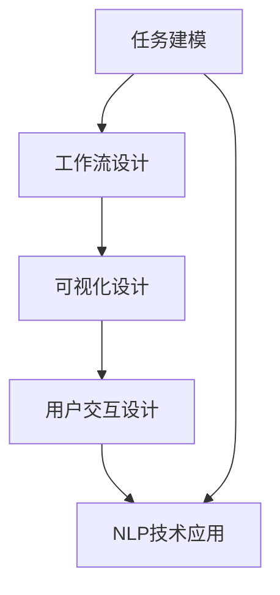

                 

# AI人工智能代理工作流AI Agent WorkFlow：代理工作流的可视化与用户交互设计

> 关键词：人工智能代理,工作流设计,可视化,用户交互设计,自然语言处理,NLP

## 1. 背景介绍

### 1.1 问题由来

随着人工智能技术的不断进步，智能代理(Agent)的应用范围日益扩大，从自动化客服到个性化推荐，从智能投学到智能健康管理，智能代理正渗透到各行各业。然而，智能代理的开发和维护仍面临诸多挑战：开发复杂度较高，用户需求变化快，模型难以解释等。为了提高智能代理的开发效率和用户体验，本文将详细介绍基于自然语言处理(NLP)的智能代理工作流设计及可视化与用户交互设计。

### 1.2 问题核心关键点

为了更好地实现智能代理的可视化与用户交互设计，需要解决以下几个关键问题：

- **任务建模与抽象**：如何将复杂任务建模成可执行的工作流？
- **用户交互设计**：如何设计用户友好的交互界面？
- **可视化设计**：如何直观展示智能代理的执行流程？
- **自然语言处理**：如何利用自然语言处理技术优化用户交互体验？

## 2. 核心概念与联系

### 2.1 核心概念概述

- **智能代理(Agent)**：指能够模拟人类行为，执行特定任务的软件实体。智能代理通常具备自适应、自学习、自决策等能力。

- **工作流(Workflow)**：指将一系列任务按照一定逻辑关系组合起来的执行流程。工作流通常由任务节点、数据流和控制流组成。

- **可视化(Visualization)**：指将抽象的任务流程直观呈现出来，便于用户理解和使用。

- **用户交互设计(User Interaction Design, UI/UX)**：指设计用户与智能代理交互的界面和方式，提升用户体验和系统可用性。

- **自然语言处理(Natural Language Processing, NLP)**：指利用计算机处理、理解和生成人类语言的技术。NLP广泛应用于智能代理的交互设计中。

### 2.2 核心概念原理和架构的 Mermaid 流程图



这个流程图展示了智能代理工作流从任务建模到可视化与用户交互设计的基本流程：

1. **任务建模**：定义智能代理需要完成的具体任务，以及各任务间的逻辑关系。
2. **工作流设计**：将任务建模结果转化为可执行的工作流。
3. **可视化设计**：将工作流转化为直观的图形表示，便于用户理解和使用。
4. **用户交互设计**：设计用户与智能代理交互的界面和方式，提升用户体验和系统可用性。
5. **NLP技术应用**：利用自然语言处理技术优化用户交互体验。

这些核心概念紧密相关，共同构成了智能代理工作流的设计和实现框架。

## 3. 核心算法原理 & 具体操作步骤

### 3.1 算法原理概述

智能代理工作流的核心原理是通过将任务分解成一系列可执行的任务节点，再利用控制流和数据流将它们连接起来，形成完整的工作流。工作流的执行过程是动态的，智能代理可以根据用户输入和环境变化，实时调整执行路径和任务节点，最终完成任务。

### 3.2 算法步骤详解

#### 3.2.1 任务建模

1. **需求分析**：与用户沟通，了解具体需求和业务场景。
2. **任务分解**：将复杂任务分解成多个子任务，每个子任务具备明确的输入和输出。
3. **任务描述**：为每个子任务编写任务描述，包括任务名、输入数据、输出数据、执行条件和执行算法。

#### 3.2.2 工作流设计

1. **节点定义**：定义工作流中的节点，包括任务的执行顺序、条件判断、数据传输等。
2. **节点连接**：根据任务依赖关系，将节点连接起来，形成完整的工作流。
3. **控制流设计**：设计工作流的控制流，如条件分支、循环等，确保工作流在不同情境下能够灵活执行。

#### 3.2.3 可视化设计

1. **流程图绘制**：利用流程图绘制工具，如MindManager、Lucidchart等，将工作流转化为图形表示。
2. **动态展示**：利用JavaScript和D3.js等技术，实现工作流动态展示，实时显示任务执行状态和数据流。
3. **交互设计**：设计交互界面，使用户能够通过界面操作工作流，如启动/暂停任务、查看执行日志等。

#### 3.2.4 用户交互设计

1. **界面设计**：设计简洁、易用的用户界面，如表单、按钮、标签页等。
2. **交互逻辑**：定义用户与界面元素间的交互逻辑，如点击按钮触发任务执行、填写表单提交数据等。
3. **反馈机制**：设计合理的反馈机制，如任务执行成功/失败的提示、数据加载状态等。

#### 3.2.5 NLP技术应用

1. **意图识别**：利用意图识别技术，识别用户输入的自然语言指令，并映射到具体任务节点。
2. **对话管理**：设计对话管理模型，根据用户历史互动记录和当前输入，动态调整对话策略。
3. **自然语言生成**：利用自然语言生成技术，生成简洁、自然的任务执行反馈，提升用户体验。

### 3.3 算法优缺点

#### 3.3.1 优点

1. **任务灵活**：工作流可以灵活调整和扩展，适应各种业务场景。
2. **用户友好**：通过可视化界面，用户可以直观地理解工作流执行流程，提升使用体验。
3. **自适应性**：智能代理可以根据用户输入和环境变化，实时调整执行路径和任务节点，提高执行效率。
4. **易于维护**：通过任务建模和工作流设计，智能代理的维护变得更加模块化和可理解。

#### 3.3.2 缺点

1. **设计复杂**：任务建模和工作流设计需要较深业务理解和技能。
2. **交互设计困难**：用户交互设计需要综合考虑用户心理和行为，设计难度较大。
3. **NLP难度大**：自然语言处理技术的复杂性决定了NLP技术应用的难度。
4. **资源消耗高**：复杂的任务建模和数据处理可能会消耗大量计算资源。

### 3.4 算法应用领域

智能代理工作流设计及可视化与用户交互设计已经广泛应用于以下领域：

- **自动化客服**：构建自动化客服系统，通过可视化界面和自然语言处理技术，提升用户互动体验。
- **智能投顾**：设计智能投顾工作流，利用自然语言处理技术，实现个性化投资建议。
- **智能健康管理**：开发智能健康管理系统，利用工作流设计和用户交互设计，提升健康管理效果。
- **个性化推荐**：构建个性化推荐系统，通过工作流设计优化推荐算法，提升推荐精度。
- **智能家居**：设计智能家居控制系统，通过可视化界面和用户交互设计，实现家居自动化。

## 4. 数学模型和公式 & 详细讲解 & 举例说明

### 4.1 数学模型构建

智能代理工作流设计涉及的任务建模、工作流设计、用户交互设计等环节，可以通过以下数学模型来表示：

1. **任务模型**：
   - 输入数据：$x \in X$
   - 任务函数：$f: X \rightarrow Y$
   - 输出数据：$y \in Y$

2. **工作流模型**：
   - 任务节点集合：$N=\{n_1, n_2, \ldots, n_k\}$
   - 数据流：$d: n_i \rightarrow n_{i+1}$
   - 控制流：$c: n_i \rightarrow n_{i+1}$

3. **用户交互模型**：
   - 用户界面：$UI$
   - 用户操作：$u$
   - 反馈机制：$f_{UI}(u)$

4. **自然语言处理模型**：
   - 意图识别模型：$I: s \rightarrow T$
   - 对话管理模型：$D: T \rightarrow A$
   - 自然语言生成模型：$G: A \rightarrow s$

其中，$X$ 表示输入数据空间，$Y$ 表示输出数据空间，$T$ 表示任务类型，$A$ 表示行动类型，$s$ 表示自然语言输入，$UI$ 表示用户界面，$u$ 表示用户操作。

### 4.2 公式推导过程

#### 4.2.1 任务模型

对于任意任务 $f$，假设输入为 $x$，输出为 $y$，则任务模型可以表示为：

$$
y = f(x)
$$

#### 4.2.2 工作流模型

对于工作流 $N=\{n_1, n_2, \ldots, n_k\}$，假设数据流为 $d$，控制流为 $c$，则工作流模型可以表示为：

$$
N \xrightarrow[d, c] (n_1, n_2, \ldots, n_k)
$$

#### 4.2.3 用户交互模型

对于用户界面 $UI$ 和用户操作 $u$，假设反馈机制为 $f_{UI}$，则用户交互模型可以表示为：

$$
UI \xrightarrow[u] (u, f_{UI}(u))
$$

#### 4.2.4 自然语言处理模型

对于意图识别模型 $I$、对话管理模型 $D$ 和自然语言生成模型 $G$，假设自然语言输入为 $s$，任务类型为 $T$，行动类型为 $A$，则自然语言处理模型可以表示为：

$$
I: s \rightarrow T
$$
$$
D: T \rightarrow A
$$
$$
G: A \rightarrow s
$$

### 4.3 案例分析与讲解

假设我们要构建一个智能投顾系统，用户可以通过自然语言输入指令，系统根据指令执行投资建议。以下是该系统的设计步骤：

1. **任务建模**：
   - 任务 1：用户输入指令 $s$
   - 任务 2：意图识别 $I$
   - 任务 3：对话管理 $D$
   - 任务 4：自然语言生成 $G$
   - 任务 5：投资建议生成 $f$
   - 任务 6：执行投资建议 $f$

2. **工作流设计**：
   - 节点 $n_1$：用户输入指令 $s$
   - 节点 $n_2$：意图识别 $I$
   - 节点 $n_3$：对话管理 $D$
   - 节点 $n_4$：自然语言生成 $G$
   - 节点 $n_5$：投资建议生成 $f$
   - 节点 $n_6$：执行投资建议 $f$

3. **可视化设计**：
   - 流程图：
     ```
         s
        |
       I
       |
      / \
     /   \
    /     \
   D       G
      /    |
     /     |
    /       |
   /         \
  f          f
       \     /
        \   /
         \ /
          f
      ```

4. **用户交互设计**：
   - 界面设计：用户输入界面、意图展示界面、对话展示界面、投资建议展示界面。
   - 交互逻辑：用户输入指令 $s$，系统进行意图识别 $I$，根据识别结果展示对话 $D$，生成自然语言回复 $G$，最终生成投资建议 $f$，并执行建议。

5. **自然语言处理**：
   - 意图识别 $I$：利用深度学习模型，对用户输入的自然语言 $s$ 进行意图分类。
   - 对话管理 $D$：设计对话管理模型，根据意图识别结果生成回复策略。
   - 自然语言生成 $G$：利用生成模型，生成简洁、自然的投资建议回复 $s$。

通过以上案例，可以看到，智能代理工作流设计及可视化与用户交互设计能够将复杂任务分解成可执行的模块，并通过可视化界面和自然语言处理技术，提升用户体验和系统性能。

## 5. 项目实践：代码实例和详细解释说明

### 5.1 开发环境搭建

要实现智能代理工作流设计及可视化与用户交互设计，首先需要搭建开发环境。以下是使用Python和Flask框架搭建开发环境的步骤：

1. **安装Python**：
   - 下载并安装Python 3.x版本。
   - 配置环境变量，设置工作目录。

2. **安装Flask**：
   - 打开终端，运行 `pip install flask` 命令，安装Flask框架。

3. **创建项目文件夹**：
   - 创建一个新的项目文件夹，如 `agent_workflow`。
   - 在项目文件夹下创建 `main.py`、`templates`、`static` 和 `data` 文件夹。

### 5.2 源代码详细实现

以下是智能投顾系统的Flask应用程序示例代码：

```python
from flask import Flask, render_template, request, jsonify
import pandas as pd

app = Flask(__name__)

@app.route('/')
def index():
    return render_template('index.html')

@app.route('/execute', methods=['POST'])
def execute():
    user_input = request.json['user_input']
    model_predict(user_input)
    return jsonify({'result': 'success'})

def model_predict(user_input):
    # 意图识别
    intent = intent_recognition(user_input)
    # 对话管理
    response = dialogue_management(intent)
    # 自然语言生成
    natural_language = generate_natural_language(response)
    # 执行投资建议
    investment_suggestion = execute_investment_suggestion(user_input, natural_language)

def intent_recognition(user_input):
    # 使用意图识别模型进行意图分类
    # 返回意图类型
    pass

def dialogue_management(intent):
    # 根据意图生成回复策略
    # 返回回复内容
    pass

def generate_natural_language(response):
    # 使用自然语言生成模型生成回复
    # 返回自然语言回复
    pass

def execute_investment_suggestion(user_input, natural_language):
    # 根据投资建议生成执行代码
    # 执行投资建议
    pass
```

### 5.3 代码解读与分析

以下是代码各部分的详细解释和分析：

1. **Flask框架**：
   - 利用Flask框架，创建Web应用程序，提供用户界面和API接口。
   - 通过路由规则，将用户请求映射到相应的处理函数。

2. **意图识别**：
   - 意图识别是智能代理的核心功能之一，通过自然语言处理技术，将用户输入的自然语言 $s$ 转换为意图类型 $T$。
   - 代码中的 `intent_recognition` 函数模拟意图识别过程，返回意图类型。

3. **对话管理**：
   - 对话管理是指根据意图生成回复策略，通常使用对话管理模型 $D$ 实现。
   - 代码中的 `dialogue_management` 函数模拟对话管理过程，返回回复内容。

4. **自然语言生成**：
   - 自然语言生成是指根据回复内容生成自然语言回复 $s$，通常使用自然语言生成模型 $G$ 实现。
   - 代码中的 `generate_natural_language` 函数模拟自然语言生成过程，返回自然语言回复。

5. **投资建议执行**：
   - 根据投资建议生成执行代码，并执行投资建议。
   - 代码中的 `execute_investment_suggestion` 函数模拟投资建议执行过程。

### 5.4 运行结果展示

假设意图识别、对话管理和自然语言生成模型都已实现，可以通过以下代码测试智能投顾系统的功能：

```python
from flask import Flask, render_template, request, jsonify
import pandas as pd

app = Flask(__name__)

@app.route('/')
def index():
    return render_template('index.html')

@app.route('/execute', methods=['POST'])
def execute():
    user_input = request.json['user_input']
    model_predict(user_input)
    return jsonify({'result': 'success'})

def model_predict(user_input):
    # 意图识别
    intent = intent_recognition(user_input)
    # 对话管理
    response = dialogue_management(intent)
    # 自然语言生成
    natural_language = generate_natural_language(response)
    # 执行投资建议
    investment_suggestion = execute_investment_suggestion(user_input, natural_language)

def intent_recognition(user_input):
    # 使用意图识别模型进行意图分类
    # 返回意图类型
    pass

def dialogue_management(intent):
    # 根据意图生成回复策略
    # 返回回复内容
    pass

def generate_natural_language(response):
    # 使用自然语言生成模型生成回复
    # 返回自然语言回复
    pass

def execute_investment_suggestion(user_input, natural_language):
    # 根据投资建议生成执行代码
    # 执行投资建议
    pass
```

运行以上代码，可以通过网页访问 `http://localhost:5000` 查看智能投顾系统的界面，输入自然语言指令后，系统将根据任务模型、工作流模型和自然语言处理模型，生成简洁、自然的投资建议回复，并执行相应的投资操作。

## 6. 实际应用场景

### 6.1 智能客服系统

智能客服系统是智能代理的典型应用之一。通过可视化界面和自然语言处理技术，智能客服系统能够理解用户需求，快速响应并解决问题，提高客服效率和用户满意度。

### 6.2 金融投顾系统

金融投顾系统通过意图识别和自然语言处理技术，能够根据用户输入的自然语言指令，提供个性化的投资建议。这种系统不仅提升了用户体验，还增强了投资决策的科学性和准确性。

### 6.3 健康管理平台

智能健康管理系统通过工作流设计和用户交互设计，能够帮助用户记录健康数据，并根据自然语言处理结果，生成健康建议和行为指导。这种系统不仅提升了用户的健康管理效果，还增强了平台的粘性和用户参与度。

## 7. 工具和资源推荐

### 7.1 学习资源推荐

为了帮助开发者掌握智能代理工作流设计及可视化与用户交互设计的知识，推荐以下学习资源：

1. **《Python Flask Web开发实战》**：一本介绍Flask框架的入门书籍，涵盖Web应用程序开发、路由规则、模板引擎等核心技术。
2. **《自然语言处理入门》**：一本介绍自然语言处理技术的书籍，涵盖意图识别、对话管理、自然语言生成等核心模块。
3. **《UX设计基础》**：一本介绍用户体验设计（UX）的书籍，涵盖交互设计、视觉设计、可用性测试等核心模块。
4. **《Web应用开发与设计》**：一本涵盖Web应用程序开发和设计的书籍，涵盖前端技术、后端技术、用户体验设计等核心模块。
5. **《机器学习与数据科学》**：一本涵盖机器学习、数据科学和人工智能的书籍，涵盖算法原理、模型实现、应用场景等核心模块。

### 7.2 开发工具推荐

为了实现智能代理工作流设计及可视化与用户交互设计，推荐以下开发工具：

1. **Flask**：一个轻量级的Web应用程序框架，易于上手，支持RESTful API设计和模板渲染。
2. **React**：一个流行的JavaScript库，支持构建动态、响应式的用户界面。
3. **D3.js**：一个数据可视化库，支持生成动态图表和交互式数据展示。
4. **TensorFlow**：一个流行的机器学习框架，支持构建和训练各种深度学习模型。
5. **Keras**：一个高级神经网络API，支持快速搭建和训练深度学习模型。

### 7.3 相关论文推荐

为了深入了解智能代理工作流设计及可视化与用户交互设计的理论基础和实践方法，推荐以下相关论文：

1. **《Intelligent Business Processes》**：一篇介绍智能工作流设计方法的论文，涵盖任务建模、工作流设计、可视化设计等核心模块。
2. **《Human-AI Interaction Design》**：一篇介绍人机交互设计方法的论文，涵盖用户交互设计、自然语言处理、情感计算等核心模块。
3. **《Natural Language Processing in Intelligent Systems》**：一篇介绍自然语言处理技术在智能系统中的应用，涵盖意图识别、对话管理、自然语言生成等核心模块。
4. **《Deep Learning for Natural Language Processing》**：一篇介绍深度学习技术在自然语言处理中的应用，涵盖语言模型、序列标注、机器翻译等核心模块。
5. **《Multimodal Natural Language Processing》**：一篇介绍多模态自然语言处理技术，涵盖图像处理、语音识别、视觉问答等核心模块。

## 8. 总结：未来发展趋势与挑战

### 8.1 研究成果总结

本文对智能代理工作流设计及可视化与用户交互设计进行了全面系统的介绍。通过任务建模、工作流设计、可视化设计、用户交互设计和自然语言处理技术，详细讲解了智能代理系统的开发和部署过程。通过案例分析，展示了智能代理系统在实际应用中的广泛应用和潜在的未来发展方向。

### 8.2 未来发展趋势

未来，智能代理工作流设计及可视化与用户交互设计将继续向以下几个方向发展：

1. **任务自动化**：利用人工智能技术，自动完成复杂的任务建模和工作流设计，减少人工干预。
2. **自适应系统**：智能代理系统能够根据用户需求和环境变化，自动调整执行路径和任务节点，提高执行效率和适应性。
3. **交互智能化**：利用自然语言处理技术，提高用户交互的智能化水平，提升用户体验和系统可用性。
4. **多模态融合**：将语音、图像、视频等多模态信息与自然语言处理技术融合，构建更全面、准确的信息整合能力。
5. **智能决策**：利用机器学习和深度学习技术，构建智能决策模型，提高系统的决策能力和鲁棒性。

### 8.3 面临的挑战

尽管智能代理工作流设计及可视化与用户交互设计已经取得了一定的成果，但在实际应用中仍面临以下挑战：

1. **任务建模复杂**：复杂的任务建模需要业务专家和开发人员的协同工作，难度较大。
2. **交互设计困难**：用户交互设计需要综合考虑用户心理和行为，设计难度较大。
3. **自然语言处理难度大**：自然语言处理技术的复杂性决定了NLP技术应用的难度。
4. **资源消耗高**：复杂的任务建模和数据处理可能会消耗大量计算资源。

### 8.4 研究展望

面对智能代理工作流设计及可视化与用户交互设计所面临的挑战，未来的研究需要在以下几个方面寻求新的突破：

1. **任务自动化**：开发自动化的任务建模工具，减少人工干预，提高任务建模效率。
2. **交互智能化**：引入自然语言处理技术，提高用户交互的智能化水平，提升用户体验。
3. **多模态融合**：将语音、图像、视频等多模态信息与自然语言处理技术融合，构建更全面、准确的信息整合能力。
4. **智能决策**：利用机器学习和深度学习技术，构建智能决策模型，提高系统的决策能力和鲁棒性。

通过持续的研究和创新，智能代理工作流设计及可视化与用户交互设计必将在未来取得更大的突破，推动人工智能技术在各个领域的广泛应用。

## 9. 附录：常见问题与解答

### 9.1 问题1：什么是智能代理(Agent)？

**答**：智能代理是指能够模拟人类行为，执行特定任务的软件实体。智能代理通常具备自适应、自学习、自决策等能力，广泛应用于自动化客服、智能投顾、健康管理等领域。

### 9.2 问题2：如何设计智能代理的工作流？

**答**：设计智能代理的工作流需要遵循以下步骤：

1. **任务建模**：将复杂任务分解成多个子任务，定义每个子任务的输入、输出和执行算法。
2. **工作流设计**：根据任务依赖关系，设计任务节点、数据流和控制流，形成完整的工作流。
3. **可视化设计**：利用流程图绘制工具，将工作流转化为图形表示，便于用户理解和使用。

### 9.3 问题3：如何在智能代理中应用自然语言处理技术？

**答**：在智能代理中应用自然语言处理技术，需要遵循以下步骤：

1. **意图识别**：利用意图识别模型，将用户输入的自然语言转换为意图类型。
2. **对话管理**：根据意图生成回复策略，设计对话管理模型。
3. **自然语言生成**：利用自然语言生成模型，生成简洁、自然的任务执行反馈。

### 9.4 问题4：智能代理工作流设计面临哪些挑战？

**答**：智能代理工作流设计面临以下挑战：

1. **任务建模复杂**：复杂的任务建模需要业务专家和开发人员的协同工作，难度较大。
2. **交互设计困难**：用户交互设计需要综合考虑用户心理和行为，设计难度较大。
3. **自然语言处理难度大**：自然语言处理技术的复杂性决定了NLP技术应用的难度。
4. **资源消耗高**：复杂的任务建模和数据处理可能会消耗大量计算资源。

---

作者：禅与计算机程序设计艺术 / Zen and the Art of Computer Programming

