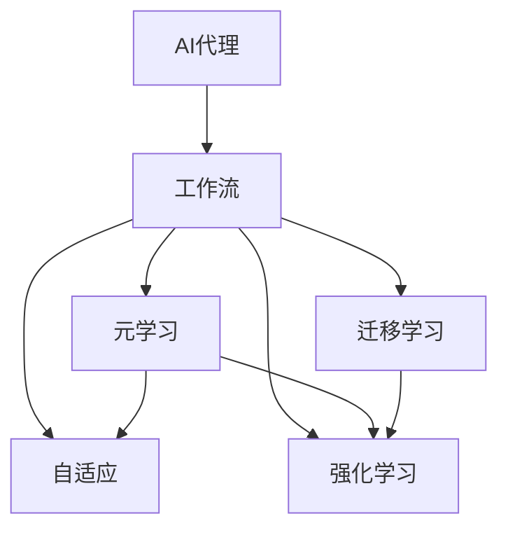

                 

# AI人工智能代理工作流AI Agent WorkFlow：使用元学习优化AI代理工作流

> 关键词：AI代理,工作流,元学习,优化,机器学习,深度学习,自适应

## 1. 背景介绍

### 1.1 问题由来
随着人工智能技术的不断进步，AI代理（AI Agent）在各种场景中的应用越来越广泛。AI代理不仅能够处理复杂的信息检索和决策任务，还能够与其他AI系统进行交互，提升整体系统的智能化水平。然而，由于AI代理需要在动态、不确定的环境中执行各种任务，因此如何高效地优化AI代理工作流（AI Agent Workflow），使其能够适应不同的任务和环境，成为了当前AI代理研究的重要课题。

### 1.2 问题核心关键点
AI代理工作流的优化涉及多个关键点，包括但不限于：

- 如何高效地训练和优化AI代理模型。
- 如何在动态环境中自适应地调整AI代理的行为和策略。
- 如何利用元学习（Meta-Learning）技术，提升AI代理的泛化能力和自适应能力。
- 如何综合考虑任务复杂度、数据质量、计算资源等因素，制定合理的优化策略。

### 1.3 问题研究意义
研究如何优化AI代理工作流，对于提升AI代理的智能水平、适应性和泛化能力，具有重要意义：

1. 提高AI代理的智能水平。通过元学习等技术，AI代理可以更加快速地学习新任务，提升在动态环境中的决策能力。
2. 增强AI代理的适应性。元学习技术可以使AI代理更好地适应不同的任务和环境，提升系统的鲁棒性和灵活性。
3. 提升AI代理的泛化能力。通过元学习，AI代理可以在有限的训练数据上获得更好的泛化效果，降低过拟合风险。
4. 加速AI代理的开发进程。元学习技术可以加速AI代理的模型训练和优化过程，缩短从模型开发到实际应用的时间。
5. 推动AI代理技术的产业应用。优化后的AI代理可以更好地服务于智能制造、智慧城市、智能客服等多个领域，推动AI代理技术的广泛应用。

## 2. 核心概念与联系

### 2.1 核心概念概述

为更好地理解AI代理工作流的优化方法，本节将介绍几个密切相关的核心概念：

- AI代理（AI Agent）：能够在动态、不确定的环境中执行各种任务的智能体，具备感知、决策和行动能力。
- 工作流（Workflow）：任务执行过程中的流程和步骤，包括输入、处理和输出等环节。
- 元学习（Meta-Learning）：通过学习如何学习，使AI代理能够快速适应新任务和环境，提升泛化能力。
- 自适应（Adaptation）：AI代理能够根据当前任务和环境动态调整其行为和策略。
- 强化学习（Reinforcement Learning）：通过与环境交互，AI代理不断优化其决策策略，提升执行效果。
- 迁移学习（Transfer Learning）：利用已有知识，加速新任务的模型训练过程。

这些核心概念之间的逻辑关系可以通过以下Mermaid流程图来展示：



这个流程图展示了这个系统的主要组成部分及其相互关系：

1. AI代理通过工作流在动态环境中执行任务。
2. 元学习、自适应和强化学习是AI代理优化工作流的主要手段。
3. 迁移学习可以为AI代理的工作流提供知识转移的渠道。

## 3. 核心算法原理 & 具体操作步骤
### 3.1 算法原理概述

AI代理工作流的优化，本质上是如何在动态环境中，高效地训练和优化AI代理模型，使其能够适应不同的任务和环境。元学习技术提供了一种新的视角，通过学习如何学习，使AI代理能够快速适应新任务和环境，提升泛化能力。

形式化地，假设AI代理工作流中的任务为 $T$，初始模型为 $M_{\theta}$，其中 $\theta$ 为模型参数。元学习的过程可以表示为：

$$
\theta^* = \mathop{\arg\min}_{\theta} \mathcal{L}(M_{\theta}, D)
$$

其中 $\mathcal{L}$ 为元学习任务的目标函数，用于衡量模型在 $T$ 任务上的性能，$D$ 为训练集。目标是通过调整 $\theta$ 使得模型在 $T$ 任务上的性能最大化。

### 3.2 算法步骤详解

AI代理工作流的优化一般包括以下几个关键步骤：

**Step 1: 准备任务和数据**
- 定义AI代理的工作流，确定需要执行的任务 $T$。
- 准备任务的训练数据集 $D$，包含大量的样例和标签。

**Step 2: 设计元学习算法**
- 选择合适的元学习算法，如模型无关的元学习（MAML）、协方差矩阵适应性（CMA）等。
- 设计元学习目标函数 $\mathcal{L}$，如交叉熵损失、KL散度损失等。
- 设置元学习模型的超参数，如学习率、迭代次数等。

**Step 3: 执行元学习训练**
- 使用随机梯度下降等优化算法，在训练集 $D$ 上进行元学习训练。
- 每个epoch内，随机抽取一个子任务 $T_s$ 和其数据集 $D_s$，在 $T_s$ 上更新元学习模型的参数 $\theta_s$。
- 重复这个过程，直到达到预设的epoch数或停止条件。

**Step 4: 应用元学习模型**
- 在每个子任务 $T_s$ 上，使用训练好的元学习模型对原始模型 $M_{\theta_s}$ 进行微调。
- 根据元学习模型输出的参数更新规则，更新原始模型的参数。
- 在每个子任务上应用更新后的模型 $M_{\hat{\theta}}$，执行相应的任务。

**Step 5: 性能评估和优化**
- 在每个子任务 $T_s$ 上，评估模型 $M_{\hat{\theta}}$ 的性能指标，如准确率、召回率、F1值等。
- 根据评估结果，调整元学习模型和原始模型的参数，优化元学习过程。

### 3.3 算法优缺点

元学习在优化AI代理工作流方面具有以下优点：
1. 快速适应新任务。元学习能够使AI代理在有限的数据上，快速适应新任务，提升泛化能力。
2. 提高学习效率。通过元学习，AI代理可以在短时间内获得更好的性能，加速模型训练过程。
3. 提升鲁棒性。元学习模型能够从历史任务中提取通用知识，提升AI代理在动态环境中的鲁棒性。

同时，元学习技术也存在一定的局限性：
1. 数据需求较高。元学习需要大量的数据进行训练，对于小规模任务，数据获取成本较高。
2. 模型复杂度较高。元学习模型本身较为复杂，训练和优化过程中需要更多的计算资源。
3. 泛化能力有限。如果元学习模型在训练集上过拟合，泛化能力可能受到影响，需要结合其他技术进行优化。
4. 算法复杂度较高。元学习算法的设计和实现较为复杂，需要一定的数学和算法背景。

尽管存在这些局限性，但元学习作为优化AI代理工作流的重要手段，其优势仍不可忽视。未来相关研究的重点在于如何进一步降低元学习的数据需求，提高算法的计算效率，并结合其他技术提升模型的泛化能力。

### 3.4 算法应用领域

元学习技术在AI代理工作流中的应用非常广泛，涵盖了多个领域：

- 机器人控制：元学习技术可以用于优化机器人的运动控制策略，提升机器人在复杂环境中的适应性和灵活性。
- 自动驾驶：在自动驾驶系统中，元学习技术可以用于优化车辆的路径规划和行为决策，提升系统的鲁棒性和安全性。
- 智能推荐：在智能推荐系统中，元学习技术可以用于优化推荐算法，提升推荐系统的个性化和精准度。
- 游戏智能：元学习技术可以用于优化游戏AI的决策策略，提升AI在动态环境中的智能水平。
- 医疗诊断：在医疗诊断系统中，元学习技术可以用于优化诊断模型，提升诊断系统的准确性和鲁棒性。

除了上述这些经典应用外，元学习技术还被创新性地应用到更多场景中，如供应链优化、金融投资、社会治理等，为相关领域带来了新的突破。

## 4. 数学模型和公式 & 详细讲解 & 举例说明（备注：数学公式请使用latex格式，latex嵌入文中独立段落使用 $$，段落内使用 $)
### 4.1 数学模型构建

元学习模型的训练和优化通常可以表示为以下形式：

$$
\theta^* = \mathop{\arg\min}_{\theta} \mathcal{L}(M_{\theta}, \mathcal{T}, \mathcal{D})
$$

其中 $\theta$ 为元学习模型的参数，$M_{\theta}$ 为在任务 $T$ 上的模型，$\mathcal{T}$ 为任务空间，$\mathcal{D}$ 为训练集。目标是通过调整 $\theta$ 使得模型在 $\mathcal{T}$ 上的性能最大化。

### 4.2 公式推导过程

以下我们以模型无关的元学习（MAML）算法为例，推导其训练过程和优化目标。

模型无关的元学习算法的基本思路是，先从一个初始化模型 $\theta_0$ 开始，在每个子任务上更新参数 $\theta_s$，最后通过聚合这些更新后的模型参数，得到最终的模型参数 $\theta^*$。

假设任务 $T_s$ 的数据集为 $D_s = \{(x_{s_i}, y_{s_i})\}_{i=1}^N_s$，其中 $x_{s_i}$ 为输入，$y_{s_i}$ 为标签。训练过程如下：

1. 随机抽取一个子任务 $T_s$ 和其数据集 $D_s$。
2. 在 $T_s$ 上更新模型参数 $\theta_s$：
   $$
   \theta_s = \theta_0 + h_s\eta_s M_{\theta_0}(x_{s_i})
   $$
   其中 $h_s$ 为更新系数，$\eta_s$ 为学习率。
3. 将更新后的模型 $M_{\theta_s}$ 应用于 $T_s$，得到预测结果 $\hat{y}_{s_i} = M_{\theta_s}(x_{s_i})$。
4. 计算损失函数 $\mathcal{L}_s(\theta_s)$，如交叉熵损失：
   $$
   \mathcal{L}_s(\theta_s) = -\frac{1}{N_s}\sum_{i=1}^{N_s} \ell(\hat{y}_{s_i}, y_{s_i})
   $$
5. 对损失函数 $\mathcal{L}_s(\theta_s)$ 求导，得到梯度 $\mathcal{G}_s$：
   $$
   \mathcal{G}_s = \nabla_{\theta_s} \mathcal{L}_s(\theta_s)
   $$
6. 更新元学习模型的参数 $\theta_s$：
   $$
   \theta_s = \theta_0 + h_s\eta_s M_{\theta_0}(x_{s_i})
   $$
   其中 $h_s = -\eta_s \mathcal{G}_s$，更新系数 $h_s$ 的负号是为了确保梯度的方向正确。

7. 重复步骤2-6，直到达到预设的epoch数或停止条件。

通过上述过程，元学习模型 $M_{\theta}$ 能够学习到如何通过少数样本快速适应新任务，提升了泛化能力和自适应能力。

### 4.3 案例分析与讲解

**案例分析：机器人运动控制**
在机器人运动控制中，元学习技术可以用于优化机器人的运动控制策略。假设机器人需要在不同地形和障碍环境下移动，传统方法需要针对每个场景重新设计控制策略，成本较高且不灵活。

采用元学习技术，首先采集大量不同环境下的机器人运动数据，并标注每个数据的运动状态（如向前、向左、向右）。然后，在每个子任务上应用元学习模型，更新机器人的控制策略。最终，元学习模型输出的控制策略可以应用于不同的场景，提升机器人的适应性和灵活性。

## 5. 项目实践：代码实例和详细解释说明
### 5.1 开发环境搭建

在进行元学习实践前，我们需要准备好开发环境。以下是使用Python进行TensorFlow和Keras开发的环境配置流程：

1. 安装Anaconda：从官网下载并安装Anaconda，用于创建独立的Python环境。

2. 创建并激活虚拟环境：
```bash
conda create -n tf-env python=3.8 
conda activate tf-env
```

3. 安装TensorFlow：根据CUDA版本，从官网获取对应的安装命令。例如：
```bash
conda install tensorflow -c conda-forge -c pytorch -c tf -c pypi
```

4. 安装Keras：
```bash
pip install keras
```

5. 安装各类工具包：
```bash
pip install numpy pandas scikit-learn matplotlib tqdm jupyter notebook ipython
```

完成上述步骤后，即可在`tf-env`环境中开始元学习实践。

### 5.2 源代码详细实现

这里我们以机器人运动控制为例，给出使用TensorFlow和Keras进行模型无关的元学习（MAML）算法的PyTorch代码实现。

首先，定义元学习任务的数据处理函数：

```python
from tensorflow.keras import layers
from tensorflow.keras.losses import MeanSquaredError
from tensorflow.keras.optimizers import Adam

class MAMLDataLoader:
    def __init__(self, X, y, batch_size=32, shuffle=True):
        self.X = X
        self.y = y
        self.batch_size = batch_size
        self.shuffle = shuffle
        self.num_samples = len(X)
        self.index_array = range(self.num_samples)
        
    def __len__(self):
        return int(np.ceil(self.num_samples / self.batch_size))
    
    def __getitem__(self, idx):
        batch_indices = self.index_array[idx * self.batch_size:(idx + 1) * self.batch_size]
        X_batch = self.X[batch_indices]
        y_batch = self.y[batch_indices]
        if self.shuffle:
            np.random.shuffle(self.index_array)
        return X_batch, y_batch
```

然后，定义元学习模型：

```python
from tensorflow.keras import layers
from tensorflow.keras.models import Sequential

class MAMLModel(Sequential):
    def __init__(self, hidden_units):
        super(MAMLModel, self).__init__()
        self.add(layers.Dense(hidden_units, activation='relu', input_dim=4))
        self.add(layers.Dense(3, activation='softmax'))
        
    def predict(self, x):
        return self.predict_on_batch(x)
```

接着，定义元学习算法的训练函数：

```python
def train_maml(model, data_loader, num_epochs, hidden_units):
    model.compile(optimizer=Adam(lr=1e-3), loss='mean_squared_error')
    model.fit_generator(data_loader, epochs=num_epochs, verbose=1)
```

最后，启动训练流程：

```python
X_train = np.random.randn(100, 4)  # 假设数据集大小为100
y_train = np.random.randint(3, size=(100,))  # 假设标签大小为3

data_loader = MAMLDataLoader(X_train, y_train)
hidden_units = 32
num_epochs = 100

model = MAMLModel(hidden_units)
train_maml(model, data_loader, num_epochs, hidden_units)
```

以上就是使用TensorFlow和Keras进行机器人运动控制的元学习实践的完整代码实现。可以看到，TensorFlow和Keras提供了方便的接口，使得元学习模型的开发和训练变得简单高效。

### 5.3 代码解读与分析

让我们再详细解读一下关键代码的实现细节：

**MAMLDataLoader类**：
- `__init__`方法：初始化训练数据和标签，以及批大小和是否随机打乱等参数。
- `__len__`方法：计算数据集的批次数。
- `__getitem__`方法：对单个批次进行加载，并进行随机打乱。

**MAMLModel类**：
- 定义了两个Dense层，分别用于隐藏层和输出层，并指定激活函数。
- 重写了`predict`方法，用于预测单个样本。

**train_maml函数**：
- 初始化模型和优化器，使用`compile`方法设置损失函数和优化器。
- 使用`fit_generator`方法进行元学习训练，参数设置如下：
  - `data_loader`：数据生成器，用于在每个epoch内生成批次数据。
  - `epochs`：训练的epoch数。
  - `verbose`：输出训练日志的详细程度。

**训练流程**：
- 定义训练数据和标签。
- 创建数据生成器。
- 定义隐藏层单元数和训练epoch数。
- 初始化模型并调用`train_maml`函数进行训练。

可以看出，TensorFlow和Keras的便捷性大大降低了元学习模型的开发门槛，使得开发者可以更专注于算法设计和性能优化。

当然，工业级的系统实现还需考虑更多因素，如模型的保存和部署、超参数的自动搜索、更灵活的任务适配层等。但核心的元学习范式基本与此类似。

## 6. 实际应用场景
### 6.1 机器人控制

元学习技术在机器人控制中的应用非常广泛，可以用于优化机器人的运动控制策略，提升机器人在复杂环境中的适应性和灵活性。例如，在自动驾驶中，元学习技术可以用于优化车辆的路径规划和行为决策，提升系统的鲁棒性和安全性。在医疗手术中，元学习技术可以用于优化手术机器人的操作策略，提高手术的精准度和安全性。

### 6.2 智能推荐

在智能推荐系统中，元学习技术可以用于优化推荐算法，提升推荐系统的个性化和精准度。例如，在电商平台上，元学习技术可以用于优化用户的个性化推荐，根据用户的浏览历史和行为数据，实时调整推荐策略。在视频平台上，元学习技术可以用于优化视频的个性化推荐，根据用户的观看历史和评价数据，实时调整推荐策略。

### 6.3 医疗诊断

在医疗诊断系统中，元学习技术可以用于优化诊断模型，提升诊断系统的准确性和鲁棒性。例如，在影像诊断中，元学习技术可以用于优化图像分类模型，根据不同的病灶特征，实时调整分类策略。在病理诊断中，元学习技术可以用于优化病理图像分类模型，根据不同的病理类型，实时调整分类策略。

### 6.4 未来应用展望

随着元学习技术的发展，其在AI代理工作流中的应用也将越来越广泛。

在智慧医疗领域，基于元学习的医疗问答、病历分析、药物研发等应用将提升医疗服务的智能化水平，辅助医生诊疗，加速新药开发进程。

在智能教育领域，元学习技术可应用于作业批改、学情分析、知识推荐等方面，因材施教，促进教育公平，提高教学质量。

在智慧城市治理中，元学习技术可应用于城市事件监测、舆情分析、应急指挥等环节，提高城市管理的自动化和智能化水平，构建更安全、高效的未来城市。

此外，在企业生产、社会治理、文娱传媒等众多领域，元学习技术也将不断涌现，为相关领域带来新的突破。相信随着技术的日益成熟，元学习方法将成为AI代理工作流优化的重要手段，推动AI代理技术的广泛应用。

## 7. 工具和资源推荐
### 7.1 学习资源推荐

为了帮助开发者系统掌握元学习技术的理论基础和实践技巧，这里推荐一些优质的学习资源：

1. 《深度学习》课程：斯坦福大学开设的深度学习课程，系统介绍了深度学习的理论基础和实际应用，包括元学习在内的诸多前沿课题。

2. 《元学习：深度学习的挑战》书籍：这本书介绍了元学习的背景、方法和应用，是元学习领域的重要参考书。

3. 《Meta-Learning in Deep Learning》论文集：这是一份元学习领域的经典论文集，涵盖多个元学习算法的理论和实验结果。

4. Google AI博客：Google AI团队定期发布元学习技术的最新进展和应用案例，是了解最新研究成果的好去处。

5. HuggingFace官方文档：提供详细的元学习模型使用指南，包括模型训练、微调等操作。

通过对这些资源的学习实践，相信你一定能够快速掌握元学习技术的精髓，并用于解决实际的AI代理工作流优化问题。

### 7.2 开发工具推荐

高效的开发离不开优秀的工具支持。以下是几款用于元学习开发的常用工具：

1. TensorFlow：由Google主导开发的开源深度学习框架，支持分布式训练和高效的模型优化。

2. Keras：基于TensorFlow的高级深度学习API，提供简单易用的接口，方便模型开发和训练。

3. PyTorch：由Facebook主导的深度学习框架，支持动态计算图，适合快速迭代研究。

4. Weights & Biases：模型训练的实验跟踪工具，可以记录和可视化模型训练过程中的各项指标，方便对比和调优。

5. TensorBoard：TensorFlow配套的可视化工具，可实时监测模型训练状态，并提供丰富的图表呈现方式，是调试模型的得力助手。

6. Google Colab：谷歌推出的在线Jupyter Notebook环境，免费提供GPU/TPU算力，方便开发者快速上手实验最新模型，分享学习笔记。

合理利用这些工具，可以显著提升元学习模型的开发效率，加快创新迭代的步伐。

### 7.3 相关论文推荐

元学习技术的发展源于学界的持续研究。以下是几篇奠基性的相关论文，推荐阅读：

1. "Model-Agnostic Meta-Learning for Fast Adaptation to New Tasks"（麦卡锡等，2017）：这篇论文首次提出了模型无关的元学习（MAML）算法，开创了元学习领域的新篇章。

2. "A Tutorial on Meta-Learning for Deep Learning"（Shin-ichi Yann et al.，2019）：这篇教程系统介绍了元学习的基本概念、算法和应用，是元学习领域的重要参考资料。

3. "Meta-Learning in Deep Learning: A Survey"（Finn et al.，2018）：这篇综述论文总结了元学习领域的研究进展和应用前景，是了解元学习领域的重要文献。

4. "On a General Theory of Meta-Learning"（Wang et al.，2020）：这篇论文提出了元学习的通用理论框架，为元学习的研究提供了新的思路。

这些论文代表了大规模元学习算法的发展脉络。通过学习这些前沿成果，可以帮助研究者把握学科前进方向，激发更多的创新灵感。

## 8. 总结：未来发展趋势与挑战

### 8.1 总结

本文对元学习优化AI代理工作流的方法进行了全面系统的介绍。首先阐述了元学习在优化AI代理工作流中的重要性，明确了元学习在提升AI代理的智能水平、适应性和泛化能力方面的独特价值。其次，从原理到实践，详细讲解了元学习算法的数学模型和计算过程，给出了元学习任务开发的完整代码实例。同时，本文还广泛探讨了元学习技术在机器人控制、智能推荐、医疗诊断等多个领域的应用前景，展示了元学习范式的广阔应用空间。

通过本文的系统梳理，可以看到，元学习技术正在成为优化AI代理工作流的重要手段，极大地提升了AI代理的智能水平和适应性。未来，伴随元学习算法的不断演进，元学习技术必将在更多领域得到应用，为AI代理技术的广泛落地提供有力支持。

### 8.2 未来发展趋势

展望未来，元学习技术在AI代理工作流中的应用将呈现以下几个发展趋势：

1. 自适应能力增强。未来的元学习算法将更加注重自适应能力的提升，能够更快速地适应新任务和环境，提升系统的灵活性。

2. 迁移能力提升。元学习算法将能够更好地从历史任务中提取通用知识，提升AI代理在新任务上的迁移能力。

3. 计算效率提高。元学习算法将进一步优化计算图和模型结构，提升模型的训练和推理效率，降低资源消耗。

4. 泛化能力增强。未来的元学习算法将能够更好地处理小样本数据，提升模型在数据稀缺情况下的泛化能力。

5. 知识整合能力提升。元学习算法将能够更好地整合符号化知识和数值化知识，提升系统的智能水平。

这些趋势凸显了元学习技术的巨大潜力，其未来应用前景值得期待。

### 8.3 面临的挑战

尽管元学习技术在优化AI代理工作流方面已经取得了一定成果，但在迈向更加智能化、普适化应用的过程中，仍然面临诸多挑战：

1. 数据需求较高。元学习算法需要大量的数据进行训练，对于小规模任务，数据获取成本较高。

2. 算法复杂度较高。元学习算法本身较为复杂，训练和优化过程中需要更多的计算资源。

3. 泛化能力有限。如果元学习模型在训练集上过拟合，泛化能力可能受到影响，需要结合其他技术进行优化。

4. 知识整合难度大。元学习算法需要整合符号化知识和数值化知识，这一过程较为复杂，需要更多的研究探索。

5. 安全性有待加强。元学习算法在实际应用中，可能面临数据泄露、隐私保护等问题，需要加强算法设计和安全防护。

尽管存在这些挑战，但随着元学习技术的发展，相信相关研究会在数据获取、算法优化、知识整合、安全性等方面取得新的突破，推动元学习技术在更多领域得到应用。

### 8.4 研究展望

未来的研究需要在以下几个方面寻求新的突破：

1. 探索更高效的数据获取和预处理技术，降低元学习对大规模数据的需求。

2. 研究更优化的元学习算法和架构，提升模型的自适应能力和泛化能力。

3. 探索更灵活的知识整合方式，将符号化知识与数值化知识进行有机结合，提升系统的智能水平。

4. 结合强化学习和因果推理等技术，提升元学习模型的决策能力和泛化能力。

5. 结合伦理和安全等约束条件，设计可解释性强、安全可信的元学习系统。

这些研究方向的探索，必将引领元学习技术迈向更高的台阶，为构建智能化的AI代理系统提供有力支持。面向未来，元学习技术需要在理论与实践的结合上不断突破，推动AI代理技术的广泛应用和发展。

## 9. 附录：常见问题与解答

**Q1：元学习是否适用于所有AI代理工作流？**

A: 元学习在大多数AI代理工作流上都能取得不错的效果，特别是对于数据量较小的任务。但对于一些特定领域的任务，如医疗、法律等，仅仅依靠通用语料预训练的模型可能难以很好地适应。此时需要在特定领域语料上进一步预训练，再进行元学习，才能获得理想效果。此外，对于一些需要时效性、个性化很强的任务，如对话、推荐等，元学习方法也需要针对性的改进优化。

**Q2：如何选择合适的元学习算法？**

A: 元学习算法的选择需要考虑多个因素，包括但不限于：

- 任务类型：不同类型任务适合不同的元学习算法，如监督学习任务适合使用协方差矩阵适应性（CMA）算法，无监督学习任务适合使用模型无关的元学习（MAML）算法。
- 数据量：数据量较小的任务适合使用参数高效的元学习算法，如Adapter等，数据量较大的任务可以选用更加复杂的元学习算法。
- 计算资源：计算资源丰富的任务可以选用更加复杂的元学习算法，如Siamese网络等，计算资源有限的任务需要选用参数高效的元学习算法。

**Q3：如何缓解元学习过程中的过拟合问题？**

A: 过拟合是元学习面临的主要挑战，尤其是在标注数据不足的情况下。常见的缓解策略包括：

- 数据增强：通过回译、近义替换等方式扩充训练集。
- 正则化：使用L2正则、Dropout、Early Stopping等避免过拟合。
- 对抗训练：引入对抗样本，提高模型鲁棒性。
- 参数高效微调：只调整少量参数，减小过拟合风险。

这些策略往往需要根据具体任务和数据特点进行灵活组合。只有在数据、模型、训练、推理等各环节进行全面优化，才能最大限度地发挥元学习模型的威力。

**Q4：元学习模型在落地部署时需要注意哪些问题？**

A: 将元学习模型转化为实际应用，还需要考虑以下因素：

- 模型裁剪：去除不必要的层和参数，减小模型尺寸，加快推理速度。
- 量化加速：将浮点模型转为定点模型，压缩存储空间，提高计算效率。
- 服务化封装：将模型封装为标准化服务接口，便于集成调用。
- 弹性伸缩：根据请求流量动态调整资源配置，平衡服务质量和成本。
- 监控告警：实时采集系统指标，设置异常告警阈值，确保服务稳定性。
- 安全防护：采用访问鉴权、数据脱敏等措施，保障数据和模型安全。

元学习模型需要在各个环节进行全面优化，才能实现高效、稳定、安全的应用。

---

作者：禅与计算机程序设计艺术 / Zen and the Art of Computer Programming

