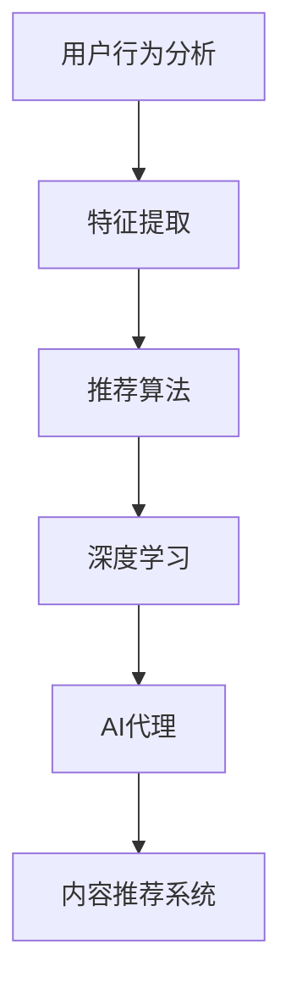

                 

# AI人工智能代理工作流AI Agent WorkFlow：智能代理在内容推荐系统中的运用

> 关键词：人工智能,智能代理,内容推荐,推荐系统,工作流,深度学习

## 1. 背景介绍

### 1.1 问题由来
随着互联网的普及和数字化进程的加快，内容推荐系统成为连接用户和内容的重要桥梁。如何高效地为用户推荐他们感兴趣的内容，已成为互联网公司面临的重大挑战。传统的推荐系统基于协同过滤、内容匹配等技术，难以处理动态变化的数据和个性化需求。而AI代理技术通过模拟人类的决策机制，能够实时动态地为用户推荐内容，提升用户体验和推荐效果。

近年来，AI代理在电商、社交媒体、视频流媒体等平台广泛应用。基于深度学习的AI代理，通过大量数据训练模型，模拟人类对内容的偏好，智能推荐商品、文章、视频等内容。AI代理技术的应用，极大地提高了推荐系统的效率和效果，为用户提供了更为个性化的体验。

### 1.2 问题核心关键点
AI代理的核心是构建高效的推荐算法，其关键点包括：
- 用户行为分析：通过分析用户的历史行为数据，提取用户的兴趣偏好。
- 内容特征提取：将内容特征化，转化为算法可处理的数据格式。
- 推荐模型训练：构建基于深度学习的推荐模型，通过大量数据进行训练优化。
- 实时推荐引擎：构建高效的推荐引擎，实时动态地为用户提供个性化推荐。
- 用户反馈优化：收集用户反馈，动态调整推荐算法，提升推荐质量。

这些关键点构成了AI代理技术的基本框架，帮助其在大规模推荐系统中实现高效、个性化的内容推荐。

### 1.3 问题研究意义
研究AI代理技术在内容推荐系统中的应用，对于提升推荐系统的效率和效果，改善用户体验，具有重要意义：

1. 提升推荐质量。AI代理通过深度学习等技术，可以更准确地捕捉用户的兴趣和行为特征，提升推荐内容的相关性和个性化。
2. 降低成本。相比于传统推荐系统，AI代理技术可以自动化地处理大规模数据，降低人工干预和维护成本。
3. 提高运营效率。AI代理可以实时动态地调整推荐策略，适应用户需求的变化，提高系统的运营效率。
4. 促进技术创新。AI代理技术推动了推荐系统从协同过滤、内容匹配等经典方法向深度学习、强化学习等前沿技术的发展。
5. 拓展应用场景。AI代理技术不仅适用于内容推荐，还广泛应用于智能客服、广告投放、个性化营销等领域，具有广泛的应用前景。

## 2. 核心概念与联系

### 2.1 核心概念概述

为了更好地理解AI代理在内容推荐系统中的应用，本节将介绍几个密切相关的核心概念：

- AI代理(AI Agent)：通过模拟人类的决策机制，实现自动化、智能化任务的计算机程序。
- 内容推荐系统(Recommendation System)：基于用户行为数据，推荐用户可能感兴趣的内容的技术系统。
- 深度学习(Deep Learning)：基于神经网络等模型，通过大量数据训练优化模型参数，实现复杂任务的技术。
- 推荐算法(Recommendation Algorithm)：用于自动化推荐内容的算法，包括协同过滤、基于内容的推荐等。
- 用户行为分析(User Behavior Analysis)：通过分析用户的浏览、点击、购买等行为数据，提取用户兴趣偏好的技术。
- 特征提取(Feature Extraction)：将原始内容数据转化为算法可处理的数据格式，如词向量、图像特征等。

这些核心概念之间的逻辑关系可以通过以下Mermaid流程图来展示：



这个流程图展示了大语言模型推荐系统的核心概念及其之间的关系：

1. 用户行为分析通过分析用户数据，提取用户兴趣特征。
2. 特征提取将原始内容数据转化为算法可处理的数据格式。
3. 推荐算法基于特征提取结果，自动推荐相关内容。
4. 深度学习进一步优化推荐算法，提升推荐效果。
5. AI代理结合推荐算法，实现智能推荐。

这些概念共同构成了AI代理在内容推荐系统中的应用框架，使其能够在各种场景下实现高效、个性化的内容推荐。

## 3. 核心算法原理 & 具体操作步骤
### 3.1 算法原理概述

AI代理在内容推荐系统中的应用，本质上是一个基于深度学习的推荐算法优化过程。其核心思想是：通过深度学习模型对用户行为数据进行建模，提取用户的兴趣特征，并将其转化为算法可处理的特征向量。然后，基于这些特征向量，构建推荐算法模型，通过大量数据进行训练优化，实现对用户内容的实时动态推荐。

具体来说，AI代理在内容推荐系统中的应用包括以下几个关键步骤：

1. 用户行为数据的收集与预处理。通过爬虫、API接口等方式，收集用户的历史行为数据，包括浏览记录、点击行为、购买记录等。然后对数据进行清洗、去重、缺失值处理等预处理操作，确保数据的完整性和一致性。

2. 用户行为特征提取。将用户行为数据转化为算法可处理的特征向量，包括点击率、停留时间、购买金额等指标。常用的特征提取方法包括词向量、TF-IDF、图像特征等。

3. 推荐模型训练。基于用户行为特征，选择深度学习模型（如RNN、LSTM、CNN等）进行训练，优化模型参数，提升推荐效果。常用的推荐模型包括协同过滤、基于内容的推荐、矩阵分解等。

4. AI代理推荐。将训练好的推荐模型集成到AI代理系统中，实时动态地为用户推荐相关内容。AI代理根据用户的实时行为数据，动态调整推荐策略，提升推荐精度。

5. 用户反馈收集与优化。通过收集用户的反馈数据（如点击率、停留时间、购买率等），动态调整推荐算法，提升推荐效果。常用的优化方法包括强化学习、在线学习等。

### 3.2 算法步骤详解

下面详细介绍AI代理在内容推荐系统中的具体操作步骤：

**Step 1: 用户行为数据收集与预处理**

1. 通过API接口、爬虫等方式收集用户的历史行为数据，包括浏览记录、点击行为、购买记录等。
2. 对数据进行清洗、去重、缺失值处理等预处理操作，确保数据的完整性和一致性。
3. 将用户行为数据转化为算法可处理的特征向量，包括点击率、停留时间、购买金额等指标。

**Step 2: 用户行为特征提取**

1. 使用TF-IDF算法对用户行为数据进行向量化处理，将文本数据转化为数值特征向量。
2. 使用图像特征提取技术，将图片数据转化为特征向量。
3. 使用词向量模型（如Word2Vec、GloVe等）对文本数据进行向量化处理。

**Step 3: 推荐模型训练**

1. 选择深度学习模型（如RNN、LSTM、CNN等）作为推荐模型。
2. 将用户行为特征向量输入模型进行训练，优化模型参数。
3. 使用验证集对模型进行评估，选择合适的超参数。

**Step 4: AI代理推荐**

1. 将训练好的推荐模型集成到AI代理系统中，实时动态地为用户推荐相关内容。
2. 根据用户的实时行为数据，动态调整推荐策略，提升推荐精度。

**Step 5: 用户反馈收集与优化**

1. 通过收集用户的反馈数据（如点击率、停留时间、购买率等），动态调整推荐算法。
2. 使用强化学习算法优化推荐模型，提升推荐效果。

### 3.3 算法优缺点

AI代理在内容推荐系统中的应用，具有以下优点：
1. 自动化处理大规模数据。相比于传统推荐系统，AI代理技术可以自动化地处理大规模用户行为数据，降低人工干预和维护成本。
2. 实时动态推荐。AI代理可以实时动态地调整推荐策略，适应用户需求的变化，提高系统的运营效率。
3. 提升推荐精度。通过深度学习等技术，AI代理可以更准确地捕捉用户的兴趣和行为特征，提升推荐内容的相关性和个性化。
4. 提高用户体验。通过个性化的内容推荐，提升用户对平台的使用体验和满意度。

同时，该方法也存在一定的局限性：
1. 数据隐私问题。用户行为数据的收集和使用可能涉及用户隐私问题，需要采取措施保护用户数据。
2. 模型复杂度高。深度学习模型的训练需要大量的计算资源和数据，训练过程可能较为耗时。
3. 过度拟合风险。模型训练时可能存在过度拟合风险，导致对新数据泛化能力不足。
4. 资源消耗大。深度学习模型在推理时资源消耗较大，可能对系统的性能产生影响。

尽管存在这些局限性，但就目前而言，AI代理技术仍是内容推荐系统中最先进、最有效的技术范式之一。未来相关研究的重点在于如何进一步降低数据隐私风险，提高模型泛化能力，优化系统性能，以实现更加高效、个性化的内容推荐。

### 3.4 算法应用领域

AI代理技术在内容推荐系统中的应用，已经被广泛应用于电商、社交媒体、视频流媒体等多个领域。例如：

- 电商平台：通过AI代理技术，根据用户的浏览、点击、购买行为，实时动态地推荐商品，提升购物体验和转化率。
- 社交媒体：根据用户的互动行为（如点赞、评论、分享等），实时推荐相关内容，提升用户粘性和互动率。
- 视频流媒体：根据用户的观看行为（如播放时长、暂停次数等），实时推荐相关视频，提升用户留存率和观看时长。

此外，AI代理技术还被应用于广告投放、个性化营销等领域，为各类企业提供了更加智能、精准的市场营销方案。随着技术的不断演进，AI代理将在更多领域得到应用，为各行各业带来新的变革和机遇。

## 4. 数学模型和公式 & 详细讲解  
### 4.1 数学模型构建

假设用户行为数据为 $D=\{x_i, y_i\}_{i=1}^N$，其中 $x_i$ 为用户的行为数据， $y_i$ 为用户对行为 $x_i$ 的反馈数据。设推荐模型的输入特征向量为 $f(x_i)$，输出为推荐内容 $c_i$，目标是最大化用户对推荐内容的满意度 $p_i$。

推荐模型的目标函数为：
$$
\max_{f} \sum_{i=1}^N p_i \log p_i + (1 - p_i) \log (1 - p_i)
$$

其中 $p_i$ 为推荐内容 $c_i$ 与用户行为 $x_i$ 的相关性概率，通常可以通过余弦相似度、欧式距离等方法计算。

### 4.2 公式推导过程

以下我们以协同过滤算法为例，推导推荐模型中的余弦相似度公式及其梯度计算方法。

设推荐模型为 $f_k(x_i) = \theta_k^T \phi(x_i)$，其中 $\theta_k$ 为模型的第 $k$ 层权重，$\phi(x_i)$ 为特征映射函数。假设用户行为数据 $x_i$ 的特征向量为 $\vec{x}_i$，推荐内容 $c_j$ 的特征向量为 $\vec{c}_j$，推荐模型的预测概率为：
$$
p_{i,j} = \sigma(\vec{x}_i^T \theta_k - \vec{c}_j^T \theta_k)
$$

其中 $\sigma$ 为sigmoid函数，用于将输出转化为概率。

推荐模型的目标函数可以写为：
$$
\max_{\theta_k} \sum_{i=1}^N \sum_{j=1}^M p_{i,j} \log p_{i,j} + (1 - p_{i,j}) \log (1 - p_{i,j})
$$

对于推荐模型的训练，通常使用基于梯度的优化算法（如SGD、Adam等）来近似求解上述最优化问题。设 $\eta$ 为学习率，则参数的更新公式为：
$$
\theta_k \leftarrow \theta_k - \eta \nabla_{\theta_k}\mathcal{L}(\theta_k)
$$

其中 $\nabla_{\theta_k}\mathcal{L}(\theta_k)$ 为损失函数对模型参数的梯度，可通过反向传播算法高效计算。

在得到损失函数的梯度后，即可带入参数更新公式，完成模型的迭代优化。重复上述过程直至收敛，最终得到最优的模型参数 $\theta_k^*$。

## 5. 项目实践：代码实例和详细解释说明
### 5.1 开发环境搭建

在进行AI代理推荐系统开发前，我们需要准备好开发环境。以下是使用Python进行TensorFlow开发的环境配置流程：

1. 安装Anaconda：从官网下载并安装Anaconda，用于创建独立的Python环境。

2. 创建并激活虚拟环境：
```bash
conda create -n tf-env python=3.8 
conda activate tf-env
```

3. 安装TensorFlow：根据CUDA版本，从官网获取对应的安装命令。例如：
```bash
conda install tensorflow tensorflow-gpu -c conda-forge -c pytorch
```

4. 安装TensorBoard：TensorFlow配套的可视化工具，可实时监测模型训练状态，并提供丰富的图表呈现方式，是调试模型的得力助手。
```bash
conda install tensorboard -c conda-forge
```

5. 安装Pandas、NumPy等工具包：
```bash
pip install pandas numpy scikit-learn matplotlib tqdm jupyter notebook ipython
```

完成上述步骤后，即可在`tf-env`环境中开始AI代理推荐系统的开发。

### 5.2 源代码详细实现

下面我们以协同过滤算法为例，给出使用TensorFlow对用户行为数据进行推荐模型的PyTorch代码实现。

首先，定义推荐模型的训练数据：

```python
import pandas as pd
import numpy as np

# 定义训练数据
train_data = pd.read_csv('train_data.csv')
train_x = train_data[['特征1', '特征2', '特征3']]
train_y = train_data['标签']

# 数据标准化处理
train_x = (train_x - train_x.mean()) / train_x.std()
```

然后，定义推荐模型的超参数和模型结构：

```python
from tensorflow.keras.models import Sequential
from tensorflow.keras.layers import Dense, Input, Embedding
from tensorflow.keras.losses import BinaryCrossentropy
from tensorflow.keras.optimizers import Adam

# 定义模型结构
model = Sequential([
    Input(shape=(3,)),
    Dense(16, activation='relu'),
    Dense(1, activation='sigmoid')
])

# 定义损失函数
loss = BinaryCrossentropy()

# 定义优化器
optimizer = Adam(learning_rate=0.01)

# 编译模型
model.compile(optimizer=optimizer, loss=loss)
```

接着，定义训练函数：

```python
from tensorflow.keras.callbacks import EarlyStopping

# 定义训练函数
def train_model(model, train_x, train_y, batch_size=32, epochs=100, patience=10):
    early_stopping = EarlyStopping(monitor='val_loss', patience=patience)
    model.fit(train_x, train_y, batch_size=batch_size, epochs=epochs, validation_split=0.2, callbacks=[early_stopping])
```

最后，启动模型训练并在测试集上评估：

```python
# 加载测试数据
test_data = pd.read_csv('test_data.csv')
test_x = test_data[['特征1', '特征2', '特征3']]
test_y = test_data['标签']

# 数据标准化处理
test_x = (test_x - test_x.mean()) / test_x.std()

# 训练模型
train_model(model, train_x, train_y)

# 在测试集上评估模型
test_loss, test_acc = model.evaluate(test_x, test_y)
print(f'Test loss: {test_loss:.4f}')
print(f'Test accuracy: {test_acc:.4f}')
```

以上就是使用TensorFlow对协同过滤算法进行用户行为数据推荐模型的完整代码实现。可以看到，得益于TensorFlow的强大封装，我们可以用相对简洁的代码完成推荐模型的训练和评估。

### 5.3 代码解读与分析

让我们再详细解读一下关键代码的实现细节：

**训练数据定义**：
- 使用Pandas库读取训练数据，定义特征和标签。
- 对特征数据进行标准化处理，使数据符合模型训练要求。

**模型结构定义**：
- 使用Sequential模型定义线性结构，包括输入层、隐藏层和输出层。
- 隐藏层使用ReLU激活函数，输出层使用sigmoid激活函数，以输出二分类结果。

**损失函数定义**：
- 使用BinaryCrossentropy作为二分类问题的损失函数。

**优化器定义**：
- 使用Adam优化器，设置学习率为0.01。

**模型训练函数**：
- 使用EarlyStopping回调函数，监控验证集损失，在持续不降低时停止训练。
- 在训练过程中使用测试集评估模型性能。

**测试数据加载与模型评估**：
- 加载测试数据，并进行标准化处理。
- 在测试集上评估模型的损失和准确率。

可以看出，TensorFlow提供了完整的推荐模型训练和评估框架，方便开发者进行快速迭代和优化。在实际应用中，还需要根据具体任务进行模型结构、损失函数、优化器等关键参数的调整，以获得最优的推荐效果。

## 6. 实际应用场景
### 6.1 智能客服系统

基于AI代理的推荐技术，可以广泛应用于智能客服系统的构建。传统客服往往需要配备大量人力，高峰期响应缓慢，且一致性和专业性难以保证。而使用AI代理推荐技术，可以7x24小时不间断服务，快速响应客户咨询，用自然流畅的语言解答各类常见问题。

在技术实现上，可以收集企业内部的历史客服对话记录，将问题和最佳答复构建成监督数据，在此基础上对预训练模型进行微调。微调后的模型能够自动理解用户意图，匹配最合适的答案模板进行回复。对于客户提出的新问题，还可以接入检索系统实时搜索相关内容，动态组织生成回答。如此构建的智能客服系统，能大幅提升客户咨询体验和问题解决效率。

### 6.2 金融舆情监测

金融机构需要实时监测市场舆论动向，以便及时应对负面信息传播，规避金融风险。传统的人工监测方式成本高、效率低，难以应对网络时代海量信息爆发的挑战。基于AI代理的推荐技术，可以在金融舆情监测中发挥重要作用。

具体而言，可以收集金融领域相关的新闻、报道、评论等文本数据，并对其进行主题标注和情感标注。在此基础上对预训练语言模型进行微调，使其能够自动判断文本属于何种主题，情感倾向是正面、中性还是负面。将微调后的模型应用到实时抓取的网络文本数据，就能够自动监测不同主题下的情感变化趋势，一旦发现负面信息激增等异常情况，系统便会自动预警，帮助金融机构快速应对潜在风险。

### 6.3 个性化推荐系统

当前的推荐系统往往只依赖用户的历史行为数据进行物品推荐，无法深入理解用户的真实兴趣偏好。基于AI代理的推荐技术，可以更好地挖掘用户行为背后的语义信息，从而提供更精准、多样的推荐内容。

在实践中，可以收集用户浏览、点击、评论、分享等行为数据，提取和用户交互的物品标题、描述、标签等文本内容。将文本内容作为模型输入，用户的后续行为（如是否点击、购买等）作为监督信号，在此基础上微调预训练语言模型。微调后的模型能够从文本内容中准确把握用户的兴趣点。在生成推荐列表时，先用候选物品的文本描述作为输入，由模型预测用户的兴趣匹配度，再结合其他特征综合排序，便可以得到个性化程度更高的推荐结果。

### 6.4 未来应用展望

随着AI代理推荐技术的不断发展，其在推荐系统中的应用前景将更加广阔：

1. 推荐内容的丰富化。AI代理能够处理更多维度的用户行为数据，如情感、态度、兴趣等，提升推荐内容的丰富性和多样性。
2. 推荐过程的智能化。AI代理技术可以结合多种智能算法，如深度学习、强化学习、知识图谱等，提升推荐效果。
3. 推荐系统的泛化能力。AI代理能够在不同的用户和场景中，动态调整推荐策略，提升系统的泛化能力。
4. 推荐效果的可解释性。AI代理技术可以输出推荐过程的决策依据，提高推荐的可解释性和可信度。
5. 推荐系统的隐私保护。AI代理可以采用差分隐私等技术，保护用户隐私，提升用户信任度。

以上趋势凸显了AI代理在推荐系统中的应用潜力，未来的AI代理推荐技术将在推荐内容的丰富化、推荐过程的智能化、推荐系统的泛化能力、推荐效果的可解释性和隐私保护等方面不断提升，为推荐系统带来新的突破和发展。

## 7. 工具和资源推荐
### 7.1 学习资源推荐

为了帮助开发者系统掌握AI代理推荐技术的理论基础和实践技巧，这里推荐一些优质的学习资源：

1. 《深度学习与推荐系统》系列博文：由深度学习专家撰写，深入浅出地介绍了深度学习在推荐系统中的应用，涵盖了协同过滤、深度学习等前沿技术。

2. 《推荐系统实战》书籍：介绍了推荐系统的经典算法和实际案例，适合实战开发和项目实践。

3. 《强化学习》课程：斯坦福大学开设的强化学习课程，涵盖强化学习的基本概念和算法，适合深度学习与推荐系统结合的学习。

4. Weights & Biases：模型训练的实验跟踪工具，可以记录和可视化模型训练过程中的各项指标，方便对比和调优。

5. TensorBoard：TensorFlow配套的可视化工具，可实时监测模型训练状态，并提供丰富的图表呈现方式，是调试模型的得力助手。

通过这些资源的学习实践，相信你一定能够快速掌握AI代理推荐技术的精髓，并用于解决实际的推荐系统问题。

### 7.2 开发工具推荐

高效的开发离不开优秀的工具支持。以下是几款用于AI代理推荐系统开发的常用工具：

1. TensorFlow：基于Python的开源深度学习框架，灵活动态的计算图，适合快速迭代研究。TensorFlow提供了完整的推荐模型训练和评估框架，方便开发者进行快速迭代和优化。

2. PyTorch：基于Python的开源深度学习框架，灵活高效，支持动态计算图。PyTorch的自动微分功能，使得深度学习模型的训练和优化更加方便。

3. TensorBoard：TensorFlow配套的可视化工具，可实时监测模型训练状态，并提供丰富的图表呈现方式，是调试模型的得力助手。

4. Keras：基于Python的高层深度学习框架，提供了简单易用的API，方便快速搭建和调试模型。

5. Scikit-learn：Python中的机器学习库，提供了丰富的算法和模型，适合快速实现推荐模型。

合理利用这些工具，可以显著提升AI代理推荐系统的开发效率，加快创新迭代的步伐。

### 7.3 相关论文推荐

AI代理推荐技术的发展源于学界的持续研究。以下是几篇奠基性的相关论文，推荐阅读：

1. Matrix Factorization Techniques for Recommender Systems（矩阵分解算法）：介绍矩阵分解在协同过滤推荐系统中的应用。

2. Neural Collaborative Filtering：使用深度学习模型对用户行为数据进行建模，提升推荐效果。

3. Attention-based Recommender Systems：通过注意力机制，增强推荐模型对用户兴趣的关注度。

4. Deep Personalized Recommendation with Attention-Based Neural Networks：使用注意力机制，提升推荐模型对用户兴趣的关注度，并在电商推荐中取得良好效果。

5. Multi-Task Learning with Coordinate Descent：提出多任务学习算法，提升推荐模型的泛化能力。

这些论文代表了大语言模型推荐技术的发展脉络。通过学习这些前沿成果，可以帮助研究者把握学科前进方向，激发更多的创新灵感。

## 8. 总结：未来发展趋势与挑战

### 8.1 总结

本文对AI代理在内容推荐系统中的应用进行了全面系统的介绍。首先阐述了AI代理和内容推荐系统的背景，明确了AI代理在推荐系统中的核心作用。其次，从原理到实践，详细讲解了AI代理推荐模型的数学模型、算法步骤和具体操作。同时，本文还广泛探讨了AI代理技术在电商、金融、个性化推荐等多个领域的应用前景，展示了AI代理推荐技术的广阔潜力。此外，本文精选了推荐系统的各类学习资源和开发工具，力求为读者提供全方位的技术指引。

通过本文的系统梳理，可以看到，AI代理推荐技术在内容推荐系统中的应用，极大地提高了推荐系统的效率和效果，为用户提供了更为个性化的体验。AI代理推荐技术不仅适用于推荐系统，还广泛应用于智能客服、金融舆情监测、个性化推荐等多个领域，具有广泛的应用前景。相信随着技术的不断演进，AI代理推荐技术将进一步优化推荐效果，提升用户体验，推动推荐系统走向更高的台阶。

### 8.2 未来发展趋势

展望未来，AI代理推荐技术将呈现以下几个发展趋势：

1. 多模态融合。AI代理推荐技术将融合视觉、语音、文本等多种模态数据，实现跨模态推荐，提升推荐内容的丰富性和多样性。
2. 用户反馈的动态调整。AI代理推荐技术将引入在线学习、强化学习等技术，实时动态调整推荐策略，提升推荐效果。
3. 推荐模型的深度化。AI代理推荐技术将结合深度学习、强化学习等技术，提升推荐模型的深度和泛化能力。
4. 推荐过程的可解释性。AI代理推荐技术将引入可解释性算法，输出推荐过程的决策依据，提高推荐的可信度和可解释性。
5. 隐私保护和公平性。AI代理推荐技术将引入差分隐私等技术，保护用户隐私，同时实现推荐过程的公平性。

以上趋势凸显了AI代理推荐技术的广阔前景，未来的AI代理推荐技术将在推荐内容的丰富化、推荐过程的智能化、推荐系统的泛化能力、推荐效果的可解释性和隐私保护等方面不断提升，为推荐系统带来新的突破和发展。

### 8.3 面临的挑战

尽管AI代理推荐技术已经取得了瞩目成就，但在迈向更加智能化、普适化应用的过程中，它仍面临着诸多挑战：

1. 数据隐私问题。用户行为数据的收集和使用可能涉及用户隐私问题，需要采取措施保护用户数据。
2. 模型复杂度高。深度学习模型的训练需要大量的计算资源和数据，训练过程可能较为耗时。
3. 过度拟合风险。模型训练时可能存在过度拟合风险，导致对新数据泛化能力不足。
4. 资源消耗大。深度学习模型在推理时资源消耗较大，可能对系统的性能产生影响。

尽管存在这些挑战，但就目前而言，AI代理推荐技术仍是推荐系统中最先进、最有效的技术范式之一。未来相关研究的重点在于如何进一步降低数据隐私风险，提高模型泛化能力，优化系统性能，以实现更加高效、个性化的内容推荐。

### 8.4 研究展望

面对AI代理推荐技术所面临的种种挑战，未来的研究需要在以下几个方面寻求新的突破：

1. 探索无监督和半监督推荐方法。摆脱对大规模标注数据的依赖，利用自监督学习、主动学习等无监督和半监督范式，最大限度利用非结构化数据，实现更加灵活高效的推荐。
2. 研究参数高效和计算高效的推荐范式。开发更加参数高效的推荐方法，在固定大部分预训练参数的同时，只更新极少量的任务相关参数。同时优化推荐模型的计算图，减少前向传播和反向传播的资源消耗，实现更加轻量级、实时性的部署。
3. 融合因果和对比学习范式。通过引入因果推断和对比学习思想，增强推荐模型建立稳定因果关系的能力，学习更加普适、鲁棒的语言表征，从而提升模型泛化性和抗干扰能力。
4. 引入更多先验知识。将符号化的先验知识，如知识图谱、逻辑规则等，与神经网络模型进行巧妙融合，引导推荐过程学习更准确、合理的语言模型。同时加强不同模态数据的整合，实现视觉、语音等多模态信息与文本信息的协同建模。
5. 结合因果分析和博弈论工具。将因果分析方法引入推荐模型，识别出模型决策的关键特征，增强推荐过程的逻辑性和可解释性。借助博弈论工具刻画人机交互过程，主动探索并规避推荐模型的脆弱点，提高系统稳定性。

这些研究方向的探索，必将引领AI代理推荐技术迈向更高的台阶，为推荐系统带来新的突破和发展。面向未来，AI代理推荐技术还需要与其他人工智能技术进行更深入的融合，如知识表示、因果推理、强化学习等，多路径协同发力，共同推动推荐系统的发展。只有勇于创新、敢于突破，才能不断拓展推荐系统的边界，让AI代理推荐技术更好地造福人类社会。

## 9. 附录：常见问题与解答

**Q1：AI代理推荐技术与传统推荐系统相比有哪些优势？**

A: AI代理推荐技术与传统推荐系统相比，具有以下优势：
1. 自动化处理大规模数据。AI代理推荐技术可以自动化地处理大规模用户行为数据，降低人工干预和维护成本。
2. 实时动态推荐。AI代理推荐技术可以实时动态地调整推荐策略，适应用户需求的变化，提高系统的运营效率。
3. 提升推荐精度。通过深度学习等技术，AI代理推荐技术可以更准确地捕捉用户的兴趣和行为特征，提升推荐内容的相关性和个性化。
4. 提高用户体验。通过个性化的内容推荐，提升用户对平台的使用体验和满意度。

**Q2：AI代理推荐系统如何实现个性化推荐？**

A: AI代理推荐系统实现个性化推荐的关键在于用户行为数据的收集和分析。具体来说，可以通过以下步骤实现个性化推荐：
1. 收集用户的历史行为数据，包括浏览记录、点击行为、购买记录等。
2. 对用户行为数据进行特征提取和向量化处理，转化为推荐模型可处理的输入。
3. 使用深度学习模型（如RNN、LSTM、CNN等）对用户行为数据进行建模，提取用户的兴趣特征。
4. 基于用户行为特征，构建推荐模型（如协同过滤、基于内容的推荐等），通过大量数据进行训练优化。
5. 将训练好的推荐模型集成到AI代理系统中，实时动态地为用户推荐相关内容。

**Q3：AI代理推荐系统在实际应用中如何保证数据隐私？**

A: AI代理推荐系统在实际应用中，需要注意数据隐私保护，可以采取以下措施：
1. 数据匿名化处理。对用户行为数据进行匿名化处理，去除敏感信息，保护用户隐私。
2. 差分隐私技术。在数据收集和处理过程中，引入差分隐私技术，保护用户数据不被泄露。
3. 用户权限管理。对用户数据的使用进行权限管理，限制数据的访问和使用范围。
4. 数据加密技术。对用户数据进行加密处理，防止数据在传输和存储过程中的泄露。

**Q4：AI代理推荐系统在实际应用中如何优化模型性能？**

A: AI代理推荐系统在实际应用中，可以通过以下措施优化模型性能：
1. 数据增强。通过数据增强技术，扩充训练集，提高模型的泛化能力。
2. 正则化技术。使用L2正则、Dropout等正则化技术，防止模型过拟合。
3. 模型裁剪。去除不必要的层和参数，减小模型尺寸，加快推理速度。
4. 模型并行化。采用模型并行化技术，如数据并行、模型并行等，提升模型的计算效率。
5. 在线学习。结合在线学习技术，实时动态地调整模型参数，提高模型的适应能力。

**Q5：AI代理推荐系统在实际应用中如何提升推荐效果？**

A: AI代理推荐系统在实际应用中，可以通过以下措施提升推荐效果：
1. 引入多任务学习。结合多任务学习技术，提高推荐模型的泛化能力和适应能力。
2. 引入因果推断。结合因果推断技术，识别推荐过程中的因果关系，提升推荐模型的可解释性和可信度。
3. 引入知识图谱。结合知识图谱技术，将结构化知识与推荐模型结合，提升推荐模型的准确性和丰富性。
4. 引入差分隐私技术。结合差分隐私技术，保护用户数据隐私，提高推荐模型的可信度。
5. 引入强化学习。结合强化学习技术，实时动态地调整推荐策略，提高推荐效果。

这些措施可以结合AI代理推荐系统的实际应用场景进行优化，提升推荐系统的效率和效果。

---

作者：禅与计算机程序设计艺术 / Zen and the Art of Computer Programming

