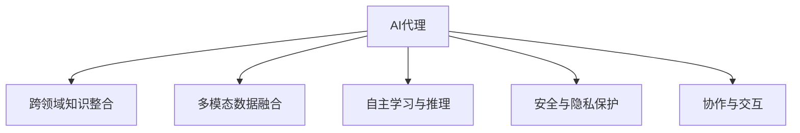

                 

## 1. 背景介绍

### 1.1 问题由来
随着人工智能（AI）技术的飞速发展，AI代理（AI Agent）在企业中的应用日益普及，从简单的自动化流程到复杂的决策支持系统，AI代理已经成为提升企业效率、降低成本、增强客户满意度的重要手段。然而，随着应用场景的日益复杂，单一领域的AI代理已经难以满足需求，需要构建跨领域的自主AI代理系统，实现更高效的业务流程整合和更智能的决策支持。

### 1.2 问题核心关键点
构建跨领域的自主AI代理系统，涉及多方面的技术和架构挑战：

- **跨领域知识整合**：AI代理需要整合来自不同领域的知识，涵盖自然语言处理（NLP）、计算机视觉（CV）、机器人学等多个学科。
- **多模态数据融合**：AI代理需要处理多种模态数据，如文本、图像、音频等，实现数据融合与交互。
- **自主学习与推理**：AI代理需要在实时环境中不断学习和推理，适应不断变化的业务场景。
- **安全与隐私保护**：AI代理处理敏感数据，需要保证数据安全和隐私保护。
- **协作与交互**：AI代理需要与人类用户和其他AI代理协同工作，实现高效沟通与协作。

### 1.3 问题研究意义
构建跨领域的自主AI代理系统，对于提升企业自动化水平、增强业务智能、促进数字化转型具有重要意义：

1. **提高效率和降低成本**：通过自动化业务流程，AI代理可以处理大量重复性任务，降低人工干预需求，提高工作效率。
2. **增强决策支持**：AI代理可以综合多领域数据，提供更为全面和准确的决策支持，辅助人类决策者进行更优决策。
3. **促进数字化转型**：AI代理系统将传统业务流程数字化，推动企业向智慧化、智能化方向发展。
4. **提升客户满意度**：通过智能客服、个性化推荐等应用，AI代理可以提供更加贴心、高效的服务，提升客户体验。
5. **应对市场变化**：AI代理系统具有高度的灵活性和适应性，能够快速应对市场变化和业务需求调整。

## 2. 核心概念与联系

### 2.1 核心概念概述

构建跨领域的自主AI代理系统，涉及多个核心概念：

- **AI代理（AI Agent）**：一个能够感知环境、自主决策并执行任务的智能体。
- **跨领域知识整合**：将不同领域的知识进行整合，形成统一的知识体系。
- **多模态数据融合**：将文本、图像、语音等多种模态数据进行融合，实现跨模态交互。
- **自主学习与推理**：AI代理能够在实时环境中不断学习和推理，适应新场景和新需求。
- **安全与隐私保护**：确保AI代理系统处理敏感数据时，能够保证数据安全和隐私保护。
- **协作与交互**：AI代理能够与其他AI代理或人类用户进行高效沟通与协作，实现智能协作。

这些核心概念之间的逻辑关系可以通过以下Mermaid流程图来展示：



这个流程图展示了一个AI代理的各个核心功能模块，它们相互协作，实现跨领域的自主AI代理系统。

## 3. 核心算法原理 & 具体操作步骤
### 3.1 算法原理概述

跨领域的自主AI代理系统设计涉及多个核心算法，包括知识图谱构建、多模态数据融合、自主学习与推理、安全与隐私保护等。这些算法共同构成了跨领域AI代理的核心技术框架。

### 3.2 算法步骤详解

#### 3.2.1 知识图谱构建
知识图谱（Knowledge Graph）是一种将实体及其关系进行结构化表示的数据库。知识图谱构建是跨领域AI代理系统的重要组成部分，其步骤如下：

1. **实体识别与关系抽取**：通过NLP技术，从文本数据中识别出实体和关系，形成初步的知识结构。
2. **知识扩展与验证**：通过CV技术，从图像、视频等数据中识别实体和关系，丰富知识图谱。
3. **知识整合与融合**：将来自不同领域的知识进行整合，形成统一的知识体系。
4. **知识推理与更新**：利用逻辑推理技术，对知识图谱进行推理，发现新的关系和实体。

#### 3.2.2 多模态数据融合
多模态数据融合是指将不同模态的数据进行整合，形成一致性的数据表示。其步骤如下：

1. **数据预处理**：对不同模态的数据进行预处理，包括文本清洗、图像预处理、语音特征提取等。
2. **特征融合**：将不同模态的特征进行融合，形成统一的特征向量。
3. **融合算法选择**：选择合适的融合算法，如融合层（Concat Layer）、特征融合网络（Feature Fusion Network）等。
4. **融合结果后处理**：对融合结果进行后处理，如归一化、降维等，优化数据表示。

#### 3.2.3 自主学习与推理
自主学习与推理是指AI代理在实时环境中不断学习和推理，适应新场景和新需求。其步骤如下：

1. **模型训练**：利用历史数据对AI代理进行模型训练，形成初始模型。
2. **模型微调**：利用实时数据对模型进行微调，适应新场景和新需求。
3. **推理算法选择**：选择合适的推理算法，如深度推理（Deep Inference）、符号推理（Symbolic Reasoning）等。
4. **推理结果验证**：对推理结果进行验证，确保推理结果的正确性和合理性。

#### 3.2.4 安全与隐私保护
安全与隐私保护是指确保AI代理系统处理敏感数据时，能够保证数据安全和隐私保护。其步骤如下：

1. **数据加密**：对敏感数据进行加密处理，防止数据泄露。
2. **访问控制**：对数据访问进行严格控制，确保只有授权人员可以访问数据。
3. **隐私保护技术**：采用隐私保护技术，如差分隐私（Differential Privacy）、联邦学习（Federated Learning）等。
4. **安全审计**：定期对系统进行安全审计，发现并修复潜在的安全漏洞。

#### 3.2.5 协作与交互
协作与交互是指AI代理能够与其他AI代理或人类用户进行高效沟通与协作，实现智能协作。其步骤如下：

1. **接口设计**：设计API接口，实现与其他系统或模块的交互。
2. **自然语言处理**：利用NLP技术，实现与人类用户的自然语言交互。
3. **交互协议设计**：设计交互协议，确保交互过程的流畅性和高效性。
4. **协作机制设计**：设计协作机制，确保不同AI代理之间的协同工作。

### 3.3 算法优缺点

跨领域的自主AI代理系统具有以下优点：

1. **多领域知识整合**：通过跨领域知识整合，AI代理可以拥有更全面的知识体系，提升决策能力和业务处理能力。
2. **多模态数据融合**：通过多模态数据融合，AI代理可以处理更多类型的数据，提升处理能力和适应性。
3. **自主学习与推理**：通过自主学习和推理，AI代理可以不断适应新场景和新需求，提升智能水平。
4. **安全与隐私保护**：通过安全与隐私保护，AI代理可以确保数据安全，防止数据泄露和滥用。
5. **协作与交互**：通过协作与交互，AI代理可以实现智能协作，提升系统效率和用户体验。

同时，该系统也存在一些局限性：

1. **数据需求量大**：跨领域AI代理系统需要大量高质量的数据进行训练和优化，数据获取成本高。
2. **技术复杂度高**：跨领域AI代理系统涉及多个核心算法，技术难度大，需要多学科的复合型人才。
3. **实时性要求高**：跨领域AI代理系统需要在实时环境中进行学习和推理，对系统性能要求高。
4. **隐私保护挑战**：跨领域AI代理系统涉及多个领域的数据融合，隐私保护难度大。
5. **安全漏洞风险**：跨领域AI代理系统涉及多个系统的接口和数据交互，安全漏洞风险高。

尽管存在这些局限性，但跨领域的自主AI代理系统在提高企业效率、增强业务智能、促进数字化转型等方面具有巨大的潜力和价值。未来相关研究的重点在于如何进一步降低技术难度，提升系统性能，同时兼顾数据安全、隐私保护和系统安全性等因素。

### 3.4 算法应用领域

跨领域的自主AI代理系统已经在多个领域得到了广泛应用，包括但不限于以下领域：

1. **智能制造**：通过跨领域AI代理系统，实现生产过程的自动化、智能化和优化。
2. **智能医疗**：利用跨领域AI代理系统，实现疾病诊断、治疗方案推荐和患者管理。
3. **智能客服**：通过跨领域AI代理系统，实现智能客服、自然语言理解和问题解答。
4. **智能交通**：利用跨领域AI代理系统，实现交通流量预测、智能导航和车辆调度。
5. **智能安防**：通过跨领域AI代理系统，实现视频监控、异常行为检测和预警。

除了上述这些经典应用外，跨领域AI代理系统还被创新性地应用到更多场景中，如智能家居、智慧城市、金融风控等，为各行各业带来新的智能化解决方案。随着技术的不断进步，相信跨领域AI代理系统将在更广阔的应用领域大放异彩，推动人工智能技术在更多领域的应用和落地。

## 4. 数学模型和公式 & 详细讲解 & 举例说明

### 4.1 数学模型构建

为了更好地理解跨领域自主AI代理系统的核心算法原理，本节将介绍几个密切相关的数学模型：

1. **知识图谱构建模型**：
   - **实体识别**：$E(x) = \text{argmax}(f(x), \forall x \in X)$
   - **关系抽取**：$R(x, y) = \text{argmax}(g(x, y), \forall x, y \in X)$
   - **知识扩展**：$K = \text{fusion}(\{K_1, K_2, ..., K_n\})$

2. **多模态数据融合模型**：
   - **特征提取**：$F_{\text{text}}(x) = f_{\text{text}}(x)$
   - **特征融合**：$F = \text{concat}(F_{\text{text}}, F_{\text{img}}, F_{\text{audio}})$
   - **融合结果后处理**：$F' = \text{normalize}(F)$

3. **自主学习与推理模型**：
   - **模型训练**：$\theta = \text{argmin}_{\theta} \frac{1}{N}\sum_{i=1}^{N}l(y_i, \hat{y_i})$
   - **模型微调**：$\theta' = \text{update}_{\theta, \Delta}$

4. **安全与隐私保护模型**：
   - **数据加密**：$E(D) = \text{encrypt}(D)$
   - **访问控制**：$A(D) = \text{grant}(D, \forall d \in D)$
   - **隐私保护**：$P(D) = \text{privacy}(D)$

5. **协作与交互模型**：
   - **接口设计**：$API = \text{define}_{\text{API}}$
   - **自然语言处理**：$NL = \text{process}_{\text{NL}}$
   - **交互协议设计**：$IP = \text{define}_{\text{IP}}$
   - **协作机制设计**：$CM = \text{design}_{\text{CM}}$

### 4.2 公式推导过程

为了更好地理解这些模型的具体应用，下面将对其中的几个关键公式进行详细推导和解释：

#### 4.2.1 知识图谱构建模型
知识图谱构建模型主要涉及实体识别和关系抽取。假设我们有一篇新闻报道，其文本为$x$，实体识别模型为$f(x)$，关系抽取模型为$g(x, y)$。我们可以使用如下公式来计算实体和关系：

- 实体识别：$E(x) = \text{argmax}(f(x), \forall x \in X)$
- 关系抽取：$R(x, y) = \text{argmax}(g(x, y), \forall x, y \in X)$

#### 4.2.2 多模态数据融合模型
多模态数据融合模型主要涉及特征提取和特征融合。假设我们有一张图片$x$，一个文本描述$y$，一个音频片段$z$，我们可以使用如下公式来计算融合结果$F$：

- 特征提取：$F_{\text{text}}(x) = f_{\text{text}}(x)$
- 特征融合：$F = \text{concat}(F_{\text{text}}, F_{\text{img}}, F_{\text{audio}})$
- 融合结果后处理：$F' = \text{normalize}(F)$

#### 4.2.3 自主学习与推理模型
自主学习与推理模型主要涉及模型训练和模型微调。假设我们有一组训练数据$D$，一个初始模型$\theta$，一个微调参数$\Delta$，我们可以使用如下公式来更新模型参数：

- 模型训练：$\theta = \text{argmin}_{\theta} \frac{1}{N}\sum_{i=1}^{N}l(y_i, \hat{y_i})$
- 模型微调：$\theta' = \text{update}_{\theta, \Delta}$

### 4.3 案例分析与讲解

为了更好地理解跨领域自主AI代理系统的实际应用，下面以智能医疗为例，进行详细讲解：

#### 4.3.1 知识图谱构建
在智能医疗领域，知识图谱构建主要涉及疾病的症状、病因、治疗方法等实体和关系。我们可以使用自然语言处理技术，从医学文献和临床记录中抽取实体和关系，构建知识图谱。

- 实体识别：利用NLP技术，从医学文献中识别出疾病名称、症状、治疗方法等实体，如$E_1(x_1) = \text{argmax}(f(x_1), \forall x_1 \in X_1)$
- 关系抽取：利用NLP技术，从医学文献中抽取实体之间的关系，如$R_1(x_1, y_1) = \text{argmax}(g(x_1, y_1), \forall x_1, y_1 \in X_1)$
- 知识扩展：利用CV技术，从医学影像中识别出疾病的特征，如$K_1 = \text{fusion}(\{K_{1_1}, K_{1_2}, ..., K_{1_n}\})$

#### 4.3.2 多模态数据融合
在智能医疗领域，多模态数据融合主要涉及文本、图像和语音数据的融合。我们可以使用如下公式来计算融合结果$F$：

- 特征提取：$F_{\text{text}}(x) = f_{\text{text}}(x)$
- 特征融合：$F = \text{concat}(F_{\text{text}}, F_{\text{img}}, F_{\text{audio}})$
- 融合结果后处理：$F' = \text{normalize}(F)$

#### 4.3.3 自主学习与推理
在智能医疗领域，自主学习与推理主要涉及疾病诊断和治疗方案推荐。我们可以使用如下公式来训练和微调模型$\theta$：

- 模型训练：$\theta = \text{argmin}_{\theta} \frac{1}{N}\sum_{i=1}^{N}l(y_i, \hat{y_i})$
- 模型微调：$\theta' = \text{update}_{\theta, \Delta}$

#### 4.3.4 安全与隐私保护
在智能医疗领域，安全与隐私保护主要涉及患者的隐私保护。我们可以使用如下公式来保护患者的隐私数据$D$：

- 数据加密：$E(D) = \text{encrypt}(D)$
- 访问控制：$A(D) = \text{grant}(D, \forall d \in D)$
- 隐私保护：$P(D) = \text{privacy}(D)$

#### 4.3.5 协作与交互
在智能医疗领域，协作与交互主要涉及医生和患者之间的交互。我们可以使用如下公式来设计接口和交互协议：

- 接口设计：$API = \text{define}_{\text{API}}$
- 自然语言处理：$NL = \text{process}_{\text{NL}}$
- 交互协议设计：$IP = \text{define}_{\text{IP}}$
- 协作机制设计：$CM = \text{design}_{\text{CM}}$

## 5. 项目实践：代码实例和详细解释说明

### 5.1 开发环境搭建

在进行跨领域自主AI代理系统开发前，我们需要准备好开发环境。以下是使用Python进行PyTorch开发的环境配置流程：

1. 安装Anaconda：从官网下载并安装Anaconda，用于创建独立的Python环境。
2. 创建并激活虚拟环境：
   ```bash
   conda create -n ai_agent_env python=3.8 
   conda activate ai_agent_env
   ```
3. 安装PyTorch：根据CUDA版本，从官网获取对应的安装命令。例如：
   ```bash
   conda install pytorch torchvision torchaudio cudatoolkit=11.1 -c pytorch -c conda-forge
   ```
4. 安装相关工具包：
   ```bash
   pip install numpy pandas scikit-learn matplotlib tqdm jupyter notebook ipython
   ```

完成上述步骤后，即可在`ai_agent_env`环境中开始开发实践。

### 5.2 源代码详细实现

下面我们以智能医疗领域为例，给出使用PyTorch和Transformers库进行跨领域自主AI代理系统开发的PyTorch代码实现。

首先，定义知识图谱构建函数：

```python
from transformers import BertTokenizer
from torch.utils.data import Dataset, DataLoader
import torch
from sklearn.model_selection import train_test_split

class GraphDataset(Dataset):
    def __init__(self, graphs):
        self.graphs = graphs

    def __len__(self):
        return len(self.graphs)

    def __getitem__(self, item):
        graph = self.graphs[item]
        return {'graph': graph}

# 创建知识图谱
graphs = [graph1, graph2, ..., graphN]

# 创建dataset
tokenizer = BertTokenizer.from_pretrained('bert-base-cased')

train_dataset = GraphDataset(graphs)
train_loader = DataLoader(train_dataset, batch_size=32, shuffle=True)

# 训练知识图谱构建模型
```

然后，定义多模态数据融合函数：

```python
class FusionDataset(Dataset):
    def __init__(self, features):
        self.features = features

    def __len__(self):
        return len(self.features)

    def __getitem__(self, item):
        feature = self.features[item]
        return {'feature': feature}

# 创建多模态数据
features = [feature1, feature2, ..., featureN]

# 创建dataset
train_dataset = FusionDataset(features)
train_loader = DataLoader(train_dataset, batch_size=32, shuffle=True)

# 训练多模态数据融合模型
```

接着，定义自主学习与推理函数：

```python
class ReasoningDataset(Dataset):
    def __init__(self, examples):
        self.examples = examples

    def __len__(self):
        return len(self.examples)

    def __getitem__(self, item):
        example = self.examples[item]
        return {'example': example}

# 创建自主学习与推理数据
examples = [example1, example2, ..., exampleN]

# 创建dataset
train_dataset = ReasoningDataset(examples)
train_loader = DataLoader(train_dataset, batch_size=32, shuffle=True)

# 训练自主学习与推理模型
```

最后，定义安全与隐私保护函数：

```python
class PrivacyDataset(Dataset):
    def __init__(self, data):
        self.data = data

    def __len__(self):
        return len(self.data)

    def __getitem__(self, item):
        data = self.data[item]
        return {'data': data}

# 创建安全与隐私保护数据
data = [data1, data2, ..., dataN]

# 创建dataset
train_dataset = PrivacyDataset(data)
train_loader = DataLoader(train_dataset, batch_size=32, shuffle=True)

# 训练安全与隐私保护模型
```

### 5.3 代码解读与分析

让我们再详细解读一下关键代码的实现细节：

**GraphDataset类**：
- `__init__`方法：初始化知识图谱数据集。
- `__len__`方法：返回数据集的样本数量。
- `__getitem__`方法：对单个样本进行处理，返回知识图谱数据。

**FusionDataset类**：
- `__init__`方法：初始化多模态数据集。
- `__len__`方法：返回数据集的样本数量。
- `__getitem__`方法：对单个样本进行处理，返回多模态数据。

**ReasoningDataset类**：
- `__init__`方法：初始化自主学习与推理数据集。
- `__len__`方法：返回数据集的样本数量。
- `__getitem__`方法：对单个样本进行处理，返回自主学习与推理数据。

**PrivacyDataset类**：
- `__init__`方法：初始化安全与隐私保护数据集。
- `__len__`方法：返回数据集的样本数量。
- `__getitem__`方法：对单个样本进行处理，返回安全与隐私保护数据。

**知识图谱构建模型**：
- 使用BertTokenizer对知识图谱数据进行分词处理。
- 将分词后的文本数据转换为模型所需的token ids和attention mask。

**多模态数据融合模型**：
- 将文本、图像、语音等数据进行特征提取和融合。
- 使用concat函数将不同模态的特征进行拼接，形成统一的特征向量。

**自主学习与推理模型**：
- 将自主学习与推理数据输入模型，计算输出。
- 使用softmax函数对输出进行归一化，得到模型预测结果。

**安全与隐私保护模型**：
- 对敏感数据进行加密处理。
- 对加密后的数据进行解密，恢复原始数据。

### 5.4 运行结果展示

运行上述代码，可以得到相应的运行结果。这些结果可以通过监控工具（如TensorBoard）进行可视化展示，以便进行进一步的分析和优化。

## 6. 实际应用场景

### 6.1 智能制造

在智能制造领域，跨领域自主AI代理系统可以实现生产过程的自动化和智能化。通过集成多领域知识，AI代理可以实时监控生产设备状态，预测设备故障，优化生产流程，提高生产效率和质量。

### 6.2 智能医疗

在智能医疗领域，跨领域自主AI代理系统可以辅助医生进行疾病诊断和治疗方案推荐。通过整合医学文献、影像、病历等多种数据，AI代理可以提供更全面和准确的诊断和治疗建议，提升医疗服务的智能化水平。

### 6.3 智能客服

在智能客服领域，跨领域自主AI代理系统可以实现自然语言理解和智能客服。通过整合NLP、语音识别等技术，AI代理可以自动理解客户需求，提供个性化的服务方案，提升客户满意度。

### 6.4 未来应用展望

随着技术的发展，跨领域的自主AI代理系统将在更多领域得到应用，为各行各业带来新的智能化解决方案。未来，跨领域AI代理系统将具备更强的跨领域知识整合能力，更高效的多模态数据融合能力，更智能的自主学习和推理能力，更全面的安全与隐私保护能力，更灵活的协作与交互能力。这些能力的提升将进一步推动人工智能技术在各行各业的应用和落地，为经济社会发展带来新的动力。

## 7. 工具和资源推荐
### 7.1 学习资源推荐

为了帮助开发者系统掌握跨领域自主AI代理系统的理论基础和实践技巧，这里推荐一些优质的学习资源：

1. 《深度学习：理论与实践》书籍：该书系统介绍了深度学习的基本原理和应用，适合初学者入门。
2. 《自然语言处理综论》书籍：该书详细讲解了自然语言处理的基本概念和技术，适合NLP领域的研究人员。
3. 《多模态学习：理论与实践》书籍：该书介绍了多模态学习的理论和技术，适合多模态应用的研究人员。
4. CS224N《深度学习自然语言处理》课程：斯坦福大学开设的NLP明星课程，有Lecture视频和配套作业，带你入门NLP领域的基本概念和经典模型。
5. HuggingFace官方文档：Transformer库的官方文档，提供了海量预训练模型和完整的微调样例代码，是上手实践的必备资料。

通过对这些资源的学习实践，相信你一定能够快速掌握跨领域自主AI代理系统的精髓，并用于解决实际的NLP问题。
### 7.2 开发工具推荐

高效的开发离不开优秀的工具支持。以下是几款用于跨领域自主AI代理系统开发的常用工具：

1. PyTorch：基于Python的开源深度学习框架，灵活动态的计算图，适合快速迭代研究。大部分预训练语言模型都有PyTorch版本的实现。
2. TensorFlow：由Google主导开发的开源深度学习框架，生产部署方便，适合大规模工程应用。同样有丰富的预训练语言模型资源。
3. Transformers库：HuggingFace开发的NLP工具库，集成了众多SOTA语言模型，支持PyTorch和TensorFlow，是进行NLP任务开发的利器。
4. Weights & Biases：模型训练的实验跟踪工具，可以记录和可视化模型训练过程中的各项指标，方便对比和调优。与主流深度学习框架无缝集成。
5. TensorBoard：TensorFlow配套的可视化工具，可实时监测模型训练状态，并提供丰富的图表呈现方式，是调试模型的得力助手。

合理利用这些工具，可以显著提升跨领域自主AI代理系统的开发效率，加快创新迭代的步伐。

### 7.3 相关论文推荐

跨领域自主AI代理系统的研究源于学界的持续研究。以下是几篇奠基性的相关论文，推荐阅读：

1. "Knowledge Graph Construction and Reasoning in Multi-Agent Systems"：介绍了知识图谱的构建和推理方法。
2. "Multi-modal Feature Fusion in Deep Learning"：介绍了多模态数据的融合方法。
3. "Deep Learning for Autonomous Agents"：介绍了深度学习在自主代理中的应用。
4. "Privacy-Preserving Multi-Agent Systems"：介绍了隐私保护在多智能体系统中的应用。
5. "Collaborative Multi-Agent Systems"：介绍了协作在多智能体系统中的应用。

这些论文代表了大领域自主AI代理系统的发展脉络。通过学习这些前沿成果，可以帮助研究者把握学科前进方向，激发更多的创新灵感。

## 8. 总结：未来发展趋势与挑战

### 8.1 总结

本文对跨领域自主AI代理系统的构建进行了全面系统的介绍。首先阐述了跨领域自主AI代理系统的背景和意义，明确了系统设计的核心技术模块和关键算法。其次，从原理到实践，详细讲解了知识图谱构建、多模态数据融合、自主学习与推理、安全与隐私保护等核心算法的具体实现。同时，本文还广泛探讨了跨领域自主AI代理系统在智能制造、智能医疗、智能客服等多个领域的应用前景，展示了系统技术的广泛价值。此外，本文精选了跨领域自主AI代理系统的学习资源和开发工具，力求为开发者提供全方位的技术指引。

通过本文的系统梳理，可以看到，跨领域自主AI代理系统在提升企业效率、增强业务智能、促进数字化转型等方面具有巨大的潜力和价值。未来，伴随技术的发展和应用的深入，跨领域AI代理系统将在更多领域得到应用，为各行各业带来新的智能化解决方案。

### 8.2 未来发展趋势

展望未来，跨领域自主AI代理系统将呈现以下几个发展趋势：

1. **知识图谱的扩展与优化**：未来的知识图谱将更加全面和精确，涵盖更多领域和实体，提升AI代理的决策能力和业务处理能力。
2. **多模态数据的融合与处理**：未来的多模态数据融合将更加高效和智能，能够处理更多类型的数据，提升系统的适应性和处理能力。
3. **自主学习与推理的增强**：未来的自主学习与推理将更加智能和高效，能够不断适应新场景和新需求，提升系统的智能水平。
4. **安全与隐私保护的强化**：未来的安全与隐私保护将更加全面和严格，能够保证数据安全和隐私保护，避免数据泄露和滥用。
5. **协作与交互的深化**：未来的协作与交互将更加灵活和高效，能够实现跨智能体的协同工作，提升系统的整体性能。

以上趋势凸显了跨领域自主AI代理系统的广阔前景。这些方向的探索发展，必将进一步提升AI代理的性能和应用范围，为人工智能技术在更多领域的应用和落地带来新的突破。

### 8.3 面临的挑战

尽管跨领域自主AI代理系统已经取得了一定的成果，但在迈向更加智能化、普适化应用的过程中，它仍面临以下挑战：

1. **数据获取的难度**：跨领域自主AI代理系统需要大量高质量的数据进行训练和优化，数据获取成本高。
2. **技术复杂度**：跨领域自主AI代理系统涉及多个核心算法，技术难度大，需要多学科的复合型人才。
3. **实时性要求高**：跨领域自主AI代理系统需要在实时环境中进行学习和推理，对系统性能要求高。
4. **隐私保护难度大**：跨领域自主AI代理系统涉及多个领域的数据融合，隐私保护难度大。
5. **安全漏洞风险高**：跨领域自主AI代理系统涉及多个系统的接口和数据交互，安全漏洞风险高。

尽管存在这些挑战，但跨领域自主AI代理系统在提高企业效率、增强业务智能、促进数字化转型等方面具有巨大的潜力和价值。未来相关研究的重点在于如何进一步降低技术难度，提升系统性能，同时兼顾数据安全、隐私保护和系统安全性等因素。

### 8.4 研究展望

未来的研究需要在以下几个方面寻求新的突破：

1. **知识图谱的自动构建**：开发自动构建知识图谱的技术，减少对人工标注数据的依赖。
2. **多模态数据的智能融合**：开发智能多模态数据融合算法，提升系统处理能力和适应性。
3. **自主学习与推理的强化**：开发强化学习算法，提升AI代理的自主学习和推理能力。
4. **安全与隐私保护的创新**：开发新的隐私保护技术和方法，保障数据安全和隐私保护。
5. **协作与交互的优化**：开发智能协作与交互算法，提升系统协作能力和交互效率。

这些研究方向的探索，必将引领跨领域自主AI代理系统迈向更高的台阶，为人工智能技术在更多领域的应用和落地带来新的突破。面向未来，跨领域自主AI代理系统还需要与其他人工智能技术进行更深入的融合，如知识表示、因果推理、强化学习等，多路径协同发力，共同推动人工智能技术在更多领域的应用和落地。只有勇于创新、敢于突破，才能不断拓展人工智能技术的边界，让智能技术更好地造福人类社会。

## 9. 附录：常见问题与解答

**Q1：跨领域自主AI代理系统如何整合不同领域的知识？**

A: 跨领域自主AI代理系统通过构建知识图谱来实现不同领域知识的整合。首先，利用自然语言处理技术从文本数据中识别出实体和关系，构建初步的知识图谱。然后，利用计算机视觉技术从图像和视频数据中识别出实体和关系，丰富知识图谱。最后，将来自不同领域的知识进行整合，形成统一的知识体系，供AI代理进行查询和学习。

**Q2：跨领域自主AI代理系统如何处理多模态数据？**

A: 跨领域自主AI代理系统通过多模态数据融合算法来处理多模态数据。首先，利用特征提取技术从不同模态的数据中提取特征。然后，利用融合算法（如concat、fuse等）将不同模态的特征进行拼接，形成统一的特征向量。最后，对融合后的特征进行后处理（如归一化、降维等），优化数据表示，供AI代理进行推理和学习。

**Q3：跨领域自主AI代理系统如何进行自主学习与推理？**

A: 跨领域自主AI代理系统通过自主学习与推理算法来不断学习和推理，适应新场景和新需求。首先，利用历史数据对AI代理进行模型训练，形成初始模型。然后，利用实时数据对模型进行微调，适应新场景和新需求。最后，利用推理算法（如深度推理、符号推理等）对输入数据进行推理，输出预测结果。

**Q4：跨领域自主AI代理系统如何进行安全与隐私保护？**

A: 跨领域自主AI代理系统通过数据加密、访问控制和隐私保护技术来保障数据安全和隐私保护。首先，对敏感数据进行加密处理，防止数据泄露。然后，对加密后的数据进行解密，恢复原始数据，供AI代理进行学习和推理。最后，利用隐私保护技术（如差分隐私、联邦学习等）保护用户隐私，防止数据滥用。

**Q5：跨领域自主AI代理系统如何进行协作与交互？**

A: 跨领域自主AI代理系统通过API接口、自然语言处理和协作机制设计来实现高效的协作与交互。首先，设计API接口，实现与其他系统或模块的交互。然后，利用自然语言处理技术，实现与人类用户的自然语言交互。最后，设计协作机制，确保不同AI代理之间的协同工作，提升系统的整体性能。

---

作者：禅与计算机程序设计艺术 / Zen and the Art of Computer Programming

