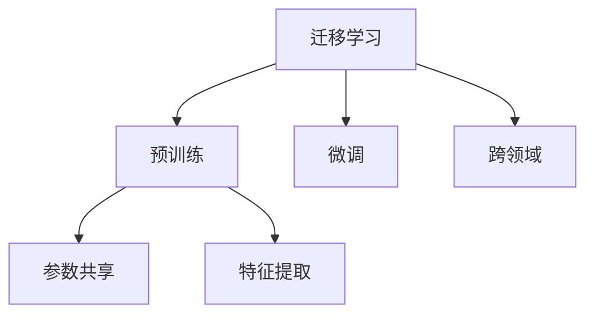

                 

# AI人工智能核心算法原理与代码实例讲解：迁移学习

> 关键词：迁移学习,预训练,微调,参数共享,特征提取,跨领域,强化学习

## 1. 背景介绍

### 1.1 问题由来

随着人工智能技术的不断进步，特别是深度学习技术在图像、语音、自然语言处理等领域取得的巨大成功，迁移学习(Meta-Learning)逐渐成为人工智能领域的重要研究课题。迁移学习旨在利用已有知识来加速新任务的学习，从而减少从头训练所需的时间和数据成本，提高模型性能。

在计算机视觉领域，迁移学习通过迁移学习预训练模型（如VGG、ResNet、Inception等），可以在新的图像识别、目标检测、图像分割等任务上快速取得良好效果。在自然语言处理领域，迁移学习也得到了广泛应用，例如使用BERT、GPT等预训练语言模型进行微调，在命名实体识别、情感分析、问答系统等任务上表现优异。

本文将全面介绍迁移学习的基本原理、核心算法、具体操作步骤，并给出详细的代码实例，帮助读者深入理解该技术的核心内容。

## 2. 核心概念与联系

### 2.1 核心概念概述

为了更好地理解迁移学习，首先需要了解几个关键概念：

- **迁移学习**（Transfer Learning）：利用已有知识加速新任务学习的过程。通过在源任务（Source Task）上预训练模型，然后将这些知识迁移到目标任务（Target Task）上，加速模型的收敛，减少在新任务上的训练时间和数据成本。

- **预训练**（Pre-training）：在大规模无标签数据上训练模型的过程，目的是学习通用的特征表示。预训练模型通常在大规模数据集上执行，如ImageNet、COCO等。

- **微调**（Fine-tuning）：在预训练模型的基础上，使用目标任务的数据集进行微调，调整模型参数以适应新任务。微调通常使用目标任务的少量标注数据进行。

- **参数共享**（Parameter Sharing）：在迁移学习中，预训练模型中的一部分参数可以被直接应用于目标任务，从而降低微调时的计算和存储开销。

- **特征提取**（Feature Extraction）：预训练模型通常能够提取数据的通用特征，通过特征提取，目标任务可以利用这些特征进行学习，从而提升模型的泛化能力。

- **跨领域**（Cross-domain）：迁移学习不仅限于同一领域的数据，不同领域之间的数据迁移学习也具有重要意义，如图像、文本、语音等不同模态的数据迁移学习。

这些概念之间存在着紧密的联系，共同构成了迁移学习的核心框架。

### 2.2 核心概念原理和架构的 Mermaid 流程图



这个流程图展示了迁移学习的基本流程：预训练模型在A处通过B过程获得通用的特征表示，然后在C处进行微调以适应新任务，过程中通过参数共享和特征提取来优化性能，同时支持跨领域的数据迁移。

## 3. 核心算法原理 & 具体操作步骤

### 3.1 算法原理概述

迁移学习的核心思想是将已有知识迁移到新任务中，从而加速学习过程。其原理可以简单概括为以下几个步骤：

1. **预训练**：在大量无标签数据上训练模型，学习通用的特征表示。
2. **微调**：在目标任务的少量标注数据上，调整模型参数以适应新任务。
3. **参数共享**：将预训练模型中的一部分参数保留，以降低微调时的计算和存储开销。
4. **特征提取**：利用预训练模型提取数据的通用特征，从而提升模型的泛化能力。
5. **跨领域迁移**：不同领域之间的数据迁移学习，增强模型在不同模态数据上的适应能力。

### 3.2 算法步骤详解

#### 3.2.1 数据准备

数据准备是迁移学习的重要环节，包括以下步骤：

- **收集数据**：选择与目标任务相关的数据集，如ImageNet用于图像识别任务，维基百科用于文本分类任务。
- **数据预处理**：对数据进行归一化、缩放、增强等预处理，以提高模型性能。
- **数据划分**：将数据集划分为训练集、验证集和测试集，用于模型的训练、调参和评估。

#### 3.2.2 模型选择

模型选择是迁移学习的关键步骤，包括以下几种选择：

- **预训练模型**：选择适合目标任务的预训练模型，如VGG、ResNet、Inception等。
- **微调模型**：选择适合目标任务的微调模型，如BERT、GPT等。
- **特征提取模型**：选择适合目标任务的特征提取模型，如AlexNet、ResNet等。

#### 3.2.3 预训练过程

预训练过程是迁移学习的核心，包括以下步骤：

- **模型初始化**：使用随机权重初始化模型。
- **前向传播**：将数据输入模型，计算模型输出。
- **损失计算**：计算模型输出与真实标签之间的损失函数。
- **反向传播**：通过反向传播计算梯度，更新模型参数。
- **重复迭代**：重复执行前向传播和反向传播，直到模型收敛或达到预设轮数。

#### 3.2.4 微调过程

微调过程是在预训练模型的基础上，调整模型参数以适应新任务，包括以下步骤：

- **模型初始化**：将预训练模型作为初始化参数。
- **添加任务适配层**：在预训练模型的顶层添加任务适配层，如全连接层、分类器等。
- **设置学习率**：选择适合目标任务的微调学习率，一般比预训练学习率小。
- **前向传播**：将数据输入模型，计算模型输出。
- **损失计算**：计算模型输出与真实标签之间的损失函数。
- **反向传播**：通过反向传播计算梯度，更新模型参数。
- **重复迭代**：重复执行前向传播和反向传播，直到模型收敛或达到预设轮数。

#### 3.2.5 参数共享和特征提取

参数共享和特征提取是迁移学习的重要优化策略，包括以下步骤：

- **参数共享**：将预训练模型中的一部分参数保留，以降低微调时的计算和存储开销。
- **特征提取**：利用预训练模型提取数据的通用特征，从而提升模型的泛化能力。

#### 3.2.6 跨领域迁移

跨领域迁移是迁移学习的重要应用场景，包括以下步骤：

- **选择领域**：选择与目标任务相关的领域数据集。
- **预训练**：在领域数据集上预训练模型，学习领域特定知识。
- **微调**：在目标任务数据集上微调模型，迁移领域特定知识。

### 3.3 算法优缺点

#### 3.3.1 优点

- **减少数据和计算成本**：通过预训练模型迁移知识，可以减少在新任务上的数据和计算成本，加速模型收敛。
- **提高泛化能力**：预训练模型通常具备较强的泛化能力，能够在新任务上取得更好的性能。
- **跨领域迁移**：迁移学习不仅限于同一领域的数据，不同领域之间的数据迁移学习也具有重要意义，如图像、文本、语音等不同模态的数据迁移学习。

#### 3.3.2 缺点

- **数据依赖**：预训练模型的性能依赖于大规模无标签数据，数据获取和预训练过程复杂且成本高。
- **迁移质量**：预训练模型学到的知识可能与目标任务不完全相关，迁移效果有限。
- **参数更新**：微调过程可能需要更新大量参数，计算和存储开销较大。

### 3.4 算法应用领域

迁移学习在多个领域得到广泛应用，以下是一些主要应用领域：

- **计算机视觉**：利用预训练的图像分类器进行目标检测、图像分割等任务。
- **自然语言处理**：利用预训练的语言模型进行文本分类、命名实体识别、情感分析等任务。
- **语音识别**：利用预训练的语音识别模型进行语音情感识别、语音命令识别等任务。
- **机器人控制**：利用预训练的机器人控制模型进行路径规划、运动控制等任务。
- **推荐系统**：利用预训练的推荐模型进行用户画像、商品推荐等任务。

这些应用领域展示了迁移学习在不同领域中的强大适应性和应用潜力。

## 4. 数学模型和公式 & 详细讲解 & 举例说明

### 4.1 数学模型构建

迁移学习的数学模型可以形式化表示为：

$$
\theta^* = \mathop{\arg\min}_{\theta} \mathcal{L}(\theta, S, T)
$$

其中，$\theta$ 表示模型参数，$S$ 表示源任务的数据集，$T$ 表示目标任务的数据集，$\mathcal{L}$ 表示损失函数。

### 4.2 公式推导过程

以图像识别任务为例，迁移学习的公式推导过程如下：

1. **预训练损失函数**：

$$
\mathcal{L}_{\text{pretrain}} = \frac{1}{N} \sum_{i=1}^N \ell(y_i, f_{\theta}(x_i))
$$

其中，$y_i$ 表示图像的真实标签，$f_{\theta}(x_i)$ 表示模型对图像的预测结果。

2. **微调损失函数**：

$$
\mathcal{L}_{\text{fine-tune}} = \frac{1}{M} \sum_{i=1}^M \ell(y_i, f_{\theta}(x_i))
$$

其中，$y_i$ 表示目标任务的图像的真实标签，$f_{\theta}(x_i)$ 表示微调后的模型对图像的预测结果。

3. **迁移学习损失函数**：

$$
\mathcal{L}_{\text{transfer}} = \lambda \mathcal{L}_{\text{pretrain}} + (1-\lambda) \mathcal{L}_{\text{fine-tune}}
$$

其中，$\lambda$ 表示预训练和微调的权重系数，用于平衡两者的贡献。

### 4.3 案例分析与讲解

以图像分类任务为例，展示迁移学习的应用过程：

1. **预训练过程**：

   - **数据准备**：收集ImageNet数据集。
   - **模型选择**：选择ResNet模型。
   - **预训练过程**：在ImageNet数据集上进行预训练，学习通用的图像特征表示。

2. **微调过程**：

   - **数据准备**：收集目标任务的图像数据集。
   - **模型选择**：选择ResNet模型。
   - **微调过程**：在目标任务数据集上微调ResNet模型，学习目标任务的特定知识。

3. **结果评估**：

   - **验证集评估**：在验证集上评估微调后的模型性能。
   - **测试集评估**：在测试集上评估微调后的模型性能。

通过以上过程，迁移学习可以显著提高模型的泛化能力和性能。

## 5. 项目实践：代码实例和详细解释说明

### 5.1 开发环境搭建

#### 5.1.1 环境安装

1. **Python环境**：安装Python 3.7或以上版本。

2. **深度学习框架**：安装TensorFlow 2.0或PyTorch。

3. **迁移学习库**：安装TensorFlow Hub、PyTorch Hub等迁移学习库。

4. **数据处理库**：安装Pandas、NumPy等数据处理库。

### 5.2 源代码详细实现

以下是一个使用TensorFlow进行迁移学习的代码示例，展示了如何在ImageNet预训练模型上微调用于CIFAR-10数据集的任务：

```python
import tensorflow as tf
from tensorflow.keras import layers, models
from tensorflow_hub import HubModule

# 加载预训练模型
hub_module = HubModule("https://tfhub.dev/google/imagenet/inception_v3/classification/3")
pretrained_model = hub_module.model

# 添加任务适配层
x = layers.Input(shape=(299, 299, 3))
x = layers.Conv2D(1024, (3, 3), activation='relu', padding='same')(x)
x = layers.BatchNormalization()(x)
x = layers.MaxPooling2D((3, 3), strides=2, padding='same')(x)
x = layers.Flatten()(x)
x = layers.Dense(1024, activation='relu')(x)
x = layers.BatchNormalization()(x)
x = layers.Dropout(0.4)(x)
logits = layers.Dense(10, activation='softmax')(x)
model = models.Model(x, logits)

# 微调模型
model.compile(optimizer=tf.keras.optimizers.Adam(learning_rate=0.001),
              loss=tf.keras.losses.SparseCategoricalCrossentropy(from_logits=True),
              metrics=['accuracy'])

# 加载数据集
(train_images, train_labels), (test_images, test_labels) = tf.keras.datasets.cifar10.load_data()
train_images = train_images.reshape(-1, 299, 299, 3)
train_images = tf.keras.applications.imagenet_utils.preprocess_input(train_images)
test_images = test_images.reshape(-1, 299, 299, 3)
test_images = tf.keras.applications.imagenet_utils.preprocess_input(test_images)

# 微调过程
model.fit(train_images, train_labels, epochs=5, validation_data=(test_images, test_labels))

# 评估模型
test_loss, test_acc = model.evaluate(test_images, test_labels)
print("Test accuracy:", test_acc)
```

### 5.3 代码解读与分析

1. **加载预训练模型**：使用TensorFlow Hub加载ImageNet预训练的Inception V3模型。

2. **添加任务适配层**：在预训练模型的基础上添加新的任务适配层，包括卷积层、池化层、全连接层等。

3. **微调模型**：在微调过程中，使用Adam优化器进行参数更新，并设置合适的学习率。

4. **加载数据集**：使用CIFAR-10数据集进行微调，并对数据进行预处理。

5. **微调过程**：使用fit函数进行微调，并在验证集上评估模型性能。

6. **评估模型**：在测试集上评估模型性能，并输出结果。

## 6. 实际应用场景

### 6.1 计算机视觉

迁移学习在计算机视觉领域有广泛应用，如目标检测、图像分类、图像分割等任务。例如，利用预训练的ResNet模型进行COCO数据集上的目标检测任务。

### 6.2 自然语言处理

迁移学习在自然语言处理领域也有重要应用，如文本分类、命名实体识别、情感分析等任务。例如，利用预训练的BERT模型进行新闻情感分析任务。

### 6.3 语音识别

迁移学习在语音识别领域也有应用，如语音情感识别、语音命令识别等任务。例如，利用预训练的语音识别模型进行语音情感识别。

### 6.4 未来应用展望

随着迁移学习技术的发展，未来的应用场景将更加广泛，以下是一些未来应用展望：

1. **跨模态迁移学习**：将图像、文本、语音等多种模态的数据进行迁移学习，提高模型的泛化能力。
2. **自适应迁移学习**：根据不同数据集的特点，动态调整迁移学习策略，提高模型的适应性。
3. **联邦迁移学习**：在分布式环境下进行迁移学习，保护数据隐私的同时，提高模型性能。
4. **强化学习迁移**：将迁移学习与强化学习结合，提高模型的自主学习和优化能力。

## 7. 工具和资源推荐

### 7.1 学习资源推荐

1. **书籍**：《深度学习》（Ian Goodfellow, Yoshua Bengio, Aaron Courville）、《迁移学习》（Zicheng Liu）。

2. **在线课程**：Coursera上的Deep Learning Specialization、Udacity上的Machine Learning Engineer Nanodegree。

3. **博客和论文**：Arxiv、Google Research Blog、Deep Learning & Computer Vision。

### 7.2 开发工具推荐

1. **深度学习框架**：TensorFlow、PyTorch。

2. **迁移学习库**：TensorFlow Hub、PyTorch Hub、MXNet Gluon。

3. **数据处理库**：Pandas、NumPy、TensorFlow Data Validation。

### 7.3 相关论文推荐

1. **迁移学习**：
   - Finetuning a convolutional neural network for supervised learning（2014年）。
   - Learning transferable features with deep neural networks（2014年）。

2. **预训练模型**：
   - ImageNet Classification with Deep Convolutional Neural Networks（2012年）。
   - Attention is All you Need（2017年）。

3. **微调**：
   - Fine-tune a language model for sequence labeling tasks（2019年）。
   - Sparse Fine-Tuning with Hierarchical attention Networks（2018年）。

## 8. 总结：未来发展趋势与挑战

### 8.1 总结

迁移学习作为一种高效、灵活的学习方法，已经在多个领域得到了广泛应用。通过预训练模型迁移知识，可以显著减少新任务的训练时间和数据成本，提升模型的性能。本文从原理到实践，详细介绍了迁移学习的核心算法和操作步骤，并通过代码示例展示了其实际应用过程。

通过本文的系统梳理，可以看到，迁移学习正成为人工智能领域的重要研究范式，不仅能够加速新任务的学习，还能提高模型的泛化能力和性能。未来，随着技术的不断进步，迁移学习的应用场景将更加广泛，为各行各业带来更多的创新和突破。

### 8.2 未来发展趋势

1. **大规模预训练模型**：随着算力的提升和数据量的增加，预训练模型的参数量将不断增大，迁移学习的表现也将更加出色。

2. **跨领域迁移学习**：不同领域之间的迁移学习将越来越重要，如图像、文本、语音等多模态数据的迁移学习。

3. **自适应迁移学习**：根据不同数据集的特点，动态调整迁移学习策略，提高模型的适应性和泛化能力。

4. **联邦迁移学习**：在分布式环境下进行迁移学习，保护数据隐私的同时，提高模型性能。

5. **强化学习迁移**：将迁移学习与强化学习结合，提高模型的自主学习和优化能力。

### 8.3 面临的挑战

尽管迁移学习在多个领域取得了显著成果，但仍面临以下挑战：

1. **数据依赖**：预训练模型的性能依赖于大规模无标签数据，数据获取和预训练过程复杂且成本高。

2. **迁移质量**：预训练模型学到的知识可能与目标任务不完全相关，迁移效果有限。

3. **参数更新**：微调过程可能需要更新大量参数，计算和存储开销较大。

4. **泛化能力**：预训练模型的泛化能力可能受到数据分布差异的影响，迁移效果不稳定。

### 8.4 研究展望

未来的研究可以从以下几个方向进行：

1. **无监督迁移学习**：利用自监督学习、半监督学习等无监督学习范式，减少对标注数据的依赖。

2. **参数高效迁移学习**：开发更加参数高效的迁移方法，如Adapter、LoRA等，以降低计算和存储开销。

3. **多任务迁移学习**：将迁移学习应用于多个相关任务，提高模型的通用性和性能。

4. **跨模态迁移学习**：将图像、文本、语音等多种模态的数据进行迁移学习，提高模型的泛化能力。

5. **自适应迁移学习**：根据不同数据集的特点，动态调整迁移学习策略，提高模型的适应性和泛化能力。

6. **联邦迁移学习**：在分布式环境下进行迁移学习，保护数据隐私的同时，提高模型性能。

通过这些研究方向，未来的迁移学习将能够更好地应对复杂多变的应用场景，为人工智能技术的广泛应用提供新的思路和工具。

## 9. 附录：常见问题与解答

### 9.1 常见问题

1. **如何选择合适的预训练模型？**

   答：选择适合目标任务的预训练模型，如ImageNet预训练的ResNet模型适用于图像识别任务，BERT预训练模型适用于自然语言处理任务。

2. **预训练和微调之间的平衡策略是什么？**

   答：预训练和微调的平衡策略可以通过设置权重系数$\lambda$来控制，通常预训练模型对目标任务的影响较大，因此$\lambda$值较大。

3. **迁移学习中常见的损失函数有哪些？**

   答：迁移学习中常见的损失函数包括交叉熵损失、均方误差损失、对数似然损失等。

4. **迁移学习中常见的优化器有哪些？**

   答：迁移学习中常见的优化器包括Adam、SGD、Adagrad等。

5. **迁移学习中常见的正则化技术有哪些？**

   答：迁移学习中常见的正则化技术包括L2正则、Dropout、Early Stopping等。

通过这些问题的回答，可以帮助读者更好地理解迁移学习的核心概念和关键技术，进一步掌握其应用方法。

