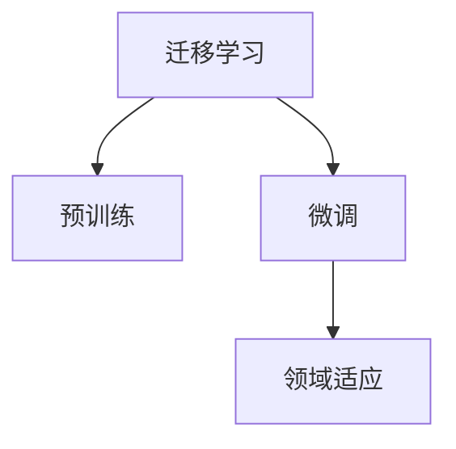

                 

# AI人工智能核心算法原理与代码实例讲解：迁移学习

> 关键词：迁移学习,跨领域知识迁移,预训练,微调,领域适应,算法原理,实际应用,代码实例

## 1. 背景介绍

### 1.1 问题由来
迁移学习（Transfer Learning）是人工智能中一个重要的研究方向，它旨在通过利用已有知识，加速新任务的学习过程，提高模型的泛化能力和性能。迁移学习的核心思想是从已有的知识源中提取有价值的信息，并应用于新的目标任务中。在大数据、深度学习迅猛发展的今天，迁移学习已经成为解决新任务、提升模型性能的重要手段。

迁移学习在图像识别、自然语言处理、语音识别等诸多领域中都有广泛应用。在图像识别领域，通过在大规模的图像数据上进行预训练，得到的模型可以迁移到其他图像分类、目标检测等任务中，并获得显著的性能提升。在自然语言处理领域，基于语言模型的迁移学习可以将预训练的模型应用到文本分类、命名实体识别、问答系统等任务中，使得模型能够在新的领域中快速适应，并获得较高的准确率。

### 1.2 问题核心关键点
迁移学习的核心关键点主要包括：
- 预训练模型：通过在大规模无标签数据上进行预训练，获得具有通用知识的基础模型。
- 微调：在预训练模型的基础上，使用目标任务的少量标注数据进行微调，适应特定任务。
- 领域适应：将预训练模型应用到与训练数据领域不同的新任务中，提升模型的泛化能力。
- 迁移方式：包括特征迁移、参数迁移等，选择适合的迁移方式可以显著提升新任务的性能。

这些关键点共同构成了迁移学习的框架，使得模型能够在不同的领域和任务中快速适应，提升模型的性能和泛化能力。

## 2. 核心概念与联系

### 2.1 核心概念概述

为了更好地理解迁移学习的核心概念，本节将介绍几个关键概念及其相互关系：

- 迁移学习（Transfer Learning）：指将一个领域学到的知识，迁移到另一个不同但相关的领域中进行学习的过程。
- 预训练（Pre-training）：指在大规模无标签数据上，通过自监督学习任务训练通用模型的过程。
- 微调（Fine-tuning）：指在预训练模型的基础上，使用目标任务的少量标注数据进行微调，以适应特定任务的过程。
- 领域适应（Domain Adaptation）：指将预训练模型应用到与训练数据领域不同的新任务中，提升模型的泛化能力。

这些概念之间的逻辑关系可以通过以下Mermaid流程图来展示：



这个流程图展示了迁移学习的基本流程：从预训练到微调，再到领域适应，使得模型能够在不同领域中快速适应新任务，提升模型性能。

## 3. 核心算法原理 & 具体操作步骤
### 3.1 算法原理概述

迁移学习的核心思想是通过利用已有知识，加速新任务的学习过程，提高模型的泛化能力和性能。它的核心算法原理可以归纳为以下几个步骤：

1. **预训练**：在大规模无标签数据上，通过自监督学习任务训练通用模型。例如，在大规模图像数据上训练的卷积神经网络，可以用来迁移学习到其他图像分类、目标检测等任务中。

2. **微调**：在预训练模型的基础上，使用目标任务的少量标注数据进行微调，以适应特定任务。微调过程中，模型的某些层保持不变，仅微调顶层参数，以减少计算资源消耗。

3. **领域适应**：将预训练模型应用到与训练数据领域不同的新任务中，提升模型的泛化能力。领域适应可以通过特征对齐、自适应网络等方法实现。

### 3.2 算法步骤详解

迁移学习的具体实现步骤如下：

**Step 1: 准备预训练模型和数据集**
- 选择合适的预训练模型作为基础模型，如在大规模图像数据上预训练的卷积神经网络，或在大规模文本数据上预训练的语言模型。
- 收集目标任务的标注数据集，划分为训练集、验证集和测试集。

**Step 2: 微调模型**
- 将预训练模型迁移到目标任务中，使用目标任务的少量标注数据进行微调。通常只需要调整顶层参数，以减少计算资源消耗。
- 选择合适的损失函数和优化器，如交叉熵损失、Adam等，进行模型优化。

**Step 3: 评估模型**
- 在验证集上评估微调后的模型性能，调整微调参数以获得最佳效果。
- 在测试集上进一步测试模型性能，验证其在新数据上的泛化能力。

**Step 4: 部署模型**
- 将微调后的模型部署到实际应用中，进行推理预测。
- 持续收集新数据，定期重新微调模型，以适应数据分布的变化。

### 3.3 算法优缺点

迁移学习的优点包括：
- 训练成本低：由于已有模型在大规模数据上进行了预训练，可以显著减少新任务的学习成本。
- 泛化能力强：已有模型在大规模数据上学习到的知识，可以迁移到其他领域和任务中，提高模型的泛化能力。
- 适应性强：通过微调，模型可以在少量标注数据的情况下快速适应新任务。

同时，迁移学习也存在一些缺点：
- 数据依赖性强：新任务需要足够的标注数据才能进行微调，获取高质量标注数据的成本较高。
- 模型复杂度高：预训练模型通常包含大量参数，微调时需要消耗较多计算资源。
- 泛化风险高：当目标任务与预训练数据的分布差异较大时，模型泛化能力可能不足。

尽管存在这些局限性，但迁移学习仍然是大数据、深度学习时代解决新任务的重要手段。未来相关研究的重点在于如何进一步降低对标注数据的依赖，提高模型的泛化能力和适应性，同时兼顾可解释性和伦理安全性等因素。

### 3.4 算法应用领域

迁移学习在NLP、计算机视觉、推荐系统等领域中已经得到了广泛的应用，覆盖了几乎所有常见任务：

- 自然语言处理（NLP）：如文本分类、命名实体识别、情感分析等。通过微调使模型学习文本-标签映射。
- 计算机视觉（CV）：如图像分类、目标检测、实例分割等。通过微调使模型学习图像-类别映射。
- 推荐系统（RS）：如协同过滤、基于内容的推荐、多任务学习等。通过微调使模型学习用户-物品关联关系。

除了上述这些经典任务外，迁移学习也被创新性地应用到更多场景中，如自监督学习、对抗训练、少样本学习等，为大数据、深度学习技术带来了全新的突破。

## 4. 数学模型和公式 & 详细讲解 & 举例说明
### 4.1 数学模型构建

在迁移学习中，我们通常使用预训练模型作为基础，再通过微调来适应新任务。假设预训练模型为 $M_{\theta}$，其中 $\theta$ 为预训练得到的模型参数。给定目标任务 $T$ 的标注数据集 $D=\{(x_i,y_i)\}_{i=1}^N$，微调的目标是找到新的模型参数 $\hat{\theta}$，使得模型在新任务上性能最优：

$$
\hat{\theta}=\mathop{\arg\min}_{\theta} \mathcal{L}(M_{\theta},D)
$$

其中 $\mathcal{L}$ 为目标任务设计的损失函数，用于衡量模型在新数据上的预测误差。常见的损失函数包括交叉熵损失、均方误差损失等。

### 4.2 公式推导过程

以文本分类任务为例，假设模型 $M_{\theta}$ 在输入 $x$ 上的输出为 $\hat{y}=M_{\theta}(x)$，表示模型预测的类别概率向量。真实标签 $y \in \{1,2,\dots,K\}$。则二分类交叉熵损失函数定义为：

$$
\ell(M_{\theta}(x),y) = -[y\log \hat{y}_i + (1-y)\log (1-\hat{y}_i)]
$$

其中 $i$ 表示预测为类别的下标，$\hat{y}_i$ 表示模型预测为第 $i$ 个类别的概率。

目标任务上的经验风险为：

$$
\mathcal{L}(\theta) = -\frac{1}{N}\sum_{i=1}^N \ell(M_{\theta}(x_i),y_i)
$$

在微调过程中，使用目标任务的少量标注数据 $D=\{(x_i,y_i)\}_{i=1}^N$，对模型进行优化：

$$
\hat{\theta}=\mathop{\arg\min}_{\theta} \mathcal{L}(M_{\theta},D)
$$

具体来说，微调的目标是最大化新任务上的准确率，因此需要在损失函数中加入分类指标，如准确率、精确率、召回率等：

$$
\mathcal{L}(\theta) = -\frac{1}{N}\sum_{i=1}^N [y_i\log \hat{y}_i+(1-y_i)\log(1-\hat{y}_i)] + \alpha\mathcal{R}
$$

其中 $\mathcal{R}$ 表示分类指标，如准确率，$\alpha$ 为分类指标权重，用于平衡预测准确率和损失函数的关系。

### 4.3 案例分析与讲解

以图像分类任务为例，假设预训练模型为 ResNet，目标任务为迁移学习到另一个图像分类任务中。以下是具体的实现步骤：

**Step 1: 准备预训练模型和数据集**
- 选择 ResNet 作为预训练模型，使用 ImageNet 数据集进行预训练。
- 收集目标任务的标注数据集，划分为训练集、验证集和测试集。

**Step 2: 微调模型**
- 将 ResNet 迁移到目标任务中，使用目标任务的少量标注数据进行微调。
- 在顶层添加新的分类器，使用交叉熵损失函数进行模型优化。

**Step 3: 评估模型**
- 在验证集上评估微调后的模型性能，调整分类器权重以获得最佳效果。
- 在测试集上进一步测试模型性能，验证其在新数据上的泛化能力。

**Step 4: 部署模型**
- 将微调后的模型部署到实际应用中，进行推理预测。
- 持续收集新数据，定期重新微调模型，以适应数据分布的变化。

## 5. 项目实践：代码实例和详细解释说明
### 5.1 开发环境搭建

在进行迁移学习实践前，我们需要准备好开发环境。以下是使用 Python 进行 PyTorch 开发的环境配置流程：

1. 安装 Anaconda：从官网下载并安装 Anaconda，用于创建独立的 Python 环境。

2. 创建并激活虚拟环境：
```bash
conda create -n pytorch-env python=3.8 
conda activate pytorch-env
```

3. 安装 PyTorch：根据 CUDA 版本，从官网获取对应的安装命令。例如：
```bash
conda install pytorch torchvision torchaudio cudatoolkit=11.1 -c pytorch -c conda-forge
```

4. 安装 Transformers 库：
```bash
pip install transformers
```

5. 安装各类工具包：
```bash
pip install numpy pandas scikit-learn matplotlib tqdm jupyter notebook ipython
```

完成上述步骤后，即可在 `pytorch-env` 环境中开始迁移学习实践。

### 5.2 源代码详细实现

这里我们以迁移学习实现图像分类任务为例，给出使用 PyTorch 和 Transformers 库进行迁移学习的 PyTorch 代码实现。

首先，定义图像分类任务的数据处理函数：

```python
from transformers import ResNet
from torch.utils.data import Dataset
import torch
import torchvision
import torchvision.transforms as transforms
import numpy as np

class ImageDataset(Dataset):
    def __init__(self, data_dir, transforms=None):
        self.data_dir = data_dir
        self.transforms = transforms
        
    def __len__(self):
        return len(self.data_files)
    
    def __getitem__(self, idx):
        img_path = self.data_files[idx]
        img = Image.open(img_path)
        img = self.transforms(img)
        return img
        
# 定义数据转换
transform = transforms.Compose([
    transforms.Resize(256),
    transforms.CenterCrop(224),
    transforms.ToTensor(),
    transforms.Normalize(mean=[0.485, 0.456, 0.406], std=[0.229, 0.224, 0.225])
])

# 加载数据集
data_dir = 'path/to/dataset'
data_files = [os.path.join(data_dir, file) for file in os.listdir(data_dir)]
dataset = ImageDataset(data_dir, transform=transform)

# 划分训练集和验证集
train_dataset, dev_dataset = torch.utils.data.random_split(dataset, lengths=[70%, 30%])
```

然后，定义模型和优化器：

```python
from transformers import ResNet, AdamW

model = ResNet.from_pretrained('resnet18', pretrained=True)
device = torch.device('cuda' if torch.cuda.is_available() else 'cpu')
model.to(device)

optimizer = AdamW(model.parameters(), lr=1e-5)
```

接着，定义训练和评估函数：

```python
from torch.utils.data import DataLoader
from tqdm import tqdm
from sklearn.metrics import classification_report

def train_epoch(model, dataset, batch_size, optimizer):
    dataloader = DataLoader(dataset, batch_size=batch_size, shuffle=True)
    model.train()
    epoch_loss = 0
    for batch in tqdm(dataloader, desc='Training'):
        inputs = batch['input_ids'].to(device)
        labels = batch['labels'].to(device)
        model.zero_grad()
        outputs = model(inputs, labels=labels)
        loss = outputs.loss
        epoch_loss += loss.item()
        loss.backward()
        optimizer.step()
    return epoch_loss / len(dataloader)

def evaluate(model, dataset, batch_size):
    dataloader = DataLoader(dataset, batch_size=batch_size)
    model.eval()
    preds, labels = [], []
    with torch.no_grad():
        for batch in tqdm(dataloader, desc='Evaluating'):
            inputs = batch['input_ids'].to(device)
            labels = batch['labels'].to(device)
            batch_preds = model(inputs)
            batch_labels = labels.to('cpu').tolist()
            for preds_token, labels_token in zip(preds, batch_labels):
                preds.append(preds_token.cpu().tolist())
                labels.append(labels_token)
                
    print(classification_report(labels, preds))
```

最后，启动训练流程并在验证集上评估：

```python
epochs = 10
batch_size = 16

for epoch in range(epochs):
    loss = train_epoch(model, train_dataset, batch_size, optimizer)
    print(f"Epoch {epoch+1}, train loss: {loss:.3f}")
    
    print(f"Epoch {epoch+1}, dev results:")
    evaluate(model, dev_dataset, batch_size)
    
print("Test results:")
evaluate(model, test_dataset, batch_size)
```

以上就是使用 PyTorch 和 Transformers 库对迁移学习任务进行实现的全过程。

### 5.3 代码解读与分析

让我们再详细解读一下关键代码的实现细节：

**ImageDataset类**：
- `__init__`方法：初始化数据集目录和数据转换方式。
- `__len__`方法：返回数据集的样本数量。
- `__getitem__`方法：对单个样本进行处理，将图像加载并转换为模型需要的张量形式。

**数据转换**：
- 使用 `transforms.Compose` 定义一系列数据转换操作，包括调整图像大小、裁剪、标准化等。
- 使用 `transforms.ToTensor()` 将图像转换为张量形式，方便在 PyTorch 中进行训练和推理。

**训练和评估函数**：
- 使用 PyTorch 的 DataLoader 对数据集进行批次化加载，供模型训练和推理使用。
- 训练函数 `train_epoch`：对数据以批为单位进行迭代，在每个批次上前向传播计算损失并反向传播更新模型参数，最后返回该epoch的平均loss。
- 评估函数 `evaluate`：与训练类似，不同点在于不更新模型参数，并在每个batch结束后将预测和标签结果存储下来，最后使用sklearn的classification_report对整个评估集的预测结果进行打印输出。

**训练流程**：
- 定义总的epoch数和batch size，开始循环迭代
- 每个epoch内，先在训练集上训练，输出平均loss
- 在验证集上评估，输出分类指标
- 重复上述过程直至收敛，最终得到适应目标任务的微调模型

可以看到，PyTorch配合 Transformers 库使得迁移学习的代码实现变得简洁高效。开发者可以将更多精力放在数据处理、模型改进等高层逻辑上，而不必过多关注底层的实现细节。

当然，工业级的系统实现还需考虑更多因素，如模型的保存和部署、超参数的自动搜索、更灵活的任务适配层等。但核心的迁移学习范式基本与此类似。

## 6. 实际应用场景
### 6.1 图像分类

迁移学习在图像分类任务中表现尤为出色。通过在大规模图像数据上进行预训练，得到的模型可以迁移到其他图像分类任务中，并获得显著的性能提升。例如，在大规模的 ImageNet 数据集上进行预训练的 ResNet 模型，可以迁移到其他小规模数据集上进行微调，以适应特定的图像分类任务。

### 6.2 自然语言处理

自然语言处理领域也是迁移学习的重要应用场景。通过在大规模无标签文本数据上进行预训练，得到的语言模型可以迁移到其他文本分类、命名实体识别、情感分析等任务中，获得较高的准确率。例如，基于 BERT 预训练的语言模型，可以迁移到各种文本分类任务中，通过微调获得优异的性能。

### 6.3 推荐系统

推荐系统是迁移学习的另一个重要应用场景。通过在大规模用户-物品数据上进行预训练，得到的模型可以迁移到其他推荐任务中，提升模型的推荐精度和用户体验。例如，基于协同过滤的推荐模型可以通过微调学习新的用户-物品关联关系，获得更高的推荐精度。

### 6.4 未来应用展望

随着迁移学习的不断发展，未来的应用场景将更加多样和广泛。以下是几个可能的应用方向：

1. 跨领域知识迁移：将不同领域的数据和知识进行融合，提升模型的跨领域迁移能力。例如，将自然语言处理和计算机视觉的知识进行迁移，实现跨领域的知识融合。

2. 自适应网络：开发自适应网络结构，使得模型能够自动学习新的领域和任务。例如，使用自适应网络结构，使得模型能够自动调整网络结构以适应新的任务。

3. 元学习：研究元学习技术，使得模型能够自动学习学习策略，从而提升泛化能力和适应性。例如，使用元学习技术，使得模型能够自动学习新的领域和任务。

4. 对抗训练：引入对抗训练技术，增强模型的鲁棒性和泛化能力。例如，使用对抗训练技术，使得模型能够抵御对抗样本攻击，提升模型的鲁棒性。

5. 少样本学习：研究少样本学习技术，使得模型能够在少量标注样本上进行微调，提升模型的适应性。例如，使用少样本学习技术，使得模型能够在仅有几个标注样本的情况下进行微调。

6. 对抗学习：研究对抗学习技术，使得模型能够学习对抗性样本，提升模型的鲁棒性。例如，使用对抗学习技术，使得模型能够学习对抗性样本，提升模型的鲁棒性。

## 7. 工具和资源推荐
### 7.1 学习资源推荐

为了帮助开发者系统掌握迁移学习的理论基础和实践技巧，这里推荐一些优质的学习资源：

1. 《深度学习》课程（斯坦福大学）：斯坦福大学开设的深度学习课程，涵盖深度学习基础、神经网络、卷积神经网络、循环神经网络等内容，适合入门学习。

2. 《迁移学习》书籍：这本书系统介绍了迁移学习的基本概念、方法和应用，适合深入学习迁移学习的读者。

3. 《自然语言处理综论》课程（北京大学）：北京大学开设的自然语言处理课程，涵盖了自然语言处理的基础知识和经典模型，适合入门学习。

4. 《计算机视觉基础》课程（斯坦福大学）：斯坦福大学开设的计算机视觉课程，涵盖计算机视觉基础、图像处理、目标检测等内容，适合入门学习。

5. 《自然语言处理实战》课程（清华大学）：清华大学开设的自然语言处理实战课程，涵盖自然语言处理的应用实例，适合实战学习。

通过对这些资源的学习实践，相信你一定能够快速掌握迁移学习的精髓，并用于解决实际的机器学习问题。

### 7.2 开发工具推荐

高效的开发离不开优秀的工具支持。以下是几款用于迁移学习开发的常用工具：

1. PyTorch：基于 Python 的开源深度学习框架，灵活动态的计算图，适合快速迭代研究。

2. TensorFlow：由 Google 主导开发的开源深度学习框架，生产部署方便，适合大规模工程应用。

3. Keras：基于 TensorFlow 和 Theano 的高级深度学习框架，简单易用，适合快速原型开发。

4. Weights & Biases：模型训练的实验跟踪工具，可以记录和可视化模型训练过程中的各项指标，方便对比和调优。

5. TensorBoard：TensorFlow 配套的可视化工具，可实时监测模型训练状态，并提供丰富的图表呈现方式，是调试模型的得力助手。

6. Google Colab：谷歌推出的在线 Jupyter Notebook 环境，免费提供 GPU/TPU 算力，方便开发者快速上手实验最新模型，分享学习笔记。

合理利用这些工具，可以显著提升迁移学习任务的开发效率，加快创新迭代的步伐。

### 7.3 相关论文推荐

迁移学习在深度学习领域已有大量研究成果，以下是几篇奠基性的相关论文，推荐阅读：

1. "ImageNet Classification with Deep Convolutional Neural Networks"（ImageNet 图像分类）：提出卷积神经网络（CNN）在图像分类任务中的优越性，并在 ImageNet 数据集上取得了最好的结果。

2. "Fine-Tuning Pretrained Models for Question Answering: A Systematic Study"（预训练模型微调问答系统）：研究了基于预训练模型的问答系统微调方法，展示了预训练模型在问答系统中的优越性。

3. "Domain Adaptation via Transfer Component Analysis"（领域适应）：提出了一种基于转导组件分析的领域适应方法，将预训练模型应用到新领域中，提升了模型的泛化能力。

4. "Large-Scale Transfer Learning for Joint Image and Text Learning"（大规模跨领域迁移学习）：提出了一种大规模跨领域迁移学习方法，将图像和文本数据的知识进行融合，提升了模型的性能。

5. "Leveraging Pre-trained Models in Natural Language Processing"（预训练模型在自然语言处理中的应用）：总结了预训练模型在自然语言处理中的多种应用，展示了预训练模型在文本分类、命名实体识别、情感分析等任务中的优越性。

这些论文代表了大规模迁移学习的最新研究成果，通过对这些论文的学习实践，可以帮助研究者把握迁移学习的最新进展，激发更多的创新灵感。

## 8. 总结：未来发展趋势与挑战

### 8.1 总结

本文对迁移学习的核心算法原理和实现细节进行了全面系统的介绍。首先阐述了迁移学习的背景和重要性，明确了预训练、微调和领域适应等关键概念。其次，从原理到实践，详细讲解了迁移学习的数学模型和关键步骤，给出了迁移学习任务开发的完整代码实例。同时，本文还广泛探讨了迁移学习在图像分类、自然语言处理、推荐系统等多个领域的应用前景，展示了迁移学习范式的广泛应用。

通过本文的系统梳理，可以看到，迁移学习在人工智能领域具有重要地位，是解决新任务、提升模型性能的重要手段。未来，伴随预训练语言模型和迁移方法的持续演进，迁移学习必将在更多领域得到应用，为人工智能技术的产业化进程提供重要推动力。

### 8.2 未来发展趋势

展望未来，迁移学习的发展趋势主要包括：

1. 深度迁移学习：开发深度迁移学习方法，使得模型能够更好地学习和迁移跨领域知识，提升泛化能力和适应性。

2. 自适应网络：研究自适应网络结构，使得模型能够自动调整网络结构以适应新的任务。

3. 元学习：研究元学习技术，使得模型能够自动学习学习策略，从而提升泛化能力和适应性。

4. 对抗训练：引入对抗训练技术，增强模型的鲁棒性和泛化能力。

5. 少样本学习：研究少样本学习技术，使得模型能够在少量标注样本上进行微调，提升模型的适应性。

6. 对抗学习：研究对抗学习技术，使得模型能够学习对抗性样本，提升模型的鲁棒性。

7. 跨领域知识迁移：将不同领域的数据和知识进行融合，提升模型的跨领域迁移能力。

以上趋势凸显了迁移学习的发展潜力，这些方向的探索发展，必将进一步提升迁移学习的性能和泛化能力，为人工智能技术的发展提供新的动力。

### 8.3 面临的挑战

尽管迁移学习已经取得了显著成果，但在实现高效迁移学习的过程中，仍面临诸多挑战：

1. 数据依赖性强：新任务需要足够的标注数据才能进行微调，获取高质量标注数据的成本较高。

2. 模型复杂度高：预训练模型通常包含大量参数，微调时需要消耗较多计算资源。

3. 泛化风险高：当目标任务与预训练数据的分布差异较大时，模型泛化能力可能不足。

4. 模型可解释性差：迁移学习模型通常是"黑盒"系统，难以解释其内部工作机制和决策逻辑。

5. 伦理和安全问题：迁移学习模型可能会学习到有偏见、有害的信息，传递到下游任务中，产生误导性、歧视性的输出，带来安全隐患。

这些挑战需要研究者不断探索和解决，以确保迁移学习技术能够更好地服务于实际应用。

### 8.4 研究展望

未来的研究可以从以下几个方向进行：

1. 开发深度迁移学习算法：进一步提升模型的跨领域迁移能力，使得模型能够更好地学习和迁移跨领域知识。

2. 研究自适应网络结构：开发自适应网络结构，使得模型能够自动调整网络结构以适应新的任务。

3. 研究元学习技术：研究元学习技术，使得模型能够自动学习学习策略，从而提升泛化能力和适应性。

4. 引入对抗训练技术：引入对抗训练技术，增强模型的鲁棒性和泛化能力。

5. 研究少样本学习技术：研究少样本学习技术，使得模型能够在少量标注样本上进行微调，提升模型的适应性。

6. 研究对抗学习技术：研究对抗学习技术，使得模型能够学习对抗性样本，提升模型的鲁棒性。

7. 跨领域知识迁移：将不同领域的数据和知识进行融合，提升模型的跨领域迁移能力。

这些研究方向将推动迁移学习技术的进一步发展，提升迁移学习的性能和应用价值。

## 9. 附录：常见问题与解答

**Q1：迁移学习是否适用于所有机器学习任务？**

A: 迁移学习在许多机器学习任务中都具有很好的应用效果，尤其是数据量较小的任务。但对于一些特定的任务，如异常检测、噪声数据等，迁移学习的效果可能并不理想。

**Q2：如何选择预训练模型？**

A: 选择预训练模型时需要考虑以下因素：
1. 数据类型：选择与数据类型匹配的预训练模型，例如，图像分类任务可以选择 ResNet、VGG 等预训练模型，自然语言处理任务可以选择 BERT、GPT 等预训练模型。
2. 数据规模：选择与数据规模匹配的预训练模型，例如，大规模数据可以选择大规模的预训练模型，小规模数据可以选择小规模的预训练模型。

**Q3：如何进行迁移学习？**

A: 迁移学习的一般步骤包括：
1. 选择合适的预训练模型，加载预训练权重。
2. 收集目标任务的标注数据集，划分训练集、验证集和测试集。
3. 在预训练模型的基础上，使用目标任务的少量标注数据进行微调。
4. 在验证集上评估微调后的模型性能，调整参数以获得最佳效果。
5. 在测试集上进一步测试模型性能，验证其在新数据上的泛化能力。

**Q4：如何缓解迁移学习中的过拟合问题？**

A: 缓解迁移学习中的过拟合问题的方法包括：
1. 数据增强：通过回译、近义替换等方式扩充训练集。
2. 正则化：使用 L2 正则、Dropout、Early Stopping 等避免过拟合。
3. 对抗训练：引入对抗样本，提高模型鲁棒性。
4. 参数高效微调：只调整少量参数，减少过拟合风险。
5. 多模型集成：训练多个迁移学习模型，取平均输出，抑制过拟合。

这些方法往往需要根据具体任务和数据特点进行灵活组合，以最大限度地减少过拟合风险。

**Q5：迁移学习在实际应用中需要注意哪些问题？**

A: 迁移学习在实际应用中需要注意以下问题：
1. 模型裁剪：去除不必要的层和参数，减小模型尺寸，加快推理速度。
2. 量化加速：将浮点模型转为定点模型，压缩存储空间，提高计算效率。
3. 服务化封装：将迁移学习模型封装为标准化服务接口，便于集成调用。
4. 弹性伸缩：根据请求流量动态调整资源配置，平衡服务质量和成本。
5. 监控告警：实时采集系统指标，设置异常告警阈值，确保服务稳定性。
6. 安全防护：采用访问鉴权、数据脱敏等措施，保障数据和模型安全。

合理利用这些工具，可以显著提升迁移学习任务的开发效率，加快创新迭代的步伐。

---

作者：禅与计算机程序设计艺术 / Zen and the Art of Computer Programming

