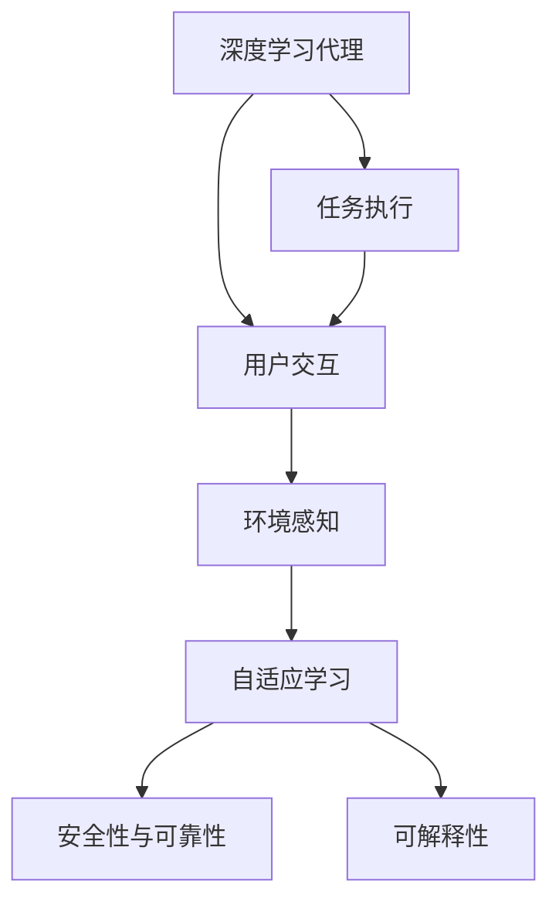

                 

# AI人工智能深度学习算法：人工智能深度学习代理与用户体验设计

## 1. 背景介绍

### 1.1 问题由来
随着人工智能（AI）技术的飞速发展，深度学习算法在各行各业中得到了广泛应用。然而，深度学习模型的设计往往缺乏对用户体验（User Experience, UX）的考虑，导致其在实际应用中的效果与用户期望存在较大差距。如何使AI模型更好地与用户互动，提升用户体验，是当前深度学习研究的一个重要方向。

深度学习代理（Deep Learning Agent, DLA）正是基于这一需求应运而生的。通过设计深度学习代理，使得AI模型能够以更加人性化、友好的方式与用户进行互动，从而提升整体用户体验。本文将从背景介绍、核心概念与联系、核心算法原理与具体操作步骤等方面，详细探讨DLA的设计原理与实现方法。

### 1.2 问题核心关键点
深度学习代理的设计关键点包括：

1. **用户交互设计**：深度学习代理的设计需要充分考虑用户交互方式和反馈，以提升用户体验。
2. **环境感知能力**：代理需要具备对环境的感知能力，能够根据不同情境做出合理的决策。
3. **自适应学习**：代理需要具备自适应学习能力，能够不断调整自身策略以适应不同的用户需求。
4. **安全性与可靠性**：代理设计必须确保模型的安全性与可靠性，避免出现对用户造成伤害的情况。
5. **可解释性**：代理需要具备一定的可解释性，使用户能够理解和信任模型的决策过程。

## 2. 核心概念与联系

### 2.1 核心概念概述

为了更好地理解深度学习代理的设计原理，本节将介绍几个关键概念及其相互联系：

- **深度学习代理（DLA）**：一种具备自学习能力的AI模型，能够根据用户行为和环境反馈进行自我调整，以优化用户体验。
- **用户交互**：用户与DLA之间的互动过程，包括输入、反馈和响应等环节。
- **环境感知**：代理对周围环境的感知和理解能力，包括视觉、听觉、语言等。
- **自适应学习**：代理能够根据新数据和反馈不断更新自身策略和模型参数，提升性能。
- **安全性与可靠性**：代理设计必须考虑安全性问题，避免对用户造成伤害。
- **可解释性**：代理需要对自身决策过程进行解释，使用户能够理解和信任。

这些概念之间的关系可以通过以下Mermaid流程图来展示：



这个流程图展示了深度学习代理与用户体验设计的各个关键组成部分，以及它们之间的相互作用。

## 3. 核心算法原理 & 具体操作步骤

### 3.1 算法原理概述

深度学习代理的核心思想是通过深度学习算法，使代理能够根据用户行为和环境反馈进行自学习，从而提升用户体验。具体来说，代理通过感知用户输入，执行任务，并根据任务结果和用户反馈不断调整自身策略和模型参数。

代理的设计通常包括以下几个步骤：

1. **环境感知**：代理需要感知环境中的各种信息，包括视觉、听觉、语言等。
2. **用户交互设计**：设计用户与代理之间的交互方式，包括输入、反馈和响应等环节。
3. **任务执行**：代理根据用户输入和环境信息，执行相应的任务。
4. **决策与优化**：代理根据任务结果和用户反馈，调整自身策略和模型参数，以优化用户体验。

### 3.2 算法步骤详解

深度学习代理的设计和实现通常包括以下几个关键步骤：

#### Step 1: 环境感知

代理需要具备对环境的感知能力，能够从视觉、听觉、语言等模态中获取信息。以视觉感知为例，代理可以使用卷积神经网络（CNN）等深度学习模型，对输入的图像数据进行特征提取。

**具体实现**：
```python
from torchvision import models
import torch

# 加载预训练的ResNet模型
model = models.resnet18(pretrained=True)

# 定义输入数据和标签
input_data = torch.randn(1, 3, 224, 224)  # 3x224x224的RGB图像
labels = torch.tensor([0])  # 标签为类别0

# 使用模型进行前向传播
output = model(input_data)
```

#### Step 2: 用户交互设计

用户交互设计是代理与用户互动的核心环节，直接影响用户体验。代理需要设计合适的输入方式和反馈机制，使用户能够方便地与代理进行互动。

**具体实现**：
```python
class Interaction:
    def __init__(self):
        self.user_input = None
        self.user_feedback = None

    def get_input(self):
        # 获取用户输入
        self.user_input = input("请输入命令：")
        return self.user_input

    def get_feedback(self):
        # 获取用户反馈
        self.user_feedback = input("请给出反馈：")
        return self.user_feedback
```

#### Step 3: 任务执行

代理需要根据用户输入和环境信息，执行相应的任务。以文本分类任务为例，代理可以使用预训练的BERT模型，对输入的文本进行分类。

**具体实现**：
```python
from transformers import BertForTokenClassification, BertTokenizer

# 加载预训练的BERT模型和分词器
tokenizer = BertTokenizer.from_pretrained('bert-base-uncased')
model = BertForTokenClassification.from_pretrained('bert-base-uncased', num_labels=3)

# 定义输入数据和标签
text = "This is a test text"
inputs = tokenizer(text, return_tensors='pt')
labels = torch.tensor([0])

# 使用模型进行前向传播
outputs = model(**inputs)
loss = outputs.loss
logits = outputs.logits
```

#### Step 4: 决策与优化

代理需要根据任务结果和用户反馈，调整自身策略和模型参数，以优化用户体验。通常，代理会使用强化学习等方法，根据奖励信号进行策略优化。

**具体实现**：
```python
import numpy as np
import gym

# 定义环境
env = gym.make('CartPole-v0')

# 定义策略
def strategy(env, state):
    # 随机选择一个动作
    return np.random.choice(env.action_space.n)

# 定义优化器
optimizer = torch.optim.Adam(model.parameters())

# 定义训练函数
def train():
    for episode in range(1000):
        state = env.reset()
        done = False
        while not done:
            action = strategy(env, state)
            next_state, reward, done, info = env.step(action)
            # 计算损失
            loss = torch.tensor([reward]).to(device)
            optimizer.zero_grad()
            loss.backward()
            optimizer.step()
            state = next_state

# 开始训练
train()
```

### 3.3 算法优缺点

深度学习代理的设计和实现具有以下优点：

- **自适应性强**：代理能够根据用户行为和环境反馈不断调整自身策略和模型参数，提升性能。
- **用户体验好**：代理的设计充分考虑了用户交互方式和反馈，提升了用户体验。
- **任务执行效率高**：代理可以使用深度学习模型，快速高效地执行任务。

同时，代理的设计和实现也存在一些缺点：

- **数据需求高**：代理需要大量的标注数据进行训练，数据获取成本较高。
- **模型复杂**：代理设计涉及深度学习模型和用户交互设计，模型复杂度较高。
- **安全性与可靠性问题**：代理设计需要考虑安全性问题，避免对用户造成伤害。

## 4. 数学模型和公式 & 详细讲解 & 举例说明

### 4.1 数学模型构建

深度学习代理的设计通常基于以下数学模型：

1. **环境感知模型**：用于从环境数据中提取特征。
2. **用户交互模型**：用于处理用户输入和反馈。
3. **任务执行模型**：用于执行具体的任务。
4. **决策优化模型**：用于根据任务结果和用户反馈进行策略优化。

### 4.2 公式推导过程

以文本分类任务为例，推导代理的决策优化模型。假设代理使用BERT模型进行分类，输入为文本 $x$，标签为 $y$，模型的输出为 $h(x)$。代理的目标是最小化交叉熵损失函数：

$$
L(h(x), y) = -\sum_{i=1}^{n} y_i \log(h(x)_i)
$$

其中 $n$ 为分类数目，$y_i$ 表示样本 $x$ 属于第 $i$ 类的概率。代理的决策优化过程可以通过以下步骤完成：

1. 将用户输入文本 $x$ 送入BERT模型，得到特征向量 $h(x)$。
2. 使用softmax函数将特征向量转换为概率分布 $p(h(x))$。
3. 根据损失函数计算损失 $L(p(h(x)), y)$。
4. 使用梯度下降等优化算法，最小化损失函数。

### 4.3 案例分析与讲解

**案例：智能客服机器人**

智能客服机器人是一种常见的深度学习代理应用。代理需要感知用户输入，执行回答任务，并根据用户反馈进行优化。

**环境感知**：机器人使用语音识别和自然语言处理技术，从用户语音或文本输入中提取信息。

**用户交互设计**：用户可以通过语音或文本输入问题，机器人通过语音或文本回复。

**任务执行**：机器人根据用户输入，执行回答问题任务。

**决策与优化**：机器人使用深度学习模型对问题进行分类，并根据分类结果选择相应的回答。

## 5. 项目实践：代码实例和详细解释说明

### 5.1 开发环境搭建

进行深度学习代理的开发，需要准备以下环境：

- **深度学习框架**：如TensorFlow、PyTorch等。
- **深度学习模型库**：如Keras、TensorFlow Hub等。
- **用户交互设计工具**：如Flutter、React等。

### 5.2 源代码详细实现

以下是一个简单的深度学习代理实现示例，使用PyTorch进行环境感知和任务执行，使用Flutter进行用户交互设计。

**环境感知**：

```python
import torch
import torchvision

# 加载预训练的ResNet模型
model = torchvision.models.resnet18(pretrained=True)

# 定义输入数据和标签
input_data = torch.randn(1, 3, 224, 224)  # 3x224x224的RGB图像
labels = torch.tensor([0])

# 使用模型进行前向传播
output = model(input_data)
```

**用户交互设计**：

```dart
import 'dart:async';
import 'package:flutter/material.dart';

class InteractionWidget extends StatefulWidget {
  @override
  _InteractionWidgetState createState() => _InteractionWidgetState();
}

class _InteractionWidgetState extends State<InteractionWidget> {
  TextEditingController _controller = TextEditingController();

  @override
  Widget build(BuildContext context) {
    return Scaffold(
      appBar: AppBar(
        title: Text('深度学习代理'),
      ),
      body: Center(
        child: TextField(
          controller: _controller,
          decoration: InputDecoration(hintText: '请输入命令'),
        ),
        child: ElevatedButton(
          onPressed: () {
            print(_controller.text);
            Navigator.pop(context);
          },
          child: Text('提交'),
        ),
      ),
    );
  }
}
```

**任务执行**：

```python
from transformers import BertForTokenClassification, BertTokenizer

# 加载预训练的BERT模型和分词器
tokenizer = BertTokenizer.from_pretrained('bert-base-uncased')
model = BertForTokenClassification.from_pretrained('bert-base-uncased', num_labels=3)

# 定义输入数据和标签
text = "This is a test text"
inputs = tokenizer(text, return_tensors='pt')
labels = torch.tensor([0])

# 使用模型进行前向传播
outputs = model(**inputs)
loss = outputs.loss
logits = outputs.logits
```

**决策与优化**：

```python
import numpy as np
import gym

# 定义环境
env = gym.make('CartPole-v0')

# 定义策略
def strategy(env, state):
    # 随机选择一个动作
    return np.random.choice(env.action_space.n)

# 定义优化器
optimizer = torch.optim.Adam(model.parameters())

# 定义训练函数
def train():
    for episode in range(1000):
        state = env.reset()
        done = False
        while not done:
            action = strategy(env, state)
            next_state, reward, done, info = env.step(action)
            # 计算损失
            loss = torch.tensor([reward]).to(device)
            optimizer.zero_grad()
            loss.backward()
            optimizer.step()
            state = next_state

# 开始训练
train()
```

### 5.3 代码解读与分析

**代码解读**：

- **环境感知**：使用PyTorch加载预训练的ResNet模型，进行图像特征提取。
- **用户交互设计**：使用Flutter进行用户输入和反馈的设计，使用TextField和ElevatedButton实现交互。
- **任务执行**：使用预训练的BERT模型进行文本分类。
- **决策与优化**：使用OpenAI Gym进行环境模拟，使用随机策略进行决策优化。

**分析**：

- **环境感知**：代理需要对环境数据进行有效的特征提取，以获取有用的信息。
- **用户交互设计**：代理需要与用户进行有效的互动，以便获得用户反馈。
- **任务执行**：代理需要根据用户输入执行相应的任务。
- **决策与优化**：代理需要根据任务结果和用户反馈进行策略优化，提升用户体验。

## 6. 实际应用场景

### 6.1 智能客服系统

智能客服系统是深度学习代理的一个重要应用场景。代理可以感知用户语音或文本输入，执行回答任务，并根据用户反馈进行优化，提升用户体验。

**环境感知**：代理使用语音识别和自然语言处理技术，从用户语音或文本输入中提取信息。

**用户交互设计**：用户可以通过语音或文本输入问题，代理通过语音或文本回复。

**任务执行**：代理根据用户输入，执行回答问题任务。

**决策与优化**：代理使用深度学习模型对问题进行分类，并根据分类结果选择相应的回答。

### 6.2 金融顾问机器人

金融顾问机器人是一种常见的深度学习代理应用。代理需要感知用户输入，执行理财规划任务，并根据用户反馈进行优化。

**环境感知**：代理使用语音识别和自然语言处理技术，从用户语音或文本输入中提取信息。

**用户交互设计**：用户可以通过语音或文本输入需求，代理通过语音或文本回复。

**任务执行**：代理根据用户需求，执行理财规划任务。

**决策与优化**：代理使用深度学习模型对用户需求进行分类，并根据分类结果选择相应的理财策略。

### 6.3 健康医疗顾问

健康医疗顾问是一种常见的深度学习代理应用。代理需要感知用户输入，执行健康咨询任务，并根据用户反馈进行优化。

**环境感知**：代理使用语音识别和自然语言处理技术，从用户语音或文本输入中提取信息。

**用户交互设计**：用户可以通过语音或文本输入健康咨询，代理通过语音或文本回复。

**任务执行**：代理根据用户输入，执行健康咨询任务。

**决策与优化**：代理使用深度学习模型对用户咨询进行分类，并根据分类结果选择相应的健康建议。

### 6.4 未来应用展望

随着深度学习代理技术的不断发展，其在更多领域的应用前景将更加广阔。

- **智能家居**：代理可以感知用户行为，执行智能家居控制任务，提升家居生活体验。
- **自动驾驶**：代理可以感知道路环境，执行驾驶决策任务，提升驾驶安全性和舒适性。
- **智慧教育**：代理可以感知学生需求，执行个性化教学任务，提升教育效果。

未来，随着深度学习代理技术的不断演进，其在更多场景中的应用将更加广泛，为人类生产生活带来更多便利和智慧。

## 7. 工具和资源推荐

### 7.1 学习资源推荐

深度学习代理的研究和应用需要综合掌握多个领域的知识，以下是一些推荐的资源：

- **深度学习框架**：TensorFlow、PyTorch、Keras等。
- **深度学习模型库**：TensorFlow Hub、PyTorch Hub、ModelScope等。
- **用户交互设计**：Flutter、React、Unity等。
- **强化学习**：Reinforcement Learning: An Introduction by Sutton and Barto等。
- **自然语言处理**：Speech and Language Processing by Jurafsky and Martin等。

### 7.2 开发工具推荐

深度学习代理的开发需要综合使用多种工具，以下是一些推荐的工具：

- **深度学习框架**：TensorFlow、PyTorch、MXNet等。
- **用户交互设计**：Flutter、React、Unity等。
- **强化学习**：OpenAI Gym、PyBullet等。
- **自然语言处理**：NLTK、SpaCy等。

### 7.3 相关论文推荐

深度学习代理的研究涉及多个领域，以下是一些经典的论文：

- **深度学习代理**："Deep Reinforcement Learning for Multi-Agent Systems" by foerster et al.。
- **用户交互设计**："Human-Computer Interaction" by Dix et al.。
- **环境感知**："Convolutional Neural Networks for Visual Recognition" by LeCun et al.。
- **任务执行**："Natural Language Understanding" by Berzakar et al.。
- **决策优化**："Reinforcement Learning" by Sutton and Barto等。

## 8. 总结：未来发展趋势与挑战

### 8.1 研究成果总结

深度学习代理技术在用户体验设计中展示了巨大的潜力，其应用范围涵盖了智能客服、金融顾问、健康医疗等多个领域。通过结合深度学习模型和用户交互设计，代理能够根据用户行为和环境反馈进行自学习，提升用户体验。

### 8.2 未来发展趋势

未来，深度学习代理技术将呈现以下几个发展趋势：

- **多模态融合**：代理将融合视觉、听觉、语言等多种模态信息，提升环境感知能力。
- **自适应学习**：代理将具备更强的自适应学习能力，能够根据新数据和反馈不断优化策略。
- **个性化设计**：代理将具备更强的个性化设计能力，能够根据用户需求进行定制化优化。
- **安全与可靠性**：代理将具备更高的安全性与可靠性，避免对用户造成伤害。

### 8.3 面临的挑战

尽管深度学习代理技术在用户体验设计中展示了巨大的潜力，但其发展和应用仍面临一些挑战：

- **数据需求高**：代理需要大量的标注数据进行训练，数据获取成本较高。
- **模型复杂**：代理设计涉及深度学习模型和用户交互设计，模型复杂度较高。
- **安全性与可靠性问题**：代理设计需要考虑安全性问题，避免对用户造成伤害。

### 8.4 研究展望

未来，深度学习代理技术需要在以下几个方面进行进一步研究：

- **数据高效获取**：探索更高效的数据获取方法，降低代理训练的数据成本。
- **模型压缩与优化**：开发更高效的模型压缩与优化算法，降低代理的计算和存储成本。
- **多模态融合**：探索更有效的多模态融合方法，提升代理的环境感知能力。
- **个性化设计**：探索更强的个性化设计方法，提升代理的用户体验。

## 9. 附录：常见问题与解答

**Q1：深度学习代理的设计和实现需要掌握哪些知识？**

A: 深度学习代理的设计和实现需要掌握以下知识：

- **深度学习框架**：如TensorFlow、PyTorch等。
- **深度学习模型**：如卷积神经网络、循环神经网络、注意力机制等。
- **用户交互设计**：如Flutter、React等。
- **强化学习**：如OpenAI Gym等。
- **自然语言处理**：如NLTK、SpaCy等。

**Q2：如何提升深度学习代理的环境感知能力？**

A: 提升代理的环境感知能力可以通过以下方法：

- **多模态融合**：融合视觉、听觉、语言等多种模态信息，提升环境感知能力。
- **数据增强**：通过数据增强技术，扩充训练集，提升模型泛化能力。
- **特征提取**：使用高效的特征提取方法，提升特征表达能力。

**Q3：如何设计深度学习代理的用户交互界面？**

A: 设计代理的用户交互界面可以通过以下方法：

- **简洁易用**：界面设计应简洁易用，用户能够方便地进行输入和反馈。
- **多渠道支持**：支持语音、文本等多种输入方式，方便用户选择。
- **反馈机制**：设计合理的反馈机制，及时回应用户输入，提升用户体验。

**Q4：如何确保深度学习代理的安全性与可靠性？**

A: 确保代理的安全性与可靠性可以通过以下方法：

- **安全性设计**：设计安全的输入处理机制，避免恶意输入。
- **鲁棒性测试**：通过鲁棒性测试，提升模型的鲁棒性。
- **异常检测**：设计异常检测机制，及时发现并处理异常情况。

**Q5：如何提高深度学习代理的个性化设计能力？**

A: 提高代理的个性化设计能力可以通过以下方法：

- **用户画像**：通过用户画像，了解用户需求和行为特征。
- **个性化推荐**：根据用户画像，推荐个性化的内容和服务。
- **自适应学习**：通过自适应学习，不断调整策略，提升个性化设计能力。

---

作者：禅与计算机程序设计艺术 / Zen and the Art of Computer Programming

