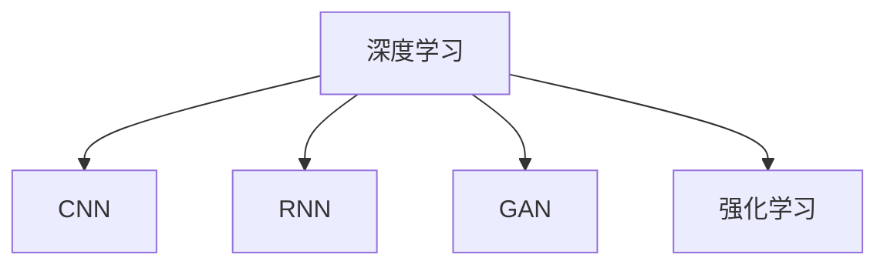

                 

## 1. 背景介绍

### 1.1 问题由来
航空航天是高科技领域中的重要分支，涉及到复杂的飞行器设计、控制系统、数据分析等任务。随着人工智能（AI）技术的快速发展，深度学习算法在航空航天中的应用越来越广泛，尤其在提高飞行器安全性、优化飞行路线、增强故障诊断等方面，展现了显著的潜力。本文将系统地介绍深度学习算法在航空航天领域的具体应用，并分析其背后的核心原理与技术。

### 1.2 问题核心关键点
深度学习算法在航空航天领域的应用核心包括但不限于以下几个方面：
1. **飞行器控制与导航**：通过深度学习算法，实现自主飞行、路径规划、避障等功能。
2. **故障检测与诊断**：运用深度学习算法对传感器数据进行分析，提高故障检测和诊断的准确性。
3. **数据增强与仿真**：利用深度学习算法进行数据增强，生成虚拟仿真数据，辅助飞行器设计。
4. **图像识别与识别系统**：通过深度学习算法实现图像识别、目标检测、人脸识别等功能。
5. **性能优化**：应用深度学习算法优化发动机、推进系统等部件的性能。

### 1.3 问题研究意义
深度学习算法在航空航天领域的应用，能够显著提高飞行器性能、提升飞行安全性、优化设计流程，具有重要意义。其具体表现在以下几个方面：
1. **提升飞行器性能**：通过深度学习优化飞行器控制系统，提高飞行器在极端环境下的稳定性和控制精度。
2. **增强安全性和可靠性**：利用深度学习算法进行故障检测与诊断，及时发现和处理潜在问题，提高飞行器运行的安全性和可靠性。
3. **加速设计流程**：应用深度学习算法进行数据增强和仿真，缩短飞行器设计周期，降低开发成本。
4. **智能化管理**：通过深度学习算法实现飞行器的智能化管理，提升整体运行效率。

## 2. 核心概念与联系

### 2.1 核心概念概述

为了更好地理解深度学习算法在航空航天中的应用，本节将介绍几个密切相关的核心概念：

- **深度学习（Deep Learning）**：一种基于多层神经网络的机器学习技术，能够自动从数据中学习特征和模式，并用于分类、预测、生成等任务。
- **卷积神经网络（Convolutional Neural Network, CNN）**：一种常用的深度学习模型，特别适合于图像处理和模式识别任务。
- **循环神经网络（Recurrent Neural Network, RNN）**：一种处理序列数据的神经网络，适用于时间序列预测、自然语言处理等任务。
- **生成对抗网络（Generative Adversarial Network, GAN）**：一种能够生成高质量样本的深度学习模型，在图像生成、音频生成等任务中表现出色。
- **强化学习（Reinforcement Learning）**：一种通过试错学习的机器学习技术，用于优化飞行器控制策略、路径规划等任务。

这些核心概念之间的逻辑关系可以通过以下Mermaid流程图来展示：



这个流程图展示深度学习与几种常见神经网络模型之间的联系。

## 3. 核心算法原理 & 具体操作步骤
### 3.1 算法原理概述

深度学习算法在航空航天领域的应用，主要基于以下几个原理：

1. **数据驱动**：利用深度学习算法处理大量的传感器数据和飞行器性能数据，提取其中的关键特征，实现飞行器控制与导航。
2. **模型学习**：通过深度学习模型对复杂飞行任务进行建模，预测飞行器状态和环境变化，优化飞行路径。
3. **自适应控制**：利用深度学习算法的自适应能力，实时调整飞行器控制策略，提高飞行安全性。
4. **故障检测与诊断**：通过深度学习算法分析传感器数据，识别飞行器异常行为，实现故障预测与诊断。
5. **数据增强与仿真**：应用深度学习算法进行数据增强，生成虚拟仿真数据，辅助飞行器设计。
6. **图像与识别**：利用深度学习算法实现图像识别、目标检测等功能，提高飞行器周围环境的感知能力。

### 3.2 算法步骤详解

深度学习算法在航空航天领域的应用，通常包括以下几个关键步骤：

**Step 1: 数据准备与预处理**
- 收集飞行器传感器数据、飞行记录、环境数据等，准备用于模型训练的原始数据。
- 对数据进行预处理，包括数据清洗、归一化、特征提取等，确保数据质量和一致性。

**Step 2: 模型选择与设计**
- 根据任务需求，选择合适的深度学习模型，如CNN、RNN、GAN等。
- 设计模型结构，确定网络层数、每层神经元个数、激活函数等参数。
- 选择优化算法和损失函数，如Adam、SGD、交叉熵损失等。

**Step 3: 模型训练与优化**
- 使用准备好的数据集，对模型进行训练。
- 在训练过程中，不断调整模型参数，优化损失函数，提高模型准确率和泛化能力。
- 应用正则化技术，如Dropout、L2正则等，避免过拟合。
- 使用早停法(Early Stopping)等方法，防止训练过度。

**Step 4: 模型评估与验证**
- 在验证集上评估模型性能，如准确率、召回率、F1分数等。
- 根据评估结果，调整模型参数，重新训练和验证，直到达到满意的性能指标。
- 使用测试集进行最终性能验证，确保模型在新数据上的泛化能力。

**Step 5: 部署与应用**
- 将训练好的模型部署到实际飞行器或地面控制系统上。
- 在实际飞行过程中，实时输入传感器数据，调用深度学习模型进行推理和决策。
- 根据实时结果，调整飞行器控制策略，优化飞行路径。
- 定期收集新的数据，重新训练和优化模型，保持模型的持续改进。

### 3.3 算法优缺点

深度学习算法在航空航天领域的应用，具有以下优点：

1. **处理复杂数据**：深度学习算法能够处理大量高维、非结构化的数据，如传感器数据、图像数据等，具有很强的数据适应能力。
2. **自动特征提取**：通过深度学习算法自动提取数据中的关键特征，减少人工干预，提高模型效率。
3. **实时优化**：深度学习算法的实时学习能力，能够动态调整控制策略，适应复杂的飞行环境。
4. **提升安全性**：通过深度学习算法进行故障检测与诊断，提高飞行器运行的安全性和可靠性。
5. **加速设计流程**：应用深度学习算法进行数据增强和仿真，缩短飞行器设计周期，降低开发成本。

同时，深度学习算法也存在一些局限性：

1. **计算资源需求高**：深度学习算法需要大量计算资源进行训练和推理，对硬件和软件环境要求较高。
2. **模型复杂度高**：深度学习模型结构复杂，训练和推理过程需要较长时间，容易过拟合。
3. **数据依赖性强**：深度学习算法依赖于大量的标注数据进行训练，对标注数据的质量和数量要求高。
4. **可解释性差**：深度学习模型通常被视为“黑盒”模型，难以解释其内部工作机制和决策逻辑。
5. **安全风险**：深度学习模型可能引入安全漏洞，如对抗样本攻击等，影响飞行器安全性。

## 4. 数学模型和公式 & 详细讲解  
### 4.1 数学模型构建

深度学习算法在航空航天领域的应用，主要涉及以下几个数学模型：

- **卷积神经网络（CNN）模型**：用于图像识别、目标检测等任务。
- **循环神经网络（RNN）模型**：用于时间序列预测、路径规划等任务。
- **生成对抗网络（GAN）模型**：用于生成高质量的仿真数据。
- **强化学习（RL）模型**：用于优化飞行器控制策略和路径规划。

### 4.2 公式推导过程

以下以CNN模型为例，推导其基本计算公式。

假设输入数据为 $x \in \mathbb{R}^{n \times m}$，输出数据为 $y \in \mathbb{R}^{p \times q}$。

CNN模型由卷积层、池化层、全连接层等组成。其基本计算公式为：

$$
y = \sigma(W \cdot \max(\tau(x), \beta)) + b
$$

其中：
- $W$ 为权重矩阵，$b$ 为偏置向量。
- $\tau(x)$ 表示对输入数据进行卷积和池化操作，$\beta$ 为激活函数。
- $\sigma$ 为激活函数，如ReLU、Sigmoid等。

在训练过程中，利用反向传播算法计算损失函数的梯度，更新权重矩阵 $W$ 和偏置向量 $b$：

$$
\frac{\partial L}{\partial W} = \frac{\partial L}{\partial y} \cdot \frac{\partial y}{\partial W}
$$

### 4.3 案例分析与讲解

以飞行器路径规划为例，介绍深度学习算法在航空航天领域的具体应用。

假设飞行器需要在复杂地形中寻找最佳路径，避免碰撞和障碍物。可以设计一个CNN模型，对地形数据进行卷积和池化处理，提取地形特征。然后通过全连接层和激活函数，输出飞行路径的概率分布，选择概率最高的路径作为最终输出。

## 5. 项目实践：代码实例和详细解释说明
### 5.1 开发环境搭建

在进行深度学习算法应用实践前，我们需要准备好开发环境。以下是使用Python进行TensorFlow开发的环境配置流程：

1. 安装Anaconda：从官网下载并安装Anaconda，用于创建独立的Python环境。
2. 创建并激活虚拟环境：
```bash
conda create -n tf-env python=3.8 
conda activate tf-env
```

3. 安装TensorFlow：根据CUDA版本，从官网获取对应的安装命令。例如：
```bash
pip install tensorflow tensorflow-addons
```

4. 安装TensorFlow Addons等辅助工具：
```bash
pip install tensorboard tensorflow-model-optimization
```

5. 安装必要的第三方库：
```bash
pip install numpy pandas sklearn matplotlib 
```

完成上述步骤后，即可在`tf-env`环境中开始深度学习算法的应用实践。

### 5.2 源代码详细实现

下面以CNN模型在飞行器路径规划中的应用为例，给出使用TensorFlow进行深度学习代码实现。

```python
import tensorflow as tf
import numpy as np
import matplotlib.pyplot as plt

# 定义模型参数
num_filters = 64
kernel_size = 3
pool_size = 2
batch_size = 16
learning_rate = 0.001
epochs = 100

# 加载数据集
train_data = np.load('train_data.npy')
train_labels = np.load('train_labels.npy')

# 定义模型
model = tf.keras.Sequential([
    tf.keras.layers.Conv2D(num_filters, kernel_size, activation='relu', input_shape=(128, 128, 1)),
    tf.keras.layers.MaxPooling2D(pool_size),
    tf.keras.layers.Flatten(),
    tf.keras.layers.Dense(64, activation='relu'),
    tf.keras.layers.Dense(1, activation='sigmoid')
])

# 定义损失函数和优化器
loss_fn = tf.keras.losses.BinaryCrossentropy(from_logits=True)
optimizer = tf.keras.optimizers.Adam(learning_rate)

# 定义训练函数
def train_step(x, y):
    with tf.GradientTape() as tape:
        logits = model(x, training=True)
        loss = loss_fn(y, logits)
    grads = tape.gradient(loss, model.trainable_variables)
    optimizer.apply_gradients(zip(grads, model.trainable_variables))
    return loss

# 训练模型
for epoch in range(epochs):
    epoch_loss = 0
    for i in range(0, len(train_data), batch_size):
        x_batch = train_data[i:i+batch_size]
        y_batch = train_labels[i:i+batch_size]
        loss = train_step(x_batch, y_batch)
        epoch_loss += loss.numpy()
    print('Epoch {} Loss: {}'.format(epoch+1, epoch_loss/len(train_data)))

# 测试模型
test_data = np.load('test_data.npy')
test_labels = np.load('test_labels.npy')
test_loss = loss_fn(test_labels, model(test_data, training=False))
print('Test Loss: {}'.format(test_loss.numpy()))
```

以上就是使用TensorFlow进行飞行器路径规划的深度学习模型开发的完整代码实现。可以看到，利用TensorFlow等框架，深度学习算法的实现变得相对简洁高效。

### 5.3 代码解读与分析

让我们再详细解读一下关键代码的实现细节：

**数据加载**：
- 使用`numpy`库加载训练数据和标签，准备用于模型训练。

**模型定义**：
- 使用`tf.keras`模块定义CNN模型，包括卷积层、池化层、全连接层等组件。
- 指定模型参数，如卷积核大小、过滤器数量、激活函数等。

**损失函数和优化器**：
- 选择合适的损失函数和优化器，如二元交叉熵损失和Adam优化器。

**训练函数**：
- 定义训练函数`train_step`，对每个批次的数据进行前向传播、计算损失、反向传播、更新参数。
- 使用`tf.GradientTape`记录梯度，并应用优化器进行参数更新。

**模型训练**：
- 循环遍历训练集，对每个批次数据进行训练，计算平均损失。
- 打印每个epoch的平均损失，监控训练过程。

**模型测试**：
- 加载测试集数据和标签，使用测试集评估模型性能。
- 计算测试集损失，输出最终结果。

## 6. 实际应用场景
### 6.1 智能控制系统

深度学习算法在智能控制系统中的应用，可以显著提高飞行器控制的安全性和稳定性。例如，在自动驾驶系统中，可以利用CNN模型对周围环境进行图像识别，检测障碍物和交通标志，自动生成最优驾驶路径。此外，还可以利用RNN模型对飞行器状态进行时间序列预测，动态调整控制策略。

### 6.2 故障诊断与预测

在飞行器维护和故障诊断中，深度学习算法可以发挥重要作用。通过分析传感器数据，CNN模型可以对故障进行快速检测，如发动机故障、机翼损伤等。利用RNN模型进行时间序列分析，可以预测故障的演变趋势，提前进行维护，避免重大事故的发生。

### 6.3 飞行器设计优化

深度学习算法在飞行器设计优化中，可以用于进行数据增强和仿真，加速设计流程。利用GAN模型生成高保真的虚拟仿真数据，可以模拟不同飞行条件下的性能表现，评估设计方案的优劣。此外，还可以利用强化学习算法进行路径优化，找到最优的飞行路径，提高飞行效率。

### 6.4 未来应用展望

未来，深度学习算法在航空航天领域的应用将更加广泛和深入。以下是几个可能的发展方向：

1. **多模态数据融合**：结合图像、声音、雷达等多种数据源，提高飞行器周围环境的感知能力，实现更加智能化的飞行控制。
2. **自适应学习**：利用强化学习算法，使飞行器能够自适应学习不同的飞行环境和任务，提高飞行器灵活性和适应性。
3. **实时优化**：通过实时学习，动态调整飞行器控制策略，提高飞行安全性。
4. **跨领域应用**：将深度学习算法应用于多个领域，如医疗、交通等，推动跨领域智能技术的协同发展。

## 7. 工具和资源推荐
### 7.1 学习资源推荐

为了帮助开发者系统掌握深度学习算法在航空航天领域的应用，这里推荐一些优质的学习资源：

1. **Deep Learning Specialization by Andrew Ng**：由斯坦福大学教授Andrew Ng开设的深度学习课程，系统介绍深度学习的基本原理和应用。
2. **TensorFlow Tutorials**：TensorFlow官方提供的教程，涵盖深度学习算法在航空航天领域的具体应用。
3. **Kaggle Competitions**：Kaggle平台上的航空航天相关比赛，提供大量数据集和竞赛，帮助开发者积累实践经验。
4. **Journal of Aircraft**：航空航天领域的重要学术期刊，发表多篇深度学习算法在飞行器控制和维护中的应用论文。
5. **arXiv**：开放的科研论文数据库，汇集了大量的深度学习算法论文，便于学术交流和研究。

通过对这些资源的学习实践，相信你一定能够快速掌握深度学习算法在航空航天领域的应用，并用于解决实际的飞行器设计、控制和维护问题。

### 7.2 开发工具推荐

高效的开发离不开优秀的工具支持。以下是几款用于深度学习算法应用开发的常用工具：

1. **TensorFlow**：由Google主导开发的开源深度学习框架，生产部署方便，适合大规模工程应用。
2. **PyTorch**：基于Python的开源深度学习框架，灵活动态的计算图，适合快速迭代研究。
3. **Keras**：高级神经网络API，支持TensorFlow、Theano等后端，易于上手使用。
4. **MXNet**：由Apache开发的高效深度学习框架，支持多种编程语言，具有高性能和可扩展性。
5. **Jupyter Notebook**：交互式编程环境，支持Python、R等多种语言，方便调试和实验。

合理利用这些工具，可以显著提升深度学习算法的应用开发效率，加快创新迭代的步伐。

### 7.3 相关论文推荐

深度学习算法在航空航天领域的研究已经取得了丰硕成果。以下是几篇奠基性的相关论文，推荐阅读：

1. **Deep Reinforcement Learning for Autonomous Vehicle Control**：介绍利用深度强化学习算法优化自动驾驶系统控制策略的方法。
2. **A Convolutional Neural Network for Defect Recognition in Carbon Fiber Reinforced Plastic**：研究利用CNN模型对复合材料缺陷进行识别的方法。
3. **The Importance of Feature Extraction in Aircraft Maintenance**：讨论特征提取在飞机维护和故障诊断中的应用。
4. **Generative Adversarial Networks for Aircraft Design Optimization**：探讨利用GAN模型进行飞行器设计优化的方法。
5. **A Survey on Machine Learning Applications for Fault Diagnosis in Aerospace Systems**：总结深度学习算法在飞行器故障诊断中的应用。

这些论文代表了大深度学习算法在航空航天领域的发展脉络。通过学习这些前沿成果，可以帮助研究者把握学科前进方向，激发更多的创新灵感。

## 8. 总结：未来发展趋势与挑战
### 8.1 总结

本文对深度学习算法在航空航天领域的应用进行了系统介绍。首先阐述了深度学习算法在该领域的研究背景和意义，明确了深度学习算法在飞行器控制、故障检测、数据增强等方面的重要价值。其次，从原理到实践，详细讲解了深度学习算法的基本模型和核心步骤，给出了深度学习算法在飞行器路径规划中的代码实现。同时，本文还广泛探讨了深度学习算法在智能控制系统、故障诊断与预测、飞行器设计优化等多个领域的应用前景，展示了深度学习算法在航空航天领域的广阔前景。

通过本文的系统梳理，可以看到，深度学习算法在航空航天领域的应用已经取得显著成果，极大地提高了飞行器的性能和安全性，缩短了设计周期，降低了开发成本。未来，伴随深度学习算法的持续演进，必将推动航空航天技术的进一步突破，为人类探索宇宙带来新的机遇。

### 8.2 未来发展趋势

展望未来，深度学习算法在航空航天领域的应用将呈现以下几个发展趋势：

1. **多模态数据融合**：结合图像、声音、雷达等多种数据源，提高飞行器周围环境的感知能力，实现更加智能化的飞行控制。
2. **自适应学习**：利用强化学习算法，使飞行器能够自适应学习不同的飞行环境和任务，提高飞行器灵活性和适应性。
3. **实时优化**：通过实时学习，动态调整飞行器控制策略，提高飞行安全性。
4. **跨领域应用**：将深度学习算法应用于多个领域，如医疗、交通等，推动跨领域智能技术的协同发展。
5. **模型可解释性**：提高深度学习模型的可解释性，便于理解和调试，满足飞行器控制和维护的实际需求。
6. **数据驱动设计**：通过深度学习算法进行数据驱动设计，优化飞行器性能和可靠性。

### 8.3 面临的挑战

尽管深度学习算法在航空航天领域的应用已经取得了瞩目成就，但在迈向更加智能化、普适化应用的过程中，它仍面临着诸多挑战：

1. **数据隐私和安全**：航空航天领域的飞行器数据涉及国家安全，如何确保数据隐私和安全是一个重要问题。
2. **模型鲁棒性**：深度学习模型在复杂环境下可能出现鲁棒性不足的问题，需要进一步研究提高模型泛化性能。
3. **计算资源需求高**：深度学习算法需要大量计算资源进行训练和推理，对硬件和软件环境要求较高。
4. **跨领域协同**：深度学习算法在跨领域应用中，需要与其他技术进行协同工作，如知识表示、规则引擎等。
5. **模型可解释性**：深度学习模型通常被视为“黑盒”模型，难以解释其内部工作机制和决策逻辑。

### 8.4 研究展望

未来的研究需要在以下几个方面寻求新的突破：

1. **跨领域协同**：加强与其他技术的协同，如知识表示、规则引擎等，提高深度学习算法在复杂环境中的适应性和可解释性。
2. **实时优化**：探索实时优化方法，提高深度学习算法在飞行器控制和导航中的响应速度和精度。
3. **数据隐私保护**：研究数据隐私保护技术，确保飞行器数据的保密性和安全性。
4. **自适应学习**：进一步研究自适应学习方法，使深度学习算法能够动态调整策略，适应不同飞行环境和任务。
5. **模型可解释性**：研究模型可解释性方法，提高深度学习算法的透明性和可解释性，满足飞行器控制和维护的实际需求。

这些研究方向的探索，必将引领深度学习算法在航空航天领域迈向更高的台阶，为人类探索宇宙带来新的突破。相信随着技术的日益成熟，深度学习算法必将在航空航天领域展现出更加广阔的应用前景。

## 9. 附录：常见问题与解答
### 附录A: 数据准备与预处理

**Q1: 如何处理飞行器传感器数据？**

A: 飞行器传感器数据通常包含高维、非结构化的信息，需要进行预处理才能用于深度学习算法。具体步骤如下：

1. **数据清洗**：去除噪声和异常值，确保数据质量和一致性。
2. **数据归一化**：将数据缩放到[0,1]或[-1,1]范围内，提高算法收敛速度。
3. **特征提取**：利用深度学习算法自动提取数据中的关键特征，减少人工干预。
4. **数据增强**：通过对数据进行旋转、平移、缩放等操作，生成更多的训练样本，提高模型泛化能力。

### 附录B: 模型选择与设计

**Q2: 如何选择适合的深度学习模型？**

A: 深度学习模型选择应根据具体任务需求和数据特点进行选择。常见模型包括CNN、RNN、GAN等。具体如下：

1. **CNN**：适用于图像识别、目标检测等任务，能够提取高维特征，适用于结构化数据。
2. **RNN**：适用于时间序列预测、路径规划等任务，能够处理动态数据，适用于序列数据。
3. **GAN**：适用于生成高质量的仿真数据，能够生成具有逼真度的高维数据，适用于数据增强和仿真。

### 附录C: 模型训练与优化

**Q3: 如何优化深度学习模型？**

A: 深度学习模型优化包括超参数调优和正则化技术。具体如下：

1. **超参数调优**：选择合适的学习率、批量大小、迭代次数等超参数，通过交叉验证等方法进行调优。
2. **正则化技术**：应用Dropout、L2正则等方法，防止过拟合。
3. **模型集成**：通过集成多个模型，取平均输出，提高模型鲁棒性和泛化能力。

### 附录D: 模型评估与验证

**Q4: 如何评估深度学习模型性能？**

A: 深度学习模型评估通常使用准确率、召回率、F1分数等指标。具体步骤如下：

1. **划分数据集**：将数据集划分为训练集、验证集和测试集。
2. **评估指标**：选择合适的评估指标，如准确率、召回率、F1分数等，计算模型性能。
3. **验证过程**：在验证集上评估模型性能，根据评估结果调整模型参数，重新训练和验证，直到达到满意的性能指标。
4. **测试集评估**：使用测试集进行最终性能验证，确保模型在新数据上的泛化能力。

### 附录E: 部署与应用

**Q5: 如何部署深度学习模型？**

A: 深度学习模型部署通常包括以下步骤：

1. **模型导出**：将训练好的模型导出为二进制文件或序列化文件，便于部署和使用。
2. **模型优化**：对模型进行裁剪、量化等优化操作，减少内存和计算资源占用。
3. **服务化封装**：将模型封装为标准化服务接口，便于集成调用。
4. **弹性伸缩**：根据请求流量动态调整资源配置，平衡服务质量和成本。
5. **监控告警**：实时采集系统指标，设置异常告警阈值，确保服务稳定性。

**Q6: 如何确保飞行器数据的安全性和隐私性？**

A: 飞行器数据涉及国家安全，确保数据隐私和安全至关重要。具体措施包括：

1. **数据加密**：对飞行器数据进行加密处理，防止数据泄露。
2. **访问控制**：设置严格的访问权限，确保只有授权人员可以访问数据。
3. **安全审计**：定期进行安全审计，发现并修复潜在的安全漏洞。
4. **数据匿名化**：对敏感数据进行匿名化处理，防止数据识别。

总之，深度学习算法在航空航天领域的应用前景广阔，但需要不断探索和优化，以应对复杂环境下的挑战。相信通过不懈努力，深度学习算法必将在飞行器控制、故障检测与预测、飞行器设计优化等领域展现出更加强大的能力，推动航空航天技术的不断进步。

---

作者：禅与计算机程序设计艺术 / Zen and the Art of Computer Programming

