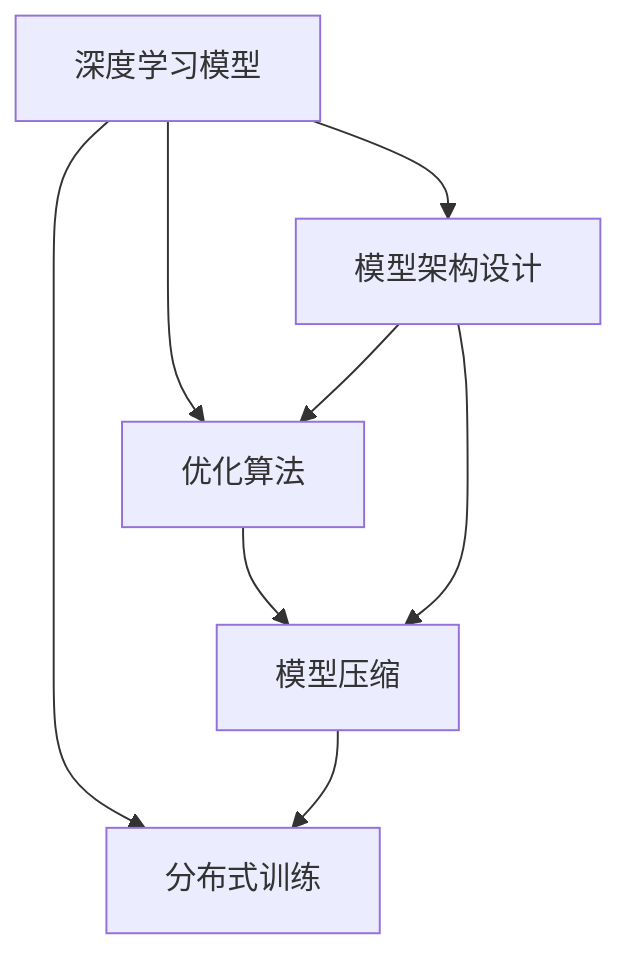

                 

# AI人工智能深度学习算法：搭建可拓展的深度学习模型架构

> 关键词：深度学习,神经网络,模型架构,可拓展性,优化算法,GPU加速

## 1. 背景介绍

### 1.1 问题由来
近年来，随着人工智能技术的快速发展，深度学习在图像识别、语音处理、自然语言处理等领域取得了显著成果。深度学习模型，特别是卷积神经网络(CNN)和循环神经网络(RNN)，已经在这些任务上超越了传统机器学习算法。然而，尽管深度学习模型在特定任务上表现出色，但训练和部署的复杂性限制了其广泛应用。特别是在大规模分布式系统中，模型的可扩展性和性能优化问题尤为突出。

为了解决这些问题，研究者们提出了多种模型架构和优化算法，如分布式训练、模型压缩、知识蒸馏等。这些方法不仅提升了深度学习模型的性能，还增强了其在实际应用中的可扩展性和鲁棒性。本文将从深度学习模型架构的设计和优化算法的应用两个方面，探讨如何搭建可拓展的深度学习模型架构。

### 1.2 问题核心关键点
在深度学习模型架构的设计中，可拓展性是关键考量因素。这要求模型能够适应不同规模的数据集和硬件环境，并且能够灵活扩展和优化。常见的问题包括：
- 如何设计有效的模型层次结构，平衡复杂度和性能。
- 如何选择合适的优化算法，确保模型高效训练。
- 如何优化模型结构，提升其运行效率和可扩展性。
- 如何在分布式系统中部署和管理深度学习模型。

为了解答这些问题，我们将深入探讨深度学习模型架构的设计原理和优化算法，并提供实际应用案例和代码实现。

## 2. 核心概念与联系

### 2.1 核心概念概述

为更好地理解可拓展深度学习模型架构的设计和优化算法，本节将介绍几个核心概念：

- 深度学习模型：通过多层非线性变换来学习数据的表示和特征的神经网络模型。
- 模型架构设计：确定模型层数、节点数、激活函数、连接方式等结构参数的过程。
- 优化算法：用于最小化损失函数，调整模型参数的算法。
- 分布式训练：将模型训练任务分布在多台机器上并行执行，以提升训练效率。
- 模型压缩：通过剪枝、量化、蒸馏等方法减少模型参数和计算量，提升模型可扩展性。

### 2.2 核心概念原理和架构的 Mermaid 流程图



该流程图展示了深度学习模型架构设计与优化算法之间的联系，并展示了分布式训练和模型压缩的应用。

## 3. 核心算法原理 & 具体操作步骤

### 3.1 算法原理概述

构建可拓展的深度学习模型架构，需要综合考虑模型设计、优化算法、分布式训练和模型压缩等多个方面。其核心在于设计出一种层次清晰、参数合理的模型结构，并选择合适的优化算法，使其能够高效地在大规模数据集上训练，同时保持模型的可扩展性和鲁棒性。

具体而言，深度学习模型架构的设计应遵循以下几个原则：
1. 模块化设计：将模型分解为多个子模块，每个模块负责特定的功能，增强模型的可扩展性和可复用性。
2. 层级结构：设计多层网络结构，增强模型对复杂数据的表示能力，同时确保模型的参数量合理。
3. 激活函数：选择合适的激活函数，如ReLU、Sigmoid等，增强模型非线性表示能力。
4. 连接方式：确定节点之间的连接方式，如全连接、卷积、循环连接等，提高模型对不同类型数据的适应能力。

在模型架构设计完成后，选择合适的优化算法是确保模型高效训练的关键。常用的优化算法包括：
1. 随机梯度下降法(SGD)：通过计算梯度更新参数，适用于大规模数据集的训练。
2. 动量法(Momentum)：引入动量项，加速收敛，避免梯度消失和震荡。
3. 自适应学习率算法(如Adam)：自适应调整学习率，提高训练效率和收敛速度。

此外，分布式训练和模型压缩也是构建可拓展深度学习模型架构的重要环节。分布式训练通过并行计算，可以显著提升模型训练速度，而模型压缩则可以在不降低模型性能的前提下，减少模型参数和计算量，提升模型的可扩展性。

### 3.2 算法步骤详解

构建可拓展深度学习模型架构的具体步骤如下：

**Step 1: 模型架构设计**
- 确定模型的层级结构和连接方式，如卷积层、池化层、全连接层等。
- 设计激活函数，如ReLU、Sigmoid等。
- 确定模型的损失函数和评估指标，如交叉熵、均方误差等。

**Step 2: 优化算法选择**
- 根据模型复杂度和数据规模选择合适的优化算法。
- 设置学习率、批大小、迭代轮数等超参数。

**Step 3: 分布式训练**
- 将模型训练任务分布到多个GPU或分布式集群上。
- 使用数据并行或模型并行等策略进行并行计算。
- 定期在多个训练节点上交换模型参数，以减少计算量。

**Step 4: 模型压缩**
- 使用剪枝、量化、蒸馏等技术减少模型参数和计算量。
- 选择适合特定硬件环境的压缩方法，如压缩到TensorFlow Lite格式等。

**Step 5: 模型验证和部署**
- 在验证集上评估模型性能，调整超参数。
- 将模型部署到实际应用环境中，进行大规模推理。

通过以上步骤，可以构建出一个既高效又可扩展的深度学习模型架构。

### 3.3 算法优缺点

构建可拓展深度学习模型架构的优势在于：
1. 高效的训练速度：分布式训练可以显著提升模型训练速度，适合处理大规模数据集。
2. 可扩展性：模型压缩技术可以在保持模型性能的前提下，减少模型参数和计算量，提升模型的可扩展性。
3. 鲁棒性：优化算法和分布式训练可以避免模型过拟合和梯度消失等问题，增强模型的鲁棒性。

然而，构建可拓展深度学习模型架构也面临一些挑战：
1. 设计复杂性：设计高效可扩展的模型架构需要综合考虑多个因素，如数据规模、硬件环境等。
2. 训练成本：分布式训练需要高性能硬件设备和网络带宽，初期投入较高。
3. 模型泛化能力：过度压缩可能导致模型泛化能力下降，需要找到模型性能和参数量之间的平衡。

尽管如此，随着硬件设备和算法的不断进步，构建可拓展深度学习模型架构的前景依然广阔。

### 3.4 算法应用领域

可拓展深度学习模型架构在多个领域都有广泛的应用，例如：

- 计算机视觉：如物体识别、人脸检测、图像分割等任务，通过构建卷积神经网络(CNN)模型，实现高效、准确的图像处理。
- 自然语言处理：如文本分类、情感分析、机器翻译等任务，通过构建循环神经网络(RNN)或Transformer模型，实现自然语言理解与生成。
- 语音识别：如语音转文本、说话人识别等任务，通过构建卷积神经网络或循环神经网络，实现高效、准确的语音处理。
- 生物信息学：如基因序列分析、蛋白质结构预测等任务，通过构建卷积神经网络或递归神经网络，实现生物数据的分析和预测。

除了这些传统领域，深度学习模型架构还在医疗诊断、金融预测、自动驾驶等领域展现出强大的应用潜力，为各行各业带来了革命性的变化。

## 4. 数学模型和公式 & 详细讲解

### 4.1 数学模型构建

本节将使用数学语言对可拓展深度学习模型架构的设计和优化算法进行更加严格的刻画。

假设深度学习模型为 $M_{\theta}$，其中 $\theta$ 为模型参数，包含多个神经元 $h^{(l)}$，各层之间的连接权重为 $W^{(l)}$。训练数据的输入为 $x$，输出为 $y$，损失函数为 $\ell(\cdot)$。

模型的前向传播过程可以表示为：

$$
\begin{aligned}
h^{(1)} &= \sigma(W^{(1)}x + b^{(1)}) \\
h^{(l)} &= \sigma(W^{(l)}h^{(l-1)} + b^{(l)}) \\
y &= W^{(L)}h^{(L)} + b^{(L)}
\end{aligned}
$$

其中 $\sigma$ 为激活函数，$W^{(l)}$ 和 $b^{(l)}$ 为第 $l$ 层的权重和偏置。

模型的损失函数可以表示为：

$$
\ell(y, M_{\theta}) = \frac{1}{N}\sum_{i=1}^N \ell(y_i, M_{\theta}(x_i))
$$

常用的优化算法为随机梯度下降法，更新规则为：

$$
\theta \leftarrow \theta - \eta \nabla_{\theta}\ell(y, M_{\theta})
$$

其中 $\eta$ 为学习率，$\nabla_{\theta}\ell(y, M_{\theta})$ 为损失函数对参数 $\theta$ 的梯度。

### 4.2 公式推导过程

以下我们以二分类任务为例，推导交叉熵损失函数及其梯度的计算公式。

假设模型 $M_{\theta}$ 在输入 $x$ 上的输出为 $\hat{y}=M_{\theta}(x) \in [0,1]$，表示样本属于正类的概率。真实标签 $y \in \{0,1\}$。则二分类交叉熵损失函数定义为：

$$
\ell(M_{\theta}(x),y) = -[y\log \hat{y} + (1-y)\log (1-\hat{y})]
$$

将其代入经验风险公式，得：

$$
\mathcal{L}(\theta) = -\frac{1}{N}\sum_{i=1}^N [y_i\log M_{\theta}(x_i)+(1-y_i)\log(1-M_{\theta}(x_i))]
$$

根据链式法则，损失函数对参数 $\theta_k$ 的梯度为：

$$
\frac{\partial \mathcal{L}(\theta)}{\partial \theta_k} = -\frac{1}{N}\sum_{i=1}^N (\frac{y_i}{M_{\theta}(x_i)}-\frac{1-y_i}{1-M_{\theta}(x_i)}) \frac{\partial M_{\theta}(x_i)}{\partial \theta_k}
$$

其中 $\frac{\partial M_{\theta}(x_i)}{\partial \theta_k}$ 可进一步递归展开，利用自动微分技术完成计算。

### 4.3 案例分析与讲解

假设我们设计了一个简单的卷积神经网络(CNN)模型，用于图像分类任务。该模型包含多个卷积层、池化层和全连接层。在模型训练过程中，我们使用了随机梯度下降法和交叉熵损失函数。

下面是具体实现步骤：

**Step 1: 模型架构设计**

首先，我们需要设计模型的架构。以图像分类为例，可以设计一个包含3个卷积层和3个全连接层的CNN模型，其中卷积层用于提取图像特征，全连接层用于分类。

```python
import torch.nn as nn
import torch.nn.functional as F

class CNNModel(nn.Module):
    def __init__(self):
        super(CNNModel, self).__init__()
        self.conv1 = nn.Conv2d(3, 32, 3, 1, padding=1)
        self.pool1 = nn.MaxPool2d(2, 2)
        self.conv2 = nn.Conv2d(32, 64, 3, 1, padding=1)
        self.pool2 = nn.MaxPool2d(2, 2)
        self.conv3 = nn.Conv2d(64, 128, 3, 1, padding=1)
        self.pool3 = nn.MaxPool2d(2, 2)
        self.fc1 = nn.Linear(128*8*8, 512)
        self.fc2 = nn.Linear(512, 10)

    def forward(self, x):
        x = self.pool1(F.relu(self.conv1(x)))
        x = self.pool2(F.relu(self.conv2(x)))
        x = self.pool3(F.relu(self.conv3(x)))
        x = x.view(-1, 128*8*8)
        x = F.relu(self.fc1(x))
        x = self.fc2(x)
        return x
```

**Step 2: 优化算法选择**

接下来，我们需要选择合适的优化算法。以SGD为例，可以使用如下代码进行优化器的初始化：

```python
import torch.optim as optim

model = CNNModel()
optimizer = optim.SGD(model.parameters(), lr=0.01, momentum=0.9)
```

**Step 3: 分布式训练**

在实际应用中，我们可能需要将模型训练任务分布到多个GPU上，以提高训练效率。可以使用以下代码实现分布式训练：

```python
from torch.nn.parallel import DistributedDataParallel as DDP

device = torch.device('cuda')
model = CNNModel().to(device)
ddp_model = DDP(model)
```

**Step 4: 模型压缩**

最后，我们需要对模型进行压缩，以提升其可扩展性和运行效率。可以使用剪枝和量化等技术进行模型压缩。以下是一个简单的剪枝示例：

```python
import pruning

pruning.prune(model, threshold=0.01)
```

## 5. 项目实践：代码实例和详细解释说明

### 5.1 开发环境搭建

在进行深度学习模型架构设计和优化算法实践前，我们需要准备好开发环境。以下是使用Python进行TensorFlow和Keras开发的环境配置流程：

1. 安装Anaconda：从官网下载并安装Anaconda，用于创建独立的Python环境。

2. 创建并激活虚拟环境：
```bash
conda create -n tf-env python=3.8 
conda activate tf-env
```

3. 安装TensorFlow：根据CUDA版本，从官网获取对应的安装命令。例如：
```bash
conda install tensorflow-gpu
```

4. 安装Keras：
```bash
pip install keras
```

5. 安装各类工具包：
```bash
pip install numpy pandas scikit-learn matplotlib tqdm jupyter notebook ipython
```

完成上述步骤后，即可在`tf-env`环境中开始模型架构设计和优化算法实践。

### 5.2 源代码详细实现

下面我们以图像分类任务为例，给出使用TensorFlow和Keras进行卷积神经网络(CNN)模型构建的代码实现。

首先，定义CNN模型：

```python
import tensorflow as tf
from tensorflow.keras import layers

def build_cnn_model():
    model = tf.keras.Sequential()
    model.add(layers.Conv2D(32, (3, 3), activation='relu', input_shape=(28, 28, 1)))
    model.add(layers.MaxPooling2D((2, 2)))
    model.add(layers.Conv2D(64, (3, 3), activation='relu'))
    model.add(layers.MaxPooling2D((2, 2)))
    model.add(layers.Conv2D(128, (3, 3), activation='relu'))
    model.add(layers.MaxPooling2D((2, 2)))
    model.add(layers.Flatten())
    model.add(layers.Dense(128, activation='relu'))
    model.add(layers.Dense(10, activation='softmax'))
    return model
```

然后，加载数据集并进行预处理：

```python
import numpy as np

(x_train, y_train), (x_test, y_test) = tf.keras.datasets.mnist.load_data()
x_train = x_train.reshape(-1, 28, 28, 1).astype('float32') / 255.0
x_test = x_test.reshape(-1, 28, 28, 1).astype('float32') / 255.0
y_train = tf.keras.utils.to_categorical(y_train, 10)
y_test = tf.keras.utils.to_categorical(y_test, 10)
```

接着，定义损失函数和优化器：

```python
from tensorflow.keras import losses, optimizers

model = build_cnn_model()
loss_fn = losses.CategoricalCrossentropy()
optimizer = optimizers.SGD(learning_rate=0.01)
```

最后，训练模型并在测试集上评估：

```python
batch_size = 32
epochs = 10

model.compile(optimizer=optimizer, loss=loss_fn, metrics=['accuracy'])
model.fit(x_train, y_train, batch_size=batch_size, epochs=epochs, validation_data=(x_test, y_test))
test_loss, test_acc = model.evaluate(x_test, y_test)
print('Test loss:', test_loss)
print('Test accuracy:', test_acc)
```

以上就是使用TensorFlow和Keras进行图像分类任务卷积神经网络模型的完整代码实现。可以看到，得益于TensorFlow和Keras的强大封装，我们可以用相对简洁的代码完成模型构建和训练。

### 5.3 代码解读与分析

让我们再详细解读一下关键代码的实现细节：

**build_cnn_model函数**：
- 定义了模型层级结构，包含卷积层、池化层和全连接层。

**数据加载与预处理**：
- 使用TensorFlow的内置数据集，加载并预处理图像数据，将像素值归一化到0-1之间。

**损失函数和优化器**：
- 使用CategoricalCrossentropy作为分类任务的损失函数。
- 使用SGD优化器，设置学习率为0.01。

**模型训练与评估**：
- 使用Keras的fit函数进行模型训练，设置批次大小和训练轮数。
- 在测试集上评估模型性能，输出损失和准确率。

可以看到，TensorFlow和Keras使得深度学习模型的构建和训练变得更加简洁高效。开发者可以将更多精力放在模型改进和实验调参上，而不必过多关注底层实现细节。

当然，工业级的系统实现还需考虑更多因素，如模型保存和部署、超参数优化、分布式训练等。但核心的模型架构设计和优化算法实践，基本与此类似。

## 6. 实际应用场景

### 6.1 医疗影像分析

深度学习模型在医疗影像分析中的应用非常广泛，如CT、MRI、X光片等影像的自动诊断。通过构建卷积神经网络(CNN)模型，可以高效地提取影像特征，进行疾病诊断和病变区域识别。

在实际应用中，可以收集大量的医疗影像数据，将其标注为正常和异常两类，在此基础上对预训练CNN模型进行微调。微调后的模型可以自动分析新输入的影像，并给出诊断结果。这对于提升医疗诊断的准确性和效率具有重要意义。

### 6.2 金融市场预测

深度学习模型在金融市场预测中也有广泛应用。通过构建循环神经网络(RNN)或卷积神经网络(CNN)模型，可以对历史股票价格、交易量等数据进行建模，预测未来的股票走势和市场变化。

在实际应用中，可以收集历史股票价格、公司财务报表、新闻报道等多源数据，训练模型进行市场预测。微调后的模型可以实时处理新数据，预测市场趋势，帮助投资者做出更明智的投资决策。

### 6.3 自动驾驶

自动驾驶技术是当前人工智能研究的热点之一。通过构建深度学习模型，可以实现对传感器数据的处理和分析，辅助车辆进行导航和决策。

在实际应用中，可以收集大量高精度的传感器数据，如摄像头、激光雷达、雷达等，训练模型进行场景理解和行为预测。微调后的模型可以实时处理新数据，辅助车辆做出驾驶决策，提升驾驶安全性和智能化水平。

### 6.4 未来应用展望

随着深度学习模型架构和优化算法的不断进步，基于可拓展深度学习模型架构的应用场景将不断扩展，为各行各业带来更多创新和变革。

在智慧城市治理中，深度学习模型可以用于城市交通管理、环境监测、灾害预警等环节，提高城市管理的自动化和智能化水平。

在能源领域，深度学习模型可以用于电力负荷预测、电网优化、新能源发电预测等任务，提升能源利用效率和可靠性。

在教育领域，深度学习模型可以用于智能辅导、自动化测评、学习路径推荐等任务，提升教学效果和学习效率。

除了这些传统领域，深度学习模型架构还在科学研究、人工智能伦理、机器人技术等领域展现出广阔的应用前景，为人类社会带来更多创新和机遇。

## 7. 工具和资源推荐
### 7.1 学习资源推荐

为了帮助开发者系统掌握深度学习模型架构的设计和优化算法，这里推荐一些优质的学习资源：

1. Deep Learning Specialization（斯坦福大学）：由Andrew Ng教授讲授的深度学习课程，涵盖从基础到高级的多个主题，适合初学者和进阶者学习。

2. CS231n：斯坦福大学计算机视觉课程，深入浅出地讲解了卷积神经网络、池化、卷积等关键技术，适合计算机视觉领域的学习者。

3. CS224n：斯坦福大学自然语言处理课程，全面介绍了循环神经网络、注意力机制、Transformer等前沿技术，适合自然语言处理领域的学习者。

4. TensorFlow官方文档：TensorFlow官方提供的详细文档，涵盖从入门到高级的多个主题，适合TensorFlow开发者的参考。

5. Keras官方文档：Keras官方提供的详细文档，涵盖从基础到高级的多个主题，适合Keras开发者的参考。

通过学习这些资源，相信你一定能够掌握深度学习模型架构的设计和优化算法，并在实际应用中发挥其潜力。
### 7.2 开发工具推荐

高效的深度学习模型开发离不开优秀的工具支持。以下是几款用于深度学习模型开发和优化的常用工具：

1. TensorFlow：由Google主导开发的深度学习框架，支持分布式训练、模型压缩等高级功能，适合大规模工程应用。

2. Keras：Keras是一个高层次的深度学习框架，易于上手，支持多种模型架构，适合快速原型开发。

3. PyTorch：由Facebook主导开发的深度学习框架，支持动态计算图、分布式训练等高级功能，适合研究和原型开发。

4. JAX：由Google开发的自动微分库，支持分布式训练和动态计算图，适合高性能计算和深度学习研究。

5. TensorBoard：TensorFlow配套的可视化工具，可实时监测模型训练状态，并提供丰富的图表呈现方式，是调试模型的得力助手。

6. Weights & Biases：模型训练的实验跟踪工具，可以记录和可视化模型训练过程中的各项指标，方便对比和调优。

合理利用这些工具，可以显著提升深度学习模型开发和优化的效率，加速创新迭代的步伐。

### 7.3 相关论文推荐

深度学习模型架构和优化算法的持续发展离不开学界的不断研究。以下是几篇奠基性的相关论文，推荐阅读：

1. ImageNet Classification with Deep Convolutional Neural Networks：提出卷积神经网络(CNN)模型，成功应用于图像分类任务。

2. Deep RNN Architectures for Large-Scale Time-Series Prediction：提出LSTM模型，成功应用于时间序列预测任务。

3. DenseNet：提出密集连接网络(DenseNet)，有效解决了模型参数过多、计算量大的问题。

4. Fast RNNs for Sequence Prediction：提出Fast RNN模型，通过优化计算图，大幅提升模型训练和推理效率。

5. Knowledge Distillation：提出知识蒸馏方法，通过将大模型的知识迁移到小模型中，实现高效、准确的模型训练。

这些论文代表了大深度学习模型架构和优化算法的最新进展，通过学习这些前沿成果，可以帮助研究者把握学科前进方向，激发更多的创新灵感。

## 8. 总结：未来发展趋势与挑战

### 8.1 总结

本文对可拓展深度学习模型架构的设计和优化算法进行了全面系统的介绍。首先阐述了深度学习模型架构设计的核心原则，如模块化设计、层级结构、激活函数和连接方式。其次，从优化算法、分布式训练和模型压缩等多个方面，详细讲解了构建可拓展深度学习模型架构的具体步骤。

通过本文的系统梳理，可以看到，深度学习模型架构设计和优化算法是构建高效可扩展模型的关键。无论是计算机视觉、自然语言处理还是自动驾驶等领域的深度学习应用，都可以通过合理的设计和优化，实现高效率、低成本、高性能的模型构建。

### 8.2 未来发展趋势

展望未来，深度学习模型架构和优化算法将呈现以下几个发展趋势：

1. 模型压缩技术的不断进步。随着硬件设备和算法的不断进步，模型压缩技术将进一步优化，使得模型参数量更少，计算量更小，提升模型的可扩展性和效率。

2. 分布式训练技术的普及。分布式训练技术将进一步普及，使得深度学习模型能够在更大规模、更多节点上进行并行计算，加速模型训练和推理。

3. 融合多模态数据。深度学习模型将越来越多地融合多模态数据，如视觉、语音、文本等，实现跨模态的深度学习模型架构。

4. 引入更多的先验知识。深度学习模型将更多地引入专家知识、规则库等先验知识，增强模型的泛化能力和解释性。

5. 更加灵活的模型设计。深度学习模型将更加灵活，能够根据具体任务需求进行动态调整，如增加或减少特定层、调整激活函数等。

6. 更加高效的优化算法。深度学习模型将引入更加高效的优化算法，如自适应学习率、元优化等，提升模型的训练效率和收敛速度。

以上趋势凸显了深度学习模型架构和优化算法的广阔前景。这些方向的探索发展，必将进一步提升深度学习模型的性能和应用范围，为人工智能技术的产业化带来更多的机遇。

### 8.3 面临的挑战

尽管深度学习模型架构和优化算法取得了显著进展，但在迈向更加智能化、普适化应用的过程中，仍然面临诸多挑战：

1. 数据依赖。深度学习模型高度依赖高质量标注数据，数据获取和标注成本高昂。如何在大数据下高效标注数据，获取更多有效信息，是未来面临的重要问题。

2. 模型可解释性。深度学习模型通常是“黑盒”系统，难以解释其内部工作机制和决策逻辑。如何在保证模型高效性的同时，增强其可解释性和可解释性，将是未来的重要研究方向。

3. 鲁棒性和泛化能力。深度学习模型在不同数据分布和噪声环境下，往往泛化能力不足。如何提高模型的鲁棒性和泛化能力，是未来亟待解决的问题。

4. 计算资源。深度学习模型的计算量巨大，对硬件设备和算力要求较高。如何在资源有限的情况下，高效地构建和优化深度学习模型，是一个重要挑战。

5. 伦理和安全问题。深度学习模型在处理敏感数据时，可能带来隐私泄露和安全风险。如何设计可控、安全的深度学习模型，确保数据安全，是未来研究的重要方向。

6. 知识图谱的整合。深度学习模型通常难以整合外部知识图谱，如何将其与知识图谱有效结合，提升模型的知识利用能力，是未来研究的重要方向。

正视这些挑战，积极应对并寻求突破，将是大深度学习模型架构和优化算法走向成熟的必由之路。相信随着学界和产业界的共同努力，这些挑战终将一一被克服，深度学习模型架构和优化算法必将在构建高效可扩展的人工智能系统中发挥越来越重要的作用。

### 8.4 研究展望

面对大深度学习模型架构和优化算法所面临的挑战，未来的研究需要在以下几个方面寻求新的突破：

1. 引入元学习技术。元学习是一种学习如何学习的方法，可以在更少的样本上快速适应新任务，提升模型的泛化能力和可扩展性。

2. 研究更加高效的模型压缩方法。如剪枝、量化、蒸馏等，在保持模型性能的前提下，进一步减少模型参数和计算量。

3. 引入因果推断和对比学习思想。通过引入因果推断和对比学习，增强模型的因果关系和泛化能力，提高模型的鲁棒性和解释性。

4. 融合多种先验知识。将符号化的先验知识与深度学习模型相结合，增强模型的知识利用能力。

5. 设计更加灵活的模型结构。根据具体任务需求，设计灵活的模型结构，如可插拔的模块化结构、动态调整的连接方式等。

6. 研究更加高效的优化算法。如自适应学习率、元优化等，提升模型的训练效率和收敛速度。

7. 引入跨模态深度学习模型架构。将视觉、语音、文本等不同模态的数据融合，提升模型的泛化能力和解释性。

这些研究方向将为深度学习模型架构和优化算法的进一步发展提供新的方向和思路。只有勇于创新、敢于突破，才能不断拓展深度学习模型的边界，为构建更加智能化、普适化的深度学习模型提供坚实的基础。

## 9. 附录：常见问题与解答

**Q1：如何选择合适的深度学习模型架构？**

A: 选择合适的深度学习模型架构需要综合考虑多个因素，如数据类型、任务需求、硬件环境等。常见的方法包括：

1. 了解不同模型的特点和适用场景。如卷积神经网络适用于图像处理，循环神经网络适用于时间序列数据，Transformer适用于自然语言处理等。

2. 根据数据类型和任务需求设计模型层级结构。如卷积层、池化层、全连接层等。

3. 根据任务需求设计激活函数和连接方式。如ReLU、Sigmoid、softmax等。

4. 根据硬件设备和计算资源进行模型压缩，如剪枝、量化、蒸馏等。

**Q2：如何优化深度学习模型的训练效率？**

A: 优化深度学习模型训练效率可以从以下几个方面入手：

1. 使用高效优化算法。如Adam、SGD、Momentum等，选择合适的优化算法。

2. 调整学习率和批大小。根据数据规模和模型复杂度，设置合适的学习率和批大小。

3. 使用数据增强技术。如随机裁剪、旋转、翻转等，增加数据多样性，避免过拟合。

4. 使用分布式训练。将训练任务分布在多个GPU或分布式集群上，提升训练效率。

5. 使用模型压缩技术。如剪枝、量化、蒸馏等，减少模型参数和计算量。

6. 使用GPU加速。使用GPU进行训练，提升计算效率。

**Q3：如何处理深度学习模型的泛化能力不足问题？**

A: 处理深度学习模型泛化能力不足问题可以从以下几个方面入手：

1. 增加训练数据量。尽可能收集更多高质量标注数据，增加模型泛化能力。

2. 引入正则化技术。如L2正则、Dropout等，防止过拟合。

3. 使用数据增强技术。如随机裁剪、旋转、翻转等，增加数据多样性，避免过拟合。

4. 引入因果推断和对比学习思想。通过引入因果推断和对比学习，增强模型的因果关系和泛化能力。

5. 使用对抗样本训练。使用对抗样本训练模型，增强模型的鲁棒性。

6. 使用模型压缩技术。如剪枝、量化、蒸馏等，减少模型参数和计算量，提高模型泛化能力。

7. 引入元学习技术。元学习是一种学习如何学习的方法，可以在更少的样本上快速适应新任务，提升模型的泛化能力。

这些方法可以综合使用，根据具体情况选择适合的方法，提升深度学习模型的泛化能力和鲁棒性。

**Q4：如何在分布式系统中部署深度学习模型？**

A: 在分布式系统中部署深度学习模型可以采用以下步骤：

1. 选择合适的分布式训练框架。如TensorFlow、PyTorch、Horovod等，支持分布式训练。

2. 将模型拆分到多个节点上。将模型参数分布在多个节点上，实现并行计算。

3. 使用数据并行或模型并行技术。根据具体情况，使用数据并行或模型并行技术，提升训练效率。

4. 使用分布式调度系统。使用分布式调度系统，如Dask、Spark等，调度训练任务，实现负载均衡。

5. 使用模型压缩技术。如剪枝、量化、蒸馏等，减少模型参数和计算量，提升模型性能。

6. 使用模型缓存技术。将训练好的模型缓存到分布式存储系统中，避免重复计算，提升训练效率。

通过以上步骤，可以高效地将深度学习模型部署到分布式系统中，提升训练和推理效率。

**Q5：如何提高深度学习模型的可解释性？**

A: 提高深度学习模型的可解释性可以从以下几个方面入手：

1. 引入可解释性技术。如LIME、SHAP等，生成模型的局部解释，解释模型的决策过程。

2. 引入因果推断和对比学习思想。通过引入因果推断和对比学习，增强模型的因果关系和可解释性。

3. 使用可视化工具。使用可视化工具，如TensorBoard、Weights & Biases等，监测模型训练过程，分析模型的决策逻辑。

4. 设计可解释性模型。设计可解释性模型，如LIME、SHAP等，生成模型的局部解释，解释模型的决策过程。

5. 引入元学习技术。元学习是一种学习如何学习的方法，可以在更少的样本上快速适应新任务，提高模型的可解释性。

6. 使用知识蒸馏技术。将大模型的知识迁移到小模型中，提高模型的可解释性。

通过以上方法，可以提升深度学习模型的可解释性，增强模型的透明度和可信度。

综上所述，深度学习模型架构和优化算法是大数据、高性能计算和高阶机器学习模型的基础。通过合理设计模型架构和优化算法，可以构建高效、可扩展、鲁棒的深度学习模型，为各行各业带来更多创新和机遇。未来，深度学习模型架构和优化算法将继续发展和完善，推动人工智能技术的不断进步。

