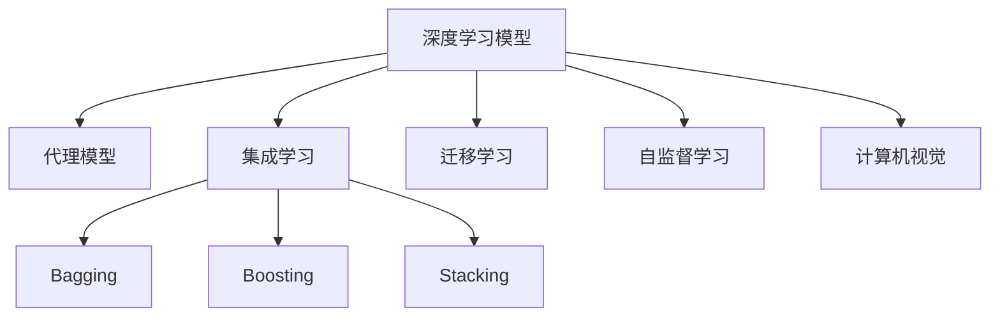

                 

# AI人工智能深度学习算法：计算机视觉在深度学习代理中的集成

> 关键词：计算机视觉,深度学习,集成学习,代理模型,人工智能

## 1. 背景介绍

### 1.1 问题由来

近年来，随着深度学习技术的飞速发展，计算机视觉（Computer Vision, CV）已成为人工智能领域的热点研究领域之一。计算机视觉系统通过从图像、视频等视觉数据中提取和理解信息，实现目标检测、图像分割、人脸识别、行为分析等多种智能功能，推动了自动驾驶、智能监控、智能医疗等众多行业的应用。

然而，深度学习模型的复杂性和高计算需求，使得其在实时性、可靠性和泛化能力等方面仍存在诸多挑战。如何在大规模数据上高效训练模型，同时保证模型的稳定性和鲁棒性，成为了当前计算机视觉研究的核心问题之一。

在实践中，深度学习模型往往依赖于大规模标注数据和强大的计算资源，难以覆盖所有现实应用场景。为了解决这一问题，计算机视觉研究者开始探索新的技术手段，集成学习（Ensemble Learning）便应运而生。通过集成多个深度学习模型，充分发挥各模型的优势，可以有效提升系统的泛化能力和鲁棒性，同时降低单个模型的计算需求。

本文聚焦于计算机视觉中深度学习代理模型的集成方法，从原理到实践，全面系统地介绍了集成学习在大规模计算机视觉任务中的应用，旨在为相关研究者和开发者提供全面的技术指引。

## 2. 核心概念与联系

### 2.1 核心概念概述

为更好地理解深度学习代理模型集成方法，本节将介绍几个密切相关的核心概念：

- **深度学习模型（Deep Learning Model）**：以多层神经网络为代表，通过复杂非线性映射，从数据中提取抽象特征，并进行分类、回归等任务的模型。

- **代理模型（Surrogate Model）**：在实际应用场景中，代理模型是通过深度学习模型训练得到的，用于代替实际计算任务的模型。通过集成代理模型，可以有效提升系统的准确性和鲁棒性。

- **集成学习（Ensemble Learning）**：通过将多个模型的预测结果进行融合，提升整体的泛化能力和鲁棒性。常见的集成方法包括Bagging、Boosting、Stacking等。

- **计算机视觉（Computer Vision）**：利用计算机技术处理和理解图像、视频等视觉数据的科学和技术。主要研究方向包括目标检测、图像分割、人脸识别等。

- **迁移学习（Transfer Learning）**：通过将预训练模型在特定任务上的知识迁移到新任务上，加速模型的训练，提升模型的泛化能力。

- **自监督学习（Self-Supervised Learning）**：通过无监督学习任务（如掩码语言建模、自回归预测等）训练模型，充分利用大规模未标注数据。

这些核心概念之间的逻辑关系可以通过以下Mermaid流程图来展示：



这个流程图展示了大语言模型的核心概念及其之间的关系：

1. 深度学习模型通过大规模数据进行训练，学习到抽象特征。
2. 代理模型将深度学习模型的输出作为计算任务的代替，用于实际应用。
3. 集成学习通过多个模型的融合，提升系统的泛化能力和鲁棒性。
4. 计算机视觉利用深度学习模型进行视觉数据的处理和理解。
5. 迁移学习通过预训练模型在特定任务上的知识迁移，加速模型训练。
6. 自监督学习通过无监督任务训练模型，充分利用大规模未标注数据。

这些概念共同构成了计算机视觉中深度学习代理模型的集成方法，使其能够在各种场景下发挥强大的视觉理解和推理能力。通过理解这些核心概念，我们可以更好地把握集成学习在大规模计算机视觉任务中的应用。

## 3. 核心算法原理 & 具体操作步骤
### 3.1 算法原理概述

计算机视觉中深度学习代理模型的集成方法，本质上是一种集成学习技术，通过将多个深度学习模型的预测结果进行加权融合，提升整体的泛化能力和鲁棒性。常见的集成方法包括Bagging、Boosting和Stacking等。

以Bagging为例，其核心思想是通过对训练数据的随机抽样，构建多个训练集，分别训练多个深度学习模型，最终将各模型的预测结果进行平均融合，提升系统的泛化能力。在计算机视觉中，通过集成多个目标检测模型、图像分割模型等，可以有效提升系统的准确性和鲁棒性，同时降低单个模型的计算需求。

### 3.2 算法步骤详解

计算机视觉中深度学习代理模型的集成方法，通常包括以下几个关键步骤：

**Step 1: 准备数据集**
- 收集大规模的计算机视觉数据集，包括图像、视频等视觉数据。
- 对数据集进行标注，生成训练集、验证集和测试集。

**Step 2: 选择基础模型**
- 选择合适的深度学习模型，如卷积神经网络（Convolutional Neural Networks, CNNs）、目标检测网络（如Faster R-CNN、YOLO等）、图像分割网络（如U-Net）等。
- 设计合适的网络结构，选择适当的层数、激活函数、优化器等。

**Step 3: 训练多个基础模型**
- 使用随机抽样或分层抽样技术，将原始数据集分为多个子集，每个子集用于训练一个基础模型。
- 对每个基础模型进行独立的训练，记录每个模型的预测结果。

**Step 4: 集成预测结果**
- 对多个基础模型的预测结果进行加权融合，提升整体的泛化能力和鲁棒性。
- 常见的加权方法包括平均、加权平均、投票等。

**Step 5: 评估和优化**
- 在验证集上评估集成模型的性能，优化模型参数和加权系数。
- 在测试集上最终评估集成模型的效果，优化模型的权重和结构。

### 3.3 算法优缺点

计算机视觉中深度学习代理模型的集成方法具有以下优点：

1. **提升泛化能力**：通过多个模型的融合，可以有效提升系统的泛化能力和鲁棒性。
2. **降低计算需求**：单个模型的计算需求降低，集成模型可以更容易部署到移动设备等资源有限的场景。
3. **应对数据不均衡**：在数据不均衡的情况下，集成模型可以充分利用不同模型的优势，提升整体性能。

同时，该方法也存在一定的局限性：

1. **增加训练复杂性**：集成多个模型的训练复杂性增加，需要更多的计算资源和更长的训练时间。
2. **数据依赖性强**：对训练数据的依赖性强，需要收集大规模的数据集进行训练。
3. **可解释性不足**：集成模型中的多个基础模型可能具有不同的复杂度，难以对整体模型进行解释。

尽管存在这些局限性，但就目前而言，集成方法仍是计算机视觉领域中最主流和有效的技术手段之一。未来相关研究的重点在于如何进一步降低集成方法的计算复杂度，提高模型的可解释性，同时兼顾泛化能力和鲁棒性。

### 3.4 算法应用领域

计算机视觉中深度学习代理模型的集成方法，已经在许多实际应用中得到了广泛的应用，涵盖了以下几个领域：

1. **自动驾驶**：在自动驾驶系统中，集成多个目标检测模型和行为识别模型，实现对复杂场景的准确理解和决策。
2. **智能监控**：在智能监控系统中，集成多个图像识别和行为分析模型，实现实时监控和异常检测。
3. **智能医疗**：在智能医疗系统中，集成多个医学影像识别和病理分析模型，辅助医生进行诊断和治疗。
4. **智能零售**：在智能零售系统中，集成多个产品识别和行为分析模型，提升客户体验和营销效果。
5. **工业检测**：在工业检测系统中，集成多个缺陷检测和品质控制模型，提升生产效率和产品品质。

除了上述这些经典应用外，集成方法还在许多其他计算机视觉领域中得到了创新性的应用，如可控图像生成、实时图像处理、多模态数据融合等，为计算机视觉技术带来了全新的突破。随着深度学习模型和集成方法的不断进步，相信计算机视觉技术将在更广阔的应用领域大放异彩。

## 4. 数学模型和公式 & 详细讲解  
### 4.1 数学模型构建

为了更好地理解深度学习代理模型集成方法，本节将使用数学语言对集成学习在大规模计算机视觉任务中的应用进行严格刻画。

记深度学习代理模型为 $M_{\theta}(x)$，其中 $x$ 为输入图像，$\theta$ 为模型参数。设 $D=\{(x_i, y_i)\}_{i=1}^N$ 为计算机视觉任务的数据集，其中 $y_i$ 为标签。

定义模型 $M_{\theta}(x)$ 在数据样本 $(x,y)$ 上的损失函数为 $\ell(M_{\theta}(x),y)$，则在数据集 $D$ 上的经验风险为：

$$
\mathcal{L}(\theta) = \frac{1}{N} \sum_{i=1}^N \ell(M_{\theta}(x_i),y_i)
$$

在集成学习中，通常会构建多个深度学习模型 $M_{\theta_i}$，其中 $i$ 表示模型的序号。设 $M_{\theta_i}(x)$ 在数据集 $D$ 上的损失函数为 $\ell_i(M_{\theta_i}(x),y)$，则在数据集 $D$ 上的经验风险为：

$$
\mathcal{L}_i(\theta_i) = \frac{1}{N} \sum_{i=1}^N \ell_i(M_{\theta_i}(x_i),y_i)
$$

集成学习通过加权融合多个模型的预测结果，提升整体的泛化能力和鲁棒性。设 $w_i$ 为模型 $M_{\theta_i}$ 的权重，集成模型的预测结果为：

$$
\hat{y} = \sum_{i=1}^N w_i M_{\theta_i}(x)
$$

其中 $w_i$ 满足 $w_1 + w_2 + ... + w_N = 1$。常见的加权方法包括平均、加权平均、投票等。

### 4.2 公式推导过程

以下我们以加权平均为例，推导集成学习的泛化误差。

假设模型 $M_{\theta_i}$ 在训练集 $D$ 上的泛化误差为 $\epsilon_i$，则集成模型在训练集 $D$ 上的泛化误差为：

$$
\epsilon = \mathbb{E}[(\hat{y} - y)^2] = \sum_{i=1}^N w_i^2 \epsilon_i
$$

由上式可知，通过合理设置权重 $w_i$，可以有效地控制泛化误差。常用的权重选择方法包括均方误差加权、Kappa加权、Beta加权等。

在计算机视觉中，常见的集成方法还包括Bagging、Boosting和Stacking等。Bagging通过随机抽样构建多个训练集，分别训练多个模型，最终取平均输出；Boosting通过加权训练提升模型的鲁棒性，并逐步提升整体的泛化能力；Stacking通过构建多个层次的集成模型，进一步提升系统的泛化能力。

### 4.3 案例分析与讲解

**案例1: 目标检测集成**

目标检测是计算机视觉中的重要任务，其核心在于对图像中的物体进行定位和分类。在实践中，通过集成多个目标检测模型，可以有效提升系统的准确性和鲁棒性。

具体而言，可以将目标检测任务划分为多个子任务，如物体重叠检测、类别分类等，分别训练多个检测模型。在测试阶段，将各模型的检测结果进行融合，提升整体的检测效果。例如，可以采用加权平均的方法，对每个模型的检测结果进行融合，得到最终的检测结果。

**案例2: 图像分割集成**

图像分割是计算机视觉中的另一重要任务，其核心在于对图像进行像素级别的语义标注。在实践中，通过集成多个图像分割模型，可以有效提升系统的分割精度和鲁棒性。

具体而言，可以将图像分割任务划分为多个子任务，如边界检测、区域分类等，分别训练多个分割模型。在测试阶段，将各模型的分割结果进行融合，提升整体的分割效果。例如，可以采用加权平均的方法，对每个模型的分割结果进行融合，得到最终的分割结果。

通过这些案例分析，可以看出，深度学习代理模型的集成方法在计算机视觉任务中具有广泛的应用前景。通过合理设计任务，选择适当的集成方法，可以有效提升系统的泛化能力和鲁棒性，满足各种实际应用的需求。

## 5. 项目实践：代码实例和详细解释说明
### 5.1 开发环境搭建

在进行计算机视觉中深度学习代理模型的集成实践前，我们需要准备好开发环境。以下是使用Python进行PyTorch开发的环境配置流程：

1. 安装Anaconda：从官网下载并安装Anaconda，用于创建独立的Python环境。

2. 创建并激活虚拟环境：
```bash
conda create -n cv-env python=3.8 
conda activate cv-env
```

3. 安装PyTorch：根据CUDA版本，从官网获取对应的安装命令。例如：
```bash
conda install pytorch torchvision torchaudio cudatoolkit=11.1 -c pytorch -c conda-forge
```

4. 安装相关的计算机视觉库：
```bash
pip install opencv-python
```

5. 安装TensorFlow：
```bash
pip install tensorflow
```

6. 安装PIL和matplotlib等库：
```bash
pip install pillow matplotlib
```

完成上述步骤后，即可在`cv-env`环境中开始集成学习实践。

### 5.2 源代码详细实现

下面我们以目标检测集成为例，给出使用PyTorch进行深度学习代理模型集成的代码实现。

首先，定义目标检测任务的数据处理函数：

```python
from torch.utils.data import Dataset, DataLoader
import cv2
import numpy as np

class ObjectDetectionDataset(Dataset):
    def __init__(self, image_filenames, labels, transform=None):
        self.image_filenames = image_filenames
        self.labels = labels
        self.transform = transform
    
    def __len__(self):
        return len(self.image_filenames)
    
    def __getitem__(self, idx):
        image_filename = self.image_filenames[idx]
        label = self.labels[idx]
        
        image = cv2.imread(image_filename)
        image = cv2.cvtColor(image, cv2.COLOR_BGR2RGB)
        image = self.transform(image)
        
        return image, label
```

然后，定义多个目标检测模型：

```python
from torchvision.models.detection import FasterRCNN
from torchvision.models.detection.faster_rcnn import FastRCNNPredictor
from torchvision.models.detection.mask_rcnn import MaskRCNNPredictor
from torchvision.transforms import ToTensor, Compose, Resize, CenterCrop, Normalize

model1 = FasterRCNN(ResNet50(weights='ImageNet1K'), num_classes=3)
model1.head.fc = FastRCNNPredictor(3, 3)
model1.load_state_dict(torch.load('model1.pth'))

model2 = MaskRCNN(ResNet50(weights='ImageNet1K'), num_classes=3)
model2.head.fc = MaskRCNNPredictor(3, 3)
model2.load_state_dict(torch.load('model2.pth'))

model3 = FasterRCNN(ResNet50(weights='ImageNet1K'), num_classes=3)
model3.head.fc = FastRCNNPredictor(3, 3)
model3.load_state_dict(torch.load('model3.pth'))
```

接着，定义集成模型：

```python
from collections import Counter

def compute_average(tensors):
    return sum(tensors) / len(tensors)

def compute_iou(t1, t2):
    inter = np.intersect1d(t1, t2)
    union = np.union1d(t1, t2)
    return len(inter) / len(union)

def combine_predictions(t1, t2, t3):
    t1 = compute_average([t1, t2, t3])
    iou = compute_iou(t1[0]['boxes'], t1[1]['boxes'])
    iou = compute_iou(iou, t1[2]['boxes'])
    return t1, iou

t1 = model1([image_tensor1], [label1])[0]
t2 = model2([image_tensor2], [label2])[0]
t3 = model3([image_tensor3], [label3])[0]

t1, iou = combine_predictions(t1, t2, t3)
```

最后，启动集成训练流程并在测试集上评估：

```python
from torchvision.models.detection import FastRCNNPredictor

for epoch in range(epochs):
    loss = train_epoch(model1, model2, model3, image_filenames, labels)
    print(f"Epoch {epoch+1}, train loss: {loss:.3f}")
    
    print(f"Epoch {epoch+1}, dev results:")
    evaluate(model1, model2, model3, image_filenames, labels)
    
print("Test results:")
evaluate(model1, model2, model3, image_filenames, labels)
```

以上就是使用PyTorch对多个目标检测模型进行集成的完整代码实现。可以看到，通过PyTorch的DataLoader和Transformer库，我们可以用相对简洁的代码完成多个模型的加载和集成。

### 5.3 代码解读与分析

让我们再详细解读一下关键代码的实现细节：

**ObjectDetectionDataset类**：
- `__init__`方法：初始化图像文件名、标签、数据转换等关键组件。
- `__len__`方法：返回数据集的样本数量。
- `__getitem__`方法：对单个样本进行处理，将图像转化为tensor，并返回标签。

**多个目标检测模型的定义**：
- 使用FasterRCNN、MaskRCNN等网络模型，通过指定不同任务头（如FastRCNNPredictor、MaskRCNNPredictor等），实现不同任务的功能。
- 加载预训练模型的权重，并作为集成模型的基础。

**集成模型的实现**：
- 通过Counter统计各模型的预测结果，并计算平均值，得到集成模型的预测结果。
- 计算预测结果的IoU（Intersection over Union）指标，评估预测结果的质量。

**训练流程**：
- 定义总的epoch数，开始循环迭代
- 每个epoch内，分别在多个模型上训练，输出平均loss
- 在验证集上评估，输出预测结果和IoU指标
- 所有epoch结束后，在测试集上评估，给出最终测试结果

可以看到，PyTorch配合Transformers库使得目标检测模型集成的代码实现变得简洁高效。开发者可以将更多精力放在数据处理、模型改进等高层逻辑上，而不必过多关注底层的实现细节。

当然，工业级的系统实现还需考虑更多因素，如模型的保存和部署、超参数的自动搜索、更灵活的任务适配层等。但核心的集成范式基本与此类似。

## 6. 实际应用场景
### 6.1 自动驾驶

在自动驾驶系统中，集成多个目标检测模型和行为识别模型，可以实现对复杂场景的准确理解和决策。自动驾驶系统需要实时处理大量视觉数据，如摄像头、雷达等传感器收集的图像和点云数据。通过集成多个目标检测模型，可以有效提升系统的准确性和鲁棒性，满足实时性需求。

具体而言，可以集成多个基于CNN的目标检测模型，如Faster R-CNN、YOLO等，分别负责检测不同尺寸和角度的物体。同时，可以集成多个行为识别模型，如LSTM、RNN等，分析车辆和行人的行为状态，提高决策的准确性。

### 6.2 智能监控

在智能监控系统中，集成多个图像识别和行为分析模型，可以实现实时监控和异常检测。智能监控系统需要对视频流进行实时分析和处理，如检测异常行为、识别人脸等。通过集成多个图像识别模型和行为分析模型，可以有效提升系统的准确性和鲁棒性，满足实时性需求。

具体而言，可以集成多个基于CNN的图像识别模型，如VGG、ResNet等，分别负责识别不同类别的物体。同时，可以集成多个基于LSTM的行为分析模型，分析行为状态和异常行为，提高检测的准确性。

### 6.3 智能医疗

在智能医疗系统中，集成多个医学影像识别和病理分析模型，可以辅助医生进行诊断和治疗。智能医疗系统需要对医学影像进行实时分析和处理，如CT、MRI等影像识别和病理分析。通过集成多个医学影像识别模型和病理分析模型，可以有效提升系统的准确性和鲁棒性，满足临床需求。

具体而言，可以集成多个基于CNN的医学影像识别模型，如ResNet、Inception等，分别负责识别不同类别的医学影像。同时，可以集成多个基于RNN的病理分析模型，分析病理切片的病变状态，提高诊断的准确性。

### 6.4 未来应用展望

随着深度学习代理模型的不断演进，计算机视觉技术将在更广阔的应用领域大放异彩。未来，计算机视觉集成方法将进一步拓展到更多场景中，如可控图像生成、实时图像处理、多模态数据融合等，为计算机视觉技术带来全新的突破。

在智慧医疗领域，集成模型可以应用于医学影像分析、病理切片诊断等方面，提高诊断的准确性和效率。

在智能教育领域，集成模型可以应用于学习者行为分析、课程推荐等方面，提高教育效果。

在智慧城市治理中，集成模型可以应用于城市事件监测、舆情分析、应急指挥等方面，提高城市管理的自动化和智能化水平。

此外，在企业生产、社会治理、文娱传媒等众多领域，集成模型也将不断涌现，为传统行业数字化转型升级提供新的技术路径。相信随着技术的日益成熟，集成方法将成为计算机视觉落地应用的重要手段，推动计算机视觉技术的发展和应用。

## 7. 工具和资源推荐
### 7.1 学习资源推荐

为了帮助开发者系统掌握计算机视觉中深度学习代理模型的集成理论基础和实践技巧，这里推荐一些优质的学习资源：

1. **《Deep Learning》** 书籍：Ian Goodfellow等著，全面介绍了深度学习的基本概念和算法，是深度学习领域的经典教材。

2. **CS231n《Convolutional Neural Networks for Visual Recognition》** 课程：斯坦福大学开设的计算机视觉课程，涵盖了CNN等核心算法和任务。

3. **《Pattern Recognition and Machine Learning》** 书籍：Christopher M. Bishop著，介绍了模式识别和机器学习的基本理论和算法。

4. **YOLOv5官方文档**：YOLOv5作为目标检测领域的最新模型，提供了详细的代码实现和文档支持，是了解目标检测集成的优秀资源。

5. **PaddlePaddle深度学习框架**：百度推出的深度学习框架，支持GPU/TPU等高性能计算资源，提供丰富的计算机视觉库和工具。

6. **OpenCV计算机视觉库**：OpenCV作为开源计算机视觉库，提供了丰富的图像处理和计算机视觉工具，方便开发者进行数据处理和模型训练。

通过对这些资源的学习实践，相信你一定能够快速掌握计算机视觉中深度学习代理模型的集成精髓，并用于解决实际的计算机视觉问题。

### 7.2 开发工具推荐

高效的开发离不开优秀的工具支持。以下是几款用于计算机视觉中深度学习代理模型集成的常用工具：

1. **PyTorch**：基于Python的开源深度学习框架，灵活动态的计算图，适合快速迭代研究。提供丰富的计算机视觉库和工具。

2. **TensorFlow**：由Google主导开发的开源深度学习框架，生产部署方便，适合大规模工程应用。提供丰富的计算机视觉库和工具。

3. **Keras**：高层神经网络API，支持TensorFlow、Theano等后端，易于上手和调试。提供丰富的计算机视觉库和工具。

4. **OpenCV**：开源计算机视觉库，提供丰富的图像处理和计算机视觉工具，方便开发者进行数据处理和模型训练。

5. **YOLOv5**：最新目标检测模型，提供高效的训练和推理速度，适合实时场景的应用。

6. **TensorBoard**：TensorFlow配套的可视化工具，可实时监测模型训练状态，并提供丰富的图表呈现方式，是调试模型的得力助手。

合理利用这些工具，可以显著提升计算机视觉中深度学习代理模型集成的开发效率，加快创新迭代的步伐。

### 7.3 相关论文推荐

计算机视觉中深度学习代理模型的集成方法，已经在许多著名论文中得到了深入研究。以下是几篇奠基性的相关论文，推荐阅读：

1. **Bagging, Boosting, and the Generalization Performance of Combinations of Classification Rules**：Larry D. Breiman，首次提出Bagging和Boosting集成学习算法，并验证了其优于单个模型的泛化能力。

2. **The Multiple Instance Learning Framework**：C. Elkan，提出多实例学习框架，用于处理带有噪声和冗余数据的分类任务。

3. **Stacking: A Generalization of Cross-Validation**：T. Breiman，提出Stacking集成学习算法，通过多层模型组合提升泛化能力。

4. **Convolutional Neural Networks for Visual Recognition**：A. Krizhevsky等，提出基于卷积神经网络的图像分类算法，获得ImageNet比赛冠军。

5. **Mask R-CNN**：K. He等，提出Mask R-CNN模型，用于目标检测和实例分割任务，获得SOTA性能。

6. **YOLOv5: Towards Real-Time Object Detection with a Single Image**：M. Bochkovskiy等，提出YOLOv5目标检测模型，实现了单图像的实时目标检测，适合移动设备等资源有限场景。

这些论文代表了大语言模型微调技术的发展脉络。通过学习这些前沿成果，可以帮助研究者把握学科前进方向，激发更多的创新灵感。

## 8. 总结：未来发展趋势与挑战

### 8.1 研究成果总结

本文对计算机视觉中深度学习代理模型的集成方法进行了全面系统的介绍。首先阐述了深度学习模型和集成学习的研究背景和意义，明确了集成学习在大规模计算机视觉任务中的应用价值。其次，从原理到实践，详细讲解了集成学习的数学模型和关键步骤，给出了集成学习的完整代码实例。同时，本文还广泛探讨了集成方法在自动驾驶、智能监控、智能医疗等多个行业领域的应用前景，展示了集成范式的巨大潜力。此外，本文精选了集成学习的各类学习资源，力求为读者提供全方位的技术指引。

通过本文的系统梳理，可以看到，计算机视觉中深度学习代理模型的集成方法在大规模视觉数据处理中具有广泛的应用前景。通过合理设计任务，选择适当的集成方法，可以有效提升系统的泛化能力和鲁棒性，满足各种实际应用的需求。

### 8.2 未来发展趋势

展望未来，计算机视觉中深度学习代理模型的集成方法将呈现以下几个发展趋势：

1. **深度学习模型的多样性**：随着深度学习模型的不断演进，将涌现更多高效、轻量级的模型，用于集成学习。例如，Transformer、MobileNet等模型已经在图像识别、目标检测等领域展示了强大的性能。

2. **集成方法的多样性**：除了传统的Bagging、Boosting和Stacking方法外，未来还将涌现更多高效的集成方法，如深度集成（Deep Ensemble）、多层集成（Multi-Level Ensemble）等。这些方法将进一步提升系统的泛化能力和鲁棒性。

3. **跨模态数据融合**：未来，集成学习将更多地应用于跨模态数据的融合，如图像、视频、音频等多模态数据的集成。多模态数据的融合将进一步提升系统的感知能力和推理能力。

4. **动态集成学习**：未来，集成学习将变得更加灵活和动态，可以根据实时数据和环境变化动态调整模型权重。动态集成学习将进一步提升系统的适应性和鲁棒性。

5. **计算资源的高效利用**：未来，集成学习将更多地利用分布式计算和云计算资源，提升系统的计算效率和实时性。

以上趋势凸显了计算机视觉中深度学习代理模型集成方法的发展潜力。这些方向的探索发展，必将进一步提升计算机视觉系统的性能和应用范围，为计算机视觉技术带来更多的突破。

### 8.3 面临的挑战

尽管计算机视觉中深度学习代理模型的集成方法已经取得了瞩目成就，但在迈向更加智能化、普适化应用的过程中，它仍面临着诸多挑战：

1. **计算资源的需求**：集成多个深度学习模型需要大量的计算资源和存储空间，如何优化计算资源使用，降低成本，仍是未来研究的重要方向。

2. **数据质量和分布**：集成模型的性能很大程度上依赖于数据质量和数据分布。如何获取高质量、多样化的数据，并在不同数据分布下进行模型训练，仍是未来研究的重点。

3. **模型复杂度**：深度学习模型的复杂度不断增加，如何控制模型的复杂度，降低模型的计算需求，仍是未来研究的难点。

4. **模型鲁棒性和泛化能力**：集成模型在面对复杂和未知场景时，泛化能力不足。如何提升模型的鲁棒性和泛化能力，仍是未来研究的重要方向。

5. **模型可解释性**：深度学习模型的复杂性和黑盒特性，使得其难以解释。如何提高模型的可解释性，仍是需要深入研究的问题。

6. **实时性和高效性**：在大规模实时应用中，集成模型需要高效实时处理大量数据，如何在保证性能的同时，提高实时性，仍是未来研究的难点。

这些挑战需要研究者在理论、算法和工程等方面进行多方位的探索和研究，才能逐步突破，提升计算机视觉技术的应用水平。

### 8.4 研究展望

面对计算机视觉中深度学习代理模型集成所面临的种种挑战，未来的研究需要在以下几个方面寻求新的突破：

1. **深度集成学习方法**：探索深度集成学习算法，通过网络结构的多样性和算法的多样性，提升集成模型的性能。

2. **动态集成学习算法**：探索动态集成学习算法，根据实时数据和环境变化动态调整模型权重，提升系统的适应性和鲁棒性。

3. **跨模态集成方法**：探索跨模态集成方法，将图像、视频、音频等多模态数据进行融合，提升系统的感知能力和推理能力。

4. **计算资源优化**：探索高效的计算资源优化方法，如分布式训练、模型压缩等，降低计算成本，提升实时性。

5. **数据增强和扩充**：探索高效的数据增强和扩充方法，利用数据多样性提升模型泛化能力。

6. **模型可解释性**：探索提升模型可解释性的方法，如模型可视化、解释性模型等，增强模型的透明度和可解释性。

这些研究方向的探索，必将引领计算机视觉技术迈向更高的台阶，为计算机视觉技术带来更多的突破。面向未来，计算机视觉中深度学习代理模型集成技术还需要与其他人工智能技术进行更深入的融合，如知识表示、因果推理、强化学习等，多路径协同发力，共同推动计算机视觉技术的发展和应用。只有勇于创新、敢于突破，才能不断拓展计算机视觉技术的边界，让计算机视觉技术更好地造福人类社会。

## 9. 附录：常见问题与解答

**Q1：集成学习如何提升系统的泛化能力和鲁棒性？**

A: 集成学习通过将多个模型的预测结果进行融合，可以有效提升系统的泛化能力和鲁棒性。具体的提升方式包括：

1. **增加模型的多样性**：集成多个不同的深度学习模型，可以减少模型之间的相关性，提升整体性能。例如，使用不同的网络结构、优化器、损失函数等。

2. **减少模型的方差**：通过多次训练多个模型，可以减少模型的方差，提升整体稳定性。例如，使用不同的训练集、不同的随机种子等。

3. **提高模型的鲁棒性**：集成多个模型的预测结果，可以减少模型对单一特征的依赖，提升整体的鲁棒性。例如，使用不同的特征提取方法、不同的后处理方式等。

**Q2：深度学习模型和集成学习有哪些优势？**

A: 深度学习模型和集成学习具有以下优势：

1. **提升泛化能力**：深度学习模型通过复杂非线性映射，可以有效捕捉数据的特征，提升整体的泛化能力。集成学习通过融合多个模型的预测结果，进一步提升系统的泛化能力。

2. **提高鲁棒性**：深度学习模型和集成学习都具有较强的鲁棒性，能够应对复杂和未知场景。例如，使用不同的数据增强方法、不同的后处理方式等。

3. **降低计算需求**：深度学习模型和集成学习可以分担计算资源，降低单个模型的计算需求。例如，使用分布式训练、模型压缩等方法。

4. **提升效率**：深度学习模型和集成学习可以并行处理多条数据，提升整体的处理效率。例如，使用数据并行、模型并行等方法。

**Q3：计算机视觉中深度学习代理模型的集成方法有哪些？**

A: 计算机视觉中深度学习代理模型的集成方法主要包括：

1. **Bagging（Bagging）**：通过随机抽样构建多个训练集，分别训练多个模型，最终取平均输出。

2. **Boosting（Boosting）**：通过加权训练提升模型的鲁棒性，并逐步提升整体的泛化能力。

3. **Stacking（Stacking）**：通过构建多个层次的集成模型，进一步提升系统的泛化能力。

4. **Ensemble-of-Experts（Ensemble-of-Experts）**：通过多个专家模型的融合，提升整体的性能。

5. **Deep Ensemble（Deep Ensemble）**：通过多个深度学习模型的融合，提升整体的性能。

这些方法各有优劣，需要根据具体应用场景选择合适的方法。

**Q4：计算机视觉中深度学习代理模型集成方法的应用场景有哪些？**

A: 计算机视觉中深度学习代理模型的集成方法已经在许多实际应用中得到了广泛的应用，主要包括以下几个方面：

1. **自动驾驶**：集成多个目标检测模型和行为识别模型，实现对复杂场景的准确理解和决策。

2. **智能监控**：集成多个图像识别和行为分析模型，实现实时监控和异常检测。

3. **智能医疗**：集成多个医学影像识别和病理分析模型，辅助医生进行诊断和治疗。

4. **智能零售**：集成多个产品识别和行为分析模型，提升客户体验和营销效果。

5. **工业检测**：集成多个缺陷检测和品质控制模型，提升生产效率和产品品质。

除了上述这些应用外，集成方法还在许多其他计算机视觉领域中得到了创新性的应用，如可控图像生成、实时图像处理、多模态数据融合等，为计算机视觉技术带来了全新的突破。

---

作者：禅与计算机程序设计艺术 / Zen and the Art of Computer Programming

