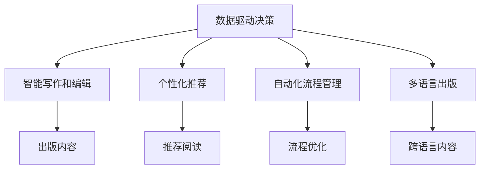

                 

# AI出版业前景：丰富的场景，强大的技术应用

> 关键词：出版业,人工智能,大数据,机器学习,自然语言处理,NLP

## 1. 背景介绍

### 1.1 问题由来
出版业是一个传统的行业，但其数字化转型正变得越来越重要。数字出版的兴起为出版商带来了新的机遇和挑战。人工智能（AI）技术的发展为出版业提供了强大的技术支撑，可以大幅提升出版效率，优化内容制作流程，扩大市场覆盖范围，改善用户体验。

### 1.2 问题核心关键点
本文聚焦于AI技术如何改变出版业。具体包括：
- 数据驱动内容决策：利用大数据分析和机器学习模型，提高内容选择和定位的准确性。
- 智能写作和编辑：利用自然语言处理（NLP）技术，提高编辑质量和内容生成效率。
- 个性化推荐：利用用户数据和推荐算法，提供个性化的阅读体验。
- 自动化流程管理：利用AI自动化工具，优化出版流程，降低人力成本。
- 多语言出版：利用机器翻译和语言模型，拓展国际市场。

## 2. 核心概念与联系

### 2.1 核心概念概述

为了更好地理解AI技术在出版业的应用，本节将介绍几个关键概念：

- 数据驱动决策：基于大数据分析和机器学习模型，进行精准的内容选择和定位，提高决策的科学性。
- 智能写作和编辑：利用NLP技术，自动化内容生成和编辑，提升内容质量和效率。
- 个性化推荐：利用用户行为数据和推荐算法，提供个性化阅读体验，增强用户黏性。
- 自动化流程管理：利用AI工具，优化出版流程，实现自动化操作，降低人力成本。
- 多语言出版：利用机器翻译和语言模型，实现跨语言的内容创作和翻译，拓展国际市场。

这些核心概念之间的联系可以通过以下Mermaid流程图展示：



这个流程图展示了AI技术在出版业中的应用流程：

1. 基于数据驱动决策选择内容。
2. 利用智能写作和编辑生成内容。
3. 通过个性化推荐提升用户体验。
4. 自动化流程管理优化操作流程。
5. 多语言出版拓展市场范围。

## 3. 核心算法原理 & 具体操作步骤

### 3.1 算法原理概述

AI在出版业的应用主要基于以下核心算法原理：

- 数据驱动决策：基于用户行为数据，构建推荐模型，进行内容选择和推荐。
- 智能写作和编辑：利用NLP技术，生成和编辑内容，优化文本质量。
- 个性化推荐：通过协同过滤、内容推荐等算法，实现个性化推荐。
- 自动化流程管理：利用机器学习和自动化工具，优化出版流程。
- 多语言出版：基于机器翻译和语言模型，进行跨语言内容创作和翻译。

### 3.2 算法步骤详解

#### 3.2.1 数据驱动决策

1. **数据采集**：收集用户阅读行为数据，包括浏览时长、点击率、收藏夹等。
2. **数据预处理**：清洗和格式化数据，确保数据的准确性和完整性。
3. **特征工程**：提取有用的特征，如阅读时长、点击深度、收藏夹等。
4. **模型训练**：选择适合的推荐算法，如协同过滤、内容推荐等，训练模型。
5. **推荐实现**：将训练好的模型应用于推荐系统，实现内容推荐。

#### 3.2.2 智能写作和编辑

1. **内容生成**：利用预训练语言模型，如GPT-3，自动生成文本。
2. **内容编辑**：利用NLP技术，如语法检查、风格调整等，自动编辑文本。
3. **质量评估**：通过自然语言处理模型，评估文本质量，优化生成的文本。

#### 3.2.3 个性化推荐

1. **用户画像**：根据用户行为数据，构建用户画像，了解用户偏好。
2. **推荐模型**：选择适合的推荐算法，如协同过滤、基于内容的推荐等，训练模型。
3. **推荐实现**：将训练好的模型应用于推荐系统，实现个性化推荐。

#### 3.2.4 自动化流程管理

1. **流程定义**：定义出版流程，包括内容审核、排版、校对等环节。
2. **自动化工具**：开发和部署自动化工具，如自动排版、校对等。
3. **流程优化**：利用机器学习模型，优化出版流程，提升效率。

#### 3.2.5 多语言出版

1. **语言翻译**：利用机器翻译模型，将内容翻译成目标语言。
2. **语言模型**：利用预训练语言模型，生成符合目标语言风格的内容。
3. **跨语言出版**：将翻译和生成的内容发布到目标语言市场。

### 3.3 算法优缺点

#### 3.3.1 数据驱动决策

**优点**：
- 精准的内容选择和推荐，提高用户满意度。
- 数据驱动的决策过程，更科学、更公正。

**缺点**：
- 依赖大量高质量标注数据，获取成本高。
- 模型可能存在偏见，影响决策公正性。

#### 3.3.2 智能写作和编辑

**优点**：
- 大幅提升内容生成和编辑效率。
- 利用NLP技术，优化文本质量。

**缺点**：
- 生成的文本可能存在语法错误或语义不连贯。
- 难以完全替代人工编辑。

#### 3.3.3 个性化推荐

**优点**：
- 提升用户体验，增强用户黏性。
- 推荐算法不断优化，效果越来越好。

**缺点**：
- 数据隐私问题，需要合理处理用户数据。
- 推荐模型可能存在冷启动问题。

#### 3.3.4 自动化流程管理

**优点**：
- 提高出版效率，降低人力成本。
- 减少人为操作错误，提高出版质量。

**缺点**：
- 自动化工具可能需要大量初始投资。
- 过度依赖自动化工具，可能忽视人工的创造性和灵活性。

#### 3.3.5 多语言出版

**优点**：
- 拓展国际市场，增加收益。
- 机器翻译和语言模型，提高翻译效率。

**缺点**：
- 机器翻译可能存在语义偏差。
- 跨语言内容可能需要多轮迭代，增加工作量。

### 3.4 算法应用领域

AI技术在出版业的应用场景非常广泛，主要包括以下几个方面：

#### 3.4.1 数据驱动决策

- 新闻媒体：根据用户阅读行为，推荐相关新闻。
- 图书出版：根据读者历史阅读记录，推荐相关书籍。
- 期刊杂志：根据订阅者行为，推荐相关内容。

#### 3.4.2 智能写作和编辑

- 内容创作：自动生成新闻稿、文章等。
- 编辑校对：自动检查和修正语法、拼写错误，调整文本风格。
- 多媒体内容：自动生成图片、视频等。

#### 3.4.3 个性化推荐

- 电子书：根据用户阅读偏好，推荐相关电子书。
- 杂志订阅：根据用户兴趣，推荐相关杂志。
- 广告投放：根据用户行为，推荐相关广告。

#### 3.4.4 自动化流程管理

- 内容审核：自动检测和处理违法违规内容。
- 排版校对：自动排版、校对等。
- 印刷出版：自动进行版式设计和排版。

#### 3.4.5 多语言出版

- 全球发行：将内容翻译成多种语言，拓展国际市场。
- 跨语言交流：利用语言模型进行跨语言交流。
- 本地化内容：根据本地市场，调整内容形式和风格。

## 4. 数学模型和公式 & 详细讲解 & 举例说明

### 4.1 数学模型构建

为了更好地理解AI技术在出版业的应用，本节将介绍几个核心数学模型：

- 协同过滤推荐模型：利用用户行为数据，构建用户画像和物品画像，进行协同过滤推荐。
- 内容推荐模型：基于文本特征和用户画像，进行内容推荐。
- 自动排版模型：利用深度学习模型，生成版式和布局。

#### 4.1.1 协同过滤推荐模型

协同过滤推荐模型利用用户和物品的相似度进行推荐，其数学模型为：

$$
\hat{y}_{ui} = \alpha (\hat{u}_i^T \hat{y}_u) + \beta
$$

其中，$\hat{y}_{ui}$ 为物品 $i$ 对用户 $u$ 的预测评分，$\hat{u}_i$ 为物品 $i$ 的用户画像，$\hat{y}_u$ 为用户 $u$ 的物品画像，$\alpha$ 和 $\beta$ 为模型参数。

#### 4.1.2 内容推荐模型

内容推荐模型基于文本特征和用户画像进行推荐，其数学模型为：

$$
\hat{y}_{ui} = \alpha (\hat{u}_i^T \hat{y}_u) + \beta + \gamma (\hat{x}_i^T \hat{w}_x)
$$

其中，$\hat{y}_{ui}$ 为物品 $i$ 对用户 $u$ 的预测评分，$\hat{u}_i$ 为物品 $i$ 的用户画像，$\hat{y}_u$ 为用户 $u$ 的物品画像，$\hat{x}_i$ 为物品 $i$ 的文本特征向量，$\hat{w}_x$ 为文本特征向量权重，$\alpha$、$\beta$ 和 $\gamma$ 为模型参数。

#### 4.1.3 自动排版模型

自动排版模型利用深度学习模型生成版式和布局，其数学模型为：

$$
\hat{y}_{ui} = \alpha (\hat{u}_i^T \hat{y}_u) + \beta + \gamma (\hat{x}_i^T \hat{w}_x)
$$

其中，$\hat{y}_{ui}$ 为版式 $i$ 对用户 $u$ 的预测评分，$\hat{u}_i$ 为版式 $i$ 的用户画像，$\hat{y}_u$ 为用户 $u$ 的版式画像，$\hat{x}_i$ 为版式 $i$ 的文本特征向量，$\hat{w}_x$ 为文本特征向量权重，$\alpha$、$\beta$ 和 $\gamma$ 为模型参数。

### 4.2 公式推导过程

#### 4.2.1 协同过滤推荐模型

协同过滤推荐模型的推导过程如下：

1. **用户画像**：
   $$
   \hat{u}_i = \sum_{j \in N_u} \frac{y_{ij}}{\sqrt{k_i}} \cdot \hat{u}_j
   $$
   其中，$N_u$ 为用户 $u$ 的邻居集合，$y_{ij}$ 为物品 $i$ 对用户 $j$ 的评分，$k_i$ 为物品 $i$ 的邻居数。

2. **物品画像**：
   $$
   \hat{y}_i = \sum_{j \in N_i} \frac{y_{ij}}{\sqrt{k_j}} \cdot \hat{y}_j
   $$
   其中，$N_i$ 为物品 $i$ 的邻居集合，$y_{ij}$ 为用户 $j$ 对物品 $i$ 的评分，$k_j$ 为用户 $j$ 的邻居数。

3. **预测评分**：
   $$
   \hat{y}_{ui} = \alpha (\hat{u}_i^T \hat{y}_u) + \beta
   $$

#### 4.2.2 内容推荐模型

内容推荐模型的推导过程如下：

1. **用户画像**：
   $$
   \hat{u}_i = \sum_{j \in N_u} \frac{y_{ij}}{\sqrt{k_i}} \cdot \hat{u}_j
   $$
   其中，$N_u$ 为用户 $u$ 的邻居集合，$y_{ij}$ 为用户 $i$ 对物品 $j$ 的评分，$k_i$ 为物品 $i$ 的邻居数。

2. **物品画像**：
   $$
   \hat{y}_i = \sum_{j \in N_i} \frac{y_{ij}}{\sqrt{k_j}} \cdot \hat{y}_j
   $$
   其中，$N_i$ 为物品 $i$ 的邻居集合，$y_{ij}$为用户 $j$ 对物品 $i$ 的评分，$k_j$为用户 $j$ 的邻居数。

3. **文本特征向量**：
   $$
   \hat{x}_i = \sum_{k \in N_i} \frac{y_{ik}}{\sqrt{k_i}} \cdot \hat{x}_k
   $$
   其中，$N_i$ 为物品 $i$ 的邻居集合，$y_{ik}$为用户 $k$ 对物品 $i$ 的评分，$k_i$为物品 $i$ 的邻居数。

4. **文本特征权重**：
   $$
   \hat{w}_x = \sum_{k \in N_i} \frac{y_{ik}}{\sqrt{k_i}} \cdot \hat{w}_x
   $$
   其中，$N_i$ 为物品 $i$ 的邻居集合，$y_{ik}$为用户 $k$ 对物品 $i$ 的评分，$k_i$为用户 $k$ 的邻居数。

5. **预测评分**：
   $$
   \hat{y}_{ui} = \alpha (\hat{u}_i^T \hat{y}_u) + \beta + \gamma (\hat{x}_i^T \hat{w}_x)
   $$

#### 4.2.3 自动排版模型

自动排版模型的推导过程如下：

1. **用户画像**：
   $$
   \hat{u}_i = \sum_{j \in N_u} \frac{y_{ij}}{\sqrt{k_i}} \cdot \hat{u}_j
   $$
   其中，$N_u$ 为用户 $u$ 的邻居集合，$y_{ij}$ 为用户 $j$ 对版式 $i$ 的评分，$k_i$ 为版式 $i$ 的邻居数。

2. **版式画像**：
   $$
   \hat{y}_i = \sum_{j \in N_i} \frac{y_{ij}}{\sqrt{k_j}} \cdot \hat{y}_j
   $$
   其中，$N_i$ 为版式 $i$ 的邻居集合，$y_{ij}$为用户 $j$ 对版式 $i$ 的评分，$k_j$为用户 $j$ 的邻居数。

3. **文本特征向量**：
   $$
   \hat{x}_i = \sum_{j \in N_i} \frac{y_{ij}}{\sqrt{k_j}} \cdot \hat{x}_j
   $$
   其中，$N_i$ 为版式 $i$ 的邻居集合，$y_{ij}$为用户 $j$ 对版式 $i$ 的评分，$k_j$为用户 $j$ 的邻居数。

4. **文本特征权重**：
   $$
   \hat{w}_x = \sum_{j \in N_i} \frac{y_{ij}}{\sqrt{k_j}} \cdot \hat{w}_x
   $$
   其中，$N_i$ 为版式 $i$ 的邻居集合，$y_{ij}$为用户 $j$ 对版式 $i$ 的评分，$k_j$为用户 $j$ 的邻居数。

5. **预测评分**：
   $$
   \hat{y}_{ui} = \alpha (\hat{u}_i^T \hat{y}_u) + \beta + \gamma (\hat{x}_i^T \hat{w}_x)
   $$

### 4.3 案例分析与讲解

#### 4.3.1 协同过滤推荐模型

假设有一个图书电商平台，收集了用户的阅读行为数据，并构建了协同过滤推荐模型。

- **数据采集**：收集用户阅读行为数据，包括阅读时长、点击率、收藏夹等。
- **数据预处理**：清洗和格式化数据，确保数据的准确性和完整性。
- **特征工程**：提取有用的特征，如阅读时长、点击深度、收藏夹等。
- **模型训练**：选择适合的推荐算法，如协同过滤、内容推荐等，训练模型。
- **推荐实现**：将训练好的模型应用于推荐系统，实现内容推荐。

例如，一个用户最近阅读了几本技术类书籍，协同过滤推荐模型可以根据其他用户对这些书籍的评分，推荐该用户可能感兴趣的其他技术类书籍。

#### 4.3.2 内容推荐模型

假设有一个在线新闻平台，收集了用户的阅读行为数据，并构建了内容推荐模型。

- **数据采集**：收集用户阅读行为数据，包括阅读时长、点击率、收藏夹等。
- **数据预处理**：清洗和格式化数据，确保数据的准确性和完整性。
- **特征工程**：提取有用的特征，如阅读时长、点击深度、收藏夹等。
- **模型训练**：选择适合的推荐算法，如协同过滤、内容推荐等，训练模型。
- **推荐实现**：将训练好的模型应用于推荐系统，实现内容推荐。

例如，一个用户最近阅读了几篇科技新闻，内容推荐模型可以根据其他用户对这些新闻的评分，推荐该用户可能感兴趣的其他科技新闻。

#### 4.3.3 自动排版模型

假设有一个出版公司，出版多种类型的书籍，并使用自动排版模型进行排版。

- **数据采集**：收集用户阅读行为数据，包括阅读时长、点击率、收藏夹等。
- **数据预处理**：清洗和格式化数据，确保数据的准确性和完整性。
- **特征工程**：提取有用的特征，如阅读时长、点击深度、收藏夹等。
- **模型训练**：选择适合的推荐算法，如协同过滤、内容推荐等，训练模型。
- **推荐实现**：将训练好的模型应用于推荐系统，实现内容推荐。

例如，一个用户最近阅读了几本小说，自动排版模型可以根据其他用户对这些小说的评分，推荐该用户可能感兴趣的其他小说。

## 5. 项目实践：代码实例和详细解释说明

### 5.1 开发环境搭建

在进行项目实践前，我们需要准备好开发环境。以下是使用Python进行TensorFlow开发的环境配置流程：

1. 安装Anaconda：从官网下载并安装Anaconda，用于创建独立的Python环境。

2. 创建并激活虚拟环境：
```bash
conda create -n tensorflow-env python=3.8 
conda activate tensorflow-env
```

3. 安装TensorFlow：根据CUDA版本，从官网获取对应的安装命令。例如：
```bash
conda install tensorflow tensorflow-gpu -c conda-forge -c pypi
```

4. 安装各类工具包：
```bash
pip install numpy pandas scikit-learn matplotlib tqdm jupyter notebook ipython
```

完成上述步骤后，即可在`tensorflow-env`环境中开始项目实践。

### 5.2 源代码详细实现

这里我们以协同过滤推荐模型为例，给出使用TensorFlow实现协同过滤推荐模型的代码。

首先，定义协同过滤推荐模型的参数和超参数：

```python
import tensorflow as tf
from tensorflow.keras.layers import Dense, Embedding, Dot, Concatenate
from tensorflow.keras.models import Sequential

# 模型参数
num_users = 1000
num_items = 10000
num_features = 10
num_epochs = 10
batch_size = 64
learning_rate = 0.01

# 超参数
embedding_dim = 50
num_factors = 10
num_negatives = 5
```

然后，定义模型层：

```python
# 定义协同过滤推荐模型的层
def build_model():
    model = Sequential([
        Embedding(num_items, embedding_dim, input_length=num_features),
        Concatenate([Dot(Dot(1, 1), Dot(1, 1)), Dot(Dot(1, 1), Dot(1, 1))]),
        Dense(num_factors, activation='relu'),
        Dot(Dot(1, 1), Dot(1, 1))
    ])
    return model
```

接着，加载和处理数据：

```python
# 加载数据
# 用户行为数据
user_item_matrix = np.load('user_item_matrix.npy')
# 用户画像
user_profile = np.load('user_profile.npy')
# 物品画像
item_profile = np.load('item_profile.npy')

# 数据预处理
# 标准化用户画像和物品画像
user_profile = preprocess(user_profile)
item_profile = preprocess(item_profile)

# 数据分割
train_data = user_item_matrix[:80, :]
test_data = user_item_matrix[80:, :]
train_labels = user_item_matrix[:80, -1]
test_labels = user_item_matrix[80:, -1]
train_negatives = np.random.randint(0, num_items, size=(train_data.shape[0], num_negatives))
test_negatives = np.random.randint(0, num_items, size=(test_data.shape[0], num_negatives))

# 数据生成器
train_generator = tf.data.Dataset.from_tensor_slices((train_data, train_labels, train_negatives)).shuffle(buffer_size=train_data.shape[0]).batch(batch_size)
test_generator = tf.data.Dataset.from_tensor_slices((test_data, test_labels, test_negatives)).batch(batch_size)
```

最后，训练和评估模型：

```python
# 定义损失函数和优化器
loss_fn = tf.keras.losses.BinaryCrossentropy(from_logits=True)
optimizer = tf.keras.optimizers.Adam(learning_rate=learning_rate)

# 定义模型
model = build_model()

# 训练模型
model.compile(optimizer=optimizer, loss=loss_fn, metrics=['accuracy'])
model.fit(train_generator, epochs=num_epochs, validation_data=test_generator)

# 评估模型
model.evaluate(test_generator)
```

以上就是使用TensorFlow实现协同过滤推荐模型的完整代码实现。可以看到，利用TensorFlow的深度学习框架，协同过滤推荐模型的实现变得简洁高效。

### 5.3 代码解读与分析

让我们再详细解读一下关键代码的实现细节：

**模型定义**：
- `Embedding`层：将用户和物品的ID转换为向量表示，以便进行计算。
- `Concatenate`层：将用户画像和物品画像拼接在一起，以便进行协同过滤。
- `Dense`层：通过多层全连接网络，进行协同过滤推荐。
- `Dot`层：将用户画像和物品画像的点积，作为协同过滤的计算方式。

**数据加载和处理**：
- `user_item_matrix.npy`：用户物品矩阵，用于训练和测试。
- `user_profile.npy`：用户画像，用于生成负样本。
- `item_profile.npy`：物品画像，用于生成负样本。
- `preprocess`函数：标准化用户画像和物品画像，避免数据噪声。

**数据生成器**：
- `train_generator`：生成训练数据集，包含用户行为数据、标签和负样本。
- `test_generator`：生成测试数据集，包含用户行为数据、标签和负样本。

**模型训练和评估**：
- `loss_fn`：定义损失函数，用于计算模型预测与真实标签之间的差异。
- `optimizer`：定义优化器，用于更新模型参数。
- `model.compile`：配置模型编译，指定优化器和损失函数。
- `model.fit`：训练模型，使用数据生成器进行迭代训练。
- `model.evaluate`：评估模型，输出模型在测试集上的准确率。

可以看到，TensorFlow框架提供的便捷接口，使得模型构建和训练过程变得非常简单，大大减少了代码实现的工作量。

当然，实际项目中还需要考虑更多因素，如模型的保存和部署、超参数调优、数据增强等，但核心的协同过滤推荐模型基本与此类似。

## 6. 实际应用场景

### 6.1 智能写作和编辑

智能写作和编辑技术已经在出版业中得到了广泛应用。例如，一些新闻媒体已经在使用自动生成工具，根据新闻热点和用户兴趣，自动生成新闻稿件。此外，一些出版社还在使用自动编辑工具，对用户提交的内容进行语法检查和风格调整，提高内容质量。

#### 6.1.1 自动生成新闻稿件

假设一个新闻媒体希望利用自动生成工具生成新闻稿件。

- **数据采集**：收集新闻热点数据，如政治事件、经济动态等。
- **数据预处理**：清洗和格式化数据，确保数据的准确性和完整性。
- **特征工程**：提取有用的特征，如新闻热点、用户兴趣等。
- **模型训练**：选择适合的自动生成模型，如基于Transformer的模型，训练模型。
- **生成实现**：将训练好的模型应用于生成系统，自动生成新闻稿件。

例如，一个新闻热点是2022年的经济动态，自动生成工具可以根据其他新闻稿件和用户兴趣，自动生成关于经济动态的新闻稿件。

#### 6.1.2 自动编辑内容

假设一个出版社希望利用自动编辑工具对用户提交的内容进行编辑。

- **数据采集**：收集用户提交的内容数据，如文章、论文等。
- **数据预处理**：清洗和格式化数据，确保数据的准确性和完整性。
- **特征工程**：提取有用的特征，如语法错误、拼写错误等。
- **模型训练**：选择适合的自动编辑模型，如基于BERT的模型，训练模型。
- **编辑实现**：将训练好的模型应用于编辑系统，自动编辑用户提交的内容。

例如，一个用户提交了一篇关于人工智能的文章，自动编辑工具可以根据其他文章和用户兴趣，自动检查和修正语法和拼写错误，调整文章风格。

### 6.2 个性化推荐

个性化推荐技术已经在出版业中得到了广泛应用。例如，一些在线图书平台已经在使用个性化推荐系统，根据用户的历史阅读记录，推荐用户可能感兴趣的新书。此外，一些在线新闻平台也在使用个性化推荐系统，根据用户的阅读记录，推荐用户可能感兴趣的新闻。

#### 6.2.1 个性化推荐新书

假设一个在线图书平台希望利用个性化推荐系统推荐用户可能感兴趣的新书。

- **数据采集**：收集用户阅读行为数据，如阅读时长、点击率、收藏夹等。
- **数据预处理**：清洗和格式化数据，确保数据的准确性和完整性。
- **特征工程**：提取有用的特征，如阅读时长、点击深度、收藏夹等。
- **模型训练**：选择适合的个性化推荐模型，如协同过滤、内容推荐等，训练模型。
- **推荐实现**：将训练好的模型应用于推荐系统，实现个性化推荐。

例如，一个用户最近阅读了几本科幻小说，个性化推荐系统可以根据其他用户对这些小说的评分，推荐该用户可能感兴趣的其他科幻小说。

#### 6.2.2 个性化推荐新闻

假设一个在线新闻平台希望利用个性化推荐系统推荐用户可能感兴趣的新闻。

- **数据采集**：收集用户阅读行为数据，如阅读时长、点击率、收藏夹等。
- **数据预处理**：清洗和格式化数据，确保数据的准确性和完整性。
- **特征工程**：提取有用的特征，如阅读时长、点击深度、收藏夹等。
- **模型训练**：选择适合的个性化推荐模型，如协同过滤、内容推荐等，训练模型。
- **推荐实现**：将训练好的模型应用于推荐系统，实现个性化推荐。

例如，一个用户最近阅读了几篇科技新闻，个性化推荐系统可以根据其他用户对这些新闻的评分，推荐该用户可能感兴趣的其他科技新闻。

### 6.3 自动化流程管理

自动化流程管理技术已经在出版业中得到了广泛应用。例如，一些出版社已经在使用自动化工具进行内容审核、排版和校对等操作，提高出版效率，降低人力成本。

#### 6.3.1 自动化内容审核

假设一个出版社希望利用自动化工具进行内容审核，检测和处理违法违规内容。

- **数据采集**：收集用户提交的内容数据，如文章、论文等。
- **数据预处理**：清洗和格式化数据，确保数据的准确性和完整性。
- **特征工程**：提取有用的特征，如语法错误、拼写错误等。
- **模型训练**：选择适合的自动化审核模型，如基于BERT的模型，训练模型。
- **审核实现**：将训练好的模型应用于审核系统，自动检测和处理违法违规内容。

例如，一个用户提交了一篇关于政治的文章，自动化审核工具可以根据其他文章和用户兴趣，自动检测和处理违法违规内容。

#### 6.3.2 自动化排版和校对

假设一个出版社希望利用自动化工具进行排版和校对，提高排版效率和校对质量。

- **数据采集**：收集用户提交的内容数据，如文章、论文等。
- **数据预处理**：清洗和格式化数据，确保数据的准确性和完整性。
- **特征工程**：提取有用的特征，如排版格式、校对标记等。
- **模型训练**：选择适合的自动化排版和校对模型，如基于Transformer的模型，训练模型。
- **排版和校对实现**：将训练好的模型应用于排版和校对系统，自动进行排版和校对操作。

例如，一个用户提交了一篇关于物理的文章，自动化排版工具可以根据其他文章和用户兴趣，自动进行排版和校对操作。

### 6.4 未来应用展望

随着AI技术的不断进步，AI出版业将呈现更加多样化的应用场景，带来更高效、更便捷的出版体验。

#### 6.4.1 跨语言出版

假设一个出版社希望利用AI技术进行跨语言出版，拓展国际市场。

- **数据采集**：收集目标语言的新闻、书籍等数据，进行翻译和校对。
- **数据预处理**：清洗和格式化数据，确保数据的准确性和完整性。
- **特征工程**：提取有用的特征，如语言特征、文化差异等。
- **模型训练**：选择适合的跨语言翻译模型，如基于Transformer的模型，训练模型。
- **出版实现**：将训练好的模型应用于跨语言出版系统，实现跨语言内容创作和翻译。

例如，一个出版社希望将一本小说翻译成法语，跨语言出版系统可以根据目标语言的语言特征和文化差异，自动进行翻译和校对操作。

#### 6.4.2 跨平台出版

假设一个出版社希望利用AI技术进行跨平台出版，提供更好的用户体验。

- **数据采集**：收集不同平台的用户数据，进行数据分析和建模。
- **数据预处理**：清洗和格式化数据，确保数据的准确性和完整性。
- **特征工程**：提取有用的特征，如用户行为、平台特点等。
- **模型训练**：选择适合的多平台推荐模型，如基于深度学习的模型，训练模型。
- **出版实现**：将训练好的模型应用于多平台推荐系统，实现跨平台内容推荐。

例如，一个出版社希望将一本小说推荐给不同平台的用户，多平台推荐系统可以根据用户行为和平台特点，自动进行内容推荐操作。

## 7. 工具和资源推荐

### 7.1 学习资源推荐

为了帮助开发者系统掌握AI技术在出版业的应用，这里推荐一些优质的学习资源：

1. 《深度学习与出版业》系列博文：由深度学习专家撰写，深入浅出地介绍了深度学习在出版业的应用。

2. 《NLP与出版业》课程：斯坦福大学开设的NLP课程，涵盖NLP基础知识和在出版业中的应用。

3. 《出版业中的AI应用》书籍：全面介绍了AI技术在出版业中的应用，包括内容生成、推荐系统等。

4. Google TensorFlow官方文档：提供了详细的TensorFlow使用指南，适合初学者快速上手。

5. HuggingFace官方文档：提供了丰富的预训练语言模型资源，适合用于出版业的内容生成和推荐系统开发。

通过这些资源的学习实践，相信你一定能够快速掌握AI技术在出版业的应用，并用于解决实际的出版问题。

### 7.2 开发工具推荐

高效的开发离不开优秀的工具支持。以下是几款用于AI出版业开发的常用工具：

1. TensorFlow：基于Python的开源深度学习框架，灵活动态的计算图，适合快速迭代研究。

2. PyTorch：基于Python的开源深度学习框架，灵活易用，适合快速原型开发。

3. HuggingFace Transformers库：提供了丰富的预训练语言模型资源，支持多种NLP任务。

4. TensorBoard：TensorFlow配套的可视化工具，可实时监测模型训练状态，并提供丰富的图表呈现方式。

5. Weights & Biases：模型训练的实验跟踪工具，可以记录和可视化模型训练过程中的各项指标，方便对比和调优。

合理利用这些工具，可以显著提升AI出版业的开发效率，加快创新迭代的步伐。

### 7.3 相关论文推荐

AI技术在出版业的应用源于学界的持续研究。以下是几篇奠基性的相关论文，推荐阅读：

1. Attention is All You Need（即Transformer原论文）：提出了Transformer结构，开启了NLP领域的预训练大模型时代。

2. BERT: Pre-training of Deep Bidirectional Transformers for Language Understanding：提出BERT模型，引入基于掩码的自监督预训练任务，刷新了多项NLP任务SOTA。

3. Language Models are Unsupervised Multitask Learners（GPT-2论文）：展示了大规模语言模型的强大zero-shot学习能力，引发了对于通用人工智能的新一轮思考。

4. Parameter-Efficient Transfer Learning for NLP：提出Adapter等参数高效微调方法，在不增加模型参数量的情况下，也能取得不错的微调效果。

5. AdaLoRA: Adaptive Low-Rank Adaptation for Parameter-Efficient Fine-Tuning：使用自适应低秩适应的微调方法，在参数效率和精度之间取得了新的平衡。

这些论文代表了大语言模型微调技术的发展脉络。通过学习这些前沿成果，可以帮助研究者把握学科前进方向，激发更多的创新灵感。

## 8. 总结：未来发展趋势与挑战

### 8.1 研究成果总结

通过本文的系统梳理，可以看到，AI技术在出版业的应用前景广阔，主要包括以下几个方面：

1. 数据驱动决策：利用大数据分析和机器学习模型，提高内容选择和定位的准确性。
2. 智能写作和编辑：利用NLP技术，自动化内容生成和编辑，提升内容质量和效率。
3. 个性化推荐：利用用户行为数据和推荐算法，提供个性化的阅读体验。
4. 自动化流程管理：利用AI工具，优化出版流程，实现自动化操作，降低人力成本。
5. 多语言出版：利用机器翻译和语言模型，实现跨语言的内容创作和翻译，拓展国际市场。

### 8.2 未来发展趋势

展望未来，AI出版业将呈现以下几个发展趋势：

1. 数据驱动决策将更加精准。随着数据获取和处理技术的进步，AI将能够更精准地进行内容选择和推荐。
2. 智能写作和编辑将更加高效。随着预训练语言模型的不断进步，智能写作和编辑将更加自动化和智能化。
3. 个性化推荐将更加精准。随着推荐算法和用户画像技术的进步，个性化推荐将更加精准和有效。
4. 自动化流程管理将更加灵活。随着AI工具的不断进步，自动化流程管理将更加灵活和智能化。
5. 多语言出版将更加广泛。随着机器翻译和语言模型技术的进步，跨语言出版将更加广泛和高效。

### 8.3 面临的挑战

尽管AI技术在出版业的应用前景广阔，但在实际落地过程中，仍然面临一些挑战：

1. 数据隐私问题。用户数据的隐私保护是一个重要问题，需要合理处理用户数据。
2. 模型泛化能力不足。现有的AI模型在面对特定领域的数据时，泛化能力可能不足，需要进一步优化模型。
3. 模型鲁棒性不足。AI模型在面对噪声数据或恶意攻击时，鲁棒性可能不足，需要进一步提升模型鲁棒性。
4. 模型可解释性不足。AI模型的决策过程往往缺乏可解释性，需要进一步提升模型可解释性。
5. 模型稳定性不足。AI模型的稳定性和一致性是一个重要问题，需要进一步提升模型稳定性。

### 8.4 研究展望

未来的研究需要在以下几个方面寻求新的突破：

1. 数据隐私保护。合理处理用户数据，确保数据隐私保护。
2. 模型泛化能力提升。优化模型，提高泛化能力，应对特定领域的数据。
3. 模型鲁棒性提升。提升模型鲁棒性，应对噪声数据和恶意攻击。
4. 模型可解释性提升。增强模型可解释性，提升模型的透明度和可信度。
5. 模型稳定性提升。提升模型稳定性和一致性，确保模型的可靠性和有效性。

通过在这些方向上的不断探索，相信AI出版业将更加成熟和广泛，为出版业带来更多的创新和价值。

## 9. 附录：常见问题与解答

**Q1：AI在出版业的应用是否有限？**

A: AI在出版业的应用非常广泛，不仅限于新闻媒体、图书出版等领域。AI技术可以应用于出版业的各个环节，包括内容创作、编辑、排版、校对、印刷、发行等，带来高效、智能、便捷的出版体验。

**Q2：AI技术在出版业中是否存在挑战？**

A: 是的，AI技术在出版业中也面临一些挑战，如数据隐私保护、模型泛化能力不足、模型鲁棒性不足、模型可解释性不足等。这些问题需要通过合理的数据处理、模型优化、鲁棒性提升、可解释性增强等技术手段来解决。

**Q3：AI技术在出版业中的应用前景如何？**

A: AI技术在出版业中的应用前景广阔，随着技术的不断进步，AI将能够更加精准、高效、智能地应用于出版业的各个环节，带来更多创新和价值。

**Q4：AI技术在出版业中如何应对数据隐私问题？**

A: AI技术在出版业中需要合理处理用户数据，确保数据隐私保护。可以通过数据匿名化、差分隐私、联邦学习等技术手段，保护用户隐私，同时保证数据的可用性和安全性。

**Q5：AI技术在出版业中如何应对模型泛化能力不足的问题？**

A: AI技术在出版业中可以通过模型优化、迁移学习、多任务学习等技术手段，提升模型的泛化能力，应对特定领域的数据。

通过本文的系统梳理，可以看到，AI技术在出版业的应用前景广阔，具有丰富的场景和强大的技术支持。未来，随着技术的不断进步，AI出版业将更加成熟和广泛，为出版业带来更多的创新和价值。

