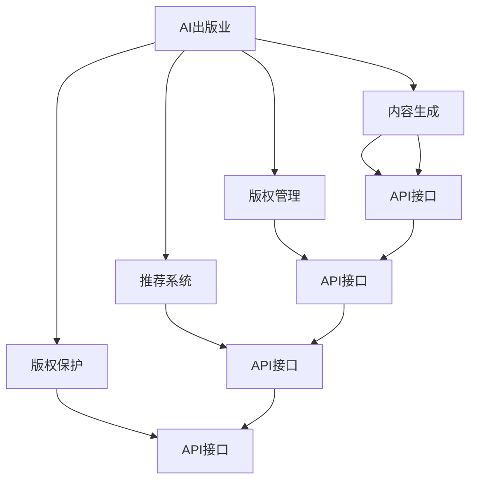

                 

# AI出版业开发策略：API标准化，场景丰富

> 关键词：人工智能出版业, API标准化, 出版场景, 机器学习, 数据处理, 自然语言处理(NLP)

## 1. 背景介绍

### 1.1 问题由来
在数字化转型的浪潮中，出版业正面临着前所未有的挑战和机遇。传统出版模式已无法满足快速迭代的市场需求，而新兴的智能出版模式正逐步崭露头角。这一变革下，如何通过技术手段提升出版效率、内容质量与用户体验，成为出版业亟待解决的问题。

### 1.2 问题核心关键点
AI技术在出版业的应用，尤其是通过机器学习、自然语言处理(NLP)等技术实现的内容生成、推荐系统、版权保护等环节，已经展现出巨大的潜力和价值。但实践中，不同出版社和平台间的数据格式、接口规范不一致，造成了资源整合难度大、系统兼容性差等问题。

为解决这一问题，本文将探讨如何通过API标准化，丰富AI在出版业中的应用场景，提升整体行业效能。

### 1.3 问题研究意义
API标准化，在技术上使数据和功能模块能以更高效、更一致的方式被不同系统调用，从而大幅提升出版流程的自动化和智能化水平。在业务上，将推动出版资源的协同整合，优化内容生态，提高出版商的运营效率和盈利能力。在用户体验上，提供更个性化、精准的服务，提升用户粘性和满意度。

本文将系统梳理API标准化的核心概念、关键技术及应用案例，旨在为出版业数字化转型提供有力支持。

## 2. 核心概念与联系

### 2.1 核心概念概述

要理解API标准化在出版业的应用，首先需要明确几个关键概念：

- **AI出版业**：利用AI技术，包括机器学习、NLP、计算机视觉等，优化出版流程，提升出版效率和内容质量。
- **API**：Application Programming Interface，应用程序接口，提供不同系统间的数据和功能交互标准。
- **API标准化**：通过制定统一的API接口规范，确保不同系统间的兼容性和互操作性。
- **场景丰富**：指AI技术在不同出版环节的应用广泛，涵盖内容生成、版权管理、推荐系统、版权保护等多个方面。

这些概念之间的联系通过以下Mermaid流程图展示：



## 3. 核心算法原理 & 具体操作步骤
### 3.1 算法原理概述

API标准化在出版业的核心原理是通过统一的API接口规范，实现数据和功能的互操作，从而提升出版流程的自动化和智能化水平。其核心思想是将各个系统间的数据交互和功能调用转化为标准化的接口调用，减少系统间的集成复杂度，提高开发效率和数据一致性。

### 3.2 算法步骤详解

实现API标准化，一般包括以下几个关键步骤：

**Step 1: 定义API接口规范**

- 确定需要标准化的数据类型、格式、传输协议（如REST、SOAP等）。
- 制定接口名称、路径、请求方式、参数、响应格式等规范。

**Step 2: 实现API接口**

- 开发符合规范的API接口，确保接口的输入输出一致性。
- 使用支持RESTful架构的Web框架（如Flask、Django Rest Framework等）。

**Step 3: 测试API接口**

- 使用Postman、Swagger等工具测试API接口的稳定性和兼容性。
- 检查接口的响应时间、错误处理机制等性能指标。

**Step 4: 文档化API接口**

- 生成API接口的详细文档，包括接口说明、参数说明、示例代码等。
- 使用Swagger、API Blueprint等工具自动生成API文档。

**Step 5: 部署API接口**

- 将API接口部署到服务器，确保可被外部系统访问。
- 使用Kubernetes等容器管理工具，实现API接口的高可用性和自动扩展。

**Step 6: 持续维护和更新API接口**

- 定期检查API接口的使用情况，收集反馈信息。
- 根据需求变化和性能优化，不断更新API接口。

### 3.3 算法优缺点

API标准化的优点包括：

- 提高系统集成效率，减少集成成本。
- 增强数据一致性，提高系统稳定性。
- 提升开发效率，加快系统迭代。

其缺点包括：

- 初始制定接口规范需要较高的时间和资源投入。
- 标准的持续维护和更新需要团队协调，可能涉及多部门协作。
- 面对复杂的业务需求，可能需要多次迭代才能达成理想效果。

### 3.4 算法应用领域

API标准化技术，在出版业的应用场景非常丰富，主要涵盖以下方面：

- **内容生成**：通过API接口调用，实现自动化内容生成，如自动排版、生成摘要、内容推荐等。
- **版权管理**：通过API接口访问版权数据库，实现版权登记、版权追踪、版权交易等。
- **推荐系统**：通过API接口调用推荐算法，实现个性化内容推荐，提升用户粘性。
- **版权保护**：通过API接口调用版权保护算法，实现内容监测、盗版检测等。

## 4. 数学模型和公式 & 详细讲解  
### 4.1 数学模型构建

API标准化的数学模型，主要涉及API接口的请求和响应格式。我们以RESTful API为例，其请求格式为：

```
GET /api/books/{id}
```

其中，`/api/books`为API接口路径，`/{id}`为动态参数，用于指定获取的图书ID。响应格式一般为JSON格式，示例如下：

```json
{
    "id": 12345,
    "title": "AI出版业开发策略",
    "author": "禅与计算机程序设计艺术",
    "description": "关于AI技术在出版业应用的深度思考",
    "price": 29.99,
    "publish_date": "2023-04-15"
}
```

### 4.2 公式推导过程

API标准化的数学模型构建，主要涉及API接口路径、请求方法、参数类型、数据类型、响应类型等。以获取图书信息的API接口为例：

- 路径：`/api/books/{id}`
- 请求方法：GET
- 参数类型：整数
- 数据类型：字符串
- 响应类型：JSON

### 4.3 案例分析与讲解

以某出版社的内容管理系统为例，该系统需要支持API接口访问，实现以下功能：

1. **获取图书信息**：
   - 请求：GET /api/books/{id}
   - 响应：JSON格式图书信息

2. **添加新图书**：
   - 请求：POST /api/books
   - 参数：{title, author, description, price, publish_date}
   - 响应：JSON格式的图书ID

3. **删除图书**：
   - 请求：DELETE /api/books/{id}
   - 参数：{id}
   - 响应：JSON格式的删除结果

4. **更新图书信息**：
   - 请求：PUT /api/books/{id}
   - 参数：{title, author, description, price, publish_date}
   - 响应：JSON格式的更新结果

以上API接口的设计，遵循了RESTful架构的规范，保证了系统间的兼容性和互操作性。

## 5. 项目实践：代码实例和详细解释说明
### 5.1 开发环境搭建

为实现API接口的标准化，首先需要搭建开发环境。以下是使用Python进行Flask开发的简单环境配置：

1. 安装Flask框架：
```bash
pip install Flask
```

2. 创建Flask应用：
```python
from flask import Flask

app = Flask(__name__)

@app.route('/api/books/<int:id>')
def get_book(id):
    # 实现API接口，返回图书信息
    pass
```

3. 启动Flask应用：
```bash
export FLASK_APP=app.py
flask run
```

### 5.2 源代码详细实现

以下是一个使用Flask实现API接口的示例代码，具体展示了如何定义API接口：

```python
from flask import Flask, request, jsonify

app = Flask(__name__)

books = {
    1: {'title': 'AI出版业开发策略', 'author': '禅与计算机程序设计艺术', 'price': 29.99},
    2: {'title': '深度学习入门', 'author': '张三', 'price': 19.99},
    3: {'title': '人工智能简史', 'author': '李四', 'price': 39.99}
}

@app.route('/api/books/<int:id>', methods=['GET'])
def get_book(id):
    book = books.get(id)
    if book is None:
        return jsonify({'error': 'Book not found'}), 404
    return jsonify(book)

@app.route('/api/books', methods=['POST'])
def add_book():
    data = request.get_json()
    title = data.get('title')
    author = data.get('author')
    price = data.get('price')
    book_id = max(books.keys()) + 1
    books[book_id] = {'title': title, 'author': author, 'price': price}
    return jsonify({'id': book_id}), 201

@app.route('/api/books/<int:id>', methods=['DELETE'])
def delete_book(id):
    if id in books:
        del books[id]
        return jsonify({'result': 'Book deleted'})
    return jsonify({'error': 'Book not found'}), 404

@app.route('/api/books/<int:id>', methods=['PUT'])
def update_book(id):
    data = request.get_json()
    title = data.get('title')
    author = data.get('author')
    price = data.get('price')
    book = books.get(id)
    if book is None:
        return jsonify({'error': 'Book not found'}), 404
    book['title'] = title
    book['author'] = author
    book['price'] = price
    return jsonify(book)

if __name__ == '__main__':
    app.run(debug=True)
```

### 5.3 代码解读与分析

以下是对上述代码的详细解读：

- **Flask框架**：通过Flask框架，可以快速搭建Web应用，实现RESTful API接口。
- **API接口定义**：使用Flask的`@app.route`装饰器定义API接口路径和请求方法，实现图书信息的增删改查。
- **数据存储**：使用Python字典存储图书信息，模拟出版管理系统。
- **JSON响应**：使用`jsonify`函数返回JSON格式的响应数据。

### 5.4 运行结果展示

启动Flask应用后，可通过HTTP请求访问API接口，获取、添加、更新和删除图书信息。例如，获取ID为1的图书信息：

```
GET http://localhost:5000/api/books/1
```

响应结果为：

```json
{
    "title": "AI出版业开发策略",
    "author": "禅与计算机程序设计艺术",
    "price": 29.99
}
```

## 6. 实际应用场景
### 6.1 智能推荐系统

在智能推荐系统中，API标准化技术可以有效实现不同系统间的数据共享和功能协同，提升推荐算法的效果。具体实现包括：

- **用户行为数据采集**：通过API接口，不同系统可以共享用户的行为数据，如阅读记录、购买记录等。
- **推荐模型训练**：基于用户行为数据，训练个性化推荐模型，通过API接口调用，实现实时推荐。

### 6.2 版权保护系统

版权保护系统通过API标准化技术，实现版权信息的共享和监控。具体实现包括：

- **版权登记**：出版商通过API接口将图书信息登记到版权数据库中，实现版权的自动追踪。
- **盗版检测**：利用API接口调用版权保护算法，实现对互联网内容的盗版检测和监控。

### 6.3 自动化排版系统

自动化排版系统通过API标准化技术，实现排版流程的自动化。具体实现包括：

- **模板加载**：通过API接口，自动加载出版模板，实现版式的设计。
- **内容填充**：利用API接口调用内容管理系统，实现对出版内容的自动填充和排版。

### 6.4 未来应用展望

API标准化技术，在未来出版业的应用场景将更加丰富。随着技术的不断进步，API标准化将覆盖更多领域，提升出版流程的自动化和智能化水平。

- **智能出版平台**：基于API接口，构建智能出版平台，实现内容生成、版权管理、推荐系统、版权保护等功能。
- **跨平台内容管理**：通过API接口，实现不同内容管理系统间的互操作，提高内容管理的效率和灵活性。
- **云原生出版系统**：利用API接口，构建云原生出版系统，实现内容的云端存储和协同编辑。

## 7. 工具和资源推荐
### 7.1 学习资源推荐

为了帮助开发者系统掌握API标准化的核心概念和实践技巧，这里推荐一些优质的学习资源：

1. **Flask官方文档**：Flask框架的官方文档，提供了详细的API开发指南和示例代码。
2. **RESTful API设计指南**：详细介绍了RESTful架构的设计原则和实现方法。
3. **Postman使用手册**：Postman工具的使用手册，介绍了API接口的测试和管理。
4. **Swagger文档**：Swagger工具的使用手册，介绍了API文档的自动生成和管理。
5. **API Blueprint教程**：API Blueprint工具的使用教程，介绍了API接口的自动化生成和管理。

### 7.2 开发工具推荐

高效的开发离不开优秀的工具支持。以下是几款用于API标准化开发的常用工具：

1. **Flask**：Python Web框架，支持RESTful API开发，易于上手。
2. **Django Rest Framework**：Python Web框架，支持RESTful API开发，功能强大。
3. **Postman**：API测试工具，支持HTTP请求和响应测试，方便调试API接口。
4. **Swagger**：API文档工具，支持API接口的自动化生成和可视化。
5. **API Blueprint**：API接口的自动化生成工具，支持多种数据格式和请求方法。

### 7.3 相关论文推荐

API标准化技术的发展源于学界的持续研究。以下是几篇奠基性的相关论文，推荐阅读：

1. **RESTful Web Services**：提出了RESTful架构的基本设计原则，奠定了RESTful API的标准基础。
2. **The Web Services Description Language (WSDL) Overview**：介绍了WSDL语言的使用方法，支持API接口的描述和自动化生成。
3. **Swagger**：介绍了Swagger工具的使用方法，支持API接口的文档化和自动化生成。
4. **API Blueprint**：介绍了API Blueprint工具的使用方法，支持API接口的自动化生成和描述。

## 8. 总结：未来发展趋势与挑战
### 8.1 总结

本文对API标准化在出版业的应用进行了全面系统的介绍。首先阐述了API标准化的背景和意义，明确了其在提升出版流程自动化、智能化水平方面的独特价值。其次，从原理到实践，详细讲解了API标准化的数学模型、算法步骤及应用案例，给出了API接口的详细实现。同时，本文还广泛探讨了API标准化在智能推荐、版权保护、自动化排版等出版环节的应用前景，展示了API标准化的巨大潜力。

通过本文的系统梳理，可以看到，API标准化技术正在成为出版业数字化转型的重要范式，极大地提升了出版流程的自动化和智能化水平，推动了出版资源的协同整合。未来，伴随API标准化的持续演进，出版业将迎来更高效、更智能、更灵活的发展新纪元。

### 8.2 未来发展趋势

展望未来，API标准化技术将在出版业的应用趋势包括：

- **系统兼容性增强**：API标准化技术将进一步提高系统间的兼容性和互操作性，打破数据孤岛，实现资源共享。
- **自动化水平提升**：通过API接口，自动化流程将覆盖更多出版环节，提升整体运营效率。
- **智能化能力增强**：API接口将更好地集成机器学习、NLP等AI技术，提升内容生成、推荐系统等领域的智能化水平。
- **跨平台协同能力提升**：API标准化将推动出版资源的跨平台协同，提升资源利用率和业务响应速度。
- **云原生架构普及**：API接口将与云原生架构深度融合，实现内容的云端存储和协同编辑。

### 8.3 面临的挑战

尽管API标准化技术已经取得了显著成就，但在迈向更加智能化、普适化应用的过程中，仍面临诸多挑战：

- **数据格式多样**：不同出版系统使用不同的数据格式，API接口的兼容性和互操作性面临挑战。
- **接口复杂度提升**：随着业务需求的不断变化，API接口的复杂度将不断提升，开发和维护成本增加。
- **数据安全问题**：API接口的开放性可能带来数据泄露等安全问题，需要加强数据加密和访问控制。
- **跨域访问限制**：不同系统间的数据访问和调用，可能受到跨域访问限制，需要制定严格的访问策略。

### 8.4 研究展望

面对API标准化所面临的挑战，未来的研究需要在以下几个方面寻求新的突破：

- **数据格式标准化**：制定统一的数据格式标准，提升系统间的兼容性和互操作性。
- **接口自动化生成**：使用自动化工具生成API接口，降低开发和维护成本。
- **安全防护机制完善**：加强API接口的安全防护，确保数据安全。
- **跨域访问策略优化**：制定合理的跨域访问策略，提升系统间的数据交互效率。

## 9. 附录：常见问题与解答

**Q1：API标准化是否适用于所有出版系统？**

A: 尽管API标准化技术可以显著提升出版流程的自动化和智能化水平，但由于不同出版系统的业务需求和技术栈差异，并非所有系统都适合直接采用API标准化。需要根据具体情况进行评估和优化。

**Q2：API标准化是否会增加系统的复杂度？**

A: 初期实现API标准化，可能会增加系统开发和维护的复杂度。但随着API接口的逐步完善和应用推广，系统复杂度将逐步降低。同时，API标准化将显著提升系统间的数据交互效率，降低集成成本。

**Q3：API标准化如何与现有系统兼容？**

A: 实现API标准化时，应优先考虑现有系统的兼容性。可以通过渐进式改造、API网关等方式，逐步引入API标准化技术，确保系统平稳过渡。

**Q4：API标准化对数据安全有什么影响？**

A: API标准化的开放性可能会带来数据泄露等安全问题。在实现API接口时，应加强数据加密和访问控制，确保数据安全。

**Q5：API标准化对开发成本有何影响？**

A: 实现API标准化初期，开发和维护成本较高。但随着系统间的协作和数据共享，开发和维护成本将逐步降低，带来长期的经济效益。

通过本文的系统梳理，可以看到，API标准化技术正在成为出版业数字化转型的重要范式，极大地提升了出版流程的自动化和智能化水平，推动了出版资源的协同整合。未来，伴随API标准化的持续演进，出版业将迎来更高效、更智能、更灵活的发展新纪元。

