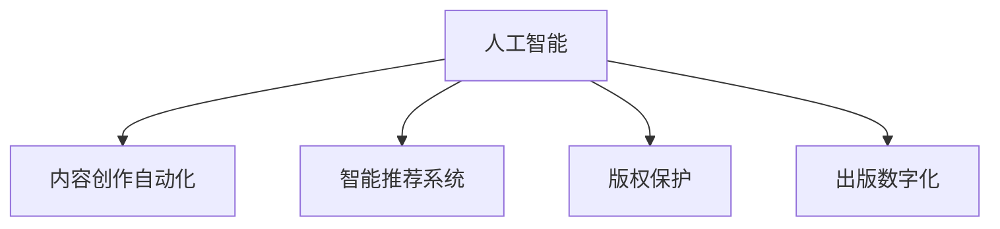

                 

# AI出版业挑战：降本增效与场景创新

> 关键词：人工智能, 出版业, 自动化, 智能推荐, 内容生成, 出版数字化

## 1. 背景介绍

### 1.1 问题由来
随着数字化进程的加速，出版业正经历前所未有的变革。数字化不仅重塑了传统出版模式，也对内容创作、版权保护、营销策略等各个环节提出了新的挑战。特别是在内容创作上，如何提升创作效率、保证内容质量、降低成本，成为出版业亟待解决的痛点。

在此背景下，人工智能(AI)技术为出版业带来了新的可能性。AI不仅可以提升内容创作的自动化水平，还能实现智能推荐、版权保护等功能的提升，进一步推动出版业的数字化转型。然而，AI技术在出版业的应用仍面临诸多技术、伦理和商业挑战，需要出版机构、技术开发者和社会各界的共同努力。

### 1.2 问题核心关键点
在当前出版业中，AI技术的应用主要集中在以下几方面：

- **内容创作自动化**：利用AI自动生成、编辑和排版文章，提升创作效率。
- **智能推荐系统**：根据用户阅读历史和偏好，推荐个性化内容，提升用户体验。
- **版权保护**：通过AI技术识别版权侵犯行为，保护原创作者的权益。
- **出版数字化**：将传统出版流程数字化，降低成本，提升效率。

AI技术在出版业的应用，不仅能够提高生产效率，还能为出版机构提供更加精准的用户洞察，帮助其精准营销，增加收益。然而，技术在实际应用中也暴露出一些问题，如内容的真实性、AI模型的透明度和可解释性、以及与现有业务流程的适配性等。因此，出版业需要针对这些挑战，寻找解决方案。

## 2. 核心概念与联系

### 2.1 核心概念概述

为更好地理解AI在出版业中的应用，本节将介绍几个关键概念：

- **人工智能**：通过机器学习、深度学习等技术，使计算机具备类似于人类的认知和学习能力。
- **出版业**：包括书籍、期刊、报纸等传统出版物，以及电子出版、在线课程、音频视频等新兴内容形式。
- **内容创作自动化**：利用AI自动生成、编辑和排版文章，提升创作效率。
- **智能推荐系统**：根据用户阅读历史和偏好，推荐个性化内容，提升用户体验。
- **版权保护**：通过AI技术识别版权侵犯行为，保护原创作者的权益。
- **出版数字化**：将传统出版流程数字化，降低成本，提升效率。

这些概念之间的逻辑关系可以通过以下Mermaid流程图来展示：



这个流程图展示了几类核心概念及其之间的关系：

1. 人工智能是内容创作自动化、智能推荐系统、版权保护和出版数字化的核心驱动力。
2. 内容创作自动化通过提升创作效率，辅助内容创作。
3. 智能推荐系统通过个性化推荐提升用户体验，增强用户粘性。
4. 版权保护通过技术手段保护原创内容，维护市场秩序。
5. 出版数字化通过数字化手段优化出版流程，提升效率和质量。

## 3. 核心算法原理 & 具体操作步骤
### 3.1 算法原理概述

AI在出版业的应用，核心算法包括自然语言处理(NLP)、计算机视觉(CV)、机器学习(ML)等技术。其基本原理是利用AI技术对海量数据进行训练和推理，自动或半自动地完成出版流程中的各项任务。

### 3.2 算法步骤详解

AI在出版业的应用，一般包括以下几个关键步骤：

**Step 1: 数据准备**
- 收集出版业相关数据，如图书内容、用户行为数据、版权信息等。
- 清洗和预处理数据，确保数据质量和一致性。

**Step 2: 模型选择与训练**
- 选择适合的AI模型，如BERT、GPT等预训练模型，或自定义神经网络模型。
- 根据具体任务，设计损失函数和优化器，进行模型训练。

**Step 3: 模型评估与优化**
- 在验证集上评估模型性能，使用如准确率、召回率、F1值等指标进行评价。
- 根据评估结果，调整模型超参数，优化模型性能。

**Step 4: 模型部署与应用**
- 将训练好的模型部署到生产环境，进行实时推理或批量处理。
- 根据实际应用反馈，持续改进模型，提升应用效果。

### 3.3 算法优缺点

AI在出版业的应用，具有以下优点：
1. 自动化水平高：能够自动生成、编辑和排版文章，提升创作效率。
2. 个性化推荐：根据用户阅读历史和偏好，推荐个性化内容，提升用户体验。
3. 版权保护能力强：能够识别版权侵犯行为，保护原创作者的权益。
4. 出版数字化效果好：能够优化出版流程，降低成本，提升效率。

同时，该方法也存在一些局限性：
1. 数据依赖性强：模型的性能很大程度上依赖于数据的质量和多样性。
2. 可解释性不足：AI模型的决策过程往往缺乏可解释性，难以对其推理逻辑进行分析和调试。
3. 伦理和法律问题：AI技术在版权保护和隐私保护方面可能引发争议。
4. 高成本：高质量AI模型的训练和部署需要较大的计算资源和数据资源。

尽管存在这些局限性，AI技术仍被广泛认为能够为出版业带来显著的变革和提升。

### 3.4 算法应用领域

AI技术在出版业的应用，主要集中在以下几个领域：

1. **内容创作自动化**：利用AI自动生成、编辑和排版文章，提升创作效率。例如，AI可以自动生成新闻报道、撰写营销文案等。
2. **智能推荐系统**：根据用户阅读历史和偏好，推荐个性化内容，提升用户体验。例如，在线阅读平台可以根据用户阅读记录，推荐相关书籍和文章。
3. **版权保护**：通过AI技术识别版权侵犯行为，保护原创作者的权益。例如，AI可以自动检测抄袭行为，并通知侵权方。
4. **出版数字化**：将传统出版流程数字化，降低成本，提升效率。例如，数字出版平台可以自动排版、校对、印刷，减少人工成本。

## 4. 数学模型和公式 & 详细讲解
### 4.1 数学模型构建

在出版业中，AI技术的应用涉及NLP、CV等多个领域。以下以NLP为例，介绍几种常见的数学模型。

### 4.2 公式推导过程

以自然语言处理中的文本分类任务为例，其基本流程包括：

1. **文本预处理**：将文本转化为模型可处理的格式，如分词、去除停用词、词向量化等。
2. **特征提取**：将文本转化为模型可接受的输入，如TF-IDF向量、Word2Vec嵌入等。
3. **模型训练**：利用训练集数据，训练分类模型，如朴素贝叶斯、支持向量机、神经网络等。
4. **模型评估**：在测试集上评估模型性能，使用如准确率、召回率、F1值等指标进行评价。

以下是基本的文本分类模型公式推导：

$$
\hat{y} = \begin{cases}
1 & \text{if } p(y=1|x) > 0.5 \\
0 & \text{otherwise}
\end{cases}
$$

其中，$y$表示分类标签，$x$表示输入文本，$\hat{y}$表示模型预测结果。$p(y=1|x)$表示在给定文本$x$的情况下，模型预测其属于正类的概率。

### 4.3 案例分析与讲解

以智能推荐系统为例，其基本思路是通过分析用户行为数据，构建用户画像，进而根据用户画像推荐相关内容。以下是智能推荐系统的基本算法流程：

1. **用户画像构建**：根据用户的历史行为数据（如阅读记录、浏览历史等），构建用户画像。
2. **内容表示学习**：对每篇内容进行特征提取，形成向量表示。
3. **相似度计算**：计算用户画像与每篇内容之间的相似度，选择相似度最高的内容进行推荐。

以下是推荐算法中的余弦相似度计算公式：

$$
\text{similarity}(u, c) = \frac{\mathbf{u} \cdot \mathbf{c}}{\|\mathbf{u}\| \|\mathbf{c}\|}
$$

其中，$\mathbf{u}$表示用户画像，$\mathbf{c}$表示内容向量，$similarity(u, c)$表示用户$u$和内容$c$的相似度。

## 5. 项目实践：代码实例和详细解释说明
### 5.1 开发环境搭建

在进行出版业相关AI项目开发前，需要准备好开发环境。以下是Python环境中相关的环境搭建步骤：

1. 安装Python环境：从官网下载安装Python，并创建虚拟环境，以避免不同项目间的冲突。
2. 安装依赖库：安装出版业相关的依赖库，如NLTK、spaCy、TensorFlow等。
3. 安装出版业相关库：安装出版业相关的库，如出版管理系统、电子书管理系统等。

### 5.2 源代码详细实现

以下以智能推荐系统为例，展示使用TensorFlow和Keras进行智能推荐系统开发的代码实现。

```python
import tensorflow as tf
from tensorflow.keras import layers, models

# 定义模型结构
model = models.Sequential([
    layers.Embedding(input_dim=vocab_size, output_dim=embedding_dim),
    layers.Conv1D(128, 5, activation='relu'),
    layers.GlobalMaxPooling1D(),
    layers.Dense(128, activation='relu'),
    layers.Dense(1, activation='sigmoid')
])

# 编译模型
model.compile(optimizer='adam', loss='binary_crossentropy', metrics=['accuracy'])

# 训练模型
model.fit(X_train, y_train, epochs=10, batch_size=32, validation_data=(X_val, y_val))

# 评估模型
loss, accuracy = model.evaluate(X_test, y_test)
print('Test loss:', loss)
print('Test accuracy:', accuracy)
```

### 5.3 代码解读与分析

上述代码实现了基于卷积神经网络(CNN)的智能推荐系统。模型通过嵌入层将文本向量化，然后使用卷积层提取特征，最后通过全连接层输出推荐结果。编译和训练模型的过程，使用Adam优化器和二元交叉熵损失函数。模型评估使用准确率指标。

## 6. 实际应用场景
### 6.1 在线阅读平台

在线阅读平台可以利用AI技术提升用户体验和内容推荐效果。例如，使用自然语言处理技术，将用户评论转化为文本，利用情感分析技术识别情感倾向，根据情感倾向推荐相关内容。使用推荐算法，根据用户阅读历史推荐相关书籍，提升用户粘性。

### 6.2 出版数字化

出版数字化通过数字化手段优化出版流程，降低成本，提升效率。例如，数字出版平台可以自动排版、校对、印刷，减少人工成本。利用AI技术，可以自动检测版权侵犯行为，保护原创作者的权益。

### 6.3 内容生成

内容生成技术可以辅助内容创作，提升创作效率。例如，使用生成对抗网络(GAN)生成高质量的电子书封面，使用文本生成模型自动生成营销文案，提升品牌曝光度。

### 6.4 未来应用展望

随着AI技术的发展，出版业将在以下几个方面迎来新的突破：

1. **个性化推荐系统**：通过深入分析用户行为和偏好，提供更加精准的内容推荐，提升用户体验。
2. **内容创作自动化**：利用AI自动生成、编辑和排版文章，提升创作效率。
3. **版权保护**：利用AI技术识别版权侵犯行为，保护原创作者的权益。
4. **出版数字化**：通过数字化手段优化出版流程，降低成本，提升效率。

## 7. 工具和资源推荐
### 7.1 学习资源推荐

以下是一些有助于出版业相关AI项目开发的学习资源：

1. Coursera和edX上的自然语言处理课程：涵盖自然语言处理的基本概念和前沿技术，有助于理解出版业中AI的应用。
2. TensorFlow官方文档：详细介绍了TensorFlow的使用方法和API接口，适用于出版业中AI模型的开发。
3. Keras官方文档：提供了基于Keras的深度学习模型的开发和部署指南，适用于出版业中AI模型的开发。
4. GitHub上的开源项目：如出版管理系统、电子书管理系统等，提供了出版业中AI应用的实际案例和代码示例。
5. 专业书籍：如《深度学习》（Goodfellow et al.），全面介绍了深度学习的基本概念和应用场景。

### 7.2 开发工具推荐

以下是一些适合出版业相关AI项目开发的工具：

1. Python：Python是AI开发中最常用的编程语言，具有强大的库支持，如TensorFlow、Keras等。
2. TensorFlow：由Google开发的深度学习框架，适用于大规模出版业数据的处理和分析。
3. Keras：基于TensorFlow的高层API，简化了深度学习模型的开发和部署。
4. NLTK和spaCy：Python自然语言处理库，提供了文本预处理、词向量化等功能。
5. PyTorch：由Facebook开发的深度学习框架，具有灵活的API和高效的计算能力。

### 7.3 相关论文推荐

以下是几篇关于AI在出版业应用的相关论文：

1. A Survey on Information Extraction in the Age of Neural Networks：回顾了神经网络在信息提取领域的应用，包括出版业中的文本分类、情感分析等。
2. Deep Learning for Natural Language Processing（NLP）：介绍深度学习在NLP中的应用，包括出版业中的智能推荐、内容生成等。
3. Using Machine Learning for Newspaper Recommendation Systems：介绍了机器学习在新闻推荐系统中的应用，包括出版业中的个性化推荐。
4. Copyright Enforcement in the Digital Age：探讨了AI技术在版权保护中的应用，包括出版业中的版权检测和监控。
5. Publishing and Marketing Content Using AI and Big Data：介绍了AI和大数据在出版业中的应用，包括内容创作自动化、出版数字化等。

## 8. 总结：未来发展趋势与挑战
### 8.1 研究成果总结

本文对AI在出版业的应用进行了全面系统的介绍。首先阐述了AI技术在出版业中的应用背景和意义，明确了AI在内容创作自动化、智能推荐系统、版权保护和出版数字化等方面的价值。其次，从原理到实践，详细讲解了出版业中AI技术的具体应用流程，并提供了完整的代码实现。同时，本文还探讨了AI技术在出版业中面临的技术、伦理和商业挑战，为出版机构提供了实用的解决方案。

### 8.2 未来发展趋势

展望未来，AI在出版业的应用将呈现以下几个发展趋势：

1. **自动化水平提升**：AI技术将进一步提升出版业的自动化水平，减少人工干预，降低成本。
2. **智能化推荐系统普及**：智能推荐系统将广泛应用于出版业，提升用户体验，增加收益。
3. **版权保护强化**：AI技术将进一步强化版权保护，帮助出版机构维护市场秩序。
4. **出版数字化深入**：出版数字化将进一步深入，提升出版效率，降低成本。
5. **内容生成多样化**：利用AI技术生成高质量的电子书封面、营销文案等，提升品牌曝光度。

### 8.3 面临的挑战

尽管AI技术在出版业的应用前景广阔，但仍面临以下挑战：

1. **数据质量问题**：出版业中的数据质量问题，如文本格式不统一、数据噪音等，可能影响模型的性能。
2. **模型透明性不足**：AI模型的决策过程往往缺乏可解释性，难以对其推理逻辑进行分析和调试。
3. **伦理和法律问题**：AI技术在版权保护和隐私保护方面可能引发争议。
4. **高成本问题**：高质量AI模型的训练和部署需要较大的计算资源和数据资源。

### 8.4 研究展望

未来，出版业需要在以下几个方面进行深入研究：

1. **数据质量提升**：探索数据清洗和预处理技术，提升数据质量，减少噪音干扰。
2. **模型透明性增强**：研究如何提高AI模型的可解释性，增强用户信任。
3. **伦理和法律保障**：制定相应的伦理和法律规范，保障AI技术的应用安全。
4. **资源优化**：研究如何优化AI模型的计算图，提高推理速度，降低成本。
5. **场景创新**：探索AI技术在出版业中的新场景应用，推动出版业的数字化转型。

## 9. 附录：常见问题与解答

**Q1: AI技术在出版业中的应用有哪些？**

A: AI技术在出版业中的应用包括内容创作自动化、智能推荐系统、版权保护和出版数字化等。其中，内容创作自动化可以通过AI自动生成、编辑和排版文章，提升创作效率。智能推荐系统根据用户阅读历史和偏好，推荐个性化内容，提升用户体验。版权保护通过AI技术识别版权侵犯行为，保护原创作者的权益。出版数字化通过数字化手段优化出版流程，降低成本，提升效率。

**Q2: 如何选择适合的AI模型进行出版业应用？**

A: 在选择AI模型时，需要考虑以下几个因素：
1. 任务类型：根据出版业的具体应用场景，选择合适的模型类型，如自然语言处理模型、图像处理模型等。
2. 数据质量：确保数据质量和多样性，避免模型过拟合。
3. 性能需求：根据实际应用需求，选择合适的模型参数和优化器。
4. 资源限制：考虑模型的计算资源和内存资源，选择适合的模型结构。

**Q3: AI技术在出版业中如何保护用户隐私？**

A: AI技术在出版业中保护用户隐私，可以从以下几个方面入手：
1. 数据匿名化：对用户行为数据进行匿名化处理，保护用户隐私。
2. 数据加密：对存储和传输的数据进行加密，防止数据泄露。
3. 用户同意：在收集和使用用户数据时，确保用户知情并同意。
4. 合规性审查：遵守相关法律法规，确保数据使用的合规性。

**Q4: 如何提高AI模型在出版业中的泛化能力？**

A: 提高AI模型在出版业中的泛化能力，可以从以下几个方面入手：
1. 数据多样化：使用多样化的数据集进行训练，减少模型对特定数据的依赖。
2. 正则化技术：使用L2正则、Dropout等技术，防止模型过拟合。
3. 数据增强：通过数据增强技术，丰富数据集的多样性，提高模型泛化能力。
4. 多模型集成：使用多模型集成技术，提高模型的鲁棒性和泛化能力。

通过以上系统梳理，我们能够更好地理解AI技术在出版业中的应用，并找到解决实际问题的途径。未来，随着技术的不断进步和应用场景的不断拓展，AI在出版业中的应用将更加广泛和深入，为出版业的发展注入新的活力。

