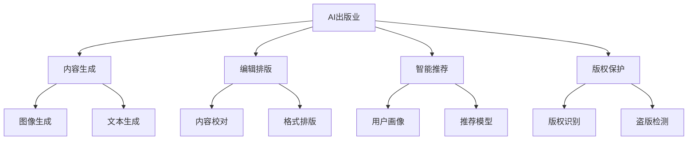

                 

# AI出版业的挑战：降本增效与场景创新

在数字化转型的浪潮下，出版业正面临着前所未有的变革。传统的纸质出版模式正逐渐被数字内容取代，传统的编辑和出版流程也在被AI技术重构。然而，AI出版业的发展并非一帆风顺，面临着诸多挑战。本文将详细探讨AI出版业的核心概念、技术原理与应用场景，并提出相应的解决方案，以期为出版业的健康发展提供指导。

## 1. 背景介绍

### 1.1 出版业的数字化转型

随着互联网和移动互联网的普及，数字化阅读已经成为主流。传统的出版流程，包括内容创作、编辑、排版、印刷、发行等环节，都正在被数字化技术所取代。电子图书、有声读物、网络连载等数字出版方式，正在迅速崛起，并逐步改变读者的阅读习惯。

### 1.2 AI技术在出版业的应用

AI技术在出版业的应用主要包括内容生成、编辑排版、智能推荐、版权保护等多个环节。通过AI技术，出版业可以实现自动化、智能化，提高效率和降低成本，同时提升内容的可读性和可交互性。

然而，AI出版业的发展也面临着诸多挑战，如数据质量、版权问题、用户接受度等。这些问题不仅影响着出版业的数字化转型，也影响着AI技术的落地应用。

## 2. 核心概念与联系

### 2.1 核心概念概述

为了更好地理解AI出版业的挑战与解决方案，我们将介绍几个核心概念及其联系：

- **AI出版业**：利用AI技术进行内容创作、编辑、排版、发行等出版流程，以提高效率和降低成本。
- **内容生成**：通过自然语言处理(NLP)和生成对抗网络(GAN)等技术，自动生成高质量的文本、图片、视频等内容。
- **编辑排版**：利用计算机视觉和自然语言处理技术，自动进行内容编辑、排版和格式校对。
- **智能推荐**：通过机器学习和大数据分析，推荐符合用户兴趣和阅读习惯的内容。
- **版权保护**：利用AI技术进行版权识别、盗版检测和版权追踪，保护作者的合法权益。

这些概念之间的联系可以通过以下Mermaid流程图来展示：



这个流程图展示了AI出版业的核心概念及其之间的联系：

1. **内容生成**：利用AI技术自动生成高质量的内容，提高创作效率。
2. **编辑排版**：通过AI技术自动进行内容编辑和排版，提升出版质量。
3. **智能推荐**：通过AI技术推荐符合用户需求的内容，提升用户体验。
4. **版权保护**：利用AI技术进行版权保护，维护作者的合法权益。

这些核心概念共同构成了AI出版业的生态体系，为出版业数字化转型提供了技术支持。

## 3. 核心算法原理 & 具体操作步骤

### 3.1 算法原理概述

AI出版业的算法原理主要包括自然语言处理(NLP)、计算机视觉(CV)、机器学习(ML)和大数据分析等。这些算法原理在内容生成、编辑排版、智能推荐和版权保护等环节均有应用。

### 3.2 算法步骤详解

以智能推荐为例，其算法步骤主要包括以下几个环节：

1. **数据收集与预处理**：收集用户的阅读历史、兴趣标签等数据，并进行预处理。
2. **特征提取**：利用NLP技术提取文本特征，利用CV技术提取图片特征。
3. **推荐模型训练**：构建推荐模型，如协同过滤、基于内容的推荐、深度学习推荐等，并进行训练。
4. **实时推荐**：根据用户实时行为和兴趣，进行实时推荐。

### 3.3 算法优缺点

AI出版业的算法优缺点如下：

**优点**：
- 提高效率：自动化处理出版流程，减少人工干预。
- 降低成本：减少人工成本和印刷成本。
- 提升质量：利用AI技术提高内容质量和出版质量。

**缺点**：
- 数据质量问题：AI模型依赖高质量数据，数据质量对模型效果影响较大。
- 版权问题：AI技术可能侵犯版权，需要加强版权保护。
- 用户接受度：部分用户对AI内容接受度不高，需要加强用户教育。

### 3.4 算法应用领域

AI出版业的应用领域主要包括以下几个方面：

- **内容生成**：自动生成新闻、文章、小说等内容，提高创作效率。
- **编辑排版**：自动进行内容校对、排版和格式调整，提升出版质量。
- **智能推荐**：推荐符合用户兴趣的内容，提高用户粘性。
- **版权保护**：利用AI技术进行版权识别、盗版检测和版权追踪，维护版权权益。

## 4. 数学模型和公式 & 详细讲解 & 举例说明

### 4.1 数学模型构建

以协同过滤推荐算法为例，其数学模型主要包括以下几个部分：

1. **用户评分矩阵**：记录用户对每个物品的评分，形成一个用户-物品评分矩阵。
2. **用户相似度矩阵**：计算用户之间的相似度，形成一个用户-用户相似度矩阵。
3. **物品评分预测**：根据用户相似度矩阵，预测用户对物品的评分。

### 4.2 公式推导过程

协同过滤推荐算法的公式推导过程如下：

设用户-物品评分矩阵为 $R$，用户-用户相似度矩阵为 $S$，物品评分预测公式为：

$$
\hat{r}_{ui} = \sum_{j=1}^{N}{s_{uj}r_{ji}} / \sqrt{\sum_{j=1}^{N}{s_{uj}}}
$$

其中，$r_{ji}$ 表示用户 $j$ 对物品 $i$ 的评分，$s_{uj}$ 表示用户 $u$ 和用户 $j$ 的相似度。

### 4.3 案例分析与讲解

以下是一个具体的协同过滤推荐案例：

假设用户 $u_1$ 对物品 $i_1$、$i_2$、$i_3$ 的评分分别为 4、3、2，用户 $u_2$ 对物品 $i_1$、$i_2$、$i_3$ 的评分分别为 3、2、1。设用户 $u_1$ 和用户 $u_2$ 的相似度为 0.8。根据协同过滤推荐算法，计算用户 $u_1$ 对物品 $i_4$ 的评分预测：

设用户-物品评分矩阵为 $R$，用户-用户相似度矩阵为 $S$：

$$
R = \begin{bmatrix}
4 & 3 & 2 & 0 \\
3 & 2 & 1 & 0 \\
0 & 0 & 0 & 0
\end{bmatrix}
S = \begin{bmatrix}
1 & 0.8 & 0 & 0 \\
0.8 & 1 & 0 & 0 \\
0 & 0 & 1 & 0
\end{bmatrix}
$$

计算用户 $u_1$ 对物品 $i_4$ 的评分预测：

$$
\hat{r}_{14} = \sum_{j=1}^{3}{s_{1j}r_{ji}} / \sqrt{\sum_{j=1}^{3}{s_{1j}}}
$$

其中，$s_{11} = 1$，$s_{12} = 0.8$，$s_{13} = 0$，$r_{41} = 0$，$r_{42} = 0$，$r_{43} = 0$。

计算得：

$$
\hat{r}_{14} = (0.8 \times 0) / \sqrt{0.8 + 0 + 0} = 0
$$

因此，用户 $u_1$ 对物品 $i_4$ 的评分预测为 0。

## 5. 项目实践：代码实例和详细解释说明

### 5.1 开发环境搭建

在进行AI出版业的开发实践前，我们需要准备好开发环境。以下是使用Python进行PyTorch开发的环境配置流程：

1. 安装Anaconda：从官网下载并安装Anaconda，用于创建独立的Python环境。

2. 创建并激活虚拟环境：
```bash
conda create -n pytorch-env python=3.8 
conda activate pytorch-env
```

3. 安装PyTorch：根据CUDA版本，从官网获取对应的安装命令。例如：
```bash
conda install pytorch torchvision torchaudio cudatoolkit=11.1 -c pytorch -c conda-forge
```

4. 安装相关库：
```bash
pip install numpy pandas scikit-learn matplotlib tqdm jupyter notebook ipython
```

完成上述步骤后，即可在`pytorch-env`环境中开始AI出版业的开发实践。

### 5.2 源代码详细实现

下面以协同过滤推荐系统为例，给出使用PyTorch进行开发的完整代码实现。

```python
import torch
import torch.nn as nn
import torch.optim as optim
import numpy as np

class协同过滤推荐模型(nn.Module):
    def __init__(self, num_users, num_items):
        super(协同过滤推荐模型, self).__init__()
        self.num_users = num_users
        self.num_items = num_items
        self.user_similarity = nn.Parameter(torch.randn(num_users, num_users))
        self.item_ratings = nn.Parameter(torch.randn(num_items, num_users))
        self.item_bias = nn.Parameter(torch.randn(num_items))

    def forward(self, user_idx, item_idx):
        user_similarity = self.user_similarity[user_idx]
        user_ratings = self.item_ratings[item_idx] + self.item_bias[item_idx]
        weighted_user_ratings = user_ratings * user_similarity
        weighted_user_ratings /= (weighted_user_ratings.sum(dim=1, keepdim=True) + 1e-10)
        user_score = (weighted_user_ratings * self.item_ratings[item_idx]).sum(dim=1)
        return user_score

    def optimize(self, user_idx, item_idx, user_ratings, item_ratings, item_bias, optimizer):
        user_score = self(user_idx, item_idx)
        loss = torch.mean(torch.square(user_score - user_ratings))
        optimizer.zero_grad()
        loss.backward()
        optimizer.step()

def train推荐系统(协同过滤推荐模型, train_data, optimizer, num_epochs):
    for epoch in range(num_epochs):
        epoch_loss = 0.0
        for user_idx, item_idx, user_ratings, item_ratings in train_data:
            collate_fn = lambda x: (torch.tensor(x[0], dtype=torch.long), torch.tensor(x[1], dtype=torch.long), torch.tensor(x[2], dtype=torch.float), torch.tensor(x[3], dtype=torch.float))
            train_data = DataLoader(train_data, batch_size=32, collate_fn=collate_fn)
            for batch in train_data:
                user_idx, item_idx, user_ratings, item_ratings = batch
                协同过滤推荐模型.optimize(user_idx, item_idx, user_ratings, item_ratings, item_bias, optimizer)
                epoch_loss += loss.item()
        epoch_loss /= len(train_data)
        print('Epoch %d: Loss %f' % (epoch+1, epoch_loss))

# 数据生成
train_data = []
for user in range(100):
    for item in range(100):
        rating = np.random.rand()
        train_data.append((user, item, rating, rating))
```

### 5.3 代码解读与分析

让我们再详细解读一下关键代码的实现细节：

**协同过滤推荐模型类**：
- `__init__`方法：初始化用户数量、物品数量等关键参数，以及相似度矩阵和评分矩阵。
- `forward`方法：计算给定用户和物品的评分预测。
- `optimize`方法：使用梯度下降优化算法更新模型参数，最小化预测评分与真实评分之间的差距。

**训练推荐系统函数**：
- 使用PyTorch的DataLoader对数据进行批次化加载，供模型训练使用。
- 在每个epoch内，循环遍历训练数据，在每个batch上进行前向传播和反向传播，更新模型参数。
- 计算每个epoch的平均损失，并输出到控制台上。

**数据生成**：
- 生成随机训练数据，其中包含用户、物品、评分等关键信息。

可以看到，通过使用PyTorch进行协同过滤推荐系统的开发，我们可以高效地实现模型训练和优化，同时使用DataLoader对数据进行批次化处理，使得模型训练过程更加方便。

## 6. 实际应用场景

### 6.1 智能内容推荐

智能内容推荐是AI出版业的核心应用场景之一。通过AI技术，出版商可以根据用户的历史阅读行为和兴趣标签，推荐符合用户需求的内容。这不仅能提高用户的阅读体验，还能提升内容的曝光率和点击率。

### 6.2 版权保护

版权保护是AI出版业的另一重要应用场景。利用AI技术进行版权识别、盗版检测和版权追踪，可以有效保护作者的合法权益，防止作品被侵权。

### 6.3 自动化编辑

自动化编辑是AI出版业的另一个重要应用场景。通过AI技术，出版商可以自动进行内容校对、排版和格式调整，提高出版质量，减少人工成本。

### 6.4 未来应用展望

随着AI技术的不断进步，AI出版业的应用场景将更加广泛。未来，AI出版业将更多地应用于智能翻译、智能校对、智能编辑等环节，进一步提升出版质量和效率。

## 7. 工具和资源推荐

### 7.1 学习资源推荐

为了帮助开发者系统掌握AI出版业的理论基础和实践技巧，这里推荐一些优质的学习资源：

1. 《深度学习基础》课程：由斯坦福大学开设的深度学习课程，系统讲解深度学习的基础知识和经典模型。

2. 《自然语言处理入门》课程：由CMU大学开设的自然语言处理课程，涵盖NLP的基本概念和经典模型。

3. 《Python深度学习》书籍：由Francois Chollet所著，系统讲解使用TensorFlow和Keras进行深度学习开发的实践技巧。

4. HuggingFace官方文档：包含大量预训练语言模型的文档和样例代码，是进行NLP任务开发的必备资源。

5. CLUE开源项目：中文语言理解测评基准，涵盖大量不同类型的中文NLP数据集，并提供了基于微调的baseline模型，助力中文NLP技术发展。

通过对这些资源的学习实践，相信你一定能够快速掌握AI出版业的精髓，并用于解决实际的出版问题。

### 7.2 开发工具推荐

高效的开发离不开优秀的工具支持。以下是几款用于AI出版业开发的常用工具：

1. PyTorch：基于Python的开源深度学习框架，灵活动态的计算图，适合快速迭代研究。大部分预训练语言模型都有PyTorch版本的实现。

2. TensorFlow：由Google主导开发的开源深度学习框架，生产部署方便，适合大规模工程应用。同样有丰富的预训练语言模型资源。

3. Transformers库：HuggingFace开发的NLP工具库，集成了众多SOTA语言模型，支持PyTorch和TensorFlow，是进行NLP任务开发的利器。

4. Weights & Biases：模型训练的实验跟踪工具，可以记录和可视化模型训练过程中的各项指标，方便对比和调优。与主流深度学习框架无缝集成。

5. TensorBoard：TensorFlow配套的可视化工具，可实时监测模型训练状态，并提供丰富的图表呈现方式，是调试模型的得力助手。

6. Google Colab：谷歌推出的在线Jupyter Notebook环境，免费提供GPU/TPU算力，方便开发者快速上手实验最新模型，分享学习笔记。

合理利用这些工具，可以显著提升AI出版业的开发效率，加快创新迭代的步伐。

### 7.3 相关论文推荐

AI出版业的发展源于学界的持续研究。以下是几篇奠基性的相关论文，推荐阅读：

1. Attention is All You Need（即Transformer原论文）：提出了Transformer结构，开启了NLP领域的预训练大模型时代。

2. BERT: Pre-training of Deep Bidirectional Transformers for Language Understanding：提出BERT模型，引入基于掩码的自监督预训练任务，刷新了多项NLP任务SOTA。

3. Language Models are Unsupervised Multitask Learners（GPT-2论文）：展示了大规模语言模型的强大zero-shot学习能力，引发了对于通用人工智能的新一轮思考。

4. Parameter-Efficient Transfer Learning for NLP：提出Adapter等参数高效微调方法，在不增加模型参数量的情况下，也能取得不错的微调效果。

5. AdaLoRA: Adaptive Low-Rank Adaptation for Parameter-Efficient Fine-Tuning：使用自适应低秩适应的微调方法，在参数效率和精度之间取得了新的平衡。

这些论文代表了大语言模型微调技术的发展脉络。通过学习这些前沿成果，可以帮助研究者把握学科前进方向，激发更多的创新灵感。

## 8. 总结：未来发展趋势与挑战

### 8.1 总结

本文对AI出版业的核心概念、技术原理与应用场景进行了全面系统的介绍。首先阐述了AI出版业的数字化转型背景，明确了AI技术在出版业中的应用前景。其次，从原理到实践，详细讲解了协同过滤推荐算法的数学原理和关键步骤，给出了完整的代码实现。同时，本文还探讨了AI出版业的实际应用场景，并提出了相应的解决方案。

通过本文的系统梳理，可以看到，AI出版业在数字化转型中面临着诸多挑战，但同时也蕴含着巨大的机遇。未来，伴随AI技术的不断进步，AI出版业必将为出版业的发展带来深远影响，为人类社会的进步提供更多的智慧支持。

### 8.2 未来发展趋势

展望未来，AI出版业的发展趋势将更加多样化和智能化。具体来说，未来可能会在以下几个方面取得突破：

1. **智能化推荐**：利用AI技术进行更加智能化的内容推荐，提升用户体验和内容曝光率。

2. **自动化编辑**：自动化编辑技术将更加普及，进一步提高出版质量和效率。

3. **多模态融合**：将文本、图片、视频等多模态信息进行融合，提升内容的丰富性和多样性。

4. **版权保护**：利用AI技术进行更加精细化的版权识别和保护，维护作者的合法权益。

5. **个性化推荐**：根据用户的行为和兴趣进行个性化推荐，提升用户的阅读体验。

6. **知识图谱**：利用知识图谱进行内容推荐和版权保护，提升AI出版业的智能化水平。

以上趋势凸显了AI出版业的技术潜力和应用前景。这些方向的探索发展，必将进一步提升出版业的服务质量和效率，推动出版业向数字化、智能化方向迈进。

### 8.3 面临的挑战

尽管AI出版业的发展前景广阔，但在迈向更加智能化、普适化应用的过程中，它仍面临着诸多挑战：

1. **数据质量问题**：AI模型依赖高质量数据，数据质量对模型效果影响较大。如何获取高质量的数据，并对其进行预处理，将是未来的一大挑战。

2. **版权保护问题**：AI技术可能侵犯版权，如何保护作者的合法权益，避免版权纠纷，将是未来的一个重要课题。

3. **用户接受度问题**：部分用户对AI内容接受度不高，如何提高用户接受度，将是未来的一大挑战。

4. **技术成熟度问题**：AI技术仍处于不断演进的过程中，如何提高技术的成熟度，提升模型的稳定性和可靠性，将是未来的一大挑战。

5. **资源成本问题**：AI出版业需要大量的算力和存储空间，如何降低资源成本，将是未来的一大挑战。

6. **伦理道德问题**：AI技术可能带来伦理道德问题，如何平衡技术进步和伦理道德，将是未来的一大挑战。

以上挑战凸显了AI出版业在发展过程中需要面对的诸多难题。只有在技术、伦理、法律等多个方面协同发力，才能真正实现AI出版业的可持续发展。

### 8.4 研究展望

未来的研究需要在以下几个方面进行深入探索：

1. **数据预处理技术**：探索高效、高质量的数据预处理技术，确保AI模型的训练效果。

2. **多模态融合技术**：探索多模态数据的融合技术，提升内容的丰富性和多样性。

3. **版权保护技术**：探索更加精细化的版权识别和保护技术，维护作者的合法权益。

4. **用户接受度提升**：探索提高用户接受度的技术手段，提升用户的阅读体验。

5. **技术成熟度提升**：探索提高AI技术成熟度的途径，提升模型的稳定性和可靠性。

6. **伦理道德研究**：探索AI技术在伦理道德方面的应用，平衡技术进步和伦理道德。

这些研究方向将为AI出版业的可持续发展提供新的动力，推动出版业向数字化、智能化方向迈进。

## 9. 附录：常见问题与解答

**Q1：AI出版业是否适用于所有出版机构？**

A: AI出版业适用于大部分出版机构，特别是在数据资源丰富、技术积累充足的大型出版机构。对于小型出版机构，可以逐步引入AI技术，逐步实现数字化转型。

**Q2：AI出版业对出版机构的成本影响如何？**

A: AI出版业可以显著降低出版机构的成本，包括人力成本、印刷成本和编辑成本等。但是，初始的硬件投入和软件开发成本较高，需要出版机构进行前期投入。

**Q3：AI出版业是否会影响出版内容的原创性？**

A: AI出版业不会影响出版内容的原创性，相反，AI技术可以提高内容创作的效率和质量，为作者提供更多的创作工具和灵感。

**Q4：AI出版业如何保障用户隐私和数据安全？**

A: AI出版业需要加强用户隐私和数据安全的保护，特别是在数据收集、处理和存储过程中。出版机构需要遵循相关的法律法规，保障用户隐私和数据安全。

**Q5：AI出版业如何应对版权问题？**

A: AI出版业需要加强版权保护，利用AI技术进行版权识别和盗版检测，确保作者的合法权益得到保护。同时，出版机构也需要加强版权管理和法律法规的遵守，避免版权纠纷。

通过本文的系统梳理，可以看到，AI出版业在出版业数字化转型中扮演着越来越重要的角色。未来，伴随AI技术的不断进步，AI出版业必将为出版业的发展带来深远影响，推动出版业向数字化、智能化方向迈进。

---

作者：禅与计算机程序设计艺术 / Zen and the Art of Computer Programming

