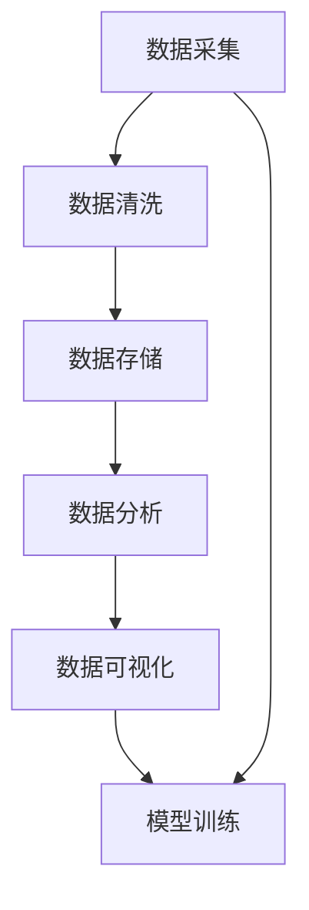

                 

## 1. 背景介绍

### 1.1 问题由来

在当今人工智能(AI)领域，数据被视为核心资产。无论是模型训练、产品优化还是服务迭代，数据的积累和应用都是成功的关键。在AI创业中，数据积累的应用尤为关键。许多创业公司将数据视为技术壁垒，通过优质的数据资源吸引投资人和客户。然而，数据积累并非易事，需要投入大量资源和精力。本文将系统介绍AI创业中的数据积累与应用，帮助读者更好地理解数据的重要性，并掌握数据积累的策略和方法。

### 1.2 问题核心关键点

数据在AI创业中的作用主要体现在以下几个方面：

- **模型训练**：高质量的数据是训练高质量AI模型的基础。
- **产品优化**：数据反馈能够帮助产品团队了解用户需求，优化用户体验。
- **服务迭代**：通过数据驱动的洞察，快速调整服务策略，提升服务质量。
- **商业决策**：数据支持决策过程，帮助制定科学的商业战略。

数据积累与应用是AI创业的重要环节，但同时也面临着诸多挑战，如数据隐私、数据获取难度、数据质量等。本文将深入探讨这些挑战，并提出相应的解决方案。

## 2. 核心概念与联系

### 2.1 核心概念概述

在AI创业中，数据积累与应用涉及多个核心概念：

- **数据采集**：从不同渠道收集原始数据。
- **数据清洗**：处理数据中的噪声、缺失值等问题，提高数据质量。
- **数据存储**：将清洗后的数据存储在高效的数据库中，方便后续处理。
- **数据分析**：通过统计、机器学习等技术，提取数据中的有用信息。
- **数据可视化**：将数据分析结果以图形化的方式展示，帮助理解数据和洞察趋势。

这些概念相互关联，共同构成了数据积累与应用的全流程。

### 2.2 核心概念原理和架构的 Mermaid 流程图



## 3. 核心算法原理 & 具体操作步骤

### 3.1 算法原理概述

AI创业中的数据积累与应用主要涉及以下几个算法原理：

- **监督学习**：利用标记数据训练模型，预测新数据。
- **无监督学习**：从未标记数据中学习模式和结构。
- **半监督学习**：结合少量标记数据和大量未标记数据，提高学习效率。
- **强化学习**：通过试错反馈优化模型决策。

这些算法原理在数据采集、清洗、存储、分析和应用中均有应用。

### 3.2 算法步骤详解

**Step 1: 数据采集**

- 选择合适的数据源，如网络爬虫、传感器、API接口等。
- 制定数据采集策略，确定采集频率、采集量和采集方式。

**Step 2: 数据清洗**

- 数据去重：去除重复数据，减少冗余。
- 数据格式化：将不同格式的数据统一处理。
- 数据清洗：处理缺失值、异常值、噪声等问题，提升数据质量。

**Step 3: 数据存储**

- 选择合适的数据库，如SQL数据库、NoSQL数据库、数据湖等。
- 设计数据模型，合理规划数据结构。
- 优化数据存储，如分布式存储、压缩存储等。

**Step 4: 数据分析**

- 选择适当的分析方法，如统计分析、机器学习、深度学习等。
- 进行特征工程，提取和构造特征，提高模型效果。
- 应用模型评估指标，如准确率、召回率、F1分数等，评估模型性能。

**Step 5: 数据可视化**

- 选择适合的数据可视化工具，如Tableau、Power BI、Matplotlib等。
- 设计可视化图表，如散点图、柱状图、热力图等。
- 分析数据趋势和模式，提供洞察和决策支持。

**Step 6: 模型训练**

- 选择合适的算法和模型，如线性回归、决策树、神经网络等。
- 应用交叉验证、过拟合检测等技术，优化模型性能。
- 训练模型，进行参数调优，得到最终模型。

### 3.3 算法优缺点

**数据采集的优点和缺点**

- **优点**：获取大量数据，为模型训练提供丰富的数据资源。
- **缺点**：数据采集难度大，需要投入大量人力和资源。

**数据清洗的优点和缺点**

- **优点**：提升数据质量，减少噪音和错误，提高模型效果。
- **缺点**：数据清洗工作量大，需要专业知识和技术手段。

**数据存储的优点和缺点**

- **优点**：高效存储和管理数据，方便后续处理和应用。
- **缺点**：存储成本高，需要选择合适的存储方案。

**数据分析的优点和缺点**

- **优点**：提取数据中的有用信息，提供洞察和决策支持。
- **缺点**：需要专业知识和技能，计算资源需求高。

**数据可视化的优点和缺点**

- **优点**：直观展示数据，帮助理解和决策。
- **缺点**：需要设计合适的图表和指标，易出现误导性。

**模型训练的优点和缺点**

- **优点**：构建高性能模型，提高预测和决策能力。
- **缺点**：计算资源需求高，模型复杂度可能增加。

### 3.4 算法应用领域

AI创业中的数据积累与应用广泛应用在以下几个领域：

- **医疗健康**：通过医疗数据积累，构建疾病预测、个性化治疗等应用。
- **金融科技**：利用金融数据积累，开发风险评估、客户细分等应用。
- **智能制造**：从制造业数据中提取模式，优化生产流程，提高生产效率。
- **智能客服**：通过客户互动数据，优化服务流程，提升用户体验。
- **智能营销**：分析用户行为数据，优化营销策略，提高转化率。

## 4. 数学模型和公式 & 详细讲解 & 举例说明

### 4.1 数学模型构建

在AI创业中，数据积累与应用涉及到多个数学模型。这里以监督学习模型为例，介绍其构建过程。

监督学习模型通常由输入特征 $X$ 和输出标签 $Y$ 组成。模型的目标是最小化损失函数 $L$，使其预测值 $\hat{Y}$ 接近真实值 $Y$。常用的损失函数包括均方误差损失（MSE）、交叉熵损失（CE）等。

### 4.2 公式推导过程

以线性回归模型为例，其目标是最小化均方误差损失。设模型为 $Y = \theta^TX + b$，其中 $\theta$ 为模型参数，$X$ 为输入特征，$Y$ 为输出标签，$b$ 为截距。均方误差损失函数为：

$$L(Y,\hat{Y}) = \frac{1}{2N} \sum_{i=1}^N (Y_i - \hat{Y_i})^2$$

其中 $N$ 为样本数量。

### 4.3 案例分析与讲解

以金融风险评估为例，分析数据积累与应用的过程。

1. **数据采集**：从银行系统中采集客户交易数据、信用记录等。
2. **数据清洗**：处理缺失值、异常值，去除无用字段。
3. **数据存储**：将清洗后的数据存储在关系型数据库中。
4. **数据分析**：利用机器学习模型，如逻辑回归、决策树等，分析客户信用风险。
5. **数据可视化**：通过图表展示客户信用分布，识别高风险群体。
6. **模型训练**：基于标注数据，训练信用评估模型，预测客户信用等级。

## 5. 项目实践：代码实例和详细解释说明

### 5.1 开发环境搭建

**Step 1: 选择编程语言和框架**

- 推荐使用Python，结合TensorFlow、PyTorch等深度学习框架。

**Step 2: 安装依赖包**

- 使用pip安装TensorFlow、NumPy、Pandas等依赖包。

```bash
pip install tensorflow numpy pandas scikit-learn matplotlib
```

### 5.2 源代码详细实现

**Step 1: 数据采集**

```python
import requests

def fetch_data(url):
    response = requests.get(url)
    return response.text
```

**Step 2: 数据清洗**

```python
import pandas as pd

def clean_data(data):
    # 数据去重
    data = data.drop_duplicates()
    # 数据格式化
    data = data.apply(lambda x: x.replace({'na': None, 'yes': 1, 'no': 0}))
    # 数据清洗
    data = data.dropna()
    return data
```

**Step 3: 数据存储**

```python
import sqlite3

def store_data(data):
    conn = sqlite3.connect('data.db')
    df = pd.DataFrame(data)
    df.to_sql('data', conn, if_exists='replace', index=False)
    conn.close()
```

### 5.3 代码解读与分析

**数据采集代码解读**

- `fetch_data`函数使用requests库获取指定URL的数据，并将其返回为字符串。

**数据清洗代码解读**

- `clean_data`函数使用Pandas库对数据进行去重、格式化和清洗操作，返回清洗后的DataFrame对象。

**数据存储代码解读**

- `store_data`函数使用SQLite库将数据存储到本地数据库中。

### 5.4 运行结果展示

**数据采集结果**

```python
url = 'https://example.com/data'
data = fetch_data(url)
print(data)
```

**数据清洗结果**

```python
data = {
    'id': [1, 2, 3, 4, 5],
    'name': ['Alice', 'Bob', 'Charlie', 'David', 'Eva'],
    'age': [25, 30, 35, 40, 45],
    'gender': ['F', 'M', 'M', 'M', 'F']
}

cleaned_data = clean_data(data)
print(cleaned_data)
```

**数据存储结果**

```python
data = {
    'id': [1, 2, 3, 4, 5],
    'name': ['Alice', 'Bob', 'Charlie', 'David', 'Eva'],
    'age': [25, 30, 35, 40, 45],
    'gender': ['F', 'M', 'M', 'M', 'F']
}

store_data(data)
```

## 6. 实际应用场景

### 6.1 金融风险评估

在金融领域，通过数据积累与应用，可以构建高效的风险评估模型，预测客户信用风险。

**数据采集**

- 采集客户交易记录、信用报告、社会背景等数据。

**数据清洗**

- 处理缺失值、异常值，去除无用字段。

**数据存储**

- 将清洗后的数据存储在数据库中，如MySQL、Oracle等。

**数据分析**

- 利用机器学习模型，如逻辑回归、决策树等，分析客户信用风险。

**数据可视化**

- 通过图表展示客户信用分布，识别高风险群体。

**模型训练**

- 基于标注数据，训练信用评估模型，预测客户信用等级。

### 6.2 智能客服

在智能客服领域，通过数据积累与应用，可以构建高效的服务系统，提升用户体验。

**数据采集**

- 采集客户对话记录、用户反馈、服务日志等数据。

**数据清洗**

- 处理缺失值、异常值，去除无用字段。

**数据存储**

- 将清洗后的数据存储在数据库中，如MySQL、Elasticsearch等。

**数据分析**

- 利用机器学习模型，如分类、聚类等，分析客户需求。

**数据可视化**

- 通过图表展示客户需求分布，识别高需求群体。

**模型训练**

- 基于标注数据，训练智能客服模型，自动回复客户问题。

### 6.3 智能制造

在智能制造领域，通过数据积累与应用，可以构建高效的生产管理系统，优化生产流程。

**数据采集**

- 采集生产线数据、设备状态、物流信息等数据。

**数据清洗**

- 处理缺失值、异常值，去除无用字段。

**数据存储**

- 将清洗后的数据存储在数据库中，如Hadoop、Spark等。

**数据分析**

- 利用机器学习模型，如回归、时序分析等，分析生产流程。

**数据可视化**

- 通过图表展示生产流程，识别瓶颈环节。

**模型训练**

- 基于标注数据，训练生产优化模型，优化生产流程。

## 7. 工具和资源推荐

### 7.1 学习资源推荐

**1. 书籍**

- 《Python数据科学手册》（原书第2版）
- 《深度学习》（Ian Goodfellow、Yoshua Bengio、Aaron Courville著）
- 《机器学习实战》（Peter Harrington著）

**2. 在线课程**

- Coursera上的“深度学习”课程
- Udacity上的“人工智能”纳米学位课程
- edX上的“数据科学导论”课程

**3. 论文**

- DeepMind的《AlphaGo》论文
- Google的《BERT: Pre-training of Deep Bidirectional Transformers for Language Understanding》论文

### 7.2 开发工具推荐

**1. 编程语言**

- Python
- R

**2. 数据处理库**

- Pandas
- NumPy
- SQLAlchemy

**3. 机器学习框架**

- TensorFlow
- PyTorch
- Scikit-Learn

### 7.3 相关论文推荐

**1. 《数据挖掘：概念与技术》（Peter J. Rousseeuw、Michael L. Hubert著）**

**2. 《机器学习》（Tom Mitchell著）**

**3. 《深度学习》（Ian Goodfellow、Yoshua Bengio、Aaron Courville著）**

## 8. 总结：未来发展趋势与挑战

### 8.1 总结

本文系统介绍了AI创业中的数据积累与应用，帮助读者全面理解数据的重要性，并掌握数据积累的策略和方法。通过详细讲解数据采集、清洗、存储、分析和应用的全流程，以及具体的代码实例，读者可以更好地理解和实践数据驱动的AI创业。

### 8.2 未来发展趋势

展望未来，AI创业中的数据积累与应用将呈现以下几个发展趋势：

**1. 数据规模持续增大**

随着技术的进步和数据的积累，AI创业中可用数据的规模将持续增大，为模型训练和优化提供更丰富的资源。

**2. 数据来源多元化**

未来的数据将不仅仅来源于传统的数据库和传感器，还将来自社交媒体、物联网等多元化来源。

**3. 数据治理体系完善**

数据治理将成为AI创业的重要环节，确保数据的质量和安全，提升数据应用的效率和可靠性。

**4. 数据驱动的业务决策**

数据将成为决策支持的核心，帮助企业制定科学的商业战略，优化业务流程。

**5. 数据隐私和安全**

随着数据应用范围的扩大，数据隐私和安全问题将更加凸显，需要更加严格的数据管理和保护措施。

### 8.3 面临的挑战

尽管数据积累与应用在AI创业中具有重要意义，但仍面临诸多挑战：

**1. 数据获取难度大**

高质量的数据获取需要投入大量资源和时间，特别是在数据来源受限的情况下。

**2. 数据隐私和安全**

数据隐私和安全问题将更加复杂，如何保护用户数据，防止数据泄露，是AI创业的重要挑战。

**3. 数据质量参差不齐**

数据质量参差不齐，需要大量时间和精力进行清洗和处理。

**4. 数据成本高**

高质量数据往往价格昂贵，对AI创业的初期投资造成压力。

**5. 数据技术复杂**

数据采集、清洗、存储和分析技术复杂，需要专业知识和技能。

### 8.4 研究展望

未来的数据积累与应用将从以下几个方面进行深入研究：

**1. 数据自动化采集**

开发自动化的数据采集工具，减少人工干预，提高数据采集效率。

**2. 数据质量自动化保障**

应用自动化技术，提升数据清洗和处理的效率和准确性。

**3. 数据安全和隐私保护**

研究数据隐私保护技术，确保数据安全和隐私。

**4. 数据驱动的AI创业**

探索数据驱动的AI创业新模式，通过数据积累和应用提升业务价值。

**5. 数据治理与标准化**

制定数据治理标准，提升数据应用的效果和可靠性。

## 9. 附录：常见问题与解答

### 9.1 Q1: 数据采集面临哪些主要挑战？

A: 数据采集面临的主要挑战包括：
- 数据获取难度大，特别是在数据来源受限的情况下。
- 数据质量参差不齐，需要进行大量的清洗和处理。
- 数据成本高，高质量数据往往价格昂贵。

### 9.2 Q2: 如何提高数据采集的效率？

A: 提高数据采集效率可以从以下几个方面入手：
- 开发自动化的数据采集工具，减少人工干预。
- 选择合适的数据源，提高数据获取速度。
- 利用分布式采集技术，加速数据采集过程。

### 9.3 Q3: 数据清洗过程中需要注意哪些问题？

A: 数据清洗过程中需要注意的问题包括：
- 处理缺失值、异常值，去除无用字段。
- 保持数据一致性，避免数据不一致性带来的问题。
- 保证数据质量，提升数据应用的效果。

### 9.4 Q4: 如何确保数据安全和隐私？

A: 确保数据安全和隐私可以从以下几个方面入手：
- 应用数据加密技术，保护数据传输和存储的安全。
- 制定数据使用规则，限制数据访问权限。
- 定期进行数据审计，确保数据使用的合规性。

### 9.5 Q5: 数据积累与应用对AI创业有哪些影响？

A: 数据积累与应用对AI创业有以下影响：
- 提升模型的训练效果，提高AI系统的预测和决策能力。
- 提供业务洞察，帮助企业制定科学的商业战略。
- 提升用户体验，优化产品和服务的质量。

---

作者：禅与计算机程序设计艺术 / Zen and the Art of Computer Programming

