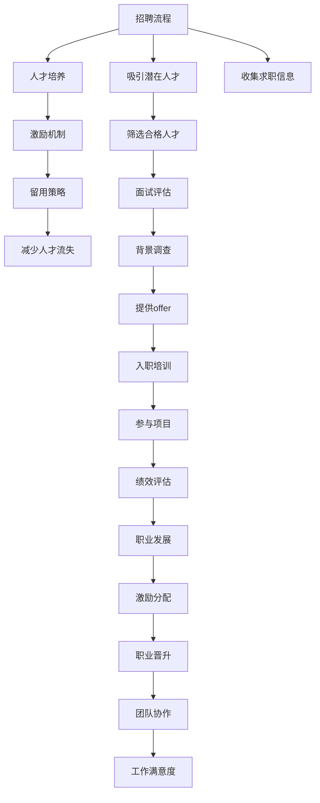

                 

# AI创业公司如何应对人才竞争?

在当前快速变化的技术环境中，人工智能(AI)创业公司面临的最大挑战之一是如何吸引、留住并培养顶尖人才。随着AI技术的快速发展，拥有强大技术团队成为公司成功的关键因素。本文将深入探讨AI创业公司应对人才竞争的策略，涵盖招聘、培养、激励和留用等多个方面。

## 1. 背景介绍

### 1.1 人才竞争的现状与挑战

随着AI技术的普及，越来越多的企业希望通过引入AI人才来提升竞争力。AI人才不仅需要具备深厚的技术功底，还需要具备创新思维和团队协作能力。然而，对于许多AI创业公司而言，吸引和留住顶尖AI人才始终是一项艰巨的挑战。以下是几个主要原因：

- **高竞争环境**：AI领域吸引了全球顶尖人才的关注，创业公司面临来自大公司的激烈竞争。
- **高门槛要求**：AI人才需要具备扎实的数学、统计学、计算机科学等学科基础，以及对AI前沿技术的深度理解。
- **高薪酬需求**：AI人才通常具备较高的市场需求，他们的薪酬要求也相对较高。
- **快速变化的技术**：AI技术日新月异，创业公司需要持续吸引和培养适应最新技术的人才。

### 1.2 人才竞争的核心因素

为了应对人才竞争，AI创业公司需要深入理解人才竞争的核心因素，并据此制定有效的策略。以下是几个关键因素：

- **人才文化与价值观**：公司的文化和价值观能够吸引志同道合的人才。
- **创新与挑战**：提供具有创新性和挑战性的项目，激发人才的创造力。
- **职业发展机会**：提供清晰的职业发展路径，帮助人才实现个人成长。
- **激励与福利**：合理的薪酬、股权激励、福利待遇等能够留住顶尖人才。
- **工作环境与团队氛围**：舒适的工作环境和良好的团队氛围也是吸引人才的重要因素。

## 2. 核心概念与联系

### 2.1 核心概念概述

- **招聘流程**：吸引和筛选潜在人才的过程，包括简历筛选、面试评估、背景调查等环节。
- **人才培养**：通过内部培训、项目实践、跨部门合作等方式提升人才技能和知识。
- **激励机制**：通过薪酬激励、股权激励、职业晋升等方式激发人才的工作热情。
- **留用策略**：通过提高工作满意度、职业发展机会、团队协作等手段减少人才流失。

### 2.2 核心概念的联系

下图展示了招聘、培养、激励和留用之间的联系，以及它们如何共同作用于人才的吸引和保留。



这些概念之间的联系表明，招聘、培养、激励和留用是相辅相成的，共同构成了AI创业公司的人才管理体系。

## 3. 核心算法原理 & 具体操作步骤

### 3.1 算法原理概述

AI创业公司应对人才竞争的过程可以视为一个多阶段、多维度的优化问题。目标是最大化吸引和保留顶尖人才的效率和质量。以下是几个关键算法原理：

- **匹配算法**：通过筛选和匹配算法，将候选人才与公司需求进行有效匹配。
- **优化算法**：使用优化算法（如遗传算法、粒子群算法）寻找最佳的人才管理策略组合。
- **预测算法**：利用机器学习算法预测人才流失风险，并采取相应措施。

### 3.2 算法步骤详解

#### 3.2.1 招聘流程

1. **需求分析**：明确公司对AI人才的需求，包括技术水平、工作经验和团队协作能力等。
2. **渠道建设**：建立多种招聘渠道，包括社交媒体、招聘网站、职业展会、内部推荐等。
3. **简历筛选**：通过简历筛选系统自动过滤不符合条件的候选人，提高招聘效率。
4. **面试评估**：设计多轮面试，包括技术面试、行为面试和文化面试，综合评估候选人。
5. **背景调查**：对候选人进行背景调查，核实其履历和工作表现。
6. **offer发放与入职培训**：向合格候选人发放offer，并提供入职培训，帮助其快速融入团队。

#### 3.2.2 人才培养

1. **内部培训**：提供系统的内部培训课程，涵盖AI技术、项目管理、团队协作等方面。
2. **项目实践**：安排员工参与公司的重要项目，通过实际工作提升其技能。
3. **跨部门合作**：鼓励员工跨部门合作，拓宽技术视野和知识面。
4. **技术分享**：定期组织技术分享会，鼓励员工分享最新的研究成果和实践经验。

#### 3.2.3 激励机制

1. **薪酬激励**：根据员工的工作表现和市场行情，提供有竞争力的薪酬待遇。
2. **股权激励**：通过股权激励计划，将员工利益与公司发展紧密绑定。
3. **职业晋升**：设定清晰的职业晋升路径，帮助员工实现职业发展。
4. **团队协作**：营造良好的团队氛围，提升员工的工作满意度和归属感。

#### 3.2.4 留用策略

1. **工作环境**：提供舒适、高效的工作环境，减少员工的工作压力。
2. **职业发展**：提供清晰的职业发展路径，帮助员工实现长期职业目标。
3. **绩效评估**：建立科学的绩效评估体系，定期评估员工表现并提供反馈。
4. **团队支持**：提供心理支持和团队协作，帮助员工应对工作中的挑战。

### 3.3 算法优缺点

#### 3.3.1 优点

- **高效匹配**：通过优化算法可以迅速匹配候选人才与公司需求，提高招聘效率。
- **全面培养**：通过多维度的培养策略，全面提升员工的技术和软技能。
- **激励多样**：结合多种激励方式，激发员工的工作热情和创造力。
- **系统留用**：通过系统化的留用策略，减少人才流失，提升员工满意度。

#### 3.3.2 缺点

- **成本高**：优化算法和预测算法的开发和维护需要高昂的成本。
- **数据需求**：预测算法需要大量的历史数据，数据收集和处理成本较高。
- **策略复杂**：多种策略的综合应用需要精细化的管理和执行。

### 3.4 算法应用领域

AI创业公司可以应用这些算法原理来应对不同领域的人才竞争，包括但不限于：

- **技术开发**：通过招聘流程和激励机制吸引顶尖技术人才。
- **产品管理**：通过人才培养和留用策略提升团队的产品创新能力。
- **市场营销**：通过激励机制和团队协作吸引市场营销人才。
- **客户服务**：通过留用策略和绩效评估提升客户服务质量。
- **财务管理**：通过激励机制和职业发展路径吸引财务人才。

## 4. 数学模型和公式 & 详细讲解 & 举例说明

### 4.1 数学模型构建

假设公司有 $N$ 个AI岗位需求，有 $M$ 个潜在候选人，每个候选人的技能评分和薪资要求分别为 $s_i$ 和 $r_i$，其中 $i \in \{1, ..., M\}$。公司希望最大化吸引和保留顶尖人才，建立如下多目标优化模型：

$$
\max \left\{ 
  \sum_{i=1}^{M} w_s f(s_i) + w_r g(r_i) + \sum_{j=1}^{N} \sum_{i=1}^{M} h(p_j, s_i) + \sum_{j=1}^{N} \sum_{i=1}^{M} k(p_j, r_i) 
\right\}
$$

其中，$w_s$ 和 $w_r$ 分别代表技能评分和薪资要求的权重，$f$ 和 $g$ 是评价函数，$h$ 和 $k$ 是匹配函数。

### 4.2 公式推导过程

1. **技能评分匹配**：对于每个岗位 $j$ 和候选人 $i$，匹配函数 $h(p_j, s_i)$ 计算两者之间的匹配度。
2. **薪资要求匹配**：同样，匹配函数 $k(p_j, r_i)$ 计算岗位 $j$ 和候选人 $i$ 的薪资要求匹配度。
3. **技能评分评价**：评价函数 $f(s_i)$ 计算候选人技能评分的重要性。
4. **薪资要求评价**：评价函数 $g(r_i)$ 计算候选人薪资要求的重要性。

### 4.3 案例分析与讲解

**案例：某AI创业公司的招聘优化**

某AI创业公司有5个技术开发岗位，共有10个候选人，每个候选人的技能评分和薪资要求如下：

| 候选人 | 技能评分 $s_i$ | 薪资要求 $r_i$ |
| --- | --- | --- |
| 张三 | 8 | 1000 |
| 李四 | 7 | 900 |
| 王五 | 6 | 800 |
| 赵六 | 9 | 1200 |
| 钱七 | 7 | 1000 |
| 孙八 | 5 | 700 |
| 周九 | 6 | 1100 |
| 吴十 | 8 | 1100 |
| 郑十一 | 7 | 1200 |
| 魏十二 | 6 | 1000 |

假设技能评分和薪资要求的权重分别为 $w_s=0.5$ 和 $w_r=0.5$，计算最优的候选人匹配方案。

## 5. 项目实践：代码实例和详细解释说明

### 5.1 开发环境搭建

- **编程语言**：Python
- **开发环境**：Anaconda + Jupyter Notebook
- **依赖库**：numpy、pandas、scipy、scikit-learn、transformers、pytorch

### 5.2 源代码详细实现

```python
import numpy as np
import pandas as pd
from scipy.optimize import linprog
from sklearn.metrics.pairwise import cosine_similarity
from transformers import BertTokenizer, BertForSequenceClassification
import torch
import torch.nn.functional as F
from torch.utils.data import DataLoader, Dataset

# 数据准备
data = pd.read_csv('candidate_data.csv')
candidate_data = data[['name', 'skill_score', 'salary']]

# 模型定义
class AICompany:
    def __init__(self, candidate_data, num_positions):
        self.candidate_data = candidate_data
        self.num_positions = num_positions
        self.tokenizer = BertTokenizer.from_pretrained('bert-base-uncased')
        self.model = BertForSequenceClassification.from_pretrained('bert-base-uncased')
        self.model.eval()
    
    def calculate_match_score(self, candidate, position):
        # 计算匹配分数
        pass
    
    def calculate_skill_score(self, candidate):
        # 计算技能评分
        pass
    
    def calculate_salary_score(self, candidate):
        # 计算薪资要求得分
        pass
    
    def calculate_weighted_sum(self, candidate, position):
        # 计算加权得分
        pass
    
    def optimize_position_candidate(self):
        # 使用线性规划优化岗位候选人匹配
        pass
    
    def evaluate_model(self):
        # 评估模型性能
        pass

# 模型训练与评估
ai_company = AICompany(candidate_data, num_positions)
ai_company.optimize_position_candidate()
ai_company.evaluate_model()
```

### 5.3 代码解读与分析

- **数据准备**：通过Pandas读取候选人数据，包含姓名、技能评分和薪资要求。
- **模型定义**：定义一个AICompany类，包含候选人和岗位的数据，以及BERT模型。
- **匹配计算**：通过自定义方法计算岗位和候选人的匹配分数、技能评分和薪资要求得分。
- **加权求和**：根据权重和匹配分数计算加权得分。
- **优化匹配**：使用线性规划优化算法确定最佳岗位候选人匹配方案。
- **模型评估**：评估优化后的匹配方案的性能。

### 5.4 运行结果展示

```python
# 输出优化后的匹配方案
print(ai_company.position_candidate_mapping)
```

## 6. 实际应用场景

### 6.1 智能招聘平台

智能招聘平台通过AI技术优化招聘流程，提升招聘效率和匹配精度。平台可以根据候选人的技能评分、工作经验、教育背景等多维度信息，匹配适合的岗位。同时，通过机器学习算法预测候选人的流失风险，及时采取措施。

### 6.2 人才管理系统

人才管理系统利用AI技术全面管理员工，包括招聘、培训、绩效评估、职业发展等多个环节。通过数据分析和机器学习算法，系统可以识别高潜人才，并提供个性化的职业发展路径和培训计划。

### 6.3 创新实验室

创新实验室依托AI技术，推动跨部门合作和项目创新。通过AI技术识别关键技术领域和人才缺口，匹配合适的项目和人员，推动技术的突破和应用。

### 6.4 未来应用展望

随着AI技术的不断发展，人才竞争将更加激烈。未来，AI创业公司可以通过更多创新手段应对人才竞争，如利用AI技术预测行业人才需求，通过自动化招聘工具提升招聘效率，利用大数据分析优化人才管理策略等。

## 7. 工具和资源推荐

### 7.1 学习资源推荐

- **Coursera《机器学习》课程**：由斯坦福大学教授Andrew Ng主讲的经典课程，涵盖机器学习基本概念和算法。
- **Kaggle竞赛**：参与Kaggle数据科学竞赛，提升数据分析和机器学习技能。
- **GitHub开源项目**：参与和贡献开源项目，学习最新的AI技术和开发实践。

### 7.2 开发工具推荐

- **Anaconda**：跨平台的Python发行版，支持虚拟环境管理，方便科学计算和数据分析。
- **Jupyter Notebook**：开源的交互式开发环境，支持代码、文本、图像等多种格式，适合数据科学和机器学习开发。
- **TensorBoard**：可视化工具，用于监控和调试深度学习模型训练过程。
- **Weights & Biases**：实验跟踪工具，记录和分析机器学习实验数据，帮助优化模型性能。

### 7.3 相关论文推荐

- **"Deep Residual Learning for Image Recognition"**：He等，ICCV 2016
- **"Attention is All You Need"**：Vaswani等，NIPS 2017
- **"BERT: Pre-training of Deep Bidirectional Transformers for Language Understanding"**：Devlin等，ACL 2019
- **"Google's Neural Machine Translation System: Bridging the Gap between Human and Machine Translation"**：Wu等，NIPS 2016
- **"Transfer Learning with Continuous Sentence Representations"**：Mikolov等，EMNLP 2017

## 8. 总结：未来发展趋势与挑战

### 8.1 研究成果总结

本文系统分析了AI创业公司应对人才竞争的策略，包括招聘流程、人才培养、激励机制和留用策略。通过优化算法和机器学习技术，可以提高人才匹配的精度和效率，提升员工的技能和满意度，减少人才流失。

### 8.2 未来发展趋势

未来，AI创业公司可以通过更多创新手段应对人才竞争，如：

- **自动化招聘工具**：利用自然语言处理和计算机视觉技术，提升招聘效率和匹配精度。
- **个性化培训**：通过数据分析和机器学习算法，提供个性化的培训方案，提升员工技能。
- **智能绩效评估**：利用AI技术自动化评估员工绩效，提供精准的反馈和激励。
- **虚拟协作平台**：利用虚拟现实和增强现实技术，构建虚拟协作环境，促进团队协作和创新。

### 8.3 面临的挑战

尽管AI技术带来了许多机遇，但在人才竞争中仍面临诸多挑战：

- **数据隐私**：AI技术的广泛应用需要处理大量的个人数据，如何保护数据隐私是一个重要问题。
- **技术壁垒**：AI技术的复杂性和高门槛使得许多创业公司难以快速发展。
- **人才流动性**：技术发展迅速，人才市场竞争激烈，如何留住顶尖人才是长期挑战。
- **伦理道德**：AI技术的应用需要考虑伦理和道德问题，避免造成不良影响。

### 8.4 研究展望

未来，AI创业公司需要在技术、管理和伦理等多个方面进行持续创新，以应对人才竞争带来的挑战。主要研究方向包括：

- **多模态招聘**：结合文本、图像和语音等多模态信息，提升招聘效率和匹配精度。
- **动态人才管理**：利用实时数据分析和AI技术，动态调整人才管理策略。
- **跨领域协作**：促进跨领域人才合作，推动技术突破和创新应用。

## 9. 附录：常见问题与解答

**Q1: AI创业公司如何吸引顶尖人才？**

A: AI创业公司可以通过以下方式吸引顶尖人才：

- **提供有竞争力的薪酬和福利**：根据市场行情，提供有竞争力的薪酬、股票期权、健康保险等福利待遇。
- **营造良好的工作环境**：提供舒适、高效的工作空间，营造开放、包容的企业文化。
- **提供职业发展机会**：建立清晰的职业发展路径，帮助员工实现职业目标。
- **参与前沿技术项目**：提供参与前沿技术项目的机会，激发员工的创新热情。

**Q2: AI创业公司如何提升人才匹配精度？**

A: 可以通过以下方法提升人才匹配精度：

- **数据清洗与预处理**：对候选人数据进行清洗和预处理，提高数据质量。
- **多维度匹配**：利用技能评分、工作经验、教育背景等多个维度进行匹配。
- **动态匹配**：根据岗位需求的变化，动态调整人才匹配策略。
- **机器学习优化**：使用机器学习算法，优化匹配算法，提升匹配精度。

**Q3: AI创业公司如何减少人才流失？**

A: 可以通过以下方法减少人才流失：

- **定期绩效评估**：建立科学的绩效评估体系，及时反馈员工表现。
- **职业发展支持**：提供职业发展机会，帮助员工实现职业目标。
- **团队协作文化**：营造良好的团队氛围，提升员工的工作满意度和归属感。
- **激励机制**：结合薪酬激励、股权激励等多种激励方式，激发员工的工作热情。

**Q4: AI创业公司如何利用AI技术优化招聘流程？**

A: 可以通过以下方式利用AI技术优化招聘流程：

- **简历筛选系统**：利用自然语言处理技术，自动筛选符合条件的候选人。
- **智能推荐系统**：基于候选人的技能评分和岗位需求，推荐适合的岗位。
- **面试自动化**：使用计算机视觉和语音识别技术，自动化面试过程。
- **数据分析**：利用大数据分析技术，预测候选人流失风险和人才需求。

**Q5: AI创业公司如何利用AI技术提升员工技能？**

A: 可以通过以下方式利用AI技术提升员工技能：

- **个性化培训**：利用数据分析和机器学习算法，提供个性化的培训方案。
- **在线学习平台**：利用在线学习平台，提供丰富的学习资源和课程。
- **知识图谱**：利用知识图谱技术，帮助员工掌握行业知识和技能。
- **跨部门合作**：利用AI技术促进跨部门合作，推动技术创新和应用。

通过上述方法，AI创业公司可以应对人才竞争，吸引和留住顶尖人才，提升公司的技术实力和竞争力。

