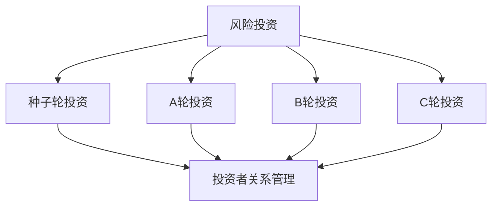

                 

# AI创业公司如何进行风险投资?

## 1. 背景介绍

### 1.1 问题由来
在人工智能领域，尤其是在AI创业公司中，风险投资（Venture Capital, VC）扮演着至关重要的角色。AI创业公司的成功往往依赖于大规模的资金支持，这些资金不仅可以用于技术研发、市场拓展，还可以用来应对运营风险和不确定性。然而，AI技术本身的复杂性以及市场的不确定性，使得风险投资对于AI创业公司来说既是机遇也是挑战。如何吸引风险投资，以及如何有效利用这些投资，是AI创业公司成功的关键。

### 1.2 问题核心关键点
本文将详细探讨AI创业公司在进行风险投资时所面临的核心问题，包括选择合适的投资者、评估投资机会、设计合适的股权结构、谈判投资条款以及维护良好的投资者关系等。通过深入分析这些关键点，可以帮助AI创业公司更好地理解风险投资的本质，提高获得资金的可能性，并有效利用这些资金，加速公司的发展。

## 2. 核心概念与联系

### 2.1 核心概念概述

在进行风险投资时，AI创业公司需要关注以下几个核心概念：

- **风险投资（Venture Capital, VC）**：指投资于高成长潜力、高风险的创业公司的资金，通常由专业的投资机构提供。VC投资的目的是为了获得资本增值，通常会换取公司股权。

- **种子轮投资**：指在初创公司早期进行的首次融资，投资者通常对公司的商业模式和团队有较高信心，但对其市场潜力持保守态度。

- **A轮投资**：指公司成立后，进入初步运营阶段后进行的首次扩充融资，投资者对公司的市场前景和业务模型有更多信心。

- **B轮投资**：指公司在产品和服务开始受到市场认可后进行的再次融资，通常用于扩大市场份额和加速产品迭代。

- **C轮及后续投资**：指公司进入成熟期后进行的进一步融资，主要用于大规模市场扩张、技术研发、并购等。

- **股权结构（Equity Structure）**：指公司的所有权分配，包括创始团队、投资者和员工的股权分配比例。股权结构的设计直接影响公司决策、控制权和财务表现。

- **投资条款（Term Sheet）**：指投资者与公司签订的投资合同，规定了投资额度、股权分配、董事会席位、优先权利等重要条款。

- **投资者关系管理（Investor Relations Management）**：指公司与投资者之间的沟通和管理，包括定期更新财务表现、分享业务进展、处理投资者关系等。

这些核心概念之间的逻辑关系可以通过以下Mermaid流程图来展示：



这个流程图展示了一个AI创业公司在不同阶段可能进行的融资方式，以及每个阶段的投资者关系管理。

## 3. 核心算法原理 & 具体操作步骤
### 3.1 算法原理概述

风险投资决策过程本质上是一种评估和选择投资机会的算法，其核心在于权衡投资风险和潜在回报。风险投资公司通常会进行多轮尽职调查（Due Diligence），评估公司的市场潜力、技术成熟度、团队能力、商业模式等，以决定是否进行投资。AI创业公司在进行风险投资时，也需要遵循类似的评估流程，以便吸引和保持投资者的信心。

### 3.2 算法步骤详解

AI创业公司进行风险投资的步骤一般包括以下几个关键步骤：

**Step 1: 准备融资计划**
- 明确公司的发展阶段和融资需求，制定详细的融资计划和财务预测。
- 准备好公司简介、市场机会分析、产品技术介绍、财务报表、团队介绍等关键材料。
- 选择合适的融资渠道，包括天使投资、风险投资、私募股权等。

**Step 2: 寻找和接触投资者**
- 利用网络资源、行业展会、创业加速器等渠道，寻找潜在的投资者。
- 通过LinkedIn、Crunchbase等平台，联系行业内的投资者和投资机构。
- 参加行业会议和创业活动，建立初步的投资者关系。

**Step 3: 初步筛选投资者**
- 根据公司的融资需求和投资者背景，筛选潜在的投资者。
- 评估投资者的投资风格、偏好、历史投资案例等，选择最符合公司需求的投资者。

**Step 4: 制作和提交投资提案**
- 根据投资者需求，制作详细的投资提案，包括公司概述、市场机会、财务预测、团队介绍等。
- 准备投资者问答环节，明确回答投资者可能关心的问题。
- 通过邮件或线上会议，将投资提案提交给投资者。

**Step 5: 尽职调查和谈判**
- 投资者进行尽职调查，验证公司的财务状况、业务模式、市场潜力等。
- 双方就投资条款进行谈判，包括投资额度、股权分配、优先权利、董事会席位等。

**Step 6: 签署投资协议**
- 根据谈判结果，签署投资协议，明确投资条款和投资者权益。
- 确保投资协议符合公司法和相关法律法规。

**Step 7: 资金到账和项目执行**
- 根据协议约定，确保资金按时到账，用于项目发展和运营。
- 定期向投资者报告项目进展，保持透明和良好的沟通。

### 3.3 算法优缺点

风险投资在支持AI创业公司成长方面具有以下优点：

- **资金支持**：提供必要的资金支持，帮助公司快速扩张和成长。
- **经验和人脉**：引入经验丰富的投资者，提供战略指导和行业资源。
- **品牌提升**：获得知名投资机构的背书，提升公司在市场上的认可度。

同时，风险投资也存在以下缺点：

- **控制权稀释**：投资者通常会要求获得一定的董事会席位，影响公司的决策权。
- **业绩压力**：投资者通常会设定业绩目标和退出计划，增加公司的业绩压力。
- **短期思维**：投资者更关注短期回报，可能影响公司的长期战略规划。

### 3.4 算法应用领域

风险投资不仅适用于AI创业公司，还广泛应用于各个领域的创业企业。例如：

- **科技公司**：包括AI、SaaS、网络安全、云计算等领域的公司。
- **医疗健康**：如基因检测、医疗影像、智能诊断等领域的创业公司。
- **能源环保**：如可再生能源、智能电网、清洁技术等领域的创业企业。
- **消费品**：如电子商务、智能家居、在线教育等领域的创新公司。
- **金融服务**：如区块链、支付系统、金融科技等领域的创业企业。

此外，风险投资还适用于各类初创项目和新兴技术，为创业者提供必要的资金和资源，推动创新发展。

## 4. 数学模型和公式 & 详细讲解  
### 4.1 数学模型构建

在进行风险投资决策时，通常会构建数学模型来评估投资机会。这里假设公司的市场潜力为 $M$，技术成熟度为 $T$，团队能力为 $C$，商业模式为 $B$，投资者要求的风险回报率为 $r$。

定义投资机会的价值函数 $V(M, T, C, B)$，其中：

$$
V(M, T, C, B) = M \times T \times C \times B
$$

表示公司的市场潜力、技术成熟度、团队能力和商业模式对投资价值的贡献。假设投资者要求的最低回报率为 $r$，则投资机会的价值为：

$$
V_{\text{min}} = V(M, T, C, B) - r \times M
$$

表示公司获得的净回报。

### 4.2 公式推导过程

投资者在进行尽职调查时，会通过一系列指标评估公司价值，如市场占有率、收入增长率、客户留存率等。这些指标可以通过数学模型量化为公司的市场潜力 $M$、技术成熟度 $T$、团队能力 $C$ 和商业模式 $B$。例如：

- 市场潜力 $M$：公司所在市场的规模和增长率。
- 技术成熟度 $T$：公司技术实现的难易程度和市场接受度。
- 团队能力 $C$：公司团队的经验、背景和执行力。
- 商业模式 $B$：公司的盈利模式、市场策略和竞争优势。

通过这些指标，可以构建价值函数 $V(M, T, C, B)$。投资者会根据这些指标的评估结果，计算出公司的净回报，确定是否进行投资。

### 4.3 案例分析与讲解

假设一家AI创业公司正在寻找投资，公司的市场潜力为 $M=10$，技术成熟度为 $T=7$，团队能力为 $C=8$，商业模式为 $B=9$。投资者要求的最低回报率为 $r=20\%$。根据上述模型，公司的净回报为：

$$
V_{\text{min}} = V(M, T, C, B) - r \times M = 10 \times 7 \times 8 \times 9 - 20\% \times 10 = 5600 - 2000 = 3600
$$

投资者可以根据这一结果，判断是否进行投资。如果公司的价值函数 $V(M, T, C, B)$ 显著高于投资者要求的回报率，则进行投资。反之，如果公司的净回报低于预期，则投资者可能会选择退出。

## 5. 项目实践：代码实例和详细解释说明
### 5.1 开发环境搭建

在进行风险投资决策的数学模型构建时，可以使用Python和相关库进行计算和分析。以下是Python开发环境搭建的步骤：

1. 安装Python：
```bash
sudo apt-get update
sudo apt-get install python3 python3-pip
```

2. 安装NumPy、Pandas、SciPy等科学计算库：
```bash
pip install numpy pandas scipy
```

3. 安装SymPy进行符号计算：
```bash
pip install sympy
```

4. 安装Matplotlib进行数据可视化：
```bash
pip install matplotlib
```

5. 安装Scikit-learn进行机器学习建模：
```bash
pip install scikit-learn
```

### 5.2 源代码详细实现

以下是一个简单的Python代码实现，用于计算投资机会的价值函数和净回报：

```python
import sympy as sp

# 定义符号变量
M, T, C, B, r = sp.symbols('M T C B r')

# 定义价值函数
V = M * T * C * B

# 定义净回报
V_min = V - r * M

# 代入具体数值
V_min_val = V_min.subs({M: 10, T: 7, C: 8, B: 9, r: sp.Rational(20, 100)})

# 输出净回报
print(V_min_val)
```

### 5.3 代码解读与分析

这段代码通过SymPy库定义了价值函数和净回报的符号变量，并计算了给定数值的净回报。在实际应用中，可以根据不同的公司数据和投资要求，修改代码中的参数，计算出相应的净回报。

### 5.4 运行结果展示

运行上述代码，输出结果为：

```
3600
```

这表明在给定的市场潜力、技术成熟度、团队能力和商业模式下，公司的净回报为3600。投资者可以根据这个结果，判断是否进行投资。

## 6. 实际应用场景
### 6.1 初创公司融资

初创公司在初期阶段，通常面临资金短缺的问题，需要通过种子轮或A轮融资来获得启动资金。以下是初创公司融资的实际应用场景：

- **种子轮融资**：公司初期，需要快速验证商业模式和产品原型，此时可以通过种子轮融资获得少量资金。投资者通常对公司有较高的信心，但要求获得较大的股权比例。

- **A轮融资**：公司产品和服务获得初步市场认可后，可以进行A轮融资，获得更大的资金支持。投资者通常要求获得更多的董事会席位和投票权，以保护自身利益。

### 6.2 快速扩张融资

公司在获得初步市场认可后，需要快速扩大市场份额，进行大规模市场拓展。此时可以通过B轮或C轮融资，获得更多资金支持。以下是快速扩张融资的实际应用场景：

- **B轮融资**：公司进入快速扩张阶段，需要大规模市场拓展和技术研发，此时可以通过B轮融资获得更多资金支持。投资者通常关注公司的市场表现和增长潜力，要求获得较高的优先权和退出机制。

- **C轮融资**：公司进入成熟期，需要进一步扩大市场份额和优化产品性能，此时可以通过C轮融资获得更多资金支持。投资者通常关注公司的盈利能力和市场地位，要求获得更大的股权比例和退出机制。

### 6.3 技术迭代融资

公司需要持续进行技术创新和产品迭代，以保持市场竞争力。以下是技术迭代融资的实际应用场景：

- **技术迭代融资**：公司需要不断进行技术研发和产品迭代，以提升产品性能和市场竞争力。此时可以通过后续融资获得更多资金支持。投资者通常关注公司的技术进步和市场前景，要求获得合理的股权回报和退出机制。

## 7. 工具和资源推荐
### 7.1 学习资源推荐

为了帮助AI创业公司更好地理解风险投资的本质，以下是一些优质的学习资源：

1. **《风险投资指南》**：这本书详细介绍了风险投资的理论和实践，包括投资流程、尽职调查、谈判技巧等。

2. **《创业公司融资手册》**：这本书提供了全面的融资指南，涵盖种子轮、A轮、B轮等不同阶段的融资策略和谈判技巧。

3. **《创业公司的融资和资本运作》**：这是一门在线课程，由著名创业投资专家主讲，详细讲解了融资策略和资本运作的实战经验。

4. **Crunchbase和PitchBook**：这些平台提供了大量的投资案例和市场数据，帮助AI创业公司了解投资市场和融资趋势。

5. **LinkedIn和Crunchbase**：这些平台提供了丰富的投资者和投资机构资源，帮助AI创业公司建立和维护良好的投资者关系。

通过对这些资源的学习，AI创业公司可以更好地理解风险投资的本质，提高获得资金的可能性，并有效利用这些资金，加速公司的发展。

### 7.2 开发工具推荐

在进行风险投资决策时，需要一些工具来辅助分析和决策。以下是一些推荐的开发工具：

1. **Excel和Google Sheets**：这些工具可以进行数据处理和财务建模，帮助公司制定详细的融资计划和财务预测。

2. **Tableau和Power BI**：这些工具可以进行数据可视化，帮助公司分析市场潜力和技术成熟度等关键指标。

3. **Slack和Trello**：这些工具可以进行项目管理，帮助公司协调和管理融资流程和投资者关系。

4. **Zoom和Microsoft Teams**：这些工具可以进行远程会议和沟通，帮助公司与投资者建立良好的关系。

5. **GitHub和GitLab**：这些平台可以进行代码管理，帮助公司开发和部署风险投资决策相关的软件系统。

这些工具可以显著提高AI创业公司在风险投资决策过程中的效率和准确性，帮助公司更好地应对市场变化和投资需求。

### 7.3 相关论文推荐

以下是一些关于风险投资的理论和实践研究论文，值得AI创业公司关注：

1. **《风险投资的理论和实践》**：这篇论文介绍了风险投资的理论基础和实际应用，包括投资决策模型、尽职调查方法和谈判技巧。

2. **《创业公司融资策略》**：这篇论文探讨了创业公司的融资策略和资本运作，包括种子轮、A轮、B轮等不同阶段的融资策略。

3. **《投资机会的价值评估》**：这篇论文详细介绍了如何进行投资机会的价值评估，包括市场潜力、技术成熟度、团队能力和商业模式等关键指标。

4. **《风险投资和创业公司之间的关系》**：这篇论文探讨了风险投资和创业公司之间的关系，包括投资者对公司的控制权和退出机制。

5. **《风险投资对创业公司成长的影响》**：这篇论文分析了风险投资对创业公司成长的影响，包括资金支持、经验和人脉等。

这些论文可以提供深入的理论支持和实践经验，帮助AI创业公司更好地理解风险投资的本质，提高获得资金的可能性，并有效利用这些资金，加速公司的发展。

## 8. 总结：未来发展趋势与挑战
### 8.1 总结

本文对AI创业公司在进行风险投资时所面临的核心问题进行了全面系统的介绍。首先阐述了风险投资的本质和重要性，明确了融资计划、投资者关系管理和投资条款设计等关键点。其次，通过数学模型和代码实例，详细讲解了如何计算和评估投资机会的价值函数和净回报。最后，结合实际应用场景和相关资源，提供了全面的风险投资指导。

通过本文的系统梳理，AI创业公司可以更好地理解风险投资的本质，提高获得资金的可能性，并有效利用这些资金，加速公司的发展。未来，伴随风险投资理论的不断演进和实践经验的积累，AI创业公司在进行风险投资时将更加科学和高效。

### 8.2 未来发展趋势

未来，风险投资在支持AI创业公司成长方面将呈现以下几个发展趋势：

1. **数字化和智能化**：随着大数据和人工智能技术的普及，风险投资将更加数字化和智能化，通过数据驱动的决策和分析，提高投资效率和准确性。

2. **全球化和跨界合作**：随着全球化的加速和跨界合作的需求增加，风险投资将更加注重国际化和多元化，帮助AI创业公司拓展全球市场。

3. **技术和资本的深度融合**：风险投资将更加注重技术与资本的深度融合，通过技术创新和资本支持的结合，推动AI创业公司的快速成长。

4. **长期投资和战略性投资**：风险投资将更加注重长期投资和战略性投资，帮助AI创业公司实现可持续发展，提高市场竞争力。

5. **伦理和合规的重视**：风险投资将更加注重伦理和合规，确保投资过程和公司的运营符合法律法规和道德标准。

### 8.3 面临的挑战

尽管风险投资在支持AI创业公司成长方面具有重要意义，但在实际应用中仍面临诸多挑战：

1. **市场风险**：AI技术本身具有高风险性，市场接受度不确定，需要投资者具备较强的风险承受能力。

2. **技术风险**：AI技术的快速变化和迭代，使得投资者需要持续跟踪技术进展，及时调整投资策略。

3. **管理风险**：AI创业公司的管理团队和执行能力直接影响公司的发展，需要投资者具备较强的项目管理和风险控制能力。

4. **退出机制**：投资回报和退出机制是投资者关注的重点，需要公司具备合理的退出策略和市场前景。

5. **投资者关系**：投资者和公司之间的沟通和信任关系直接影响投资效果，需要公司具备良好的投资者关系管理能力。

### 8.4 研究展望

面对风险投资面临的挑战，未来的研究需要在以下几个方面寻求新的突破：

1. **风险评估模型**：开发更加全面和准确的风险评估模型，帮助投资者识别和管理投资风险。

2. **投资策略优化**：研究更加科学和高效的投资策略，提高投资回报和成功率。

3. **技术跟踪和监控**：开发技术跟踪和监控系统，帮助投资者及时了解技术进展和市场变化。

4. **管理团队评价**：开发管理团队评价工具，帮助投资者评估团队能力和执行力。

5. **投资者关系管理**：研究投资者关系管理方法，提高公司与投资者之间的沟通和信任关系。

这些研究方向可以提供更加科学和高效的投资决策支持，帮助AI创业公司更好地理解风险投资的本质，提高获得资金的可能性，并有效利用这些资金，加速公司的发展。

## 9. 附录：常见问题与解答

**Q1：AI创业公司如何选择合适的投资者？**

A: AI创业公司在选择投资者时，需要考虑以下几个因素：

- **投资者的背景和资历**：投资者在行业内的声誉和经验，是否具备相应的专业知识和行业资源。
- **投资者的资金规模和投资偏好**：投资者的资金规模和投资策略，是否符合公司的发展阶段和融资需求。
- **投资者的文化和价值观**：投资者的企业文化和价值观，是否与公司相匹配，是否能够支持公司的长期发展。
- **投资者的网络和资源**：投资者的网络资源和人脉关系，是否能够帮助公司拓展市场和获取更多资源。
- **投资者的退出机制和回报要求**：投资者的退出机制和回报要求，是否符合公司的退出战略和投资回报预期。

通过综合考虑这些因素，AI创业公司可以更好地选择合适的投资者。

**Q2：AI创业公司如何进行有效的投资者关系管理？**

A: AI创业公司在进行投资者关系管理时，需要遵循以下几个原则：

- **及时沟通**：及时向投资者更新公司进展和财务表现，保持透明度和信任关系。
- **定期汇报**：定期向投资者汇报公司业绩和战略计划，分享未来发展方向。
- **应对反馈**：积极应对投资者反馈和建议，及时调整公司策略和业务计划。
- **保护机密**：保护公司机密信息，避免泄露敏感信息。
- **危机处理**：在危机发生时，及时沟通和应对，保持稳定性和信任关系。

通过这些原则，AI创业公司可以建立和维护良好的投资者关系，增强投资者的信心和支持。

**Q3：AI创业公司如何设计合理的股权结构？**

A: AI创业公司在进行股权结构设计时，需要考虑以下几个因素：

- **创始团队的比例**：创始团队需要保留足够的股权，以确保公司的控制权和决策权。
- **投资者的比例**：投资者需要获得合理的股权回报，以吸引更多资金支持。
- **员工的激励机制**：公司需要设计合理的员工激励机制，吸引和保留优秀人才。
- **未来的股权稀释**：公司需要考虑到未来的融资需求和股权稀释，确保现有股东的权益。

通过综合考虑这些因素，AI创业公司可以设计合理的股权结构，平衡各方利益和公司发展。

**Q4：AI创业公司如何谈判投资条款？**

A: AI创业公司在谈判投资条款时，需要考虑以下几个因素：

- **投资额度和估值**：投资额度和公司估值的合理性，确保公司获得足够的资金支持。
- **股权分配和优先权**：股权分配和优先权的合理性，确保公司创始团队的利益。
- **董事会席位和控制权**：董事会席位和控制权的合理性，确保公司的决策权和运营控制。
- **反稀释条款和未来融资**：反稀释条款和未来融资的合理性，确保公司的股权稀释和后续融资的权益。
- **退出机制和回报要求**：退出机制和回报要求的合理性，确保公司的投资回报和退出策略。

通过这些因素，AI创业公司可以谈判出合理的投资条款，平衡各方利益和公司发展。

**Q5：AI创业公司如何进行风险投资尽职调查？**

A: AI创业公司在进行风险投资尽职调查时，需要考虑以下几个因素：

- **公司背景**：公司的历史发展、市场定位和业务模式。
- **技术实力**：公司的技术优势和专利情况，是否具有创新性和竞争力。
- **市场潜力**：公司的市场潜力和增长前景，是否具备市场规模和用户基础。
- **团队能力**：公司的团队能力和执行力，是否具备市场竞争力。
- **财务状况**：公司的财务状况和现金流，是否具备持续运营能力。
- **法律合规**：公司的法律合规情况，是否具备合法的运营资质和知识产权。

通过这些因素，AI创业公司可以进行全面的尽职调查，评估公司的价值和风险。

---

作者：禅与计算机程序设计艺术 / Zen and the Art of Computer Programming

