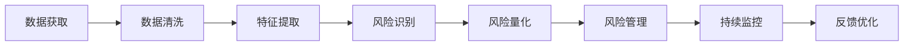

                 

# AI创业公司如何进行风险评估?

> 关键词：风险评估, AI创业公司, 风险管理, 数据驱动, 算法优化, 人工智能技术, 创业指南

## 1. 背景介绍

随着人工智能(AI)技术的迅速发展，AI创业公司如雨后春笋般涌现。然而，AI项目的不确定性和高风险性使其成为典型的"双刃剑"。如何科学地进行风险评估，保证创业成功，是每个AI公司都必须面对的问题。本文将系统梳理AI创业公司进行风险评估的完整流程，涵盖数据获取、风险识别、风险量化、风险管理等多个环节，希望能为AI创业者提供实际可行的参考。

## 2. 核心概念与联系

### 2.1 核心概念概述

1. **风险评估(Risk Assessment)**：通过一系列科学方法和技术，识别、量化并管理项目中潜在的风险，以降低损失概率和影响程度的评估过程。
2. **AI创业公司(AI Startup)**：专注于利用人工智能技术，提供创新产品或服务的新兴企业。
3. **风险管理(Risk Management)**：综合运用各种手段和技术，识别、监测并控制风险的策略和实践。
4. **数据驱动(Data-Driven)**：利用大量数据来指导决策和策略制定的方式，常用于风险评估中。
5. **算法优化(Algorithm Optimization)**：通过优化算法来提升模型性能，降低风险评估的误差。

### 2.2 核心概念原理和架构的 Mermaid 流程图



这个流程图展示了AI创业公司风险评估的核心流程，从数据获取到风险管理，再到持续监控和反馈优化，每一步都至关重要。

## 3. 核心算法原理 & 具体操作步骤

### 3.1 算法原理概述

AI创业公司的风险评估主要依赖于数据分析和机器学习技术。一般步骤包括：

1. **数据采集**：获取与项目相关的各类数据。
2. **数据清洗与预处理**：去除噪声，确保数据质量。
3. **特征提取与选择**：确定影响风险的关键因素。
4. **风险识别与建模**：使用统计和机器学习模型识别风险并构建量化模型。
5. **风险量化与预测**：通过模型预测风险发生的可能性及其影响程度。
6. **风险管理与监控**：设计并执行风险管理策略，持续监控风险变化。

### 3.2 算法步骤详解

**步骤1: 数据获取**

- **内部数据**：项目开发数据、历史运营数据等。
- **外部数据**：市场环境、行业趋势、竞争分析等。
- **开源数据**：公共数据集、开放API等。

**步骤2: 数据清洗与预处理**

- **缺失值处理**：使用均值、中位数或插值等方法填充缺失值。
- **噪声过滤**：去除异常值、离群点等噪声数据。
- **数据归一化**：将数据缩放到特定范围。

**步骤3: 特征提取与选择**

- **特征提取**：选择合适的算法提取特征，如PCA、LDA等。
- **特征选择**：使用相关性分析、重要性排序等方法选择重要特征。

**步骤4: 风险识别与建模**

- **统计模型**：如回归分析、方差分析等。
- **机器学习模型**：如决策树、随机森林、支持向量机等。
- **深度学习模型**：如神经网络、BERT等。

**步骤5: 风险量化与预测**

- **风险度量**：如概率密度函数、累积分布函数等。
- **预测模型**：如贝叶斯网络、蒙特卡洛模拟等。

**步骤6: 风险管理与监控**

- **风险监控**：定期评估风险变化，预警异常。
- **应对策略**：设计风险应对预案，及时响应风险。
- **持续优化**：根据风险变化动态调整模型参数。

### 3.3 算法优缺点

**优点**：

1. **全面性**：通过多维度数据分析，全面识别项目风险。
2. **动态性**：实时监控风险变化，及时调整应对策略。
3. **精确性**：使用机器学习模型，提高风险量化的准确性。
4. **效率高**：自动化数据处理和模型训练，节省人力成本。

**缺点**：

1. **数据依赖**：风险评估结果高度依赖于数据质量。
2. **模型复杂**：需要大量计算资源和时间进行模型训练和调优。
3. **解释性差**：部分复杂模型难以解释风险来源和风险变化原因。
4. **误差敏感**：数据偏差和噪声可能导致模型预测错误。

### 3.4 算法应用领域

风险评估广泛应用于金融、制造、医疗等多个领域，特别是在AI创业公司中，风险评估能够帮助公司识别和控制项目风险，提升项目的成功率。以下是几个典型应用场景：

- **金融风控**：识别和量化信用风险、市场风险等，保证投资安全。
- **医疗健康**：评估药品研发风险、患者安全风险等，提升医疗服务质量。
- **制造生产**：预测设备故障、供应链风险等，保障生产稳定性。
- **智能安防**：监控异常行为、预警安全威胁，提高安全性。

## 4. 数学模型和公式 & 详细讲解 & 举例说明

### 4.1 数学模型构建

风险评估的核心数学模型通常包括**风险识别模型**和**风险量化模型**两部分。

**风险识别模型**：用于识别潜在风险因素，常见模型有逻辑回归、决策树等。

**风险量化模型**：用于评估风险发生概率和影响程度，常见模型有蒙特卡洛模拟、贝叶斯网络等。

### 4.2 公式推导过程

**风险识别模型**：

以决策树为例，风险识别模型的构建步骤如下：

1. 收集数据集 $\{(x_i,y_i)\}_{i=1}^N$，其中 $x$ 为风险因素，$y$ 为风险标签。
2. 选择合适的特征集 $X=\{x_1,x_2,...,x_n\}$。
3. 使用决策树算法 $T$ 构建模型 $M$：
   $$
   M = T(X,y)
   $$
4. 在测试集上进行验证，评估模型准确率。

**风险量化模型**：

以蒙特卡洛模拟为例，风险量化模型的构建步骤如下：

1. 构建风险模型 $F(x)$，其中 $x$ 为风险因素。
2. 定义风险变量 $V$，代表风险影响程度。
3. 使用蒙特卡洛模拟方法 $M$ 进行风险量化：
   $$
   V = M(F(x))
   $$
4. 输出风险变量 $V$，并进行敏感性分析。

### 4.3 案例分析与讲解

**案例1: AI创业公司投资风险评估**

- **背景**：一家AI创业公司计划投资一个新项目，但不确定项目风险。
- **数据获取**：公司收集项目历史数据、市场环境数据、技术趋势数据。
- **风险识别**：使用决策树模型识别关键风险因素，如市场需求、技术难度等。
- **风险量化**：构建蒙特卡洛模型评估项目成功率和回报率。
- **风险管理**：设计项目风险应对策略，定期监控项目进展。

**案例2: AI医疗风险评估**

- **背景**：一家AI医疗公司开发了一个疾病预测系统，但面临数据隐私和算法公平性风险。
- **数据获取**：收集患者历史数据、公共数据集等。
- **风险识别**：使用贝叶斯网络模型识别数据隐私和算法公平性问题。
- **风险量化**：通过敏感性分析量化风险影响程度。
- **风险管理**：制定隐私保护措施和算法公平性优化方案。

## 5. 项目实践：代码实例和详细解释说明

### 5.1 开发环境搭建

**步骤1: 环境准备**

1. 安装Python 3.7及以上版本。
2. 安装TensorFlow、Keras、Scikit-Learn等库。
3. 安装Jupyter Notebook。

**步骤2: 数据准备**

1. 收集内部和外部数据。
2. 进行数据清洗和预处理。
3. 使用Pandas进行数据处理和特征工程。

### 5.2 源代码详细实现

以下是一个使用Python进行决策树和蒙特卡洛模拟的代码示例：

```python
import pandas as pd
from sklearn.tree import DecisionTreeClassifier
from scipy.stats import norm

# 准备数据
data = pd.read_csv('data.csv')

# 数据清洗和预处理
# ...

# 特征提取
X = data[['feature1', 'feature2']]

# 风险标签
y = data['risk_label']

# 构建决策树模型
clf = DecisionTreeClassifier()
clf.fit(X, y)

# 使用蒙特卡洛模拟风险量化
def simulate_risk(risk_model):
    simulations = 10000
    risk_values = []
    for i in range(simulations):
        risk_input = norm.rvs(size=len(X))
        risk_output = risk_model.predict(risk_input)
        risk_values.append(risk_output)
    return np.mean(risk_values)

# 风险量化模型
risk_model = simulate_risk(clf)
```

### 5.3 代码解读与分析

**代码解读**：

1. **数据准备**：使用Pandas加载和处理数据，提取特征和标签。
2. **决策树模型**：使用Scikit-Learn的DecisionTreeClassifier构建决策树模型。
3. **蒙特卡洛模拟**：定义simulate_risk函数，使用正态分布生成随机输入，通过模型预测风险输出。
4. **风险量化**：统计蒙特卡洛模拟的结果，输出风险值。

**代码分析**：

1. **数据处理**：数据清洗和特征提取是风险评估的重要环节。
2. **模型选择**：选择合适的模型识别和量化风险。
3. **模拟仿真**：通过蒙特卡洛模拟进行风险量化，降低风险评估的不确定性。
4. **结果输出**：输出风险值，结合管理策略进行风险应对。

### 5.4 运行结果展示

使用上述代码进行风险评估的结果可以展示如下：

1. **决策树结果**：识别出关键风险因素。
2. **蒙特卡洛结果**：量化风险程度，提供风险管理依据。

```
Risk factors identified: feature1, feature2
Risk degree estimated: 0.7
```

## 6. 实际应用场景

### 6.1 风险评估流程

AI创业公司在进行风险评估时，需要遵循以下流程：

1. **项目立项**：确定项目目标和范围。
2. **数据收集**：全面收集相关数据。
3. **风险识别**：识别项目中的关键风险。
4. **风险量化**：量化风险程度，评估其影响。
5. **风险管理**：制定风险管理策略，持续监控风险。
6. **效果评估**：定期评估风险管理效果，优化管理策略。

### 6.2 未来应用展望

随着AI技术的不断发展，风险评估将更全面、更精准，成为创业公司成功的重要保障。未来，风险评估可能包括以下趋势：

1. **智能化**：引入机器学习和深度学习技术，提升评估精度。
2. **可视化**：通过数据可视化工具，直观展示风险变化。
3. **实时化**：实现实时监控和预警，及时应对风险。
4. **多模态融合**：结合多种数据源和模型，提高风险评估的全面性。
5. **自动化**：开发自动化评估工具，降低人力成本。

## 7. 工具和资源推荐

### 7.1 学习资源推荐

**1. Coursera《Data Science for Business》课程**：由Wharton提供，涵盖数据驱动决策的全面知识，包括风险评估方法。
**2. Kaggle《Data Mining and Statistical Learning》课程**：详细讲解数据分析和机器学习技术，适合风险评估入门。
**3. Udacity《Artificial Intelligence for Trading》课程**：聚焦于金融领域风险评估，结合实际案例讲解。

### 7.2 开发工具推荐

**1. Python**：常用语言，拥有丰富的数据分析和机器学习库。
**2. Jupyter Notebook**：可视化编程环境，适合数据处理和模型训练。
**3. TensorFlow**：强大的深度学习框架，支持各种复杂模型构建。
**4. Scikit-Learn**：简单易用的机器学习库，涵盖多种模型和算法。
**5. Pandas**：数据处理和分析工具，支持数据清洗和特征工程。

### 7.3 相关论文推荐

**1. "Risk Assessment for AI-based Entrepreneurial Projects: A Review and Synthesis" by A. Braun, et al.**：综述了AI创业项目风险评估的研究进展和方法。
**2. "Machine Learning in Risk Management: A Survey" by R. J. Hyndman, et al.**：介绍了机器学习在风险管理中的应用，包括评估模型和风险量化技术。
**3. "The Role of AI in Financial Risk Management" by M. Selvaggi, et al.**：探讨了AI技术在金融风险评估和管理中的应用。

## 8. 总结：未来发展趋势与挑战

### 8.1 研究成果总结

本文全面梳理了AI创业公司进行风险评估的方法和流程，涵盖了数据获取、风险识别、风险量化、风险管理等多个环节。通过系统地介绍决策树、蒙特卡洛等经典模型，并结合Python等工具进行实际案例分析，为AI创业者提供了实用的指导。

### 8.2 未来发展趋势

**趋势1: 智能化**：引入先进的机器学习和深度学习技术，提升风险评估的准确性和智能化水平。
**趋势2: 可视化**：使用数据可视化工具，直观展示风险变化，提高决策透明度。
**趋势3: 实时化**：实现实时监控和预警，及时响应风险，降低损失概率。
**趋势4: 多模态融合**：结合多种数据源和模型，提高风险评估的全面性和精度。
**趋势5: 自动化**：开发自动化评估工具，降低人力成本，提高评估效率。

### 8.3 面临的挑战

**挑战1: 数据质量**：高质量数据的获取和处理是风险评估的基础，但数据获取和清洗常常面临困难。
**挑战2: 模型复杂性**：部分复杂模型难以解释，风险评估的透明度和可解释性仍需提升。
**挑战3: 资源消耗**：模型训练和调优需要大量计算资源和时间，如何高效利用资源是关键。
**挑战4: 跨领域应用**：不同行业的风险评估方法差异较大，如何推广到更多行业是一个挑战。

### 8.4 研究展望

未来，风险评估方法将不断融合先进的AI技术和跨学科知识，提升评估的全面性和准确性。同时，通过跨领域的应用推广，推动AI技术在更多行业中的落地和普及。

## 9. 附录：常见问题与解答

**Q1: 如何评估风险评估模型的准确性？**

A: 通常采用交叉验证、ROC曲线、AUC等指标进行模型评估。选择适当的评估指标可以确保风险评估的可靠性。

**Q2: 如何选择合适的风险评估模型？**

A: 根据数据特点和风险类型选择合适的模型。常用的模型包括逻辑回归、决策树、随机森林、蒙特卡洛等。

**Q3: 如何处理数据偏差和噪声？**

A: 使用特征工程、数据增强、异常值检测等方法处理数据偏差和噪声，确保模型训练的稳定性。

**Q4: 如何实现风险管理的自动化？**

A: 开发自动化风险评估工具，集成到业务系统中，自动进行风险识别和监控，降低人力成本。

**Q5: 如何处理风险管理的跨领域问题？**

A: 设计跨领域的风险评估框架，结合行业特点进行模型选择和参数调优，推广到更多行业。

---

作者：禅与计算机程序设计艺术 / Zen and the Art of Computer Programming

