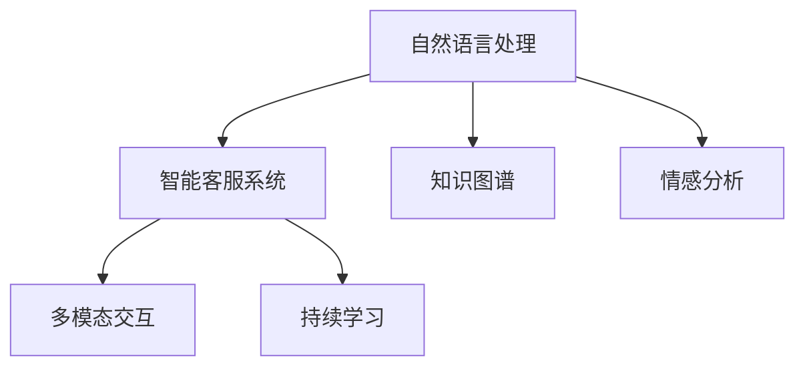

                 

# AI创业公司的客户服务创新

## 1. 背景介绍

### 1.1 问题由来
随着科技的迅猛发展，AI技术的应用场景已经深入到各行各业。在AI创业公司的客户服务领域，传统的客服方式正面临前所未有的挑战。客户服务不仅需要处理大量的咨询，还要面对个性化需求、语言障碍、复杂情境等难题。如何借助AI技术提升客户服务效率，改善用户体验，成为摆在AI创业公司面前的重要课题。

### 1.2 问题核心关键点
客户服务领域，AI创业公司面临的主要挑战包括：
- 提升服务效率：传统客服模式响应慢，人工成本高，难以满足客户的高效率需求。
- 改善用户体验：客服流程繁琐，难以提供个性化、高质量的服务体验。
- 解决语言障碍：全球化市场对客服的多语种支持要求日益增加，难以找到合适的多语言客服资源。
- 处理复杂情境：客户咨询可能涉及多个领域，客服系统难以高效处理。
- 提升客户满意度：客户期望获取快速、准确、个性化的响应，传统的自动化系统难以完全满足。

这些问题催生了AI技术在客户服务领域的创新应用。AI创业公司利用最新的AI技术，如自然语言处理(NLP)、机器学习(ML)、深度学习(DL)等，开发出了一系列智能客服系统，大大提升了客户服务的质量和效率。

### 1.3 问题研究意义
客户服务创新不仅能够提升企业的运营效率和客户满意度，还能增强企业的市场竞争力。AI技术在客户服务领域的广泛应用，标志着企业从传统的人力驱动模式向智能化、自动化模式的转变。同时，客户服务创新也有助于推动AI技术的普及和落地，为其他行业提供可借鉴的范例。

## 2. 核心概念与联系

### 2.1 核心概念概述

为更好地理解AI创业公司客户服务的创新方法，本节将介绍几个密切相关的核心概念：

- **自然语言处理(NLP)**：利用AI技术对自然语言进行理解和处理，包括分词、句法分析、语义理解、情感分析等。
- **智能客服系统**：基于AI技术的自动化客服系统，能够理解客户需求，提供快速、个性化的响应。
- **知识图谱**：通过语义网络描述实体及其关系，用于提升智能客服系统的语义理解和推荐能力。
- **情感分析**：分析客户语言中的情感倾向，用于客户情绪监控和用户体验优化。
- **多模态交互**：结合语音、文本、图像等多种数据类型，提升智能客服系统的感知和处理能力。
- **持续学习**：智能客服系统能够从新数据中学习，保持和提高自身性能，避免过时和遗忘。

这些核心概念之间的逻辑关系可以通过以下Mermaid流程图来展示：



这个流程图展示了这个体系的核心概念及其之间的关系：

1. 自然语言处理是大语言模型的基础，用于处理客户输入的文本信息。
2. 智能客服系统基于自然语言处理，实现对客户需求的理解和响应。
3. 知识图谱用于增强智能客服系统的语义理解能力。
4. 情感分析用于客户情绪监控和用户体验优化。
5. 多模态交互丰富了智能客服系统的感知手段。
6. 持续学习确保了智能客服系统的性能不断提升。

这些概念共同构成了AI创业公司客户服务系统的核心架构，使其能够高效、智能地处理客户咨询。

## 3. 核心算法原理 & 具体操作步骤
### 3.1 算法原理概述

AI创业公司的客户服务系统主要基于自然语言处理技术，通过以下步骤实现智能客服：

1. **预训练大语言模型**：利用大规模无标签数据进行预训练，学习语言的基础表示。
2. **任务适配**：根据具体的客服场景，设计任务的适配层，用于理解客户咨询的具体需求。
3. **数据标注**：收集客户咨询的标注数据，用于训练和微调模型。
4. **模型微调**：在标注数据上训练模型，根据任务的特定需求调整模型参数。
5. **多模态融合**：结合语音、文本、图像等多种数据类型，提升客户服务的感知能力。
6. **持续学习**：在新的客户咨询中不断更新模型参数，保持模型性能的持续提升。

### 3.2 算法步骤详解

以下是AI创业公司客户服务系统的详细操作步骤：

**Step 1: 准备预训练模型和数据集**
- 选择合适的预训练语言模型，如GPT-3、BERT等。
- 收集客户咨询的数据集，包括文本、语音、图像等多种类型。

**Step 2: 任务适配层设计**
- 根据客服场景，设计适配层，如意图分类器、实体识别器等。
- 对适配层的输入和输出进行标注，如Intent标签、实体标签等。

**Step 3: 数据标注**
- 对收集的客户咨询数据进行标注，标注其意图和实体等关键信息。
- 对标注数据进行分集，划分为训练集、验证集和测试集。

**Step 4: 模型微调**
- 使用标注数据在适配层和预训练模型上进行微调。
- 选择合适的优化器，如AdamW、SGD等，设置合适的学习率。
- 在微调过程中，应用正则化技术，如Dropout、L2正则等。

**Step 5: 多模态融合**
- 利用语音识别技术将语音转换为文本。
- 结合图像识别技术，分析客户上传的图片内容。
- 将文本和图像信息作为输入，一起输入到模型中处理。

**Step 6: 持续学习**
- 收集新的客户咨询数据，重新训练模型。
- 使用在线学习技术，在新的数据上不断更新模型参数。
- 定期评估模型性能，根据性能指标调整模型。

### 3.3 算法优缺点

AI创业公司的客户服务系统基于自然语言处理技术，具有以下优点：
- **高效率**：智能客服系统能够快速响应客户咨询，处理大量请求。
- **个性化**：根据客户咨询的历史数据，智能客服系统能够提供个性化的响应。
- **多语言支持**：利用多语言模型，智能客服系统能够支持多种语言的客户服务。
- **语义理解**：通过知识图谱和语义分析，智能客服系统能够理解客户的复杂需求。

同时，该系统也存在一些局限性：
- **高成本**：构建和维护智能客服系统需要大量的数据和计算资源。
- **准确性**：智能客服系统可能无法完全理解客户的复杂需求，导致误导或误解。
- **依赖数据**：智能客服系统的性能很大程度上依赖于训练数据的质量和数量。
- **可解释性**：智能客服系统的决策过程缺乏可解释性，难以调试和优化。

尽管存在这些局限性，但就目前而言，基于自然语言处理的客户服务系统仍然是最主流的方法。未来相关研究的重点在于如何进一步降低成本、提高准确性、优化模型可解释性，同时兼顾多语言支持和个性化推荐等技术需求。

### 3.4 算法应用领域

基于AI创业公司的客户服务系统已经在多个领域得到了广泛的应用，例如：

- **电商平台**：为在线购物用户提供24小时在线客服支持，解答购物疑问，推荐商品。
- **金融行业**：提供金融产品的咨询和购买服务，解答用户对于金融产品的疑问，推荐适合的金融产品。
- **旅游行业**：提供旅游咨询服务，解答用户对于旅游目的地、行程安排等方面的问题。
- **医疗行业**：提供医疗咨询，解答用户对于健康问题的疑问，推荐医生或药物。

除了这些经典应用外，智能客服系统还被创新性地应用到更多场景中，如智能家居、智能汽车、智能客服机器人等，为各行各业提供了智能化的客户服务解决方案。随着AI技术的不断进步，智能客服系统将在更多领域大放异彩，推动AI技术的产业化进程。

## 4. 数学模型和公式 & 详细讲解  
### 4.1 数学模型构建

本节将使用数学语言对AI创业公司客户服务系统的核心算法进行更加严格的刻画。

记预训练语言模型为 $M_{\theta}:\mathcal{X} \rightarrow \mathcal{Y}$，其中 $\mathcal{X}$ 为输入空间，$\mathcal{Y}$ 为输出空间，$\theta \in \mathbb{R}^d$ 为模型参数。假设客服系统的训练集为 $D=\{(x_i,y_i)\}_{i=1}^N, x_i \in \mathcal{X}, y_i \in \mathcal{Y}$。

定义模型 $M_{\theta}$ 在输入 $x$ 上的损失函数为 $\ell(M_{\theta}(x),y)$，则在数据集 $D$ 上的经验风险为：

$$
\mathcal{L}(\theta) = \frac{1}{N} \sum_{i=1}^N \ell(M_{\theta}(x_i),y_i)
$$

微调的优化目标是最小化经验风险，即找到最优参数：

$$
\theta^* = \mathop{\arg\min}_{\theta} \mathcal{L}(\theta)
$$

在实践中，我们通常使用基于梯度的优化算法（如SGD、Adam等）来近似求解上述最优化问题。设 $\eta$ 为学习率，$\lambda$ 为正则化系数，则参数的更新公式为：

$$
\theta \leftarrow \theta - \eta \nabla_{\theta}\mathcal{L}(\theta) - \eta\lambda\theta
$$

其中 $\nabla_{\theta}\mathcal{L}(\theta)$ 为损失函数对参数 $\theta$ 的梯度，可通过反向传播算法高效计算。

### 4.2 公式推导过程

以下我们以二分类任务为例，推导交叉熵损失函数及其梯度的计算公式。

假设模型 $M_{\theta}$ 在输入 $x$ 上的输出为 $\hat{y}=M_{\theta}(x) \in [0,1]$，表示样本属于正类的概率。真实标签 $y \in \{0,1\}$。则二分类交叉熵损失函数定义为：

$$
\ell(M_{\theta}(x),y) = -[y\log \hat{y} + (1-y)\log (1-\hat{y})]
$$

将其代入经验风险公式，得：

$$
\mathcal{L}(\theta) = -\frac{1}{N}\sum_{i=1}^N [y_i\log M_{\theta}(x_i)+(1-y_i)\log(1-M_{\theta}(x_i))]
$$

根据链式法则，损失函数对参数 $\theta_k$ 的梯度为：

$$
\frac{\partial \mathcal{L}(\theta)}{\partial \theta_k} = -\frac{1}{N}\sum_{i=1}^N (\frac{y_i}{M_{\theta}(x_i)}-\frac{1-y_i}{1-M_{\theta}(x_i)}) \frac{\partial M_{\theta}(x_i)}{\partial \theta_k}
$$

其中 $\frac{\partial M_{\theta}(x_i)}{\partial \theta_k}$ 可进一步递归展开，利用自动微分技术完成计算。

在得到损失函数的梯度后，即可带入参数更新公式，完成模型的迭代优化。重复上述过程直至收敛，最终得到适应下游任务的最优模型参数 $\theta^*$。

## 5. 项目实践：代码实例和详细解释说明
### 5.1 开发环境搭建

在进行客户服务系统的开发前，我们需要准备好开发环境。以下是使用Python进行PyTorch开发的环境配置流程：

1. 安装Anaconda：从官网下载并安装Anaconda，用于创建独立的Python环境。

2. 创建并激活虚拟环境：
```bash
conda create -n pytorch-env python=3.8 
conda activate pytorch-env
```

3. 安装PyTorch：根据CUDA版本，从官网获取对应的安装命令。例如：
```bash
conda install pytorch torchvision torchaudio cudatoolkit=11.1 -c pytorch -c conda-forge
```

4. 安装各类工具包：
```bash
pip install numpy pandas scikit-learn matplotlib tqdm jupyter notebook ipython
```

完成上述步骤后，即可在`pytorch-env`环境中开始客户服务系统的开发。

### 5.2 源代码详细实现

下面我以电商平台客服系统的实现为例，给出使用Transformers库进行智能客服系统开发的PyTorch代码实现。

首先，定义客户咨询的数据处理函数：

```python
from transformers import BertTokenizer
from torch.utils.data import Dataset
import torch

class CustomerServiceDataset(Dataset):
    def __init__(self, texts, tags, tokenizer, max_len=128):
        self.texts = texts
        self.tags = tags
        self.tokenizer = tokenizer
        self.max_len = max_len
        
    def __len__(self):
        return len(self.texts)
    
    def __getitem__(self, item):
        text = self.texts[item]
        tags = self.tags[item]
        
        encoding = self.tokenizer(text, return_tensors='pt', max_length=self.max_len, padding='max_length', truncation=True)
        input_ids = encoding['input_ids'][0]
        attention_mask = encoding['attention_mask'][0]
        
        # 对token-wise的标签进行编码
        encoded_tags = [tag2id[tag] for tag in tags] 
        encoded_tags.extend([tag2id['O']] * (self.max_len - len(encoded_tags)))
        labels = torch.tensor(encoded_tags, dtype=torch.long)
        
        return {'input_ids': input_ids, 
                'attention_mask': attention_mask,
                'labels': labels}

# 标签与id的映射
tag2id = {'O': 0, 'buy': 1, 'return': 2, 'rating': 3, 'query': 4}
id2tag = {v: k for k, v in tag2id.items()}

# 创建dataset
tokenizer = BertTokenizer.from_pretrained('bert-base-cased')

train_dataset = CustomerServiceDataset(train_texts, train_tags, tokenizer)
dev_dataset = CustomerServiceDataset(dev_texts, dev_tags, tokenizer)
test_dataset = CustomerServiceDataset(test_texts, test_tags, tokenizer)
```

然后，定义模型和优化器：

```python
from transformers import BertForTokenClassification, AdamW

model = BertForTokenClassification.from_pretrained('bert-base-cased', num_labels=len(tag2id))

optimizer = AdamW(model.parameters(), lr=2e-5)
```

接着，定义训练和评估函数：

```python
from torch.utils.data import DataLoader
from tqdm import tqdm
from sklearn.metrics import classification_report

device = torch.device('cuda') if torch.cuda.is_available() else torch.device('cpu')
model.to(device)

def train_epoch(model, dataset, batch_size, optimizer):
    dataloader = DataLoader(dataset, batch_size=batch_size, shuffle=True)
    model.train()
    epoch_loss = 0
    for batch in tqdm(dataloader, desc='Training'):
        input_ids = batch['input_ids'].to(device)
        attention_mask = batch['attention_mask'].to(device)
        labels = batch['labels'].to(device)
        model.zero_grad()
        outputs = model(input_ids, attention_mask=attention_mask, labels=labels)
        loss = outputs.loss
        epoch_loss += loss.item()
        loss.backward()
        optimizer.step()
    return epoch_loss / len(dataloader)

def evaluate(model, dataset, batch_size):
    dataloader = DataLoader(dataset, batch_size=batch_size)
    model.eval()
    preds, labels = [], []
    with torch.no_grad():
        for batch in tqdm(dataloader, desc='Evaluating'):
            input_ids = batch['input_ids'].to(device)
            attention_mask = batch['attention_mask'].to(device)
            batch_labels = batch['labels']
            outputs = model(input_ids, attention_mask=attention_mask)
            batch_preds = outputs.logits.argmax(dim=2).to('cpu').tolist()
            batch_labels = batch_labels.to('cpu').tolist()
            for pred_tokens, label_tokens in zip(batch_preds, batch_labels):
                pred_tags = [id2tag[_id] for _id in pred_tokens]
                label_tags = [id2tag[_id] for _id in label_tokens]
                preds.append(pred_tags[:len(label_tags)])
                labels.append(label_tags)
                
    print(classification_report(labels, preds))
```

最后，启动训练流程并在测试集上评估：

```python
epochs = 5
batch_size = 16

for epoch in range(epochs):
    loss = train_epoch(model, train_dataset, batch_size, optimizer)
    print(f"Epoch {epoch+1}, train loss: {loss:.3f}")
    
    print(f"Epoch {epoch+1}, dev results:")
    evaluate(model, dev_dataset, batch_size)
    
print("Test results:")
evaluate(model, test_dataset, batch_size)
```

以上就是使用PyTorch对BERT进行客户服务系统开发的完整代码实现。可以看到，得益于Transformers库的强大封装，我们可以用相对简洁的代码完成BERT模型的加载和微调。

### 5.3 代码解读与分析

让我们再详细解读一下关键代码的实现细节：

**CustomerServiceDataset类**：
- `__init__`方法：初始化文本、标签、分词器等关键组件。
- `__len__`方法：返回数据集的样本数量。
- `__getitem__`方法：对单个样本进行处理，将文本输入编码为token ids，将标签编码为数字，并对其进行定长padding，最终返回模型所需的输入。

**tag2id和id2tag字典**：
- 定义了标签与数字id之间的映射关系，用于将token-wise的预测结果解码回真实的标签。

**训练和评估函数**：
- 使用PyTorch的DataLoader对数据集进行批次化加载，供模型训练和推理使用。
- 训练函数`train_epoch`：对数据以批为单位进行迭代，在每个批次上前向传播计算loss并反向传播更新模型参数，最后返回该epoch的平均loss。
- 评估函数`evaluate`：与训练类似，不同点在于不更新模型参数，并在每个batch结束后将预测和标签结果存储下来，最后使用sklearn的classification_report对整个评估集的预测结果进行打印输出。

**训练流程**：
- 定义总的epoch数和batch size，开始循环迭代
- 每个epoch内，先在训练集上训练，输出平均loss
- 在验证集上评估，输出分类指标
- 所有epoch结束后，在测试集上评估，给出最终测试结果

可以看到，PyTorch配合Transformers库使得客户服务系统的开发变得简洁高效。开发者可以将更多精力放在数据处理、模型改进等高层逻辑上，而不必过多关注底层的实现细节。

当然，工业级的系统实现还需考虑更多因素，如模型的保存和部署、超参数的自动搜索、更灵活的任务适配层等。但核心的微调范式基本与此类似。

## 6. 实际应用场景
### 6.1 电商平台

在电商平台客服系统中，智能客服系统可以提供24小时在线客服支持，解答客户对于购物、退货、评价等方面的疑问。客户可以在线提交问题，智能客服系统自动分派到相应的客户服务人员进行处理，大大提升了客户咨询的响应速度和处理效率。

具体而言，智能客服系统可以集成到电商平台的前端页面，用户提交问题后，系统自动进行文本解析和语义理解，选择最匹配的回复模板，最终生成自然流畅的回答。同时，系统还可以集成多模态交互功能，如语音识别、图像分析等，提供更加丰富和多样的服务体验。

### 6.2 金融行业

在金融行业中，智能客服系统可以为客户提供7x24小时的咨询和支持服务。客户可以查询金融产品信息、申请贷款、咨询财务规划等，系统根据客户的需求自动匹配相应的回答，并提供个性化的推荐服务。

智能客服系统利用情感分析技术，实时监控客户的情绪变化，对于负面情绪的咨询，系统可以自动转接到人工客服进行进一步处理，确保客户满意度的稳定。同时，系统还可以结合知识图谱，提供实时的金融市场信息和趋势分析，帮助客户做出明智的投资决策。

### 6.3 旅游行业

在旅游行业中，智能客服系统可以提供全球化多语言支持，帮助客户查询旅游目的地、行程安排、酒店预订等。客户可以在线提交问题，系统自动进行文本解析和语义理解，提供最符合客户需求的旅游建议和解决方案。

智能客服系统还可以集成图像分析功能，帮助客户识别和判断旅游景点的真实情况，避免因信息不对称造成的误导。同时，系统还可以根据客户的兴趣和偏好，提供个性化的旅游推荐，提升客户的旅游体验。

### 6.4 未来应用展望

随着AI技术的不断发展，智能客服系统将在更多领域得到应用，为各行各业带来变革性影响。

在智慧医疗领域，智能客服系统可以提供24小时在线咨询服务，帮助患者解答健康问题，推荐医生或药物。对于复杂病情，系统可以自动分派到专家进行进一步处理，确保患者得到高质量的医疗服务。

在智能教育领域，智能客服系统可以提供智能化的学习辅导服务，帮助学生解答学习中的疑问，提供个性化的学习建议。系统可以集成智能化的作业批改和学情分析，提升教育质量和学习效率。

在智慧城市治理中，智能客服系统可以提供多语种的城市服务信息，帮助居民查询公共服务、交通出行、天气预报等。系统还可以集成智能化的舆情分析，及时响应城市事件，提升城市管理的智能化水平。

此外，在企业生产、社会治理、文娱传媒等众多领域，智能客服系统也将不断涌现，为各行各业提供智能化的客户服务解决方案，推动AI技术的广泛应用。

## 7. 工具和资源推荐
### 7.1 学习资源推荐

为了帮助开发者系统掌握AI创业公司客户服务系统的理论基础和实践技巧，这里推荐一些优质的学习资源：

1. 《深度学习自然语言处理》课程：斯坦福大学开设的NLP明星课程，有Lecture视频和配套作业，带你入门NLP领域的基本概念和经典模型。

2. CS224N《深度学习自然语言处理》书籍：Transformer库的作者所著，全面介绍了如何使用Transformers库进行NLP任务开发，包括微调在内的诸多范式。

3. 《Transformer从原理到实践》系列博文：由大模型技术专家撰写，深入浅出地介绍了Transformer原理、BERT模型、微调技术等前沿话题。

4. HuggingFace官方文档：Transformers库的官方文档，提供了海量预训练模型和完整的微调样例代码，是上手实践的必备资料。

5. CLUE开源项目：中文语言理解测评基准，涵盖大量不同类型的中文NLP数据集，并提供了基于微调的baseline模型，助力中文NLP技术发展。

通过对这些资源的学习实践，相信你一定能够快速掌握AI创业公司客户服务系统的精髓，并用于解决实际的NLP问题。

### 7.2 开发工具推荐

高效的开发离不开优秀的工具支持。以下是几款用于AI创业公司客户服务系统开发的常用工具：

1. PyTorch：基于Python的开源深度学习框架，灵活动态的计算图，适合快速迭代研究。大部分预训练语言模型都有PyTorch版本的实现。

2. TensorFlow：由Google主导开发的开源深度学习框架，生产部署方便，适合大规模工程应用。同样有丰富的预训练语言模型资源。

3. Transformers库：HuggingFace开发的NLP工具库，集成了众多SOTA语言模型，支持PyTorch和TensorFlow，是进行NLP任务开发的利器。

4. Weights & Biases：模型训练的实验跟踪工具，可以记录和可视化模型训练过程中的各项指标，方便对比和调优。与主流深度学习框架无缝集成。

5. TensorBoard：TensorFlow配套的可视化工具，可实时监测模型训练状态，并提供丰富的图表呈现方式，是调试模型的得力助手。

6. Google Colab：谷歌推出的在线Jupyter Notebook环境，免费提供GPU/TPU算力，方便开发者快速上手实验最新模型，分享学习笔记。

合理利用这些工具，可以显著提升AI创业公司客户服务系统的开发效率，加快创新迭代的步伐。

### 7.3 相关论文推荐

AI创业公司客户服务系统的研究源于学界的持续研究。以下是几篇奠基性的相关论文，推荐阅读：

1. Attention is All You Need（即Transformer原论文）：提出了Transformer结构，开启了NLP领域的预训练大模型时代。

2. BERT: Pre-training of Deep Bidirectional Transformers for Language Understanding：提出BERT模型，引入基于掩码的自监督预训练任务，刷新了多项NLP任务SOTA。

3. Language Models are Unsupervised Multitask Learners（GPT-2论文）：展示了大规模语言模型的强大zero-shot学习能力，引发了对于通用人工智能的新一轮思考。

4. Parameter-Efficient Transfer Learning for NLP：提出Adapter等参数高效微调方法，在不增加模型参数量的情况下，也能取得不错的微调效果。

5. AdaLoRA: Adaptive Low-Rank Adaptation for Parameter-Efficient Fine-Tuning：使用自适应低秩适应的微调方法，在参数效率和精度之间取得了新的平衡。

这些论文代表了大语言模型微调技术的发展脉络。通过学习这些前沿成果，可以帮助研究者把握学科前进方向，激发更多的创新灵感。

## 8. 总结：未来发展趋势与挑战

### 8.1 总结

本文对AI创业公司客户服务系统的创新方法进行了全面系统的介绍。首先阐述了客户服务领域AI创业公司面临的主要挑战，明确了AI技术在客户服务中的独特价值。其次，从原理到实践，详细讲解了智能客服系统的核心算法和操作步骤，给出了系统开发的完整代码实例。同时，本文还广泛探讨了智能客服系统在电商平台、金融、旅游等多个行业领域的应用前景，展示了智能客服系统的广阔前景。最后，本文精选了智能客服系统的各类学习资源，力求为读者提供全方位的技术指引。

通过本文的系统梳理，可以看到，AI创业公司客户服务系统的创新方法不仅能够提升企业的运营效率和客户满意度，还能增强企业的市场竞争力。AI技术在客户服务领域的广泛应用，标志着企业从传统的人力驱动模式向智能化、自动化模式的转变。同时，客户服务创新也有助于推动AI技术的普及和落地，为其他行业提供可借鉴的范例。

### 8.2 未来发展趋势

展望未来，AI创业公司客户服务系统将呈现以下几个发展趋势：

1. **自动化水平提升**：未来的智能客服系统将具备更高的自动化水平，能够处理更多复杂多变的客户咨询，减轻人工客服的压力。
2. **多模态交互发展**：智能客服系统将集成语音、图像、视频等多种模态信息，提供更加丰富和多样的客户服务体验。
3. **持续学习与更新**：智能客服系统能够从新数据中不断学习，保持和提高自身的性能，避免过时和遗忘。
4. **个性化推荐强化**：基于客户历史数据和实时反馈，智能客服系统能够提供更加个性化和精准的服务推荐。
5. **跨领域应用拓展**：智能客服系统将不断拓展到更多行业领域，如智慧医疗、智能教育等，提升各行各业的运营效率和服务质量。
6. **伦理与安全关注**：智能客服系统在提供便捷服务的同时，也将注重数据隐私和安全保护，确保客户信息的安全性和合规性。

以上趋势凸显了AI创业公司客户服务系统的广阔前景。这些方向的探索发展，必将进一步提升客户服务的质量和效率，为AI技术在各行业的落地应用提供新的动力。

### 8.3 面临的挑战

尽管AI创业公司客户服务系统已经取得了瞩目成就，但在迈向更加智能化、普适化应用的过程中，它仍面临着诸多挑战：

1. **高成本投入**：构建和维护智能客服系统需要大量的数据和计算资源，对于中小企业来说，成本较高。
2. **数据质量问题**：智能客服系统的性能很大程度上依赖于训练数据的质量和数量，数据的缺失和噪音会影响系统的表现。
3. **可解释性不足**：智能客服系统的决策过程缺乏可解释性，难以调试和优化，客户对其输出结果的信任度有待提高。
4. **跨语言障碍**：智能客服系统需要支持多种语言，不同语言之间的语义差异和数据稀缺问题仍需解决。
5. **算法鲁棒性问题**：智能客服系统需要具备较高的鲁棒性，能够处理各种异常情况，避免误导或误解。

尽管存在这些挑战，但AI创业公司客户服务系统仍然是最具潜力的客户服务方式之一。未来相关研究的重点在于如何进一步降低成本、提高数据质量、增强模型可解释性，同时兼顾多语言支持和个性化推荐等技术需求。

### 8.4 研究展望

面对AI创业公司客户服务系统所面临的挑战，未来的研究需要在以下几个方面寻求新的突破：

1. **无监督和半监督学习**：摆脱对大规模标注数据的依赖，利用自监督学习、主动学习等无监督和半监督范式，最大限度利用非结构化数据。
2. **知识图谱与语义理解**：结合知识图谱和语义分析，提升智能客服系统的语义理解和推荐能力。
3. **情感分析与用户体验**：利用情感分析技术，监控客户情绪变化，提供个性化和高质量的服务体验。
4. **多模态融合与感知能力**：结合语音、图像、视频等多种数据类型，提升智能客服系统的感知能力。
5. **持续学习与数据增量更新**：在新的客户咨询中不断更新模型参数，保持模型性能的持续提升。
6. **可解释性与可控性**：开发更加可解释和可控的智能客服系统，增强客户对其输出结果的信任度。

这些研究方向将推动AI创业公司客户服务系统向更加智能化、普适化方向发展，为各行各业提供更加高效、个性化、智能化的客户服务解决方案。

## 9. 附录：常见问题与解答

**Q1：智能客服系统是否适用于所有企业？**

A: 智能客服系统在许多行业都有广泛应用，但并不是所有企业都适合。对于一些需要高度个性化服务的企业，如高端奢侈品、个性化定制等领域，智能客服系统的适应性可能有限。因此，企业在选择智能客服系统时，应结合自身业务特点和客户需求，综合评估其适用性。

**Q2：智能客服系统如何保证数据隐私和安全？**

A: 智能客服系统在处理客户数据时，应严格遵守数据隐私保护法律法规，如GDPR等。系统应采用数据加密、匿名化处理、访问控制等措施，确保客户数据的安全性和隐私性。同时，应定期进行数据安全审计，及时发现和修复潜在的安全漏洞。

**Q3：智能客服系统的学习效率如何？**

A: 智能客服系统的学习效率受多方面因素影响，如训练数据的质量和数量、模型架构和参数设置等。一般来说，具有大量标注数据和高性能计算资源的系统，其学习效率较高。企业可以根据自身情况，选择合适的智能客服系统，并通过持续优化模型和数据，提升系统性能。

**Q4：智能客服系统是否需要人工干预？**

A: 智能客服系统能够自动化处理大多数客户咨询，但对于一些复杂多变的场景，仍需要人工干预和处理。企业可以结合智能客服系统和人工客服，形成互补关系，提升客户服务的质量和效率。同时，智能客服系统也可以通过反馈机制，不断优化模型和算法，逐步减少人工干预的频率。

**Q5：智能客服系统的部署难度如何？**

A: 智能客服系统的部署难度主要取决于企业的技术实力和资源配置。对于技术团队较强的企业，可以利用云平台进行快速部署，利用容器化技术（如Docker、Kubernetes）进行系统管理，确保系统的稳定性和可扩展性。对于技术实力较弱的企业，可以借助第三方云服务商提供的智能客服平台，降低部署难度。

总之，智能客服系统在提升客户服务效率、改善用户体验方面具有巨大的潜力和价值。随着AI技术的不断发展和成熟，智能客服系统将逐步成为各行业客户服务的主流选择，推动AI技术的广泛应用和普及。未来，智能客服系统将继续优化和创新，为企业提供更加智能化、高效化和个性化的客户服务解决方案。

---

作者：禅与计算机程序设计艺术 / Zen and the Art of Computer Programming

