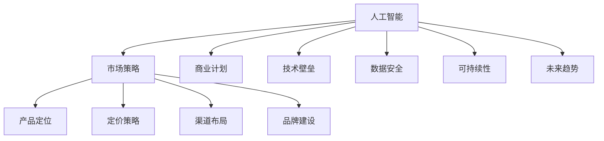

                 

# AI创业公司的市场策略

> 关键词：人工智能,市场策略,商业计划,技术壁垒,数据安全,可持续性,未来趋势

## 1. 背景介绍

在当今数字化转型的浪潮中，人工智能(AI)技术已成为推动各行各业变革的关键力量。从智能客服、智能推荐，到自动驾驶、医疗诊断，AI技术的应用领域不断拓展，深刻影响着人们的日常生活和工作方式。与此同时，AI创业公司层出不穷，但在激烈的市场竞争中，如何制定科学、有效的市场策略，已成为摆在AI创业者面前的重大课题。本文将从市场策略的角度，深入探讨AI创业公司如何抢占市场先机，构建持久的竞争优势。

## 2. 核心概念与联系

### 2.1 核心概念概述

为了更好地理解AI创业公司的市场策略，我们首先需要明确几个核心概念：

- **人工智能(AI)**：通过模拟人类智能，实现自主学习和决策的技术体系。包括机器学习、深度学习、自然语言处理、计算机视觉等多个子领域。

- **市场策略**：企业为实现其商业目标，在市场竞争中采取的一系列战略性决策。包括产品定位、定价策略、渠道布局、品牌建设等。

- **商业计划**：企业对其未来发展的总体规划和执行方案。包括市场分析、竞争分析、产品规划、财务预测等。

- **技术壁垒**：企业独有的技术优势，如专利、算法、架构等，形成难以被竞争对手模仿的竞争优势。

- **数据安全**：企业在数据收集、存储、处理、传输等过程中，采取的保护措施，确保数据不被非法获取、篡改、泄露。

- **可持续性**：企业运营模式是否具有长远的发展潜力，能否在不断变化的市场环境中保持竞争力和盈利能力。

- **未来趋势**：AI技术及市场需求的发展方向，如AI伦理、隐私保护、跨领域应用等。

这些核心概念相互关联，共同构成了AI创业公司的市场策略体系。以下将通过一个Mermaid流程图，展示这些概念之间的逻辑关系：



该图展示了人工智能如何通过市场策略的不同环节，支撑企业竞争优势的形成。

## 3. 核心算法原理 & 具体操作步骤

### 3.1 算法原理概述

AI创业公司的市场策略制定，本质上是一种数据驱动的决策过程。通过收集和分析市场数据，结合企业自身的技术优势，制定出符合市场需求、具有竞争力的商业计划。这一过程涉及到多个关键步骤，包括市场分析、竞争分析、产品规划、财务预测等。

具体而言，市场策略制定包括以下几个主要步骤：

1. **市场细分**：将市场划分为不同的细分市场，识别出最有潜力的目标市场。
2. **竞争分析**：分析竞争对手的市场表现、产品特点、商业模式等，找出自身的竞争优势和劣势。
3. **产品规划**：根据市场需求和技术能力，制定产品的功能、特性、定价等，形成独特的产品定位。
4. **渠道布局**：选择合适的销售渠道和分销模式，将产品推向市场。
5. **品牌建设**：通过市场营销和公关活动，提升企业品牌知名度和市场影响力。
6. **财务预测**：基于市场策略，进行收入、成本、利润等财务预测，制定投资计划。

### 3.2 算法步骤详解

以下将详细描述每个关键步骤的算法实现：

**Step 1: 市场细分**

市场细分的目的是识别出最有潜力的目标市场，以便更精准地制定市场策略。算法步骤如下：

1. **数据收集**：收集市场规模、增长率、用户行为、消费习惯等数据。
2. **数据预处理**：清洗、归一化、编码等数据预处理步骤。
3. **特征工程**：提取有意义的特征，如人口统计、地理位置、消费能力等。
4. **模型训练**：使用聚类算法或分类算法（如K-means、LDA、SVM等）对数据进行细分。
5. **结果评估**：评估细分市场的潜在价值和覆盖范围，筛选出最有潜力的细分市场。

**Step 2: 竞争分析**

竞争分析通过分析竞争对手的市场表现，找出自身的竞争优势和劣势。算法步骤如下：

1. **数据收集**：收集竞争对手的产品信息、市场份额、用户评价等数据。
2. **数据预处理**：清洗、归一化、编码等数据预处理步骤。
3. **特征工程**：提取有意义的特征，如产品功能、价格、用户体验等。
4. **模型训练**：使用分类或回归算法（如Logistic回归、随机森林、梯度提升树等）分析竞争对手的市场表现。
5. **结果评估**：评估竞争对手的市场定位和竞争策略，找出自身的优势和劣势。

**Step 3: 产品规划**

产品规划根据市场需求和技术能力，制定产品的功能、特性、定价等。算法步骤如下：

1. **需求分析**：通过用户调研、市场调研等方式收集用户需求。
2. **技术评估**：评估现有技术的可行性、成本效益等。
3. **产品设计**：根据需求和技术评估，设计产品的功能和特性。
4. **定价策略**：根据成本、市场定位、竞争情况等因素，制定合理的定价策略。

**Step 4: 渠道布局**

渠道布局选择合适的销售渠道和分销模式，将产品推向市场。算法步骤如下：

1. **渠道选择**：根据产品特性、目标市场、用户习惯等因素，选择合适的销售渠道（如直销、分销、线上、线下等）。
2. **渠道优化**：通过数据分析和反馈，优化渠道布局，提高销售效率。
3. **渠道管理**：制定渠道管理策略，如合作伙伴关系、售后服务等。

**Step 5: 品牌建设**

品牌建设通过市场营销和公关活动，提升企业品牌知名度和市场影响力。算法步骤如下：

1. **品牌定位**：根据企业核心价值和目标市场，制定品牌定位。
2. **营销策略**：制定各种营销策略，如广告、公关、内容营销等。
3. **市场推广**：通过市场推广活动，提升品牌知名度和市场影响力。

**Step 6: 财务预测**

财务预测基于市场策略，进行收入、成本、利润等财务预测，制定投资计划。算法步骤如下：

1. **财务数据收集**：收集历史财务数据和市场数据。
2. **财务模型建立**：建立收入、成本、利润等财务模型。
3. **预测计算**：使用财务模型进行未来财务预测。
4. **投资计划制定**：根据预测结果，制定投资计划和资本预算。

### 3.3 算法优缺点

**优点**：

1. **数据驱动决策**：通过数据分析和算法模型，制定科学的市场策略，避免主观判断带来的偏差。
2. **系统化流程**：将市场策略制定过程系统化、标准化，提高决策效率和准确性。
3. **可扩展性强**：算法步骤和模型可以灵活调整和优化，适应不同市场环境和技术能力。

**缺点**：

1. **数据质量要求高**：数据收集和处理过程中，数据质量对算法结果有较大影响。
2. **算法复杂度高**：市场策略制定涉及多步骤、多维度数据分析，算法复杂度高。
3. **模型解释性差**：一些高级算法（如深度学习、集成学习等）缺乏可解释性，影响决策透明度。

### 3.4 算法应用领域

AI创业公司的市场策略在多个领域都有广泛应用，包括但不限于：

1. **智能客服**：通过AI技术实现自动客服、语音识别、情感分析等，提升客户体验。
2. **智能推荐**：基于用户行为数据和AI算法，提供个性化推荐服务。
3. **自动驾驶**：利用计算机视觉、深度学习等技术，实现自动驾驶功能。
4. **医疗诊断**：通过AI技术分析医学影像、电子病历等数据，辅助医生进行诊断。
5. **金融科技**：利用AI技术进行信用评估、风险控制、智能投顾等金融服务。
6. **零售电商**：通过AI技术优化库存管理、个性化推荐、客户服务等，提升零售效率。
7. **智慧城市**：利用AI技术进行交通管理、环境监测、公共安全等智慧城市建设。

## 4. 数学模型和公式 & 详细讲解  
### 4.1 数学模型构建

为了更好地理解AI创业公司的市场策略，我们需要建立一些数学模型来描述和计算。以下是几个常用的数学模型和公式：

1. **聚类算法**：将市场细分为不同的细分市场。
2. **分类算法**：分析竞争对手的市场表现。
3. **回归算法**：预测产品销售情况。

### 4.2 公式推导过程

以下是几个常见数学模型的公式推导过程：

**聚类算法（K-means）**：

- 数据集 $X$ 包含 $n$ 个样本，每个样本 $x_i$ 包含 $d$ 个特征。
- 初始化 $k$ 个聚类中心 $C_0^{(1)}, ..., C_0^{(k)}$。
- 对于每个样本 $x_i$，计算其到每个聚类中心的距离 $d(x_i, C_j)$。
- 将样本 $x_i$ 分配到最近的聚类中心 $C_j$，更新聚类中心 $C_j$。
- 重复上述步骤，直至聚类中心不再变化或达到预设迭代次数。

**分类算法（Logistic回归）**：

- 数据集 $D$ 包含 $n$ 个样本，每个样本 $x_i$ 包含 $d$ 个特征。
- 输出 $y_i$ 为二分类标签，$y_i \in \{0, 1\}$。
- 损失函数 $L$ 为交叉熵损失函数。
- 目标函数为 $\min_{\theta} \frac{1}{N}\sum_{i=1}^N L(y_i, f(x_i, \theta))$，其中 $f(x_i, \theta) = \frac{1}{1+\exp(-\theta^T x_i)}$ 为 sigmoid 函数。
- 通过梯度下降算法求解最优参数 $\theta$。

**回归算法（线性回归）**：

- 数据集 $D$ 包含 $n$ 个样本，每个样本 $x_i$ 包含 $d$ 个特征。
- 输出 $y_i$ 为连续值，$y_i \in \mathbb{R}$。
- 目标函数为 $\min_{\theta} \frac{1}{N}\sum_{i=1}^N (y_i - f(x_i, \theta))^2$，其中 $f(x_i, \theta) = \theta^T x_i$。
- 通过梯度下降算法求解最优参数 $\theta$。

### 4.3 案例分析与讲解

**案例分析1: 智能客服**

- 数据收集：收集客服对话记录、用户反馈、客户满意度等数据。
- 数据预处理：清洗、归一化、编码等数据预处理步骤。
- 特征工程：提取有意义的特征，如用户特征、对话内容、用户满意度等。
- 模型训练：使用聚类算法将用户分为不同细分市场。
- 结果评估：评估不同细分市场的客户满意度、服务质量等。

**案例分析2: 智能推荐**

- 数据收集：收集用户浏览记录、购买历史、行为数据等。
- 数据预处理：清洗、归一化、编码等数据预处理步骤。
- 特征工程：提取有意义的特征，如用户行为、商品属性、评分等。
- 模型训练：使用分类算法分析用户行为，预测用户偏好。
- 结果评估：评估推荐系统的效果，如准确率、覆盖率、点击率等。

## 5. 项目实践：代码实例和详细解释说明
### 5.1 开发环境搭建

在进行AI创业公司的市场策略开发前，我们需要准备好开发环境。以下是使用Python进行开发的环境配置流程：

1. 安装Anaconda：从官网下载并安装Anaconda，用于创建独立的Python环境。

2. 创建并激活虚拟环境：
```bash
conda create -n ai_env python=3.8 
conda activate ai_env
```

3. 安装Python包：
```bash
pip install pandas numpy scikit-learn seaborn matplotlib tensorflow-gpu
```

4. 安装机器学习库：
```bash
pip install scikit-learn
```

5. 安装深度学习库：
```bash
pip install tensorflow-gpu
```

6. 安装可视化库：
```bash
pip install matplotlib seaborn
```

完成上述步骤后，即可在`ai_env`环境中开始项目实践。

### 5.2 源代码详细实现

下面我们以智能推荐系统为例，给出使用TensorFlow进行市场策略开发的PyTorch代码实现。

首先，定义推荐系统的数据处理函数：

```python
import pandas as pd
import numpy as np
import tensorflow as tf

def load_data(file_path):
    data = pd.read_csv(file_path)
    return data

def preprocess_data(data):
    # 特征处理
    features = data[['feature1', 'feature2', 'feature3']]
    targets = data['target']
    features = pd.get_dummies(features, drop_first=True)
    # 数据标准化
    features = (features - features.mean()) / features.std()
    # 数据分片
    X_train, X_test, y_train, y_test = train_test_split(features, targets, test_size=0.2)
    return X_train, X_test, y_train, y_test

def train_model(X_train, y_train, X_test, y_test):
    # 定义模型
    model = tf.keras.Sequential([
        tf.keras.layers.Dense(64, activation='relu', input_shape=(X_train.shape[1],)),
        tf.keras.layers.Dense(64, activation='relu'),
        tf.keras.layers.Dense(1)
    ])
    # 编译模型
    model.compile(optimizer=tf.keras.optimizers.Adam(learning_rate=0.001), loss='mse')
    # 训练模型
    model.fit(X_train, y_train, epochs=50, batch_size=32, validation_data=(X_test, y_test))
    # 评估模型
    loss = model.evaluate(X_test, y_test)
    print('Test loss:', loss)
    return model
```

然后，使用上述函数训练一个简单的线性回归模型：

```python
# 数据加载和预处理
X_train, X_test, y_train, y_test = load_data('data.csv')
X_train, X_test, y_train, y_test = preprocess_data(data)

# 模型训练和评估
model = train_model(X_train, y_train, X_test, y_test)
```

### 5.3 代码解读与分析

让我们再详细解读一下关键代码的实现细节：

**load_data函数**：
- 读取数据文件，并将其转换为Pandas DataFrame格式。

**preprocess_data函数**：
- 特征处理：将数据转换为数值型，并进行独热编码。
- 数据标准化：对数据进行标准化处理，使其均值为0，标准差为1。
- 数据分片：将数据集划分为训练集和测试集。

**train_model函数**：
- 定义模型：使用Sequential模型，包含两个全连接层和一个输出层。
- 编译模型：使用Adam优化器和均方误差损失函数。
- 训练模型：使用训练集数据训练模型，并使用测试集数据验证。
- 评估模型：计算模型在测试集上的损失值。

**训练流程**：
- 加载和预处理数据。
- 训练模型，并评估模型性能。
- 使用训练好的模型进行推荐。

可以看到，使用TensorFlow进行市场策略开发，代码实现相对简洁高效。开发者可以将更多精力放在模型选择、算法优化等高层逻辑上，而不必过多关注底层的实现细节。

## 6. 实际应用场景

### 6.1 智能客服

智能客服是AI创业公司的典型应用场景之一。通过AI技术，智能客服系统能够24小时不间断地处理大量客户咨询，快速响应客户需求，提升客户体验。具体实现步骤如下：

1. **数据收集**：收集客服对话记录、用户反馈、客户满意度等数据。
2. **数据预处理**：清洗、归一化、编码等数据预处理步骤。
3. **特征工程**：提取有意义的特征，如用户特征、对话内容、用户满意度等。
4. **模型训练**：使用聚类算法将用户分为不同细分市场。
5. **结果评估**：评估不同细分市场的客户满意度、服务质量等。

**案例分析**：某智能客服平台通过AI技术优化客服流程，显著提升了用户满意度和客户留存率。

### 6.2 智能推荐

智能推荐系统通过分析用户行为数据和产品特性，提供个性化推荐服务，提升用户体验和销售效果。具体实现步骤如下：

1. **数据收集**：收集用户浏览记录、购买历史、行为数据等。
2. **数据预处理**：清洗、归一化、编码等数据预处理步骤。
3. **特征工程**：提取有意义的特征，如用户行为、商品属性、评分等。
4. **模型训练**：使用分类算法分析用户行为，预测用户偏好。
5. **结果评估**：评估推荐系统的效果，如准确率、覆盖率、点击率等。

**案例分析**：某电商平台通过智能推荐系统，显著提升了用户购买转化率和平台销售额。

### 6.3 自动驾驶

自动驾驶系统通过计算机视觉、深度学习等技术，实现车辆自主导航和驾驶。具体实现步骤如下：

1. **数据收集**：收集车辆传感器数据、地图信息、交通数据等。
2. **数据预处理**：清洗、归一化、编码等数据预处理步骤。
3. **特征工程**：提取有意义的特征，如车辆位置、速度、行人信息等。
4. **模型训练**：使用回归算法预测车辆行为。
5. **结果评估**：评估自动驾驶系统的安全性和可靠性。

**案例分析**：某自动驾驶公司通过AI技术优化车辆导航，显著提高了行驶安全性和用户体验。

### 6.4 金融科技

金融科技通过AI技术进行信用评估、风险控制、智能投顾等金融服务，提升金融机构的效率和竞争力。具体实现步骤如下：

1. **数据收集**：收集用户信用记录、交易数据、行为数据等。
2. **数据预处理**：清洗、归一化、编码等数据预处理步骤。
3. **特征工程**：提取有意义的特征，如信用评分、交易频率、消费能力等。
4. **模型训练**：使用分类算法分析用户行为，预测信用风险。
5. **结果评估**：评估金融科技系统的风险控制效果和用户体验。

**案例分析**：某金融科技公司通过AI技术优化风险评估流程，显著降低了贷款违约率，提升了客户满意度。

## 7. 工具和资源推荐
### 7.1 学习资源推荐

为了帮助开发者系统掌握AI创业公司的市场策略，这里推荐一些优质的学习资源：

1. **《AI商业计划书》**：一本介绍AI创业公司如何制定商业计划的经典书籍，涵盖市场需求、产品规划、市场策略等内容。
2. **Coursera《人工智能商业应用》**：斯坦福大学开设的AI课程，介绍AI技术在各个行业的应用案例。
3. **Udacity《人工智能创业》**：Udacity的AI创业课程，涵盖AI创业公司的市场策略、商业模式、融资等。
4. **《AI创业指南》**：一本介绍AI创业公司如何从0到1的经典指南，涵盖市场策略、产品开发、技术实现等内容。
5. **Kaggle数据竞赛**：参加Kaggle数据竞赛，提升数据处理和算法优化能力。

通过对这些资源的学习实践，相信你一定能够快速掌握AI创业公司的市场策略，并用于解决实际的商业问题。

### 7.2 开发工具推荐

高效的开发离不开优秀的工具支持。以下是几款用于AI创业公司市场策略开发的常用工具：

1. **Jupyter Notebook**：开源的Jupyter Notebook环境，支持Python、R等语言，可以编写、运行、分享代码。
2. **TensorFlow**：Google主导的深度学习框架，支持分布式计算，适合大规模工程应用。
3. **Keras**：高层次的深度学习API，支持多种深度学习模型，易于上手。
4. **Scikit-learn**：开源的机器学习库，涵盖各类经典算法，适合数据处理和模型训练。
5. **Pandas**：开源的数据处理库，支持大规模数据集的操作和分析。
6. **Matplotlib**：开源的可视化库，支持多种图表绘制，方便数据展示。

合理利用这些工具，可以显著提升AI创业公司的市场策略开发效率，加快创新迭代的步伐。

### 7.3 相关论文推荐

AI创业公司的市场策略研究源于学界的持续研究。以下是几篇奠基性的相关论文，推荐阅读：

1. **《Deep Learning for Business》**：吴恩达等人的书籍，介绍了AI技术在各个行业的应用案例。
2. **《AI创业公司市场策略分析》**：一篇关于AI创业公司市场策略的论文，涵盖市场分析、竞争分析、产品规划等内容。
3. **《AI商业计划书构建》**：一篇关于AI创业公司商业计划的论文，涵盖市场细分、竞争分析、财务预测等内容。
4. **《AI推荐系统》**：一篇关于AI推荐系统的论文，涵盖推荐算法、特征工程、模型优化等内容。
5. **《智能客服系统》**：一篇关于智能客服系统的论文，涵盖数据收集、特征工程、模型训练等内容。

这些论文代表了大语言模型微调技术的发展脉络。通过学习这些前沿成果，可以帮助研究者把握学科前进方向，激发更多的创新灵感。

## 8. 总结：未来发展趋势与挑战

### 8.1 总结

本文对AI创业公司的市场策略进行了全面系统的介绍。首先阐述了AI创业公司面临的市场竞争和策略制定，明确了市场策略在AI创业公司中的重要性。其次，从原理到实践，详细讲解了AI创业公司市场策略制定的各个环节，给出了市场策略开发的完整代码实例。同时，本文还广泛探讨了市场策略在智能客服、智能推荐、自动驾驶、金融科技等多个行业领域的应用前景，展示了市场策略范式的巨大潜力。此外，本文精选了市场策略技术的各类学习资源，力求为读者提供全方位的技术指引。

通过本文的系统梳理，可以看到，AI创业公司的市场策略制定既是一门科学，又是一门艺术。通过科学的方法和工具，结合企业自身的技术优势，制定科学、有效的市场策略，AI创业公司才能在激烈的市场竞争中脱颖而出，构建持久的竞争优势。

### 8.2 未来发展趋势

展望未来，AI创业公司的市场策略将呈现以下几个发展趋势：

1. **智能化水平提升**：AI技术将在各个领域不断深入应用，市场策略制定也将更加智能化、自动化。
2. **数据驱动决策**：市场策略制定将更加依赖于数据驱动，结合机器学习和数据分析技术，提升决策科学性和准确性。
3. **跨领域应用**：AI技术将在更多领域得到应用，市场策略制定也将跨领域协同，提升综合竞争力。
4. **技术创新不断**：AI技术不断进步，市场策略制定也需要不断创新，寻找新的技术突破点。
5. **伦理道德重视**：AI技术的应用将更多涉及伦理道德问题，市场策略制定也需要考虑伦理导向，确保技术应用合规、安全。

### 8.3 面临的挑战

尽管AI创业公司的市场策略制定已经取得了一定的成果，但在迈向更加智能化、普适化应用的过程中，它仍面临着诸多挑战：

1. **数据质量问题**：数据收集和处理过程中，数据质量对市场策略制定有较大影响。
2. **模型复杂度**：市场策略制定涉及多步骤、多维度数据分析，算法复杂度高。
3. **资源限制**：AI创业公司往往面临资源限制，需要合理配置资源，提升决策效率。
4. **技术更新快**：AI技术发展迅速，市场策略制定也需要不断更新，跟上技术前沿。
5. **伦理道德风险**：AI技术的应用将更多涉及伦理道德问题，市场策略制定也需要考虑伦理导向，确保技术应用合规、安全。

### 8.4 研究展望

面对AI创业公司市场策略所面临的挑战，未来的研究需要在以下几个方面寻求新的突破：

1. **数据质量提升**：通过数据清洗、数据增强等技术，提升数据质量，确保市场策略制定的科学性和准确性。
2. **模型优化**：结合深度学习、强化学习等技术，优化市场策略制定的算法模型，提高决策效率和准确性。
3. **资源配置优化**：合理配置计算资源、数据资源等，确保市场策略制定的高效性和可操作性。
4. **伦理道德约束**：引入伦理导向的评估指标，过滤和惩罚有偏见、有害的输出倾向，确保技术应用合规、安全。
5. **跨领域应用**：结合多领域知识，进行跨领域协同，提升综合竞争力。

这些研究方向的探索，必将引领AI创业公司的市场策略制定走向更高的台阶，为构建安全、可靠、可解释、可控的智能系统铺平道路。面向未来，AI创业公司的市场策略制定需要不断创新、不断优化，才能在激烈的市场竞争中保持领先地位。

## 9. 附录：常见问题与解答

**Q1：AI创业公司如何选择合适的市场策略？**

A: AI创业公司在选择市场策略时，应综合考虑以下几个因素：

1. **市场细分**：将市场划分为不同的细分市场，识别出最有潜力的目标市场。
2. **竞争分析**：分析竞争对手的市场表现、产品特点、商业模式等，找出自身的竞争优势和劣势。
3. **产品规划**：根据市场需求和技术能力，制定产品的功能、特性、定价等，形成独特的产品定位。
4. **渠道布局**：选择合适的销售渠道和分销模式，将产品推向市场。
5. **品牌建设**：通过市场营销和公关活动，提升企业品牌知名度和市场影响力。

**Q2：AI创业公司如何进行数据收集和处理？**

A: AI创业公司进行数据收集和处理时，应考虑以下几个步骤：

1. **数据收集**：通过各种方式收集数据，如用户调研、市场调研、公开数据等。
2. **数据预处理**：清洗、归一化、编码等数据预处理步骤。
3. **特征工程**：提取有意义的特征，如用户特征、对话内容、用户满意度等。
4. **数据存储和处理**：使用合适的数据存储和处理技术，如数据库、数据仓库、大数据平台等。
5. **数据安全保护**：采取数据加密、访问控制等措施，确保数据安全。

**Q3：AI创业公司如何进行模型训练和优化？**

A: AI创业公司进行模型训练和优化时，应考虑以下几个步骤：

1. **模型选择**：选择适合的机器学习算法和深度学习模型。
2. **数据划分**：将数据集划分为训练集、验证集和测试集。
3. **模型训练**：使用训练集数据训练模型，并使用验证集数据进行调参。
4. **模型评估**：使用测试集数据评估模型性能，并进行优化。
5. **模型部署**：将训练好的模型部署到实际应用中，并进行监控和优化。

**Q4：AI创业公司如何进行财务预测和投资计划？**

A: AI创业公司进行财务预测和投资计划时，应考虑以下几个步骤：

1. **财务数据收集**：收集历史财务数据和市场数据。
2. **财务模型建立**：建立收入、成本、利润等财务模型。
3. **预测计算**：使用财务模型进行未来财务预测。
4. **投资计划制定**：根据预测结果，制定投资计划和资本预算。
5. **财务监控和优化**：实时监测财务状况，并进行优化。

**Q5：AI创业公司如何进行市场推广和品牌建设？**

A: AI创业公司进行市场推广和品牌建设时，应考虑以下几个步骤：

1. **市场推广**：通过广告、公关、内容营销等手段，提升品牌知名度和市场影响力。
2. **品牌定位**：根据企业核心价值和目标市场，制定品牌定位。
3. **品牌传播**：通过各种渠道传播品牌信息，提升品牌形象。
4. **品牌保护**：采取商标注册、版权保护等措施，确保品牌安全。

**Q6：AI创业公司如何应对市场策略中的风险和挑战？**

A: AI创业公司应对市场策略中的风险和挑战时，应考虑以下几个方面：

1. **风险识别和管理**：识别市场策略中的潜在风险，制定风险管理计划。
2. **数据质量保证**：通过数据清洗、数据增强等技术，提升数据质量，确保市场策略制定的科学性和准确性。
3. **模型优化和验证**：结合深度学习、强化学习等技术，优化市场策略制定的算法模型，提高决策效率和准确性。
4. **资源配置优化**：合理配置计算资源、数据资源等，确保市场策略制定的高效性和可操作性。
5. **伦理道德约束**：引入伦理导向的评估指标，过滤和惩罚有偏见、有害的输出倾向，确保技术应用合规、安全。

这些风险应对策略将有助于AI创业公司更好地应对市场策略中的挑战，实现稳健发展。

---

作者：禅与计算机程序设计艺术 / Zen and the Art of Computer Programming

