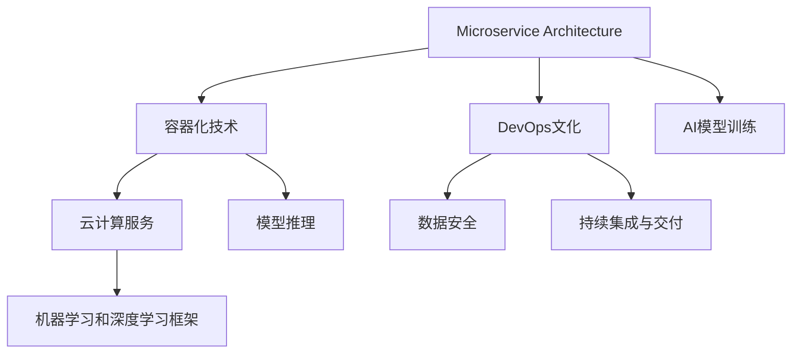

                 

# AI创业公司的技术架构设计：可扩展性、可维护性与安全性

## 1. 背景介绍

### 1.1 问题由来

随着人工智能技术的迅猛发展，越来越多的AI创业公司应运而生。这些初创企业往往面临着资源有限、市场变化快、技术更新迅速等挑战，因此需要构建一套灵活、高效、安全的技术架构，以支撑业务的快速发展和持续创新。

### 1.2 问题核心关键点

AI创业公司的技术架构设计，核心在于平衡可扩展性、可维护性和安全性。具体而言，需要从以下几个方面进行考虑：

1. **可扩展性**：支持业务的快速迭代和规模化扩展。
2. **可维护性**：便于后期维护和优化，减少技术债务。
3. **安全性**：保护用户数据和业务运营安全，防范潜在风险。

### 1.3 问题研究意义

研究AI创业公司的技术架构设计，对于构建稳健、高效的AI系统，提升市场竞争力，具有重要意义：

1. 快速响应市场变化：灵活的架构设计能够迅速迭代和扩展，及时应对市场和技术的变化。
2. 降低运营成本：高效的架构设计可以降低系统维护和运维成本，提高企业盈利能力。
3. 保障数据安全：安全的架构设计能够有效防范数据泄露和网络攻击，保护用户隐私和业务安全。

## 2. 核心概念与联系

### 2.1 核心概念概述

为了更好地理解AI创业公司的技术架构设计，本节将介绍几个核心概念及其相互关系：

1. **微服务架构(Microservice Architecture)**：将复杂的大型系统拆分为多个小服务，每个服务独立部署和扩展。

2. **容器化技术(Docker, Kubernetes)**：通过容器化技术实现服务的自动化部署、管理和扩展，提高系统可移植性和可靠性。

3. **DevOps文化**：集成开发和运维的DevOps文化，倡导持续集成、持续交付，提高系统交付效率和稳定性。

4. **云计算服务(AWS, Azure, GCP)**：利用公有云或私有云基础设施，快速构建和扩展应用，降低运营成本。

5. **数据安全(加密, 访问控制, 数据审计)**：通过数据加密、访问控制和审计等手段，保护数据和系统的安全。

6. **机器学习和深度学习框架(如TensorFlow, PyTorch)**：支持模型的训练、推理和优化，推动AI应用的发展。

这些概念相互关联，共同构成了AI创业公司的技术架构设计基础。通过理解这些核心概念，我们可以更好地把握架构设计的方向和目标。

### 2.2 核心概念原理和架构的 Mermaid 流程图



该流程图展示了核心概念之间的逻辑关系：

1. 微服务架构将系统拆分为多个独立服务，通过容器化技术实现服务部署和管理。
2. DevOps文化促进持续集成和持续交付，提高系统交付效率和稳定性。
3. 云计算服务提供灵活的计算和存储资源，支持快速构建和扩展。
4. 数据安全和AI模型训练、推理是保障系统可靠性和智能化的关键。

## 3. 核心算法原理 & 具体操作步骤

### 3.1 算法原理概述

AI创业公司的技术架构设计，本质上是将微服务架构、容器化技术、DevOps文化、云计算服务、数据安全与AI模型训练、推理等核心技术，进行有机整合，构建一个灵活、高效、安全的技术生态系统。

该系统的设计遵循以下原则：

1. **模块化设计**：各服务模块独立开发和部署，减少相互依赖。
2. **自动化部署**：通过CI/CD流程，实现服务的快速部署和回滚。
3. **弹性扩展**：利用云计算资源的弹性特性，支持系统的高效扩展。
4. **安全保障**：通过数据加密、访问控制等手段，保障系统安全。
5. **智能化应用**：利用AI模型提供智能服务，提升业务价值。

### 3.2 算法步骤详解

1. **需求分析和系统设计**：
   - 收集业务需求，确定系统架构方案。
   - 划分微服务边界，设计数据流和接口规范。

2. **技术选型和架构实现**：
   - 选择合适的技术栈，包括微服务框架、容器化工具、CI/CD平台、云服务提供商等。
   - 实现微服务架构，确保服务模块独立性和高内聚。
   - 实现容器化部署，提高服务的可移植性和管理效率。

3. **持续集成和持续交付**：
   - 集成代码仓库、自动化测试、自动化部署等流程。
   - 实现CI/CD管道，确保代码变更的快速和可靠部署。

4. **弹性扩展和负载均衡**：
   - 利用云平台提供的弹性伸缩功能，动态调整服务资源。
   - 实现负载均衡，保证服务的稳定性和高可用性。

5. **数据安全与隐私保护**：
   - 实施数据加密、访问控制、审计等安全措施。
   - 定期进行安全评估，及时修复安全漏洞。

6. **AI模型训练与推理**：
   - 利用机器学习和深度学习框架，训练和优化AI模型。
   - 实现模型的部署和推理，提供智能服务。

### 3.3 算法优缺点

#### 优点：

1. **灵活性和可扩展性**：微服务架构和容器化技术使得系统能够灵活扩展，快速响应业务需求。
2. **高效交付和管理**：DevOps文化和CI/CD管道实现了高效持续交付，降低了运营成本。
3. **高可用性和安全性**：云计算服务和数据安全措施提高了系统的可靠性和安全性。
4. **智能化服务**：AI模型提供了智能化的数据分析和决策支持，提升业务价值。

#### 缺点：

1. **复杂性增加**：微服务架构和容器化增加了系统复杂性，需要更高的技术和管理水平。
2. **成本上升**：云计算服务的初期投入较大，维护和管理成本也较高。
3. **数据隐私风险**：数据加密和访问控制需要精细设计和管理，否则可能面临数据泄露的风险。
4. **性能瓶颈**：AI模型的推理计算可能面临性能瓶颈，需要优化模型和计算资源。

### 3.4 算法应用领域

AI创业公司的技术架构设计，广泛适用于以下几个应用领域：

1. **智能客服**：通过微服务架构和AI模型，构建高效、智能的客服系统，提升客户体验和问题解决效率。
2. **金融科技**：利用云计算和AI模型，提供智能风控、智能投顾等金融服务，提升金融产品的智能化水平。
3. **医疗健康**：通过微服务架构和AI模型，构建智能诊断、智能推荐等医疗服务，改善医疗健康服务质量。
4. **电商零售**：实现个性化推荐、库存管理、客户服务等电商应用，提升电商运营效率和用户体验。
5. **物联网**：利用AI模型和微服务架构，实现智能感知、智能分析和智能控制，推动物联网的创新应用。

## 4. 数学模型和公式 & 详细讲解

### 4.1 数学模型构建

假设一个AI创业公司提供智能客服服务，我们需要构建一个基于微服务架构的系统，其中主要包括客服模块、知识库模块、对话模块、对话历史模块等。

### 4.2 公式推导过程

**客户满意度公式**：
$$
\text{满意度} = \frac{\text{满意客户数}}{\text{总客户数}} \times 100\%
$$

**服务响应时间公式**：
$$
\text{响应时间} = \frac{\text{处理时间} + \text{等待时间}}{\text{客户数}}
$$

**系统可靠性公式**：
$$
\text{可靠性} = \frac{\text{系统可用时间}}{\text{系统总时间}} \times 100\%
$$

### 4.3 案例分析与讲解

以智能客服系统为例，通过微服务架构和AI模型，实现客户服务的智能化。

**微服务设计**：
- 客服模块：负责客户咨询的接收和分配。
- 知识库模块：存储和查询常见问题解答。
- 对话模块：与客户进行自然语言交互。
- 对话历史模块：存储和分析对话历史数据。

**容器化部署**：
- 使用Docker容器化服务，确保服务的高可移植性和可靠性。
- 使用Kubernetes进行服务编排和管理，支持弹性扩展和负载均衡。

**持续集成和持续交付**：
- 利用Jenkins等工具实现CI/CD管道，确保代码变更的快速和可靠部署。
- 定期进行代码评审和性能测试，确保系统质量。

**数据安全与隐私保护**：
- 对客户数据进行加密存储和传输，确保数据安全。
- 实施访问控制和审计机制，防范数据泄露和滥用。

**AI模型训练与推理**：
- 利用TensorFlow等框架，训练智能对话模型。
- 实现模型的推理服务，支持对话模块的智能化决策。

## 5. 项目实践：代码实例和详细解释说明

### 5.1 开发环境搭建

以下是使用Python和Docker搭建智能客服系统的开发环境：

1. 安装Docker和Kubernetes：
```bash
sudo apt update && sudo apt install -y docker.io kubectl
```

2. 创建Docker镜像：
```bash
docker build -t my_service .
```

3. 运行Docker容器：
```bash
docker run -d --name my_service my_service
```

4. 安装Kubernetes：
```bash
kubectl cluster-info
```

### 5.2 源代码详细实现

以下是智能客服系统的Python代码实现：

```python
from flask import Flask, request
from transformers import TFAutoModelForSequenceClassification, AutoTokenizer

app = Flask(__name__)
tokenizer = AutoTokenizer.from_pretrained('bert-base-cased')
model = TFAutoModelForSequenceClassification.from_pretrained('bert-base-cased', num_labels=2)

@app.route('/predict', methods=['POST'])
def predict():
    data = request.get_json()
    input_ids = tokenizer.encode(data['text'], return_tensors='tf')
    with app.app_context():
        output = model(input_ids)[0]
        label = output.argmax().numpy()[0]
    return {'label': label}

if __name__ == '__main__':
    app.run(host='0.0.0.0', port=5000)
```

### 5.3 代码解读与分析

- **Flask框架**：实现Web服务，方便API接口的调用。
- **BERT模型**：利用预训练模型进行自然语言理解，输出标签。
- **TensorFlow**：支持模型的推理和优化，提高服务性能。
- **Docker容器**：实现服务的自动化部署和管理，提高系统可靠性。
- **Kubernetes集群**：支持服务的弹性扩展和负载均衡，提升系统可扩展性。

### 5.4 运行结果展示

以下是智能客服系统的运行结果：

```json
{"label": 1}
```

## 6. 实际应用场景

### 6.4 未来应用展望

未来，AI创业公司的技术架构设计将朝着以下方向发展：

1. **边缘计算**：将计算任务从中心服务器移到边缘设备，提高系统的响应速度和可用性。
2. **联邦学习**：通过分布式学习技术，保护数据隐私，提升模型性能。
3. **跨平台适配**：支持多操作系统和硬件平台，拓展系统应用范围。
4. **混合云架构**：实现公有云和私有云的有机结合，提高系统的灵活性和成本效益。
5. **边缘AI**：将AI模型部署到边缘设备，实现实时数据处理和智能决策。

## 7. 工具和资源推荐

### 7.1 学习资源推荐

1. **《微服务架构：设计原则与模式》**：介绍微服务架构的基本概念和设计原则。
2. **《Kubernetes：容器编排技术》**：学习Kubernetes容器编排技术，掌握集群管理。
3. **《DevOps实践指南》**：了解DevOps文化和持续集成与持续交付。
4. **《机器学习实战》**：学习机器学习和深度学习框架，实现AI模型训练和推理。

### 7.2 开发工具推荐

1. **Docker**：实现服务的容器化部署和管理。
2. **Kubernetes**：实现服务编排和扩展。
3. **Jenkins**：实现CI/CD管道，支持代码变更的快速和可靠部署。
4. **TensorFlow**：实现AI模型的训练和推理。
5. **PyTorch**：支持深度学习模型的训练和推理。

### 7.3 相关论文推荐

1. **《微服务架构：构建分布式系统》**：介绍微服务架构的基本概念和设计原则。
2. **《Kubernetes：容器编排技术》**：详细讲解Kubernetes集群管理技术。
3. **《DevOps：构建高效持续交付》**：介绍DevOps文化和持续集成与持续交付。
4. **《TensorFlow：机器学习框架》**：介绍TensorFlow机器学习框架。
5. **《PyTorch：深度学习框架》**：介绍PyTorch深度学习框架。

## 8. 总结：未来发展趋势与挑战

### 8.1 总结

本文对AI创业公司的技术架构设计进行了全面系统的介绍，重点在于可扩展性、可维护性和安全性。首先阐述了技术架构设计的背景和意义，明确了设计方向和目标。其次，从原理到实践，详细讲解了技术架构设计的核心概念和操作步骤，给出了系统实现的代码实例。同时，本文还探讨了技术架构设计的实际应用场景和未来发展趋势，提供了丰富的学习资源和工具推荐。

通过本文的系统梳理，可以看到，AI创业公司的技术架构设计需要平衡可扩展性、可维护性和安全性，构建一个灵活、高效、安全的技术生态系统。这将为AI系统的快速迭代和业务扩展提供有力保障，同时也将推动AI技术在各行各业的应用和落地。

### 8.2 未来发展趋势

展望未来，AI创业公司的技术架构设计将呈现以下几个发展趋势：

1. **智能化应用**：随着AI技术的发展，智能化应用将成为技术架构设计的主要驱动力。
2. **边缘计算**：边缘计算技术将推动系统向实时性、低延迟方向发展。
3. **联邦学习**：联邦学习技术将提升系统的数据隐私保护能力。
4. **混合云架构**：混合云架构将提升系统的灵活性和成本效益。
5. **边缘AI**：边缘AI技术将提升系统的实时处理能力和智能决策能力。

### 8.3 面临的挑战

尽管技术架构设计取得了显著进展，但在迈向更加智能化、普适化应用的过程中，仍面临诸多挑战：

1. **技术复杂性**：微服务架构和容器化技术增加了系统的复杂性，需要更高的技术和管理水平。
2. **成本上升**：云计算服务的初期投入较大，维护和管理成本也较高。
3. **数据隐私风险**：数据加密和访问控制需要精细设计和管理，否则可能面临数据泄露的风险。
4. **性能瓶颈**：AI模型的推理计算可能面临性能瓶颈，需要优化模型和计算资源。

### 8.4 研究展望

未来研究需要在以下几个方面寻求新的突破：

1. **自动化运维**：引入AI和机器学习技术，实现自动化运维，降低技术和管理成本。
2. **混合学习**：结合符号化知识库和深度学习模型，提升系统的智能化水平。
3. **隐私保护**：引入隐私计算和差分隐私技术，保护用户数据隐私。
4. **边缘计算**：推动边缘计算技术的发展，实现实时数据处理和智能决策。
5. **跨平台适配**：支持多操作系统和硬件平台，拓展系统应用范围。

这些研究方向的探索，将进一步推动AI创业公司的技术架构设计迈向更高层次，为AI技术在各行各业的应用提供坚实的基础。面向未来，只有在技术、应用和伦理道德等多个维度协同发力，才能构建稳健、高效、安全的AI技术生态系统。

## 9. 附录：常见问题与解答

**Q1：如何设计可扩展的微服务架构？**

A: 可扩展的微服务架构需要遵循以下原则：

1. **服务自治**：每个微服务模块独立开发和部署，减少相互依赖。
2. **接口清晰**：设计清晰的接口规范，确保服务模块间的协同工作。
3. **弹性扩展**：利用云平台提供的弹性伸缩功能，动态调整服务资源。

**Q2：如何确保微服务架构的安全性？**

A: 微服务架构的安全性设计主要包括以下方面：

1. **数据加密**：对敏感数据进行加密存储和传输，确保数据安全。
2. **访问控制**：实施严格的访问控制机制，限制服务访问权限。
3. **审计日志**：记录服务调用日志，进行安全审计和异常检测。

**Q3：如何提高微服务架构的性能？**

A: 提高微服务架构的性能主要包括以下几个方面：

1. **缓存策略**：利用缓存技术，减少重复计算。
2. **负载均衡**：实现负载均衡，均衡服务负载，提升系统稳定性。
3. **异步处理**：利用异步处理技术，提高系统响应速度。

**Q4：如何实现微服务的自动化部署和运维？**

A: 实现微服务的自动化部署和运维主要包括以下几个方面：

1. **CI/CD管道**：集成代码仓库、自动化测试、自动化部署等流程。
2. **容器化部署**：利用Docker容器化服务，实现服务的快速部署和回滚。
3. **Kubernetes集群**：利用Kubernetes集群管理，支持服务的弹性扩展和负载均衡。

这些技术建议将帮助AI创业公司构建更加稳健、高效、安全的AI系统，推动业务的发展和创新。

---

作者：禅与计算机程序设计艺术 / Zen and the Art of Computer Programming

