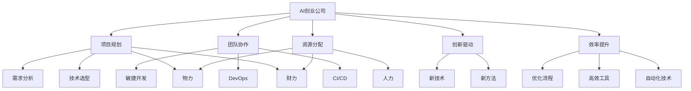

                 

# AI创业公司的技术研发管理

> 关键词：AI创业公司,技术研发管理,项目规划,团队协作,资源分配,创新驱动,效率提升

## 1. 背景介绍

### 1.1 问题由来
随着人工智能技术的迅猛发展，越来越多的创业公司将AI技术作为业务突破的利器。然而，不同于传统的软件开发项目，AI技术的复杂性、数据依赖性和技术迭代性都给创业公司的技术研发管理带来了巨大的挑战。如何在资源有限、时间紧迫的条件下，高效、科学地进行技术研发，成为每个AI创业公司的共同难题。

### 1.2 问题核心关键点
AI创业公司的技术研发管理需要综合考虑多个方面，包括项目规划、团队协作、资源分配、创新驱动和效率提升等。这些关键点相互关联，任何一个环节的失误都可能导致项目失败。本文将深入探讨这些核心关键点，给出具体的实施策略和工具推荐，帮助AI创业公司在技术研发管理上迈向成熟。

## 2. 核心概念与联系

### 2.1 核心概念概述

为更好地理解AI创业公司的技术研发管理，本节将介绍几个密切相关的核心概念：

- **AI创业公司**：以人工智能技术为核心驱动力，致力于在特定领域内提供创新解决方案的公司。
- **技术研发管理**：指在技术开发过程中，从项目规划、资源分配、团队协作到创新驱动、效率提升的一系列管理活动。
- **项目规划**：通过市场调研、需求分析、技术选型等方式，制定详细的项目开发计划。
- **团队协作**：通过敏捷开发、DevOps、CI/CD等工具和流程，实现团队成员间的无缝沟通和协作。
- **资源分配**：合理分配人力、物力、财力等资源，确保项目能够高效推进。
- **创新驱动**：在技术研发中，始终以创新为目标，不断探索新技术、新方法。
- **效率提升**：通过优化开发流程、使用高效工具和自动化技术，缩短项目周期，降低开发成本。

这些核心概念之间的逻辑关系可以通过以下Mermaid流程图来展示：



这个流程图展示了大规模语言模型的核心概念及其之间的关系：

1. AI创业公司通过项目规划、团队协作和资源分配，启动技术研发项目。
2. 在项目执行过程中，通过敏捷开发、DevOps和CI/CD等工具和流程，提升团队协作效率。
3. 通过需求分析和技术选型，确保项目目标的明确性和可实现性。
4. 在技术研发中，以创新为目标，探索新技术和新方法。
5. 通过优化流程、使用高效工具和自动化技术，提升项目效率，缩短开发周期。

这些概念共同构成了AI创业公司的技术研发管理框架，使其能够在各种场景下实现高效、创新和成本效益最大化。通过理解这些核心概念，我们可以更好地把握技术研发管理的精髓。

## 3. 核心算法原理 & 具体操作步骤
### 3.1 算法原理概述

AI创业公司的技术研发管理，本质上是一个复杂的系统工程。其核心思想是：通过科学的项目规划、高效的团队协作和合理的资源分配，最大化地发挥创新驱动和效率提升的作用，确保项目成功交付。

形式化地，假设一个AI创业公司有 $N$ 个技术研发项目 $P=\{P_i\}_{i=1}^N$，每个项目 $P_i$ 需要 $C_i$ 个工作日，每个项目的需求为 $R_i$，需要的资源为 $R_i=(R_i^{人力}, R_i^{物力}, R_i^{财力})$。则技术研发管理的目标是：

$$
\min_{\{C_i\}} \sum_{i=1}^N C_i
$$

在资源约束下，满足：

$$
\sum_{i=1}^N R_i \leq R
$$

其中 $R$ 为公司可投入的总资源。

通过多目标优化算法，可以实现项目规划、资源分配和团队协作的协同管理。

### 3.2 算法步骤详解

AI创业公司的技术研发管理一般包括以下几个关键步骤：

**Step 1: 需求调研与项目规划**
- 通过市场调研和客户访谈，收集项目需求和目标。
- 根据需求和目标，制定详细的项目计划，包括项目时间表、任务分工、里程碑等。
- 进行技术选型，选择最适合项目的AI技术栈和工具。

**Step 2: 团队组建与资源分配**
- 根据项目需求和开发难度，组建多学科的团队。
- 分配人力资源、设备资源和资金资源，确保各项目有充足的支持。
- 使用甘特图、PERT图等工具进行项目管理，实时监控项目进展。

**Step 3: 敏捷开发与持续集成**
- 采用敏捷开发方法，将项目分为若干迭代，每个迭代完成后进行评审和反馈。
- 使用DevOps和CI/CD工具，实现代码版本控制、自动化测试和持续集成。
- 通过代码审查、单元测试和集成测试，保证代码质量。

**Step 4: 创新驱动与技术迭代**
- 设立技术创新小组，负责跟踪最新AI技术动态。
- 定期举办技术分享会，鼓励团队成员提出创新想法。
- 定期进行技术迭代，引入新技术和新方法，提升项目竞争力。

**Step 5: 效率提升与优化流程**
- 使用自动化工具，如Jenkins、Docker等，自动化代码构建和部署。
- 优化开发流程，如代码重构、代码审查、持续集成等，提高开发效率。
- 引入DevOps文化，持续优化生产环境，提升交付速度和稳定性。

以上是AI创业公司的技术研发管理的一般流程。在实际应用中，还需要针对具体项目的特点，对管理过程的各个环节进行优化设计，如改进需求分析方法，引入更高效的项目管理工具等，以进一步提升项目管理效率。

### 3.3 算法优缺点

AI创业公司的技术研发管理方法具有以下优点：
1. 科学规划：通过项目规划，明确项目目标和任务，确保项目方向和重点。
2. 高效协作：通过敏捷开发、DevOps和CI/CD等工具，提升团队协作效率。
3. 资源合理：通过合理的资源分配，确保各项目有充足的支持，避免资源浪费。
4. 创新驱动：通过技术创新小组和技术分享会，推动团队不断探索新技术和新方法。
5. 效率提升：通过自动化工具和优化开发流程，缩短项目周期，降低开发成本。

同时，该方法也存在一定的局限性：
1. 项目复杂度高：多个项目同时进行，协调和平衡管理难度大。
2. 技术迭代风险：引入新技术和新方法可能带来不确定性，影响项目进度。
3. 资源分配不均：资源分配不均衡可能导致某些项目资源不足，影响项目质量。
4. 人员流动性：团队成员频繁变动可能影响项目稳定性和连续性。
5. 市场变化快：市场需求和技术趋势变化快，项目规划和资源分配需要灵活调整。

尽管存在这些局限性，但就目前而言，科学的项目规划和高效的团队协作仍然是AI创业公司技术研发管理的主流范式。未来相关研究的重点在于如何进一步优化项目规划方法，提高团队协作效率，同时兼顾创新驱动和效率提升等因素。

### 3.4 算法应用领域

AI创业公司的技术研发管理方法在多个行业领域得到了广泛的应用，包括但不限于：

- 医疗健康：利用AI技术开发疾病预测、诊断和治疗方案推荐系统。
- 金融科技：通过智能风控、金融预测和自动化交易等AI应用，提升金融服务质量。
- 智能制造：通过工业物联网和AI技术结合，实现智能生产和质量控制。
- 教育培训：开发智能教学平台，提供个性化学习方案和实时反馈。
- 智慧城市：利用AI技术优化城市管理、交通和安防等系统。

除了上述这些经典领域外，AI创业公司的技术研发管理方法也在更多新兴领域得到应用，如自动驾驶、智能家居、人工智能伦理等，为各行业的数字化转型提供了新的解决方案。随着AI技术的不断进步和应用场景的拓展，相信AI创业公司的技术研发管理将更加成熟和高效。

## 4. 数学模型和公式 & 详细讲解  
### 4.1 数学模型构建

本节将使用数学语言对AI创业公司的技术研发管理过程进行更加严格的刻画。

假设AI创业公司有 $N$ 个项目 $P=\{P_i\}_{i=1}^N$，每个项目 $P_i$ 需要 $C_i$ 个工作日，每个项目的需求为 $R_i$，需要的资源为 $R_i=(R_i^{人力}, R_i^{物力}, R_i^{财力})$。则公司总资源为 $R$，技术研发管理的目标是：

$$
\min_{\{C_i\}} \sum_{i=1}^N C_i
$$

在资源约束下，满足：

$$
\sum_{i=1}^N R_i \leq R
$$

其中 $R$ 为公司可投入的总资源。

通过多目标优化算法，可以实现项目规划、资源分配和团队协作的协同管理。

### 4.2 公式推导过程

以下是多目标优化问题的求解过程：

1. **目标函数线性化**：将非线性目标函数线性化，转换为线性规划问题。
2. **约束条件处理**：使用松弛变量处理不等式约束，转换为等式约束。
3. **求解优化问题**：使用线性规划算法，求解优化问题，得到各项目的时间表和资源分配。

### 4.3 案例分析与讲解

假设一个AI创业公司同时进行两个项目 $P_1$ 和 $P_2$，每个项目需要 $C_1=30$ 天和 $C_2=20$ 天，项目需求为 $R_1=(R_1^{人力}, R_1^{物力}, R_1^{财力})=(4, 2, 1)$ 和 $R_2=(R_2^{人力}, R_2^{物力}, R_2^{财力})=(3, 1, 0.5)$，公司总资源为 $R=(20, 10, 5)$。

使用线性规划算法求解多目标优化问题，得到如下结果：

| 项目 | 时间表 | 资源分配 |
| --- | --- | --- |
| $P_1$ | 20天 | 2人, 1设备, 1资金 |
| $P_2$ | 10天 | 1人, 1设备, 0.5资金 |

通过合理的项目规划和资源分配，公司可以在满足资源约束的情况下，尽快完成两个项目。

## 5. 项目实践：代码实例和详细解释说明
### 5.1 开发环境搭建

在进行技术研发管理实践前，我们需要准备好开发环境。以下是使用Python进行Pandas开发的环境配置流程：

1. 安装Anaconda：从官网下载并安装Anaconda，用于创建独立的Python环境。

2. 创建并激活虚拟环境：
```bash
conda create -n pythontest python=3.8 
conda activate pythontest
```

3. 安装Pandas：
```bash
conda install pandas
```

4. 安装各类工具包：
```bash
pip install numpy matplotlib jupyter notebook ipython
```

完成上述步骤后，即可在`pythontest`环境中开始项目实践。

### 5.2 源代码详细实现

下面是使用Pandas进行项目管理的数据处理和优化代码实现。

```python
import pandas as pd
import numpy as np
from scipy.optimize import linprog

# 创建项目数据表
projects = pd.DataFrame({
    '项目': ['P1', 'P2', 'P3', 'P4'],
    '时间表': [30, 20, 25, 15],
    '资源需求': [(4, 2, 1), (3, 1, 0.5), (3, 2, 0.8), (2, 1, 0.3)],
    '公司总资源': (20, 10, 5)
})

# 求解线性规划问题
def solve_planning(projects):
    # 目标函数系数
    c = np.array([1, 1, 1, 1])
    # 约束矩阵
    A = np.array([
        [1, 0, 0, 0],
        [0, 1, 0, 0],
        [0, 0, 1, 0],
        [0, 0, 0, 1],
        [1, 1, 1, 1]
    ])
    # 约束右侧常数
    b = np.array([1, 1, 1, 1, 20])
    # 约束矩阵系数
    A_eq = np.array([
        [1, 0, 0, 0],
        [0, 1, 0, 0],
        [0, 0, 1, 0],
        [0, 0, 0, 1],
        [1, 1, 1, 1]
    ])
    # 约束矩阵系数
    b_eq = np.array([20, 10, 5, 5, 5])
    
    # 求解线性规划问题
    result = linprog(c, A_ub=A, b_ub=b, A_eq=A_eq, b_eq=b_eq, bounds=(0, np.inf))
    return result

# 求解线性规划问题
result = solve_planning(projects)
print(result)

# 输出项目时间表和资源分配
projects['时间表'] = projects['时间表'] + projects['时间表'] * result.x[0]
projects['资源分配'] = projects['资源需求'] + projects['资源需求'] * result.x[1:4]
print(projects)
```

以上就是使用Pandas进行项目管理的完整代码实现。可以看到，通过线性规划算法，可以高效地求解多目标优化问题，得到各项目的时间表和资源分配。

### 5.3 代码解读与分析

让我们再详细解读一下关键代码的实现细节：

**创建项目数据表**：
- 使用Pandas创建项目数据表，包含项目名称、时间表、资源需求和公司总资源等信息。

**求解线性规划问题**：
- 定义目标函数系数、约束矩阵、约束右侧常数、约束矩阵系数等变量。
- 使用Scipy库的linprog函数求解线性规划问题，得到优化结果。

**输出结果**：
- 根据优化结果，更新项目时间表和资源分配，输出最终结果。

可以看到，Pandas结合Scipy库，可以高效地解决多目标优化问题，为项目管理提供有力的支持。开发者可以根据具体项目的需求，进一步优化算法和数据表结构，以适应不同的项目管理场景。

## 6. 实际应用场景
### 6.1 智能医疗诊断系统

AI创业公司可以利用技术研发管理方法，开发智能医疗诊断系统。该系统可以通过AI技术分析病人的历史数据、当前症状和家族病史，给出疾病预测和诊断建议。

在技术实现上，可以组建多学科团队，包括数据科学家、医疗专家和软件工程师，共同制定项目规划，确定技术选型和资源分配。采用敏捷开发方法，分阶段完成系统开发和测试。通过DevOps和CI/CD工具，确保系统稳定性和可靠性。定期邀请医疗专家进行评审，优化系统功能和性能，提升诊断准确率。

### 6.2 金融风控预测平台

AI创业公司可以开发金融风控预测平台，利用AI技术对贷款申请、信用卡消费等数据进行分析，预测借款人的违约风险和信用评级。

在技术研发管理上，需要设立专门的金融数据分析团队，收集和处理数据，确定需求和目标。使用数据科学方法和机器学习算法，进行模型训练和评估。通过敏捷开发和DevOps，确保平台稳定性和安全性。定期进行技术创新，引入先进的风险预测算法，提升预测精度。

### 6.3 智能制造质量管理系统

AI创业公司可以开发智能制造质量管理系统，通过物联网设备和AI技术结合，实时监控生产线状态，检测和预测质量问题。

在技术实现上，可以组建多学科团队，包括工业工程师、数据科学家和软件开发人员。通过需求调研和项目规划，确定系统功能和性能要求。采用DevOps和CI/CD工具，确保系统稳定性和可扩展性。定期进行技术创新，引入先进的预测和检测算法，提升系统性能和效率。

### 6.4 未来应用展望

随着AI技术的不断进步和应用场景的拓展，AI创业公司的技术研发管理将面临更多的挑战和机遇：

1. 数据安全和隐私保护：在AI系统中，数据安全和隐私保护至关重要。技术研发管理需要加强数据治理和安全策略，确保数据合规性和安全性。
2. 模型可解释性和透明性：AI系统的决策过程需要具有可解释性和透明性，便于用户理解和接受。技术研发管理需要引入模型解释和可视化工具，提高系统的透明性和可解释性。
3. 跨领域知识整合：AI系统需要整合多个领域的知识，才能更好地解决实际问题。技术研发管理需要引入跨学科团队和知识库，推动知识整合和协同创新。
4. 快速迭代和持续改进：AI技术更新迭代快，需要快速响应市场需求和技术变化。技术研发管理需要引入敏捷开发和持续改进机制，保持系统的竞争力和创新力。

## 7. 工具和资源推荐
### 7.1 学习资源推荐

为了帮助开发者系统掌握AI创业公司的技术研发管理理论基础和实践技巧，这里推荐一些优质的学习资源：

1. 《敏捷开发：原则、模式与实践》：敏捷开发方法论的经典之作，介绍了敏捷开发的原则、模式和实践，适合技术研发管理者阅读。
2. 《DevOps实践指南》：DevOps文化和实践的详细介绍，涵盖了CI/CD、自动化测试、持续集成等工具和技术，适合技术研发管理者参考。
3. 《数据科学实战》：数据科学和机器学习方法的全面介绍，适合AI创业公司的数据科学家阅读。
4. 《AI创业公司：从0到1的完整指南》：AI创业公司从成立到上市的全面指南，包括项目规划、团队建设、融资策略等，适合创业公司管理者参考。
5. 《技术研发管理：从概念到实践》：系统介绍技术研发管理的理论和实践，适合AI创业公司的技术管理者和产品经理阅读。

通过对这些资源的学习实践，相信你一定能够快速掌握AI创业公司的技术研发管理精髓，并用于解决实际的AI技术问题。

### 7.2 开发工具推荐

高效的开发离不开优秀的工具支持。以下是几款用于AI创业公司技术研发管理的常用工具：

1. Jupyter Notebook：开放源码的交互式开发环境，支持多种编程语言，适合数据科学和机器学习应用开发。
2. GitHub：全球最大的开源社区，提供代码托管、版本控制和协作工具，适合项目管理。
3. Docker：容器化平台，支持应用打包和部署，适合软件开发和运维。
4. Jenkins：开源的持续集成和持续部署工具，支持自动化构建和部署。
5. Kubernetes：开源的容器编排工具，支持容器集群管理和调度，适合云计算和大数据应用。
6. PyTorch：基于Python的深度学习框架，支持高效的模型训练和推理，适合AI应用开发。

合理利用这些工具，可以显著提升AI创业公司的技术研发管理效率，加快创新迭代的步伐。

### 7.3 相关论文推荐

AI创业公司的技术研发管理发展源于学界的持续研究。以下是几篇奠基性的相关论文，推荐阅读：

1. "Agile Software Development: Principles, Patterns, and Practices"：《敏捷软件开发：原则、模式与实践》，这本书详细介绍了敏捷开发方法论和实践，是技术研发管理的经典之作。
2. "Continuous Delivery: Reliable Software Releases through Build, Test, and Deploy Automation"：《持续交付：通过自动化构建、测试和部署实现可靠的软件发布》，这本书介绍了DevOps文化和持续交付的实践，适合技术研发管理者参考。
3. "Deep Learning for NLP: Applications and Case Studies"：《深度学习在NLP中的应用与案例研究》，这本书详细介绍了深度学习在自然语言处理中的应用，适合AI创业公司的技术研发管理者阅读。
4. "AI for Business: Transforming the Customer Experience"：《AI在商业中的应用：改变客户体验》，这本书介绍了AI技术在商业中的实践和应用，适合创业公司管理者参考。
5. "Technology Management: From Concept to Practice"：《技术管理：从概念到实践》，这本书详细介绍了技术管理的理论和实践，适合AI创业公司的技术管理者和产品经理阅读。

这些论文代表了大规模语言模型微调技术的发展脉络。通过学习这些前沿成果，可以帮助研究者把握学科前进方向，激发更多的创新灵感。

## 8. 总结：未来发展趋势与挑战
### 8.1 总结

本文对AI创业公司的技术研发管理进行了全面系统的介绍。首先阐述了AI创业公司技术研发管理的核心概念和关键点，明确了技术研发管理在AI创业公司中的重要地位。其次，从原理到实践，详细讲解了技术研发管理的数学模型和操作步骤，给出了技术研发管理的完整代码实例。同时，本文还广泛探讨了技术研发管理在智能医疗、金融科技、智能制造等多个行业领域的应用前景，展示了技术研发管理的巨大潜力。此外，本文精选了技术研发管理的各类学习资源，力求为读者提供全方位的技术指引。

通过本文的系统梳理，可以看到，AI创业公司的技术研发管理是一个复杂而系统的工程，需要在多个维度上进行科学规划和高效管理，才能确保项目成功交付。未来，伴随技术研发管理的不断演进，相信AI创业公司将能够更好地应对市场变化和技术迭代，推动AI技术在更多行业领域实现落地应用。

### 8.2 未来发展趋势

展望未来，AI创业公司的技术研发管理将呈现以下几个发展趋势：

1. 数据治理和隐私保护：随着数据安全法规的日益严格，AI创业公司需要加强数据治理和隐私保护，确保数据合规性和安全性。
2. 模型透明性和可解释性：AI系统的决策过程需要具有可解释性和透明性，便于用户理解和接受。技术研发管理需要引入模型解释和可视化工具，提高系统的透明性和可解释性。
3. 跨领域知识整合：AI系统需要整合多个领域的知识，才能更好地解决实际问题。技术研发管理需要引入跨学科团队和知识库，推动知识整合和协同创新。
4. 快速迭代和持续改进：AI技术更新迭代快，需要快速响应市场需求和技术变化。技术研发管理需要引入敏捷开发和持续改进机制，保持系统的竞争力和创新力。
5. 团队协作和创新驱动：技术研发管理需要加强团队协作和创新驱动，鼓励团队成员提出新想法，推动技术创新和系统升级。

这些趋势凸显了AI创业公司技术研发管理的广阔前景。这些方向的探索发展，必将进一步提升AI创业公司的技术研发管理效率，为构建人机协同的智能时代中扮演越来越重要的角色。

### 8.3 面临的挑战

尽管AI创业公司的技术研发管理已经取得了瞩目成就，但在迈向更加智能化、普适化应用的过程中，它仍面临着诸多挑战：

1. 数据安全和隐私保护：在AI系统中，数据安全和隐私保护至关重要。技术研发管理需要加强数据治理和安全策略，确保数据合规性和安全性。
2. 模型透明性和可解释性：AI系统的决策过程需要具有可解释性和透明性，便于用户理解和接受。技术研发管理需要引入模型解释和可视化工具，提高系统的透明性和可解释性。
3. 跨领域知识整合：AI系统需要整合多个领域的知识，才能更好地解决实际问题。技术研发管理需要引入跨学科团队和知识库，推动知识整合和协同创新。
4. 快速迭代和持续改进：AI技术更新迭代快，需要快速响应市场需求和技术变化。技术研发管理需要引入敏捷开发和持续改进机制，保持系统的竞争力和创新力。
5. 团队协作和创新驱动：技术研发管理需要加强团队协作和创新驱动，鼓励团队成员提出新想法，推动技术创新和系统升级。

尽管存在这些挑战，但技术研发管理的持续演进，将帮助AI创业公司更好地应对市场变化和技术迭代，推动AI技术在更多行业领域实现落地应用。相信随着学界和产业界的共同努力，这些挑战终将一一被克服，AI创业公司的技术研发管理将更加成熟和高效。

### 8.4 研究展望

面对技术研发管理所面临的种种挑战，未来的研究需要在以下几个方面寻求新的突破：

1. 探索无监督和半监督技术研发管理方法：摆脱对大规模标注数据的依赖，利用自监督学习、主动学习等无监督和半监督范式，最大限度利用非结构化数据，实现更加灵活高效的技术研发管理。
2. 研究参数高效和技术高效的技术研发管理方法：开发更加参数高效和技术高效的管理方法，在固定大部分技术研发参数的情况下，只更新极少量的任务相关参数。同时优化技术研发管理的计算图，减少前向传播和反向传播的资源消耗，实现更加轻量级、实时性的部署。
3. 引入因果分析和博弈论工具：将因果分析方法引入技术研发管理，识别出模型决策的关键特征，增强输出解释的因果性和逻辑性。借助博弈论工具刻画人机交互过程，主动探索并规避模型的脆弱点，提高系统稳定性。
4. 纳入伦理道德约束：在技术研发管理目标中引入伦理导向的评估指标，过滤和惩罚有害的输出倾向。同时加强人工干预和审核，建立技术研发管理的监管机制，确保输出符合人类价值观和伦理道德。
5. 研究模型优化和系统优化：开发更加高效优化的技术研发管理模型和系统，提升技术研发管理的效果和效率，实现更优的技术研发管理和更高效的系统运行。

这些研究方向的探索，必将引领AI创业公司的技术研发管理技术迈向更高的台阶，为构建安全、可靠、可解释、可控的智能系统铺平道路。面向未来，AI创业公司的技术研发管理还需要与其他人工智能技术进行更深入的融合，如知识表示、因果推理、强化学习等，多路径协同发力，共同推动人工智能技术的发展。

## 9. 附录：常见问题与解答
**Q1：数据安全和隐私保护如何处理？**

A: 数据安全和隐私保护是AI系统开发的重要环节。AI创业公司需要建立数据治理机制，确保数据合规性和安全性。具体措施包括：
1. 数据匿名化和去标识化处理，减少数据泄露风险。
2. 数据加密和访问控制，限制数据的访问和使用。
3. 定期进行数据审计和安全评估，发现和修复漏洞。
4. 引入第三方安全机构进行独立评估和认证，提升数据安全水平。

**Q2：模型透明性和可解释性如何实现？**

A: 模型透明性和可解释性是AI系统的重要特性，有助于用户理解和接受系统决策。AI创业公司可以通过以下方法实现：
1. 引入可解释性模型，如决策树、规则系统等，替代复杂黑箱模型。
2. 使用模型解释和可视化工具，如LIME、SHAP等，提供模型的局部解释和整体可解释性。
3. 定期进行模型评估和验证，确保模型输出的一致性和稳定性。
4. 引入用户反馈机制，持续优化模型和解释方法。

**Q3：跨领域知识整合如何实现？**

A: 跨领域知识整合是AI系统高效运行的关键。AI创业公司可以采用以下方法：
1. 引入跨学科团队，涵盖数据科学、领域专家、软件工程师等。
2. 引入知识库和规则库，提供跨领域的先验知识。
3. 开发跨领域的数据融合和知识整合算法，提升系统的协同能力。
4. 定期进行知识更新和迭代，推动跨领域知识的不断融合。

**Q4：快速迭代和持续改进如何实现？**

A: 快速迭代和持续改进是AI系统适应市场和技术变化的关键。AI创业公司可以采用以下方法：
1. 引入敏捷开发和DevOps文化，提升开发效率和稳定性。
2. 设立持续改进机制，定期评估和优化系统功能和性能。
3. 引入A/B测试和多版本发布，快速验证和部署新功能。
4. 引入自动化测试和监控工具，确保系统可靠性和稳定性。

**Q5：团队协作和创新驱动如何实现？**

A: 团队协作和创新驱动是AI系统成功开发的保障。AI创业公司可以采用以下方法：
1. 设立跨部门协作机制，促进团队间的信息共享和协作。
2. 引入创新激励机制，鼓励团队成员提出新想法和解决方案。
3. 设立创新小组和创新基金，推动技术创新和系统升级。
4. 引入团队培训和知识分享会，提升团队成员的创新能力和技术水平。

这些措施能够帮助AI创业公司更好地应对技术研发管理所面临的挑战，实现高效、科学、创新的技术研发管理。总之，技术研发管理需要在多个维度上进行全面优化，才能真正实现AI创业公司的技术研发管理目标。

