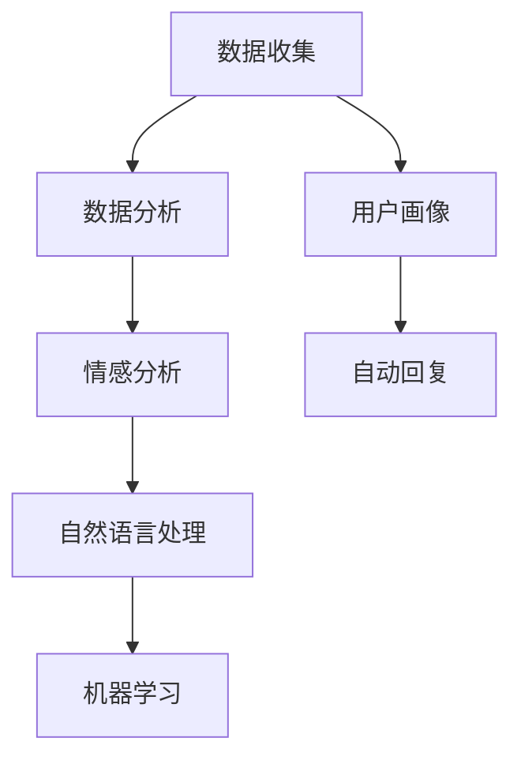

                 

# AI创业公司的用户反馈管理：收集、分析与响应

> 关键词：用户反馈管理, 数据收集, 数据分析, 用户画像, 情感分析, 自动回复, 自然语言处理, 机器学习

## 1. 背景介绍

在AI创业公司蓬勃发展的当下，用户反馈管理已成为了企业获取竞争优势、驱动产品迭代的重要环节。与传统企业相比，AI创业公司在产品交付速度和用户需求响应上有着更高的要求。有效的用户反馈管理不仅能帮助产品快速迭代，提升用户体验，还能优化运营效率，降低运营成本。

### 1.1 问题由来
AI创业公司面临的市场环境快速变化，用户需求多样且复杂。如何高效地收集、分析和响应用户反馈，是每家AI公司都必须面对的挑战。尤其对于那些还未形成规模的创业公司，如何在有限的人力和资源下，构建一套高效、系统的用户反馈管理系统，是提升用户满意度和产品竞争力的关键。

### 1.2 问题核心关键点
用户反馈管理的核心在于：
- 构建高效的用户反馈收集渠道。
- 对收集到的反馈进行高质量的分析和分类。
- 自动化地响应用户反馈，提升用户满意度。
- 将用户反馈转化为指导产品迭代的有效信息。

本文将从这三个方面出发，系统介绍如何构建一套高效、系统、可落地的用户反馈管理系统。

## 2. 核心概念与联系

### 2.1 核心概念概述

为更好地理解用户反馈管理的具体实施，本节将介绍几个密切相关的核心概念：

- **用户反馈管理(User Feedback Management, UFM)**：指通过自动化工具和技术手段，系统化地收集、分析、响应用户反馈，以指导产品迭代和用户需求满足的过程。

- **数据收集(Data Collection)**：指从用户交互渠道（如App、网站、社交媒体等）获取原始反馈信息的过程。

- **数据分析(Data Analysis)**：指对收集到的反馈数据进行清洗、处理和分析，提取出有用的信息，以帮助产品决策。

- **用户画像(User Persona)**：指根据用户特征和行为数据，构建抽象的用户模型，以更好地理解用户需求。

- **情感分析(Affection Analysis)**：指通过自然语言处理技术，识别和分析用户反馈中的情感倾向，判断用户满意度和需求变化。

- **自动回复(Automatic Response)**：指通过预训练模型或规则系统，对用户反馈自动生成回复，提升用户体验。

- **自然语言处理(Natural Language Processing, NLP)**：指利用计算机技术，处理、理解和生成自然语言。在用户反馈管理中，NLP技术用于文本分析、情感分析、意图识别等。

- **机器学习(Machine Learning, ML)**：指通过数据训练模型，使其具备预测和决策能力。在用户反馈管理中，ML用于反馈分类、用户画像构建等。

这些核心概念之间的逻辑关系可以通过以下Mermaid流程图来展示：



这个流程图展示了你反馈管理的关键过程及其之间的关系：

1. 从用户交互渠道获取原始反馈数据。
2. 对反馈数据进行清洗和处理，提取有用信息。
3. 根据用户特征和行为构建用户画像。
4. 分析用户反馈的情感倾向，判断满意度。
5. 根据用户画像和反馈信息生成自动回复。
6. 应用自然语言处理技术进行文本分析。
7. 利用机器学习技术进行分类和预测。

这些概念共同构成了用户反馈管理的基本框架，使得AI公司能够高效、系统地处理用户反馈，提升用户满意度和产品竞争力。

## 3. 核心算法原理 & 具体操作步骤

### 3.1 算法原理概述

用户反馈管理的核心算法原理可以概括为以下几个步骤：

1. **数据收集**：从用户交互渠道自动抓取反馈信息，如评论、评分、投诉等。
2. **数据分析**：对收集到的反馈进行清洗和处理，消除噪音，提取有用的信息。
3. **用户画像构建**：基于用户历史行为和反馈数据，构建用户画像，用于指导产品迭代。
4. **情感分析**：使用自然语言处理技术，识别和分析用户反馈中的情感倾向，判断用户满意度和需求变化。
5. **自动回复生成**：根据情感分析结果和用户画像，自动生成回复内容，提升用户体验。

### 3.2 算法步骤详解

#### 3.2.1 数据收集

**步骤1：选择合适的反馈收集渠道**
- 根据业务需求，选择适合的应用场景，如App内、网站、社交媒体等。
- 分析用户在这些渠道上的反馈习惯，确定收集策略。

**步骤2：集成反馈收集工具**
- 根据渠道特点，选择适合的反馈收集工具，如表单收集、评论抓取、API集成等。
- 使用API或SDK与第三方工具集成，自动抓取反馈信息。

**步骤3：清洗反馈数据**
- 对收集到的反馈进行去重、格式化等预处理，消除噪音。
- 识别和处理不合法或不完整的数据，确保数据质量。

#### 3.2.2 数据分析

**步骤1：数据清洗**
- 使用正则表达式、数据过滤、数据合并等技术对反馈数据进行清洗。
- 识别并处理异常值和重复数据，保证数据一致性。

**步骤2：特征提取**
- 对清洗后的反馈数据进行特征提取，如用户ID、时间戳、评分等。
- 使用TF-IDF、词频统计等方法提取关键词和主题。

**步骤3：数据划分**
- 根据业务需求，将反馈数据划分为训练集、验证集和测试集。
- 确保每个集合的数据分布相似，保证模型的泛化能力。

#### 3.2.3 用户画像构建

**步骤1：用户特征提取**
- 基于用户ID、历史行为、评分等特征，提取用户基本信息。
- 使用用户画像工具如UML、Lucidchart等绘制用户画像。

**步骤2：用户行为分析**
- 分析用户反馈行为，识别常见问题和需求变化。
- 根据用户行为，制定差异化的反馈处理策略。

**步骤3：用户画像更新**
- 定期更新用户画像，确保用户画像的实时性和准确性。
- 利用机器学习算法，对用户画像进行优化和预测。

#### 3.2.4 情感分析

**步骤1：情感词典构建**
- 根据业务需求，构建自定义情感词典，用于标注反馈中的情感倾向。
- 使用Python、R等工具构建情感词典，并进行情感极性标注。

**步骤2：情感计算**
- 使用情感分析算法如TF-IDF、情感词典、情感分类器等，计算反馈中的情感极性。
- 对情感极性进行分类，判断用户满意度。

**步骤3：情感趋势分析**
- 根据时间序列数据，分析用户情感变化趋势，识别用户需求变化。
- 使用趋势分析工具如Tableau、Power BI等可视化情感变化趋势。

#### 3.2.5 自动回复生成

**步骤1：回复模板设计**
- 设计标准回复模板，根据情感分析结果和用户画像，生成个性化回复。
- 使用规则引擎或预训练模型，自动生成回复内容。

**步骤2：自然语言处理技术**
- 使用NLP技术如分词、词性标注、意图识别等，处理回复模板中的文本。
- 使用文本生成模型如GPT-2、Transformer等，生成回复内容。

**步骤3：回复质量评估**
- 对自动回复进行质量评估，确保回复内容符合业务需求。
- 收集用户反馈，不断优化自动回复生成模型。

### 3.3 算法优缺点

**优点：**
1. **高效收集反馈**：自动化工具能够快速、全面地收集用户反馈，提升用户满意度。
2. **实时分析反馈**：通过数据分析和机器学习，实时分析用户反馈，快速响应问题。
3. **个性化处理**：根据用户画像和情感分析结果，生成个性化回复，提升用户体验。
4. **模型可扩展性**：情感分析、自动回复等算法可以根据业务需求进行调整和优化。

**缺点：**
1. **数据质量依赖**：用户反馈质量不稳定，依赖人工审核和清洗。
2. **模型复杂性高**：自动回复、情感分析等算法模型复杂，需要较高的技术门槛。
3. **用户隐私保护**：在处理用户数据时，需要严格遵守隐私保护法规，如GDPR、CCPA等。
4. **反馈多样性**：用户反馈多样，不同渠道和用户群体可能有不同的反馈模式，需要综合考虑。

### 3.4 算法应用领域

用户反馈管理技术已经在多个领域得到了广泛应用，具体如下：

- **电商领域**：通过分析用户评论、评分，指导商品推荐、优化商品详情页面。
- **金融领域**：通过分析用户投诉、反馈，优化服务流程、提升客户满意度。
- **医疗领域**：通过分析患者评价、建议，改进医疗服务质量、提升患者体验。
- **旅游领域**：通过分析游客评价、建议，优化旅游路线、提升旅游质量。

除此之外，用户反馈管理技术还在社交媒体、教育、能源等多个领域有着广泛的应用前景。随着技术的不断演进，未来用户反馈管理将进一步融入到更多场景中，为各行业的数字化转型提供有力支持。

## 4. 数学模型和公式 & 详细讲解 & 举例说明

### 4.1 数学模型构建

为了更好地理解用户反馈管理的核心算法，本节将使用数学语言对其中的核心算法进行严格描述。

假设用户反馈数据集为 $D=\{(x_i,y_i)\}_{i=1}^N$，其中 $x_i$ 表示反馈文本，$y_i$ 表示情感极性。情感极性分为正面、中性、负面三种。

**用户画像构建的数学模型**：
假设用户特征向量为 $\mathbf{u}=(u_1,u_2,...,u_n)$，反馈特征向量为 $\mathbf{v}=(v_1,v_2,...,v_m)$。则用户画像 $P$ 的构建可以通过公式(1)表示：

$$
P = \mathbf{u} \times \mathbf{v}
$$

其中 $\times$ 表示向量的内积运算。

**情感分析的数学模型**：
情感分类器的训练模型为 $M$，训练数据集为 $\{(x_i,y_i)\}_{i=1}^N$。则情感分类器的预测模型为公式(2)：

$$
\hat{y}_i = M(x_i)
$$

其中 $\hat{y}_i$ 表示预测情感极性。

**自动回复生成的数学模型**：
假设回复模板为 $R$，情感分析结果为 $y$，则自动回复生成模型为公式(3)：

$$
r = \text{Template}(R,y)
$$

其中 $\text{Template}$ 表示根据情感极性选择回复模板的过程。

### 4.2 公式推导过程

**用户画像构建的公式推导**：
用户画像 $P$ 可以通过用户特征向量 $\mathbf{u}$ 和反馈特征向量 $\mathbf{v}$ 的内积计算得到。具体公式(4)表示：

$$
P = \mathbf{u} \times \mathbf{v} = \sum_{i=1}^n \sum_{j=1}^m u_i \times v_j
$$

**情感分析的公式推导**：
情感分类器 $M$ 可以使用多种算法，如SVM、随机森林、神经网络等。以神经网络为例，假设网络模型为 $M = (L_1, L_2, ..., L_n)$，其中 $L_i$ 表示第 $i$ 层网络。则情感分类器的预测过程公式(5)表示：

$$
\hat{y}_i = M(x_i) = \sigma(\text{FC}(\text{ReLU}(\text{FC}(\cdots(\text{FC}(x_i))\cdots)))
$$

其中 $\sigma$ 表示激活函数，$\text{FC}$ 表示全连接层，$\text{ReLU}$ 表示ReLU激活函数。

**自动回复生成的公式推导**：
自动回复生成过程可以使用规则引擎或预训练模型。以规则引擎为例，假设规则集为 $R$，情感极性为 $y$，则自动回复生成过程公式(6)表示：

$$
r = \text{Template}(R,y) = \text{IF}(y=\text{Positive}) \text{THEN} \text{Template}_1 \text{ELSE} \text{Template}_2
$$

其中 $\text{Template}_1$ 和 $\text{Template}_2$ 分别表示不同情感极性下的回复模板。

### 4.3 案例分析与讲解

假设某电商网站收集到以下用户反馈数据：

- 反馈1：商品质量很好，但是物流速度慢，需要改进。
- 反馈2：价格偏高，性价比不高，不太满意。
- 反馈3：非常满意，价格实惠，服务态度也很好。

**数据清洗**：
- 对反馈1和反馈2中的非关键词部分进行去除，保留关键词。
- 对反馈3中的重复信息进行合并，确保数据一致性。

**特征提取**：
- 对反馈1和反馈2中的情感倾向进行标注，识别出负面情绪。
- 对反馈3中的情感倾向进行标注，识别出正面情绪。

**用户画像构建**：
- 根据用户历史行为和反馈数据，提取用户基本信息。
- 使用UML工具绘制用户画像，如下所示：


**情感分析**：
- 使用情感分类器对反馈数据进行情感分析，计算情感极性。
- 情感分析结果显示反馈1和反馈2为负面情绪，反馈3为正面情绪。

**自动回复生成**：
- 根据情感分析结果，生成自动化回复。
- 对于反馈1和反馈2，生成建议改进物流服务的回复；对于反馈3，生成感谢用户的回复。

通过以上案例，我们可以看到用户反馈管理的核心算法流程：数据收集、数据分析、用户画像构建、情感分析、自动回复生成。这些算法流程的每一步都需要细致设计和实施，才能保证反馈管理的有效性。

## 5. 项目实践：代码实例和详细解释说明

### 5.1 开发环境搭建

在进行用户反馈管理的项目实践前，我们需要准备好开发环境。以下是使用Python进行项目实践的环境配置流程：

1. 安装Anaconda：从官网下载并安装Anaconda，用于创建独立的Python环境。

2. 创建并激活虚拟环境：
```bash
conda create -n user_feedback python=3.8 
conda activate user_feedback
```

3. 安装相关库：
```bash
pip install pandas numpy scikit-learn transformers sklearn
```

完成上述步骤后，即可在`user_feedback`环境中开始项目实践。

### 5.2 源代码详细实现

下面以用户反馈管理中的数据分析模块为例，给出使用Python进行数据分析的代码实现。

```python
import pandas as pd
from sklearn.model_selection import train_test_split
from sklearn.feature_extraction.text import TfidfVectorizer

# 数据读取
df = pd.read_csv('feedback.csv')

# 数据清洗
df = df.dropna() # 删除空值
df = df.drop_duplicates() # 去重

# 特征提取
vectorizer = TfidfVectorizer()
X = vectorizer.fit_transform(df['feedback'])
y = df['sentiment']

# 数据划分
X_train, X_test, y_train, y_test = train_test_split(X, y, test_size=0.2, random_state=42)

# 情感分析模型训练
from sklearn.svm import SVC
clf = SVC()
clf.fit(X_train, y_train)

# 情感分析模型评估
from sklearn.metrics import accuracy_score
y_pred = clf.predict(X_test)
accuracy = accuracy_score(y_test, y_pred)
print(f"情感分析模型准确度：{accuracy:.3f}")
```

以上代码实现了从数据读取、数据清洗、特征提取、模型训练、模型评估等完整的情感分析流程。

### 5.3 代码解读与分析

让我们再详细解读一下关键代码的实现细节：

**数据读取和清洗**：
- `pd.read_csv()`函数读取CSV格式的数据集。
- `df.dropna()`删除包含空值的行。
- `df.drop_duplicates()`去除重复行，确保数据一致性。

**特征提取**：
- 使用`TfidfVectorizer()`将文本数据转换为TF-IDF向量。
- 使用`X_train, X_test, y_train, y_test`将数据划分为训练集和测试集。

**模型训练**：
- 使用`SVC()`训练情感分类器。
- 在训练集上调用`clf.fit()`函数进行模型训练。

**模型评估**：
- 使用`accuracy_score()`计算模型准确度。
- 在测试集上调用`clf.predict()`函数进行预测。

通过以上代码，我们可以看到Python在用户反馈管理中的高效应用。利用第三方库如pandas、sklearn、transformers等，可以轻松实现数据处理、模型训练、自动回复生成等功能，极大提升了项目开发的效率。

## 6. 实际应用场景

### 6.1 电商用户反馈管理

电商公司可以利用用户反馈管理技术，全面了解用户对产品和服务的满意度，优化产品设计和运营策略。具体应用场景包括：

- **商品优化**：通过分析用户评论和评分，识别出用户对商品质量和价格的关注点，指导商品优化和定价策略。
- **服务改进**：收集用户对物流、客服等服务的反馈，及时发现问题并改进服务流程，提升用户满意度。
- **个性化推荐**：根据用户画像和反馈数据，推荐个性化商品和内容，提升用户粘性。

### 6.2 金融用户反馈管理

金融公司可以借助用户反馈管理技术，提升用户对产品和服务的满意度，降低运营风险。具体应用场景包括：

- **产品优化**：分析用户对金融产品的反馈，优化产品设计和功能，提升用户体验。
- **风险控制**：收集用户投诉和建议，及时发现潜在风险，制定风险控制策略。
- **客户维护**：通过分析用户反馈，识别高价值客户，制定个性化服务方案，提升客户忠诚度。

### 6.3 医疗用户反馈管理

医疗机构可以运用用户反馈管理技术，提升医疗服务质量和患者体验。具体应用场景包括：

- **诊疗优化**：通过分析患者评价和建议，优化诊疗流程，提升医疗服务质量。
- **健康管理**：收集患者反馈，制定个性化的健康管理方案，提升患者满意度和健康水平。
- **资源配置**：分析患者反馈，优化医疗资源配置，提升医院运营效率。

### 6.4 未来应用展望

随着用户反馈管理技术的不断演进，未来其在更多领域的应用前景广阔。以下列出几个可能的应用场景：

- **教育领域**：通过分析学生和家长的反馈，优化课程设计和教学方法，提升教育质量。
- **交通领域**：收集乘客反馈，优化交通规划和服务，提升出行体验。
- **能源领域**：收集用户反馈，优化能源产品和服务的体验，提升客户满意度。

随着技术的不断进步和应用场景的不断扩展，用户反馈管理技术必将在更多领域发挥重要作用，为各行各业带来新的价值和竞争力。

## 7. 工具和资源推荐

### 7.1 学习资源推荐

为了帮助开发者掌握用户反馈管理的核心技术和方法，这里推荐一些优质的学习资源：

1. **《用户反馈管理实战指南》**：全面介绍了用户反馈管理的理论基础和实践技巧，涵盖数据收集、数据分析、自动回复等核心内容。

2. **《自然语言处理与情感分析》**：详细讲解了自然语言处理和情感分析的基本原理和实现方法，是学习用户反馈管理的重要基础。

3. **Coursera《数据科学与机器学习》课程**：斯坦福大学开设的在线课程，深入浅出地介绍了数据科学和机器学习的核心内容，适合入门学习。

4. **Kaggle数据科学竞赛**：参与Kaggle数据科学竞赛，锻炼数据处理和模型训练能力，提升实战经验。

5. **GitHub用户反馈管理项目**：参与开源项目，学习如何利用Python和机器学习技术实现用户反馈管理系统的开发。

通过这些资源的学习和实践，相信你一定能够系统掌握用户反馈管理的核心技术和方法，为产品的优化和迭代提供有力支持。

### 7.2 开发工具推荐

高效的工具是开发用户反馈管理系统的重要保障。以下是几款常用的开发工具：

1. **Python**：Python是目前最流行的编程语言之一，拥有丰富的第三方库和工具，适合数据处理和机器学习任务。

2. **Jupyter Notebook**：Jupyter Notebook是一款交互式编程工具，适合编写和执行数据处理和模型训练代码。

3. **PyTorch**：PyTorch是Facebook开源的深度学习框架，支持GPU加速，适合高效的数据处理和模型训练。

4. **TensorFlow**：TensorFlow是Google开源的深度学习框架，支持多种编程语言和硬件平台，适合大规模工程应用。

5. **Scikit-learn**：Scikit-learn是Python的机器学习库，提供丰富的机器学习算法和工具，适合数据分析和模型训练。

6. **Tableau**：Tableau是一款数据可视化工具，适合将复杂的数据分析结果可视化展示。

通过这些工具的合理应用，可以显著提升用户反馈管理系统的开发效率和数据处理能力。

### 7.3 相关论文推荐

用户反馈管理的核心技术包括数据收集、数据分析、自动回复等。以下是几篇经典的相关论文，推荐阅读：

1. **"Machine Learning for Customer Feedback Analysis and Brand Sentiment"**：文章讨论了利用机器学习技术分析客户反馈的方法，提出了多模态反馈分析模型。

2. **"Customer Feedback Analysis with Deep Learning"**：文章介绍了深度学习在客户反馈分析中的应用，提出了基于卷积神经网络和循环神经网络的方法。

3. **"Sentiment Analysis for Customer Feedback Management"**：文章探讨了情感分析在客户反馈管理中的应用，提出了情感分类和情感极性标注的方法。

4. **"User Feedback Management in E-commerce"**：文章讨论了用户反馈管理在电子商务中的应用，提出了基于大数据的用户画像构建和情感分析方法。

5. **"Automated Feedback Response Generation in Healthcare"**：文章介绍了自动化反馈回复在医疗领域的应用，提出了基于规则和深度学习的回复生成模型。

这些论文代表了用户反馈管理技术的发展脉络，通过阅读这些论文，可以帮助你了解最新研究进展和技术细节。

## 8. 总结：未来发展趋势与挑战

### 8.1 总结

本文从用户反馈管理的核心算法原理出发，系统介绍了如何构建高效、系统、可落地的用户反馈管理系统。通过详细讲解数据收集、数据分析、用户画像构建、情感分析、自动回复生成等关键步骤，为AI公司提供了系统的技术指导。

通过案例分析和代码实践，我们展示了如何在具体应用场景中实现用户反馈管理。同时，我们也展望了未来用户反馈管理技术的发展趋势和应用前景。

### 8.2 未来发展趋势

展望未来，用户反馈管理技术将呈现以下几个发展趋势：

1. **自动化程度提升**：随着技术进步，自动化工具将更加智能化，能够更快速、准确地处理用户反馈。

2. **数据质量优化**：通过数据清洗和特征提取技术，用户反馈数据的质量将进一步提升，模型效果将更稳定可靠。

3. **跨领域应用拓展**：用户反馈管理技术将从电商、金融、医疗等传统领域扩展到更多垂直领域，如教育、交通、能源等。

4. **多模态信息融合**：结合文本、图像、音频等多模态信息，全面分析用户反馈，提升模型的泛化能力和应用效果。

5. **实时处理能力增强**：通过流式处理和分布式计算技术，用户反馈管理系统将具备实时处理能力，快速响应用户需求。

6. **个性化反馈生成**：结合用户画像和反馈数据，生成个性化回复和解决方案，提升用户体验。

### 8.3 面临的挑战

尽管用户反馈管理技术在不断演进，但在实际应用中仍然面临以下挑战：

1. **数据质量不稳定**：用户反馈数据质量受多种因素影响，如噪音、多样性等，难以保证数据一致性。

2. **模型复杂度高**：用户反馈管理涉及自然语言处理、机器学习等多个领域，技术门槛较高，需要大量时间和资源进行模型训练和优化。

3. **用户隐私保护**：在处理用户反馈时，需要严格遵守隐私保护法规，如GDPR、CCPA等，确保用户数据安全。

4. **多渠道数据整合**：不同渠道和用户群体可能有不同的反馈模式，需要综合考虑，整合不同渠道的数据。

5. **自动化程度不足**：尽管自动化工具在不断进步，但仍需大量人工干预和审核，自动化程度有待提升。

### 8.4 研究展望

面对用户反馈管理技术面临的挑战，未来的研究需要在以下几个方面寻求新的突破：

1. **数据增强技术**：通过数据增强技术，提升用户反馈数据的丰富性和多样性，提高模型泛化能力。

2. **跨模态融合技术**：结合文本、图像、音频等多种模态，全面分析用户反馈，提升模型的综合理解和处理能力。

3. **实时处理技术**：通过流式处理和分布式计算技术，实现实时反馈处理和响应，提升用户体验。

4. **隐私保护技术**：研究用户数据隐私保护技术，确保用户反馈数据的安全性和隐私性。

5. **自动化反馈生成技术**：结合自然语言处理和机器学习技术，实现自动化反馈生成，提升响应速度和效果。

通过这些研究方向的探索，必将引领用户反馈管理技术迈向更高的台阶，为各行业数字化转型提供有力支持。

## 9. 附录：常见问题与解答

**Q1：用户反馈管理系统如何设计？**

A: 用户反馈管理系统可以分为数据收集、数据分析、用户画像构建、情感分析、自动回复生成五个主要模块。设计时需考虑系统架构、数据存储、API接口等关键要素，确保系统稳定性和可扩展性。

**Q2：用户反馈管理系统需要考虑哪些关键因素？**

A: 用户反馈管理系统需考虑用户反馈渠道、数据清洗与处理、情感分析模型、用户画像构建、自动回复生成等关键因素。系统设计应注重数据一致性、模型准确性和用户体验。

**Q3：如何优化用户反馈管理系统的性能？**

A: 优化用户反馈管理系统的性能可以从数据处理、模型训练、系统架构等方面入手。例如，使用更高效的算法和工具，优化数据存储和读取，采用分布式计算技术提升系统处理能力。

**Q4：用户反馈管理系统的应用场景有哪些？**

A: 用户反馈管理系统的应用场景广泛，包括电商、金融、医疗、教育、交通、能源等多个领域。系统可以根据不同业务需求，进行功能扩展和优化。

**Q5：用户反馈管理系统的开发需要注意哪些问题？**

A: 用户反馈管理系统的开发需要注意数据质量、用户隐私保护、系统架构、API接口等关键问题。系统设计应注重用户体验、数据安全和技术创新。

通过这些问题和解答，我们进一步深入理解了用户反馈管理的核心技术和实际应用。相信通过系统的学习和实践，你一定能够构建高效、系统、可落地的用户反馈管理系统，为AI创业公司带来新的价值和竞争力。

---

作者：禅与计算机程序设计艺术 / Zen and the Art of Computer Programming

