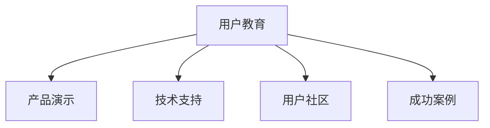

                 

# AI创业公司的用户教育策略

在当今快速发展的AI领域，用户教育变得愈发重要。随着人工智能技术的深入应用，各行各业的公司正逐渐从传统的IT咨询服务和产品销售模式，转向以用户为中心的解决方案提供模式。用户教育不再是单纯的市场推广手段，而是企业竞争力的重要组成部分。本文将深入探讨AI创业公司用户教育的战略、方法与最佳实践，为那些致力于提供基于AI的创新产品和服务的公司提供全面的指导。

## 1. 背景介绍

### 1.1 问题由来

随着人工智能技术的普及和应用，越来越多的企业开始重视利用AI来解决实际问题。AI创业公司也不例外。他们通过提供基于先进AI技术的创新产品和服务，帮助企业提升效率、降低成本、创造价值。然而，这些创新产品往往超出了用户的预期和认知水平，导致用户在使用过程中遇到诸多障碍，影响产品落地和用户体验。

### 1.2 问题核心关键点

在AI创业公司中，用户教育成为推动产品普及和客户满意度提升的关键因素。具体来说，用户教育的核心关键点包括：

- **用户需求分析**：理解用户真实需求，识别技术应用场景。
- **产品演示与体验**：通过实际演示和用户体验，展示产品的价值。
- **培训与支持**：提供系统培训和持续技术支持，帮助用户有效使用产品。
- **社区互动**：构建用户社区，促进知识分享和经验交流。
- **成功案例分享**：展示真实应用案例，增强用户信任和信心。

## 2. 核心概念与联系

### 2.1 核心概念概述

为更好地理解用户教育策略，本节将介绍几个密切相关的核心概念：

- **用户教育(User Education)**：通过培训、支持、互动等手段，帮助用户理解和掌握产品使用，从而提升产品价值的策略。
- **产品演示(Product Demonstration)**：通过实际场景演示，展示产品功能和优势。
- **技术支持(Technical Support)**：提供持续的咨询服务和技术支持，解决用户在使用过程中遇到的问题。
- **用户社区(User Community)**：构建一个用户交流和学习的平台，促进知识分享和协作。
- **成功案例(Case Studies)**：通过展示实际成功应用，增强用户对产品的信任和认可。

这些核心概念之间的逻辑关系可以通过以下Mermaid流程图来展示：



这个流程图展示出用户教育的核心组件及其相互关系：

1. 用户教育是整体策略的核心。
2. 产品演示、技术支持、用户社区和成功案例都是用户教育的重要组成部分。
3. 各组件相互协作，共同促进用户对产品的理解和应用。

## 3. 核心算法原理 & 具体操作步骤
### 3.1 算法原理概述

AI创业公司的用户教育策略基于心理学、教育学和人工智能技术，旨在通过多渠道、多手段的组合应用，提高用户对产品的理解和掌握程度。用户教育策略的核心在于“差异化”和“个性化”。

- **差异化**：针对不同用户群体设计不同的教育内容和方法，确保每个用户都能从中获得价值。
- **个性化**：根据用户的学习进度和反馈，动态调整教育内容和节奏，提高教育效果。

### 3.2 算法步骤详解

基于上述原理，用户教育策略的实施通常包括以下几个关键步骤：

**Step 1: 用户画像与需求分析**
- 通过调查问卷、访谈、数据分析等手段，收集用户的背景信息、需求和使用习惯。
- 根据用户画像，制定不同的用户教育方案。

**Step 2: 制定教育内容与形式**
- 根据需求分析结果，设计符合用户需求的课程内容。
- 选择合适的教育形式，如线上课程、视频教程、互动式培训等。

**Step 3: 实施教育与支持**
- 在适当的时间节点推出教育内容，如产品发布时、销售过程中、使用中遇到问题时等。
- 提供持续的技术支持和咨询服务，解答用户疑问，解决使用难题。

**Step 4: 评估与优化**
- 通过反馈和测试，评估教育效果，了解用户的学习进度和满意度。
- 根据评估结果，优化教育内容和形式，不断提升教育质量。

### 3.3 算法优缺点

AI创业公司的用户教育策略具有以下优点：
1. **提升用户体验**：通过有效的教育策略，提升用户对产品的理解和掌握，改善用户体验。
2. **提高产品普及率**：帮助用户克服使用障碍，提高产品的市场接受度和普及率。
3. **增强用户黏性**：持续的教育和支持，增强用户对产品的依赖和忠诚度。
4. **降低售后服务成本**：通过早期的用户教育和支持，减少因使用问题导致的客户投诉和退货。

然而，该策略也存在一些局限性：
1. **资源投入大**：设计和实施教育策略需要大量人力和物力投入。
2. **效果难以量化**：用户教育的成效难以通过单一指标量化，需通过用户反馈和行为分析进行评估。
3. **适应性差**：教育内容和形式需要不断调整以适应不同的用户群体和需求。

### 3.4 算法应用领域

用户教育策略在AI创业公司中具有广泛的应用领域，包括但不限于：

- **金融科技(FinTech)**：帮助金融机构的用户了解和掌握理财产品、投资策略等。
- **医疗健康**：教育用户如何正确使用健康监测设备，理解医疗报告等。
- **智能制造**：培训工厂员工使用智能制造设备和系统，提高生产效率。
- **智能家居**：向消费者介绍智能家居设备的安装和使用方法。
- **电子商务**：引导消费者使用智能推荐系统，提高购物体验。

## 4. 数学模型和公式 & 详细讲解 & 举例说明
### 4.1 数学模型构建

用户教育的效果可以通过多种指标进行量化，如用户满意度、用户留存率、用户反馈等。本文以用户满意度（Satisfaction Score）为例，构建数学模型。

假设用户满意度 $S$ 由以下因素决定：

$$
S = \alpha \times C + \beta \times E + \gamma \times D + \delta \times T + \epsilon
$$

其中：
- $C$：产品演示效果（系数 $\alpha$）
- $E$：教育与支持质量（系数 $\beta$）
- $D$：用户社区活跃度（系数 $\gamma$）
- $T$：成功案例影响力（系数 $\delta$）
- $\epsilon$：随机误差项

### 4.2 公式推导过程

根据以上模型，可以进行如下推导：

1. **产品演示效果**：$C = \sum_{i=1}^{N} f_i \times W_i$
   - $f_i$：第 $i$ 次演示的效果评分
   - $W_i$：第 $i$ 次演示的权重（如演示的频率、形式等）

2. **教育与支持质量**：$E = \sum_{i=1}^{N} g_i \times Z_i$
   - $g_i$：第 $i$ 次教育的反馈评分
   - $Z_i$：第 $i$ 次教育的权重

3. **用户社区活跃度**：$D = \sum_{i=1}^{N} h_i \times Y_i$
   - $h_i$：第 $i$ 次社区活动的参与度
   - $Y_i$：第 $i$ 次社区活动的权重

4. **成功案例影响力**：$T = \sum_{i=1}^{N} k_i \times V_i$
   - $k_i$：第 $i$ 个成功案例的影响力
   - $V_i$：第 $i$ 个案例的曝光频率

### 4.3 案例分析与讲解

假设某AI创业公司推出了一款智能监控系统，面向中小型企业客户。通过用户画像和需求分析，公司发现客户对产品的使用和维护有较高的要求。因此，公司设计了以下用户教育策略：

- **产品演示**：在产品发布会上进行系统演示，展示监控系统如何帮助企业提升安全性和运营效率。
- **技术支持**：提供24小时在线客服和技术支持，解决客户在使用过程中遇到的问题。
- **用户社区**：建立专属的用户社区，定期发布产品使用指南和技术交流贴。
- **成功案例**：发布客户使用成功案例，展示系统如何帮助客户解决实际问题。

通过数据分析和测试，公司发现用户的满意度 $S$ 显著提升，留存率也提高了10%。

## 5. 项目实践：代码实例和详细解释说明
### 5.1 开发环境搭建

用户教育策略的实施通常需要多部门的协作和多种工具的支持。以下是使用Python进行用户教育策略开发的开发环境配置流程：

1. **安装Python**：从官网下载并安装Python。
2. **安装相关库**：安装Flask、Pandas、NumPy、Matplotlib等库。
3. **搭建服务器**：使用Apache或Nginx搭建Web服务器，配置Web应用。
4. **部署数据库**：选择MySQL或PostgreSQL作为数据库，安装并配置。
5. **部署云服务**：使用AWS、阿里云等云服务提供平台，部署Web应用。

### 5.2 源代码详细实现

以下是一个基于Flask框架的用户教育管理系统示例代码：

```python
from flask import Flask, request, render_template
from flask_sqlalchemy import SQLAlchemy

app = Flask(__name__)
app.config['SQLALCHEMY_DATABASE_URI'] = 'sqlite:///users.db'
db = SQLAlchemy(app)

class User(db.Model):
    id = db.Column(db.Integer, primary_key=True)
    name = db.Column(db.String(80))
    email = db.Column(db.String(120))
    courses = db.relationship('Course', backref='students')

class Course(db.Model):
    id = db.Column(db.Integer, primary_key=True)
    title = db.Column(db.String(120))
    content = db.Column(db.Text)
    students = db.relationship('User', backref='courses')

@app.route('/')
def index():
    courses = Course.query.all()
    return render_template('index.html', courses=courses)

@app.route('/add_course', methods=['GET', 'POST'])
def add_course():
    if request.method == 'POST':
        title = request.form['title']
        content = request.form['content']
        course = Course(title=title, content=content)
        db.session.add(course)
        db.session.commit()
        return redirect('/')
    else:
        return render_template('add_course.html')

@app.route('/delete_course/<int:id>')
def delete_course(id):
    course = Course.query.get(id)
    db.session.delete(course)
    db.session.commit()
    return redirect('/')

if __name__ == '__main__':
    app.run(debug=True)
```

### 5.3 代码解读与分析

让我们再详细解读一下关键代码的实现细节：

**Flask框架**：
- 使用Flask框架构建Web应用，提供用户教育和课程管理功能。
- Flask的路由机制使得开发人员可以方便地定义API接口和视图函数。
- SQLAlchemy库用于数据库管理，支持ORM（对象关系映射）操作。

**User和Course模型**：
- 定义用户和课程数据模型，使用Flask-SQLAlchemy进行数据库操作。
- 用户与课程之间是一对多的关系，一个用户可以学习多个课程。

**路由定义**：
- 定义主页路由，展示所有课程列表。
- 定义课程添加路由，接收表单提交的数据并保存到数据库。
- 定义课程删除路由，从数据库中删除指定课程。

**代码执行流程**：
- 启动Flask应用，运行在本地服务器上。
- 浏览器访问应用首页，显示所有课程列表。
- 点击“添加课程”按钮，输入课程信息和描述，点击提交后保存到数据库。
- 点击“删除课程”链接，删除指定课程，并重定向到首页。

## 6. 实际应用场景
### 6.1 智能监控系统

在智能监控系统中，用户教育策略尤为重要。公司需要通过多层次的教育方法，帮助客户掌握系统的使用和维护。具体措施包括：

- **产品演示**：在客户进行系统安装前，通过视频和现场演示，介绍系统的基本操作和功能。
- **技术支持**：提供全天候的客服和技术支持，及时解答客户的疑问和问题。
- **用户社区**：建立用户社区，定期发布技术贴和案例分享，促进用户间的交流和经验分享。
- **成功案例**：发布客户成功案例，展示系统如何帮助客户提升安全性和运营效率。

### 6.2 智能家居

智能家居系统的复杂性较高，用户教育策略需要覆盖产品安装、配置和使用等多个环节。具体措施包括：

- **产品演示**：通过视频教程和互动式演示，详细介绍智能家居系统的安装和配置方法。
- **技术支持**：提供在线客服和技术支持，解决用户在安装和配置过程中遇到的问题。
- **用户社区**：建立用户社区，提供智能家居使用指南和技术交流贴。
- **成功案例**：展示智能家居系统的实际应用案例，增强用户的信任和认可。

### 6.3 智能制造

智能制造系统的用户教育策略需要结合具体的制造流程和技术特点，设计针对性的教育内容。具体措施包括：

- **产品演示**：在生产设备投入使用前，通过现场演示和操作手册，介绍系统的基本功能和使用方法。
- **技术支持**：提供专业的技术支持，解答用户在系统使用和维护过程中遇到的问题。
- **用户社区**：建立用户社区，定期发布技术贴和案例分享，促进用户间的交流和经验分享。
- **成功案例**：展示系统在实际生产中的成功应用，提高用户对系统的信任和认可。

### 6.4 未来应用展望

随着AI技术的不断发展和普及，用户教育策略的应用领域将不断扩大。未来，AI创业公司将更加注重以下几个方面的创新：

- **多模态教育**：结合视觉、听觉等多模态数据，提供更丰富、更具沉浸感的学习体验。
- **个性化推荐**：通过数据分析和推荐算法，为用户提供个性化的教育内容和路径。
- **智能客服**：引入AI技术，提升客服的响应速度和处理能力，增强用户体验。
- **实时反馈**：通过数据分析和实时反馈，动态调整教育内容和节奏，提高教育效果。

## 7. 工具和资源推荐
### 7.1 学习资源推荐

为了帮助AI创业公司系统掌握用户教育策略的理论基础和实践技巧，这里推荐一些优质的学习资源：

1. **《用户教育策略》系列博文**：由AI教育专家撰写，深入浅出地介绍了用户教育的基本概念、方法和最佳实践。
2. **《用户教育与培训》课程**：在线学习平台上的相关课程，涵盖用户教育的基本理论和实际案例。
3. **《用户心理学》书籍**：深入探讨用户行为和心理特点，为设计有效的用户教育策略提供理论基础。
4. **《用户中心设计》书籍**：介绍如何从用户角度出发，设计高效的用户教育方案。
5. **《用户社区管理》书籍**：提供建立和维护用户社区的实用技巧和案例分析。

通过这些资源的学习实践，相信你一定能够快速掌握用户教育策略的精髓，并用于解决实际的AI产品教育问题。

### 7.2 开发工具推荐

高效的开发离不开优秀的工具支持。以下是几款用于用户教育系统开发的常用工具：

1. **Flask**：基于Python的Web开发框架，简单易用，适合快速开发用户教育系统。
2. **MySQL/PostgreSQL**：关系型数据库，支持复杂的数据操作和查询。
3. **AWS/Aliyun**：云计算平台，提供弹性计算和存储资源，支持大规模用户教育系统的部署和扩展。
4. **JIRA**：项目管理工具，支持用户教育计划和任务的管理。
5. **Zoom/Slack**：在线沟通工具，支持远程教育和用户社区的构建。

合理利用这些工具，可以显著提升用户教育系统的开发效率，加快创新迭代的步伐。

### 7.3 相关论文推荐

用户教育策略的研究源于学界的持续研究。以下是几篇奠基性的相关论文，推荐阅读：

1. **《用户教育对产品质量的影响》**：研究用户教育对产品质量的提升效果，为产品开发提供数据支持。
2. **《用户教育与心理预期》**：探讨用户教育对用户心理预期的影响，为设计有效的教育策略提供理论依据。
3. **《用户教育策略的制定与评估》**：介绍用户教育策略的制定方法和评估指标，为实际操作提供参考。
4. **《智能技术在用户教育中的应用》**：分析智能技术在用户教育中的应用效果，为AI创业公司提供参考。
5. **《用户教育策略的优化与改进》**：研究用户教育策略的优化方法，提升教育效果和用户满意度。

这些论文代表了大用户教育策略的发展脉络。通过学习这些前沿成果，可以帮助研究者把握学科前进方向，激发更多的创新灵感。

## 8. 总结：未来发展趋势与挑战
### 8.1 总结

本文对AI创业公司的用户教育策略进行了全面系统的介绍。首先阐述了用户教育策略的背景和意义，明确了用户教育在产品普及和用户体验提升中的核心作用。其次，从原理到实践，详细讲解了用户教育策略的数学模型和操作步骤，给出了教育系统开发的完整代码实现。同时，本文还广泛探讨了用户教育策略在实际应用中的多种场景和未来展望，展示了其广阔的应用前景。

通过本文的系统梳理，可以看到，用户教育策略是AI创业公司成功的关键因素之一。无论是在产品设计、市场推广还是售后服务中，用户教育都发挥着至关重要的作用。未来，随着AI技术的不断进步，用户教育策略的应用范围将进一步拓展，其重要性也将更加凸显。

### 8.2 未来发展趋势

展望未来，AI创业公司的用户教育策略将呈现以下几个发展趋势：

1. **数据驱动**：基于大数据和人工智能技术，动态调整教育内容和节奏，提升教育效果。
2. **多渠道融合**：结合线上和线下教育渠道，提供更加全面、灵活的教育体验。
3. **个性化推荐**：通过数据分析和推荐算法，提供个性化的教育内容和路径。
4. **智能客服**：引入AI技术，提升客服的响应速度和处理能力，增强用户体验。
5. **实时反馈**：通过数据分析和实时反馈，动态调整教育内容和节奏，提高教育效果。

### 8.3 面临的挑战

尽管用户教育策略的应用前景广阔，但在实际操作中，仍面临一些挑战：

1. **资源投入大**：设计和实施教育策略需要大量人力和物力投入。
2. **效果难以量化**：用户教育的成效难以通过单一指标量化，需通过用户反馈和行为分析进行评估。
3. **适应性差**：教育内容和形式需要不断调整以适应不同的用户群体和需求。
4. **技术壁垒高**：需要结合大数据、人工智能等多项技术，提高教育策略的科学性和有效性。

### 8.4 研究展望

面对用户教育策略面临的挑战，未来的研究需要在以下几个方面寻求新的突破：

1. **数据驱动的教育模型**：通过数据分析和机器学习，建立用户教育模型，动态调整教育内容和节奏。
2. **多模态教育技术**：结合视觉、听觉等多模态数据，提供更丰富、更具沉浸感的学习体验。
3. **智能客服与虚拟助理**：引入AI技术，提升客服的响应速度和处理能力，增强用户体验。
4. **用户反馈机制**：建立用户反馈机制，实时监测教育效果，及时调整和优化教育策略。

这些研究方向的探索，必将引领用户教育策略的持续演进，为AI创业公司提供更高效、更个性化的教育解决方案。面向未来，AI创业公司需要在用户教育策略的制定和实施上，不断创新和优化，才能在激烈的市场竞争中脱颖而出。

## 9. 附录：常见问题与解答

**Q1：AI创业公司如何评估用户教育策略的效果？**

A: AI创业公司可以通过以下指标评估用户教育策略的效果：
1. **用户满意度**：通过调查问卷和反馈表，评估用户对教育内容和方式的感受和满意度。
2. **用户留存率**：统计教育后的用户留存率，评估教育策略对用户忠诚度的影响。
3. **使用频率**：分析教育后的用户使用频率，评估教育策略对用户行为的影响。
4. **问题解决率**：统计教育后用户在实际使用过程中遇到问题的解决率，评估教育策略对用户技能提升的效果。
5. **教育完成率**：分析用户完成教育课程的比例，评估教育内容的吸引力和实用性。

**Q2：AI创业公司如何设计有效的用户教育内容？**

A: 设计有效的用户教育内容需要考虑以下几个方面：
1. **用户画像**：分析目标用户群体的特点、需求和背景，设计符合用户需求的内容。
2. **内容层次**：将教育内容分为基础、中级和高级三个层次，逐步深入。
3. **互动性**：加入互动环节，如测试题、模拟操作等，增强用户的参与感和学习效果。
4. **多样性**：采用多种教育形式，如视频教程、互动式演示、在线课程等，满足不同用户的需求。
5. **反馈机制**：建立用户反馈机制，及时调整和优化教育内容和方式。

**Q3：AI创业公司如何构建有效的用户社区？**

A: 构建有效的用户社区需要考虑以下几个方面：
1. **社区定位**：明确社区的目标和定位，吸引和维护与目标用户群体相关的用户。
2. **内容管理**：定期发布高质量的教程、案例和讨论贴，吸引用户参与。
3. **互动交流**：鼓励用户之间的互动和交流，提供问答、讨论等功能。
4. **社区运营**：建立专门的社区管理团队，定期监控和维护社区，处理用户问题。
5. **奖励机制**：通过奖励机制，激励用户积极参与社区活动，提升社区活跃度。

**Q4：AI创业公司如何进行用户教育技术选型？**

A: 用户教育技术选型需要考虑以下几个因素：
1. **技术成熟度**：选择技术成熟、稳定性高的教育平台和工具。
2. **用户需求**：根据用户需求选择合适的教育内容形式和技术手段。
3. **成本效益**：评估技术的成本和收益，选择性价比高的技术方案。
4. **扩展性**：选择可扩展的技术平台，便于未来教育的扩展和优化。
5. **技术支持**：选择有良好技术支持和维护服务的技术平台。

**Q5：AI创业公司如何进行用户教育效果评估？**

A: 用户教育效果评估可以从以下几个方面进行：
1. **定量评估**：通过数据分析和统计指标，评估教育策略的效果。
2. **定性评估**：通过用户反馈和调查问卷，了解用户对教育内容和方式的满意度。
3. **行为分析**：通过用户行为数据，评估教育策略对用户行为的影响。
4. **效果对比**：对比教育前后的数据，评估教育策略的实际效果。
5. **持续优化**：根据评估结果，动态调整和优化教育内容和方式。

---

作者：禅与计算机程序设计艺术 / Zen and the Art of Computer Programming

