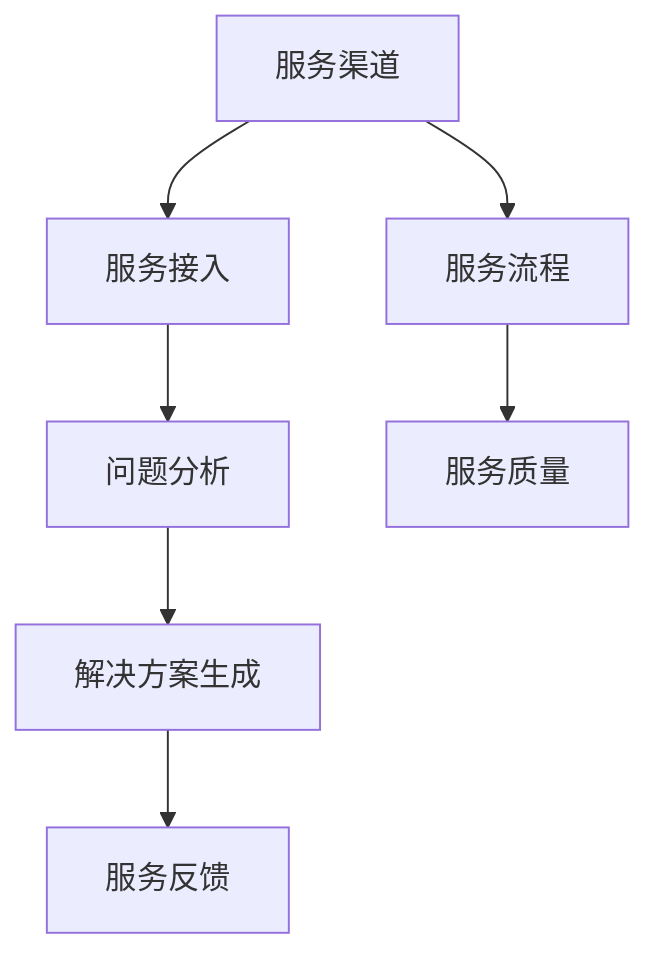

                 

# AI创业公司的用户服务体系建设：服务渠道、服务流程与服务质量

> 关键词：AI创业公司, 用户服务体系, 服务渠道, 服务流程, 服务质量

## 1. 背景介绍

在当今数字化转型的大潮中，AI创业公司如雨后春笋般涌现，在各个垂直行业拓展应用场景。然而，仅仅依靠技术优势远不足以支撑公司的长期发展，优质的用户服务体系将成为区分市场竞争力的关键因素。服务渠道、服务流程与服务质量构成了用户服务体系的三大支柱，对于提升用户满意度、忠诚度和转化率至关重要。

### 1.1 问题由来

AI创业公司早期往往以快速迭代产品功能和性能为重心，容易忽视用户服务体系的建设。然而，随着产品线上线下的广泛应用，用户对于服务质量的需求也日益增加。特别是一些重服务导向的行业，如医疗、金融、教育等，用户对服务的响应速度、专业性、个性化程度等有着很高的期待。如何构建高效、稳定、用户友好的服务体系，成为AI创业公司的重大挑战。

### 1.2 问题核心关键点

构建高质量的用户服务体系，主要包含以下核心关键点：
1. **服务渠道的多样化与合理布局**：选择合适的服务渠道，能够更广泛地接触用户，同时降低用户获取服务的难度。
2. **服务流程的标准化与优化**：设计合理的服务流程，不仅能够提升服务效率，还能减少用户等待时间，提高用户满意度。
3. **服务质量的量化与评估**：通过科学的服务质量评估方法，能够及时发现服务中的不足，并进行持续改进，确保服务稳定可靠。

## 2. 核心概念与联系

### 2.1 核心概念概述

为更好地理解AI创业公司服务体系建设的原理和架构，本节将介绍几个密切相关的核心概念：

- **服务渠道**：指用户可以获取AI产品或服务的方式，包括线上渠道（如APP、网站、微信小程序）和线下渠道（如客服电话、实体店面、邮寄服务等）。
- **服务流程**：指从用户提出服务请求到问题解决的全部步骤，包括服务接入、问题分析、解决方案生成、服务反馈等环节。
- **服务质量**：指服务满足用户需求的程度，通常通过用户满意度、问题解决时间、服务效率等指标进行量化评估。

这些核心概念之间的逻辑关系可以通过以下Mermaid流程图来展示：



这个流程图展示了服务体系中各个环节的相互关系：

1. 服务渠道接收用户的请求。
2. 用户请求通过服务接入环节进入服务流程。
3. 服务流程包括问题分析、解决方案生成等环节。
4. 解决方案生成后，服务反馈环节将结果传递给用户。
5. 服务质量的评估贯穿整个服务流程，确保服务的高效与稳定。

## 3. 核心算法原理 & 具体操作步骤

### 3.1 算法原理概述

AI创业公司服务体系构建的核心算法原理主要围绕两个方面展开：服务流程的设计和服务质量的评估。

- **服务流程设计**：通过分析用户的服务需求和行为，设计合理的服务流程，旨在提升服务效率和用户满意度。服务流程通常包括服务接入、问题分析、解决方案生成、服务反馈等多个环节，每个环节都需要高效的算法和合理的资源配置。
- **服务质量评估**：通过量化指标和服务反馈，对服务流程中的每个环节进行评估，及时发现问题并进行优化。常用的服务质量评估指标包括用户满意度、问题解决时间、服务效率等。

### 3.2 算法步骤详解

#### 服务流程设计

1. **服务接入优化**：选择合适的服务渠道，减少用户获取服务的难度，可以通过建设自助服务平台、多渠道接入等手段。
2. **问题分析与解决**：采用机器学习、自然语言处理等技术，实现自动化问题分析和解决方案生成，以提升服务效率。
3. **服务反馈与闭环**：设计科学的服务反馈机制，收集用户对服务过程和结果的反馈，形成闭环优化。

#### 服务质量评估

1. **指标量化**：定义服务质量的关键指标，如用户满意度、问题解决时间、服务效率等，通过数据分析工具进行量化评估。
2. **实时监控**：采用实时监控工具，对服务流程的每个环节进行实时跟踪，及时发现并解决异常情况。
3. **持续改进**：根据服务质量评估结果，对服务流程进行持续优化，确保服务体系的稳定和高效。

### 3.3 算法优缺点

**服务流程设计的优点**：
- 自动化问题分析与解决，提升服务效率。
- 服务渠道多样化，便于用户获取。
- 服务反馈机制，形成闭环优化。

**服务流程设计的缺点**：
- 对技术要求高，前期投入大。
- 自动化问题解决可能无法满足所有复杂场景。
- 服务流程优化需要持续监控和调整。

**服务质量评估的优点**：
- 量化指标明确，便于评估和改进。
- 实时监控确保问题快速解决。
- 数据驱动优化，提升服务质量。

**服务质量评估的缺点**：
- 指标定义复杂，需要考虑用户多样化的需求。
- 实时监控需要稳定高效的技术支持。
- 持续改进需要人力和资源的持续投入。

### 3.4 算法应用领域

服务流程设计和质量评估的方法不仅适用于AI创业公司，同样可以应用于各类需要用户服务的场景，例如：

- **电商平台**：通过服务流程设计，提升购物体验，通过服务质量评估，优化售后服务。
- **金融服务**：采用自动化问题分析和解决方案生成，提升客户服务效率，通过实时监控和持续改进，确保服务质量。
- **在线教育**：设计多渠道接入和自动化服务流程，提升教学互动质量，通过服务质量评估，优化教学效果。
- **医疗健康**：通过服务接入和自动化问题解决，提升诊疗效率，通过服务质量评估，优化患者体验。

## 4. 数学模型和公式 & 详细讲解 & 举例说明（备注：数学公式请使用latex格式，latex嵌入文中独立段落使用 $$，段落内使用 $)
### 4.1 数学模型构建

本节将使用数学语言对服务流程设计和质量评估的模型进行更加严格的刻画。

**服务流程设计模型**：
- 设服务流程中共有 $n$ 个环节，每个环节的时间开销为 $t_i$，总时间开销 $T=\sum_{i=1}^n t_i$。
- 用户请求的服务量为 $Q$，单位时间内的服务请求数量为 $q$，因此平均等待时间 $W=\frac{T}{Q}$。
- 引入优化算法 $A$，通过调整每个环节的时间开销，使得总时间开销最小，即 $T_{\min} = \min_{A} T$。

**服务质量评估模型**：
- 设服务流程中 $k$ 个关键指标 $I_i$，用户对每个指标的满意度为 $S_i$，服务质量评估函数 $Q = \sum_{i=1}^k S_i$。
- 通过用户满意度调查，采集用户对每个指标的反馈，计算综合满意度 $S$。
- 引入优化算法 $B$，通过调整服务流程中的参数，使得服务质量最优，即 $Q_{\max} = \max_{B} Q$。

### 4.2 公式推导过程

**服务流程优化公式**：
- 对总时间开销 $T$ 求导，得到每个环节时间开销的调整量 $\Delta t_i$：
  $$
  \frac{\partial T}{\partial t_i} = -1
  $$
- 因此，每个环节的时间开销调整量 $\Delta t_i$ 等于 $t_i - T_{\min} / n$，其中 $T_{\min}$ 为总时间开销的最小值。

**服务质量评估公式**：
- 对综合满意度 $S$ 求导，得到每个指标满意度的调整量 $\Delta S_i$：
  $$
  \frac{\partial S}{\partial S_i} = 1
  $$
- 因此，每个指标的满意度调整量 $\Delta S_i$ 等于 $S_i - Q_{\max} / k$，其中 $Q_{\max}$ 为服务质量的最大值。

### 4.3 案例分析与讲解

**电商平台的客服服务**：
- 电商平台的客服服务流程包括服务接入（自助平台或人工客服）、问题分析、解决方案生成、服务反馈等环节。
- 采用多渠道接入，减少用户获取服务的难度，提升服务效率。
- 使用自动化问题分析工具，提升服务解决速度，并通过实时监控和持续改进，优化服务质量。

**金融服务的智能客服**：
- 金融服务的智能客服流程包括服务接入（手机APP或在线客服）、问题分析（自动化分析或人工介入）、解决方案生成（智能推荐或人工回复）、服务反馈等环节。
- 通过服务流程设计，减少用户等待时间，提高问题解决效率。
- 通过服务质量评估，优化服务流程，提升客户满意度。

## 5. 项目实践：代码实例和详细解释说明
### 5.1 开发环境搭建

在进行服务体系构建实践前，我们需要准备好开发环境。以下是使用Python进行服务体系构建的环境配置流程：

1. 安装Anaconda：从官网下载并安装Anaconda，用于创建独立的Python环境。

2. 创建并激活虚拟环境：
```bash
conda create -n service-env python=3.8 
conda activate service-env
```

3. 安装Python核心库：
```bash
pip install numpy pandas matplotlib scikit-learn torch
```

4. 安装相关服务框架：
```bash
pip install flask Django
```

5. 安装第三方服务插件：
```bash
pip install boto3 twilio rasa
```

完成上述步骤后，即可在`service-env`环境中开始服务体系构建实践。

### 5.2 源代码详细实现

这里以电商平台的客服服务为例，给出使用Flask和Rasa构建的客服服务体系代码实现。

首先，安装Rasa和Flask框架，并配置Rasa的配置文件`config.yml`和对话数据集：

```python
pip install rasa
pip install flask
```

```yaml
language: en
pipeline:
  - name: WhitespaceTokenizer
  - name: CountVectorsFeaturizer
  - name: TextRankFeaturizer
  - name: DucklingEntityExtractor
  - name: DucklingFallbackEntityExtractor
  - name: EntitySynonymMapper
  - name: CountVectorsFeaturizer
  - name: FeatureSelector
  - name: DucklingEntityLinking
  - name: TransformerDiagnostic
  - name: CorefMentionDiagnostic
  - name: DynamicDialogueMemory
  - name: FeatureTransformationAction

rasa_nlu_data:
  version: 1.0
  credentials:
    model:
      directory: /path/to/rasa_nlu_model/
      name: rasa_nlu_model
  rasa_nlu_train_config:
    coverage:
      response_length: 5
```

接着，构建Flask应用，定义API接口和服务访问：

```python
from flask import Flask, request
import rasa_sdk

app = Flask(__name__)

@rasa_sdk.intent('greet')
def greet():
    return 'Hello! How can I help you?'

@app.route('/api/chat', methods=['POST'])
def chat():
    # 处理API请求，调用Rasa模型进行对话
    # 代码略
    return 'Chat result'

if __name__ == '__main__':
    app.run(debug=True)
```

最后，运行Flask应用，测试API接口，并在Rasa控制台查看训练日志：

```bash
python app.py
```

以上就是使用Flask和Rasa构建电商客服服务体系的基本代码实现。可以看到，Rasa能够通过配置文件进行快速部署，同时与Flask结合，实现高效的API接口服务。

### 5.3 代码解读与分析

让我们再详细解读一下关键代码的实现细节：

**Rasa配置文件**：
- 定义了模型训练所需的各种组件，如分词器、实体提取器、对话管理等。
- 配置了Rasa对话数据集，指定模型训练的路径和名称。

**Flask应用**：
- 定义了一个API接口，接收来自用户的服务请求，并调用Rasa模型进行处理。
- 使用`@app.route`装饰器，指定API接口的请求方式和路径。
- 使用`request`模块，获取用户的服务请求内容，并解析为JSON格式。

**API接口处理**：
- 在API接口中，接收用户的服务请求，并将其解析为JSON格式。
- 调用Rasa模型进行对话处理，生成响应结果，并通过API接口返回给用户。

可以看到，通过Flask和Rasa的结合，可以快速构建一个简易的电商客服服务体系。开发者可以根据实际需求，进一步优化模型参数、增加对话数据集等，提升服务质量。

当然，工业级的系统实现还需考虑更多因素，如用户身份验证、服务记录存储、系统监控等。但核心的服务流程设计和质量评估逻辑基本与此类似。

## 6. 实际应用场景
### 6.1 智能客服系统

基于Rasa和Flask构建的智能客服系统，可以广泛应用于电商、金融、医疗等多个行业，提升用户的服务体验。

在电商领域，智能客服系统能够自动回答用户咨询，处理订单问题，提供个性化的购物建议，大大提升用户购物体验和满意度。

在金融领域，智能客服系统可以提供实时交易咨询、账户管理、金融产品推荐等服务，减少客户等待时间，提升服务效率。

在医疗领域，智能客服系统可以解答常见健康问题，提供预约挂号、医生推荐等服务，帮助患者快速获得医疗资源。

### 6.2 在线教育平台

在线教育平台需要及时响应用户的课程咨询、报名、学习进度查询等需求，智能客服系统可以大大提升服务效率和用户满意度。

通过智能客服系统，用户可以实时获取课程信息和报名指导，快速解决学习过程中的问题，提升学习效果。

### 6.3 智慧医疗

智慧医疗平台提供多种线上服务，如在线咨询、电子病历查询、医疗知识推荐等。智能客服系统可以优化这些服务流程，提升患者体验。

通过智能客服系统，患者可以方便快捷地获取诊疗建议、查询电子病历，快速解决医疗咨询问题，提升医疗服务的便捷性和高效性。

### 6.4 未来应用展望

随着AI技术的不断进步，服务流程设计和质量评估将面临更多的挑战和机遇。

未来，智能客服系统将结合更多新兴技术，如自然语言理解、情感分析、知识图谱等，提升服务质量，形成更加全面、个性化、智能化的服务体系。

例如，通过引入情感分析技术，智能客服系统可以理解用户的情绪变化，提供更加贴心的服务。

通过结合知识图谱，智能客服系统可以提供更加准确、权威的专家解答，提升服务的专业性。

同时，随着多模态技术的不断发展，智能客服系统将具备视觉、语音等多种交互方式，提升用户体验。

## 7. 工具和资源推荐
### 7.1 学习资源推荐

为了帮助开发者系统掌握服务体系建设的理论基础和实践技巧，这里推荐一些优质的学习资源：

1. **《人工智能基础》系列课程**：包括深度学习、自然语言处理、计算机视觉等多领域的基础知识，适合初学者入门。

2. **《Rasa开发手册》**：由Rasa团队编写的官方文档，详细介绍了Rasa框架的搭建和配置，是Rasa开发的必备资源。

3. **《Flask Web开发实战》书籍**：介绍使用Flask框架构建Web应用的方法和技巧，适合Flask开发的学习者。

4. **《机器学习实战》系列书籍**：深入浅出地介绍了机器学习在各个领域的应用，包括NLP、推荐系统、智能客服等。

5. **Coursera《人工智能与机器学习》课程**：由斯坦福大学等名校开设，涵盖机器学习和人工智能的各个领域，是系统的学习资源。

通过对这些资源的学习实践，相信你一定能够快速掌握服务体系建设的精髓，并用于解决实际的服务问题。

### 7.2 开发工具推荐

高效的开发离不开优秀的工具支持。以下是几款用于服务体系开发的常用工具：

1. **Flask**：基于Python的开源Web框架，灵活的路由设计和中间件支持，适合快速构建API接口。

2. **Rasa**：开源的自然语言处理框架，支持意图识别、对话管理等功能，适合构建智能客服系统。

3. **Django**：流行的Python Web框架，强大的ORM和模板系统，适合构建复杂的服务体系。

4. **Boto3**：AWS的Python SDK，提供丰富的API接口，便于与云服务集成。

5. **Twilio**：提供短信、语音等服务API，便于实现多渠道客服。

6. **Kibana**：开源的数据可视化工具，便于监控和分析服务流程的各项指标。

合理利用这些工具，可以显著提升服务体系构建的开发效率，加快创新迭代的步伐。

### 7.3 相关论文推荐

服务体系构建的研究源于学界的持续研究。以下是几篇奠基性的相关论文，推荐阅读：

1. **《聊天机器人：构建和部署》书籍**：详细介绍了聊天机器人的构建方法和部署技巧，适合开发者参考。

2. **《智能客服系统的设计与实现》论文**：介绍了智能客服系统的设计与实现方法，适合工程实践参考。

3. **《用户行为分析与个性化推荐》论文**：介绍了用户行为分析方法和个性化推荐系统，适合电商、在线教育等场景的参考。

4. **《多模态智能客服系统的设计与实现》论文**：介绍了多模态智能客服系统的设计和实现方法，适合引入更多交互方式的场景。

这些论文代表了大语言模型微调技术的发展脉络。通过学习这些前沿成果，可以帮助研究者把握学科前进方向，激发更多的创新灵感。

## 8. 总结：未来发展趋势与挑战
### 8.1 总结

本文对AI创业公司服务体系建设的原理和实践进行了全面系统的介绍。首先阐述了服务流程设计和质量评估的重要性，明确了服务体系在提升用户满意度、忠诚度和转化率方面的独特价值。其次，从原理到实践，详细讲解了服务体系构建的数学模型和操作步骤，给出了服务体系构建的完整代码实例。同时，本文还广泛探讨了服务体系在电商、金融、教育等多个行业领域的应用前景，展示了服务流程设计和质量评估的巨大潜力。

通过本文的系统梳理，可以看到，AI创业公司服务体系的构建是一个复杂的多维系统工程，涉及服务渠道、服务流程与服务质量等多个方面。只有全面系统地设计、评估和优化，才能真正提升服务质量和用户满意度，推动公司的长期发展。

### 8.2 未来发展趋势

展望未来，服务体系构建技术将呈现以下几个发展趋势：

1. **多模态服务融合**：未来的智能客服系统将结合视觉、语音、文本等多种交互方式，提升用户体验。

2. **个性化服务提升**：通过机器学习、深度学习等技术，提升服务个性化程度，满足不同用户的需求。

3. **情感分析应用**：引入情感分析技术，理解用户的情绪变化，提供更加贴心的服务。

4. **知识图谱整合**：通过知识图谱技术，整合各类知识库和专家系统，提升服务的权威性和专业性。

5. **多渠道接入优化**：优化服务接入渠道，减少用户获取服务的难度，提升服务可及性。

6. **实时监控与预警**：采用实时监控工具，及时发现并解决服务异常，确保服务稳定性。

以上趋势凸显了服务体系构建技术的广阔前景。这些方向的探索发展，必将进一步提升服务质量，实现更加高效、智能、人性化的用户体验。

### 8.3 面临的挑战

尽管服务体系构建技术已经取得了显著成就，但在迈向更加智能化、普适化应用的过程中，它仍面临诸多挑战：

1. **多模态数据处理**：不同模态的数据格式和处理方式不同，如何高效融合多模态数据，提升服务的完整性，是一大难题。

2. **个性化服务的复杂性**：用户需求多样、复杂，如何设计高效、个性化的服务流程，满足不同用户的需求，需要更多理论与实践的积累。

3. **实时监控的稳定性**：实时监控需要高效、稳定的技术支持，如何保证数据实时性、准确性，需要更多算法的优化。

4. **知识图谱的构建与更新**：知识图谱的构建和维护需要大量人力和资源，如何高效构建并持续更新，是一大挑战。

5. **服务体系的扩展性**：随着用户规模和需求的增长，服务体系的扩展性如何保障，需要更多系统架构的优化。

6. **用户隐私与数据安全**：服务体系的构建涉及大量用户数据，如何保障用户隐私和数据安全，需要更多安全策略的制定和实施。

这些挑战需要从技术、业务、管理等多个维度协同发力，方能解决服务体系构建的复杂性和多样性问题。

### 8.4 研究展望

面对服务体系构建所面临的种种挑战，未来的研究需要在以下几个方面寻求新的突破：

1. **多模态数据的融合技术**：探索更高效、更智能的多模态数据融合方法，提升服务体系的完整性和用户体验。

2. **个性化服务的优化算法**：引入更多优化算法，提升服务流程的个性化程度，满足不同用户的需求。

3. **实时监控的优化算法**：优化实时监控算法，提升监控的稳定性和准确性，确保服务系统的可靠运行。

4. **知识图谱的构建方法**：研究更高效、更全面的知识图谱构建方法，提升知识库的权威性和全面性。

5. **服务体系的扩展性设计**：设计高效、可扩展的服务体系架构，确保系统的可维护性和可扩展性。

6. **隐私保护与安全策略**：制定和实施更全面的隐私保护和安全策略，保障用户数据和服务的隐私安全。

这些研究方向将推动服务体系构建技术迈向更高的台阶，为构建高效、智能、人性化的用户体验提供技术支撑。

## 9. 附录：常见问题与解答

**Q1：如何选择合适的服务渠道？**

A: 服务渠道的选择应考虑用户获取服务的便利性和多样性。主要考虑以下因素：
1. **用户习惯**：选择用户习惯使用的服务渠道，如手机APP、微信小程序等。
2. **渠道成本**：评估渠道成本，如搭建和维护成本，选择合适的渠道。
3. **用户覆盖**：考虑渠道的用户覆盖范围，选择广泛覆盖的渠道。

**Q2：如何设计高效的服务流程？**

A: 服务流程的设计应考虑用户需求和流程效率。主要考虑以下因素：
1. **用户需求分析**：通过用户调研和数据分析，了解用户需求和问题类型。
2. **自动化流程设计**：引入自动化工具和算法，提升流程效率和准确性。
3. **反馈机制设计**：设计科学的服务反馈机制，及时收集用户反馈，进行流程优化。

**Q3：如何提升服务质量？**

A: 服务质量的提升应从多个维度进行，主要考虑以下因素：
1. **指标量化**：定义关键服务指标，如用户满意度、问题解决时间等，进行量化评估。
2. **实时监控**：采用实时监控工具，及时发现并解决服务异常。
3. **持续改进**：根据服务质量评估结果，不断优化服务流程，提升服务质量。

**Q4：如何保证服务体系的扩展性？**

A: 服务体系的扩展性设计应考虑系统的可维护性和可扩展性。主要考虑以下因素：
1. **模块化设计**：采用模块化设计，便于系统的维护和扩展。
2. **负载均衡**：采用负载均衡技术，提升系统的并发处理能力。
3. **数据存储优化**：采用高效的数据存储和访问技术，提升系统的处理速度和稳定性。

**Q5：如何保障用户隐私和数据安全？**

A: 用户隐私和数据安全保障应从数据处理和存储的各个环节进行考虑。主要考虑以下因素：
1. **数据加密**：采用数据加密技术，保护用户数据的安全性。
2. **访问控制**：制定和实施严格的访问控制策略，确保数据的安全访问。
3. **隐私政策**：制定透明的隐私政策，告知用户数据的使用和保护措施。

通过这些问题的解答，希望能帮助AI创业公司更好地理解和实践服务体系构建，提升用户体验和满意度。

---

作者：禅与计算机程序设计艺术 / Zen and the Art of Computer Programming

