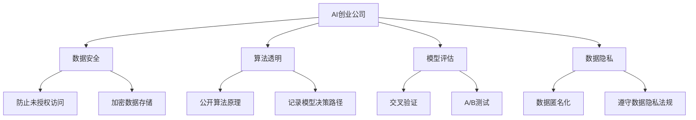

                 

# AI创业公司的风险控制策略

> 关键词：人工智能,风险控制,创业公司,数据安全,算法透明,模型评估,数据隐私

## 1. 背景介绍

### 1.1 问题由来

随着人工智能技术的迅猛发展，越来越多的创业公司加入了AI研发行列。然而，AI技术的复杂性和高成本使得这些创业公司在技术创新、市场竞争、法律合规、数据隐私等方面面临着诸多风险。如何构建有效的风险控制策略，成为了AI创业公司成功的关键。

### 1.2 问题核心关键点

AI创业公司在发展过程中，主要面临以下几类风险：

1. **技术风险**：包括模型性能波动、算法透明性不足、模型过拟合、泛化能力差等问题。
2. **市场风险**：涉及产品定位不准确、市场竞争激烈、客户需求变化快等问题。
3. **法律风险**：包括数据隐私保护不力、算法偏见、知识产权争议等法律问题。
4. **数据风险**：数据质量差、数据泄露、数据隐私保护不充分等问题。

这些风险不仅可能直接导致公司损失，还可能影响公司的声誉和长期发展。因此，构建一套全面的风险控制策略对于AI创业公司的成功至关重要。

## 2. 核心概念与联系

### 2.1 核心概念概述

为更好地理解AI创业公司的风险控制策略，本节将介绍几个关键概念：

- **AI创业公司**：利用人工智能技术进行产品创新和商业化的创业企业。
- **风险控制**：通过一系列措施识别、评估和缓解可能面临的各种风险，保障公司健康稳定发展。
- **数据安全**：保护公司及客户数据免受未授权访问、泄露、损坏或非法使用。
- **算法透明**：确保算法的决策过程和输出结果可以被理解和解释。
- **模型评估**：通过合理的方法评估AI模型的性能和可靠性。
- **数据隐私**：保护个人隐私信息，避免数据滥用和泄露。

这些核心概念之间的逻辑关系可以通过以下Mermaid流程图来展示：



这个流程图展示了大语言模型的核心概念及其之间的关系：

1. AI创业公司通过数据安全、算法透明、模型评估、数据隐私等措施，来构建全面的风险控制体系。
2. 数据安全措施包括防止未授权访问、加密数据存储等。
3. 算法透明措施包括公开算法原理、记录模型决策路径等。
4. 模型评估方法包括交叉验证、A/B测试等。
5. 数据隐私措施包括数据匿名化、遵守数据隐私法规等。

这些核心概念共同构成了AI创业公司的风险控制框架，帮助公司在技术、市场、法律、数据等多个维度上规避风险，保障公司健康发展。

## 3. 核心算法原理 & 具体操作步骤
### 3.1 算法原理概述

AI创业公司的风险控制策略主要基于以下两个原理：

1. **风险识别与评估**：通过系统化的方法识别公司面临的各种风险，并对其进行定量或定性的评估，以便采取相应的风险缓解措施。
2. **风险缓解与控制**：根据风险识别和评估的结果，采取一系列措施来降低风险，包括技术改进、市场调整、法律合规、数据保护等。

在实际操作中，这些原理通常通过以下步骤来实现：

**Step 1: 风险识别**
- 收集公司运营中可能遇到的各种风险信息，包括技术、市场、法律、数据等方面。
- 分类整理风险信息，形成风险列表。

**Step 2: 风险评估**
- 对各类风险进行定量或定性评估，确定其发生的可能性和对公司造成的影响程度。
- 使用风险矩阵等工具，将风险按严重程度和概率进行分类。

**Step 3: 风险缓解**
- 针对高风险类别，制定具体的缓解措施。
- 实施缓解措施，并持续监控其效果。

**Step 4: 风险控制**
- 建立全面的风险控制机制，确保公司运营过程中持续识别和缓解各类风险。

### 3.2 算法步骤详解

**Step 1: 风险识别**
- 召开风险识别会议，邀请各部门负责人汇报可能面临的风险。
- 使用问卷调查或访谈方式，收集员工对风险的看法。
- 收集行业报告和市场分析，了解同行业公司面临的风险。

**Step 2: 风险评估**
- 定义风险评估指标，如风险发生概率、影响程度、可控性等。
- 使用风险评估工具，对各项风险进行评分和量化。
- 建立风险矩阵，将风险按严重程度和概率进行分类。

**Step 3: 风险缓解**
- 制定缓解措施，如技术升级、市场策略调整、法律合规培训、数据安全措施等。
- 实施缓解措施，并定期进行效果评估。
- 调整缓解措施，以适应新的风险变化。

**Step 4: 风险控制**
- 建立风险控制体系，定期进行风险识别和评估。
- 制定风险应对预案，确保在风险发生时能够快速响应。
- 使用风险管理工具，实时监控和报告风险状态。

### 3.3 算法优缺点

**优点**：
1. **系统化管理**：通过系统化的方法，全面识别和评估风险，提高了风险控制的科学性和有效性。
2. **动态调整**：风险控制体系能够动态适应公司运营的变化，及时调整缓解措施。
3. **跨部门协作**：各部门共同参与风险识别和评估，增强了风险控制的协同性和整体性。

**缺点**：
1. **复杂性高**：风险控制策略涉及多个维度的风险评估和缓解措施，实施过程复杂。
2. **资源消耗大**：需要投入大量的人力和物力资源进行风险识别和评估。
3. **实施周期长**：从风险识别到缓解措施实施，整个过程耗时较长。

### 3.4 算法应用领域

风险控制策略在AI创业公司中的应用非常广泛，涉及技术、市场、法律、数据等多个领域：

- **技术领域**：通过技术升级和改进，提升模型的性能和可靠性，避免算法偏见和过拟合。
- **市场领域**：调整产品定位和市场策略，确保产品满足市场需求，增强市场竞争力。
- **法律领域**：遵守数据隐私和知识产权法律法规，避免法律纠纷和知识产权争议。
- **数据领域**：采用数据匿名化和加密等措施，保护数据安全，避免数据泄露。

## 4. 数学模型和公式 & 详细讲解 & 举例说明
### 4.1 数学模型构建

风险控制策略的数学模型通常包括以下几个关键要素：

- **风险矩阵**：用于量化风险的可能性和影响程度。
- **风险指标**：用于衡量风险发生的概率和严重程度。
- **缓解措施效果评估**：通过模型计算缓解措施的实施效果。

**风险矩阵**：
$$
\begin{array}{cc}
\text{低风险} & \text{高风险} \\
\text{低概率} & 1 & 2 \\
\text{高概率} & 3 & 4 \\
\end{array}
$$

**风险指标**：
$$
R = P \times I
$$
其中，$P$ 为风险发生概率，$I$ 为风险影响程度。

**缓解措施效果评估**：
$$
E = \frac{R_1 - R_2}{R_2}
$$
其中，$R_1$ 为实施缓解措施后的风险，$R_2$ 为实施前的风险。

### 4.2 公式推导过程

以数据安全为例，推导风险矩阵和风险指标的计算公式：

**数据泄露风险**：
- **风险发生概率**：$P = \frac{S}{N}$
- **风险影响程度**：$I = \frac{C}{V}$
- **风险矩阵**：
$$
\begin{array}{cc}
\text{低风险} & \text{高风险} \\
\text{低概率} & 1 & 2 \\
\text{高概率} & 3 & 4 \\
\end{array}
$$
- **风险指标**：$R = P \times I = \frac{S}{N} \times \frac{C}{V}$

**缓解措施效果评估**：
- **实施前的风险**：$R_2 = \frac{S_2}{N} \times \frac{C_2}{V}$
- **实施后的风险**：$R_1 = \frac{S_1}{N} \times \frac{C_1}{V}$
- **缓解效果**：$E = \frac{R_1 - R_2}{R_2} = \frac{\frac{S_1}{N} \times \frac{C_1}{V} - \frac{S_2}{N} \times \frac{C_2}{V}}{\frac{S_2}{N} \times \frac{C_2}{V}}$

通过这些公式，可以定量计算数据泄露风险的概率和影响程度，评估缓解措施的效果。

### 4.3 案例分析与讲解

假设某AI创业公司面临以下数据安全风险：

- **风险**：数据泄露
- **概率**：$P = 0.1$
- **影响**：$I = 0.1$

根据风险矩阵，数据泄露风险属于高风险类别。接下来，实施数据加密措施进行缓解：

- **加密前的风险**：$R_2 = 0.1 \times 0.1 = 0.01$
- **加密后的风险**：$R_1 = 0.03 \times 0.03 = 0.009$
- **缓解效果**：$E = \frac{0.009 - 0.01}{0.01} = -0.1$

通过上述计算，可以看到，数据加密措施能够显著降低数据泄露的风险，但需要进一步优化以提升缓解效果。

## 5. 项目实践：代码实例和详细解释说明
### 5.1 开发环境搭建

在进行风险控制策略实践前，我们需要准备好开发环境。以下是使用Python进行开发的环境配置流程：

1. 安装Python：从官网下载并安装Python。
2. 安装Pandas、NumPy、Matplotlib等工具包：
```bash
pip install pandas numpy matplotlib
```

3. 安装风险控制库：
```bash
pip install risk-assessment
```

4. 安装数据安全库：
```bash
pip install data-security
```

完成上述步骤后，即可在Python环境中开始风险控制实践。

### 5.2 源代码详细实现

以下是使用Python实现风险控制策略的代码示例：

```python
import pandas as pd
import numpy as np
import matplotlib.pyplot as plt

# 构建风险矩阵
risk_matrix = pd.DataFrame([[1, 2], [3, 4]], columns=['低概率', '高概率'], index=['低风险', '高风险'])

# 计算风险指标
data_breach_probability = 0.1
data_breach_impact = 0.1
risk_index = data_breach_probability * data_breach_impact

# 计算缓解效果
before_data_breach = risk_index
after_data_breach = 0.03 * 0.03
risk_reduction = (before_data_breach - after_data_breach) / before_data_breach

# 输出结果
print("风险指标：", risk_index)
print("缓解效果：", risk_reduction)
```

### 5.3 代码解读与分析

让我们再详细解读一下关键代码的实现细节：

**risk_matrix构建**：
- 使用Pandas库构建风险矩阵，将其存储为DataFrame对象。

**风险指标计算**：
- 定义数据泄露的风险概率和影响程度，计算风险指标。

**缓解效果评估**：
- 计算实施缓解措施前后的风险，通过公式计算缓解效果。

**输出结果**：
- 打印风险指标和缓解效果，方便后续分析和决策。

可以看到，通过Python和Pandas库，可以轻松实现风险控制策略的数学计算和数据分析。

## 6. 实际应用场景
### 6.1 智能推荐系统

在智能推荐系统中，风险控制策略可以显著提升用户体验和系统稳定性。由于推荐系统的核心依赖于用户的兴趣和行为数据，因此数据安全和隐私保护尤为重要。

**数据安全措施**：
- 采用数据加密技术，确保用户数据在传输和存储过程中不被窃取或篡改。
- 实施访问控制策略，确保只有授权人员能够访问敏感数据。
- 定期进行安全审计，发现和修复潜在的安全漏洞。

**隐私保护措施**：
- 采用数据匿名化技术，对用户数据进行处理，防止数据泄露。
- 遵守GDPR等隐私保护法规，确保用户数据使用符合法律要求。
- 提供透明的隐私政策，告知用户其数据的收集和使用情况。

通过实施这些措施，智能推荐系统能够有效保护用户隐私，降低数据泄露风险，提升用户信任。

### 6.2 医疗诊断系统

在医疗诊断系统中，风险控制策略可以确保系统的稳定性和准确性，保障患者健康。由于医疗数据涉及隐私和生命安全，风险控制尤为重要。

**数据安全措施**：
- 实施数据加密和访问控制，防止医疗数据被非法访问。
- 定期备份和恢复数据，确保在数据丢失或损坏时能够恢复。
- 实施身份验证和授权机制，确保只有授权用户能够访问系统。

**隐私保护措施**：
- 采用数据匿名化技术，对患者数据进行处理，防止数据泄露。
- 遵守HIPAA等隐私保护法规，确保医疗数据使用符合法律要求。
- 提供透明的隐私政策，告知患者其数据的收集和使用情况。

通过实施这些措施，医疗诊断系统能够有效保护患者隐私，降低数据泄露风险，提升医疗服务质量。

### 6.3 金融风控系统

在金融风控系统中，风险控制策略可以降低金融风险，保护金融资产。由于金融数据涉及高价值资产和客户隐私，风险控制尤为重要。

**数据安全措施**：
- 实施数据加密和访问控制，防止金融数据被非法访问。
- 定期备份和恢复数据，确保在数据丢失或损坏时能够恢复。
- 实施身份验证和授权机制，确保只有授权用户能够访问系统。

**隐私保护措施**：
- 采用数据匿名化技术，对客户数据进行处理，防止数据泄露。
- 遵守GDPR等隐私保护法规，确保客户数据使用符合法律要求。
- 提供透明的隐私政策，告知客户其数据的收集和使用情况。

通过实施这些措施，金融风控系统能够有效保护客户隐私，降低数据泄露风险，提升金融服务质量。

### 6.4 未来应用展望

未来，随着AI技术的进一步发展，风险控制策略将得到更广泛的应用，为更多行业带来变革性影响：

- **智能交通系统**：通过风险控制，提升交通安全性和智能化水平。
- **智能制造系统**：通过风险控制，提升生产效率和设备稳定性。
- **智能客服系统**：通过风险控制，提升客户服务质量和满意度。
- **智能家居系统**：通过风险控制，提升家居安全和智能化水平。

随着AI技术的普及，风险控制策略将在更多行业得到应用，为各行各业带来更高的安全和可靠性。

## 7. 工具和资源推荐
### 7.1 学习资源推荐

为了帮助开发者系统掌握风险控制策略的理论基础和实践技巧，这里推荐一些优质的学习资源：

1. **《人工智能风险管理》**：介绍AI技术中的各种风险，并提供相应的风险控制策略。
2. **《数据隐私保护指南》**：提供数据隐私保护的法律法规和最佳实践。
3. **《AI系统安全与可靠性》**：介绍AI系统安全的基本原理和防护措施。
4. **《AI伦理与法律》**：探讨AI技术的伦理和法律问题，提供相应的指导和解决方案。

通过对这些资源的学习实践，相信你一定能够快速掌握风险控制策略的精髓，并用于解决实际的AI系统问题。
### 7.2 开发工具推荐

高效的开发离不开优秀的工具支持。以下是几款用于风险控制策略开发的常用工具：

1. **Python**：流行的编程语言，拥有丰富的第三方库和工具。
2. **Pandas**：数据处理和分析库，方便进行数据清洗和分析。
3. **NumPy**：数学计算库，提供高效的数值计算能力。
4. **Matplotlib**：数据可视化库，方便进行图表展示和数据分析。
5. **Risk Assessment Library**：风险评估工具库，提供多种风险评估方法和模型。

合理利用这些工具，可以显著提升风险控制策略的开发效率，加快创新迭代的步伐。

### 7.3 相关论文推荐

风险控制策略的研究源于学界的持续研究。以下是几篇奠基性的相关论文，推荐阅读：

1. **《人工智能中的风险管理》**：探讨AI技术中的风险管理和控制策略。
2. **《数据隐私保护的最新进展》**：介绍数据隐私保护的最新技术和方法。
3. **《AI系统安全的防御机制》**：介绍AI系统安全的基本防御机制和防护技术。
4. **《AI伦理与法律的挑战与应对》**：探讨AI技术中的伦理和法律问题，提供相应的指导和解决方案。

这些论文代表了大语言模型微调技术的发展脉络。通过学习这些前沿成果，可以帮助研究者把握学科前进方向，激发更多的创新灵感。

## 8. 总结：未来发展趋势与挑战
### 8.1 总结

本文对AI创业公司的风险控制策略进行了全面系统的介绍。首先阐述了AI创业公司面临的风险类型和风险控制的重要意义，明确了风险控制策略在技术、市场、法律、数据等多个维度的重要性。其次，从原理到实践，详细讲解了风险控制的数学模型和具体步骤，给出了风险控制策略的完整代码实例。同时，本文还广泛探讨了风险控制策略在智能推荐、医疗诊断、金融风控等实际应用场景中的具体应用，展示了风险控制策略的广泛价值和应用前景。此外，本文精选了风险控制策略的相关学习资源，力求为读者提供全方位的技术指引。

通过本文的系统梳理，可以看到，风险控制策略在大语言模型微调技术中的应用已经得到广泛的关注和实践。风险控制策略不仅在技术层面具有重要作用，更在法律、伦理、合规等多个维度上为AI创业公司的健康发展提供了重要保障。未来，伴随AI技术的不断演进和应用范围的扩大，风险控制策略必将得到更多的重视和应用，为AI创业公司的成功提供有力支撑。

### 8.2 未来发展趋势

展望未来，AI创业公司的风险控制策略将呈现以下几个发展趋势：

1. **智能化和自动化**：通过引入AI技术，风险控制策略将变得更加智能化和自动化，能够实时监控和响应风险。
2. **跨部门协同**：风险控制策略将打破部门壁垒，实现跨部门协同，提供更全面和高效的风险管理。
3. **法规和技术融合**：风险控制策略将更加注重法规和技术融合，确保风险管理符合法律法规要求。
4. **数据驱动**：基于大数据和人工智能技术，风险控制策略将更加依赖数据驱动，能够实时分析风险并制定相应的缓解措施。
5. **用户体验优化**：风险控制策略将注重用户体验，提供透明、可信、易用的风险管理服务。

以上趋势凸显了AI创业公司风险控制策略的广阔前景。这些方向的探索发展，必将进一步提升AI创业公司的风险管理水平，保障公司的健康稳定发展。

### 8.3 面临的挑战

尽管AI创业公司的风险控制策略已经取得了一定的进展，但在迈向更加智能化、普适化应用的过程中，它仍面临着诸多挑战：

1. **复杂性高**：风险控制策略涉及多个维度的风险评估和缓解措施，实施过程复杂。
2. **资源消耗大**：需要投入大量的人力和物力资源进行风险识别和评估。
3. **实施周期长**：从风险识别到缓解措施实施，整个过程耗时较长。
4. **法规和伦理问题**：不同国家和地区的法规和伦理标准不同，风险控制策略需要不断调整以适应不同地区的要求。
5. **技术更新迅速**：随着AI技术的发展，风险控制策略需要不断更新和调整以应对新的技术挑战。

这些挑战需要AI创业公司持续关注并不断优化风险控制策略，以保障公司的健康稳定发展。

### 8.4 研究展望

面对AI创业公司风险控制策略所面临的挑战，未来的研究需要在以下几个方面寻求新的突破：

1. **数据驱动的风险评估**：引入大数据和机器学习技术，实现实时化和自动化的风险评估。
2. **智能化的风险缓解**：利用AI技术，实现智能化和自动化的风险缓解措施。
3. **跨部门协同机制**：建立跨部门协同机制，提高风险管理的整体性和效率。
4. **法规和伦理研究**：加强对风险管理法规和伦理的研究，提供更全面和科学的指导。
5. **用户体验优化**：注重用户体验，提供透明、可信、易用的风险管理服务。

这些研究方向的探索，必将引领AI创业公司的风险控制策略迈向更高的台阶，为公司的健康发展提供有力保障。未来，伴随AI技术的不断演进和应用范围的扩大，风险控制策略必将得到更多的重视和应用，为AI创业公司的成功提供有力支撑。

## 9. 附录：常见问题与解答

**Q1: 风险控制策略是否适用于所有AI创业公司？**

A: 风险控制策略适用于大多数AI创业公司，但需要根据公司的具体情况进行定制化调整。例如，对于某些技术性强、数据敏感的公司，需要更详细的风险识别和评估。

**Q2: 如何确定风险发生的概率？**

A: 风险发生的概率可以通过历史数据、专家评估、模拟实验等方式进行估算。例如，可以通过数据分析和模拟实验，评估数据泄露事件的发生概率。

**Q3: 如何提高缓解措施的效果？**

A: 提高缓解措施的效果可以从以下几个方面入手：
1. 优化数据加密算法，提升数据安全性。
2. 实施更严格的访问控制，限制敏感数据的访问权限。
3. 定期进行安全审计，发现和修复潜在的安全漏洞。

**Q4: 数据加密和匿名化技术如何选择？**

A: 数据加密和匿名化技术的选择应根据数据敏感程度和业务需求进行。对于敏感数据，应选择强加密算法和数据匿名化技术，确保数据安全。

**Q5: 如何确保风险控制策略的持续有效性？**

A: 确保风险控制策略的持续有效性需要持续监控和评估风险状态，定期更新和优化缓解措施。例如，定期进行安全审计和风险评估，及时发现和修复潜在的安全漏洞。

---

作者：禅与计算机程序设计艺术 / Zen and the Art of Computer Programming

