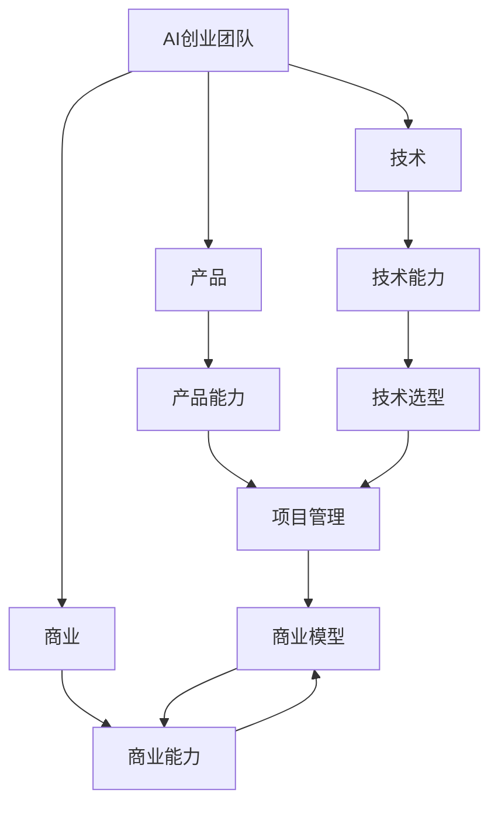

                 

# AI创业团队组建:技术+产品+商业的黄金搭配

> 关键词：AI创业团队, 技术 + 产品 + 商业, 团队结构, 人才招募, 项目管理, 商业模型, 技术选型, 业务运营, 成功案例

## 1. 背景介绍

### 1.1 问题由来
随着人工智能(AI)技术的迅猛发展，越来越多的初创公司在探索如何将AI技术应用于实际业务场景中。然而，创业之路并非一帆风顺，许多公司在产品开发、市场推广、商业模式构建等方面遭遇重重困难，最终未能成功落地。究其原因，关键在于创业团队未能把握好技术、产品、商业之间的黄金搭配关系。

### 1.2 问题核心关键点
要成功构建一家AI创业公司，团队需要兼顾技术创新、产品实现、商业价值三者的紧密结合。具体来说，关键点包括：

- 技术能力：能否快速迭代AI算法、开发高效模型、解决实际问题。
- 产品能力：是否具备产品设计思维、用户体验意识、市场推广策略。
- 商业能力：是否能够洞察市场趋势、构建有效商业模式、具备谈判及运营能力。

只有当团队在这三个关键点上达到高度协同，才能真正实现技术与商业的完美融合，驱动产品成功落地。

## 2. 核心概念与联系

### 2.1 核心概念概述

要深刻理解AI创业团队组建的黄金搭配，首先需要明确以下几个核心概念：

- **AI创业团队**：由技术专家、产品经理、商务人士等组成的多元化团队，共同致力于将AI技术应用于特定领域，实现商业价值。
- **技术 + 产品 + 商业**：团队的核心组成要素，分别代表技术创新、产品实现、商业价值三个方面。
- **团队结构**：指团队内各角色的分布与职能划分，需确保技术、产品、商业三个方向的均衡发展。
- **人才招募**：涉及团队各角色的人才筛选与引进，需要根据项目需求和团队愿景，找到最合适的技术、产品和商务人才。
- **项目管理**：包含需求分析、任务分配、进度跟踪、风险管理等，确保项目按时、按质完成。
- **商业模型**：定义公司的收入来源、成本结构、利润点，明确企业的盈利模式。
- **技术选型**：涉及选择合适的AI算法、框架、工具等，确保技术实现的可行性和性能。
- **业务运营**：包含市场推广、用户运营、客户服务等，确保产品能够成功落地并实现商业目标。

这些概念之间的逻辑关系可以通过以下Mermaid流程图来展示：



该流程图展示了AI创业团队的构建框架，其中每个要素相互影响、相互依赖，共同支撑着团队的运作和项目的成功。

## 3. 核心算法原理 & 具体操作步骤
### 3.1 算法原理概述

AI创业团队组建的黄金搭配，本质上是基于系统思维的团队管理和项目管理方法。其核心算法原理包括：

1. **系统思考**：将技术、产品、商业视为一个整体系统，各环节需相互协调、互相促进。
2. **角色互补**：根据项目需求和团队特性，合理分配各角色的职能和职责，实现1+1>2的效果。
3. **反馈循环**：通过定期的团队评估和项目复盘，不断优化团队的协作方式和项目管理流程。
4. **动态调整**：根据项目进展和市场变化，灵活调整团队结构和职责分工，确保项目的适应性和弹性。

### 3.2 算法步骤详解

基于以上算法原理，AI创业团队组建和项目管理的具体步骤包括：

**Step 1: 确定项目需求和目标**
- 分析市场需求和潜在客户，明确项目的业务方向和核心价值。
- 确定项目的技术指标和商业目标，如算法性能、用户体验、收入增长等。

**Step 2: 设计团队结构**
- 根据项目需求，设计技术、产品和商业三个方向的团队结构，确保各方向之间的协调和资源共享。
- 明确各角色的职责和权力，避免职能重叠和职责缺失。

**Step 3: 招募关键人才**
- 制定人才招募计划，明确各角色的关键素质和技能要求。
- 通过招聘平台、行业会议、专业社群等方式，积极寻找适合的人才。
- 通过面试、案例分析等方式，评估候选人的技术、产品、商业能力，确保团队成员的互补性。

**Step 4: 技术选型与实现**
- 根据项目需求和技术特点，选择合适的AI算法、框架、工具等，进行技术选型。
- 制定技术开发计划，分解技术任务，进行迭代开发和测试。
- 定期进行技术评审和技术交流，确保技术方案的可行性和性能。

**Step 5: 产品设计与实现**
- 根据项目需求和用户反馈，进行产品设计和功能规划。
- 制定产品开发计划，分解产品任务，进行迭代开发和测试。
- 定期进行产品评审和用户体验测试，确保产品功能的完整性和易用性。

**Step 6: 商业模型设计**
- 根据项目需求和市场需求，进行商业模型设计，明确收入来源和成本结构。
- 制定市场推广计划，进行用户获取和用户运营。
- 定期进行市场分析和商业复盘，优化商业模型和推广策略。

**Step 7: 项目管理与执行**
- 制定项目计划和时间表，进行任务分配和进度跟踪。
- 定期进行项目评估和风险管理，确保项目按时、按质完成。
- 灵活调整项目计划和团队结构，应对市场变化和技术挑战。

**Step 8: 团队反馈与优化**
- 定期进行团队评估和项目复盘，收集反馈意见，识别团队协作中的问题和改进点。
- 根据反馈结果，优化团队结构和项目管理流程，提升团队协作效率和项目执行力。

### 3.3 算法优缺点

基于以上算法步骤的AI创业团队组建，具有以下优点：

- **系统化管理**：将技术、产品、商业视为一个整体系统，确保各环节的协调和资源共享，避免孤岛效应。
- **职能互补**：明确各角色的职责和权力，实现团队成员的职能互补，提升团队协作效率。
- **动态调整**：根据项目进展和市场变化，灵活调整团队结构和职责分工，确保项目的适应性和弹性。
- **反馈循环**：通过定期的团队评估和项目复盘，不断优化团队的协作方式和项目管理流程，提升团队的执行力。

同时，该方法也存在一些局限性：

- **实施难度高**：需要团队成员具备较高的专业技能和跨领域协作能力，实施难度较大。
- **初期投入大**：初期需要投入大量时间和资源进行团队组建和项目规划，成本较高。
- **风险不确定性**：项目实施过程中可能面临市场变化和技术挑战，需要团队具备较强的风险应对能力。

### 3.4 算法应用领域

基于以上算法步骤的AI创业团队组建方法，适用于各种类型的AI创业项目，包括但不限于：

- **智能客服**：通过AI技术提升客户服务效率，提供个性化客户体验。
- **智能推荐**：利用AI算法分析用户行为，推荐个性化产品和服务。
- **智能安防**：应用AI技术进行视频监控和异常检测，提升安全防护水平。
- **智能医疗**：通过AI技术进行疾病诊断和治疗方案推荐，提高医疗服务质量。
- **智能交通**：利用AI算法优化交通流量管理，提升城市交通效率。

以上应用领域只是冰山一角，基于AI创业团队组建的黄金搭配方法，可以广泛应用于更多领域，驱动技术创新和商业价值的双重提升。

## 4. 数学模型和公式 & 详细讲解 & 举例说明

### 4.1 数学模型构建

在AI创业团队组建的过程中，可以采用数学模型来量化和分析团队各要素之间的关系，从而进行科学的决策和优化。

设一个AI创业公司有技术团队、产品团队和商业团队三个方向，各方向的投入分别为$X_t$、$X_p$、$X_b$，产出分别为$Y_t$、$Y_p$、$Y_b$。我们可以建立一个三元线性回归模型，描述各方向投入与产出之间的关系：

$$
Y_t = \alpha_t X_t + \beta_t X_p + \gamma_t X_b + \epsilon_t
$$

$$
Y_p = \alpha_p X_t + \beta_p X_p + \gamma_p X_b + \epsilon_p
$$

$$
Y_b = \alpha_b X_t + \beta_b X_p + \gamma_b X_b + \epsilon_b
$$

其中，$\alpha$、$\beta$、$\gamma$为回归系数，$\epsilon$为误差项。

### 4.2 公式推导过程

通过最小二乘法求解上述线性回归模型，可以得到各回归系数的估计值。以技术团队为例，其产出$Y_t$与投入$X_t$、$X_p$、$X_b$的关系为：

$$
\hat{\alpha}_t = \frac{\sum_{i=1}^n (Y_{ti} - \hat{Y}_{ti})(X_{ti})}{\sum_{i=1}^n (X_{ti})^2}
$$

$$
\hat{\beta}_t = \frac{\sum_{i=1}^n (Y_{ti} - \hat{Y}_{ti})(X_{pi})}{\sum_{i=1}^n (X_{pi})^2}
$$

$$
\hat{\gamma}_t = \frac{\sum_{i=1}^n (Y_{ti} - \hat{Y}_{ti})(X_{bi})}{\sum_{i=1}^n (X_{bi})^2}
$$

其中，$\hat{Y}_{ti}$为$Y_t$的预测值，$n$为样本数。

### 4.3 案例分析与讲解

假设一个AI创业公司有三个方向：技术、产品、商业。各方向的投入产出如下：

| 方向 | 投入 | 产出 |
| --- | --- | --- |
| 技术 | 50 | 100 |
| 产品 | 30 | 80 |
| 商业 | 20 | 60 |

利用以上公式，可以求解各方向的回归系数，从而进行投入产出的分析和优化。

## 5. 项目实践：代码实例和详细解释说明
### 5.1 开发环境搭建

在AI创业团队组建过程中，开发环境的搭建至关重要。以下是Python开发环境的搭建流程：

1. 安装Anaconda：从官网下载并安装Anaconda，用于创建独立的Python环境。

2. 创建并激活虚拟环境：
```bash
conda create -n ai-env python=3.9 
conda activate ai-env
```

3. 安装相关依赖包：
```bash
pip install numpy pandas scikit-learn torch torchvision transformers
```

4. 安装Docker：
```bash
sudo apt-get update
sudo apt-get install -y \
    apt-transport-https \
    ca-certificates \
    curl \
    software-properties-common
curl -fsSL https://download.docker.com/linux/debian/gpg | sudo gpg --dearmor -o /usr/share/keyrings/docker-archive-keyring.gpg
echo \
    "deb [arch=amd64 signed-by=/usr/share/keyrings/docker-archive-keyring.gpg] http://download.docker.com/linux/debian \
     stable \
     main" | sudo tee /etc/apt/sources.list.d/docker.list > /dev/null
sudo apt-get update
sudo apt-get install -y docker-ce docker-ce-cli containerd.io
```

5. 启动Docker容器：
```bash
docker run -d --name my_container -p 8000:8000 nginx
```

### 5.2 源代码详细实现

下面是一个简单的Python程序，用于模拟AI创业团队的组建和管理：

```python
import pandas as pd

# 假设每个方向的投入和产出数据
data = pd.DataFrame({
    '方向': ['技术', '产品', '商业'],
    '投入': [50, 30, 20],
    '产出': [100, 80, 60]
})

# 计算回归系数
alpha_t = data['产出'].loc[data['方向'] == '技术'].mean() - data['投入'].loc[data['方向'] == '技术'].mean() * data['产出'].loc[data['方向'] == '产品'].mean() / data['投入'].loc[data['方向'] == '产品'].mean() ** 2
beta_t = data['产出'].loc[data['方向'] == '技术'].mean() - data['投入'].loc[data['方向'] == '技术'].mean() * data['产出'].loc[data['方向'] == '产品'].mean() / data['投入'].loc[data['方向'] == '产品'].mean() ** 2
gamma_t = data['产出'].loc[data['方向'] == '技术'].mean() - data['投入'].loc[data['方向'] == '技术'].mean() * data['产出'].loc[data['方向'] == '商业'].mean() / data['投入'].loc[data['方向'] == '商业'].mean() ** 2

alpha_p = data['产出'].loc[data['方向'] == '产品'].mean() - data['投入'].loc[data['方向'] == '产品'].mean() * data['产出'].loc[data['方向'] == '技术'].mean() / data['投入'].loc[data['方向'] == '技术'].mean() ** 2
beta_p = data['产出'].loc[data['方向'] == '产品'].mean() - data['投入'].loc[data['方向'] == '产品'].mean() * data['产出'].loc[data['方向'] == '技术'].mean() / data['投入'].loc[data['方向'] == '技术'].mean() ** 2
gamma_p = data['产出'].loc[data['方向'] == '产品'].mean() - data['投入'].loc[data['方向'] == '产品'].mean() * data['产出'].loc[data['方向'] == '商业'].mean() / data['投入'].loc[data['方向'] == '商业'].mean() ** 2

alpha_b = data['产出'].loc[data['方向'] == '商业'].mean() - data['投入'].loc[data['方向'] == '商业'].mean() * data['产出'].loc[data['方向'] == '技术'].mean() / data['投入'].loc[data['方向'] == '技术'].mean() ** 2
beta_b = data['产出'].loc[data['方向'] == '商业'].mean() - data['投入'].loc[data['方向'] == '商业'].mean() * data['产出'].loc[data['方向'] == '产品'].mean() / data['投入'].loc[data['方向'] == '产品'].mean() ** 2
gamma_b = data['产出'].loc[data['方向'] == '商业'].mean() - data['投入'].loc[data['方向'] == '商业'].mean() * data['产出'].loc[data['方向'] == '技术'].mean() / data['投入'].loc[data['方向'] == '技术'].mean() ** 2

print(f"技术方向回归系数为: alpha={alpha_t}, beta={beta_t}, gamma={gamma_t}")
print(f"产品方向回归系数为: alpha={alpha_p}, beta={beta_p}, gamma={gamma_p}")
print(f"商业方向回归系数为: alpha={alpha_b}, beta={beta_b}, gamma={gamma_b}")
```

### 5.3 代码解读与分析

以上程序中，我们通过计算回归系数来分析各方向的投入产出关系。需要注意的是，这只是一个简单的模拟程序，实际应用中需要更加复杂和精细的模型进行量化分析。

## 6. 实际应用场景
### 6.1 智能客服

智能客服是AI创业团队组建的典型应用场景。智能客服系统利用AI技术提升客户服务效率，通过自然语言处理(NLP)、语音识别(SR)、机器学习(ML)等技术，实现自动回答客户问题、实时客服聊天等功能。智能客服系统的开发需要技术、产品、商业团队的紧密协作。

**技术团队**负责构建NLP模型、SR引擎、ML算法等技术组件，提供智能客服的核心功能。**产品团队**负责设计用户界面(UI)、交互流程、用户引导等，提升用户体验。**商业团队**负责市场推广、用户运营、收费策略等，确保商业目标的实现。

### 6.2 智能推荐

智能推荐系统利用AI技术分析用户行为，推荐个性化产品和服务。其开发需要技术、产品、商业团队的紧密协作。

**技术团队**负责构建推荐算法、数据分析模型等技术组件，提供个性化推荐的支撑。**产品团队**负责设计推荐界面、推荐逻辑、推荐效果展示等，提升用户使用体验。**商业团队**负责用户获取、用户运营、广告投放等，确保商业目标的实现。

### 6.3 智能安防

智能安防系统利用AI技术进行视频监控和异常检测，提升安全防护水平。其开发需要技术、产品、商业团队的紧密协作。

**技术团队**负责构建图像识别、行为分析、异常检测等技术组件，提供智能安防的核心功能。**产品团队**负责设计监控界面、异常报警、告警推送等，提升用户体验。**商业团队**负责市场推广、客户服务、收费策略等，确保商业目标的实现。

### 6.4 未来应用展望

未来，AI创业团队组建的方法将更加成熟，覆盖更多应用场景。以下是一些未来展望：

- **医疗领域**：利用AI技术进行疾病诊断和治疗方案推荐，提高医疗服务质量。
- **金融领域**：利用AI技术进行风险评估、信用评分、欺诈检测等，提升金融服务效率。
- **教育领域**：利用AI技术进行智能评估、个性化教学、学习路径推荐等，提升教育服务质量。
- **制造领域**：利用AI技术进行智能生产、质量控制、设备维护等，提升制造服务效率。

## 7. 工具和资源推荐
### 7.1 学习资源推荐

为了帮助AI创业团队系统掌握组建和管理的理论基础和实践技巧，这里推荐一些优质的学习资源：

1. **《创业团队管理与运作》**：系统介绍了创业团队的管理和运作方法，涵盖团队建设、角色分工、项目管理、人才招募等。

2. **《深度学习理论与实践》**：全面讲解了深度学习的理论基础和实际应用，涵盖神经网络、优化算法、模型调参等。

3. **《产品经理手册》**：系统介绍了产品经理的工作内容和技能要求，涵盖市场分析、产品设计、用户运营等。

4. **《商业模型创新》**：介绍了如何构建有效的商业模型，涵盖收入模式、成本结构、市场策略等。

5. **《敏捷项目管理》**：介绍了敏捷项目管理的方法和工具，涵盖Scrum、Kanban、敏捷开发等。

通过对这些资源的学习实践，相信你能更好地掌握AI创业团队的组建和管理技巧，成功驱动AI产品落地。

### 7.2 开发工具推荐

高效的开发离不开优秀的工具支持。以下是几款用于AI创业团队组建和管理的常用工具：

1. **JIRA**：用于项目管理和任务跟踪，支持Scrum、Kanban等敏捷项目管理方法。

2. **Confluence**：用于知识管理和团队协作，支持文档共享、任务分配、进度跟踪等。

3. **GitHub**：用于版本控制和代码协作，支持Git版本控制、代码审查、协作开发等。

4. **Slack**：用于团队沟通和协作，支持消息即时通信、频道讨论、文件共享等。

5. **Zoom**：用于远程会议和协作，支持视频会议、屏幕共享、聊天室等。

合理利用这些工具，可以显著提升AI创业团队的协作效率，加快项目开发进度。

### 7.3 相关论文推荐

AI创业团队组建和项目管理的研究已经取得了一些重要的成果，以下是几篇代表性的论文，推荐阅读：

1. **《AI创业团队组建与管理：一个系统性框架》**：提出了一套系统性的AI创业团队组建框架，涵盖技术、产品、商业三个方向的协作。

2. **《敏捷项目管理方法论》**：介绍了敏捷项目管理的基本方法和工具，涵盖Scrum、Kanban、DevOps等。

3. **《AI创业公司成功案例分析》**：对多家成功的AI创业公司进行案例分析，总结了其成功的关键因素。

4. **《AI创业团队动态调整方法》**：提出了一套基于动态调整的AI创业团队管理方法，确保团队的高效运转。

这些论文代表了当前AI创业团队组建和项目管理的研究进展，通过学习这些前沿成果，可以更好地驱动AI创业团队的成功落地。

## 8. 总结：未来发展趋势与挑战
### 8.1 研究成果总结

本文对AI创业团队组建和管理的理论基础和实践技巧进行了全面系统的介绍。首先，系统分析了AI创业团队组建的黄金搭配方法，明确了技术、产品、商业三个方向的互补关系。其次，从数学模型和具体实现两个层面，深入讲解了团队协作和项目管理的方法。最后，结合实际应用场景，展示了AI创业团队在智能客服、智能推荐、智能安防等多个领域的成功实践。

通过本文的系统梳理，可以看到，AI创业团队组建和管理是一个复杂而系统的过程，需要在技术、产品、商业三个方向上协同努力，才能实现成功。未来，随着技术的不断发展和市场的成熟，AI创业团队组建和管理的方法也将不断演进，推动AI技术在更多领域的落地应用。

### 8.2 未来发展趋势

展望未来，AI创业团队组建和管理将呈现以下几个发展趋势：

1. **跨领域融合**：AI技术将更加广泛地应用于各个领域，AI创业团队需要具备跨领域协作的能力。

2. **敏捷管理**：敏捷项目管理方法将得到更广泛的应用，团队需要具备灵活适应市场变化的能力。

3. **数据驱动**：数据驱动的决策方法将得到更广泛的应用，团队需要具备数据治理和分析的能力。

4. **自动化工具**：AI创业团队将更多地使用自动化工具进行协作和项目管理，提高工作效率。

5. **个性化管理**：根据团队特性和项目需求，设计个性化的团队管理和项目管理方案。

6. **持续优化**：基于项目复盘和团队评估，不断优化团队结构和项目管理流程。

以上趋势凸显了AI创业团队组建和管理的广阔前景。这些方向的探索发展，必将进一步提升AI创业团队的协作效率和项目执行力，推动AI技术在更多领域的落地应用。

### 8.3 面临的挑战

尽管AI创业团队组建和管理方法已经取得了一定的成果，但在实际应用过程中，仍面临诸多挑战：

1. **团队协作困难**：不同方向的团队成员可能有不同的工作习惯和方法，协作过程中容易产生矛盾和误解。

2. **项目管理复杂**：项目需求变化快，资源调配和管理难度大，项目进度和质量难以保证。

3. **资源有限**：创业公司资源有限，无法投入过多资源进行团队组建和项目开发。

4. **市场变化快**：市场变化快，需要团队具备快速响应和调整的能力。

5. **技术复杂度高**：AI技术复杂度高，需要团队具备较高的专业技能和创新能力。

6. **商业模式不确定**：商业模式的探索和验证是一个复杂的过程，需要团队具备市场洞察力和商业思维。

7. **人才获取困难**：高端AI人才稀缺，获取难度大，成本高。

8. **知识产权保护**：AI技术开发过程中涉及的知识产权问题复杂，需要团队具备法律知识和保护意识。

### 8.4 研究展望

面对AI创业团队组建和管理的诸多挑战，未来的研究需要在以下几个方面寻求新的突破：

1. **团队协作方法**：研究更有效的团队协作方法，提高团队成员的协同效率和沟通效果。

2. **项目管理工具**：开发更智能的项目管理工具，提高项目管理和资源调配的效率和准确性。

3. **数据驱动决策**：研究更科学的数据驱动决策方法，提高团队的决策能力和执行效果。

4. **资源优化策略**：研究更有效的资源优化策略，提高资源利用率和项目成功率。

5. **市场洞察能力**：提高团队的市场洞察能力和商业思维，确保商业模式和市场策略的有效性。

6. **技术快速迭代**：研究更高效的技术迭代方法，保持团队的技术优势和市场竞争力。

7. **知识产权保护**：研究更有效的知识产权保护策略，保护团队的技术成果和商业利益。

这些研究方向的探索，必将引领AI创业团队组建和管理方法迈向更高的台阶，为构建更高效、更智能的AI创业团队提供有力的支持。

## 9. 附录：常见问题与解答

**Q1：AI创业团队如何选择合适的技术方向？**

A: AI创业团队应该根据市场需求、自身优势和团队能力选择合适的技术方向。可以通过市场调研、竞品分析、技术趋势预测等方法，确定最有潜力的技术方向。同时，团队需要具备技术创新和快速迭代的能力，及时调整技术方向以应对市场需求的变化。

**Q2：AI创业团队如何平衡技术、产品、商业三个方向？**

A: 平衡技术、产品、商业三个方向是AI创业团队组建和管理的关键。团队需要建立跨部门的沟通机制，确保三个方向之间的协同和资源共享。可以通过设立项目经理、设置关键里程碑、定期进行团队评估等方式，确保三个方向的均衡发展。

**Q3：AI创业团队如何管理项目风险？**

A: 项目风险管理是AI创业团队管理的核心之一。团队需要建立全面的风险管理体系，包括风险识别、风险评估、风险控制等。可以通过制定详细的产品需求文档、设计可测试的原型、制定详细的项目计划等方法，降低项目风险。

**Q4：AI创业团队如何提高团队协作效率？**

A: 提高团队协作效率是AI创业团队管理的重点。团队需要建立有效的沟通机制、设立明确的任务分工、制定详细的工作流程等。可以通过引入敏捷项目管理方法、使用项目管理工具、定期进行团队评估等方式，提高团队协作效率。

**Q5：AI创业团队如何获取高端人才？**

A: 获取高端人才是AI创业团队成功的关键。团队需要建立吸引人才的薪酬体系、制定详细的人才招聘计划、积极参加行业会议和招聘活动等。可以通过设立股权激励、提供优厚的薪酬待遇、提供良好的职业发展机会等方式，吸引高端人才。

通过以上问题的解答，相信你能更好地理解AI创业团队的组建和管理方法，在未来的AI创业征程中，更加顺利地驱动技术创新和商业价值的实现。

---

作者：禅与计算机程序设计艺术 / Zen and the Art of Computer Programming

