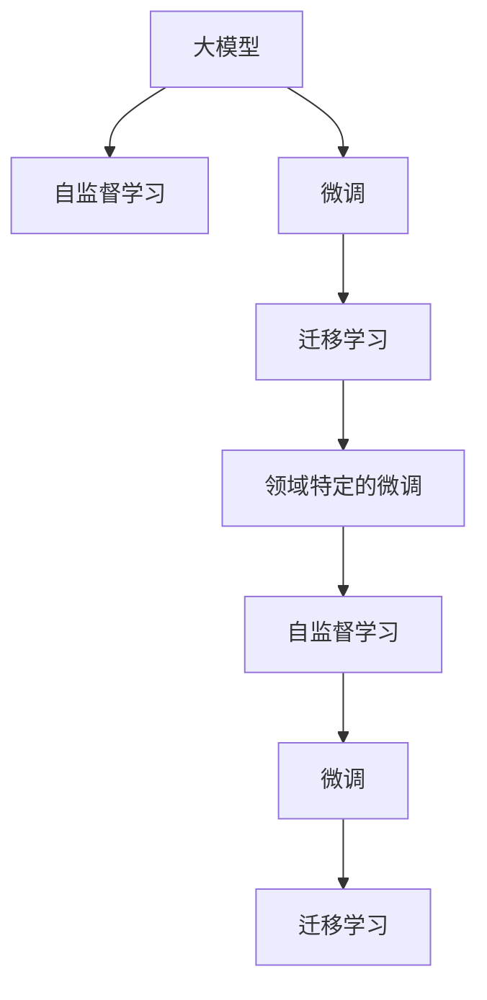
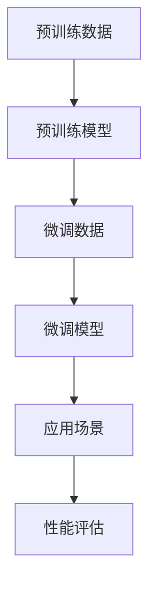

                 

# AI创业新赛道：大模型驱动的行业智能化变革

## 1. 背景介绍

### 1.1 问题由来
随着人工智能技术的飞速发展，深度学习和机器学习在各个领域的应用越来越广泛。特别是大模型的出现，让机器能够通过大规模无标签数据的预训练学习到更丰富的知识，并在小规模有标签数据上进行微调，显著提升下游任务的表现。例如，GPT、BERT等预训练模型在自然语言处理（NLP）、计算机视觉、语音识别等领域取得了突破性进展。

然而，这些大模型的应用也面临着诸多挑战：如高昂的计算成本、庞大的模型参数量、以及数据隐私和安全等问题。此外，由于不同行业、不同领域的具体需求和应用场景不同，现有的大模型往往无法直接应用于特定行业，需要进行行业化的微调或定制化训练。

因此，如何基于大模型构建可扩展、可定制的AI创业平台，是大模型时代亟待解决的问题。本文将从大模型的核心概念、微调技术、实际应用场景以及未来发展趋势等方面，详细探讨大模型驱动的行业智能化变革。

## 2. 核心概念与联系

### 2.1 核心概念概述

在讨论大模型驱动的行业智能化变革之前，我们先明确一些核心概念：

- **大模型（Large Models）**：指基于大规模无标签数据预训练的深度学习模型，如GPT-3、BERT、T5等，具备强大的通用知识和泛化能力。
- **微调（Fine-Tuning）**：指在大模型基础上，使用有标签数据进行微调优化，使其适应特定任务的性能提升。
- **迁移学习（Transfer Learning）**：利用大模型在其他领域学到的知识，迁移到新的领域，降低对新数据的需求，提高模型泛化能力。
- **自监督学习（Supervised Learning）**：在大模型预训练阶段，通过无标签数据进行自监督学习，学习到通用的语言表示。
- **领域特定的微调（Domain-specific Fine-Tuning）**：指在大模型的基础上，针对特定领域的数据进行微调，以适应特定领域的需求。

这些概念通过以下Mermaid流程图展示了它们之间的关系：



### 2.2 核心概念原理和架构的 Mermaid 流程图

为了更好地理解大模型和微调的原理，下面我们用Mermaid流程图来展示其核心概念的架构：



- **A. 预训练数据**：是指大规模的无标签数据，通常来自互联网、书籍、新闻、公开文本等。
- **B. 预训练模型**：是指在大规模预训练数据上训练得到的模型，如GPT-3、BERT等。
- **C. 微调数据**：是指针对特定任务收集的有标签数据，用于对预训练模型进行微调优化。
- **D. 微调模型**：是指经过微调优化后的模型，能够更好地适应特定任务。
- **E. 应用场景**：是指微调模型在实际应用中的场景，如自然语言处理、计算机视觉、语音识别等。
- **F. 性能评估**：是指对微调模型在应用场景中的性能进行评估，确保其满足实际需求。

## 3. 核心算法原理 & 具体操作步骤

### 3.1 算法原理概述

基于大模型的微调算法通常包括以下几个步骤：

1. **预训练模型加载**：选择合适的大模型作为基础，如GPT-3、BERT等。
2. **数据准备**：准备针对特定任务的标注数据集，划分为训练集、验证集和测试集。
3. **模型初始化**：将预训练模型参数加载到目标模型中。
4. **微调优化**：在微调数据集上，使用优化算法（如AdamW、SGD等）更新模型参数，使得模型输出更接近真实标签。
5. **性能评估**：在测试集上评估微调后的模型性能，对比微调前后的效果。

### 3.2 算法步骤详解

**Step 1: 准备预训练模型和数据集**

1. **模型选择**：根据任务需求选择合适的预训练模型，如GPT-3、BERT等。
2. **数据准备**：准备标注数据集，划分为训练集、验证集和测试集。

**Step 2: 添加任务适配层**

1. **任务适配层设计**：根据任务类型设计合适的输出层和损失函数，如分类任务使用线性分类器和交叉熵损失，生成任务使用语言模型解码器。
2. **模型初始化**：将预训练模型参数加载到目标模型中。

**Step 3: 设置微调超参数**

1. **优化器选择**：选择适合的优化算法，如AdamW、SGD等，设置学习率、批大小等超参数。
2. **正则化技术**：应用L2正则、Dropout等正则化技术，防止过拟合。
3. **学习率调整**：通常较小学习率用于微调，避免破坏预训练权重。

**Step 4: 执行梯度训练**

1. **批处理训练**：将训练集数据分批次输入模型，前向传播计算损失函数。
2. **反向传播**：计算参数梯度，根据优化算法更新模型参数。
3. **验证集评估**：周期性在验证集上评估模型性能，触发Early Stopping。
4. **迭代优化**：重复上述步骤，直至模型收敛。

**Step 5: 测试和部署**

1. **测试集评估**：在测试集上评估微调后的模型性能。
2. **模型部署**：将微调后的模型部署到实际应用系统中。

### 3.3 算法优缺点

大模型驱动的行业智能化变革具有以下优点：

1. **高泛化能力**：通过在大规模无标签数据上进行预训练，学习到通用知识，适应性强。
2. **快速迭代**：在特定任务上进行微调，可以迅速提升模型性能。
3. **跨领域应用**：迁移学习可将其知识迁移到其他领域，减少对新数据的需求。

同时，也存在以下缺点：

1. **高计算成本**：预训练和微调需要大量的计算资源。
2. **数据隐私问题**：处理大规模数据时，数据隐私和安全问题不容忽视。
3. **模型可解释性不足**：大模型通常为黑盒系统，缺乏可解释性。
4. **依赖标注数据**：微调需要标注数据，标注成本高。

## 4. 数学模型和公式 & 详细讲解 & 举例说明

### 4.1 数学模型构建

以二分类任务为例，我们假设模型在输入$x$上的输出为$\hat{y}$，表示样本属于正类的概率，真实标签$y$为1或0。定义损失函数为交叉熵损失函数：

$$
\ell(M_{\theta}(x),y) = -y\log \hat{y} - (1-y)\log(1-\hat{y})
$$

经验风险函数为：

$$
\mathcal{L}(\theta) = \frac{1}{N}\sum_{i=1}^N \ell(M_{\theta}(x_i),y_i)
$$

### 4.2 公式推导过程

我们以二分类任务为例，推导交叉熵损失函数及其梯度的计算公式：

$$
\ell(M_{\theta}(x),y) = -y\log \hat{y} - (1-y)\log(1-\hat{y})
$$

通过链式法则，损失函数对参数$\theta_k$的梯度为：

$$
\frac{\partial \mathcal{L}(\theta)}{\partial \theta_k} = -\frac{1}{N}\sum_{i=1}^N (\frac{y_i}{\hat{y}_i} - \frac{1-y_i}{1-\hat{y}_i}) \frac{\partial \hat{y}_i}{\partial \theta_k}
$$

其中$\frac{\partial \hat{y}_i}{\partial \theta_k}$可进一步递归展开，利用自动微分技术完成计算。

### 4.3 案例分析与讲解

以BERT模型为例，其微调过程大致如下：

1. **数据准备**：准备分类任务的标注数据集，划分为训练集、验证集和测试集。
2. **模型初始化**：将BERT预训练模型加载到目标模型中。
3. **任务适配层设计**：在BERT顶层添加线性分类器和交叉熵损失函数。
4. **超参数设置**：设置优化器为AdamW，学习率为2e-5，批大小为16，正则化系数为0.001。
5. **梯度训练**：在训练集上进行梯度训练，周期性在验证集上评估模型性能。
6. **测试集评估**：在测试集上评估微调后的模型性能。

## 5. 项目实践：代码实例和详细解释说明

### 5.1 开发环境搭建

要实现大模型的微调，首先需要准备好开发环境。以下是在Python环境中搭建PyTorch环境的步骤：

1. **安装Anaconda**：从官网下载并安装Anaconda，用于创建独立的Python环境。
2. **创建虚拟环境**：
```bash
conda create -n pytorch-env python=3.8 
conda activate pytorch-env
```

3. **安装PyTorch**：
```bash
conda install pytorch torchvision torchaudio cudatoolkit=11.1 -c pytorch -c conda-forge
```

4. **安装Transformers库**：
```bash
pip install transformers
```

5. **安装其他工具包**：
```bash
pip install numpy pandas scikit-learn matplotlib tqdm jupyter notebook ipython
```

### 5.2 源代码详细实现

以下是一个简单的例子，展示如何使用Transformers库对BERT模型进行微调：

```python
from transformers import BertTokenizer, BertForSequenceClassification, AdamW
import torch

# 定义模型
model = BertForSequenceClassification.from_pretrained('bert-base-uncased', num_labels=2)

# 定义tokenizer
tokenizer = BertTokenizer.from_pretrained('bert-base-uncased')

# 定义训练函数
def train_epoch(model, tokenizer, train_dataset, optimizer):
    model.train()
    epoch_loss = 0
    for batch in train_dataset:
        input_ids = tokenizer(batch['text'], return_tensors='pt')['input_ids']
        attention_mask = tokenizer(batch['text'], return_tensors='pt')['attention_mask']
        labels = batch['label']
        outputs = model(input_ids, attention_mask=attention_mask, labels=labels)
        loss = outputs.loss
        epoch_loss += loss.item()
        loss.backward()
        optimizer.step()
    return epoch_loss / len(train_dataset)

# 定义评估函数
def evaluate(model, tokenizer, dev_dataset, optimizer):
    model.eval()
    epoch_loss = 0
    preds, labels = [], []
    with torch.no_grad():
        for batch in dev_dataset:
            input_ids = tokenizer(batch['text'], return_tensors='pt')['input_ids']
            attention_mask = tokenizer(batch['text'], return_tensors='pt')['attention_mask']
            batch_labels = batch['label']
            outputs = model(input_ids, attention_mask=attention_mask)
            batch_preds = outputs.logits.argmax(dim=1).to('cpu').tolist()
            batch_labels = batch_labels.to('cpu').tolist()
            preds.extend(batch_preds)
            labels.extend(batch_labels)
    return classification_report(labels, preds)

# 准备数据集
train_dataset = Dataset()
dev_dataset = Dataset()
test_dataset = Dataset()

# 定义训练参数
optimizer = AdamW(model.parameters(), lr=2e-5)
epochs = 5
batch_size = 16

# 开始训练
for epoch in range(epochs):
    loss = train_epoch(model, tokenizer, train_dataset, optimizer)
    print(f"Epoch {epoch+1}, train loss: {loss:.3f}")
    
    print(f"Epoch {epoch+1}, dev results:")
    evaluate(model, tokenizer, dev_dataset, optimizer)
    
print("Test results:")
evaluate(model, tokenizer, test_dataset, optimizer)
```

### 5.3 代码解读与分析

在这段代码中，我们首先定义了BERT模型和tokenizer，然后定义了训练函数`train_epoch`和评估函数`evaluate`，用于微调的迭代和结果评估。接下来，我们创建了训练集和评估集，并定义了训练参数如学习率、迭代次数、批大小等。最后，我们通过`train_epoch`函数进行训练，并在`evaluate`函数上评估模型性能。

## 6. 实际应用场景

### 6.1 医疗健康

在大规模健康数据上预训练的BERT模型，可以通过微调适应特定医疗任务。例如，利用微调后的模型，可以自动回答医疗咨询，进行疾病诊断，生成医疗报告等。

### 6.2 金融投资

金融领域的数据复杂多样，且需要实时处理。通过在大规模金融数据上进行预训练的模型，经过微调后可以应用于股市预测、风险评估、客户咨询等。

### 6.3 教育培训

在教育领域，微调模型可以自动评估学生作业，提供个性化学习建议，进行智能辅导等。此外，还可以通过微调模型自动生成教学资源，辅助教学工作。

### 6.4 智能客服

智能客服系统可以采用微调后的模型，自动解答用户咨询，提供24/7服务，显著提升客户体验和满意度。

### 6.5 智能交通

智能交通系统可以通过微调模型，实时分析交通数据，预测交通流量，优化交通信号，提升交通效率。

## 7. 工具和资源推荐

### 7.1 学习资源推荐

1. **《深度学习》课程**：由斯坦福大学开设的深度学习课程，系统介绍深度学习原理和应用。
2. **HuggingFace官方文档**：详细介绍了Transformers库的使用方法和常见问题。
3. **NLP公开数据集**：如GLUE、CLUE等，提供大量公开的NLP数据集，便于模型微调研究。

### 7.2 开发工具推荐

1. **PyTorch**：灵活动态的计算图，支持动态图，适合快速迭代研究。
2. **TensorFlow**：生产部署方便，适合大规模工程应用。
3. **Transformers库**：提供丰富的预训练模型，支持多种深度学习框架。
4. **Jupyter Notebook**：交互式开发环境，方便调试和展示代码。

### 7.3 相关论文推荐

1. **《深度学习》书籍**：由Ian Goodfellow等人撰写，详细介绍了深度学习的基本概念和方法。
2. **《大模型时代》论文**：讨论了大模型在NLP等领域的广泛应用和前景。
3. **《迁移学习》论文**：介绍了迁移学习的基本原理和方法。

## 8. 总结：未来发展趋势与挑战

### 8.1 研究成果总结

大模型驱动的行业智能化变革，将显著提升各领域的智能化水平，带来革命性变化。通过预训练-微调方法，大模型可以在特定任务上获得显著提升，显著降低数据需求，减少人工成本。

### 8.2 未来发展趋势

1. **计算资源优化**：随着算力成本的下降，预训练和微调过程将更加高效。
2. **模型参数优化**：开发更高效的模型结构，减少参数量，提高推理速度。
3. **跨领域迁移**：提高模型在不同领域间的迁移能力，增强通用性。
4. **无监督学习和少样本学习**：减少对标注数据的依赖，提高模型泛化能力。
5. **多模态融合**：将视觉、语音等多模态数据与文本数据结合，提升模型的感知能力。

### 8.3 面临的挑战

1. **高昂的计算成本**：预训练和微调过程需要大量的计算资源，成本较高。
2. **数据隐私和安全问题**：处理大规模数据时，数据隐私和安全问题不容忽视。
3. **模型可解释性不足**：大模型通常为黑盒系统，缺乏可解释性。
4. **依赖标注数据**：微调需要标注数据，标注成本较高。

### 8.4 研究展望

未来的研究应重点解决以下几个问题：

1. **降低计算成本**：开发更高效的计算方法，优化模型结构，降低计算成本。
2. **增强模型可解释性**：开发可解释性更强的模型，便于应用场景中的调试和优化。
3. **提升跨领域迁移能力**：提高模型在不同领域间的迁移能力，增强通用性。
4. **发展多模态学习**：将视觉、语音等多模态数据与文本数据结合，提升模型的感知能力。

总之，大模型驱动的行业智能化变革，具有广阔的应用前景和重要的研究价值。通过不断探索和实践，我们可以构建更智能、更高效、更安全的AI应用系统，推动各行业的数字化转型。

## 9. 附录：常见问题与解答

**Q1: 大模型微调需要多少数据？**

A: 大模型微调对标注数据的需求较低，通常几千到几万条数据就足以获得较好的效果。具体数据量取决于任务的复杂度和数据的多样性。

**Q2: 大模型微调可以处理哪些任务？**

A: 大模型微调可以应用于各种NLP任务，如文本分类、命名实体识别、情感分析、机器翻译、问答系统等。根据具体任务的需求，可以设计合适的任务适配层，进行微调优化。

**Q3: 大模型微调需要哪些计算资源？**

A: 大模型微调需要高性能GPU或TPU设备，通常还需要大内存和高速存储。此外，还需要配置合适的网络环境，保证数据传输效率。

**Q4: 大模型微调有哪些应用场景？**

A: 大模型微调可以应用于医疗健康、金融投资、教育培训、智能客服、智能交通等多个领域。通过微调，可以构建高效的智能应用系统，提升各行业的智能化水平。

**Q5: 大模型微调如何优化？**

A: 可以通过优化超参数、数据增强、正则化技术等方法，提高微调效果。同时，可以采用参数高效微调、自适应学习率等技术，减少计算资源消耗。

**Q6: 大模型微调有哪些挑战？**

A: 大模型微调面临计算成本高、数据隐私和安全问题、模型可解释性不足等挑战。未来需要探索更高效的计算方法，提高模型的跨领域迁移能力和可解释性。

综上所述，大模型驱动的行业智能化变革，是大数据、深度学习等前沿技术的集大成者，具有广阔的应用前景和重要的研究价值。通过不断探索和实践，我们可以构建更智能、更高效、更安全的AI应用系统，推动各行业的数字化转型，引领未来的智能化发展。

