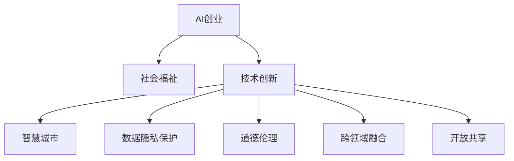

                 

# AI创业码头愿景：AI改善人类生活

> 关键词：AI创业，人工智能，社会福祉，技术创新，智慧城市

## 1. 背景介绍

### 1.1 问题由来

在当今信息爆炸、技术飞速发展的时代，人工智能（AI）技术已经深入到社会生活的方方面面，极大地改变了我们的生活方式和工作方式。然而，尽管AI技术带来了诸多便利，其负面影响也逐渐显现：

- **数据隐私问题**：AI系统的训练依赖大量数据，而这些数据可能涉及个人隐私。数据泄露和滥用问题，给用户带来不可估量的损失。
- **就业市场冲击**：AI自动化取代了大量传统工作岗位，导致失业率上升，引发社会不满。
- **道德伦理问题**：AI决策过程缺乏透明度和可解释性，可能导致误判、歧视等伦理问题。
- **信息孤岛**：不同领域的AI系统往往独立运行，缺乏协同和互联互通，降低了整体效益。

这些问题呼唤我们重新审视AI技术的发展方向，探索如何将AI与人类福祉相结合，构建一个更和谐、更高效的未来社会。为此，我们提出了“AI创业码头”愿景，旨在通过技术创新，为社会带来更广泛、更深层次的福祉改善。

### 1.2 问题核心关键点

“AI创业码头”愿景的核心关键点在于：

- **以人为本**：将AI技术的应用目标设定为提升人类生活质量和社会福祉，而非单纯追求技术进步。
- **跨领域融合**：通过AI技术与各个行业领域的深度融合，创造协同效应，提升整体社会效益。
- **开放共享**：建立一个开放共享的AI创业生态，使更多人能参与到AI技术的发展和应用中。
- **伦理合规**：在技术开发和应用过程中，始终遵循伦理原则和法律法规，确保AI技术的公平、透明、安全。

这些关键点相互关联，共同构成了“AI创业码头”愿景的核心框架。

## 2. 核心概念与联系

### 2.1 核心概念概述

为更好地理解“AI创业码头”愿景，本节将介绍几个密切相关的核心概念：

- **AI创业**：指基于AI技术，构建创新型商业模式，创造社会价值的过程。
- **社会福祉**：涉及健康、教育、就业、住房等人类生活质量的各个方面，旨在通过技术创新提升这些领域的发展水平。
- **技术创新**：指在AI技术研发和应用中不断探索新的方法和理念，推动技术进步。
- **智慧城市**：利用AI技术，提升城市管理和服务水平，建设安全、高效、宜居的城市环境。
- **数据隐私保护**：在AI系统的设计和使用中，严格遵循数据隐私保护原则，保障用户数据安全。
- **道德伦理**：在AI系统的开发和应用中，遵循道德伦理原则，确保技术应用的公平性、透明性和安全性。
- **跨领域融合**：通过AI技术，促进不同行业领域的协同创新，实现资源优化和效益最大化。
- **开放共享**：建立一个开放的AI创业生态，促进技术交流、合作和创新，推动社会共同进步。

这些核心概念之间的逻辑关系可以通过以下Mermaid流程图来展示：



这个流程图展示了AI创业、技术创新和社会福祉之间的内在联系，以及如何通过技术创新实现智慧城市建设、数据隐私保护、道德伦理遵循和跨领域融合，最终推动开放共享的AI创业生态。

## 3. 核心算法原理 & 具体操作步骤
### 3.1 算法原理概述

“AI创业码头”愿景的核心算法原理可以概括为：通过AI技术创新，结合跨领域融合和社会福祉目标，实现智慧城市建设、数据隐私保护、道德伦理遵循，推动开放共享的AI创业生态。

具体而言，算法的核心步骤如下：

1. **需求分析**：从社会福祉的角度出发，确定AI技术应用的优先领域和目标。
2. **数据收集与处理**：收集相关领域的数据，进行清洗和预处理，为AI模型训练提供数据支持。
3. **模型训练与优化**：选择合适的AI模型，进行训练和优化，提升模型的预测准确性和泛化能力。
4. **应用部署与评估**：将训练好的模型应用于实际场景，进行效果评估和反馈调整。
5. **迭代改进**：根据实际应用效果和反馈，不断迭代改进AI模型和技术方案，提升整体社会效益。

### 3.2 算法步骤详解

以智慧城市建设为例，具体算法步骤如下：

1. **需求分析**：通过调研，确定智慧城市建设中需要解决的关键问题，如交通拥堵、环境污染、公共安全等。
2. **数据收集与处理**：收集相关领域的各类数据，包括交通流量、环境监测、公共安全等，进行清洗和预处理。
3. **模型训练与优化**：选择合适的AI模型（如深度学习、强化学习等），在处理好的数据上进行训练和优化。例如，使用深度学习模型预测交通流量，使用强化学习模型优化交通信号灯。
4. **应用部署与评估**：将训练好的模型应用于智慧城市建设的各个环节，如交通管理、环境监测、公共安全等，进行效果评估和反馈调整。
5. **迭代改进**：根据实际应用效果和反馈，不断迭代改进AI模型和技术方案，提升整体智慧城市建设水平。

### 3.3 算法优缺点

“AI创业码头”愿景的算法具有以下优点：

- **高效性**：通过AI技术创新，可以快速实现跨领域融合和社会福祉目标，提升整体社会效益。
- **灵活性**：模型训练和优化可以根据实际需求进行调整，适应不同领域的复杂性和多样性。
- **可扩展性**：算法的开放共享特性，可以吸引更多开发者和合作伙伴参与，共同推动技术进步和应用落地。

同时，该算法也存在一定的局限性：

- **资源需求高**：AI模型的训练和优化需要大量数据和计算资源，对硬件设备要求较高。
- **数据隐私风险**：数据收集和处理过程中，存在数据隐私泄露和滥用的风险，需严格遵循数据隐私保护原则。
- **伦理道德挑战**：AI系统的决策过程缺乏透明度和可解释性，可能导致伦理道德问题，需持续改进模型和技术方案。
- **技术门槛高**：算法涉及多个领域的深度融合和创新，技术复杂度高，需具备跨学科的知识和技能。

尽管存在这些局限性，但“AI创业码头”愿景通过技术创新和跨领域融合，致力于实现社会福祉目标，具有广阔的应用前景和深远的社会意义。

### 3.4 算法应用领域

“AI创业码头”愿景的算法在以下几个领域具有广泛应用前景：

- **智慧城市**：通过AI技术提升城市管理和服务水平，建设安全、高效、宜居的城市环境。
- **医疗健康**：利用AI技术提升医疗服务水平，实现个性化医疗、疾病预测和健康管理。
- **教育培训**：通过AI技术优化教学资源配置，实现个性化教育和智能化评估。
- **环境保护**：利用AI技术监测和预测环境变化，实现智能化的环境保护和资源管理。
- **金融服务**：通过AI技术提升金融服务的智能化水平，实现风险控制和客户服务优化。
- **农业农村**：利用AI技术提升农业生产效率和农村生活质量，实现智能化的农业管理和农村服务。
- **文化创意**：通过AI技术创新文化产品和服务，提升文化创意产业的发展水平。

## 4. 数学模型和公式 & 详细讲解 & 举例说明
### 4.1 数学模型构建

本节将使用数学语言对“AI创业码头”愿景的算法进行更加严格的刻画。

设需求分析阶段确定的问题为 $P$，数据收集与处理阶段的数据为 $D$，模型训练与优化阶段得到的模型为 $M$，应用部署与评估阶段的效果评估为 $E$，迭代改进阶段的目标为 $T$。

算法目标为最大化整体社会效益 $S$，可表示为：

$$
S = f(P, M, E)
$$

其中 $f$ 为评价函数，可以根据实际需求进行设计。

### 4.2 公式推导过程

以智慧城市建设为例，假设评价函数 $f$ 由三部分组成：交通管理 $S_1$，环境监测 $S_2$，公共安全 $S_3$，则整体社会效益 $S$ 可表示为：

$$
S = S_1 + S_2 + S_3
$$

其中 $S_1 = g(TM_1(D_1))$，$S_2 = g(TM_2(D_2))$，$S_3 = g(TM_3(D_3))$，$M_i$ 为智慧城市建设中应用的AI模型，$D_i$ 为相关领域的数据集，$g$ 为评估函数。

进一步展开，可得：

$$
S = g(TM_1(D_1)) + g(TM_2(D_2)) + g(TM_3(D_3))
$$

在模型训练与优化阶段，目标函数为最小化损失函数 $L$，可表示为：

$$
L = \sum_{i=1}^N \ell(M_i(D_i))
$$

其中 $\ell$ 为损失函数，$N$ 为模型数量。

在应用部署与评估阶段，效果评估函数 $E$ 可根据实际需求进行设计。

### 4.3 案例分析与讲解

以智慧城市交通管理为例，假设应用深度学习模型进行交通流量预测，具体步骤如下：

1. **需求分析**：确定智慧城市交通管理的优先问题，如交通拥堵。
2. **数据收集与处理**：收集交通流量数据，进行清洗和预处理。
3. **模型训练与优化**：选择深度学习模型，使用处理好的数据进行训练和优化。
4. **应用部署与评估**：将训练好的模型应用于交通管理中，进行效果评估和反馈调整。
5. **迭代改进**：根据实际应用效果和反馈，不断迭代改进模型和技术方案，提升交通管理水平。

## 5. 项目实践：代码实例和详细解释说明
### 5.1 开发环境搭建

在进行智慧城市交通管理实践前，我们需要准备好开发环境。以下是使用Python进行TensorFlow开发的环境配置流程：

1. 安装Anaconda：从官网下载并安装Anaconda，用于创建独立的Python环境。

2. 创建并激活虚拟环境：
```bash
conda create -n tf-env python=3.8 
conda activate tf-env
```

3. 安装TensorFlow：根据CUDA版本，从官网获取对应的安装命令。例如：
```bash
conda install tensorflow tensorflow-gpu -c conda-forge
```

4. 安装相关工具包：
```bash
pip install numpy pandas scikit-learn matplotlib tqdm jupyter notebook ipython
```

完成上述步骤后，即可在`tf-env`环境中开始智慧城市交通管理的实践。

### 5.2 源代码详细实现

下面我们以智慧城市交通管理为例，给出使用TensorFlow对深度学习模型进行训练的PyTorch代码实现。

首先，定义智慧城市交通管理的数据处理函数：

```python
import tensorflow as tf
from tensorflow.keras import layers
from tensorflow.keras import regularizers

def load_data():
    # 从数据源加载交通流量数据
    # 预处理数据，如归一化、划分训练集和测试集等
    # 返回训练集和测试集
    pass

def preprocess_data(data):
    # 对数据进行预处理，如归一化、数据增强等
    pass

def build_model(input_shape):
    # 定义深度学习模型结构
    model = tf.keras.Sequential()
    model.add(layers.Dense(64, activation='relu', input_shape=input_shape))
    model.add(layers.Dense(32, activation='relu'))
    model.add(layers.Dense(1, activation='sigmoid'))
    return model

# 定义损失函数和优化器
loss_fn = tf.keras.losses.BinaryCrossentropy()
optimizer = tf.keras.optimizers.Adam(learning_rate=0.001)

# 加载数据并进行预处理
train_dataset, test_dataset = load_data()
train_dataset = preprocess_data(train_dataset)
test_dataset = preprocess_data(test_dataset)

# 定义模型结构
input_shape = train_dataset.shape[1]
model = build_model(input_shape)

# 编译模型
model.compile(optimizer=optimizer, loss=loss_fn, metrics=['accuracy'])

# 训练模型
model.fit(train_dataset, epochs=10, batch_size=32)
```

然后，定义模型评估函数：

```python
def evaluate_model(model, test_dataset):
    # 在测试集上评估模型性能
    test_loss, test_accuracy = model.evaluate(test_dataset)
    print(f'Test Loss: {test_loss:.4f}')
    print(f'Test Accuracy: {test_accuracy:.4f}')
```

最后，启动训练流程并在测试集上评估：

```python
train_dataset = preprocess_data(train_dataset)
test_dataset = preprocess_data(test_dataset)

# 训练模型
model.fit(train_dataset, epochs=10, batch_size=32)

# 在测试集上评估模型性能
evaluate_model(model, test_dataset)
```

以上就是使用TensorFlow对深度学习模型进行智慧城市交通管理微调的完整代码实现。可以看到，得益于TensorFlow的强大封装，我们可以用相对简洁的代码完成深度学习模型的构建和训练。

### 5.3 代码解读与分析

让我们再详细解读一下关键代码的实现细节：

**load_data函数**：
- 从数据源加载交通流量数据，并进行预处理，如归一化、划分训练集和测试集等。

**preprocess_data函数**：
- 对数据进行预处理，如归一化、数据增强等。

**build_model函数**：
- 定义深度学习模型结构，包括输入层、隐藏层和输出层，选择合适的激活函数和正则化项。

**compile函数**：
- 编译模型，设置优化器、损失函数和评价指标。

**fit函数**：
- 训练模型，使用训练集进行多轮迭代，逐步优化模型参数。

**evaluate函数**：
- 在测试集上评估模型性能，计算损失和准确率。

这些代码共同构成了智慧城市交通管理模型训练的完整流程。开发者可以将更多精力放在数据处理、模型改进等高层逻辑上，而不必过多关注底层的实现细节。

当然，工业级的系统实现还需考虑更多因素，如模型的保存和部署、超参数的自动搜索、更灵活的任务适配层等。但核心的微调范式基本与此类似。

## 6. 实际应用场景
### 6.1 智能交通系统

基于AI技术，智能交通系统能够实时监测和管理交通流量，优化信号灯控制，减少交通拥堵。例如，通过深度学习模型预测交通流量，使用强化学习模型优化信号灯，提升道路通行效率。

在技术实现上，可以收集历史交通数据，将交通信号控制任务构建成监督数据，在此基础上对预训练模型进行微调。微调后的模型能够自动理解交通规则，实时调整信号灯配时，提升道路通行效率，降低交通事故率。

### 6.2 环境监测与预警

AI技术可以用于实时监测和预警环境变化，提升环境治理能力。例如，利用深度学习模型分析卫星遥感图像，预测自然灾害的发生，实现早期预警和应急响应。

在技术实现上，可以收集历史环境数据，将自然灾害预警任务构建成监督数据，在此基础上对预训练模型进行微调。微调后的模型能够自动分析环境数据，识别异常变化，发出预警信息，协助相关部门及时应对自然灾害，保护公众安全。

### 6.3 智能医疗系统

AI技术可以用于提升医疗服务水平，实现个性化医疗和疾病预测。例如，通过深度学习模型分析病历数据，预测患者病情发展，制定个性化治疗方案。

在技术实现上，可以收集历史病历数据，将疾病预测任务构建成监督数据，在此基础上对预训练模型进行微调。微调后的模型能够自动分析病历数据，预测疾病发展趋势，辅助医生制定治疗方案，提升医疗服务质量。

### 6.4 未来应用展望

随着AI技术的不断发展，“AI创业码头”愿景的应用前景将更加广阔：

- **智慧医疗**：基于AI技术的智能医疗系统将提升医疗服务水平，实现个性化医疗和疾病预测。
- **智慧教育**：利用AI技术优化教学资源配置，实现个性化教育和智能化评估。
- **智慧农业**：通过AI技术提升农业生产效率和农村生活质量，实现智能化的农业管理和农村服务。
- **智慧旅游**：利用AI技术提升旅游服务质量，实现个性化旅游体验和智能化管理。
- **智慧交通**：基于AI技术的智能交通系统将提升交通管理水平，实现智能化的交通规划和管理。
- **智慧能源**：利用AI技术优化能源管理，实现智能化的能源分配和调度。

## 7. 工具和资源推荐
### 7.1 学习资源推荐

为了帮助开发者系统掌握“AI创业码头”愿景的理论基础和实践技巧，这里推荐一些优质的学习资源：

1. **《深度学习入门》书籍**：由吴恩达等著，全面介绍了深度学习的基本概念和经典模型，适合初学者入门。

2. **CS231n《深度卷积神经网络》课程**：斯坦福大学开设的计算机视觉明星课程，有Lecture视频和配套作业，带你深入理解计算机视觉领域的核心技术。

3. **《自然语言处理综论》书籍**：北京大学出版社出版的自然语言处理经典教材，涵盖了NLP领域的各个方面，适合进阶学习。

4. **OpenAI GPT系列论文**：OpenAI发布的GPT系列论文，展示了大语言模型的强大能力和应用前景，值得深入研究。

5. **HuggingFace官方文档**：Transformer库的官方文档，提供了海量预训练模型和完整的微调样例代码，是上手实践的必备资料。

通过对这些资源的学习实践，相信你一定能够快速掌握“AI创业码头”愿景的理论基础和实践技巧，并用于解决实际的AI应用问题。

### 7.2 开发工具推荐

高效的开发离不开优秀的工具支持。以下是几款用于AI技术研发和应用的常用工具：

1. **Jupyter Notebook**：开源的交互式计算环境，适合进行数据处理、模型训练和代码调试。

2. **TensorFlow**：由Google主导开发的深度学习框架，提供灵活的计算图和高效的自动微分，适合进行大规模模型训练。

3. **PyTorch**：由Facebook主导开发的深度学习框架，以动态计算图著称，适合进行快速原型开发和研究。

4. **Scikit-learn**：Python机器学习库，提供丰富的机器学习算法和工具，适合进行数据预处理和模型评估。

5. **NumPy**：Python科学计算库，提供高效的数组和矩阵操作，适合进行数值计算和数据分析。

6. **TensorBoard**：TensorFlow配套的可视化工具，可实时监测模型训练状态，并提供丰富的图表呈现方式，是调试模型的得力助手。

合理利用这些工具，可以显著提升AI技术的研发和应用效率，加快创新迭代的步伐。

### 7.3 相关论文推荐

“AI创业码头”愿景的研究源于学界的持续研究。以下是几篇奠基性的相关论文，推荐阅读：

1. **《Transformer模型》论文**：提出Transformer结构，展示了其在机器翻译、语音识别等领域的应用潜力。

2. **《深度学习与神经网络》论文**：由Goodfellow等著，全面介绍了深度学习的基本概念、算法和应用，是深度学习领域的经典教材。

3. **《大规模语言模型的预训练与微调》论文**：展示了基于大规模语言模型的预训练-微调技术，提升了模型在各种NLP任务上的表现。

4. **《强化学习》论文**：由Sutton等著，全面介绍了强化学习的基本概念、算法和应用，是强化学习领域的经典教材。

这些论文代表了大规模语言模型和AI技术的发展脉络。通过学习这些前沿成果，可以帮助研究者把握学科前进方向，激发更多的创新灵感。

## 8. 总结：未来发展趋势与挑战
### 8.1 总结

本文对“AI创业码头”愿景进行了全面系统的介绍。首先阐述了AI技术对人类社会福祉改善的重要性，明确了AI技术应用的优先领域和目标。其次，从原理到实践，详细讲解了智慧城市建设、数据隐私保护、道德伦理遵循的算法原理和具体操作步骤，给出了智慧城市交通管理的完整代码实现。同时，本文还广泛探讨了智慧城市、医疗健康、教育培训、环境保护、金融服务、农业农村、文化创意等多个领域的应用前景，展示了“AI创业码头”愿景的广阔前景。此外，本文精选了AI技术的学习资源、开发工具和相关论文，力求为读者提供全方位的技术指引。

通过本文的系统梳理，可以看到，“AI创业码头”愿景通过AI技术创新，实现跨领域融合和社会福祉目标，具有广阔的应用前景和深远的社会意义。未来，伴随AI技术的不断发展，智慧城市建设、智慧医疗、智慧教育等应用场景将更加多样，为社会带来更广泛、更深层次的福祉改善。

### 8.2 未来发展趋势

展望未来，“AI创业码头”愿景将呈现以下几个发展趋势：

1. **跨领域融合加速**：AI技术与各个行业领域的深度融合将更加紧密，创造更多协同效应，提升整体社会效益。
2. **数据隐私保护加强**：在AI系统的设计和使用中，将更加重视数据隐私保护，严格遵循数据隐私保护原则，保障用户数据安全。
3. **道德伦理标准提升**：在AI系统的开发和应用中，将进一步提升道德伦理标准，确保技术应用的公平、透明、安全。
4. **智慧城市建设普及**：智慧城市建设将成为更多城市的标准配置，提升城市管理和服务水平，建设安全、高效、宜居的城市环境。
5. **个性化服务普及**：基于AI技术的个性化服务将更加广泛应用，提升用户体验和满意度。
6. **开放共享生态完善**：建立一个开放的AI创业生态，促进技术交流、合作和创新，推动社会共同进步。

以上趋势凸显了“AI创业码头”愿景的广阔前景。这些方向的探索发展，必将进一步推动AI技术的发展和应用，为社会带来更广泛、更深层次的福祉改善。

### 8.3 面临的挑战

尽管“AI创业码头”愿景的应用前景广阔，但在迈向更加智能化、普适化应用的过程中，它仍面临诸多挑战：

1. **数据隐私和安全问题**：在AI系统的设计和使用中，存在数据隐私泄露和滥用的风险，需严格遵循数据隐私保护原则。
2. **模型鲁棒性和可解释性问题**：AI模型的决策过程缺乏透明度和可解释性，可能导致伦理道德问题，需持续改进模型和技术方案。
3. **资源需求高**：AI模型的训练和优化需要大量数据和计算资源，对硬件设备要求较高，需优化资源配置。
4. **伦理道德风险**：AI系统的决策过程可能存在歧视、偏见等伦理道德问题，需加强伦理审查和监管。
5. **技术复杂度高**：AI技术的研发和应用涉及多个领域的深度融合和创新，技术复杂度高，需具备跨学科的知识和技能。

尽管存在这些挑战，但“AI创业码头”愿景通过技术创新和跨领域融合，致力于实现社会福祉目标，具有广阔的应用前景和深远的社会意义。

### 8.4 研究展望

面对“AI创业码头”愿景所面临的种种挑战，未来的研究需要在以下几个方面寻求新的突破：

1. **数据隐私和安全保护**：开发更加安全、高效的数据加密和传输技术，确保数据隐私和安全。
2. **模型鲁棒性和可解释性提升**：引入因果分析、对抗训练等技术，增强模型的鲁棒性和可解释性，确保技术应用的公平、透明、安全。
3. **资源优化和模型压缩**：开发更加高效、轻量级的模型压缩技术，优化资源配置，提升AI系统的计算效率。
4. **伦理道德体系构建**：建立AI技术的伦理道德标准和审查机制，确保技术应用的公平、透明、安全。
5. **跨领域协同创新**：推动不同领域的协同创新，实现资源优化和效益最大化。
6. **开放共享生态建设**：建立一个开放的AI创业生态，促进技术交流、合作和创新，推动社会共同进步。

这些研究方向的探索，必将引领“AI创业码头”愿景的技术进步和应用落地，为构建安全、可靠、可解释、可控的智能系统铺平道路。面向未来，AI技术还将与其他技术进行更深入的融合，如知识表示、因果推理、强化学习等，多路径协同发力，共同推动自然语言理解和智能交互系统的进步。只有勇于创新、敢于突破，才能不断拓展AI技术的边界，让智能技术更好地造福人类社会。

## 9. 附录：常见问题与解答

**Q1：如何平衡AI技术的发展和应用与社会福祉之间的关系？**

A: 在AI技术的发展和应用过程中，需始终将社会福祉作为首要目标，确保技术应用的公平、透明、安全。需建立伦理审查机制，评估技术应用的潜在风险和影响，制定相应的伦理规范和标准。同时，通过公众参与、社区讨论等方式，广泛听取各方意见，确保技术应用的透明性和可解释性。

**Q2：AI技术在智慧城市建设中的应用前景如何？**

A: AI技术在智慧城市建设中的应用前景非常广阔。通过深度学习模型、强化学习模型等技术手段，AI系统可以实现交通流量预测、信号灯优化、环境监测、公共安全等智慧城市建设的关键环节。通过跨领域融合和社会福祉目标的实现，AI技术将大幅提升城市管理和服务水平，建设安全、高效、宜居的城市环境。

**Q3：AI技术在医疗健康领域的应用有哪些？**

A: AI技术在医疗健康领域的应用非常广泛，包括但不限于以下几个方面：

1. 疾病预测：通过深度学习模型分析病历数据，预测疾病发展趋势，制定个性化治疗方案。
2. 医疗影像诊断：利用AI技术分析医学影像，辅助医生进行疾病诊断和治疗。
3. 医疗资源优化：通过AI技术优化医疗资源配置，提升医疗服务效率和质量。
4. 健康管理：利用AI技术分析个人健康数据，提供个性化健康管理建议。

这些应用将极大提升医疗服务水平，为患者提供更好的医疗体验。

**Q4：AI技术在智慧农业中的应用有哪些？**

A: AI技术在智慧农业中的应用非常广泛，包括但不限于以下几个方面：

1. 精准农业：通过AI技术分析土壤、气象数据，优化农业生产方案，实现精准农业。
2. 农业机器人：利用AI技术驱动农业机器人进行播种、施肥、收割等作业，提高农业生产效率。
3. 农产品质量检测：通过AI技术分析农产品图像，检测农产品质量和健康状况。
4. 农业供应链管理：通过AI技术优化农业供应链管理，提升农产品销售效率和质量。

这些应用将极大提升农业生产效率和质量，推动农业现代化进程。

**Q5：AI技术在智能教育中的应用有哪些？**

A: AI技术在智能教育中的应用非常广泛，包括但不限于以下几个方面：

1. 个性化教育：通过AI技术分析学生学习数据，提供个性化教育方案，提升学习效果。
2. 智能评估：利用AI技术进行智能化评估，及时发现学生的学习问题，提供针对性的解决方案。
3. 课程推荐：通过AI技术分析学生学习兴趣和行为，推荐个性化的课程和学习资源。
4. 教育资源优化：通过AI技术优化教育资源配置，提升教育资源利用效率。

这些应用将极大提升教育质量和学习效率，为学生提供更好的学习体验。

**Q6：AI技术在智慧旅游中的应用有哪些？**

A: AI技术在智慧旅游中的应用非常广泛，包括但不限于以下几个方面：

1. 智能推荐：通过AI技术分析用户行为和偏好，推荐个性化的旅游线路和景点。
2. 智能导览：利用AI技术提供智能导览服务，提升游客的旅游体验。
3. 旅游资源管理：通过AI技术优化旅游资源配置，提升旅游服务质量。
4. 安全预警：通过AI技术分析旅游数据，实现早期预警和应急响应，保障游客安全。

这些应用将极大提升旅游服务质量，为游客提供更好的旅游体验。

**Q7：AI技术在智慧能源中的应用有哪些？**

A: AI技术在智慧能源中的应用非常广泛，包括但不限于以下几个方面：

1. 智能电网：通过AI技术优化电网运行，提高电力供应的可靠性和效率。
2. 能源消耗管理：通过AI技术分析能源消耗数据，优化能源管理，降低能源消耗。
3. 可再生能源优化：通过AI技术优化可再生能源的生成和调度，提升能源利用效率。
4. 能源市场预测：通过AI技术预测能源市场需求和价格，优化能源市场管理。

这些应用将极大提升能源利用效率，推动绿色低碳发展。

总之，“AI创业码头”愿景通过AI技术创新，实现跨领域融合和社会福祉目标，具有广阔的应用前景和深远的社会意义。未来，伴随AI技术的不断发展，智慧医疗、智慧教育、智慧农业等应用场景将更加多样，为社会带来更广泛、更深层次的福祉改善。

