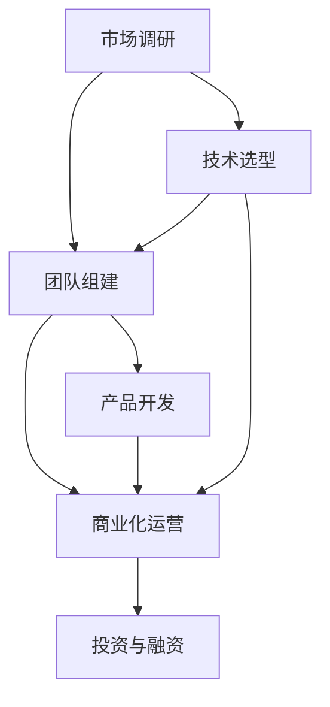

                 

# AI创业码头故事：AI创业者的选择

## 1. 背景介绍

### 1.1 问题由来
在人工智能(AI)领域的蓬勃发展下，越来越多的创业者开始进入这一领域，探索各种可能性。然而，AI创业充满了不确定性，如何选择合适的领域和机会，是每个创业者都需要深思熟虑的问题。

### 1.2 问题核心关键点
在AI创业中，选择正确的领域和机会至关重要。这涉及到对市场需求的深度理解、技术趋势的把握、团队能力与资源配置的有效整合等多方面因素的综合考量。创业者必须具备多维度思考的能力，才能在激烈的市场竞争中脱颖而出。

### 1.3 问题研究意义
选择正确的AI创业方向，有助于创业者快速积累商业经验，获取市场份额，提升品牌影响力，最终实现商业成功。同时，这也有助于推动AI技术在实际场景中的应用，促进社会的数字化转型。

## 2. 核心概念与联系

### 2.1 核心概念概述

为更好地理解AI创业的选择，本节将介绍几个关键概念及其之间的关系：

- AI创业：指的是基于人工智能技术的创业活动，通常涉及机器学习、深度学习、计算机视觉、自然语言处理等前沿技术。
- 市场调研：在创业初期，对目标市场的现状、需求、竞争对手等情况进行详细调查和分析，以确定最佳的市场切入点。
- 技术选型：根据项目需求和团队能力，选择合适的AI技术平台、工具和框架，为项目开发提供技术支持。
- 团队组建：根据项目需求和公司规模，招募并组建一支多学科背景、技能互补的团队。
- 产品开发：将市场调研和技术的成果转化为具体的产品或服务，通过迭代优化满足用户需求。
- 商业化运营：将产品或服务推向市场，通过营销、销售、客户服务等手段实现商业化。
- 投资与融资：获取必要的资金支持，加速项目的研发和市场扩展。

这些概念通过以下Mermaid流程图呈现：



这些概念相互依存、相互影响，共同构成了AI创业的完整过程。

## 3. 核心算法原理 & 具体操作步骤

### 3.1 算法原理概述

AI创业的核心在于技术选型和市场契合度的结合。在选择创业方向时，通常需要遵循以下基本原则：

1. **技术优势**：选择技术成熟度高、行业认可度高的AI技术，避免技术路径风险。
2. **市场需求**：选择有明确市场需求、潜在用户基数大的领域，确保项目有持续增长的空间。
3. **团队能力**：评估团队在选定的技术领域中的专业能力和经验，确保项目能够高效推进。
4. **资源配置**：综合考虑公司的资金、人力、设备等资源，合理规划项目开发和运营的路径。

### 3.2 算法步骤详解

AI创业的选择通常包括以下关键步骤：

**Step 1: 市场调研**
- 收集和分析行业报告、市场需求数据、竞争对手情况等资料。
- 与潜在客户进行访谈，了解他们的需求和痛点。
- 通过问卷调查、在线社区等方式收集反馈。

**Step 2: 技术选型**
- 根据市场调研结果，选择最适合的技术平台和工具。
- 评估技术的成熟度和市场应用案例。
- 考虑技术的可扩展性和长期维护成本。

**Step 3: 团队组建**
- 根据项目需求，招募具有相关技术和业务经验的人才。
- 建立跨学科、多功能的团队，确保项目能够全面推进。
- 设立明确的团队目标和绩效考核机制，激发团队潜力。

**Step 4: 产品开发**
- 根据市场需求和技术选型，设计产品原型。
- 进行多轮迭代，不断优化产品功能和用户体验。
- 制定详细的项目开发计划，确保按时完成关键里程碑。

**Step 5: 商业化运营**
- 制定市场推广策略，通过线上线下渠道推广产品。
- 设立客户支持体系，快速响应用户反馈和需求。
- 进行数据分析和业务分析，持续优化产品和运营策略。

**Step 6: 投资与融资**
- 撰写商业计划书，明确项目愿景、市场需求、竞争优势等要素。
- 选择合适的投资机构或天使投资人，进行项目融资。
- 定期更新财务报表，保持投资者信心。

### 3.3 算法优缺点

AI创业的选择方法具有以下优点：
1. 系统性：通过详细的市场调研和技术评估，确保项目的成功率高。
2. 风险可控：通过合理配置资源，降低技术风险和市场风险。
3. 目标明确：明确的市场需求和技术选型，确保项目方向清晰。
4. 团队适配：根据团队能力和市场需求，合理配置人才，提升团队协作效率。

同时，该方法也存在一定的局限性：
1. 成本高：市场调研和技术选型需要耗费大量时间和资源。
2. 周期长：从市场调研到产品开发再到商业化运营，整个过程耗时较长。
3. 市场变化快：市场需求和技术趋势变化快，需要持续跟进和调整策略。
4. 竞争激烈：AI领域竞争激烈，如何脱颖而出是巨大的挑战。

尽管存在这些局限性，但通过系统的选择方法和全面的考虑，AI创业者依然能够提升成功的概率，找到最适合的发展路径。

### 3.4 算法应用领域

AI创业的选择方法在多个领域都有广泛的应用：

- **医疗健康**：通过AI技术提高疾病诊断、个性化治疗、健康管理等医疗服务的效率和精度。
- **金融科技**：利用AI技术进行信用评估、风险控制、智能投顾等金融业务创新。
- **智能制造**：通过AI优化生产流程、质量控制、设备维护等制造环节，提高生产效率。
- **教育培训**：采用AI技术进行个性化教育、智能评估、在线课程推荐等教育创新。
- **零售电商**：利用AI进行商品推荐、库存管理、顾客行为分析等零售业务优化。
- **智能交通**：通过AI技术优化交通管理、智能驾驶、车联网等交通应用。

这些领域都有着广阔的市场前景，吸引了众多AI创业者的关注。选择适合的细分市场，将有助于创业者获得商业成功。

## 4. 数学模型和公式 & 详细讲解

### 4.1 数学模型构建

在进行AI创业的选择时，可以构建一个量化模型，用于评估不同创业方向的市场潜力和技术可行性。该模型包括三个主要部分：市场需求、技术成熟度和投资回报率。

定义市场需求为 $D$，技术成熟度为 $T$，投资回报率为 $ROI$。模型表达式为：

$$
Score = w_D \times D + w_T \times T + w_{ROI} \times ROI
$$

其中 $w_D$、$w_T$、$w_{ROI}$ 为权重系数，可根据实际情况进行调整。

### 4.2 公式推导过程

- **市场需求（$D$）**：通过市场调研，量化潜在用户数量、购买意愿、消费能力等因素，得到一个综合指标。

- **技术成熟度（$T$）**：评估技术平台、算法、工具等的成熟度和稳定性，根据开源项目、论文发表、商业应用情况等进行打分。

- **投资回报率（$ROI$）**：根据预期的市场规模、产品价格、运营成本等，计算出项目的投资回报率。

### 4.3 案例分析与讲解

以智能推荐系统为例，通过市场调研，我们发现潜在用户数量庞大且购买意愿高，市场需求指数 $D=9$；经过评估，技术成熟度 $T=8$；根据商业模式，预计投资回报率 $ROI=20\%$。带入上述模型，得到：

$$
Score = 0.5 \times 9 + 0.3 \times 8 + 0.2 \times 20\% = 9.8
$$

根据打分标准，我们认为这个创业方向具有较高的市场潜力和技术可行性。

## 5. 项目实践：代码实例和详细解释说明

### 5.1 开发环境搭建

在进行AI创业的选择时，开发环境的选择至关重要。以下是使用Python进行数据处理和分析的环境配置流程：

1. 安装Anaconda：从官网下载并安装Anaconda，用于创建独立的Python环境。

2. 创建并激活虚拟环境：
```bash
conda create -n ai-dev python=3.8 
conda activate ai-dev
```

3. 安装必要的库：
```bash
conda install pandas numpy scikit-learn matplotlib
```

4. 设置数据存储和处理工具：
```bash
pip install h5py dask
```

完成上述步骤后，即可在`ai-dev`环境中进行数据分析和模型评估。

### 5.2 源代码详细实现

我们以智能推荐系统为例，给出使用Python和Scikit-Learn库进行市场调研和需求评估的代码实现。

首先，定义市场调研的函数：

```python
import pandas as pd
from sklearn.model_selection import train_test_split

def market_research(data_path):
    data = pd.read_csv(data_path)
    # 对数据进行清洗和处理
    # 统计潜在用户数量、购买意愿、消费能力等指标
    market_data = data.groupby(['user_id', 'product_id']).agg({'price': 'mean', 'quantity': 'mean'})
    market_data.reset_index(inplace=True)
    return market_data
```

然后，定义需求评估的函数：

```python
from sklearn.metrics import precision_recall_curve, auc
from sklearn.linear_model import LogisticRegression
from sklearn.model_selection import cross_val_score

def demand_evaluation(market_data):
    # 构建训练集和测试集
    X = market_data[['price', 'quantity']]
    y = market_data['is_purchased']
    X_train, X_test, y_train, y_test = train_test_split(X, y, test_size=0.2, random_state=42)
    
    # 训练模型并进行评估
    model = LogisticRegression()
    scores = cross_val_score(model, X_train, y_train, cv=5, scoring='precision_recall_auc')
    auc_score = auc(scores)
    
    return auc_score
```

最后，启动数据处理和需求评估流程：

```python
market_data = market_research('market_data.csv')
auc_score = demand_evaluation(market_data)
print(f"市场需求评估得分: {auc_score:.2f}")
```

以上就是使用Python和Scikit-Learn库进行市场调研和需求评估的完整代码实现。可以看到，通过科学的方法和工具，可以高效地处理和评估市场需求数据，为AI创业的选择提供可靠依据。

### 5.3 代码解读与分析

让我们再详细解读一下关键代码的实现细节：

**market_research函数**：
- 定义了一个读取和处理市场调研数据的函数，主要分为数据导入、清洗、统计等步骤。
- 通过`groupby`方法按照用户和产品进行聚合，统计出每个用户的平均购买价格和数量，作为市场需求指标。

**demand_evaluation函数**：
- 定义了一个评估市场需求得分的函数，主要分为数据划分、模型训练、评估等步骤。
- 使用`train_test_split`方法将数据集划分为训练集和测试集。
- 使用`LogisticRegression`模型进行训练，并使用`cross_val_score`方法进行交叉验证。
- 使用`precision_recall_curve`和`auc`方法计算模型的精确召回曲线下面积，作为市场需求评估的得分。

**启动流程**：
- 在主函数中调用`market_research`函数，读取并处理市场调研数据。
- 调用`demand_evaluation`函数，对市场需求进行评估，输出评估得分。

可以看到，通过Python和Scikit-Learn库，可以高效地进行市场调研和需求评估，为AI创业的选择提供数据支持和量化指标。

## 6. 实际应用场景

### 6.1 智能推荐系统

智能推荐系统是AI创业的热门方向之一，通过分析和预测用户行为，为用户推荐个性化的商品或内容。

在技术实现上，可以收集用户的浏览、点击、购买等行为数据，采用机器学习模型进行推荐。通过微调和优化模型参数，提升推荐精度和用户体验。同时，可以结合用户画像和社交网络信息，进一步增强推荐效果。

### 6.2 医疗健康

医疗健康领域也是AI创业的重要方向，通过AI技术提高疾病诊断、个性化治疗、健康管理等医疗服务的效率和精度。

在技术实现上，可以采用深度学习模型进行医学影像分析、病历数据分析、基因组学研究等。通过大规模数据集的预训练，模型能够在特定医疗场景中发挥良好性能。同时，结合专家知识和医学规则，进一步增强模型的可解释性和实用性。

### 6.3 智能交通

智能交通是AI创业的另一个热门方向，通过AI技术优化交通管理、智能驾驶、车联网等交通应用。

在技术实现上，可以采用计算机视觉、深度学习等技术进行交通监控、交通信号优化、自动驾驶等应用。通过与车载设备、交通基础设施的深度融合，提升交通系统的智能化水平。同时，结合城市规划、环境数据等信息，进一步优化交通流，提升城市交通管理水平。

## 7. 工具和资源推荐

### 7.1 学习资源推荐

为了帮助开发者系统掌握AI创业的选择方法，这里推荐一些优质的学习资源：

1. Coursera《人工智能创业》课程：由斯坦福大学教授主讲，介绍人工智能创业的基本概念、商业模式和实际案例。
2. Udacity《AI创业实战》课程：结合实际案例，系统讲解AI创业的流程和方法，涵盖市场调研、技术选型、团队组建等多个环节。
3. AI创业社区：由一群AI创业者组成的交流平台，分享创业经验、技术进展和市场需求。
4. AI创业指南：全面介绍AI创业的各个环节和细节，涵盖市场调研、技术选型、融资等多个方面。

通过对这些资源的学习实践，相信你一定能够快速掌握AI创业的选择方法，并用于解决实际的创业问题。

### 7.2 开发工具推荐

高效的开发离不开优秀的工具支持。以下是几款用于AI创业选择开发的常用工具：

1. Jupyter Notebook：强大的数据处理和可视化工具，适合进行市场调研和数据处理。
2. Tableau：商业智能分析工具，用于生成多维数据分析报告，帮助创业者理解市场趋势和需求。
3. GitHub：代码托管平台，便于版本控制和团队协作。
4. Google Colab：在线Jupyter Notebook环境，免费提供GPU/TPU算力，方便开发者快速实验。
5. PyCharm：Python集成开发环境，提供丰富的功能和插件，提升开发效率。

合理利用这些工具，可以显著提升AI创业选择过程的效率，加速创新迭代的步伐。

### 7.3 相关论文推荐

AI创业的选择方法已经形成了丰富的理论体系，以下是几篇奠基性的相关论文，推荐阅读：

1. "Creating AI Products" by Fei-Fei Li：介绍如何将AI技术应用到具体的产品开发中，涵盖了市场调研、产品设计、技术选型等多个方面。
2. "Deep Learning for Healthcare" by Andrew Ng：讨论了AI在医疗健康领域的应用，包括数据预处理、模型训练、评估等多个环节。
3. "Reinforcement Learning for Robotics" by David Silver：介绍了强化学习在智能交通中的应用，涵盖自动驾驶、交通信号优化等多个方面。

这些论文代表了大规模AI创业选择方法的发展脉络，通过学习这些前沿成果，可以帮助研究者把握学科前进方向，激发更多的创新灵感。

## 8. 总结：未来发展趋势与挑战

### 8.1 总结

本文对AI创业的选择方法进行了全面系统的介绍。首先阐述了AI创业的选择原则和技术选型的基本方法，明确了选择正确的创业方向对成功的重要性。其次，从原理到实践，详细讲解了市场调研、技术选型、团队组建、产品开发、商业化运营和投资与融资等各个环节的具体操作，提供了详尽的代码实现和案例分析。同时，本文还探讨了AI创业的选择方法在多个实际应用场景中的应用，展示了该方法的广泛适用性和巨大潜力。

通过本文的系统梳理，可以看到，AI创业的选择方法不仅适用于特定领域，而且在不同行业和应用场景中都有广泛的应用前景。它为AI创业者提供了系统的工具和方法，帮助他们在激烈的市场竞争中脱颖而出。

### 8.2 未来发展趋势

展望未来，AI创业的选择方法将呈现以下几个发展趋势：

1. **智能化和自动化**：AI技术在创业选择中的应用将更加智能化和自动化，通过数据驱动的方法，提高决策的准确性和效率。
2. **跨领域融合**：AI创业将更多地与其他前沿技术进行融合，如区块链、物联网、5G等，拓展应用范围。
3. **社会化网络**：AI创业选择将更多地依赖社交网络、用户反馈等社会化数据，提升市场调研的准确性和全面性。
4. **个性化定制**：AI创业将更多地考虑个性化需求，通过智能推荐、个性化服务等手段，提升用户体验。
5. **数据驱动**：AI创业将更多地依赖大数据分析，通过数据挖掘和机器学习，发现新的市场机会和用户需求。

这些趋势凸显了AI创业选择方法的先进性和前沿性，将推动AI技术在更多领域的应用和创新。

### 8.3 面临的挑战

尽管AI创业的选择方法已经取得了显著成就，但在迈向更加智能化、普适化应用的过程中，它仍面临着诸多挑战：

1. **数据质量和获取**：高质量数据是AI创业选择的前提，但数据获取和处理成本高，且数据隐私和安全问题也需要重视。
2. **技术选型多样**：AI技术种类繁多，如何在众多的技术路径中选择最适合的，需要丰富的经验和专业的判断。
3. **市场竞争激烈**：AI创业选择面临激烈的市场竞争，如何在竞争中突围，需要创新的商业模式和差异化战略。
4. **团队建设与管理**：团队的专业背景、技能互补、文化适配等都是创业成功的关键，需要科学的管理和运营。
5. **法规和伦理**：AI创业涉及伦理和法律问题，如何遵守相关法规，确保技术应用的安全性和合法性，需要深入研究。

这些挑战需要AI创业者不断创新、优化，才能在市场竞争中保持领先。

### 8.4 研究展望

未来，AI创业选择方法的研究方向可以从以下几个方面进行探索：

1. **跨学科整合**：将AI技术与经济学、社会学、心理学等多学科知识进行整合，提升创业选择的系统性和全面性。
2. **前沿技术应用**：将最新的AI技术，如强化学习、生成对抗网络等，应用到创业选择过程中，提升决策的科学性和精度。
3. **伦理和社会责任**：将伦理和社会责任纳入AI创业选择的过程中，确保技术应用符合社会价值观和法律法规。
4. **国际化应用**：将AI创业选择方法应用于全球市场，考虑不同国家和地区的需求和特点，提升技术的普适性和全球竞争力。

这些研究方向将推动AI创业选择方法走向更加先进和成熟，为AI技术在更多领域的创新和应用提供有力支持。

## 9. 附录：常见问题与解答

**Q1：如何评估市场调研数据的可靠性？**

A: 评估市场调研数据的可靠性，可以从以下几个方面入手：
1. 数据来源的权威性：选择权威的行业报告、学术研究、政府统计等数据来源。
2. 数据样本的多样性：收集来自不同地区、不同渠道的数据，确保数据的代表性。
3. 数据采集的方法：采用科学、系统的方法采集数据，如问卷调查、访谈、实验等。
4. 数据处理和分析：使用专业的统计工具和方法，对数据进行清洗、处理和分析，确保数据的质量。

**Q2：如何选择适合的技术平台和工具？**

A: 选择适合的技术平台和工具，需要考虑以下因素：
1. 技术成熟度：选择技术成熟度高、应用广泛的平台和工具。
2. 可扩展性：选择具有良好可扩展性和支持未来的平台和工具。
3. 社区支持：选择有活跃社区、丰富文档和资源的平台和工具。
4. 成本效益：考虑平台的成本效益，选择性价比高的解决方案。
5. 团队适配：评估团队成员对平台和工具的熟练程度，确保快速上手。

**Q3：如何招募和组建合适的团队？**

A: 招募和组建合适的团队，需要考虑以下步骤：
1. 明确团队目标和需求：根据项目需求，明确团队的规模和职能。
2. 制定招聘计划：通过多种渠道发布招聘信息，如公司官网、社交媒体、招聘平台等。
3. 评估候选人背景：通过简历、面试、项目经历等评估候选人的专业背景和能力。
4. 团队建设与管理：建立团队文化和绩效考核机制，激发团队潜力，提升团队协作效率。
5. 持续优化：定期进行团队评估和优化，确保团队持续高效运行。

**Q4：如何进行投资与融资？**

A: 进行投资与融资，需要以下步骤：
1. 制定商业计划书：明确项目愿景、市场需求、技术优势、商业模式等要素。
2. 选择投资机构或投资人：根据项目需求和阶段，选择合适的投资机构或天使投资人。
3. 进行路演和谈判：通过路演和谈判，向投资者展示项目价值和未来发展前景。
4. 签订投资协议：与投资者签订投资协议，明确投资条款和股权分配。
5. 定期更新财务报表：保持投资者信心，确保财务透明和合规。

通过以上步骤，可以有效地获取资金支持，加速项目的研发和市场扩展。

---

作者：禅与计算机程序设计艺术 / Zen and the Art of Computer Programming

