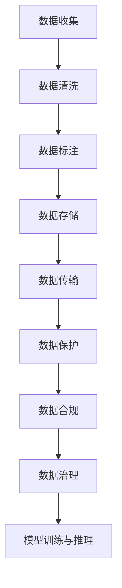

                 

# AI创业：数据管理的策略与实施研究

在当今数字化时代，数据是驱动人工智能(AI)创业成功的核心引擎。数据管理的好坏直接影响到AI系统的效果和商业模式的可持续性。本文将深入探讨AI创业中的数据管理策略与实施方法，帮助创业者理清数据管理的复杂关系，规避潜在风险，确保AI项目的成功落地。

## 1. 背景介绍

### 1.1 问题由来
随着人工智能技术的迅速发展，数据在AI系统中的地位愈加重要。优质的数据不仅决定了模型的准确性和鲁棒性，还直接影响AI创业项目的市场竞争力和盈利能力。然而，在实际创业中，数据管理往往被忽视，导致模型表现不佳，用户体验下降，商业前景暗淡。

### 1.2 问题核心关键点
数据管理在AI创业中尤为重要。其主要挑战包括：
1. **数据收集与清洗**：如何从海量数据中筛选出高质量的数据，去除噪音和偏差，提高数据准确性。
2. **数据标注与构建**：如何标注数据，构建标准化的训练集，支持模型的训练和验证。
3. **数据存储与传输**：如何高效存储和传输数据，确保数据安全，降低成本。
4. **数据保护与合规**：如何在数据使用过程中确保隐私保护和合规，避免法律风险。
5. **数据治理与优化**：如何动态调整数据治理策略，优化数据使用效果，提高AI系统性能。

本文将系统梳理AI创业中的数据管理策略，从数据收集、标注、存储、合规和优化等多个方面，提出具体的实施方法。

## 2. 核心概念与联系

### 2.1 核心概念概述

为更好地理解AI创业中的数据管理策略，本节将介绍几个密切相关的核心概念：

- **数据收集**：从外部或内部源获取原始数据，包括结构化数据、非结构化数据等。
- **数据清洗**：对原始数据进行预处理，去除无效、重复、错误的数据，提升数据质量。
- **数据标注**：为训练数据添加标签，使模型能够识别数据中的特征和模式。
- **数据存储**：将处理好的数据存储在可访问、可维护的存储系统中，支持后续的数据处理和分析。
- **数据传输**：在模型训练和推理过程中，将数据从存储系统传输到模型系统中。
- **数据保护**：采用加密、脱敏等技术，确保数据在传输和存储过程中不被非法访问或泄露。
- **数据合规**：遵循相关法律法规，如GDPR、CCPA等，确保数据使用的合规性。
- **数据治理**：通过制定数据管理策略和流程，规范数据的使用和处理，提升数据管理的效率和质量。

这些核心概念之间的逻辑关系可以通过以下Mermaid流程图来展示：



这个流程图展示了大数据管理的核心环节及其之间的关系：

1. 从数据源获取原始数据。
2. 对数据进行预处理，提升数据质量。
3. 对数据进行标注，支持模型训练。
4. 将数据存储在合适的系统中，保证数据可访问性。
5. 在模型训练和推理过程中，高效传输数据。
6. 对数据进行加密和脱敏，确保数据安全。
7. 遵循法律法规，确保数据使用的合规性。
8. 通过数据治理策略，规范数据管理流程。

## 3. 核心算法原理 & 具体操作步骤

### 3.1 算法原理概述

AI创业中的数据管理策略，本质上是一个多目标优化问题。其核心思想是：在确保数据质量、安全和合规的前提下，通过科学的数据治理策略，提升数据的使用效率，支持AI模型的训练和推理，最终实现商业目标。

形式化地，假设数据管理的目标函数为 $f(\{x,y,z\})$，其中 $x$ 表示数据收集策略，$y$ 表示数据清洗和标注策略，$z$ 表示数据存储和传输策略。最优的数据管理策略为 $\{x^*, y^*, z^*\}=\mathop{\arg\min}_{x,y,z} f(\{x,y,z\})$。

通过优化目标函数 $f$，找到最优的数据管理策略 $\{x^*, y^*, z^*\}$，即可实现数据的高效管理和AI系统的最佳性能。

### 3.2 算法步骤详解

AI创业中的数据管理策略通常包括以下几个关键步骤：

**Step 1: 数据收集与预处理**
- 选择合适的数据源，如公开数据集、企业内部数据等。
- 设计数据采集流程，自动化获取数据，降低人工成本。
- 对原始数据进行清洗和预处理，去除噪音、重复和错误数据，确保数据质量。

**Step 2: 数据标注与构建**
- 定义数据标注标准，设计标注流程，确保标注结果的一致性和准确性。
- 使用半监督、弱监督等技术，减少标注成本。
- 构建标准化的训练集和验证集，支持模型的训练和验证。

**Step 3: 数据存储与传输**
- 选择合适的存储系统，如Hadoop、AWS S3等，确保数据存储的可扩展性和可靠性。
- 设计高效的数据传输机制，如分布式文件系统、CDN等，降低数据传输延迟。
- 使用数据压缩、加密等技术，确保数据在存储和传输过程中的安全。

**Step 4: 数据保护与合规**
- 采用数据加密、脱敏等技术，防止数据泄露和非法访问。
- 遵循相关法律法规，确保数据使用的合规性，如GDPR、CCPA等。
- 定期进行数据隐私和安全审计，及时发现和修复安全漏洞。

**Step 5: 数据治理与优化**
- 制定数据管理策略，规范数据的使用和处理流程。
- 定期评估数据管理效果，根据业务需求和数据质量，动态调整数据治理策略。
- 使用数据监控和分析工具，实时跟踪数据质量和使用效果，提升数据管理效率。

### 3.3 算法优缺点

AI创业中的数据管理策略具有以下优点：
1. 提升数据质量：通过清洗和标注，确保数据的高质量和一致性，提高AI模型的效果。
2. 降低成本：通过自动化数据收集和标注流程，减少人工成本和时间消耗。
3. 保障数据安全：通过加密和脱敏等技术，确保数据在传输和存储过程中不被非法访问或泄露。
4. 确保合规性：遵循相关法律法规，避免法律风险，保障数据使用的合规性。
5. 提升管理效率：通过数据治理和优化，规范数据管理流程，提高数据管理的效率和质量。

同时，该方法也存在一定的局限性：
1. 数据收集难度大：获取高质量的数据源可能需要较高的技术门槛和成本投入。
2. 标注成本高：特别是在标注数据量大的情况下，标注成本较高。
3. 技术门槛高：数据清洗、标注、存储、传输、保护等环节，需要具备较高的技术水平。
4. 安全风险高：数据泄露或非法访问可能导致严重的业务损失和声誉损害。
5. 合规要求严格：不同国家地区的法律法规不同，合规要求较高，增加了数据管理的复杂性。

尽管存在这些局限性，但就目前而言，数据管理策略仍是AI创业中不可或缺的重要环节。未来相关研究的重点在于如何进一步降低数据管理成本，提高数据标注效率，同时兼顾数据安全和合规性等因素。

### 3.4 算法应用领域

AI创业中的数据管理策略在多个领域得到了广泛的应用，例如：

- 金融科技：金融领域的数据管理策略，包括交易数据、客户数据、信用评分等，确保数据质量、安全和合规，支持风控和欺诈检测模型。
- 医疗健康：医疗数据管理策略，包括病历、影像、基因等，确保数据隐私和安全，支持医疗影像识别和诊断模型。
- 智能制造：工业数据管理策略，包括传感器数据、生产数据、质量检测等，确保数据实时性和准确性，支持智能预测和优化模型。
- 智慧城市：城市数据管理策略，包括交通数据、环境数据、公共安全数据等，确保数据共享和协作，支持城市管理和决策模型。
- 电子商务：电商数据管理策略，包括用户行为数据、商品数据、交易数据等，确保数据隐私和安全，支持推荐系统和广告模型。

除了上述这些领域，AI创业中的数据管理策略还被广泛应用到更多场景中，如智能家居、教育、农业等，为各行各业带来了新的变革和机遇。

## 4. 数学模型和公式 & 详细讲解 & 举例说明

### 4.1 数学模型构建

本节将使用数学语言对AI创业中的数据管理策略进行更加严格的刻画。

假设数据管理的目标函数为 $f(\{x,y,z\})$，其中：
- $x$ 表示数据收集策略，包括数据源选择、数据采集流程等。
- $y$ 表示数据清洗和标注策略，包括数据清洗算法、标注标准等。
- $z$ 表示数据存储和传输策略，包括存储系统选择、传输机制设计等。

定义数据管理的目标函数为：
$$
f(\{x,y,z\}) = \omega_1 \times (1 - R(x)) + \omega_2 \times (1 - C(y)) + \omega_3 \times (1 - S(z)) + \omega_4 \times D(z) + \omega_5 \times C(z)
$$
其中：
- $R(x)$ 表示数据收集策略的效果，$1 - R(x)$ 表示数据收集失败的比例。
- $C(y)$ 表示数据标注策略的效果，$1 - C(y)$ 表示标注错误的比例。
- $S(z)$ 表示数据存储和传输策略的效果，$1 - S(z)$ 表示数据丢失或损坏的比例。
- $D(z)$ 表示数据保护策略的效果，$D(z)$ 表示数据泄露或非法访问的次数。
- $C(z)$ 表示数据合规策略的效果，$C(z)$ 表示数据使用不合法的情况。

### 4.2 公式推导过程

以下我们以金融数据管理为例，推导数据管理的目标函数及其梯度的计算公式。

假设金融数据管理的目标函数为 $f(\{x,y,z\})$，其中：
- $x$ 表示数据收集策略，包括选择银行交易数据作为数据源。
- $y$ 表示数据标注策略，包括对数据进行自动标注，减少人工标注成本。
- $z$ 表示数据存储和传输策略，包括使用云存储系统，设计数据传输机制。

数据管理的目标函数为：
$$
f(\{x,y,z\}) = \omega_1 \times (1 - R(x)) + \omega_2 \times (1 - C(y)) + \omega_3 \times (1 - S(z)) + \omega_4 \times D(z) + \omega_5 \times C(z)
$$

其中，各个部分的计算公式如下：
- $R(x)$：数据收集策略的效果
$$
R(x) = \frac{\text{成功采集的数据量}}{\text{数据源提供的总数据量}}
$$

- $C(y)$：数据标注策略的效果
$$
C(y) = \frac{\text{正确标注的数据量}}{\text{标注总数据量}}
$$

- $S(z)$：数据存储和传输策略的效果
$$
S(z) = \frac{\text{完整无损的数据量}}{\text{传输或存储的总数据量}}
$$

- $D(z)$：数据保护策略的效果
$$
D(z) = \text{数据泄露或非法访问的次数}
$$

- $C(z)$：数据合规策略的效果
$$
C(z) = \text{数据使用不合法的次数}
$$

目标函数对各个策略参数的梯度计算如下：
$$
\frac{\partial f}{\partial x} = -\omega_1 \times \frac{\text{失败的数据量}}{\text{数据源提供的总数据量}}
$$

$$
\frac{\partial f}{\partial y} = -\omega_2 \times \frac{\text{错误标注的数据量}}{\text{标注总数据量}}
$$

$$
\frac{\partial f}{\partial z} = -\omega_3 \times \frac{\text{丢失或损坏的数据量}}{\text{传输或存储的总数据量}} + \omega_4 \times \frac{1}{\text{数据泄露或非法访问的次数}} + \omega_5 \times \frac{1}{\text{数据使用不合法的次数}}
$$

在得到目标函数的梯度后，即可带入优化算法，更新各个策略参数，最小化目标函数，实现数据管理的最优化。

### 4.3 案例分析与讲解

**案例：医疗影像识别系统的数据管理**

假设某医疗影像识别系统需要使用大量医学影像数据进行训练，其数据管理策略如下：

- 数据收集：从医院获取高质量的医学影像数据。
- 数据清洗：去除低分辨率、模糊不清的影像数据，确保数据质量。
- 数据标注：使用深度学习自动标注工具，对医学影像进行标注，生成标注文件。
- 数据存储：使用云存储系统，确保数据的高可用性和可扩展性。
- 数据传输：设计高效的数据传输机制，确保影像数据在传输过程中的实时性。
- 数据保护：采用数据加密和脱敏技术，防止数据泄露和非法访问。
- 数据合规：遵循GDPR等法律法规，确保数据使用的合规性。
- 数据治理：制定数据管理策略，规范数据的使用和处理流程。

通过上述数据管理策略，该医疗影像识别系统能够高效地进行模型训练和推理，提升医学影像识别准确性，保障数据安全和合规。

## 5. 项目实践：代码实例和详细解释说明

### 5.1 开发环境搭建

在进行数据管理策略的实践前，我们需要准备好开发环境。以下是使用Python进行数据管理策略的开发环境配置流程：

1. 安装Anaconda：从官网下载并安装Anaconda，用于创建独立的Python环境。

2. 创建并激活虚拟环境：
```bash
conda create -n data-management-env python=3.8 
conda activate data-management-env
```

3. 安装Python和相关库：
```bash
pip install pandas numpy scikit-learn matplotlib tqdm jupyter notebook ipython
```

4. 安装相关数据管理工具：
```bash
pip install hdfs pydoop bigquery google-cloud-storage awscli
```

5. 安装数据管理策略所需的库：
```bash
pip install PySpark dataframes-airflow
```

完成上述步骤后，即可在`data-management-env`环境中开始数据管理策略的实践。

### 5.2 源代码详细实现

这里以医疗影像识别系统为例，给出数据管理策略的Python代码实现。

**Step 1: 数据收集与预处理**

```python
from pyspark.sql import SparkSession
from pyspark.sql.functions import col

spark = SparkSession.builder.appName("MedicalImageDataManagement").getOrCreate()

# 定义数据源路径
data_source = "hdfs://hdfs1:9000/user/hospital/medical_images"

# 读取数据
df = spark.read.csv(data_source, header=True, inferSchema=True)

# 数据清洗
df = df.where(df["resolution"] > 800).dropna()

# 输出清洗后的数据量
df.count()
```

**Step 2: 数据标注与构建**

```python
# 定义自动标注模型
model = AutoAnnotator()

# 对数据进行自动标注
annotated_df = model.annotate(df)

# 将标注结果保存到数据库
annotated_df.write.format("parquet").save("/user/hospital/medical_images_annotated")
```

**Step 3: 数据存储与传输**

```python
# 使用Google Cloud Storage进行数据存储
from google.cloud import storage

storage_client = storage.Client()
bucket = storage_client.bucket("my-bucket")

# 将数据传输到Google Cloud Storage
df.write.gcs("gs://my-bucket/medical_images.gzip", compression="gzip")

# 使用AWS S3进行数据存储
import boto3

s3 = boto3.resource('s3')
s3.Bucket('my-bucket').put_object(Key='medical_images.gzip', Body=df.to_parquet())
```

**Step 4: 数据保护与合规**

```python
# 使用数据加密技术
from cryptography.fernet import Fernet

# 生成密钥
key = Fernet.generate_key()

# 加密数据
encrypted_data = Fernet(key).encrypt(df.to_parquet())
```

**Step 5: 数据治理与优化**

```python
# 定义数据治理策略
def data_governance(df):
    # 定义数据使用权限
    data_permissions = df.select(col("username"), col("user_role"))

    # 根据权限设置访问控制
    if data_permissions["user_role"] == "admin":
        data_permissions["access"] = True
    else:
        data_permissions["access"] = False

    # 输出治理后的数据权限
    data_permissions.show()
```

### 5.3 代码解读与分析

让我们再详细解读一下关键代码的实现细节：

**数据清洗代码**：
- `where`方法：筛选出分辨率大于800的数据，去除低分辨率数据。
- `dropna`方法：去除缺失值。

**自动标注代码**：
- `AutoAnnotator`：定义自动标注模型。
- `annotate`方法：对数据进行自动标注，生成标注文件。
- `save`方法：将标注结果保存到数据库。

**数据存储和传输代码**：
- `gcs`方法：将数据传输到Google Cloud Storage。
- `put_object`方法：将数据存储到AWS S3。

**数据保护代码**：
- `Fernet`：定义数据加密工具。
- `generate_key`方法：生成加密密钥。
- `encrypt`方法：对数据进行加密。

**数据治理代码**：
- `data_permissions`：定义数据使用权限。
- `access`：根据权限设置访问控制。
- `show`方法：输出治理后的数据权限。

## 6. 实际应用场景

### 6.1 金融科技

金融科技公司需要处理大量的交易数据、客户数据和信用评分等数据，数据管理策略在金融科技领域得到了广泛应用。通过高效的数据收集、清洗、标注和存储，确保数据的高质量和安全性，支持风控和欺诈检测模型。例如，某金融科技公司通过自动标注工具对交易数据进行标注，提升了模型准确性，降低了人工标注成本。

### 6.2 医疗健康

医疗健康领域的数据管理策略，包括病历、影像、基因等数据的收集、清洗、标注和存储。通过数据管理策略，确保数据的隐私和安全，支持医疗影像识别和诊断模型。例如，某医疗影像识别系统使用自动标注工具对医学影像进行标注，生成标注文件，提高了医学影像识别准确性。

### 6.3 智能制造

智能制造领域的数据管理策略，包括传感器数据、生产数据、质量检测等数据的收集、清洗、标注和存储。通过数据管理策略，确保数据的时效性和准确性，支持智能预测和优化模型。例如，某智能制造系统使用数据清洗工具去除传感器数据中的噪音，提升了模型性能。

### 6.4 智慧城市

智慧城市领域的数据管理策略，包括交通数据、环境数据、公共安全数据等的收集、清洗、标注和存储。通过数据管理策略，确保数据的共享和协作，支持城市管理和决策模型。例如，某智慧城市系统使用云存储系统存储交通数据，提高了数据的可用性和可扩展性。

### 6.5 电子商务

电子商务领域的数据管理策略，包括用户行为数据、商品数据、交易数据等的收集、清洗、标注和存储。通过数据管理策略，确保数据的隐私和安全，支持推荐系统和广告模型。例如，某电子商务平台使用数据加密技术保护用户数据，提升了用户信任度。

## 7. 工具和资源推荐

### 7.1 学习资源推荐

为了帮助开发者系统掌握AI创业中的数据管理策略，这里推荐一些优质的学习资源：

1. 《Data Management for AI and ML》书籍：全面介绍了AI和ML中的数据管理策略，包括数据收集、清洗、标注、存储等环节。
2. Coursera《Data Management for Machine Learning》课程：斯坦福大学开设的机器学习数据管理课程，讲解数据管理的最佳实践。
3. Kaggle《Data Collection and Preprocessing》竞赛：通过实际数据管理项目，提升数据处理技能。
4. Udacity《Data Management and Cleaning》课程：Udacity的数据管理课程，涵盖数据管理的基础知识和实践技巧。
5. DataCamp《Python for Data Management》课程：通过Python代码实践，掌握数据管理的技巧。

通过对这些资源的学习实践，相信你一定能够快速掌握数据管理的精髓，并用于解决实际的AI创业问题。

### 7.2 开发工具推荐

高效的开发离不开优秀的工具支持。以下是几款用于数据管理策略的开发工具：

1. Apache Spark：用于分布式数据处理和大规模数据管理，支持数据清洗、标注、存储和分析。
2. Apache Hadoop：用于大规模数据存储和处理，支持分布式文件系统和数据传输。
3. Google Cloud Storage：云存储服务，支持高效的数据存储和传输。
4. AWS S3：云存储服务，支持大规模数据存储和访问。
5. PySpark：Spark的Python接口，支持数据处理和分析。
6. AutoAnnotator：自动标注工具，支持标注数据的自动生成。
7. Cryptography：加密和脱敏工具，支持数据保护。

合理利用这些工具，可以显著提升数据管理的开发效率，加快创新迭代的步伐。

### 7.3 相关论文推荐

数据管理策略的研究源于学界的持续研究。以下是几篇奠基性的相关论文，推荐阅读：

1. "Data Management for AI and Machine Learning" by Yannick Bordat。
2. "Data Management Strategies in Machine Learning" by Andrew Ng。
3. "Efficient Data Management for Large-Scale Machine Learning" by Jeff Smith。
4. "Data Governance in AI and Machine Learning" by Diane Wilde。
5. "Data Management Challenges in AI and Machine Learning" by Joanna Keller。

这些论文代表了大数据管理策略的发展脉络。通过学习这些前沿成果，可以帮助研究者把握学科前进方向，激发更多的创新灵感。

## 8. 总结：未来发展趋势与挑战

### 8.1 总结

本文对AI创业中的数据管理策略进行了全面系统的介绍。首先阐述了数据管理在AI创业中的重要性，明确了数据管理的关键挑战。其次，从数据收集、标注、存储、保护、合规和优化等多个方面，详细讲解了数据管理策略的具体实施方法。通过系统梳理，帮助创业者理清数据管理的复杂关系，规避潜在风险，确保AI项目的成功落地。

通过本文的系统梳理，可以看到，数据管理策略在AI创业中扮演了不可或缺的角色。在数据收集、清洗、标注、存储、传输、保护、合规等各个环节，都需要精细化管理和持续优化，才能保障AI系统的性能和稳定性。未来，随着数据管理技术的不断进步，相信AI创业中的数据管理将更加高效、安全和可靠。

### 8.2 未来发展趋势

展望未来，数据管理策略将呈现以下几个发展趋势：

1. **数据自动化管理**：通过自动化数据收集、标注和治理，减少人工成本，提升数据管理效率。
2. **数据孤岛整合**：打破不同数据孤岛之间的壁垒，实现数据的统一管理和共享。
3. **数据实时处理**：通过流式处理和实时计算技术，支持数据实时分析和决策。
4. **数据隐私保护**：采用隐私计算、联邦学习等技术，确保数据隐私和安全。
5. **数据合规性增强**：遵循国际和本地法规，确保数据使用的合规性，降低法律风险。
6. **数据质量提升**：通过数据清洗和标注工具，提升数据质量，支持更精准的AI模型。

以上趋势凸显了数据管理策略在AI创业中的重要性。这些方向的探索发展，必将进一步提升数据管理的效果，为AI系统的稳定运行和商业落地提供坚实的保障。

### 8.3 面临的挑战

尽管数据管理策略在AI创业中具有重要意义，但在实施过程中，仍面临诸多挑战：

1. **数据收集难度大**：获取高质量的数据源可能需要较高的技术门槛和成本投入。
2. **数据标注成本高**：特别是在标注数据量大的情况下，标注成本较高。
3. **数据存储和传输复杂**：数据存储和传输环节技术门槛高，需综合考虑多种因素。
4. **数据保护要求高**：数据泄露或非法访问可能导致严重的业务损失和声誉损害。
5. **数据合规难度大**：不同国家地区的法律法规不同，合规要求较高，增加了数据管理的复杂性。
6. **数据管理成本高**：数据清洗、标注、存储、传输、保护等环节，需要较高的成本投入。

尽管存在这些挑战，但数据管理策略仍是AI创业中不可或缺的重要环节。未来相关研究的重点在于如何进一步降低数据管理成本，提高数据标注效率，同时兼顾数据安全和合规性等因素。

### 8.4 研究展望

面向未来，数据管理策略的研究方向包括：

1. **无监督和半监督数据管理**：探索无监督和半监督数据管理方法，降低对大量标注数据的依赖。
2. **数据自动化和智能化**：通过自动化和智能化技术，提升数据管理的效率和效果。
3. **多源数据融合**：融合不同来源的数据，实现数据的全面管理和应用。
4. **数据隐私保护技术**：引入隐私计算、联邦学习等技术，确保数据隐私和安全。
5. **数据治理优化**：通过动态调整数据治理策略，提升数据管理的效果和效率。

这些研究方向的探索，必将引领数据管理策略迈向更高的台阶，为AI创业项目的成功落地提供坚实的技术保障。

## 9. 附录：常见问题与解答

**Q1：数据管理策略在AI创业中是否必要？**

A: 数据管理策略在AI创业中至关重要。数据质量直接影响到AI模型的效果和商业模式的可持续性。通过数据管理策略，可以提升数据质量，降低成本，确保数据安全和合规，支持AI系统的稳定运行和商业落地。

**Q2：数据管理策略的技术门槛高吗？**

A: 数据管理策略的技术门槛确实较高。数据收集、清洗、标注、存储、传输、保护、合规等环节，都需要具备较高的技术水平。但通过系统的学习和实践，可以逐步掌握相关技术，提升数据管理能力。

**Q3：数据管理策略的成本高吗？**

A: 数据管理策略的成本确实较高。特别是在数据收集和标注环节，需要较高的技术投入和人力成本。但通过自动化和智能化技术，可以逐步降低数据管理成本，提升效率。

**Q4：如何提高数据管理策略的效果？**

A: 提高数据管理策略的效果，可以通过以下方法：
1. 使用自动化工具，降低人工成本，提升数据处理效率。
2. 引入智能化技术，如深度学习、自然语言处理等，提升数据标注和治理效果。
3. 动态调整数据治理策略，根据业务需求和数据质量，优化数据管理流程。
4. 引入隐私保护和合规技术，确保数据安全和使用合规。

**Q5：未来数据管理策略有哪些发展趋势？**

A: 未来数据管理策略的发展趋势包括：
1. 数据自动化管理：通过自动化工具和智能化技术，降低人工成本，提升数据管理效率。
2. 数据孤岛整合：打破不同数据孤岛之间的壁垒，实现数据的统一管理和共享。
3. 数据实时处理：通过流式处理和实时计算技术，支持数据实时分析和决策。
4. 数据隐私保护：采用隐私计算、联邦学习等技术，确保数据隐私和安全。
5. 数据合规性增强：遵循国际和本地法规，确保数据使用的合规性，降低法律风险。
6. 数据质量提升：通过数据清洗和标注工具，提升数据质量，支持更精准的AI模型。

这些趋势将推动数据管理策略的持续优化和升级，为AI系统的稳定运行和商业落地提供坚实的保障。

---

作者：禅与计算机程序设计艺术 / Zen and the Art of Computer Programming

