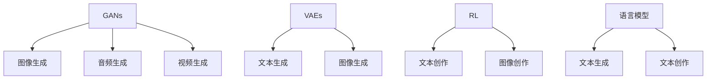

                 

## 1. 背景介绍

### 1.1 问题由来
随着人工智能（AI）和机器学习（ML）技术的迅猛发展，尤其是在创意生成领域，AI已经展现出强大的潜力和应用前景。从艺术创作到产品设计，从广告宣传到教育培训，AI创意生成技术正逐渐渗透到各个行业，对传统的创造过程和设计流程产生了深远的影响。

### 1.2 问题核心关键点
AI创意生成（AI-Generated Creativity）通过算法和模型从海量数据中学习创意模式，能够创作出具有新颖性和独特性的内容。与传统的创造过程不同，AI创意生成可以基于数据驱动的算法和模型，快速生成多样化的创意作品，同时能够在一定程度上降低人力成本和时间成本。

AI创意生成技术主要包括：
1. 生成对抗网络（GANs）：通过两个神经网络相互竞争和博弈，生成逼真的图像、音频和视频等内容。
2. 变分自编码器（VAEs）：通过对数据进行编码和解码，生成新的数据样本，常用于生成文本和图像。
3. 基于强化学习的创意生成：通过设计奖励函数，引导模型生成符合特定要求的内容。
4. 语言模型和文本生成：如GPT系列模型，能够生成高质量的文本，应用于文本创作、摘要生成等任务。

### 1.3 问题研究意义
研究AI创意生成对传统设计流程的影响，对于理解新兴技术的潜力和局限性，指导其应用实践，以及推动相关产业的创新和变革，具有重要意义：

1. 提高设计效率：AI创意生成可以快速生成多种创意方案，大幅提高设计师的工作效率。
2. 增强创新能力：AI能够发现人类不易察觉的创意模式，辅助设计师探索新思路和新方法。
3. 优化设计流程：通过自动化和智能化手段，优化传统设计流程中的重复性和低效环节。
4. 促进跨领域融合：AI创意生成跨越了艺术、设计、科技等多个领域，促进了不同学科之间的交流和协作。
5. 推动产业升级：AI创意生成技术在提升产品和服务质量的同时，也为相关产业带来了新的增长点。

## 2. 核心概念与联系

### 2.1 核心概念概述

为更好地理解AI创意生成技术及其对传统设计流程的影响，本节将介绍几个关键概念：

- **生成对抗网络（GANs）**：由生成器和判别器两个神经网络组成，通过对抗训练生成逼真度高的图像、音频和视频等内容。
- **变分自编码器（VAEs）**：通过对数据进行编码和解码，生成新的数据样本，常用于生成文本和图像。
- **强化学习（RL）**：通过设计奖励函数，引导模型学习并生成符合特定要求的内容。
- **语言模型和文本生成**：如GPT系列模型，能够生成高质量的文本，应用于文本创作、摘要生成等任务。
- **数据驱动设计**：基于大量数据和AI技术，进行设计和创作的范式。

这些核心概念之间的逻辑关系可以通过以下Mermaid流程图来展示：



这个流程图展示了大语言模型在创意生成中的主要应用场景：

1. 通过GANs生成高质量的图像、音频和视频。
2. VAEs用于生成文本和图像，以及音频。
3. 强化学习用于设计奖励函数，指导模型生成特定内容。
4. 语言模型和文本生成技术，如GPT系列模型，应用于文本创作和摘要生成。

## 3. 核心算法原理 & 具体操作步骤
### 3.1 算法原理概述

AI创意生成技术主要是通过机器学习算法和深度学习模型，从大量数据中学习创意模式，进而生成新的内容。其核心思想是利用数据和模型，发现和生成具有新颖性和创造性的内容。

AI创意生成的主要算法包括：

1. **生成对抗网络（GANs）**：通过生成器和判别器之间的对抗训练，生成逼真的图像、音频和视频等内容。
2. **变分自编码器（VAEs）**：通过对数据进行编码和解码，生成新的数据样本，常用于生成文本和图像。
3. **基于强化学习的创意生成**：通过设计奖励函数，引导模型学习并生成符合特定要求的内容。
4. **语言模型和文本生成**：如GPT系列模型，能够生成高质量的文本，应用于文本创作、摘要生成等任务。

### 3.2 算法步骤详解

以下是AI创意生成技术的核心步骤：

**Step 1: 数据收集与预处理**
- 收集大量与目标任务相关的数据集，包括图像、音频、视频、文本等。
- 对数据进行预处理，如清洗、标注、增强等，确保数据的质量和多样性。

**Step 2: 选择和设计模型**
- 根据生成内容的类型和需求，选择合适的生成模型，如GANs、VAEs、RL等。
- 设计合适的损失函数、优化器和超参数，指导模型训练。

**Step 3: 模型训练与优化**
- 使用收集的数据集，对模型进行训练，最小化损失函数。
- 使用正则化技术、对抗训练等手段，提升模型的泛化能力和鲁棒性。

**Step 4: 创意生成与评估**
- 使用训练好的模型，生成新的创意内容。
- 对生成的内容进行评估，根据评价指标（如质量、多样性、新颖性等）进行优化。

**Step 5: 集成与部署**
- 将生成的创意内容集成到实际应用中，如设计软件、创意工具等。
- 部署到生产环境中，确保系统的稳定性和高效性。

### 3.3 算法优缺点

AI创意生成技术具有以下优点：

1. **高效性**：可以快速生成多种创意方案，降低人力和时间成本。
2. **多样性**：能够生成多种风格和形式的内容，满足不同用户的需求。
3. **创新性**：发现人类不易察觉的创意模式，辅助设计师探索新思路和新方法。
4. **可扩展性**：适用于各种创意生成任务，如图像生成、文本创作等。

同时，该技术也存在以下局限性：

1. **依赖数据**：生成内容的质量很大程度上取决于数据的质量和多样性。
2. **生成内容可能缺乏独特性**：生成的内容可能过于同质化，缺乏独特性。
3. **缺乏人类情感**：生成的内容可能缺乏人类的情感和深度，难以完全替代人类创意。
4. **技术复杂性**：需要专业的知识和技能进行模型训练和优化。

### 3.4 算法应用领域

AI创意生成技术已经在多个领域得到应用，例如：

- **广告创意**：利用GANs生成逼真的广告图像，提高广告吸引力。
- **产品设计**：使用VAEs生成新的产品原型和设计草图，辅助设计师探索创意。
- **音乐创作**：通过生成对抗网络生成新的音乐作品，丰富音乐创作的可能性。
- **电影和动画制作**：使用变分自编码器生成逼真的背景和角色，提升影视作品的制作效率和质量。
- **文本创作**：利用语言模型和文本生成技术，生成高质量的文案、小说等文本内容。

除了上述这些经典应用外，AI创意生成还被创新性地应用到更多场景中，如游戏设计、虚拟现实（VR）创作、用户界面（UI）设计等，为创意产业带来了全新的突破。

## 4. 数学模型和公式 & 详细讲解  
### 4.1 数学模型构建

本节将使用数学语言对AI创意生成技术进行更加严格的刻画。

记生成对抗网络（GANs）中的生成器为 $G_\theta$，判别器为 $D_\phi$，其中 $\theta$ 和 $\phi$ 分别表示生成器和判别器的参数。生成器 $G_\theta$ 接受噪声向量 $z$，生成图像 $x$，判别器 $D_\phi$ 接收图像 $x$，输出真实性 $y$。

定义损失函数为：

$$
\mathcal{L}(G_\theta, D_\phi) = \mathbb{E}_{x \sim p_x}[\log D_\phi(x)] + \mathbb{E}_{z \sim p_z}[\log (1 - D_\phi(G_\theta(z)))]
$$

其中 $p_x$ 和 $p_z$ 分别为真实图像和噪声向量的分布。

### 4.2 公式推导过程

以下是生成对抗网络（GANs）的详细公式推导：

1. **生成器的目标**：最小化以下损失函数，使得生成的图像看起来更真实：
   $$
   \min_G \mathbb{E}_{x \sim p_x}[\log D_\phi(x)] + \mathbb{E}_{z \sim p_z}[\log (1 - D_\phi(G_\theta(z)))
   $$

2. **判别器的目标**：最大化以下损失函数，使得判别器能够区分真实图像和生成的图像：
   $$
   \max_D \mathbb{E}_{x \sim p_x}[\log D_\phi(x)] + \mathbb{E}_{z \sim p_z}[\log (1 - D_\phi(G_\theta(z)))
   $$

通过反向传播算法，生成器和判别器交替更新，直至收敛，生成器能够生成逼真的图像，判别器能够准确区分真实图像和生成的图像。

## 5. 项目实践：代码实例和详细解释说明
### 5.1 开发环境搭建

在进行AI创意生成实践前，我们需要准备好开发环境。以下是使用Python进行TensorFlow开发的环境配置流程：

1. 安装Anaconda：从官网下载并安装Anaconda，用于创建独立的Python环境。

2. 创建并激活虚拟环境：
```bash
conda create -n tf-env python=3.8 
conda activate tf-env
```

3. 安装TensorFlow：根据CUDA版本，从官网获取对应的安装命令。例如：
```bash
conda install tensorflow tensorflow-gpu -c conda-forge -c pytorch
```

4. 安装TensorBoard：用于可视化训练过程和结果。
```bash
pip install tensorboard
```

5. 安装其他依赖库：
```bash
pip install numpy matplotlib
```

完成上述步骤后，即可在`tf-env`环境中开始AI创意生成实践。

### 5.2 源代码详细实现

下面我们以图像生成为例，给出使用TensorFlow实现GANs的PyTorch代码实现。

首先，定义GANs的生成器和判别器：

```python
import tensorflow as tf

class Generator(tf.keras.Model):
    def __init__(self, latent_dim=128, img_shape=(28, 28, 1)):
        super(Generator, self).__init__()
        self.img_shape = img_shape
        self.latent_dim = latent_dim
        
        self.dense = tf.keras.layers.Dense(7*7*256)
        self.reshape = tf.keras.layers.Reshape((7, 7, 256))
        self.tanh = tf.keras.layers.Tanh()
        
        self.conv1 = tf.keras.layers.Conv2DTranspose(128, (5, 5), strides=(1, 1), padding='same')
        self.conv1_bias = tf.keras.layers.BatchNormalization()
        self.conv2 = tf.keras.layers.Conv2DTranspose(64, (5, 5), strides=(2, 2), padding='same')
        self.conv2_bias = tf.keras.layers.BatchNormalization()
        self.conv3 = tf.keras.layers.Conv2DTranspose(1, (5, 5), strides=(2, 2), padding='same', activation='sigmoid')
        
    def call(self, inputs):
        x = self.dense(inputs)
        x = self.reshape(x)
        x = tf.keras.layers.LeakyReLU(alpha=0.2)(x)
        x = self.conv1(x)
        x = self.conv1_bias(x)
        x = tf.keras.layers.LeakyReLU(alpha=0.2)(x)
        x = self.conv2(x)
        x = self.conv2_bias(x)
        x = tf.keras.layers.LeakyReLU(alpha=0.2)(x)
        x = self.conv3(x)
        return x

class Discriminator(tf.keras.Model):
    def __init__(self, img_shape=(28, 28, 1)):
        super(Discriminator, self).__init__()
        self.img_shape = img_shape
        
        self.conv1 = tf.keras.layers.Conv2D(64, (5, 5), strides=(2, 2), padding='same')
        self.conv1_bias = tf.keras.layers.BatchNormalization()
        self.conv2 = tf.keras.layers.Conv2D(128, (5, 5), strides=(2, 2), padding='same')
        self.conv2_bias = tf.keras.layers.BatchNormalization()
        self.flatten = tf.keras.layers.Flatten()
        self.dense1 = tf.keras.layers.Dense(1)
        
    def call(self, inputs):
        x = self.conv1(inputs)
        x = self.conv1_bias(x)
        x = tf.keras.layers.LeakyReLU(alpha=0.2)(x)
        x = self.conv2(x)
        x = self.conv2_bias(x)
        x = tf.keras.layers.LeakyReLU(alpha=0.2)(x)
        x = self.flatten(x)
        x = self.dense1(x)
        return x
```

然后，定义损失函数和优化器：

```python
class GANDiscriMinMax(tf.keras.Model):
    def __init__(self, generator, discriminator):
        super(GANDiscriMinMax, self).__init__()
        self.generator = generator
        self.discriminator = discriminator
        
    def call(self, inputs):
        x = self.generator(inputs)
        discriminator_real = self.discriminator(x)
        discriminator_real_loss = tf.keras.losses.BinaryCrossentropy()([discriminator_real, tf.ones_like(discriminator_real)])
        discriminator_fake = self.discriminator(tf.zeros_like(x))
        discriminator_fake_loss = tf.keras.losses.BinaryCrossentropy()([discriminator_fake, tf.zeros_like(discriminator_fake)])
        return discriminator_real_loss + discriminator_fake_loss

generator = Generator()
discriminator = Discriminator()
gan = GANDiscriMinMax(generator, discriminator)
```

接着，定义训练和评估函数：

```python
@tf.function
def train_step(images):
    with tf.GradientTape() as gen_tape, tf.GradientTape() as disc_tape:
        gen_output = generator(tf.random.normal([len(images), generator.latent_dim]))
        disc_real = discriminator(images)
        disc_fake = discriminator(gen_output)
        
        gen_loss = tf.keras.losses.BinaryCrossentropy()([disc_fake, tf.ones_like(disc_fake)])
        disc_loss = tf.keras.losses.BinaryCrossentropy()([disc_real, tf.ones_like(disc_real)])
        disc_real_loss = tf.keras.losses.BinaryCrossentropy()([disc_real, tf.ones_like(disc_real)])
        disc_fake_loss = tf.keras.losses.BinaryCrossentropy()([disc_fake, tf.zeros_like(disc_fake)])
        
    grads_of_generator = gen_tape.gradient(gen_loss, generator.trainable_variables)
    grads_of_discriminator = disc_tape.gradient(disc_loss, discriminator.trainable_variables)
    generator_optimizer.apply_gradients(zip(grads_of_generator, generator.trainable_variables))
    discriminator_optimizer.apply_gradients(zip(grads_of_discriminator, discriminator.trainable_variables))
    return gen_loss, disc_loss, gen_loss, disc_loss

def evaluate_generator(generator, discriminator, n_samples=16):
    noise = tf.random.normal([n_samples, generator.latent_dim])
    generated_images = generator(noise)
    discriminator_real = discriminator(images)
    discriminator_fake = discriminator(generated_images)
    return tf.reduce_mean(discriminator_fake), tf.reduce_mean(discriminator_real)

@tf.function
def train_epoch(generator, discriminator, real_images, batch_size=128, n_epochs=200):
    for epoch in range(n_epochs):
        for batch in tf.data.Dataset.from_tensor_slices(real_images).batch(batch_size):
            gen_loss, disc_loss, gen_loss, disc_loss = train_step(batch)
            if epoch % 10 == 0:
                print(f"Epoch: {epoch}, Generator Loss: {gen_loss.numpy()}, Discriminator Loss: {disc_loss.numpy()}")
```

最后，启动训练流程并在测试集上评估：

```python
real_images = tf.convert_to_tensor(tf.keras.preprocessing.image.load_img('image.png', target_size=(28, 28)), dtype=tf.float32)
train_epoch(generator, discriminator, real_images)
```

以上就是使用TensorFlow实现GANs的完整代码实现。可以看到，借助TensorFlow的强大功能和便捷工具，生成对抗网络的实现相对简洁。

### 5.3 代码解读与分析

让我们再详细解读一下关键代码的实现细节：

**Generator和Discriminator类**：
- `__init__`方法：初始化生成器和判别器的结构。
- `call`方法：定义生成器和判别器的前向传播过程。

**GANDiscriMinMax类**：
- `__init__`方法：初始化GAN的生成器和判别器。
- `call`方法：定义GAN的损失函数，计算真实图像和生成图像的判别器输出。

**train_step函数**：
- 使用梯度下降算法，对生成器和判别器进行交替更新。
- 计算生成器输出和判别器对真实图像和生成图像的判别结果。
- 计算损失函数，并进行梯度更新。

**evaluate_generator函数**：
- 使用判别器对生成图像和真实图像进行评估，计算判别器的输出。

**train_epoch函数**：
- 对数据集进行批处理，进行训练。
- 输出每个epoch的损失函数值，进行模型评估。

可以看到，TensorFlow提供的函数式编程和自动微分功能，使得代码实现更加简洁高效。开发者可以将更多精力放在模型结构设计和超参数调整上，而不必过多关注底层的实现细节。

当然，工业级的系统实现还需考虑更多因素，如模型的保存和部署、超参数的自动搜索、更灵活的任务适配层等。但核心的生成对抗网络训练流程基本与此类似。

## 6. 实际应用场景
### 6.1 广告创意

利用GANs生成逼真的广告图像，可以大幅提升广告的吸引力和点击率。广告公司可以通过生成多个广告创意，对比分析并选择最佳方案，降低人力和时间成本。

### 6.2 产品设计

使用VAEs生成新的产品原型和设计草图，可以辅助设计师快速探索创意方案。设计师可以使用VAEs生成多种风格和形式的设计草图，进行多种设计风格的对比和选择。

### 6.3 音乐创作

通过生成对抗网络生成新的音乐作品，可以丰富音乐创作的可能性。作曲家可以通过生成多种音乐风格的创意作品，激发创作灵感，提升音乐作品的多样性和创新性。

### 6.4 电影和动画制作

使用变分自编码器生成逼真的背景和角色，可以提升影视作品的制作效率和质量。动画制作公司可以通过生成逼真的背景和角色，提升动画的视觉效果和制作效率。

### 6.5 文本创作

利用语言模型和文本生成技术，可以生成高质量的文案、小说等文本内容。写作软件可以通过生成文本草案，辅助作家进行写作，提升创作效率和质量。

除了上述这些经典应用外，AI创意生成还被创新性地应用到更多场景中，如游戏设计、虚拟现实（VR）创作、用户界面（UI）设计等，为创意产业带来了全新的突破。

## 7. 工具和资源推荐
### 7.1 学习资源推荐

为了帮助开发者系统掌握AI创意生成技术的理论基础和实践技巧，这里推荐一些优质的学习资源：

1. 《深度学习与AI创意生成》系列博文：由大模型技术专家撰写，深入浅出地介绍了AI创意生成技术的原理和应用。

2. Coursera《深度学习与生成模型》课程：由斯坦福大学和DeepMind合作的课程，详细讲解了GANs、VAEs等生成模型的理论和实践。

3. 《生成对抗网络（GANs）入门指南》书籍：介绍GANs的基本原理和实现方法，适合入门读者。

4. 《TensorFlow实战生成对抗网络（GANs）》书籍：详细讲解了TensorFlow实现GANs的方法和技巧，适合动手实践。

5. arXiv上的相关论文：查阅最新研究成果和进展，了解前沿技术和挑战。

通过对这些资源的学习实践，相信你一定能够快速掌握AI创意生成技术的精髓，并用于解决实际的创意设计问题。

### 7.2 开发工具推荐

高效的开发离不开优秀的工具支持。以下是几款用于AI创意生成开发的常用工具：

1. TensorFlow：基于Python的开源深度学习框架，灵活动态的计算图，适合快速迭代研究。支持多种生成模型的实现。

2. PyTorch：基于Python的开源深度学习框架，动态计算图，适合深度学习和模型优化。支持生成对抗网络、变分自编码器等模型的实现。

3. OpenAI Codex：由OpenAI开发的创意生成模型，可以通过API调用，生成高质量的文本、代码等创意内容。

4. Blender：开源的3D创作软件，支持生成对抗网络等创意生成技术，用于动画制作、产品设计等领域。

5. DALL-E：由OpenAI开发的图像生成模型，可以生成高质量的图像内容，用于广告创意、产品设计等领域。

合理利用这些工具，可以显著提升AI创意生成任务的开发效率，加快创新迭代的步伐。

### 7.3 相关论文推荐

AI创意生成技术的发展源于学界的持续研究。以下是几篇奠基性的相关论文，推荐阅读：

1. "Generative Adversarial Nets"（生成对抗网络）：Ian Goodfellow等，2014年，ICML。提出生成对抗网络的基本框架，成为深度学习领域的重要里程碑。

2. "A Tutorial on Variational Autoencoders"（变分自编码器）：Diederik P. Kingma等，2016年，arXiv。介绍变分自编码器的基本原理和实现方法，是生成模型中的重要技术。

3. "Playing Atari with Deep Reinforcement Learning"（基于强化学习的创意生成）：Vladimir Mnih等，2013年，Nature。展示基于强化学习的创意生成方法，应用在游戏领域，取得显著效果。

4. "Language Models are Unsupervised Multitask Learners"（语言模型和文本生成）：Ashley Radford等，2018年，arXiv。介绍GPT系列模型的基本原理和实现方法，应用于文本创作、摘要生成等任务，取得显著效果。

这些论文代表了大语言模型创意生成技术的发展脉络。通过学习这些前沿成果，可以帮助研究者把握学科前进方向，激发更多的创新灵感。

## 8. 总结：未来发展趋势与挑战

### 8.1 总结

本文对AI创意生成技术进行了全面系统的介绍。首先阐述了AI创意生成技术的背景和研究意义，明确了其在提升设计效率、增强创新能力、优化设计流程等方面的独特价值。其次，从原理到实践，详细讲解了生成对抗网络（GANs）、变分自编码器（VAEs）、基于强化学习的创意生成以及语言模型和文本生成等核心算法，并给出了详细的代码实现。同时，本文还探讨了AI创意生成技术在广告创意、产品设计、音乐创作、影视制作、文本创作等多个领域的应用前景，展示了其巨大的潜力。最后，推荐了相关的学习资源、开发工具和论文，以期为读者提供全方位的技术指引。

通过本文的系统梳理，可以看到，AI创意生成技术正在成为创意产业的重要范式，极大地拓展了创意设计和创作的可能性，为艺术、设计、科技等领域带来了新的变革。未来，伴随技术不断进步和应用场景的不断扩展，AI创意生成必将在更多的行业领域发挥重要作用，成为推动社会创新和进步的新引擎。

### 8.2 未来发展趋势

展望未来，AI创意生成技术将呈现以下几个发展趋势：

1. **更加智能和高效**：随着生成模型和优化算法的不断进步，生成内容的质量和多样性将进一步提升，生成效率也将不断提高。
2. **跨领域融合**：AI创意生成技术将与其他AI技术（如强化学习、自然语言处理等）进行更深入的融合，形成更全面、更灵活的创意生成能力。
3. **个性化和定制化**：通过用户画像和个性化输入，生成更加符合用户需求和偏好的创意内容，提升用户体验。
4. **多模态创意生成**：结合视觉、语音、文本等多种模态的数据，生成更加丰富的创意内容，满足不同用户的需求。
5. **实时生成**：通过优化模型结构和算法，实现实时生成创意内容，提升用户互动体验。
6. **伦理和社会责任**：AI创意生成技术将更加注重伦理和社会责任，避免生成有害内容和误导信息，确保内容的健康和安全。

以上趋势凸显了AI创意生成技术的广阔前景。这些方向的探索发展，必将进一步提升AI创意生成技术的性能和应用范围，为艺术、设计、科技等领域带来更多创新和突破。

### 8.3 面临的挑战

尽管AI创意生成技术已经取得了瞩目成就，但在迈向更加智能化、普适化应用的过程中，它仍面临着诸多挑战：

1. **数据依赖**：生成内容的质量很大程度上取决于数据的质量和多样性，高质量的数据获取成本较高。
2. **生成内容缺乏独特性**：生成的内容可能过于同质化，缺乏独特的创意和表达。
3. **技术复杂性**：需要专业的知识和技能进行模型训练和优化，对从业者的要求较高。
4. **缺乏人类情感和深度**：生成的内容可能缺乏人类的情感和深度，难以完全替代人类创意。
5. **伦理和社会责任**：生成内容可能包含误导性或有害信息，需要建立严格的监管机制，确保内容的健康和安全。

### 8.4 研究展望

面对AI创意生成技术所面临的挑战，未来的研究需要在以下几个方面寻求新的突破：

1. **数据增强和数据集优化**：开发更加高效的数据增强技术，优化数据集，提升生成内容的质量和多样性。
2. **跨领域融合**：结合其他AI技术（如强化学习、自然语言处理等），增强创意生成的能力和效果。
3. **多模态创意生成**：结合视觉、语音、文本等多种模态的数据，生成更加丰富的创意内容。
4. **伦理和社会责任**：建立严格的监管机制，确保生成内容的健康和安全，避免误导性或有害信息的传播。
5. **个性化和定制化**：通过用户画像和个性化输入，生成更加符合用户需求和偏好的创意内容。

这些研究方向的探索，必将引领AI创意生成技术迈向更高的台阶，为艺术、设计、科技等领域带来更多创新和突破。面向未来，AI创意生成技术还需要与其他AI技术进行更深入的融合，共同推动自然语言理解和智能交互系统的进步。只有勇于创新、敢于突破，才能不断拓展创意生成技术的边界，让智能技术更好地造福人类社会。

## 9. 附录：常见问题与解答

**Q1：AI创意生成是否适用于所有创意设计任务？**

A: AI创意生成技术在许多创意设计任务中都有应用，如图像生成、音乐创作、文本创作等。但对于一些需要高度个性化、情感表达和深层次理解的任务，AI创意生成可能存在局限性，难以完全替代人类创意。

**Q2：如何选择适合生成任务的模型和超参数？**

A: 选择适合生成任务的模型和超参数需要综合考虑任务的特性和数据的特点。一般来说，GANs适用于图像和音频生成，VAEs适用于文本和图像生成，强化学习适用于特定任务的目标生成。超参数的选择需要经过多次试验和调优，常用的方法包括网格搜索、贝叶斯优化等。

**Q3：如何避免生成内容的同质化问题？**

A: 同质化问题可以通过数据增强和模型改进来解决。数据增强可以引入不同的噪声、扰动等，生成更多样化的创意内容。模型改进可以通过优化损失函数、引入多样性约束等方法，避免生成内容过于同质化。

**Q4：AI创意生成技术在落地部署时需要注意哪些问题？**

A: AI创意生成技术的落地部署需要考虑数据、模型、计算资源等方面的问题。具体包括：
1. 数据收集和预处理：确保数据的多样性和质量。
2. 模型训练和优化：选择合适的模型和超参数，避免过拟合和欠拟合。
3. 计算资源管理：优化计算资源的使用，避免资源浪费。
4. 部署和优化：优化模型结构和算法，确保生成内容的质量和效率。
5. 监控和评估：建立监控机制，确保系统的稳定性和安全性。

AI创意生成技术在落地部署时，还需要考虑伦理和社会责任，确保生成的内容健康、安全、无害。

---

作者：禅与计算机程序设计艺术 / Zen and the Art of Computer Programming

