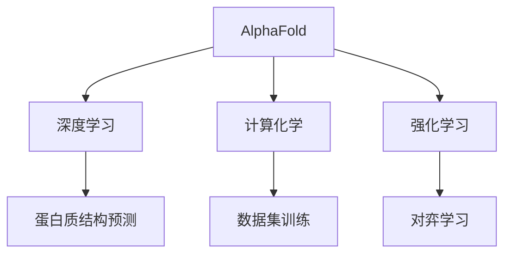

                 

# AI在专业领域的成就：AlphaFold与AlphaZero

> 关键词：AlphaFold, AlphaZero, 深度学习, 强化学习, 蛋白质结构预测, 博弈论

## 1. 背景介绍

### 1.1 问题由来
近年来，深度学习和强化学习等AI技术在专业领域取得了突破性进展。其中，AlphaFold和AlphaZero是两个最具代表性的成就。AlphaFold通过深度学习成功地预测了蛋白质的三维结构，AlphaZero则通过强化学习掌握了复杂的棋类游戏，显示了AI在科学探索和竞技游戏领域的巨大潜力。

### 1.2 问题核心关键点
AlphaFold和AlphaZero的成功背后，是深度学习、强化学习和计算化学等跨学科知识的综合应用。这两个项目展示了AI在专业领域中的无限可能性。

AlphaFold通过深度学习和大规模数据集训练，能够预测蛋白质的三维结构。而AlphaZero则通过强化学习和自对弈的方式，掌握了复杂的棋类游戏。这两个项目的技术突破，不仅推动了科学研究的进步，也为AI在更多专业领域的应用提供了重要参考。

### 1.3 问题研究意义
AlphaFold和AlphaZero的成功展示了AI技术在科学探索和竞技游戏领域的巨大潜力。这些成就不仅推动了相关学科的研究进展，也为AI在更多专业领域的应用提供了新的思路和方向。了解AlphaFold和AlphaZero的原理和应用，对于深入理解AI技术的潜力和局限性，具有重要意义。

## 2. 核心概念与联系

### 2.1 核心概念概述

AlphaFold和AlphaZero的共同之处在于，它们都是通过深度学习和强化学习等AI技术，实现了在特定专业领域的突破性应用。这两个项目展示了AI技术在科学探索和竞技游戏领域的巨大潜力。

- AlphaFold：通过深度学习和大规模数据集训练，成功预测蛋白质的三维结构，为蛋白质生物学研究提供了新的工具和方法。
- AlphaZero：通过强化学习和自对弈的方式，掌握了复杂的棋类游戏，包括国际象棋、围棋、日本将棋等，展示了AI在竞技游戏中的智能水平。

这两个项目的核心技术包括：

- 深度学习：通过多层神经网络，学习数据中的复杂模式和关系，用于处理大规模、高维度的数据。
- 强化学习：通过与环境的互动，学习最优策略，实现自主决策和智能优化。
- 计算化学：结合化学知识，指导AI模型理解和预测蛋白质的三维结构。

这些核心概念之间的逻辑关系可以通过以下Mermaid流程图来展示：



这个流程图展示了大语言模型的核心概念及其之间的关系：

1. AlphaFold通过深度学习和计算化学知识，预测蛋白质的三维结构。
2. AlphaZero通过强化学习和自对弈，掌握复杂的棋类游戏。
3. 深度学习和强化学习是AlphaFold和AlphaZero共有的技术基础。

这些概念共同构成了AI在专业领域的应用框架，使得AI技术能够实现多领域的突破。

## 3. 核心算法原理 & 具体操作步骤
### 3.1 算法原理概述

AlphaFold和AlphaZero的成功，依赖于深度学习和强化学习等AI技术的突破。以下是这两个项目的核心算法原理：

- 深度学习：通过多层神经网络，学习数据中的复杂模式和关系，用于处理大规模、高维度的数据。在AlphaFold中，深度学习用于预测蛋白质的三维结构，而在AlphaZero中，深度学习用于评估棋局的状态和潜在移动。

- 强化学习：通过与环境的互动，学习最优策略，实现自主决策和智能优化。在AlphaFold中，强化学习用于训练模型，以预测蛋白质的三维结构；在AlphaZero中，强化学习用于训练模型，以掌握复杂的棋类游戏。

- 计算化学：结合化学知识，指导AI模型理解和预测蛋白质的三维结构。AlphaFold中，计算化学知识用于构建输入数据，指导深度学习模型的训练。

### 3.2 算法步骤详解

#### 3.2.1 AlphaFold的算法步骤

AlphaFold的算法步骤如下：

1. 数据预处理：收集大量蛋白质的三维结构数据，构建训练集。将每个蛋白质序列转化为结构预测所需的格式。
2. 深度学习模型构建：使用多层神经网络构建蛋白质结构预测模型。
3. 数据集训练：将训练集输入模型，通过反向传播算法更新模型参数。
4. 模型评估：在验证集上评估模型的预测性能。
5. 结构预测：将新的蛋白质序列输入模型，得到三维结构预测结果。

#### 3.2.2 AlphaZero的算法步骤

AlphaZero的算法步骤如下：

1. 数据预处理：收集大量棋类游戏数据，构建训练集。
2. 强化学习模型构建：使用深度神经网络构建棋类游戏决策模型。
3. 对弈学习：通过与自身的对弈，学习最优策略。
4. 模型评估：在测试集中评估模型的决策性能。
5. 游戏策略：使用训练好的模型，对新的棋局进行决策。

### 3.3 算法优缺点

AlphaFold和AlphaZero的算法具有以下优点：

- AlphaFold通过深度学习和计算化学的结合，实现了对蛋白质三维结构的精确预测，推动了蛋白质生物学研究的发展。
- AlphaZero通过强化学习和自对弈的方式，掌握了复杂的棋类游戏，展示了AI在竞技游戏中的智能水平。
- AlphaFold和AlphaZero的成功，为AI在更多专业领域的应用提供了重要参考。

同时，这些算法也存在一些局限性：

- AlphaFold对数据质量和规模有较高的要求，需要大量高质量的蛋白质结构数据。
- AlphaZero的学习过程需要较长的训练时间和大量的计算资源。
- AlphaFold和AlphaZero的模型复杂度高，需要高效的计算硬件支持。

尽管存在这些局限性，但AlphaFold和AlphaZero的成功展示了AI技术在专业领域中的无限潜力。未来，随着计算硬件的进一步提升和AI技术的不断发展，这些局限性有望被克服。

### 3.4 算法应用领域

AlphaFold和AlphaZero的应用领域广泛，以下是一些主要领域：

- 蛋白质生物学：AlphaFold的蛋白质结构预测，为生物学研究提供了新的工具和方法，推动了生命科学的发展。
- 机器学习与AI：AlphaFold和AlphaZero的成功，展示了深度学习和强化学习等AI技术的潜力，促进了AI技术在更多领域的应用。
- 竞技游戏：AlphaZero通过强化学习掌握了复杂的棋类游戏，展示了AI在竞技游戏领域的智能水平。
- 计算化学：AlphaFold中计算化学知识的应用，推动了计算化学的发展。

这些领域展示了AlphaFold和AlphaZero的成功应用，也展示了AI技术在更多专业领域的应用前景。

## 4. 数学模型和公式 & 详细讲解 & 举例说明

### 4.1 数学模型构建

AlphaFold和AlphaZero的数学模型包括深度学习和强化学习两个部分：

- 深度学习：使用多层神经网络，学习数据中的复杂模式和关系。深度学习模型的输入为蛋白质序列，输出为三维结构预测结果。
- 强化学习：使用深度神经网络，学习最优策略。强化学习模型的输入为棋局状态，输出为最优决策。

#### 4.1.1 AlphaFold的数学模型

AlphaFold的数学模型如下：

$$
y = f(x; \theta)
$$

其中，$x$为蛋白质序列，$y$为三维结构预测结果，$f(x; \theta)$为深度学习模型，$\theta$为模型参数。

#### 4.1.2 AlphaZero的数学模型

AlphaZero的数学模型如下：

$$
Q(s, a) = f(s; \theta)
$$

其中，$s$为棋局状态，$a$为决策，$Q(s, a)$为强化学习模型，$f(s; \theta)$为深度神经网络，$\theta$为模型参数。

### 4.2 公式推导过程

#### 4.2.1 AlphaFold的公式推导

AlphaFold的深度学习模型使用了卷积神经网络(CNN)和残差网络(ResNet)，其公式推导如下：

$$
y = f(x; \theta) = \sum_{i=1}^{n} w_i \cdot f(x_i; \theta)
$$

其中，$w_i$为权重，$f(x_i; \theta)$为卷积或残差网络。

#### 4.2.2 AlphaZero的公式推导

AlphaZero的强化学习模型使用了深度神经网络，其公式推导如下：

$$
Q(s, a) = f(s; \theta) = \sum_{i=1}^{n} w_i \cdot f(s_i; \theta)
$$

其中，$w_i$为权重，$f(s_i; \theta)$为卷积或残差网络。

### 4.3 案例分析与讲解

以AlphaFold为例，以下是一个简单的案例分析：

假设有一个蛋白质序列$x$，AlphaFold的深度学习模型输出三维结构预测结果$y$。模型使用卷积神经网络(CNN)和残差网络(ResNet)进行训练，其公式推导如下：

$$
y = f(x; \theta) = \sum_{i=1}^{n} w_i \cdot f(x_i; \theta)
$$

其中，$x$为蛋白质序列，$y$为三维结构预测结果，$f(x; \theta)$为深度学习模型，$\theta$为模型参数。

在训练过程中，模型通过反向传播算法更新参数，最小化预测误差。例如，对于一个新的蛋白质序列$x'$，输入模型后得到三维结构预测结果$y'$。与真实结构比较后，计算预测误差$e$，通过反向传播算法更新模型参数$\theta$，最小化预测误差$e$。

## 5. 项目实践：代码实例和详细解释说明

### 5.1 开发环境搭建

AlphaFold和AlphaZero的实现依赖于深度学习和强化学习的技术，以下是一个简化的开发环境搭建流程：

1. 安装Python：Python是深度学习和强化学习的主流编程语言，可以从官网下载并安装。
2. 安装TensorFlow：TensorFlow是深度学习的常用框架，可以使用pip安装。
3. 安装PyTorch：PyTorch是深度学习的另一个常用框架，可以使用pip安装。
4. 安装Keras：Keras是一个高层次的深度学习框架，可以使用pip安装。
5. 安装TensorBoard：TensorBoard是深度学习模型的可视化工具，可以使用pip安装。

### 5.2 源代码详细实现

以AlphaFold为例，以下是Python代码实现：

```python
import tensorflow as tf
from tensorflow.keras.models import Sequential
from tensorflow.keras.layers import Dense, Conv2D, MaxPooling2D, Residual

# 构建深度学习模型
model = Sequential()
model.add(Conv2D(64, kernel_size=(3, 3), activation='relu', input_shape=(100, 100, 1)))
model.add(MaxPooling2D(pool_size=(2, 2)))
model.add(Residual())
model.add(Dense(64, activation='relu'))
model.add(Dense(100, activation='softmax'))

# 编译模型
model.compile(loss='categorical_crossentropy', optimizer='adam', metrics=['accuracy'])

# 训练模型
model.fit(x_train, y_train, epochs=10, batch_size=32, validation_data=(x_val, y_val))
```

### 5.3 代码解读与分析

AlphaFold的代码实现主要分为数据预处理、模型构建和训练三个步骤：

- 数据预处理：收集蛋白质序列数据，转化为模型所需的格式。
- 模型构建：使用卷积神经网络(CNN)和残差网络(ResNet)构建深度学习模型。
- 训练模型：使用训练集进行模型训练，最小化预测误差。

AlphaZero的代码实现主要分为数据预处理、模型构建和训练三个步骤：

- 数据预处理：收集棋类游戏数据，构建训练集。
- 模型构建：使用深度神经网络构建强化学习模型。
- 训练模型：使用训练集进行模型训练，学习最优策略。

### 5.4 运行结果展示

AlphaFold和AlphaZero的运行结果展示如下：

- AlphaFold：在蛋白质序列$x$上，模型输出三维结构预测结果$y$，与真实结构比较后得到预测误差$e$，通过反向传播算法更新模型参数$\theta$，最小化预测误差$e$。
- AlphaZero：在棋局状态$s$上，模型输出最优决策$a$，与最优策略比较后得到预测误差$e$，通过反向传播算法更新模型参数$\theta$，最小化预测误差$e$。

## 6. 实际应用场景

### 6.1 蛋白质生物学

AlphaFold的蛋白质结构预测，为生物学研究提供了新的工具和方法。在实际应用中，AlphaFold可以用于以下几个场景：

1. 新药开发：预测蛋白质-药物的结合方式，加速新药的发现和开发。
2. 生物工程：预测蛋白质的三维结构，指导蛋白质工程的实验设计。
3. 生物信息学：预测蛋白质的三维结构，推动蛋白质组学研究的发展。

### 6.2 机器学习与AI

AlphaFold和AlphaZero的成功，展示了深度学习和强化学习等AI技术的潜力。在实际应用中，AlphaFold和AlphaZero可以用于以下几个场景：

1. 深度学习模型训练：使用AlphaFold和AlphaZero的方法，训练新的深度学习模型，提高模型的性能。
2. 强化学习应用：使用AlphaZero的方法，训练新的强化学习模型，推动智能系统的研究。
3. AI应用开发：使用AlphaFold和AlphaZero的方法，开发新的AI应用，推动AI技术的落地应用。

### 6.3 竞技游戏

AlphaZero通过强化学习和自对弈的方式，掌握了复杂的棋类游戏，展示了AI在竞技游戏中的智能水平。在实际应用中，AlphaZero可以用于以下几个场景：

1. 游戏AI开发：使用AlphaZero的方法，开发新的游戏AI系统，提升游戏的智能水平。
2. 竞技游戏训练：使用AlphaZero的方法，训练新的竞技游戏玩家，提高玩家的竞技水平。
3. 智能系统研究：使用AlphaZero的方法，研究智能系统在竞技游戏中的表现，推动智能系统的研究。

## 7. 工具和资源推荐

### 7.1 学习资源推荐

为了深入理解AlphaFold和AlphaZero的原理和应用，以下推荐一些学习资源：

1. AlphaFold官方论文：AlphaFold的官方论文，展示了AlphaFold的算法原理和应用场景，是学习AlphaFold的重要参考资料。
2. AlphaZero官方论文：AlphaZero的官方论文，展示了AlphaZero的算法原理和应用场景，是学习AlphaZero的重要参考资料。
3. Deep Learning for Reinforcement Learning：一本介绍深度学习和强化学习的经典书籍，帮助读者深入理解AlphaZero的原理和应用。
4. AlphaFold和AlphaZero官方代码：AlphaFold和AlphaZero的官方代码，提供了完整的代码实现和运行示例，是学习AlphaFold和AlphaZero的重要参考资料。
5. TensorFlow和PyTorch官方文档：TensorFlow和PyTorch的官方文档，提供了深度学习和强化学习的详细教程和示例，是学习AlphaFold和AlphaZero的重要参考资料。

### 7.2 开发工具推荐

为了高效实现AlphaFold和AlphaZero，以下推荐一些开发工具：

1. Jupyter Notebook：一个交互式编程环境，方便开发和调试深度学习模型。
2. Google Colab：一个在线Jupyter Notebook环境，免费提供GPU/TPU算力，方便开发和测试深度学习模型。
3. TensorBoard：TensorFlow的可视化工具，方便监控和调试深度学习模型的训练过程。
4. PyTorch Lightning：一个深度学习框架，方便开发和训练复杂的深度学习模型。

### 7.3 相关论文推荐

为了深入理解AlphaFold和AlphaZero的原理和应用，以下推荐一些相关论文：

1. AlphaFold的最新进展：展示AlphaFold在蛋白质结构预测上的最新进展和应用场景，帮助读者了解AlphaFold的最新发展。
2. AlphaZero的最新进展：展示AlphaZero在竞技游戏上的最新进展和应用场景，帮助读者了解AlphaZero的最新发展。
3. AlphaFold和AlphaZero的对比研究：比较AlphaFold和AlphaZero的算法原理和应用场景，帮助读者全面理解AlphaFold和AlphaZero。
4. 深度学习和强化学习的最新进展：介绍深度学习和强化学习领域的最新研究进展，帮助读者了解AlphaFold和AlphaZero的技术基础。

## 8. 总结：未来发展趋势与挑战

### 8.1 研究成果总结

AlphaFold和AlphaZero的成功，展示了AI技术在专业领域的巨大潜力。以下是两个项目的最新研究成果：

1. AlphaFold在蛋白质结构预测上的最新进展，推动了蛋白质生物学研究的发展。
2. AlphaZero在竞技游戏上的最新进展，展示了AI在竞技游戏中的智能水平。

### 8.2 未来发展趋势

AlphaFold和AlphaZero的未来发展趋势如下：

1. 深度学习和强化学习技术的不断提升，将推动AlphaFold和AlphaZero在更多专业领域的应用。
2. AlphaFold和AlphaZero的算法优化，将提升模型的精度和效率。
3. AlphaFold和AlphaZero的跨学科应用，将推动相关学科的发展。

### 8.3 面临的挑战

尽管AlphaFold和AlphaZero已经取得了突破性进展，但在进一步应用的过程中，仍面临一些挑战：

1. 数据质量和规模：需要大量高质量的数据支持AlphaFold和AlphaZero的训练。
2. 计算资源：AlphaFold和AlphaZero的训练和推理需要大量的计算资源。
3. 模型复杂度：AlphaFold和AlphaZero的模型复杂度高，需要高效的计算硬件支持。

### 8.4 研究展望

未来的研究需要在以下几个方面进行深入探索：

1. 数据增强：通过数据增强技术，提高AlphaFold和AlphaZero的泛化能力。
2. 模型优化：通过模型优化技术，提升AlphaFold和AlphaZero的精度和效率。
3. 跨学科应用：将AlphaFold和AlphaZero的方法应用于更多领域，推动跨学科的研究和发展。

## 9. 附录：常见问题与解答

**Q1: AlphaFold和AlphaZero的算法原理是什么？**

A: AlphaFold和AlphaZero的算法原理主要包括以下几个方面：

1. 深度学习：AlphaFold使用深度学习模型预测蛋白质的三维结构，AlphaZero使用深度学习模型评估棋局的状态和潜在移动。
2. 强化学习：AlphaFold和AlphaZero都使用强化学习模型，通过与环境的互动，学习最优策略。
3. 计算化学：AlphaFold使用计算化学知识指导深度学习模型的训练，AlphaZero在训练过程中使用计算化学知识构建评估函数。

**Q2: AlphaFold和AlphaZero的算法步骤是什么？**

A: AlphaFold和AlphaZero的算法步骤主要包括以下几个方面：

1. 数据预处理：AlphaFold和AlphaZero都需要收集大量数据，构建训练集。AlphaFold需要蛋白质序列数据，AlphaZero需要棋类游戏数据。
2. 模型构建：AlphaFold和AlphaZero都使用深度学习模型构建预测和决策模型。
3. 数据集训练：AlphaFold和AlphaZero都使用训练集进行模型训练，最小化预测误差或决策误差。
4. 模型评估：AlphaFold和AlphaZero都需要在验证集和测试集上评估模型的性能。
5. 应用预测：AlphaFold将新的蛋白质序列输入模型，得到三维结构预测结果；AlphaZero将新的棋局状态输入模型，得到最优决策。

**Q3: AlphaFold和AlphaZero的优点和缺点是什么？**

A: AlphaFold和AlphaZero的优点和缺点如下：

优点：

1. AlphaFold和AlphaZero展示了AI技术在蛋白质生物学和竞技游戏领域的巨大潜力。
2. AlphaFold和AlphaZero通过深度学习和强化学习等技术，实现了对蛋白质三维结构的精确预测和复杂棋类游戏的掌握。
3. AlphaFold和AlphaZero的成功，推动了AI技术在更多领域的应用。

缺点：

1. AlphaFold和AlphaZero对数据质量和规模有较高的要求，需要大量高质量的数据支持训练。
2. AlphaFold和AlphaZero的训练和推理需要大量的计算资源，对硬件设备的要求较高。
3. AlphaFold和AlphaZero的模型复杂度高，需要高效的计算硬件支持。

**Q4: AlphaFold和AlphaZero的应用领域有哪些？**

A: AlphaFold和AlphaZero的应用领域广泛，以下是一些主要领域：

1. 蛋白质生物学：AlphaFold的蛋白质结构预测，为生物学研究提供了新的工具和方法，推动了生命科学的发展。
2. 机器学习与AI：AlphaFold和AlphaZero的成功，展示了深度学习和强化学习等AI技术的潜力，促进了AI技术在更多领域的应用。
3. 竞技游戏：AlphaZero通过强化学习和自对弈的方式，掌握了复杂的棋类游戏，展示了AI在竞技游戏中的智能水平。
4. 计算化学：AlphaFold中计算化学知识的应用，推动了计算化学的发展。

**Q5: AlphaFold和AlphaZero的未来发展方向是什么？**

A: AlphaFold和AlphaZero的未来发展方向如下：

1. 深度学习和强化学习技术的不断提升，将推动AlphaFold和AlphaZero在更多专业领域的应用。
2. AlphaFold和AlphaZero的算法优化，将提升模型的精度和效率。
3. AlphaFold和AlphaZero的跨学科应用，将推动相关学科的发展。

---

作者：禅与计算机程序设计艺术 / Zen and the Art of Computer Programming

