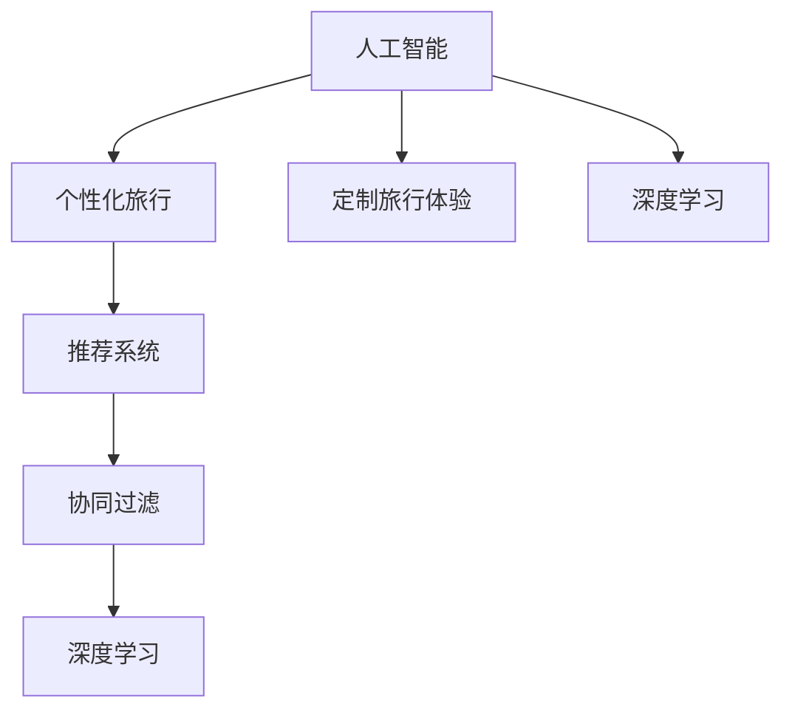

                 

# AI在个性化旅游规划中的应用：定制旅行体验

> 关键词：人工智能,个性化旅行,定制旅行体验,推荐系统,协同过滤,深度学习

## 1. 背景介绍

### 1.1 问题由来
随着生活水平的提升和假期的增多，越来越多的人开始追求个性化的旅行体验。传统的旅游规划往往依托于旅行社或旅行网站，需要消费者自己从海量的旅游资源中筛选，无法根据个人的兴趣和需求定制行程，导致用户体验低下，旅行满意度不高。而人工智能技术的兴起，特别是深度学习和大数据技术的发展，为实现个性化旅游规划提供了新的可能性。通过引入AI技术，可以构建智能推荐系统，根据用户的历史旅行记录、兴趣偏好、预算限制等，为用户推荐个性化的旅行方案，实现从“点到点”的智能定制服务。

### 1.2 问题核心关键点
实现个性化旅游规划的核心关键点包括：

- **用户画像构建**：通过分析用户的旅行历史数据和社交网络数据，构建详细的用户画像，了解用户的兴趣偏好、旅行风格等。
- **数据融合与处理**：将用户的旅行记录、社交媒体数据、天气预报等多源数据进行融合，处理成模型需要的结构化数据。
- **协同过滤推荐算法**：构建基于用户行为和物品属性的协同过滤推荐算法，为用户提供个性化的旅行方案。
- **深度学习模型训练**：利用深度学习模型对旅行资源进行全面建模，提升推荐的精准度。
- **实时响应与动态更新**：实时响应用户的查询请求，并根据用户的反馈和最新的旅行资源动态更新推荐结果。

### 1.3 问题研究意义
构建基于AI的个性化旅游规划系统，具有以下重要意义：

- **提升用户体验**：通过智能推荐系统，用户可以获得更加贴合自身需求的旅行方案，提升旅行体验。
- **提高效率与效率**：减少用户自己筛选旅游资源的时间和精力，提高旅游规划的效率。
- **促进消费增长**：通过精准的推荐，增加用户满意度和忠诚度，促进旅游消费的持续增长。
- **推动行业变革**：个性化推荐技术的应用，将推动传统旅游行业的数字化转型，提升整个行业的竞争力。

## 2. 核心概念与联系

### 2.1 核心概念概述

为更好地理解个性化旅游规划的AI技术实现，本节将介绍几个密切相关的核心概念：

- **人工智能(AI)**：通过机器学习、深度学习等算法，使计算机系统具备类似人类的感知、学习、推理等智能行为。
- **个性化旅行**：根据用户的个性化需求和偏好，为用户量身定制的旅行方案。
- **定制旅行体验**：通过AI技术，实现从旅行目的地、住宿、餐饮、交通到活动的全面定制。
- **推荐系统**：通过分析和挖掘用户行为和物品属性，为用户推荐相关内容或物品的系统。
- **协同过滤**：一种基于用户行为和物品属性的推荐算法，通过比较用户之间的相似度来推荐物品。
- **深度学习**：一种基于多层神经网络的机器学习算法，能够自动从数据中学习特征表示和模式。

这些核心概念之间的逻辑关系可以通过以下Mermaid流程图来展示：



这个流程图展示了个性化旅游规划AI技术的核心概念及其之间的关系：

1. 人工智能通过机器学习算法构建个性化旅行系统。
2. 系统通过推荐系统，利用协同过滤算法为用户推荐旅行方案。
3. 协同过滤算法结合深度学习模型，提升推荐精准度。
4. 深度学习模型通过全面建模，提升推荐的全面性和深度。

这些概念共同构成了AI在个性化旅游规划中的应用框架，使其能够根据用户需求提供定制化的旅行体验。

## 3. 核心算法原理 & 具体操作步骤
### 3.1 算法原理概述

个性化旅游规划的AI系统主要基于推荐算法构建。其核心思想是通过分析用户行为和物品属性，为用户推荐最合适的旅行方案。具体而言，主要分为以下步骤：

1. **数据采集与预处理**：收集用户的历史旅行记录、兴趣偏好、社交网络数据等，处理成结构化数据。
2. **用户画像构建**：通过聚类、降维等技术，构建详细的用户画像，了解用户的兴趣和偏好。
3. **协同过滤推荐**：基于用户的兴趣和历史行为，为当前用户推荐与其兴趣相似的旅行方案。
4. **深度学习模型训练**：利用深度学习模型对旅行资源进行全面建模，提升推荐的精准度。
5. **实时响应与动态更新**：实时响应用户的查询请求，并根据用户的反馈和最新的旅行资源动态更新推荐结果。

### 3.2 算法步骤详解

下面详细介绍每个步骤的具体操作：

**Step 1: 数据采集与预处理**

1. **数据来源**：用户的历史旅行记录、兴趣偏好、社交网络数据、天气预报等。
2. **数据清洗**：去除噪声和无关数据，对缺失值进行填补或删除。
3. **特征提取**：将文本数据转换为数字向量，用于后续建模。

**Step 2: 用户画像构建**

1. **聚类分析**：使用K-Means等聚类算法，将用户划分为不同的兴趣群体。
2. **降维处理**：使用PCA等降维技术，减少数据的维度，提高计算效率。
3. **特征选择**：选择对用户行为影响较大的特征，用于后续建模。

**Step 3: 协同过滤推荐**

1. **用户-物品矩阵**：构建用户-物品的评分矩阵，记录用户对每个物品的评分。
2. **相似度计算**：计算用户之间的相似度，使用余弦相似度、皮尔逊相关系数等方法。
3. **推荐物品**：根据相似度，为用户推荐与其兴趣相似的旅行方案。

**Step 4: 深度学习模型训练**

1. **数据准备**：将旅行资源的数据集分为训练集和测试集。
2. **模型选择**：选择适合的深度学习模型，如卷积神经网络(CNN)、循环神经网络(RNN)等。
3. **模型训练**：在训练集上训练模型，调整超参数，提升模型性能。

**Step 5: 实时响应与动态更新**

1. **用户交互**：实时响应用户的查询请求，获取用户的即时偏好。
2. **推荐更新**：根据最新的用户数据和旅行资源，动态更新推荐结果。
3. **反馈循环**：根据用户的反馈，不断优化推荐算法。

### 3.3 算法优缺点

个性化旅游规划的AI系统具有以下优点：

1. **个性化推荐**：能够根据用户的个性化需求，推荐最合适的旅行方案。
2. **实时响应**：能够实时响应用户的查询请求，提升用户体验。
3. **高效协同**：通过协同过滤算法，充分利用用户之间的相似度，提升推荐效果。
4. **深度学习模型**：通过深度学习模型，提升推荐的全面性和精准度。

同时，该系统也存在一些缺点：

1. **数据隐私问题**：用户数据的隐私保护是系统的核心挑战之一，需要严格的隐私保护机制。
2. **计算复杂度高**：深度学习模型和协同过滤算法的计算复杂度较高，需要强大的计算资源支持。
3. **推荐多样性不足**：协同过滤算法容易陷入局部最优，导致推荐结果多样性不足。
4. **模型训练困难**：深度学习模型的训练需要大量标注数据，难以获取。

尽管存在这些局限性，但就目前而言，基于协同过滤和深度学习的推荐系统仍是个性化旅游规划的主流范式。未来相关研究的重点在于如何进一步提升推荐系统的多样性和公平性，同时兼顾隐私保护和计算效率。

### 3.4 算法应用领域

基于AI的个性化旅游规划系统，在实际应用中广泛覆盖了以下几个领域：

- **酒店预定**：根据用户的兴趣和预算，推荐最合适的酒店。
- **机票预定**：推荐最佳航班时间和航线，提供个性化的旅行体验。
- **旅游行程规划**：综合考虑用户的兴趣、时间和预算，推荐最佳的旅行线路和活动。
- **景区门票预订**：推荐热门景区和门票优惠，提升用户的旅行体验。
- **餐饮推荐**：根据用户的饮食偏好，推荐最佳的餐厅和美食。
- **交通规划**：推荐最佳的交通工具和路线，减少用户行程中的不确定性。

除了上述这些应用外，AI在个性化旅游规划中还可以创新性地应用于更多场景中，如智慧旅游、旅游数据分析、旅游广告等，为旅游行业带来全新的发展机遇。

## 4. 数学模型和公式 & 详细讲解 & 举例说明

### 4.1 数学模型构建

本节将使用数学语言对个性化旅游规划的AI推荐系统进行更加严格的刻画。

记用户集为 $U$，物品集为 $I$，用户对物品的评分矩阵为 $R \in \mathbb{R}^{m \times n}$，其中 $m$ 为用户数，$n$ 为物品数。设 $R_u = [r_{iu}]_{i \in I}$ 为用户 $u$ 对物品的评分向量，$R_i = [r_{iu}]_{u \in U}$ 为物品 $i$ 的评分向量。

定义用户-物品相似度矩阵 $S \in \mathbb{R}^{m \times n}$，用于衡量用户之间的相似度。常见的相似度计算方法包括余弦相似度、皮尔逊相关系数等。

个性化旅游规划的目标是最小化用户对推荐物品的评分与实际评分的差异，即：

$$
\min_{\theta} \sum_{u \in U} \sum_{i \in I} r_{iu}(\theta) - R_{ui}
$$

其中 $r_{iu}(\theta)$ 为模型预测的用户 $u$ 对物品 $i$ 的评分。

### 4.2 公式推导过程

以下我们以协同过滤推荐算法为例，推导推荐模型的评分预测函数。

假设用户 $u$ 对物品 $i$ 的评分向量为 $R_u$，用户 $v$ 对物品 $i$ 的评分向量为 $R_v$，则用户 $u$ 对物品 $i$ 的协同过滤推荐评分可以表示为：

$$
r_{iu}(\theta) = \sum_{v \in U} \alpha_{uv} R_{vi}
$$

其中 $\alpha_{uv}$ 为用户 $u$ 和用户 $v$ 之间的相似度权重。

将上述公式带入最小化目标函数中，得：

$$
\min_{\theta} \sum_{u \in U} \sum_{i \in I} \left(\sum_{v \in U} \alpha_{uv} R_{vi} - R_{ui}\right)^2
$$

对于深度学习模型，我们可以使用多层感知机(MLP)、卷积神经网络(CNN)、循环神经网络(RNN)等模型对旅行资源进行全面建模。以多层感知机为例，其评分预测函数可以表示为：

$$
r_{iu}(\theta) = \sigma(\mathbf{W}_u \mathbf{x}_i + b_u)
$$

其中 $\sigma$ 为激活函数，$\mathbf{W}_u$ 和 $\mathbf{x}_i$ 为模型参数和输入向量，$b_u$ 为偏置项。

### 4.3 案例分析与讲解

以旅行行程规划为例，分析协同过滤算法和深度学习模型的具体应用。

**协同过滤算法**：
1. **用户画像构建**：通过K-Means聚类算法，将用户划分为不同的兴趣群体。
2. **协同过滤推荐**：计算用户 $u$ 和用户 $v$ 之间的余弦相似度 $\alpha_{uv}$，根据相似度权重计算用户 $u$ 对物品 $i$ 的评分 $r_{iu}(\theta)$。
3. **推荐更新**：根据用户 $u$ 的评分向量 $R_u$，计算用户 $u$ 对物品 $i$ 的评分预测 $r_{iu}(\theta)$，推荐评分最高的物品。

**深度学习模型**：
1. **数据准备**：将旅行资源的数据集分为训练集和测试集。
2. **模型选择**：使用卷积神经网络(CNN)对旅行资源进行建模。
3. **模型训练**：在训练集上训练模型，优化参数，提升模型性能。
4. **推荐更新**：将旅行资源输入模型，输出评分预测 $r_{iu}(\theta)$，推荐评分最高的物品。

## 5. 项目实践：代码实例和详细解释说明
### 5.1 开发环境搭建

在进行个性化旅游规划的AI系统开发前，我们需要准备好开发环境。以下是使用Python进行PyTorch开发的环境配置流程：

1. 安装Anaconda：从官网下载并安装Anaconda，用于创建独立的Python环境。

2. 创建并激活虚拟环境：
```bash
conda create -n pytorch-env python=3.8 
conda activate pytorch-env
```

3. 安装PyTorch：根据CUDA版本，从官网获取对应的安装命令。例如：
```bash
conda install pytorch torchvision torchaudio cudatoolkit=11.1 -c pytorch -c conda-forge
```

4. 安装TensorFlow：
```bash
conda install tensorflow
```

5. 安装TensorBoard：
```bash
pip install tensorboard
```

6. 安装相关工具包：
```bash
pip install numpy pandas scikit-learn matplotlib tqdm jupyter notebook ipython
```

完成上述步骤后，即可在`pytorch-env`环境中开始个性化旅游规划的AI系统开发。

### 5.2 源代码详细实现

下面以旅行行程规划为例，给出使用PyTorch进行深度学习模型的代码实现。

```python
import torch
import torch.nn as nn
import torch.optim as optim
from torch.utils.data import DataLoader
import numpy as np

# 定义旅行行程数据集
class TripDataset(torch.utils.data.Dataset):
    def __init__(self, data):
        self.data = data
        self.size = len(data)

    def __len__(self):
        return self.size

    def __getitem__(self, index):
        x, y = self.data[index]
        return torch.tensor(x, dtype=torch.float), torch.tensor(y, dtype=torch.float)

# 定义深度学习模型
class TravelModel(nn.Module):
    def __init__(self, input_size, hidden_size, output_size):
        super(TravelModel, self).__init__()
        self.layers = nn.Sequential(
            nn.Linear(input_size, hidden_size),
            nn.ReLU(),
            nn.Linear(hidden_size, output_size),
            nn.Sigmoid()
        )

    def forward(self, x):
        return self.layers(x)

# 定义训练函数
def train(model, data_loader, criterion, optimizer, num_epochs):
    for epoch in range(num_epochs):
        model.train()
        running_loss = 0.0
        for i, (inputs, targets) in enumerate(data_loader):
            optimizer.zero_grad()
            outputs = model(inputs)
            loss = criterion(outputs, targets)
            loss.backward()
            optimizer.step()
            running_loss += loss.item()
        print(f"Epoch {epoch+1}, loss: {running_loss/len(data_loader):.4f}")
```

### 5.3 代码解读与分析

让我们再详细解读一下关键代码的实现细节：

**TripDataset类**：
- `__init__`方法：初始化数据集和数据大小。
- `__len__`方法：返回数据集的大小。
- `__getitem__`方法：对单个样本进行处理，返回模型输入和目标值。

**TravelModel类**：
- `__init__`方法：定义模型的结构，包括输入层、隐藏层和输出层。
- `forward`方法：前向传播计算模型输出。

**train函数**：
- 在每个epoch中，对模型进行训练。
- 对于每个样本，计算损失函数、反向传播、更新模型参数。
- 输出每个epoch的平均损失。

完成上述步骤后，即可在`pytorch-env`环境中开始个性化旅游规划的AI系统开发。

## 6. 实际应用场景
### 6.1 智能酒店预定

个性化旅游规划的AI系统在智能酒店预定中具有广泛应用。传统的酒店预定系统依赖于用户的手动搜索和比较，难以满足个性化需求。而基于AI的推荐系统可以根据用户的兴趣、预算和历史记录，自动推荐最适合的酒店，提升用户的预定体验。

具体实现上，可以收集用户的旅行历史、偏好、评分等数据，训练协同过滤推荐模型，实时推荐最优的酒店选项。同时，还可以引入深度学习模型，对酒店的地理位置、设施、评分等进行全面建模，提升推荐效果。

### 6.2 航班预定

航班预定也是个性化旅游规划的重要应用场景。用户通常需要查找最佳的航班时间和航线，以满足自己的出行需求。基于AI的推荐系统可以根据用户的旅行时间、目的地、预算等因素，推荐最优的航班选项。

实现上，可以收集用户的历史航班记录、偏好、评分等数据，训练协同过滤推荐模型，实时推荐最优的航班选项。同时，还可以引入深度学习模型，对航班的时效性、舒适度、价格等进行全面建模，提升推荐效果。

### 6.3 旅游行程规划

旅游行程规划是个性化旅游规划的核心应用之一。用户通常需要综合考虑自己的兴趣、时间、预算等因素，规划出最优的旅行线路和活动。基于AI的推荐系统可以根据用户的偏好和历史记录，推荐最佳的旅游行程方案。

实现上，可以收集用户的历史旅行记录、偏好、评分等数据，训练协同过滤推荐模型，实时推荐最优的旅游行程方案。同时，还可以引入深度学习模型，对旅游景点的热度、评价、价格等进行全面建模，提升推荐效果。

### 6.4 未来应用展望

随着AI技术的不断进步，个性化旅游规划的应用场景将不断拓展，带来更多创新应用。未来，个性化旅游规划可能在以下领域取得突破：

1. **智慧旅游景区**：利用AI技术对旅游景区进行全面监测和分析，提升旅游体验。
2. **旅游数据分析**：通过AI技术对海量旅游数据进行分析和挖掘，提升旅游产业的决策效率。
3. **旅游广告推荐**：利用AI技术对用户进行精准广告推荐，提升旅游广告的点击率和转化率。
4. **智能客服**：通过AI技术构建智能客服系统，提升用户咨询体验。
5. **旅游保险**：利用AI技术对用户进行风险评估，推荐最优的旅游保险方案。

总之，AI技术在个性化旅游规划中的应用前景广阔，将深刻影响旅游行业的发展，带来更多创新和机遇。

## 7. 工具和资源推荐
### 7.1 学习资源推荐

为了帮助开发者系统掌握个性化旅游规划的AI技术实现，这里推荐一些优质的学习资源：

1. 《深度学习》系列书籍：Ian Goodfellow、Yoshua Bengio、Aaron Courville所著，深入浅出地介绍了深度学习的理论基础和实践技巧。
2. 《机器学习实战》书籍：Peter Harrington所著，通过实际案例演示了机器学习算法的应用。
3. Coursera《深度学习》课程：由斯坦福大学Andrew Ng教授主讲，介绍了深度学习的核心概念和应用。
4. Kaggle平台：通过参加Kaggle竞赛，可以积累实践经验，学习AI技术的最新进展。
5. PyTorch官方文档：提供了丰富的API文档和教程，是PyTorch学习的重要参考。

通过对这些资源的学习实践，相信你一定能够快速掌握个性化旅游规划的AI技术，并用于解决实际的NLP问题。

### 7.2 开发工具推荐

高效的开发离不开优秀的工具支持。以下是几款用于个性化旅游规划AI系统开发的常用工具：

1. PyTorch：基于Python的开源深度学习框架，灵活动态的计算图，适合快速迭代研究。大部分预训练语言模型都有PyTorch版本的实现。
2. TensorFlow：由Google主导开发的开源深度学习框架，生产部署方便，适合大规模工程应用。同样有丰富的预训练语言模型资源。
3. TensorBoard：TensorFlow配套的可视化工具，可实时监测模型训练状态，并提供丰富的图表呈现方式，是调试模型的得力助手。
4. Weights & Biases：模型训练的实验跟踪工具，可以记录和可视化模型训练过程中的各项指标，方便对比和调优。
5. PyTorch Lightning：一个用于快速构建和训练PyTorch模型的轻量级框架，支持模型并行、超参数调优等功能。

合理利用这些工具，可以显著提升个性化旅游规划AI系统的开发效率，加快创新迭代的步伐。

### 7.3 相关论文推荐

个性化旅游规划的AI技术发展源于学界的持续研究。以下是几篇奠基性的相关论文，推荐阅读：

1. "Collaborative Filtering for Implicit Feedback Datasets"：提出协同过滤推荐算法，利用用户行为进行推荐。
2. "Deep Personalized Playlists on Spotify"：介绍基于深度学习的个性化推荐系统，利用用户的历史行为数据进行推荐。
3. "Neural Collaborative Filtering"：提出基于深度学习的协同过滤推荐算法，利用神经网络进行用户行为预测。
4. "Personalized Travel Recommendations via Collaborative Filtering"：介绍基于协同过滤和深度学习的个性化旅行推荐系统。
5. "Deep Learning for Travel Recommendation"：提出基于深度学习的旅行推荐系统，利用用户行为数据进行推荐。

这些论文代表了个性化旅游规划AI技术的发展脉络。通过学习这些前沿成果，可以帮助研究者把握学科前进方向，激发更多的创新灵感。

## 8. 总结：未来发展趋势与挑战

### 8.1 总结

本文对基于AI的个性化旅游规划技术进行了全面系统的介绍。首先阐述了个性化旅游规划的背景和意义，明确了AI技术在提升用户体验、提高效率等方面的独特价值。其次，从原理到实践，详细讲解了协同过滤推荐算法和深度学习模型的数学原理和关键步骤，给出了推荐系统开发的完整代码实例。同时，本文还广泛探讨了AI技术在智能酒店预定、航班预定、旅游行程规划等实际应用场景中的应用前景，展示了AI技术在旅游行业中的巨大潜力。最后，本文精选了个性化旅游规划技术的各类学习资源，力求为读者提供全方位的技术指引。

通过本文的系统梳理，可以看到，基于AI的个性化旅游规划技术正在成为旅游行业的重要范式，极大地提升了旅游规划的效率和精准度。未来，伴随AI技术的不断进步，个性化旅游规划将在更多领域得到应用，为旅游行业带来新的变革。

### 8.2 未来发展趋势

展望未来，个性化旅游规划的AI技术将呈现以下几个发展趋势：

1. **深度学习模型的应用**：随着深度学习模型的不断发展，其在旅行推荐中的应用将更加广泛和深入。
2. **多模态数据融合**：通过融合文本、图像、音频等多模态数据，提升推荐系统的多样性和精准度。
3. **个性化推荐算法的发展**：协同过滤算法、基于内容的推荐算法、序列推荐算法等将不断优化和改进，提升推荐效果。
4. **实时响应与动态更新**：通过实时响应用户的查询请求，动态更新推荐结果，提升用户体验。
5. **隐私保护与安全**：随着用户数据隐私保护意识的提升，基于AI的个性化旅游规划系统将更加注重数据安全和隐私保护。
6. **多用户协作推荐**：通过多用户协作，提升推荐系统的多样性和公平性，避免局部最优问题。

这些趋势将推动个性化旅游规划技术的不断进步，为旅游行业带来更多的创新和机遇。

### 8.3 面临的挑战

尽管个性化旅游规划技术已经取得了显著成就，但在迈向更加智能化、普适化应用的过程中，仍面临以下挑战：

1. **数据隐私问题**：用户数据的隐私保护是系统的核心挑战之一，需要严格的隐私保护机制。
2. **计算复杂度高**：深度学习模型和协同过滤算法的计算复杂度较高，需要强大的计算资源支持。
3. **推荐多样性不足**：协同过滤算法容易陷入局部最优，导致推荐结果多样性不足。
4. **模型训练困难**：深度学习模型的训练需要大量标注数据，难以获取。
5. **实时响应与资源优化**：实现实时响应与高效资源利用是系统性能提升的关键。
6. **个性化需求变化**：用户的个性化需求随时间和场景变化，如何动态适应用户需求，需要不断优化推荐算法。

### 8.4 研究展望

面对个性化旅游规划技术所面临的种种挑战，未来的研究需要在以下几个方面寻求新的突破：

1. **无监督和半监督推荐**：摆脱对大规模标注数据的依赖，利用自监督学习、主动学习等无监督和半监督范式，最大限度利用非结构化数据。
2. **参数高效推荐**：开发更加参数高效的推荐方法，在固定大部分预训练参数的同时，只更新极少量的任务相关参数。
3. **深度学习模型的优化**：优化深度学习模型的结构与训练方式，提升模型的计算效率和精度。
4. **多模态数据的融合**：通过融合文本、图像、音频等多模态数据，提升推荐系统的多样性和精准度。
5. **多用户协作推荐**：通过多用户协作，提升推荐系统的多样性和公平性，避免局部最优问题。
6. **实时响应与动态更新**：通过实时响应用户的查询请求，动态更新推荐结果，提升用户体验。

这些研究方向的探索，必将引领个性化旅游规划技术迈向更高的台阶，为旅游行业带来更多的创新和机遇。

## 9. 附录：常见问题与解答

**Q1：如何平衡个性化推荐和多样性？**

A: 在个性化推荐中，需要通过协同过滤算法、深度学习模型等方法，提升推荐的精准度和多样性。具体方法包括：
- **协同过滤算法**：使用基于用户行为和物品属性的协同过滤算法，提升推荐多样性。
- **深度学习模型**：利用深度学习模型对旅行资源进行全面建模，提升推荐的全面性和多样性。
- **多用户协作**：通过多用户协作，提升推荐系统的多样性和公平性，避免局部最优问题。

**Q2：如何处理大规模数据？**

A: 处理大规模数据时，可以采用以下方法：
- **分布式训练**：使用分布式计算框架，如TensorFlow、PyTorch等，加速模型训练。
- **模型压缩与稀疏化**：使用模型压缩、剪枝等技术，减小模型尺寸，提高计算效率。
- **数据分块与并行处理**：将数据分块处理，并行加载和计算，提升系统效率。

**Q3：如何应对用户的个性化需求变化？**

A: 应对用户个性化需求的变化，需要不断优化推荐算法，引入动态更新机制：
- **实时响应**：实时响应用户的查询请求，获取用户的即时偏好。
- **反馈循环**：根据用户的反馈，不断优化推荐算法。
- **动态更新**：根据最新的用户数据和旅行资源，动态更新推荐结果。

**Q4：如何确保用户数据的安全和隐私保护？**

A: 确保用户数据的安全和隐私保护，需要采取以下措施：
- **数据加密**：对用户数据进行加密，防止数据泄露。
- **匿名化处理**：对用户数据进行匿名化处理，保护用户隐私。
- **访问控制**：设置严格的访问控制机制，防止数据滥用。
- **合规审查**：确保数据处理过程符合相关法律法规，如GDPR、CCPA等。

这些措施可以确保个性化旅游规划系统在处理用户数据时，严格保护用户隐私，避免数据滥用和安全问题。

---

作者：禅与计算机程序设计艺术 / Zen and the Art of Computer Programming

