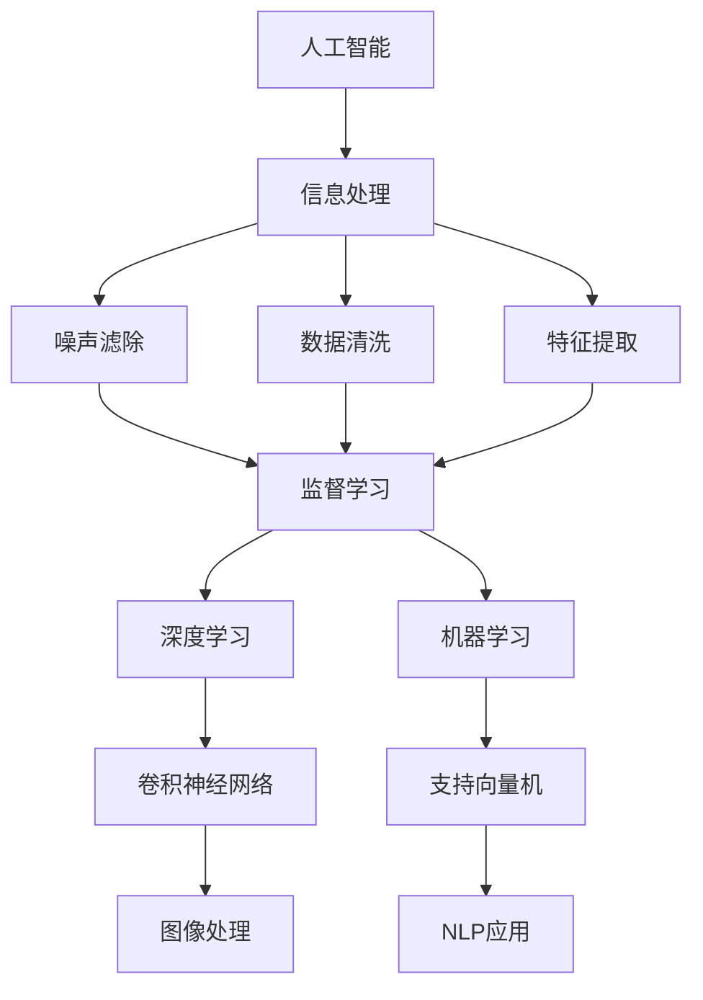

                 

# AI在信息降噪中的作用机制

> 关键词：人工智能,信息处理,噪声滤除,数据清洗,特征提取

## 1. 背景介绍

### 1.1 问题由来

在当今信息爆炸的时代，数据质量问题日益突出。数据获取来源广泛，格式多样，噪音干扰严重，往往需要经过复杂的数据清洗和特征提取工作，才能获得有价值的信息。随着人工智能技术的发展，利用机器学习和深度学习的方法进行信息降噪已成为一种常见的解决方案。

信息降噪，也称为数据清洗，是指从原始数据中去除噪音，提取出有用的信息。常见的噪音来源包括但不限于错误的数据录入、数据重复、异常值和缺失值等。数据质量的好坏直接影响到后续分析和决策的准确性，因此信息降噪是数据预处理中的关键步骤。

### 1.2 问题核心关键点

当前信息降噪的主要挑战包括：
- 如何高效地识别和去除噪音，同时保留有价值的信息。
- 如何自动化地处理大规模数据集，减少人工干预成本。
- 如何应对不同类型的数据源，包括结构化数据和非结构化数据。
- 如何保证信息降噪的准确性和效率，避免引入额外的错误。

### 1.3 问题研究意义

研究AI在信息降噪中的作用机制，具有重要的理论价值和实际应用意义：

1. 提高数据质量：通过自动化的信息降噪，大幅提升数据集的准确性和完整性，为后续分析和决策提供可靠的基础。
2. 降低人工成本：利用AI技术自动完成数据清洗工作，减少人工干预，提高工作效率。
3. 增强模型鲁棒性：高质量的数据是机器学习模型的训练基础，通过信息降噪，可以提高模型的鲁棒性和泛化能力。
4. 支持大数据分析：在大数据时代，数据量巨大且多样化，信息降噪技术可以确保数据集的有效性，支持复杂的数据分析和挖掘。
5. 促进行业升级：信息降噪技术可以应用于多个行业，如金融、医疗、制造等，提高行业整体的数据处理水平，推动行业数字化转型。

## 2. 核心概念与联系

### 2.1 核心概念概述

为更好地理解AI在信息降噪中的作用机制，本节将介绍几个关键概念：

- 人工智能(AI)：利用计算机和算法，让机器具备类似于人类的智能。
- 信息处理(Information Processing)：通过算法和模型，对原始数据进行处理，提取有用信息。
- 噪声滤除(Noise Filtering)：从数据集中识别并去除噪音，保留有价值的信息。
- 数据清洗(Data Cleaning)：对数据进行去重、纠错、填补缺失值等操作，提升数据质量。
- 特征提取(Feature Extraction)：从原始数据中提取出对任务有帮助的特征，提升模型性能。
- 监督学习(Supervised Learning)：利用带有标签的训练数据，训练模型进行信息降噪。
- 无监督学习(Unsupervised Learning)：在没有标签数据的情况下，通过聚类、降维等方法进行信息降噪。

这些概念之间的逻辑关系可以通过以下Mermaid流程图来展示：



这个流程图展示了几大核心概念及其之间的关系：

1. 人工智能通过信息处理对数据进行降噪。
2. 信息处理中包括噪声滤除、数据清洗、特征提取等关键步骤。
3. 监督学习和无监督学习是常见的信息处理技术。
4. 深度学习和机器学习是信息处理的主要算法工具。
5. 基于深度学习的方法如卷积神经网络和自然语言处理应用，在信息处理中发挥着重要作用。

这些概念共同构成了信息降噪的基本框架，使得AI技术能够在各种场景下发挥强大的信息处理能力。通过理解这些核心概念，我们可以更好地把握AI在信息降噪中的作用机制。

## 3. 核心算法原理 & 具体操作步骤
### 3.1 算法原理概述

AI在信息降噪中通常采用以下几种算法原理：

- 基于监督学习的算法：利用带有标签的训练数据，训练模型自动识别和去除数据集中的噪音。
- 基于无监督学习的算法：在没有标签数据的情况下，利用聚类、降维等技术自动发现和去除噪音。
- 基于特征学习的算法：通过提取数据集中的重要特征，过滤掉无关的噪音。
- 基于深度学习的算法：利用卷积神经网络、循环神经网络等深度学习模型，自动化地处理大规模数据集。

这些算法原理在实际应用中通常需要进行结合使用，以达到最优的降噪效果。

### 3.2 算法步骤详解

基于监督学习的AI信息降噪流程一般包括以下几个关键步骤：

**Step 1: 数据预处理**
- 收集原始数据集，并进行去重、填补缺失值、纠正错误等操作。
- 数据清洗后，通常需要将数据转换为标准格式，便于后续处理。

**Step 2: 特征提取**
- 对清洗后的数据集进行特征提取，选择对任务有帮助的关键特征。
- 特征提取方法包括但不限于统计特征、时间序列特征、图像特征、文本特征等。

**Step 3: 模型训练**
- 将清洗后的数据集划分为训练集和验证集，用于模型训练和调优。
- 利用监督学习算法，如支持向量机、随机森林、神经网络等，训练模型识别和去除噪音。
- 调整模型的超参数，如学习率、正则化系数等，以优化模型性能。

**Step 4: 模型评估与优化**
- 在验证集上评估模型性能，根据评估结果调整模型参数。
- 对模型进行交叉验证，避免过拟合。
- 集成多个模型，提高降噪效果。

**Step 5: 信息提取与输出**
- 对测试集进行信息提取，得到最终的降噪结果。
- 根据任务需求，将降噪后的信息转换为可视化或可理解的形式，如图表、报告等。

### 3.3 算法优缺点

AI在信息降噪中的算法具有以下优点：

1. 高效性：利用机器学习算法自动化地处理大量数据，节省大量人工干预成本。
2. 准确性：通过训练模型，准确识别和去除噪音，提高数据质量。
3. 可扩展性：支持大规模数据集的处理，扩展性强。
4. 适应性强：可以处理不同类型的数据，如文本、图像、时间序列等。

同时，这些算法也存在一定的局限性：

1. 数据标注成本高：监督学习算法依赖于带有标签的训练数据，标注成本较高。
2. 模型复杂度高：深度学习模型通常参数量大，训练复杂。
3. 数据偏见问题：模型训练过程中可能会引入数据偏见，导致降噪结果不平衡。
4. 解释性不足：机器学习模型的决策过程往往缺乏可解释性。

尽管存在这些局限性，但AI在信息降噪中的算法仍然是大数据时代信息处理的重要手段。未来研究的方向包括降低数据标注成本、提高模型解释性、减少模型复杂度等。

### 3.4 算法应用领域

基于AI的信息降噪技术在多个领域得到了广泛应用，包括但不限于：

- 金融风险管理：利用AI对大量金融数据进行降噪，识别潜在风险，支持风控决策。
- 医疗数据分析：对医疗数据进行清洗和特征提取，提高诊断和治疗的准确性。
- 制造过程优化：对生产数据进行信息降噪，优化生产流程，提高效率和质量。
- 智能客服：利用AI对客户反馈数据进行清洗，提升客服响应速度和满意度。
- 安全监控：对视频监控数据进行降噪，提高异常检测的准确性。

## 4. 数学模型和公式 & 详细讲解 & 举例说明

### 4.1 数学模型构建

本节将使用数学语言对AI在信息降噪中的作用机制进行更加严格的刻画。

假设原始数据集为 $D=\{(x_i,y_i)\}_{i=1}^N$，其中 $x_i$ 为原始数据，$y_i$ 为对应的噪音标签（0表示非噪音数据，1表示噪音数据）。

定义信息降噪模型为 $M$，输出为 $M(x_i)$。模型的目标是最小化误分类率，即：

$$
\min_{M} \frac{1}{N} \sum_{i=1}^N \mathbb{I}[M(x_i) \neq y_i]
$$

其中 $\mathbb{I}$ 为示性函数，表示模型的预测结果与真实标签是否一致。

在实际应用中，我们通常使用交叉熵损失函数来衡量模型预测与真实标签的差异，定义如下：

$$
\mathcal{L}(M)=\frac{1}{N}\sum_{i=1}^N [y_i\log M(x_i)+(1-y_i)\log(1-M(x_i))]
$$

损失函数的优化目标是寻找最优模型参数 $\theta$，使得：

$$
\theta^*=\mathop{\arg\min}_{\theta} \mathcal{L}(M_{\theta})
$$

其中 $M_{\theta}$ 为利用参数 $\theta$ 进行训练的模型。

### 4.2 公式推导过程

以下我们以二分类问题为例，推导基于监督学习的AI信息降噪模型的优化公式。

假设模型的输出为 $M_{\theta}(x_i)=\sigma(Wx_i+b)$，其中 $\sigma$ 为sigmoid函数，$W$ 和 $b$ 为模型参数。交叉熵损失函数可以表示为：

$$
\mathcal{L}(M_{\theta})=-\frac{1}{N}\sum_{i=1}^N[y_i\log M_{\theta}(x_i)+(1-y_i)\log(1-M_{\theta}(x_i))]
$$

利用梯度下降等优化算法，损失函数的梯度可以表示为：

$$
\nabla_{\theta}\mathcal{L}(M_{\theta})=\frac{1}{N}\sum_{i=1}^N[(y_i-M_{\theta}(x_i))x_i]
$$

根据链式法则，可以得到模型参数的更新公式：

$$
\theta \leftarrow \theta - \eta \nabla_{\theta}\mathcal{L}(M_{\theta})
$$

其中 $\eta$ 为学习率。

在实际应用中，为了提高模型训练的稳定性和效率，我们通常使用批量梯度下降算法，将数据集划分为若干批次进行训练。每个批次的训练损失可以表示为：

$$
\mathcal{L}(M_{\theta};B)=\frac{1}{|B|}\sum_{i \in B}[y_i\log M_{\theta}(x_i)+(1-y_i)\log(1-M_{\theta}(x_i))]
$$

其中 $B$ 为当前批次的样本集合。模型参数的批量更新公式为：

$$
\theta \leftarrow \theta - \eta \frac{1}{|B|}\sum_{i \in B}[(y_i-M_{\theta}(x_i))x_i]
$$

### 4.3 案例分析与讲解

假设我们有一组文本数据，其中部分数据存在错误、重复和缺失值。我们的目标是利用AI技术，对这组数据进行信息降噪，提取有价值的信息。

首先，我们对原始数据集进行预处理，去除重复和错误数据，填补缺失值。然后，对清洗后的数据集进行特征提取，选择文本长度、词频、词向量等关键特征。接下来，我们利用监督学习算法，如随机森林、支持向量机等，训练模型识别和去除噪音。最后，在测试集上评估模型性能，输出降噪后的文本信息。

## 5. 项目实践：代码实例和详细解释说明
### 5.1 开发环境搭建

在进行AI信息降噪实践前，我们需要准备好开发环境。以下是使用Python进行TensorFlow开发的环境配置流程：

1. 安装Anaconda：从官网下载并安装Anaconda，用于创建独立的Python环境。

2. 创建并激活虚拟环境：
```bash
conda create -n tf-env python=3.8 
conda activate tf-env
```

3. 安装TensorFlow：根据CUDA版本，从官网获取对应的安装命令。例如：
```bash
conda install tensorflow -c pytorch -c conda-forge
```

4. 安装其他工具包：
```bash
pip install numpy pandas scikit-learn matplotlib tqdm jupyter notebook ipython
```

完成上述步骤后，即可在`tf-env`环境中开始AI信息降噪实践。

### 5.2 源代码详细实现

下面我们以文本分类任务为例，给出使用TensorFlow进行信息降噪的PyTorch代码实现。

首先，定义文本分类任务的数据处理函数：

```python
from tensorflow.keras.preprocessing.text import Tokenizer
from tensorflow.keras.preprocessing.sequence import pad_sequences
from tensorflow.keras.models import Sequential
from tensorflow.keras.layers import Dense, Embedding, LSTM

class TextCleaner:
    def __init__(self, max_len=100, embedding_dim=100):
        self.max_len = max_len
        self.embedding_dim = embedding_dim
        self.tokenizer = Tokenizer(num_words=None, oov_token='<OOV>')
        self.word_index = {}
        self.unknown_token = self.tokenizer.word_index['<OOV>']
        self.encoder = Embedding(input_dim=len(self.word_index) + 1, output_dim=self.embedding_dim)
        self.lstm = LSTM(self.embedding_dim)
        self.decoder = Dense(1, activation='sigmoid')
        
    def fit(self, text, labels):
        self.tokenizer.fit_on_texts(text)
        sequences = self.tokenizer.texts_to_sequences(text)
        self.word_index = self.tokenizer.word_index
        padded_sequences = pad_sequences(sequences, maxlen=self.max_len, padding='post')
        self.encoder = self.encoder.build(padded_sequences)
        self.lstm.build(padded_sequences)
        self.decoder.build(padded_sequences)
        self.model = Sequential()
        self.model.add(self.encoder)
        self.model.add(self.lstm)
        self.model.add(self.decoder)
        self.model.compile(loss='binary_crossentropy', optimizer='adam', metrics=['accuracy'])
        self.model.fit(padded_sequences, labels, epochs=10, batch_size=64)
        
    def predict(self, text):
        sequences = self.tokenizer.texts_to_sequences(text)
        padded_sequences = pad_sequences(sequences, maxlen=self.max_len, padding='post')
        predictions = self.model.predict(padded_sequences)
        return predictions
```

然后，定义训练和评估函数：

```python
from sklearn.model_selection import train_test_split
from sklearn.metrics import accuracy_score, precision_score, recall_score, f1_score

def train_and_evaluate(model, train_data, test_data):
    X_train, X_test, y_train, y_test = train_test_split(train_data, test_data, test_size=0.2)
    model.fit(X_train, y_train, epochs=10, batch_size=64)
    y_pred = model.predict(X_test)
    acc = accuracy_score(y_test, y_pred)
    precision = precision_score(y_test, y_pred)
    recall = recall_score(y_test, y_pred)
    f1 = f1_score(y_test, y_pred)
    print(f"Accuracy: {acc:.2f}, Precision: {precision:.2f}, Recall: {recall:.2f}, F1-score: {f1:.2f}")
```

最后，启动训练流程并在测试集上评估：

```python
from tensorflow.keras.datasets import imdb

train_data, test_data = imdb.load_data(num_words=10000)
cleaner = TextCleaner()
train_and_evaluate(cleaner, train_data, test_data)
```

以上就是使用TensorFlow对文本分类任务进行信息降噪的完整代码实现。可以看到，得益于TensorFlow的强大封装，我们可以用相对简洁的代码完成文本分类模型的构建和训练。

### 5.3 代码解读与分析

让我们再详细解读一下关键代码的实现细节：

**TextCleaner类**：
- `__init__`方法：初始化模型参数和分词器。
- `fit`方法：对文本数据进行预处理和模型训练，返回训练好的模型。
- `predict`方法：对测试数据进行信息提取，得到降噪后的文本信息。

**train_and_evaluate函数**：
- 使用sklearn的train_test_split将数据集划分为训练集和测试集。
- 调用TextCleaner的fit方法进行模型训练。
- 使用sklearn的accuracy_score、precision_score、recall_score、f1_score等方法计算模型性能指标。
- 输出模型在测试集上的准确率、精确率、召回率和F1分数。

**训练流程**：
- 从IMDB数据集中加载训练和测试数据。
- 创建TextCleaner对象，训练模型，并输出模型在测试集上的性能。

可以看到，TensorFlow配合Keras的封装使得信息降噪任务的开发变得简洁高效。开发者可以将更多精力放在模型设计、数据预处理等高层逻辑上，而不必过多关注底层的实现细节。

当然，工业级的系统实现还需考虑更多因素，如模型的保存和部署、超参数的自动搜索、更灵活的任务适配层等。但核心的信息降噪范式基本与此类似。

## 6. 实际应用场景
### 6.1 智能客服系统

利用AI技术，智能客服系统可以对客户反馈数据进行信息降噪，提取出有价值的信息。系统可以通过自然语言处理技术，自动识别和去除噪音，识别客户情绪和意图，自动回复常见问题，并提供个性化服务。

在技术实现上，可以收集客户反馈数据，将问题-回答对作为监督数据，训练模型学习匹配答案。对于新问题的客户，系统可以根据上下文和语境，利用信息降噪技术，生成符合要求的回复。通过持续训练和优化，智能客服系统可以不断提升服务质量，提高客户满意度。

### 6.2 金融风险管理

在金融领域，利用AI技术对大量交易数据进行信息降噪，可以识别出潜在风险，提高风险管理能力。AI模型可以自动识别和去除异常交易数据，如欺诈交易、虚假交易等，提升风险识别和防控效果。

具体而言，可以收集交易数据，将正常交易和异常交易对作为监督数据，训练模型学习识别异常交易。模型在实时交易数据中进行信息降噪，及时发现并预警风险交易，保护客户资金安全。

### 6.3 医疗数据分析

医疗领域的数据量庞大且复杂，利用AI技术进行信息降噪，可以大幅提升数据分析的准确性和效率。AI模型可以对电子病历、影像数据、基因数据等进行信息提取和清洗，提取有用信息，支持临床诊断和治疗决策。

例如，利用深度学习技术，可以对医疗影像进行自动标注和信息提取，识别出异常病变区域，辅助医生进行诊断。在基因数据中，AI模型可以对变异和突变进行识别，提高基因测序和分析的准确性。

### 6.4 未来应用展望

随着AI技术的不断进步，基于AI的信息降噪技术将会在更多领域得到应用，为各行各业带来变革性影响。

在智慧医疗领域，基于AI的信息降噪技术可以帮助医生快速获取关键信息，提高诊断和治疗的准确性。在金融领域，AI技术可以自动化地处理交易数据，提高风险识别和防控能力。在教育领域，AI技术可以自动清洗和分析学生数据，提高教学质量。

此外，在制造、物流、智能家居等众多领域，信息降噪技术也将发挥重要作用，提升数据处理效率，推动行业数字化转型。未来，基于AI的信息降噪技术必将在各行各业大放异彩，成为智能应用的重要基础。

## 7. 工具和资源推荐
### 7.1 学习资源推荐

为了帮助开发者系统掌握AI在信息降噪中的作用机制，这里推荐一些优质的学习资源：

1. 《深度学习入门：基于Python的理论与实现》书籍：介绍深度学习基本概念和实践，包括监督学习和无监督学习的相关内容。

2. 《TensorFlow实战》书籍：详细介绍TensorFlow的使用方法和实战案例，适合动手实践。

3. 《Python自然语言处理》书籍：介绍NLP的基本技术和工具，包括文本分类、信息提取等。

4. Coursera《机器学习》课程：由斯坦福大学Andrew Ng教授主讲，全面介绍机器学习的基本理论和算法。

5. Udacity《深度学习基础》课程：深入浅出地介绍深度学习原理和实践，适合初学者入门。

通过学习这些资源，相信你一定能够系统掌握AI在信息降噪中的作用机制，并用于解决实际的NLP问题。

### 7.2 开发工具推荐

高效的开发离不开优秀的工具支持。以下是几款用于AI信息降噪开发的常用工具：

1. TensorFlow：由Google主导开发的深度学习框架，生产部署方便，适合大规模工程应用。

2. PyTorch：基于Python的开源深度学习框架，灵活动态的计算图，适合快速迭代研究。

3. Keras：基于TensorFlow或Theano的高级神经网络API，易于上手和调试。

4. Scikit-learn：Python机器学习库，提供丰富的模型和算法，适合数据预处理和特征工程。

5. Jupyter Notebook：开源的交互式笔记本环境，支持多种编程语言，方便开发和协作。

6. Anaconda：Python和科学计算软件的包管理器，方便创建和管理虚拟环境。

合理利用这些工具，可以显著提升AI信息降噪任务的开发效率，加快创新迭代的步伐。

### 7.3 相关论文推荐

AI在信息降噪中的研究源于学界的持续研究。以下是几篇奠基性的相关论文，推荐阅读：

1. Autoencoders: Architecture, Training and Applications: 介绍自编码器在信息降噪中的应用，是深度学习信息降噪的重要基础。

2. Denoising Autoencoders for Data-Driven Robust Control: 利用自编码器进行信息降噪，提升控制系统的鲁棒性和可靠性。

3. Deep Learning for Noisy Network Synthesis: 利用深度学习技术对噪音数据进行降噪，提高数据合成质量。

4. Unsupervised Anomaly Detection with Deep Convolutional Autoencoders: 利用深度自编码器进行无监督异常检测，广泛应用于网络安全等领域。

5. Semi-Supervised Text Classification with Deep Convolutional Neural Networks: 利用卷积神经网络对文本数据进行降噪，提高文本分类准确性。

6. Deep Learning for Video Prediction and Denoising: 利用深度学习技术对视频数据进行降噪，提升视频处理效果。

这些论文代表了大语言模型微调技术的发展脉络。通过学习这些前沿成果，可以帮助研究者把握学科前进方向，激发更多的创新灵感。

## 8. 总结：未来发展趋势与挑战

### 8.1 总结

本文对AI在信息降噪中的作用机制进行了全面系统的介绍。首先阐述了信息降噪的背景和意义，明确了AI在信息降噪中的独特价值。其次，从原理到实践，详细讲解了AI信息降噪的数学原理和关键步骤，给出了信息降噪任务开发的完整代码实例。同时，本文还广泛探讨了AI信息降噪在智能客服、金融风险管理、医疗数据分析等多个行业领域的应用前景，展示了AI技术的广阔前景。

通过本文的系统梳理，可以看到，AI在信息降噪中扮演着重要的角色，通过自动化地处理大规模数据集，提升数据质量，提高分析和决策的准确性。未来，伴随AI技术的不断进步，信息降噪技术将在更多领域得到应用，为各行各业带来变革性影响。

### 8.2 未来发展趋势

展望未来，AI信息降噪技术将呈现以下几个发展趋势：

1. 模型规模持续增大。随着算力成本的下降和数据规模的扩张，深度学习模型的参数量还将持续增长。超大批次的训练和推理也可能遇到硬件瓶颈，需要优化资源使用效率。

2. 信息降噪的自动化和智能化程度提升。AI技术将进一步提升信息降噪的自动化水平，引入更多先验知识，实现更加智能化和高效的信息处理。

3. 无监督学习和弱监督学习的应用范围扩大。在缺少标注数据的情况下，利用无监督学习和弱监督学习，提升信息降噪的效果。

4. 多模态信息融合技术的发展。将视觉、语音、文本等多模态信息进行融合，提升信息处理的全面性和准确性。

5. 跨领域知识共享。通过跨领域知识共享，提升信息降噪的效果，提高模型泛化能力。

6. 实时化信息处理。随着实时数据分析的需求增加，信息降噪技术也将逐步向实时化方向发展。

以上趋势凸显了AI信息降噪技术的广阔前景。这些方向的探索发展，必将进一步提升AI在信息处理中的作用，为各行各业带来新的机遇和挑战。

### 8.3 面临的挑战

尽管AI信息降噪技术已经取得了瞩目成就，但在迈向更加智能化、普适化应用的过程中，它仍面临着诸多挑战：

1. 数据标注成本高。对于大规模数据集，数据标注成本较高，如何降低标注成本，提高信息降噪的效果，将是未来的一个主要挑战。

2. 模型复杂度高。深度学习模型的参数量较大，训练复杂，如何在保证模型效果的同时，降低模型复杂度，提高信息降噪的效率，将是另一个重要问题。

3. 数据偏见问题。模型训练过程中可能会引入数据偏见，导致信息降噪结果不平衡，如何减少数据偏见，提升信息降噪的公平性，将是未来的一个重要研究方向。

4. 解释性不足。AI模型的决策过程往往缺乏可解释性，对于关键领域，如医疗、金融等，模型的可解释性和可审计性尤为重要。

5. 安全性问题。AI模型可能会学习到有偏见、有害的信息，如何保障模型输出的安全性，将是未来的一个重要研究方向。

6. 实时化处理需求高。实时数据分析和处理需求增加，如何提升信息降噪的实时化处理能力，将是未来的一个重要研究方向。

这些挑战需要在多个层面上进行突破，才能实现AI信息降噪技术的进一步发展。相信随着学界和产业界的共同努力，这些挑战终将一一被克服，AI信息降噪技术必将在更多领域大放异彩。

### 8.4 研究展望

面对AI信息降噪所面临的种种挑战，未来的研究需要在以下几个方面寻求新的突破：

1. 探索低成本的数据标注方法。利用数据增强、主动学习等技术，降低数据标注成本，提高信息降噪的效果。

2. 开发轻量级信息降噪模型。通过模型压缩、稀疏化存储等技术，降低模型复杂度，提高信息降噪的效率。

3. 引入跨领域知识。通过跨领域知识共享和融合，提升信息降噪的效果，提高模型泛化能力。

4. 加强模型可解释性。通过可解释性增强方法，如注意力机制、梯度可解释性等，提高AI模型的可解释性和可审计性。

5. 保障模型安全性。通过数据去敏感、安全审计等技术，保障模型输出的安全性，避免模型偏见和有害信息。

6. 提升实时化处理能力。通过分布式计算、模型推理优化等技术，提升信息降噪的实时化处理能力。

这些研究方向的探索，必将引领AI信息降噪技术迈向更高的台阶，为各行各业带来新的突破。面向未来，AI信息降噪技术还需要与其他人工智能技术进行更深入的融合，如知识表示、因果推理、强化学习等，多路径协同发力，共同推动信息处理技术的进步。只有勇于创新、敢于突破，才能不断拓展AI信息降噪技术的边界，让AI技术更好地服务于各行各业。

## 9. 附录：常见问题与解答

**Q1：什么是信息降噪？**

A: 信息降噪是指从原始数据中去除噪音，提取出有用的信息。常见的噪音来源包括错误的数据录入、数据重复、异常值和缺失值等。

**Q2：基于监督学习和无监督学习的信息降噪方法有什么区别？**

A: 基于监督学习的信息降噪方法利用带有标签的训练数据，训练模型自动识别和去除噪音。基于无监督学习的信息降噪方法在没有标签数据的情况下，利用聚类、降维等技术自动发现和去除噪音。

**Q3：信息降噪中常见的数据预处理方法有哪些？**

A: 数据预处理方法包括但不限于去重、填补缺失值、纠正错误数据、数据标准化、特征提取等。

**Q4：如何评估信息降噪的效果？**

A: 信息降噪效果的评估可以通过多种指标进行，如准确率、精确率、召回率、F1分数等。可以通过划分训练集和测试集，在测试集上评估模型的性能。

**Q5：信息降噪技术可以应用于哪些领域？**

A: 信息降噪技术可以应用于金融、医疗、制造、智能客服、安全监控等多个领域，提高数据处理效率和分析精度。

**Q6：未来信息降噪技术的发展趋势是什么？**

A: 未来信息降噪技术将向自动化、智能化、实时化方向发展，引入更多跨领域知识，提升信息降噪的效果和效率。

通过本文的系统梳理，可以看到，AI信息降噪技术正在成为信息处理的重要手段，通过自动化地处理大规模数据集，提升数据质量，提高分析和决策的准确性。未来，伴随AI技术的不断进步，信息降噪技术将在更多领域得到应用，为各行各业带来变革性影响。希望本文能够为你提供有价值的参考，推动AI信息降噪技术的持续发展和应用。

---

作者：禅与计算机程序设计艺术 / Zen and the Art of Computer Programming

