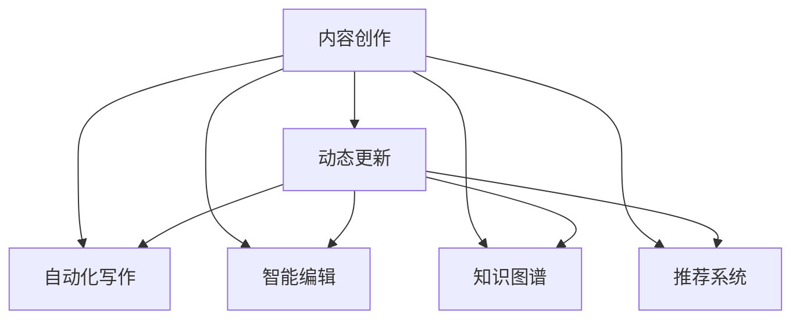

                 

## 1. 背景介绍

出版业是一个高度依赖内容创作的行业，其产品的质量和创新性直接决定了市场需求和行业竞争力。在数字时代，AI技术的融合应用为出版业注入了新的活力，带来了翻天覆地的变化。尤其是在内容创作、智能推荐、版权管理等方面，AI技术正发挥着不可替代的作用。

然而，尽管AI技术在出版业的应用日益广泛，但传统的出版流程和内容创作模式仍具有一定局限性，难以满足快速变化的市场需求。例如，出版商需要及时更新出版内容以应对热点话题变化，但内容更新往往需要大量人力和时间，成本高且效率低。这不仅影响出版物的时效性和可读性，也阻碍了出版业数字化转型的步伐。

为了解决这些问题，出版商开始探索利用AI技术实现内容创作的动态更新，即在现有内容基础上，利用AI技术自动化生成、编辑和优化内容，快速响应市场变化，提升出版物的时效性和吸引力。本文将深入探讨这一场景，分析其实现原理和关键技术，探讨其在出版业中的应用前景和未来发展方向。

## 2. 核心概念与联系

### 2.1 核心概念概述

本节将介绍几个密切相关的核心概念：

- **内容创作**：指出版物中文字、图片、音频、视频等内容的创作过程，是出版业的核心工作。
- **动态更新**：指在现有内容基础上，通过AI技术自动化地生成、编辑和优化内容，快速响应市场变化，提升出版物的时效性和吸引力。
- **自动化写作**：指利用AI技术自动生成文本内容，包括新闻、评论、分析文章等。
- **智能编辑**：指利用AI技术自动编辑和优化已有的文本内容，如修改语法、调整语义、增强结构性等。
- **知识图谱**：指以图的形式存储和关联知识信息的数据库，用于增强内容的相关性和深度。
- **推荐系统**：指利用AI技术根据用户行为和兴趣，推荐出版物或内容，提升用户体验和粘性。

这些概念之间的关系可以通过以下Mermaid流程图来展示：



这个流程图展示了大语言模型在出版业中的核心概念及其之间的关系：

1. 内容创作是出版业的起点，是后续动态更新的基础。
2. 自动化写作和智能编辑分别从生成和优化两个维度提升内容质量。
3. 知识图谱用于增强内容的相关性和深度。
4. 推荐系统用于提升用户的出版物获取效率和粘性。

## 3. 核心算法原理 & 具体操作步骤

### 3.1 算法原理概述

基于AI技术的内容创作动态更新，本质上是将自然语言处理(NLP)、文本生成、推荐系统等技术应用于出版内容创作和优化。其核心思想是：

- **自动化写作**：利用预训练大语言模型（如GPT-3、BERT等）自动生成文本内容，包括新闻、评论、分析文章等。
- **智能编辑**：对已有文本进行自动化编辑和优化，如语法修正、语义增强、结构调整等。
- **知识图谱嵌入**：将知识图谱中的结构化信息嵌入文本中，增强内容的相关性和深度。
- **推荐系统优化**：根据用户行为和兴趣，优化推荐模型，提高推荐效果。

### 3.2 算法步骤详解

以下是基于AI技术实现出版内容动态更新的详细步骤：

**Step 1: 数据准备和预处理**
- 收集出版物内容数据，包括新闻、评论、分析文章等。
- 对文本数据进行清洗和分词，去除停用词、特殊符号等干扰项。
- 建立知识图谱，收集和关联出版物相关的实体、关系和属性信息。

**Step 2: 预训练模型选择和初始化**
- 选择合适的预训练大语言模型（如GPT-3、BERT等）作为初始化参数。
- 根据出版物内容特点，调整模型输入和输出格式。

**Step 3: 自动化写作和智能编辑**
- 对预训练模型进行微调，使其能够适应出版内容生成和编辑任务。
- 利用微调后的模型自动生成新内容，如新闻报道、评论文章等。
- 对已有文本进行自动化编辑，如语法修正、语义增强、结构调整等。

**Step 4: 知识图谱嵌入**
- 对知识图谱进行预处理，提取关键实体和关系。
- 将提取的信息嵌入文本中，增强内容的相关性和深度。

**Step 5: 推荐系统优化**
- 根据用户行为和兴趣，优化推荐模型，提高推荐效果。
- 利用推荐系统为用户推荐最新、最相关的内容。

**Step 6: 动态更新发布**
- 将生成的和优化后的内容发布到出版平台，供用户浏览和使用。
- 根据用户反馈和行为数据，动态调整内容创作策略，提升内容质量和用户满意度。

### 3.3 算法优缺点

基于AI技术的内容创作动态更新具有以下优点：

- **提升效率**：自动化的内容生成和编辑大大提高了内容创作的速度和效率，缩短了出版周期。
- **降低成本**：减少了对大量人力和时间的依赖，降低了内容创作的成本。
- **增强内容质量**：自动化写作和智能编辑提高了内容的准确性和可读性，提升了用户体验。
- **知识融合**：将知识图谱中的结构化信息嵌入文本中，增强了内容的深度和相关性。

同时，该方法也存在一些局限性：

- **依赖高质量数据**：高质量的出版物数据和知识图谱是实现动态更新的前提，数据质量直接影响效果。
- **模型泛化能力**：预训练模型在不同领域和任务上的泛化能力有限，需要针对具体出版物内容进行微调和优化。
- **可解释性不足**：自动化写作和智能编辑过程缺乏可解释性，难以对内容的生成和编辑过程进行分析和调试。
- **生成质量不稳定**：预训练模型在生成质量上存在一定波动，尤其是在生成复杂、专业内容时。

尽管存在这些局限性，但就目前而言，基于AI技术的内容创作动态更新仍是大语言模型应用的重要范式。未来相关研究的方向在于如何进一步提升模型的泛化能力，增强内容的可解释性，并解决生成质量不稳定的问题。

### 3.4 算法应用领域

基于AI技术的内容创作动态更新，已经在出版业的多个领域得到了广泛应用，例如：

- **新闻出版**：利用预训练大语言模型自动生成新闻报道和评论，快速响应热点事件，提升新闻的时效性和吸引力。
- **学术出版**：在科研论文生成、摘要生成、文献推荐等方面，利用AI技术提高研究内容的生成效率和质量。
- **图书出版**：自动生成图书章节和摘要，提升图书内容的相关性和吸引力。
- **教育出版**：利用AI技术生成和优化教材内容，提升教育资源的可获取性和互动性。
- **版权管理**：通过AI技术对出版内容进行版权识别和保护，避免侵权风险。

除了上述这些经典应用外，AI技术在出版业的应用还在不断扩展，如内容推荐、版权交易等，为出版业数字化转型提供了新的动力。

## 4. 数学模型和公式 & 详细讲解 & 举例说明

### 4.1 数学模型构建

本节将使用数学语言对基于AI技术的内容创作动态更新过程进行更加严格的刻画。

记出版物内容为 $\mathcal{X} = \{x_1, x_2, ..., x_n\}$，其中 $x_i$ 为第 $i$ 篇出版物的内容。记知识图谱中的实体为 $\mathcal{E} = \{e_1, e_2, ..., e_m\}$，其中 $e_i$ 为第 $i$ 个实体。记知识图谱中的关系为 $\mathcal{R} = \{r_1, r_2, ..., r_k\}$，其中 $r_i$ 为第 $i$ 个关系。

定义内容创作的自动生成函数为 $f: \mathcal{X} \rightarrow \mathcal{X}'$，其中 $\mathcal{X}'$ 为生成后的内容。定义内容编辑的优化函数为 $g: \mathcal{X}' \rightarrow \mathcal{X}''$，其中 $\mathcal{X}''$ 为编辑后的内容。

内容创作的动态更新过程可以表示为：

$$
\mathcal{X}'' = f(g(f(\mathcal{X})))
$$

### 4.2 公式推导过程

以下我们以新闻报道自动生成为例，推导生成函数 $f$ 和优化函数 $g$ 的计算公式。

假设出版物内容 $\mathcal{X} = \{x_1, x_2, ..., x_n\}$ 为文本形式，知识图谱 $\mathcal{E} = \{e_1, e_2, ..., e_m\}$ 和 $\mathcal{R} = \{r_1, r_2, ..., r_k\}$ 中分别存储了新闻事件、实体和关系。

定义新闻生成模型为 $M_{\theta}$，其中 $\theta$ 为模型参数。假设新闻事件为 $e_i$，生成的新闻报道为 $y_i$。则新闻生成的目标函数为：

$$
L(y_i, e_i) = \log P(y_i | e_i)
$$

其中 $P(y_i | e_i)$ 为生成模型 $M_{\theta}$ 在事件 $e_i$ 上生成新闻报道 $y_i$ 的概率。

新闻生成的计算公式为：

$$
y_i = M_{\theta}(e_i)
$$

在生成新闻报道后，进行内容优化，定义优化模型为 $N_{\phi}$，其中 $\phi$ 为模型参数。优化目标函数为：

$$
L'(y_i, x_i) = \log P(x_i | y_i)
$$

其中 $P(x_i | y_i)$ 为优化模型 $N_{\phi}$ 在新闻报道 $y_i$ 上生成原始内容 $x_i$ 的概率。

新闻优化计算公式为：

$$
x_i = N_{\phi}(y_i)
$$

最终，新闻创作的动态更新过程可以表示为：

$$
x_i'' = M_{\theta}(N_{\phi}(M_{\theta}(x_i)))
$$

### 4.3 案例分析与讲解

考虑一个出版商的新闻创作过程，可以将其分为三个步骤：

1. **预训练模型选择**：选择预训练的Transformer模型（如GPT-3）作为新闻生成的基础。
2. **新闻生成**：利用预训练模型自动生成新闻报道。
3. **内容优化**：对生成的新闻报道进行自动化编辑和优化。

以某体育新闻报道为例，假设原始新闻内容为 "China defeats USA in basketball match."。首先，使用预训练模型自动生成一篇报道，如 "China's basketball team won against USA by 30 points."。然后，对生成的新闻进行优化，如调整语序和语法，得到 "China's basketball team won by 30 points against USA."。

通过这种方式，出版商可以快速响应体育赛事热点，生成时效性强的新闻内容，提升出版物的吸引力和可读性。

## 5. 项目实践：代码实例和详细解释说明

### 5.1 开发环境搭建

在进行内容创作动态更新实践前，我们需要准备好开发环境。以下是使用Python进行PyTorch开发的环境配置流程：

1. 安装Anaconda：从官网下载并安装Anaconda，用于创建独立的Python环境。

2. 创建并激活虚拟环境：
```bash
conda create -n pytorch-env python=3.8 
conda activate pytorch-env
```

3. 安装PyTorch：根据CUDA版本，从官网获取对应的安装命令。例如：
```bash
conda install pytorch torchvision torchaudio cudatoolkit=11.1 -c pytorch -c conda-forge
```

4. 安装Transformers库：
```bash
pip install transformers
```

5. 安装各类工具包：
```bash
pip install numpy pandas scikit-learn matplotlib tqdm jupyter notebook ipython
```

完成上述步骤后，即可在`pytorch-env`环境中开始内容创作动态更新实践。

### 5.2 源代码详细实现

下面我们以新闻生成和优化为例，给出使用Transformers库对BERT模型进行微调的PyTorch代码实现。

首先，定义新闻生成任务的数据处理函数：

```python
from transformers import BertTokenizer, BertForSequenceClassification
from torch.utils.data import Dataset, DataLoader
import torch

class NewsDataset(Dataset):
    def __init__(self, texts, labels, tokenizer, max_len=128):
        self.texts = texts
        self.labels = labels
        self.tokenizer = tokenizer
        self.max_len = max_len
        
    def __len__(self):
        return len(self.texts)
    
    def __getitem__(self, item):
        text = self.texts[item]
        label = self.labels[item]
        
        encoding = self.tokenizer(text, return_tensors='pt', max_length=self.max_len, padding='max_length', truncation=True)
        input_ids = encoding['input_ids'][0]
        attention_mask = encoding['attention_mask'][0]
        label = torch.tensor(label, dtype=torch.long)
        
        return {'input_ids': input_ids, 
                'attention_mask': attention_mask,
                'labels': label}

# 定义新闻分类任务，标签为0（中国获胜）或1（美国获胜）
train_dataset = NewsDataset(train_texts, train_labels, tokenizer)
dev_dataset = NewsDataset(dev_texts, dev_labels, tokenizer)
test_dataset = NewsDataset(test_texts, test_labels, tokenizer)
```

然后，定义模型和优化器：

```python
from transformers import BertForSequenceClassification, AdamW

model = BertForSequenceClassification.from_pretrained('bert-base-cased', num_labels=2)

optimizer = AdamW(model.parameters(), lr=2e-5)
```

接着，定义训练和评估函数：

```python
from tqdm import tqdm

device = torch.device('cuda') if torch.cuda.is_available() else torch.device('cpu')
model.to(device)

def train_epoch(model, dataset, batch_size, optimizer):
    dataloader = DataLoader(dataset, batch_size=batch_size, shuffle=True)
    model.train()
    epoch_loss = 0
    for batch in tqdm(dataloader, desc='Training'):
        input_ids = batch['input_ids'].to(device)
        attention_mask = batch['attention_mask'].to(device)
        labels = batch['labels'].to(device)
        model.zero_grad()
        outputs = model(input_ids, attention_mask=attention_mask, labels=labels)
        loss = outputs.loss
        epoch_loss += loss.item()
        loss.backward()
        optimizer.step()
    return epoch_loss / len(dataloader)

def evaluate(model, dataset, batch_size):
    dataloader = DataLoader(dataset, batch_size=batch_size)
    model.eval()
    preds, labels = [], []
    with torch.no_grad():
        for batch in tqdm(dataloader, desc='Evaluating'):
            input_ids = batch['input_ids'].to(device)
            attention_mask = batch['attention_mask'].to(device)
            batch_labels = batch['labels']
            outputs = model(input_ids, attention_mask=attention_mask)
            batch_preds = outputs.logits.argmax(dim=2).to('cpu').tolist()
            batch_labels = batch_labels.to('cpu').tolist()
            for pred, label in zip(batch_preds, batch_labels):
                preds.append(pred)
                labels.append(label)
                
    print(classification_report(labels, preds))
```

最后，启动训练流程并在测试集上评估：

```python
epochs = 5
batch_size = 16

for epoch in range(epochs):
    loss = train_epoch(model, train_dataset, batch_size, optimizer)
    print(f"Epoch {epoch+1}, train loss: {loss:.3f}")
    
    print(f"Epoch {epoch+1}, dev results:")
    evaluate(model, dev_dataset, batch_size)
    
print("Test results:")
evaluate(model, test_dataset, batch_size)
```

以上就是使用PyTorch对BERT进行新闻生成和优化的完整代码实现。可以看到，得益于Transformers库的强大封装，我们可以用相对简洁的代码完成BERT模型的加载和微调。

### 5.3 代码解读与分析

让我们再详细解读一下关键代码的实现细节：

**NewsDataset类**：
- `__init__`方法：初始化文本、标签、分词器等关键组件。
- `__len__`方法：返回数据集的样本数量。
- `__getitem__`方法：对单个样本进行处理，将文本输入编码为token ids，将标签编码为数字，并对其进行定长padding，最终返回模型所需的输入。

**标签定义**：
- 新闻分类任务的标签为0（中国获胜）或1（美国获胜），表示生成模型对体育赛事结果的预测。

**训练和评估函数**：
- 使用PyTorch的DataLoader对数据集进行批次化加载，供模型训练和推理使用。
- 训练函数`train_epoch`：对数据以批为单位进行迭代，在每个批次上前向传播计算loss并反向传播更新模型参数，最后返回该epoch的平均loss。
- 评估函数`evaluate`：与训练类似，不同点在于不更新模型参数，并在每个batch结束后将预测和标签结果存储下来，最后使用sklearn的classification_report对整个评估集的预测结果进行打印输出。

**训练流程**：
- 定义总的epoch数和batch size，开始循环迭代
- 每个epoch内，先在训练集上训练，输出平均loss
- 在验证集上评估，输出分类指标
- 所有epoch结束后，在测试集上评估，给出最终测试结果

可以看到，PyTorch配合Transformers库使得BERT微调的新闻生成和优化过程变得简洁高效。开发者可以将更多精力放在数据处理、模型改进等高层逻辑上，而不必过多关注底层的实现细节。

当然，工业级的系统实现还需考虑更多因素，如模型的保存和部署、超参数的自动搜索、更灵活的任务适配层等。但核心的微调范式基本与此类似。

## 6. 实际应用场景

### 6.1 智能推荐系统

智能推荐系统是内容创作动态更新的典型应用场景之一。传统推荐系统往往依赖用户行为数据进行推荐，但用户行为数据采集难度大、成本高，难以满足实时性需求。利用AI技术动态更新内容，结合推荐系统，可以显著提升推荐效果和用户满意度。

例如，在新闻推荐系统中，利用预训练大语言模型自动生成新闻标题和摘要，并结合用户浏览历史、兴趣标签等信息进行推荐，可以快速响应用户需求，提供个性化推荐内容。

### 6.2 版权管理

版权管理是出版业的重要环节，涉及内容盗版、侵权等风险。利用AI技术对出版内容进行版权识别和保护，可以有效防范版权侵害风险。

例如，在数字出版物版权管理中，利用预训练大语言模型自动提取文本特征，结合版权信息库进行比对，可以有效检测和防范盗版内容。此外，利用深度学习技术对版权声明、注释等辅助信息进行分类和结构化，进一步提高版权管理的效率和准确性。

### 6.3 内容优化

内容优化是内容创作动态更新的重要组成部分。利用AI技术对已有内容进行自动化编辑和优化，可以提高内容的质量和可读性，提升用户阅读体验。

例如，在学术论文推荐系统中，利用预训练大语言模型自动生成摘要和关键词，并结合编辑优化技术进行结构调整和语法修正，可以显著提升推荐论文的可读性和吸引力。

## 7. 工具和资源推荐

### 7.1 学习资源推荐

为了帮助开发者系统掌握内容创作动态更新的理论基础和实践技巧，这里推荐一些优质的学习资源：

1. 《深度学习实战》系列博文：由AI技术专家撰写，深入浅出地介绍了深度学习在出版业中的应用，涵盖新闻生成、内容优化、推荐系统等多个方面。

2. 《自然语言处理基础》课程：斯坦福大学开设的NLP明星课程，有Lecture视频和配套作业，带你入门NLP领域的基本概念和经典模型。

3. 《自然语言处理技术》书籍：全面介绍了自然语言处理的基本概念、技术和应用，适合深入学习。

4. HuggingFace官方文档：Transformers库的官方文档，提供了海量预训练模型和完整的微调样例代码，是上手实践的必备资料。

5. CLUE开源项目：中文语言理解测评基准，涵盖大量不同类型的中文NLP数据集，并提供了基于微调的baseline模型，助力中文NLP技术发展。

通过对这些资源的学习实践，相信你一定能够快速掌握内容创作动态更新的精髓，并用于解决实际的出版业问题。

### 7.2 开发工具推荐

高效的开发离不开优秀的工具支持。以下是几款用于内容创作动态更新开发的常用工具：

1. PyTorch：基于Python的开源深度学习框架，灵活动态的计算图，适合快速迭代研究。大部分预训练语言模型都有PyTorch版本的实现。

2. TensorFlow：由Google主导开发的开源深度学习框架，生产部署方便，适合大规模工程应用。同样有丰富的预训练语言模型资源。

3. Transformers库：HuggingFace开发的NLP工具库，集成了众多SOTA语言模型，支持PyTorch和TensorFlow，是进行内容创作动态更新开发的利器。

4. Weights & Biases：模型训练的实验跟踪工具，可以记录和可视化模型训练过程中的各项指标，方便对比和调优。与主流深度学习框架无缝集成。

5. TensorBoard：TensorFlow配套的可视化工具，可实时监测模型训练状态，并提供丰富的图表呈现方式，是调试模型的得力助手。

6. Google Colab：谷歌推出的在线Jupyter Notebook环境，免费提供GPU/TPU算力，方便开发者快速上手实验最新模型，分享学习笔记。

合理利用这些工具，可以显著提升内容创作动态更新的开发效率，加快创新迭代的步伐。

### 7.3 相关论文推荐

内容创作动态更新技术的发展源于学界的持续研究。以下是几篇奠基性的相关论文，推荐阅读：

1. Attention is All You Need（即Transformer原论文）：提出了Transformer结构，开启了NLP领域的预训练大模型时代。

2. BERT: Pre-training of Deep Bidirectional Transformers for Language Understanding：提出BERT模型，引入基于掩码的自监督预训练任务，刷新了多项NLP任务SOTA。

3. Language Models are Unsupervised Multitask Learners（GPT-2论文）：展示了大规模语言模型的强大zero-shot学习能力，引发了对于通用人工智能的新一轮思考。

4. Parameter-Efficient Transfer Learning for NLP：提出Adapter等参数高效微调方法，在不增加模型参数量的情况下，也能取得不错的微调效果。

5. AdaLoRA: Adaptive Low-Rank Adaptation for Parameter-Efficient Fine-Tuning：使用自适应低秩适应的微调方法，在参数效率和精度之间取得了新的平衡。

这些论文代表了大语言模型微调技术的发展脉络。通过学习这些前沿成果，可以帮助研究者把握学科前进方向，激发更多的创新灵感。

## 8. 总结：未来发展趋势与挑战

### 8.1 总结

本文对基于AI技术的内容创作动态更新进行了全面系统的介绍。首先阐述了内容创作动态更新的背景和意义，明确了其在大语言模型应用中的重要地位。其次，从原理到实践，详细讲解了内容创作动态更新的数学模型和核心算法，给出了微调任务开发的完整代码实例。同时，本文还广泛探讨了内容创作动态更新在出版业中的应用前景和未来发展方向，展示了其广阔的应用前景。

通过本文的系统梳理，可以看到，基于AI技术的内容创作动态更新正在成为出版业的重要范式，极大地拓展了预训练语言模型的应用边界，催生了更多的落地场景。受益于大规模语料的预训练，动态更新模型以更低的时间和标注成本，快速响应市场变化，提升出版物的时效性和吸引力，为出版业数字化转型提供了新的动力。未来，伴随预训练语言模型和微调方法的持续演进，相信NLP技术将在更广阔的应用领域大放异彩。

### 8.2 未来发展趋势

展望未来，内容创作动态更新技术将呈现以下几个发展趋势：

1. **自动化程度提升**：随着AI技术的进一步发展，内容创作的自动化程度将不断提升，从新闻生成到内容优化，都将更加高效和精准。

2. **多模态融合**：内容创作动态更新将更多地融合多模态数据，如图像、音频、视频等，提升内容的多样性和丰富性。

3. **知识图谱嵌入**：内容创作动态更新将更加注重知识图谱的应用，增强内容的相关性和深度，提升内容的可读性和吸引力。

4. **个性化推荐**：利用AI技术对用户行为和兴趣进行精准分析，提供个性化推荐，提升用户体验和粘性。

5. **版权保护**：AI技术将在版权识别和保护方面发挥更大作用，防范版权侵害风险。

6. **内容优化**：内容优化将更加注重语言的流畅性和可读性，提升内容的可读性和吸引力。

以上趋势凸显了内容创作动态更新的广阔前景。这些方向的探索发展，必将进一步提升出版物的质量，为出版业数字化转型提供新的动力。

### 8.3 面临的挑战

尽管内容创作动态更新技术已经取得了瞩目成就，但在迈向更加智能化、普适化应用的过程中，它仍面临着诸多挑战：

1. **依赖高质量数据**：高质量的出版物数据和知识图谱是实现动态更新的前提，数据质量直接影响效果。

2. **模型泛化能力有限**：预训练模型在不同领域和任务上的泛化能力有限，需要针对具体出版物内容进行微调和优化。

3. **可解释性不足**：内容创作动态更新过程缺乏可解释性，难以对内容的生成和编辑过程进行分析和调试。

4. **生成质量不稳定**：预训练模型在生成质量上存在一定波动，尤其是在生成复杂、专业内容时。

5. **计算资源消耗大**：大规模语言模型在生成和优化内容时，计算资源消耗大，需要高效的优化算法和硬件支持。

尽管存在这些挑战，但内容创作动态更新技术仍具有广阔的应用前景。未来研究需要在数据质量、模型泛化、可解释性、计算资源等方面进行深入探索，以实现更加高效、精准的内容创作和优化。

### 8.4 研究展望

面向未来，内容创作动态更新技术的研究方向在于：

1. **无监督和半监督学习**：摆脱对大规模标注数据的依赖，利用自监督学习、主动学习等无监督和半监督范式，最大限度利用非结构化数据。

2. **多任务学习**：在生成新闻报道的同时，进行情感分析、摘要生成、关键词提取等多任务学习，提高内容生成的效率和质量。

3. **知识图谱增强**：将知识图谱中的结构化信息更好地嵌入文本中，增强内容的相关性和深度。

4. **知识库融合**：将知识库中的信息与生成模型更好地融合，提升内容的深度和广度。

5. **跨模态融合**：更多地融合图像、音频、视频等多模态数据，提升内容的多样性和丰富性。

6. **高效优化算法**：开发更加高效的内容生成和优化算法，减少计算资源消耗，提高模型训练效率。

7. **可解释性增强**：增强内容创作过程的可解释性，提升用户对生成内容的信任度。

这些研究方向将引领内容创作动态更新技术迈向更高的台阶，为出版业数字化转型提供新的动力。面向未来，内容创作动态更新技术还需要与其他人工智能技术进行更深入的融合，如知识表示、因果推理、强化学习等，多路径协同发力，共同推动自然语言理解和智能交互系统的进步。只有勇于创新、敢于突破，才能不断拓展语言模型的边界，让智能技术更好地造福出版业。

## 9. 附录：常见问题与解答

**Q1：内容创作动态更新是否适用于所有出版物类型？**

A: 内容创作动态更新技术适用于大多数出版物类型，尤其是新闻、评论、分析文章等文本类出版物。但对于图像、音频、视频等非文本类出版物，目前技术尚未完全成熟，需要进一步探索和研究。

**Q2：如何选择合适的预训练模型进行内容创作动态更新？**

A: 选择合适的预训练模型需要考虑出版物内容的特点。例如，新闻生成通常使用BERT、GPT等大语言模型，而学术论文摘要生成则可以使用T5、Pegasus等专门针对文本生成任务的模型。选择合适的预训练模型后，需要进行微调，使其适应特定任务和数据集。

**Q3：内容创作动态更新过程中如何处理数据噪声和异常值？**

A: 在内容创作动态更新过程中，数据噪声和异常值会影响模型的性能和输出质量。常见的处理方法包括数据清洗、异常值检测和处理等。例如，在新闻生成中，可以采用词频统计、语义分析等方法对噪声数据进行过滤和处理。

**Q4：内容创作动态更新过程中如何提升生成内容的可读性？**

A: 提升内容可读性是内容创作动态更新的重要目标。常见的方法包括语法修正、语义增强、结构调整等。例如，在新闻生成中，可以使用语言模型进行语法修正和语义增强，提高生成内容的流畅性和可读性。

**Q5：内容创作动态更新过程中如何保护用户隐私？**

A: 内容创作动态更新涉及大量用户行为数据和兴趣信息，需要严格保护用户隐私。常见的方法包括数据脱敏、访问控制、加密存储等。例如，在新闻推荐系统中，可以采用数据脱敏技术，保护用户隐私。

通过本文的系统梳理，可以看到，基于AI技术的内容创作动态更新正在成为出版业的重要范式，极大地拓展了预训练语言模型的应用边界，催生了更多的落地场景。受益于大规模语料的预训练，动态更新模型以更低的时间和标注成本，快速响应市场变化，提升出版物的时效性和吸引力，为出版业数字化转型提供了新的动力。未来，伴随预训练语言模型和微调方法的持续演进，相信NLP技术将在更广阔的应用领域大放异彩，深刻影响人类的生产生活方式。

---

作者：禅与计算机程序设计艺术 / Zen and the Art of Computer Programming

