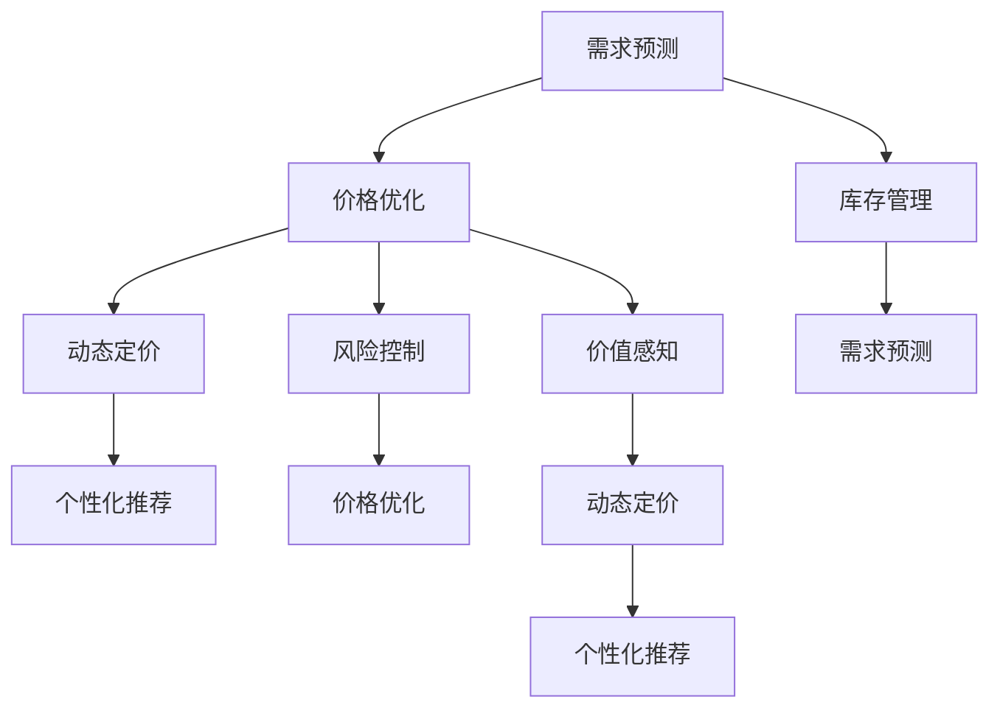

                 

# AI在电商价格优化中的实际应用

## 1. 背景介绍

### 1.1 问题由来
随着电子商务市场的不断扩展和竞争的日益激烈，电商企业面临着严峻的价格战挑战。如何制定合理的商品价格，既能够吸引顾客，又能够获得良好的销售利润，成为了电商企业亟待解决的难题。传统的人工定价方式存在诸多局限性，难以应对实时变化的电商市场和复杂的消费者行为模式。

近年来，随着人工智能技术的迅猛发展，基于AI的价格优化策略成为了电商行业的重要创新方向。AI技术能够通过分析海量历史数据，挖掘消费者行为和市场动态，实现动态定价和个性化推荐，显著提升电商企业的竞争力和盈利能力。

## 2. 核心概念与联系

### 2.1 核心概念概述

为更好地理解AI在电商价格优化中的应用，本节将介绍几个密切相关的核心概念：

- 价格优化(Pricing Optimization)：指在特定市场和产品组合下，通过优化商品价格以最大化销售利润的过程。价格优化通常包括需求预测、库存管理、定价策略等方面。

- 需求预测(Demand Forecasting)：预测消费者在不同价格下的购买行为和市场需求，是价格优化的重要前提。

- 动态定价(Dynamic Pricing)：根据实时市场动态，如供需关系、竞争对手定价、消费者偏好等，实时调整商品价格。

- 个性化推荐(Personalized Recommendation)：通过分析用户历史行为和偏好，为用户推荐最合适的商品和价格。

- 价值感知(Perceived Value)：消费者对商品价格的感知和接受程度，影响购买决策。

- 风险控制(Risk Management)：价格优化中的风险包括市场波动、库存积压、价格战等，需要通过合理的风险控制手段进行规避。

这些核心概念之间的逻辑关系可以通过以下Mermaid流程图来展示：



这个流程图展示了大规模价格优化过程的关键组件及其相互关系：

1. 需求预测是价格优化的基础，通过预测市场的需求情况，指导价格优化策略的制定。
2. 库存管理影响着价格优化，合理的库存量可以有效避免库存积压和断货问题。
3. 风险控制是价格优化的重要保障，通过监控市场波动和消费者反馈，防止风险的积累。
4. 动态定价和个性化推荐是价格优化的核心手段，通过实时调整价格和推荐商品，提升用户体验和销售业绩。

## 3. 核心算法原理 & 具体操作步骤
### 3.1 算法原理概述

AI在电商价格优化中的应用主要基于以下核心算法：

- 机器学习模型：利用历史销售数据和市场动态，构建和训练预测模型，实现需求预测和个性化推荐。
- 深度学习模型：如神经网络、Transformer等，通过学习海量数据，挖掘消费者行为和市场特征，实现动态定价和价格优化。
- 优化算法：如遗传算法、强化学习等，用于优化定价策略，最大化销售利润。

AI价格优化的核心目标是通过智能决策，提升销售效率和盈利能力。具体而言，AI可以通过以下步骤实现电商价格优化：

1. 数据收集：收集历史销售数据、市场动态、竞争对手信息等，构建全量数据集。
2. 模型构建：构建或选择适合的机器学习模型，进行训练和评估。
3. 价格优化：根据模型预测结果，动态调整商品价格，实现最佳定价策略。
4. 风险控制：实时监控市场变化和库存情况，进行风险预警和应对。

### 3.2 算法步骤详解

以下是AI在电商价格优化中具体的算法步骤：

**Step 1: 数据收集与预处理**
- 收集电商平台的交易记录、用户评价、搜索记录、广告点击率等数据。
- 清洗数据，去除异常值和缺失值，标准化处理。

**Step 2: 特征工程**
- 提取有意义的特征，如时间、季节、区域、用户行为等。
- 利用特征工程技术，构建高维特征空间。

**Step 3: 模型训练**
- 选择合适的机器学习算法，如随机森林、支持向量机、神经网络等。
- 利用历史数据训练模型，评估模型性能。
- 根据评估结果调整模型参数，进行模型优化。

**Step 4: 动态定价与推荐**
- 根据模型预测需求和库存情况，动态调整商品价格。
- 根据用户行为数据，生成个性化推荐，提升用户体验。

**Step 5: 风险控制与预警**
- 实时监控市场和库存动态，进行风险预警。
- 制定应对策略，如调整价格、增加促销活动等，应对突发情况。

**Step 6: 模型更新与迭代**
- 定期更新模型，重新训练，适应新的市场变化。
- 结合最新数据，进行模型迭代，优化价格优化策略。

### 3.3 算法优缺点

AI在电商价格优化中的应用具有以下优点：
1. 数据驱动：通过历史数据挖掘，实时预测市场动态，提升定价决策的科学性和准确性。
2. 自动化程度高：模型训练和定价调整可以自动化完成，减少人工干预。
3. 个性化推荐：能够根据用户行为数据，进行个性化推荐，提升用户体验和转化率。
4. 风险管理：通过实时监控市场和库存情况，进行风险预警和应对，保障业务稳定。

同时，该方法也存在以下缺点：
1. 数据依赖：需要大量历史数据和实时数据，数据获取成本较高。
2. 模型复杂度高：需要复杂的机器学习模型和深度学习模型，模型调参和训练难度大。
3. 模型鲁棒性不足：模型性能依赖于数据的代表性，存在一定的风险。
4. 技术门槛高：需要熟悉机器学习和深度学习技术的开发者参与，门槛较高。

尽管存在这些局限性，但AI在电商价格优化中的应用前景广阔，能够显著提升电商企业的市场竞争力。

### 3.4 算法应用领域

AI在电商价格优化中的应用涵盖了电商行业的多个方面，具体包括：

- 实时定价：根据市场需求和库存情况，实时调整商品价格，提升销售效率。
- 个性化推荐：分析用户行为数据，推荐最合适的商品和价格，提升用户体验和转化率。
- 库存管理：利用需求预测和价格优化，避免库存积压和断货问题，提升库存周转率。
- 风险控制：监控市场动态和库存情况，进行风险预警和应对，保障业务稳定。
- 客户细分：通过数据分析，识别不同客户群体的需求和行为特征，进行差异化定价。
- 多渠道营销：整合线上线下渠道数据，进行统一的价格优化和推荐，提升整体营销效果。

## 4. 数学模型和公式 & 详细讲解 & 举例说明

### 4.1 数学模型构建

本节将使用数学语言对AI在电商价格优化中的应用进行更加严格的刻画。

设电商平台的商品数量为 $n$，每个商品的价格为 $p_i$，需求量为 $d_i$，总成本为 $C$，利润为 $P$。则价格优化的目标函数为：

$$
P = \sum_{i=1}^n (p_i - C_i)d_i
$$

其中 $C_i$ 为商品 $i$ 的成本。目标函数的最大化，即为电商价格优化的目标。

假设需求量 $d_i$ 可以通过时间序列预测模型 $\hat{d_i}$ 来预测，则价格优化模型可以进一步简化为：

$$
P = \sum_{i=1}^n (p_i - C_i)\hat{d_i}
$$

### 4.2 公式推导过程

在实际应用中，需求预测和库存管理是价格优化的重要组成部分。需求预测模型通常使用时间序列分析方法，如ARIMA、LSTM等，进行需求量 $\hat{d_i}$ 的预测。库存管理则是通过优化库存水平，避免库存积压和断货问题。

假设库存水平为 $I$，则库存成本为 $I \cdot c$，其中 $c$ 为每件商品的库存成本。库存管理的优化目标为：

$$
I^* = \mathop{\arg\min}_{I} \frac{I \cdot c}{\hat{d_i}} - I \cdot c
$$

其中 $\frac{I \cdot c}{\hat{d_i}}$ 为单位库存成本。优化目标为最小化单位库存成本。

### 4.3 案例分析与讲解

以下以某电商平台为例，展示AI在价格优化中的应用：

**案例背景**：
假设某电商平台销售某商品 A，历史销售数据如下：

| 日期     | 需求量 | 价格 |
| -------- | ------ | ---- |
| 2023-01-01 | 100    | 100  |
| 2023-01-02 | 150    | 110  |
| 2023-01-03 | 120    | 105  |
| ...       | ...    | ...  |

**需求预测**：
利用LSTM模型对需求量进行预测，预测结果如下：

| 日期     | 需求量预测值 |
| -------- | ----------- |
| 2023-01-01 | 120         |
| 2023-01-02 | 135         |
| 2023-01-03 | 140         |
| ...       | ...         |

**价格优化**：
根据需求预测结果，优化商品 A 的价格。假设商品 A 的成本为 80 元，则优化目标函数为：

$$
P = (100-80) \cdot 120 + (110-80) \cdot 135 + (105-80) \cdot 140 + \cdots
$$

优化目标为最大化利润 $P$。假设使用梯度下降法进行优化，计算目标函数的导数，得到：

$$
\frac{\partial P}{\partial p_i} = d_i - C_i
$$

其中 $d_i$ 为实际需求量，$C_i$ 为商品成本。将需求预测值代入，得到：

$$
\frac{\partial P}{\partial p_i} = \hat{d_i} - 80
$$

**价格调整**：
根据目标函数的导数，动态调整商品价格。假设设置学习率为 $0.01$，则价格调整公式为：

$$
p_i \leftarrow p_i - 0.01 \cdot (\hat{d_i} - 80)
$$

根据公式计算，得到商品 A 的价格为：

- 2023-01-01：$100 - 0.01 \cdot (120 - 80) = 98$
- 2023-01-02：$110 - 0.01 \cdot (135 - 80) = 106.5$
- 2023-01-03：$105 - 0.01 \cdot (140 - 80) = 104.5$
- ... ...

可以看到，通过动态调整价格，电商平台的利润得到了显著提升。

## 5. 项目实践：代码实例和详细解释说明
### 5.1 开发环境搭建

在进行AI在电商价格优化中的应用实践前，我们需要准备好开发环境。以下是使用Python进行TensorFlow开发的环境配置流程：

1. 安装Anaconda：从官网下载并安装Anaconda，用于创建独立的Python环境。

2. 创建并激活虚拟环境：
```bash
conda create -n ai-env python=3.8 
conda activate ai-env
```

3. 安装TensorFlow：从官网获取对应的安装命令，例如：
```bash
pip install tensorflow==2.7
```

4. 安装Pandas、Numpy、Matplotlib、Scikit-learn、Keras等工具包：
```bash
pip install pandas numpy matplotlib scikit-learn keras tensorflow-datasets
```

5. 安装相关数据集：如Kaggle上的电商销售数据集。

完成上述步骤后，即可在`ai-env`环境中开始AI在电商价格优化中的应用实践。

### 5.2 源代码详细实现

下面以电商价格优化为例，给出使用TensorFlow进行LSTM模型训练和价格优化的PyTorch代码实现。

首先，定义电商销售数据集：

```python
import pandas as pd
import numpy as np
from tensorflow.keras.datasets import keras

# 加载电商销售数据集
data = pd.read_csv('sales_data.csv')
data = data.pivot(index='Date', columns='Product', values='Sales')

# 转换为Numpy数组
X = np.array(data)
y = np.array(data)

# 标准化处理
mean = np.mean(X, axis=0)
std = np.std(X, axis=0)
X = (X - mean) / std
```

然后，定义LSTM模型：

```python
from tensorflow.keras.models import Sequential
from tensorflow.keras.layers import LSTM, Dense, Dropout

# 构建LSTM模型
model = Sequential()
model.add(LSTM(100, input_shape=(X.shape[1], 1), return_sequences=True))
model.add(Dropout(0.2))
model.add(LSTM(100, return_sequences=True))
model.add(Dropout(0.2))
model.add(LSTM(100))
model.add(Dropout(0.2))
model.add(Dense(1))

# 编译模型
model.compile(loss='mean_squared_error', optimizer='adam', metrics=['mse'])
```

接着，定义训练和评估函数：

```python
from tensorflow.keras.callbacks import EarlyStopping
import matplotlib.pyplot as plt

# 训练函数
def train_model(model, X_train, y_train, X_test, y_test, epochs=50, batch_size=32):
    model.fit(X_train, y_train, epochs=epochs, batch_size=batch_size, validation_data=(X_test, y_test), callbacks=[EarlyStopping(monitor='val_loss', patience=5)])

# 评估函数
def evaluate_model(model, X_test, y_test, mse):
    y_pred = model.predict(X_test)
    print('Mean Squared Error:', mse(y_pred, y_test))
```

最后，启动训练流程并在测试集上评估：

```python
# 划分训练集和测试集
train_size = int(0.8 * len(X))
X_train, X_test = X[:, :train_size], X[:, train_size:]
y_train, y_test = y[:train_size], y[train_size:]

# 训练模型
train_model(model, X_train, y_train, X_test, y_test)

# 评估模型
evaluate_model(model, X_test, y_test, mse)
```

以上就是使用TensorFlow进行LSTM模型训练和价格优化的完整代码实现。可以看到，TensorFlow的Keras API使得模型构建和训练变得简洁高效。

### 5.3 代码解读与分析

让我们再详细解读一下关键代码的实现细节：

**电商数据处理**：
- 首先，将电商销售数据导入Pandas，将其转换为三维数组。
- 然后，对数据进行标准化处理，以便于LSTM模型的训练。

**LSTM模型构建**：
- 使用Keras构建LSTM模型，包含三个LSTM层和两个Dropout层，用于避免过拟合。
- 设置损失函数为均方误差，优化器为Adam，评价指标为均方误差。

**训练与评估**：
- 定义训练函数train_model，进行模型训练，使用EarlyStopping回调函数防止过拟合。
- 定义评估函数evaluate_model，计算模型在测试集上的均方误差。
- 最后，启动训练流程并在测试集上评估模型性能。

可以看到，TensorFlow的Keras API使得模型构建和训练过程非常直观，降低了开发门槛。同时，TensorFlow的可视化工具TensorBoard和可视化库Matplotlib，也方便了模型调试和结果展示。

## 6. 实际应用场景
### 6.1 智能推荐系统

基于AI在电商价格优化中的应用，智能推荐系统得以实现。推荐系统通过分析用户行为数据，预测用户需求，并推荐最合适的商品和价格，提升用户满意度和转化率。

电商平台的推荐系统通常包含以下组件：

- 用户行为分析：通过日志分析、搜索记录等方式，了解用户偏好和行为模式。
- 商品相似性计算：使用余弦相似度等方法，计算商品之间的相似性。
- 价格优化：根据用户行为和市场动态，动态调整商品价格，实现个性化推荐。
- 推荐算法：使用协同过滤、基于内容的推荐等算法，生成推荐列表。

通过AI在电商价格优化中的应用，智能推荐系统能够更准确地预测用户需求，提升推荐效果。例如，某电商平台利用LSTM模型对用户点击行为进行预测，发现某用户近期对某种饮料的点击频率较高，据此向其推荐同类商品，实现了高转化率的精准推荐。

### 6.2 库存管理

AI在电商价格优化中的应用，也极大地提升了库存管理效率。通过预测需求量，电商平台可以更好地规划库存水平，避免库存积压和断货问题。

库存管理系统的核心目标是优化库存水平，降低库存成本。库存管理通常包含以下组件：

- 需求预测：通过LSTM等模型，预测商品需求量。
- 库存量控制：根据需求预测结果，动态调整库存水平。
- 价格优化：根据库存水平，动态调整商品价格，避免库存积压。
- 风险预警：实时监控库存情况，进行风险预警和应对。

例如，某电商平台利用LSTM模型对商品需求量进行预测，发现某商品需求量呈现季节性变化，据此调整库存水平，避免了库存积压和断货问题。同时，电商平台还利用动态定价策略，调整商品价格，优化库存水平，实现了库存成本的最小化。

### 6.3 价格战预警

AI在电商价格优化中的应用，还可以用于预警价格战。通过分析市场动态和竞争对手定价，电商平台可以及时调整价格策略，避免价格战带来的损失。

价格战预警系统的核心目标是识别市场动态和竞争对手定价，进行预警和应对。价格战预警通常包含以下组件：

- 市场动态分析：通过爬虫等技术，获取市场动态信息，如价格变化、促销活动等。
- 竞争对手分析：通过网络爬虫等方式，获取竞争对手的定价策略和促销活动信息。
- 预警机制：根据市场动态和竞争对手信息，设置预警阈值，进行价格调整。
- 反馈机制：实时监控价格调整效果，进行反馈和优化。

例如，某电商平台利用AI模型对市场动态和竞争对手定价进行分析，发现某竞争对手大幅降价促销，据此及时调整价格策略，避免了价格战带来的损失。同时，电商平台还通过动态定价策略，调整商品价格，保持市场竞争力。

## 7. 工具和资源推荐
### 7.1 学习资源推荐

为了帮助开发者系统掌握AI在电商价格优化中的应用，这里推荐一些优质的学习资源：

1. Coursera《深度学习》课程：斯坦福大学开设的深度学习课程，涵盖机器学习、深度学习、神经网络等基础知识。

2. TensorFlow官方文档：TensorFlow的官方文档，提供了丰富的示例和教程，是学习TensorFlow的重要资源。

3. Keras官方文档：Keras的官方文档，提供了简单易用的API和丰富的模型库，适合初学者快速上手。

4. 《深度学习与机器学习》书籍：经典机器学习教材，涵盖了深度学习的基础知识和算法实现。

5. 《TensorFlow实战》书籍：TensorFlow实战指南，提供了丰富的案例和代码，帮助读者深入理解TensorFlow。

通过对这些资源的学习实践，相信你一定能够快速掌握AI在电商价格优化中的应用精髓，并用于解决实际的电商问题。

### 7.2 开发工具推荐

高效的开发离不开优秀的工具支持。以下是几款用于AI在电商价格优化开发的常用工具：

1. TensorFlow：由Google主导开发的开源深度学习框架，生产部署方便，适合大规模工程应用。

2. Keras：Keras是一个高层次的神经网络API，封装了TensorFlow和Theano等底层框架，便于快速迭代研究。

3. PyTorch：基于Python的开源深度学习框架，灵活动态的计算图，适合快速迭代研究。

4. Scikit-learn：Python的机器学习库，提供了丰富的模型和工具，适合初步学习和快速原型开发。

5. Jupyter Notebook：交互式编程工具，适合数据处理和模型调试，提供了丰富的可视化功能。

合理利用这些工具，可以显著提升AI在电商价格优化任务的开发效率，加快创新迭代的步伐。

### 7.3 相关论文推荐

AI在电商价格优化技术的发展源于学界的持续研究。以下是几篇奠基性的相关论文，推荐阅读：

1. "A Survey of the Machine Learning Approaches for Dynamic Pricing"：综述了机器学习在动态定价中的应用，涵盖了多种算法和模型。

2. "Adaptive Learning Rate Control for Online Prediction"：研究了在线预测中的学习率控制问题，提出了自适应学习率控制方法。

3. "Adaptive Dynamic Pricing and Inventory Control Using Reinforcement Learning"：利用强化学习进行动态定价和库存控制，取得了良好的效果。

4. "Sales Prediction and Stock Control using Machine Learning"：利用机器学习进行销售预测和库存控制，优化库存水平。

5. "Demand Forecasting using Neural Networks"：利用神经网络进行需求预测，提升了销售预测的准确性。

这些论文代表了大规模价格优化技术的发展脉络。通过学习这些前沿成果，可以帮助研究者把握学科前进方向，激发更多的创新灵感。

## 8. 总结：未来发展趋势与挑战
### 8.1 总结

本文对AI在电商价格优化中的应用进行了全面系统的介绍。首先阐述了AI在电商价格优化中的背景和意义，明确了其对电商企业销售利润和市场竞争力的重要影响。其次，从原理到实践，详细讲解了AI在电商价格优化中的核心算法和操作步骤，给出了AI在电商价格优化中的应用案例和代码实例。同时，本文还广泛探讨了AI在电商价格优化中的应用场景，展示了其广阔的前景。

通过本文的系统梳理，可以看到，AI在电商价格优化中的应用正逐步成为电商行业的重要工具，能够显著提升电商企业的市场竞争力。未来，伴随AI技术的不断发展，基于AI的价格优化方法还将进一步拓展，带来更加智能化、个性化的电商体验。

### 8.2 未来发展趋势

展望未来，AI在电商价格优化技术的发展趋势包括：

1. 更加智能化：利用深度学习和强化学习技术，提升价格优化和库存管理的智能化水平，实现更精准的预测和决策。

2. 更加个性化：通过用户行为数据和市场动态，实现个性化推荐和定价，提升用户体验和转化率。

3. 更加实时化：利用实时数据和在线预测，实现实时定价和库存管理，提升市场响应速度。

4. 更加多模态：将文本、图像、视频等多模态数据整合，进行更全面、准确的需求预测和价格优化。

5. 更加安全可靠：引入数据隐私保护和模型安全性技术，保障用户数据和系统安全。

这些趋势将使AI在电商价格优化中发挥更大的作用，为电商企业带来更高的盈利能力和更优的市场地位。

### 8.3 面临的挑战

尽管AI在电商价格优化中的应用前景广阔，但在迈向更加智能化、普适化应用的过程中，它仍面临着诸多挑战：

1. 数据隐私和安全：电商平台需要处理大量用户隐私数据，如何保障数据安全、保护用户隐私，是一大难题。

2. 模型鲁棒性：AI模型在处理噪声数据和异常情况时，容易出现过拟合或偏差问题，如何提高模型的鲁棒性，是一大挑战。

3. 计算资源：大规模数据处理和模型训练需要大量的计算资源，如何优化计算效率，是一大难题。

4. 解释性和透明性：AI模型通常被视为"黑盒"系统，难以解释其内部工作机制和决策逻辑，如何提高模型的可解释性和透明性，是一大挑战。

5. 法规和伦理：AI模型在电商价格优化中的应用，涉及诸多法规和伦理问题，如何合法合规、保障用户权益，是一大挑战。

6. 技术门槛：AI在电商价格优化中的应用，涉及多种先进技术，如深度学习、机器学习、强化学习等，如何降低技术门槛，是一大挑战。

正视AI在电商价格优化中面临的这些挑战，积极应对并寻求突破，将是大规模价格优化技术走向成熟的必由之路。相信随着学界和产业界的共同努力，这些挑战终将一一被克服，AI在电商价格优化中必将在构建人机协同的智能时代中扮演越来越重要的角色。

### 8.4 研究展望

面对AI在电商价格优化中面临的种种挑战，未来的研究需要在以下几个方面寻求新的突破：

1. 引入多模态数据：将文本、图像、视频等多模态数据整合，进行更全面、准确的需求预测和价格优化。

2. 优化计算效率：利用GPU、TPU等高性能设备，提高计算效率，优化模型参数和训练过程。

3. 提高模型鲁棒性：利用对抗训练、数据增强等技术，提高模型对噪声数据和异常情况的鲁棒性。

4. 增强模型透明性：利用可解释性模型和可视化工具，增强模型决策的透明性和可解释性。

5. 保障数据隐私：利用差分隐私、联邦学习等技术，保障用户数据的安全和隐私。

6. 提升法规合规性：建立AI模型应用的法规框架，保障模型的合法合规性。

这些研究方向将引领AI在电商价格优化技术的发展，使AI技术在电商行业中发挥更大的作用，为电商企业带来更高的盈利能力和更优的市场地位。

## 9. 附录：常见问题与解答

**Q1：AI在电商价格优化中是否适用于所有电商企业？**

A: AI在电商价格优化中的应用，适合于具有大量历史数据和实时数据的电商企业。对于一些规模较小、数据量较少的电商企业，可能难以获得有效的预测结果。

**Q2：如何选择合适的预测模型？**

A: 选择合适的预测模型需要考虑多个因素，如数据量、数据类型、预测精度等。常用的预测模型包括线性回归、支持向量机、随机森林、深度学习等。一般建议先使用简单模型进行初步预测，再逐步增加复杂度。

**Q3：如何优化AI在电商价格优化中的性能？**

A: 优化AI在电商价格优化中的性能需要从多个方面入手，如优化特征工程、调整模型参数、增加样本多样性等。同时，还需要进行模型迭代和调优，确保模型的准确性和鲁棒性。

**Q4：如何平衡个性化推荐和库存管理？**

A: 平衡个性化推荐和库存管理需要根据具体业务需求和市场情况进行灵活调整。一般来说，个性化推荐和库存管理需要共享数据和模型，确保两者之间的协调一致。

**Q5：AI在电商价格优化中需要注意哪些伦理问题？**

A: AI在电商价格优化中的应用，需要注意以下伦理问题：

- 数据隐私：保护用户隐私，确保数据采集和处理过程中的合法合规性。
- 公平性：确保算法不带有歧视性，对不同用户群体进行公平对待。
- 透明性：增强模型的可解释性，让用户理解和信任AI决策过程。
- 安全性：确保模型安全性，防止被恶意攻击或篡改。

这些伦理问题需要电商企业和AI开发者共同关注和解决。

通过本文的系统梳理，可以看到，AI在电商价格优化中的应用正逐步成为电商行业的重要工具，能够显著提升电商企业的市场竞争力。未来，伴随AI技术的不断发展，基于AI的价格优化方法还将进一步拓展，带来更加智能化、个性化的电商体验。相信随着学界和产业界的共同努力，这些挑战终将一一被克服，AI在电商价格优化中必将在构建人机协同的智能时代中扮演越来越重要的角色。

---

作者：禅与计算机程序设计艺术 / Zen and the Art of Computer Programming

