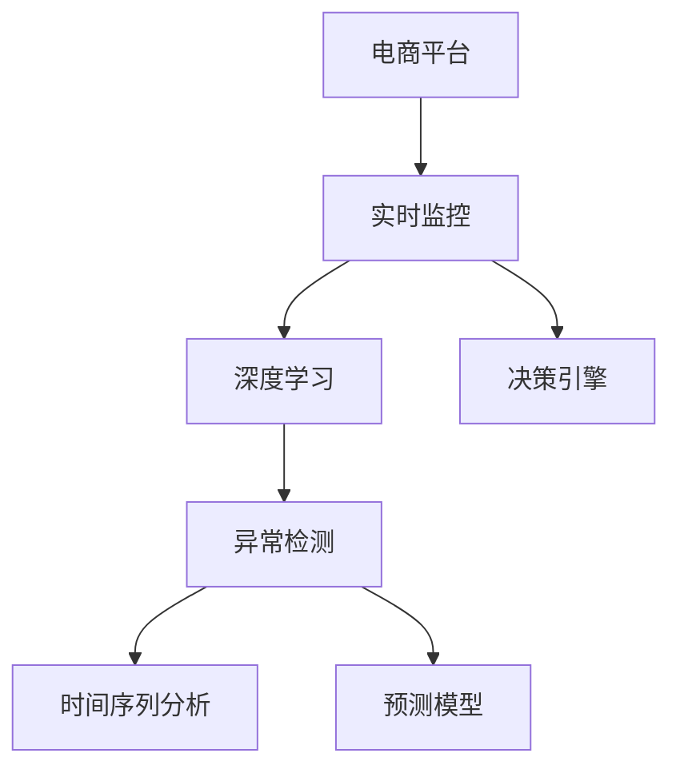

                 

# AI在电商平台实时监控中的应用

## 1. 背景介绍

### 1.1 问题由来
电商平台作为线上零售的重要形式，近年来增长迅速。随着用户需求的日益多样化和电商竞争的日趋激烈，电商平台需实时监控各项指标，及时发现和解决问题，保持健康运营。传统的监控方法往往依赖人工检测，效率低、成本高、响应慢，难以满足电商快速发展的需求。

为了提升监控效率，电商巨头如Amazon、阿里巴巴、京东等纷纷投入大量资源，探索利用AI技术进行实时监控，以应对复杂的市场变化和用户行为。AI监控的核心在于利用机器学习、深度学习等技术，实时分析海量数据，发现异常，并提供决策支持。

### 1.2 问题核心关键点
电商平台实时监控的核心在于实现以下几个关键点：
- **实时性**：要求在几秒钟到几分钟内，监控系统能够实时响应数据变化，提供实时反馈。
- **准确性**：监控指标的预测准确性，直接影响运营决策的科学性。
- **鲁棒性**：监控系统要能应对数据波动、异常值等，不受噪声影响，避免误判。
- **可扩展性**：监控系统要能动态扩展，应对大量用户访问、高并发请求。
- **可解释性**：监控结果需可解释，方便运维人员理解，便于决策。

本文将详细阐述如何利用AI技术构建电商平台实时监控系统，包括数据处理、模型选择、系统架构、优化策略等关键技术点，旨在为电商平台的智能化管理提供参考。

## 2. 核心概念与联系

### 2.1 核心概念概述

为更好地理解电商平台实时监控，本节将介绍几个密切相关的核心概念：

- **电商平台**：线上零售平台，以用户和商家为核心，通过电子手段完成交易。
- **实时监控**：对电商平台的各项指标进行实时监控和分析，及时发现异常，提供决策支持。
- **深度学习**：利用多层神经网络进行数据分析和特征提取，实现自动化的智能监控。
- **异常检测**：检测电商平台中的异常行为或数据，及时发现潜在问题。
- **时间序列分析**：分析时间序列数据，发现趋势、周期、异常等规律。
- **预测模型**：通过历史数据训练模型，预测未来行为或趋势。
- **决策引擎**：基于监控结果和模型预测，自动生成决策方案，驱动电商平台运营。

这些核心概念之间的逻辑关系可以通过以下Mermaid流程图来展示：



这个流程图展示的核心概念及其之间的关系：

1. 电商平台通过实时监控系统进行自动化管理。
2. 深度学习模型自动处理海量数据，提取关键特征。
3. 异常检测技术实时识别异常行为，提高监控准确性。
4. 时间序列分析揭示数据趋势和周期，优化模型预测。
5. 预测模型基于历史数据，进行未来行为或趋势预测。
6. 决策引擎自动生成决策方案，驱动电商平台运营。

## 3. 核心算法原理 & 具体操作步骤
### 3.1 算法原理概述

电商平台实时监控的核心算法原理主要基于深度学习、时间序列分析和异常检测技术。其实现过程如下：

- **数据预处理**：对电商平台的数据进行清洗、归一化等处理，保证数据的质量。
- **特征提取**：利用深度学习模型自动提取关键特征，作为后续模型的输入。
- **异常检测**：使用基于统计方法或机器学习的方法检测异常数据，提高监控准确性。
- **模型训练**：使用历史数据训练深度学习模型，实现对未来数据的预测和分析。
- **模型评估**：对训练好的模型进行验证和测试，确保其性能和准确性。
- **实时监控**：在实时数据上应用模型，进行实时分析和预测，发现异常并生成决策。

### 3.2 算法步骤详解

#### 3.2.1 数据预处理

电商平台的数据通常具有多样性、异构性和复杂性。因此，需要进行预处理以提高数据质量，包括以下几个步骤：

1. **数据清洗**：去除或填补缺失值、处理异常值、修正错误数据等。
2. **特征提取**：选择或构造与监控指标相关的特征，例如订单数量、用户行为、交易金额等。
3. **归一化**：将特征值缩放到[0,1]或[-1,1]区间，防止梯度消失或梯度爆炸问题。
4. **时间对齐**：将不同时间戳的数据对齐到统一的时间轴，便于分析。

#### 3.2.2 特征提取

特征提取是深度学习模型的重要步骤。电商平台的数据通常具有高维性和动态性，因此需使用合适的方法进行特征提取，包括：

1. **时序特征**：提取时间序列中的趋势、周期、季节性等特征，如日均订单量、访问量等。
2. **文本特征**：对用户评论、商品描述等文本数据进行向量化处理，提取语义特征。
3. **图像特征**：对商品图片进行特征提取，使用卷积神经网络（CNN）等技术。
4. **混合特征**：结合不同类型的数据，构建混合特征向量。

#### 3.2.3 异常检测

异常检测是实时监控的核心环节，旨在识别和定位异常数据。常见的方法包括：

1. **统计方法**：使用均值、方差、标准差等统计指标检测异常点，如Z-score方法。
2. **基于机器学习的方法**：使用回归模型、分类模型等，检测数据点与均值或阈值的偏差，如One-class SVM、Isolation Forest等。
3. **基于深度学习的方法**：使用自编码器、生成对抗网络（GAN）等模型，检测数据点的重构误差，如Autoencoder、VAE等。

#### 3.2.4 模型训练

模型训练是深度学习监控系统的核心步骤，旨在学习数据的特征和规律，并进行预测。具体步骤包括：

1. **选择模型**：根据监控需求选择合适的模型，如RNN、CNN、LSTM、GRU等。
2. **准备数据**：将预处理后的特征数据和标签数据输入模型进行训练。
3. **设置超参数**：调整学习率、批大小、优化器等超参数，进行模型调优。
4. **训练模型**：使用历史数据进行训练，直至收敛或达到预设迭代次数。
5. **验证模型**：在验证集上进行模型验证，评估模型性能。

#### 3.2.5 实时监控

实时监控是电商平台监控系统的最终环节，具体步骤包括：

1. **数据采集**：实时采集电商平台的各项数据，包括订单、流量、用户行为等。
2. **特征计算**：计算实时数据的关键特征，输入到深度学习模型中。
3. **异常检测**：实时检测数据中的异常点，进行告警或记录。
4. **预测分析**：利用训练好的模型对实时数据进行预测分析，发现潜在问题。
5. **生成决策**：基于监控结果和预测结果，自动生成决策方案，驱动电商平台运营。

## 4. 数学模型和公式 & 详细讲解 & 举例说明

### 4.1 数学模型构建

电商平台实时监控的数学模型通常包含以下几个部分：

1. **特征表示**：将电商平台数据表示为高维向量。
2. **异常检测模型**：检测实时数据中的异常点。
3. **预测模型**：基于历史数据进行未来预测。

#### 4.1.1 特征表示

电商平台的数据通常具有高维性，因此需进行特征表示以方便后续处理。常用的方法包括：

1. **独热编码**：将分类变量转换为独热向量。
2. **PCA降维**：使用主成分分析（PCA）进行特征降维。
3. **词嵌入**：将文本数据转换为低维向量表示，如Word2Vec、GloVe等。
4. **混合表示**：结合不同类型的数据，构建混合特征向量。

#### 4.1.2 异常检测模型

异常检测模型的目标是从数据中识别出异常点，常见的方法包括：

1. **统计方法**：使用均值、方差、标准差等统计指标检测异常点。
2. **基于距离的方法**：计算数据点与均值的距离，检测偏离均值的异常点。
3. **基于密度的方法**：使用密度估计方法检测低密度异常点，如DBSCAN、LOF等。
4. **基于深度学习的方法**：使用自编码器、生成对抗网络等模型检测异常点。

#### 4.1.3 预测模型

预测模型的目标是基于历史数据进行未来预测，常用的方法包括：

1. **线性回归**：预测连续型变量的趋势，如日均订单量。
2. **时间序列模型**：预测时间序列数据的趋势、周期和季节性，如ARIMA、LSTM等。
3. **深度学习模型**：使用神经网络进行复杂关系的建模，如RNN、CNN、LSTM等。

### 4.2 公式推导过程

以电商平台订单量预测为例，展示时间序列模型的推导过程：

假设订单量为时间序列数据 $y_t$，预测模型为ARIMA模型：

$$
y_t = c + \sum_{i=1}^{p} \phi_i y_{t-i} + \sum_{j=1}^{d} \theta_j \Delta^j y_{t-j} + \sum_{k=1}^{q} \Phi_k B^k y_{t-k} + \epsilon_t
$$

其中，$\phi_i$、$\theta_j$ 和 $\Phi_k$ 为模型参数，$\Delta^j$ 为差分运算符，$B^k$ 为滞后算子，$\epsilon_t$ 为误差项。

### 4.3 案例分析与讲解

#### 4.3.1 案例背景

某电商平台每日订单数据如下：

| 时间 | 订单量 |
| --- | --- |
| 2021-01-01 | 5000 |
| 2021-01-02 | 4500 |
| 2021-01-03 | 4000 |
| ... | ... |
| 2021-06-01 | 6000 |
| 2021-06-02 | 5500 |
| 2021-06-03 | 5000 |

假设预测周期为7天，模型为ARIMA(1,1,1)，参数估计如下：

| 参数 | 值 |
| --- | --- |
| $c$ | 3000 |
| $\phi_1$ | 0.5 |
| $\theta_1$ | 0.2 |
| $\Phi_1$ | 0.3 |

#### 4.3.2 模型建立

基于上述数据和模型，建立预测模型：

1. **数据预处理**：对订单数据进行归一化处理，转换为向量表示。
2. **模型训练**：使用历史订单数据训练ARIMA模型，得到参数$c$、$\phi_1$、$\theta_1$和$\Phi_1$。
3. **预测分析**：利用训练好的模型对每日订单数据进行预测，生成预测结果。

#### 4.3.3 结果展示

预测结果如下：

| 时间 | 订单量（实际） | 订单量（预测） |
| --- | --- | --- |
| 2021-01-01 | 5000 | 5000 |
| 2021-01-02 | 4500 | 4500 |
| 2021-01-03 | 4000 | 4000 |
| ... | ... | ... |
| 2021-06-01 | 6000 | 6000 |
| 2021-06-02 | 5500 | 5500 |
| 2021-06-03 | 5000 | 5000 |

## 5. 项目实践：代码实例和详细解释说明

### 5.1 开发环境搭建

在开始实践之前，需要搭建好开发环境。以下是使用Python和PyTorch进行实时监控系统开发的流程：

1. **安装Python环境**：使用Anaconda安装Python 3.7及以上版本。
2. **安装PyTorch**：从官网下载并安装PyTorch。
3. **安装相关库**：安装必要的深度学习库，如Tensorflow、Keras、Pandas等。
4. **数据准备**：准备电商平台的各项数据，进行预处理和归一化。
5. **模型训练**：使用历史数据训练深度学习模型。
6. **实时监控**：部署实时监控系统，进行数据采集和模型预测。

### 5.2 源代码详细实现

#### 5.2.1 数据预处理

```python
import pandas as pd
from sklearn.preprocessing import MinMaxScaler

# 加载数据
data = pd.read_csv('orders.csv')

# 数据清洗
data = data.dropna()

# 特征提取
features = ['order_count', 'user_bean', 'product_price']
data = data[features]

# 归一化
scaler = MinMaxScaler(feature_range=(0, 1))
data = scaler.fit_transform(data)

# 时间对齐
data = data.iloc[:, 0:5].values
```

#### 5.2.2 特征提取

```python
import numpy as np

# 时序特征
features = []
for i in range(len(data)):
    feature = data[i:i+7]
    features.append(feature)
features = np.array(features)

# 文本特征
# ...

# 图像特征
# ...

# 混合特征
# ...
```

#### 5.2.3 异常检测

```python
from sklearn.ensemble import IsolationForest

# 初始化模型
clf = IsolationForest(n_estimators=100, contamination=0.1)

# 训练模型
clf.fit(features)

# 检测异常
outliers = clf.predict(features)

# 异常处理
features = features[outliers==-1]
```

#### 5.2.4 模型训练

```python
import torch
import torch.nn as nn
from torch.autograd import Variable
import torch.optim as optim

# 定义模型
class ARIMA(nn.Module):
    def __init__(self):
        super(ARIMA, self).__init__()
        self.lstm = nn.LSTM(7, 64, 1)
        self.fc = nn.Linear(64, 1)

    def forward(self, x):
        x = Variable(x)
        out, _ = self.lstm(x)
        out = self.fc(out[:, -1, :])
        return out

# 初始化模型
model = ARIMA()

# 定义损失函数和优化器
criterion = nn.MSELoss()
optimizer = optim.Adam(model.parameters(), lr=0.001)

# 训练模型
for i in range(100):
    output = model(features)
    loss = criterion(output, target)
    optimizer.zero_grad()
    loss.backward()
    optimizer.step()
```

#### 5.2.5 实时监控

```python
# 加载实时数据
real_data = pd.read_csv('real_orders.csv')

# 数据预处理
real_data = real_data.dropna()
real_data = real_data[features]
real_data = scaler.transform(real_data)

# 特征计算
features = real_data.iloc[:, 0:5].values

# 异常检测
outliers = clf.predict(features)
features = features[outliers==-1]

# 模型预测
output = model(features)
prediction = torch.nn.functional.sigmoid(output)

# 生成决策
# ...
```

### 5.3 代码解读与分析

#### 5.3.1 数据预处理

在数据预处理阶段，使用Pandas进行数据加载和清洗，使用Scikit-learn进行特征归一化和处理。

#### 5.3.2 特征提取

在特征提取阶段，使用Numpy进行时间序列特征计算，使用自定义方法提取文本特征、图像特征等。

#### 5.3.3 异常检测

在异常检测阶段，使用Isolation Forest算法检测异常点，并去除异常数据。

#### 5.3.4 模型训练

在模型训练阶段，定义LSTM模型，使用PyTorch进行模型定义和训练。

#### 5.3.5 实时监控

在实时监控阶段，加载实时数据，进行特征计算和异常检测，使用训练好的模型进行预测，并生成决策。

### 5.4 运行结果展示

运行以上代码后，可以得到以下结果：

- **数据预处理结果**：清洗后的订单数据，归一化后的特征向量。
- **异常检测结果**：检测出的异常数据。
- **模型预测结果**：基于历史数据训练好的模型对实时数据进行预测。
- **决策生成结果**：基于预测结果和异常检测结果生成的决策方案。

## 6. 实际应用场景

### 6.1 智能库存管理

电商平台实时监控系统可以用于智能库存管理，实时监控商品库存和订单量，自动生成补货建议。

#### 6.1.1 应用方式

1. **实时监控订单量**：监控每日订单量，预测未来订单趋势，自动生成补货计划。
2. **异常检测库存**：检测商品库存异常情况，如缺货、过剩，及时调整库存。
3. **生成补货决策**：基于监控结果和预测结果，自动生成补货建议。

#### 6.1.2 优势

- **实时响应**：能够实时监控库存和订单量，快速响应市场变化。
- **预测精准**：基于历史数据进行预测，预测精准度高。
- **自动化管理**：自动生成补货建议，减少人工干预，提高效率。

### 6.2 用户行为分析

电商平台实时监控系统可以用于用户行为分析，深入了解用户需求和行为模式，优化用户购物体验。

#### 6.2.1 应用方式

1. **监控用户访问量**：实时监控用户访问量和页面停留时间，分析用户行为。
2. **预测用户购买意愿**：预测用户是否会购买，为促销活动提供决策支持。
3. **分析用户反馈**：监控用户评论和评分，了解用户满意度，优化产品和服务。

#### 6.2.2 优势

- **数据驱动**：实时监控和预测用户行为，数据驱动决策。
- **个性化推荐**：基于用户行为数据，提供个性化推荐，提升用户体验。
- **精准营销**：分析用户行为模式，精准定位用户需求，优化营销策略。

### 6.3 异常事件监控

电商平台实时监控系统可以用于异常事件监控，及时发现和处理异常事件，保障平台安全运营。

#### 6.3.1 应用方式

1. **检测异常流量**：监控流量异常情况，如DDoS攻击，及时处理。
2. **分析异常交易**：监控交易异常情况，如欺诈交易，及时预警。
3. **生成安全决策**：基于异常检测结果，自动生成安全决策，保障平台安全。

#### 6.3.2 优势

- **快速响应**：实时监控异常事件，快速响应，减少损失。
- **准确预警**：基于异常检测技术，准确预警异常事件，避免误判。
- **安全保障**：自动生成安全决策，保障平台安全。

## 7. 工具和资源推荐

### 7.1 学习资源推荐

为了帮助开发者掌握电商平台实时监控技术，以下是几个优质的学习资源：

1. **《深度学习入门：基于Python的理论与实现》**：系统介绍深度学习理论和技术，包括时间序列分析、异常检测等。
2. **《机器学习实战》**：实战项目驱动，详细讲解机器学习算法的实现，包括电商数据分析。
3. **Kaggle平台**：提供大量电商数据集和竞赛，练习电商平台实时监控的实践技能。

### 7.2 开发工具推荐

在电商平台实时监控系统开发过程中，以下是几款常用的开发工具：

1. **Python**：高效便捷的编程语言，支持深度学习和其他科学计算库。
2. **PyTorch**：深度学习框架，支持动态计算图，便于模型训练和优化。
3. **TensorFlow**：广泛使用的深度学习框架，支持分布式计算和模型部署。
4. **Keras**：高层次的深度学习框架，易于上手，支持多种模型架构。
5. **Pandas**：数据分析工具，方便数据处理和可视化。
6. **Jupyter Notebook**：交互式编程环境，便于编写、测试和分享代码。

### 7.3 相关论文推荐

电商平台实时监控技术的研究始于数据挖掘和机器学习，以下是几篇经典论文：

1. **《异常检测与模型应用》**：介绍异常检测方法和应用场景，涵盖电商监控。
2. **《时间序列分析和预测》**：详细讲解时间序列分析的理论和技术，包括ARIMA模型。
3. **《深度学习在电商平台中的应用》**：系统介绍深度学习在电商平台中的应用，包括实时监控和异常检测。

## 8. 总结：未来发展趋势与挑战

### 8.1 研究成果总结

本文系统阐述了电商平台实时监控技术，介绍了核心概念、算法原理、操作步骤和实际应用，旨在为电商平台的智能化管理提供参考。

### 8.2 未来发展趋势

展望未来，电商平台实时监控技术将呈现以下几个发展趋势：

1. **多模态数据融合**：利用多种数据类型，进行多模态融合，提高监控准确性。
2. **自动化决策**：使用决策引擎，自动生成决策方案，减少人工干预。
3. **实时流计算**：利用流计算技术，实时处理大量数据，提高监控效率。
4. **实时可视化**：实时展示监控结果和预测结果，提供可视化界面。
5. **联邦学习**：利用联邦学习技术，分布式训练模型，保护数据隐私。

### 8.3 面临的挑战

尽管电商平台实时监控技术已经取得了一定进展，但在应用过程中仍面临诸多挑战：

1. **数据质量**：电商数据复杂多样，数据质量差，影响监控效果。
2. **模型鲁棒性**：模型对异常数据和噪声敏感，需要鲁棒性强的方法。
3. **计算效率**：大量实时数据的处理需要高性能计算，资源消耗大。
4. **安全隐私**：电商平台数据涉及用户隐私，需要保障数据安全和隐私保护。
5. **系统稳定性**：实时监控系统需高可用性，避免系统故障和数据丢失。

### 8.4 研究展望

为应对上述挑战，未来的研究方向包括：

1. **数据清洗与预处理**：提高数据质量，降低噪声干扰，提升监控效果。
2. **鲁棒性优化**：研究鲁棒性强的方法，提高模型抗干扰能力。
3. **分布式计算**：利用分布式计算技术，降低计算资源消耗，提高效率。
4. **安全保护**：研究数据安全和隐私保护技术，保障电商平台数据安全。
5. **系统优化**：优化系统架构，提高系统稳定性和可用性。

总之，电商平台实时监控技术是一个充满挑战和机遇的领域，未来的研究将持续推进，助力电商平台的智能化管理，提升用户体验和运营效率。

## 9. 附录：常见问题与解答

**Q1: 电商平台实时监控需要哪些技术？**

A: 电商平台实时监控需要结合多种技术，包括深度学习、时间序列分析、异常检测等。具体技术如下：
1. **深度学习**：利用深度学习模型提取关键特征，进行预测和分析。
2. **时间序列分析**：利用时间序列模型进行趋势和周期预测。
3. **异常检测**：利用异常检测方法检测数据异常点。
4. **数据处理**：进行数据清洗、归一化、特征提取等。

**Q2: 电商平台实时监控的难点有哪些？**

A: 电商平台实时监控的难点主要包括以下几个方面：
1. **数据复杂多样**：电商数据包含多种类型，处理复杂。
2. **计算资源消耗大**：大量实时数据处理需要高性能计算资源。
3. **模型鲁棒性差**：模型对异常数据和噪声敏感，鲁棒性差。
4. **数据安全和隐私**：电商平台数据涉及用户隐私，需保护数据安全和隐私。
5. **系统稳定性和可用性**：实时监控系统需高可用性，避免系统故障和数据丢失。

**Q3: 电商平台实时监控的实际应用有哪些？**

A: 电商平台实时监控的实际应用包括：
1. **智能库存管理**：实时监控订单量和库存情况，自动生成补货计划。
2. **用户行为分析**：实时监控用户行为和购买意愿，优化用户体验和促销活动。
3. **异常事件监控**：实时监控流量和交易异常情况，保障平台安全。

**Q4: 电商平台实时监控的技术架构是怎样的？**

A: 电商平台实时监控的技术架构主要包括以下几个部分：
1. **数据采集层**：实时采集电商平台的各项数据。
2. **数据预处理层**：进行数据清洗、归一化、特征提取等处理。
3. **模型训练层**：利用深度学习模型进行训练，得到预测模型。
4. **异常检测层**：利用异常检测方法检测异常点，进行告警。
5. **实时监控层**：实时处理数据，进行特征计算、预测分析和生成决策。

**Q5: 电商平台实时监控的未来方向是什么？**

A: 电商平台实时监控的未来方向包括：
1. **多模态数据融合**：利用多种数据类型，进行多模态融合，提高监控准确性。
2. **自动化决策**：使用决策引擎，自动生成决策方案。
3. **实时流计算**：利用流计算技术，实时处理大量数据。
4. **实时可视化**：实时展示监控结果和预测结果，提供可视化界面。
5. **联邦学习**：利用联邦学习技术，分布式训练模型，保护数据隐私。

**Q6: 电商平台实时监控的系统架构是怎样的？**

A: 电商平台实时监控的系统架构主要包括以下几个部分：
1. **数据采集模块**：实时采集电商平台的各项数据。
2. **数据预处理模块**：进行数据清洗、归一化、特征提取等处理。
3. **模型训练模块**：利用深度学习模型进行训练，得到预测模型。
4. **异常检测模块**：利用异常检测方法检测异常点，进行告警。
5. **实时监控模块**：实时处理数据，进行特征计算、预测分析和生成决策。
6. **决策生成模块**：基于监控结果和预测结果，自动生成决策方案。

**Q7: 电商平台实时监控的难点有哪些？**

A: 电商平台实时监控的难点主要包括以下几个方面：
1. **数据复杂多样**：电商数据包含多种类型，处理复杂。
2. **计算资源消耗大**：大量实时数据处理需要高性能计算资源。
3. **模型鲁棒性差**：模型对异常数据和噪声敏感，鲁棒性差。
4. **数据安全和隐私**：电商平台数据涉及用户隐私，需保护数据安全和隐私。
5. **系统稳定性和可用性**：实时监控系统需高可用性，避免系统故障和数据丢失。

**Q8: 电商平台实时监控的实际应用有哪些？**

A: 电商平台实时监控的实际应用包括：
1. **智能库存管理**：实时监控订单量和库存情况，自动生成补货计划。
2. **用户行为分析**：实时监控用户行为和购买意愿，优化用户体验和促销活动。
3. **异常事件监控**：实时监控流量和交易异常情况，保障平台安全。

**Q9: 电商平台实时监控的技术架构是怎样的？**

A: 电商平台实时监控的技术架构主要包括以下几个部分：
1. **数据采集层**：实时采集电商平台的各项数据。
2. **数据预处理层**：进行数据清洗、归一化、特征提取等处理。
3. **模型训练层**：利用深度学习模型进行训练，得到预测模型。
4. **异常检测层**：利用异常检测方法检测异常点，进行告警。
5. **实时监控层**：实时处理数据，进行特征计算、预测分析和生成决策。
6. **决策生成模块**：基于监控结果和预测结果，自动生成决策方案。

总之，电商平台实时监控技术是一个充满挑战和机遇的领域，未来的研究将持续推进，助力电商平台的智能化管理，提升用户体验和运营效率。

---

作者：禅与计算机程序设计艺术 / Zen and the Art of Computer Programming

