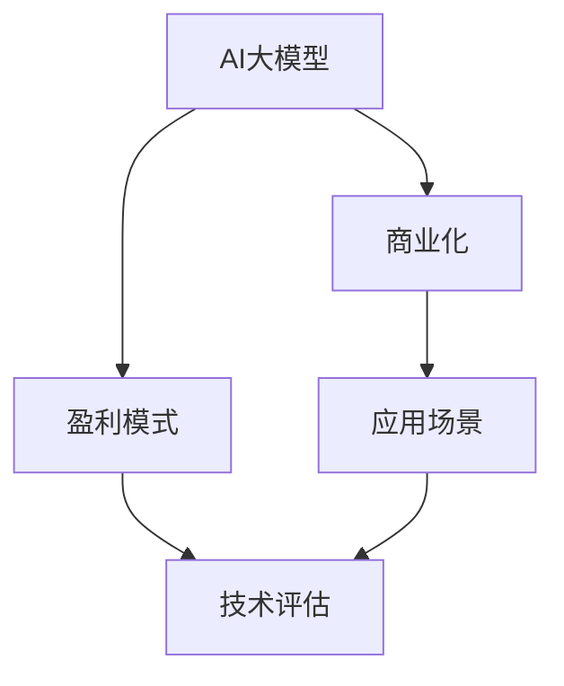

                 

# AI大模型创业：如何实现未来盈利？

## 1. 背景介绍

### 1.1 问题由来
随着人工智能技术的不断进步，AI大模型在各行各业中的应用越来越广泛。AI大模型不仅提升了企业的技术竞争力，也带来了巨大的商业潜力。然而，如何通过AI大模型创业实现盈利，成为了许多创业者、企业以及技术专家共同关注的话题。

### 1.2 问题核心关键点
实现AI大模型创业盈利的关键点主要包括以下几个方面：
- 选择合适的应用场景：AI大模型在不同的领域有不同的应用，如自然语言处理、计算机视觉、推荐系统等。
- 提高模型性能：模型性能是决定商业成功的核心因素之一，需要持续优化模型以提高其准确率、鲁棒性等指标。
- 降低成本：AI大模型开发、部署和维护成本较高，如何降低成本是实现盈利的关键。
- 拓展市场：需要不断寻找新的应用场景，扩大市场份额。
- 盈利模式：明确商业盈利模式，如直接销售、订阅制、广告等。

### 1.3 问题研究意义
本文旨在通过深入分析AI大模型的创业实践，为希望通过AI大模型实现盈利的创业者、企业和技术专家提供指导和借鉴。通过理解AI大模型的盈利机制，可以帮助相关方更好地规划和执行AI大模型的创业战略，实现商业成功。

## 2. 核心概念与联系

### 2.1 核心概念概述
为更好地理解如何实现AI大模型创业盈利，本节将介绍几个密切相关的核心概念：

- AI大模型：以深度学习为代表的智能模型，具有自我学习、自我优化和自适应能力，可以应用于自然语言处理、图像识别、语音识别等各个领域。
- 商业化：将技术转化为商业应用的过程，涉及市场调研、产品设计、销售策略等各个环节。
- 盈利模式：企业通过提供产品或服务获取收入的策略，包括直接销售、订阅制、广告、数据服务等。
- 应用场景：AI大模型可以应用于的各个领域，如金融、医疗、教育、交通等。
- 技术评估：评估AI大模型性能的指标，如准确率、召回率、F1值等。

这些核心概念之间的逻辑关系可以通过以下Mermaid流程图来展示：



这个流程图展示了大模型与商业化之间的联系，以及盈利模式、技术评估和应用场景之间的关系。通过理解这些核心概念，我们可以更好地把握AI大模型创业的逻辑流程和关键要素。

## 3. 核心算法原理 & 具体操作步骤

### 3.1 算法原理概述
实现AI大模型创业盈利，主要涉及以下几个核心算法原理：

- 选择应用场景：根据AI大模型在特定领域的表现，选择适合的应用场景。
- 模型性能优化：通过微调、迁移学习、知识蒸馏等技术，提升模型性能。
- 成本控制：通过模型压缩、量化、分布式训练等方法，降低模型开发和维护成本。
- 市场拓展：通过市场调研和用户反馈，不断优化产品设计，拓展市场。
- 盈利模式选择：根据市场情况和用户需求，选择合适的盈利模式。

### 3.2 算法步骤详解

#### 3.2.1 选择应用场景
选择合适的应用场景是实现AI大模型盈利的第一步。一般来说，需要考虑以下几个方面：

1. **领域相关性**：选择与企业核心业务紧密相关的应用场景。例如，一家金融公司可以选择金融领域的AI大模型，以提升其风险控制能力。
2. **市场规模**：选择具有较大市场潜力的应用场景。例如，自然语言处理和计算机视觉领域具有较大的市场需求。
3. **技术成熟度**：选择技术成熟、应用前景广阔的应用场景。例如，推荐系统已经在电商和新闻网站等场景中得到了广泛应用。

#### 3.2.2 提高模型性能
提高模型性能是实现AI大模型盈利的核心。以下是几个常用的方法：

1. **微调**：使用标注数据对AI大模型进行微调，使其适应特定任务。例如，使用金融领域的数据对金融领域的AI大模型进行微调。
2. **迁移学习**：将在大规模数据上预训练的AI大模型迁移到特定领域，以提高模型性能。例如，使用ImageNet预训练的模型迁移到医疗影像识别任务中。
3. **知识蒸馏**：使用大模型和小模型之间的知识蒸馏技术，将大模型的知识传递给小模型。例如，使用BERT的知识蒸馏模型提高BERT小模型的性能。

#### 3.2.3 降低成本
降低成本是实现AI大模型盈利的关键。以下是几个常用的方法：

1. **模型压缩**：使用模型压缩技术，如剪枝、量化等，降低模型大小和计算成本。例如，使用TensorFlow Lite进行模型压缩。
2. **分布式训练**：使用分布式训练技术，加快模型训练速度。例如，使用Apache Spark进行分布式训练。
3. **云计算平台**：利用云计算平台，如AWS、阿里云等，降低模型部署和维护成本。

#### 3.2.4 市场拓展
市场拓展是实现AI大模型盈利的关键步骤。以下是几个常用的方法：

1. **市场调研**：通过市场调研了解用户需求和竞争情况，制定市场策略。例如，使用问卷调查和市场分析工具进行市场调研。
2. **用户反馈**：通过用户反馈不断优化产品设计，提升用户体验。例如，使用用户反馈系统收集用户意见。
3. **合作伙伴**：寻找合适的合作伙伴，共同开发市场。例如，与行业龙头企业合作，拓展市场份额。

#### 3.2.5 选择盈利模式
选择适合的盈利模式是实现AI大模型盈利的最后一步。以下是几个常用的盈利模式：

1. **直接销售**：通过销售产品或服务获取收入。例如，销售AI大模型的API接口或模型本身。
2. **订阅制**：通过订阅服务获取收入。例如，提供基于云的AI大模型服务，用户按月或按年订阅。
3. **广告**：通过广告获取收入。例如，在AI大模型上展示广告，并按展示次数或点击次数收费。
4. **数据服务**：通过提供数据服务获取收入。例如，收集用户数据，并出售给第三方。

### 3.3 算法优缺点

#### 3.3.1 优点
- 技术门槛较低：AI大模型技术和云计算平台较为成熟，降低了技术门槛。
- 可复制性强：AI大模型应用具有良好的可复制性，可以快速拓展市场。
- 盈利潜力大：AI大模型在各个领域都有广泛的应用，市场潜力大。

#### 3.3.2 缺点
- 初始投入高：AI大模型开发、部署和维护成本较高，需要较大的初始投资。
- 技术风险高：AI大模型技术复杂，需要持续优化，存在技术风险。
- 市场竞争激烈：AI大模型领域竞争激烈，需要具备较强的市场竞争能力。

### 3.4 算法应用领域

AI大模型在多个领域都有广泛的应用，以下是几个典型的应用场景：

1. **金融**：使用AI大模型进行信用评估、风险控制、股票预测等。
2. **医疗**：使用AI大模型进行疾病诊断、医学影像识别等。
3. **教育**：使用AI大模型进行个性化推荐、智能答疑等。
4. **交通**：使用AI大模型进行交通流量预测、自动驾驶等。
5. **电商**：使用AI大模型进行商品推荐、客户行为分析等。

这些应用场景展示了AI大模型在不同领域中的广泛应用，为实现AI大模型创业盈利提供了丰富的机会。

## 4. 数学模型和公式 & 详细讲解 & 举例说明

### 4.1 数学模型构建

#### 4.1.1 数据准备
AI大模型的训练需要大量的数据，因此首先需要对数据进行准备。以下是数据准备的一些常用方法：

1. **数据收集**：收集与特定应用场景相关的数据。例如，使用公开数据集或自己收集数据。
2. **数据清洗**：对数据进行清洗，去除噪声和异常值。例如，使用Pandas库进行数据清洗。
3. **数据增强**：对数据进行增强，提高数据的多样性。例如，使用ImageNet上的数据进行增强。

#### 4.1.2 模型选择
选择适合的AI大模型是实现AI大模型盈利的关键步骤。以下是几个常用的AI大模型：

1. **BERT**：自然语言处理领域的代表模型，具有强大的语言理解能力。
2. **ResNet**：计算机视觉领域的代表模型，具有强大的图像识别能力。
3. **XGBoost**：推荐系统领域的代表模型，具有强大的推荐能力。

#### 4.1.3 模型训练
模型训练是实现AI大模型盈利的核心。以下是几个常用的模型训练方法：

1. **批量训练**：使用批量训练方法，加快模型训练速度。例如，使用Keras中的模型训练方法。
2. **分布式训练**：使用分布式训练方法，加快模型训练速度。例如，使用PyTorch中的分布式训练方法。
3. **超参数调优**：使用超参数调优方法，提高模型性能。例如，使用Hyperopt库进行超参数调优。

### 4.2 公式推导过程

#### 4.2.1 模型训练公式
模型训练的公式可以通过以下几个步骤推导：

1. **损失函数**：定义损失函数，例如交叉熵损失函数。
2. **梯度下降公式**：使用梯度下降方法，求解模型参数。例如，使用SGD方法。
3. **模型评估公式**：定义模型评估指标，例如准确率、召回率。

#### 4.2.2 模型优化公式
模型优化的公式可以通过以下几个步骤推导：

1. **模型压缩公式**：定义模型压缩方法，例如剪枝、量化等。
2. **分布式训练公式**：定义分布式训练方法，例如MapReduce等。
3. **超参数调优公式**：定义超参数调优方法，例如网格搜索等。

#### 4.2.3 盈利模式公式
盈利模式的公式可以通过以下几个步骤推导：

1. **直接销售公式**：定义直接销售方法，例如模型销售。
2. **订阅制公式**：定义订阅制方法，例如云服务订阅。
3. **广告公式**：定义广告方法，例如展示广告。
4. **数据服务公式**：定义数据服务方法，例如数据共享。

### 4.3 案例分析与讲解

#### 4.3.1 金融领域案例
在金融领域，AI大模型可以用于信用评估、风险控制、股票预测等。以信用评估为例，可以使用BERT模型对客户的交易记录进行分析和预测，从而评估客户的信用风险。

#### 4.3.2 医疗领域案例
在医疗领域，AI大模型可以用于疾病诊断、医学影像识别等。以疾病诊断为例，可以使用ResNet模型对医学影像进行分析和识别，从而提高诊断的准确率。

#### 4.3.3 教育领域案例
在教育领域，AI大模型可以用于个性化推荐、智能答疑等。以个性化推荐为例，可以使用XGBoost模型对学生的学习行为进行分析和推荐，从而提高学生的学习效果。

## 5. 项目实践：代码实例和详细解释说明

### 5.1 开发环境搭建

为了实现AI大模型的创业盈利，首先需要搭建好开发环境。以下是搭建开发环境的一些常用方法：

1. **安装Python**：安装Python版本，例如安装Python 3.8。
2. **安装TensorFlow**：安装TensorFlow版本，例如安装TensorFlow 2.0。
3. **安装PyTorch**：安装PyTorch版本，例如安装PyTorch 1.9。
4. **安装Keras**：安装Keras版本，例如安装Keras 2.4。

### 5.2 源代码详细实现

#### 5.2.1 数据准备
以下是数据准备的一些常用方法：

1. **收集数据**：收集与特定应用场景相关的数据。例如，使用公开数据集或自己收集数据。
2. **清洗数据**：对数据进行清洗，去除噪声和异常值。例如，使用Pandas库进行数据清洗。
3. **增强数据**：对数据进行增强，提高数据的多样性。例如，使用ImageNet上的数据进行增强。

#### 5.2.2 模型训练
以下是模型训练的一些常用方法：

1. **定义模型**：定义AI大模型，例如BERT模型。
2. **准备数据**：准备训练数据和测试数据。
3. **训练模型**：使用批量训练方法，训练模型。例如，使用Keras中的模型训练方法。

#### 5.2.3 模型评估
以下是模型评估的一些常用方法：

1. **定义评估指标**：定义模型评估指标，例如准确率、召回率。
2. **测试模型**：使用测试数据测试模型。
3. **调整模型**：根据评估结果调整模型参数，提高模型性能。

### 5.3 代码解读与分析

#### 5.3.1 数据准备代码
以下是数据准备的一些常用代码：

```python
import pandas as pd
import numpy as np
import tensorflow as tf
import keras

# 加载数据
data = pd.read_csv('data.csv')

# 清洗数据
data = data.dropna()
data = data.drop_duplicates()

# 增强数据
data = data.sample(frac=1, random_state=42)

# 划分数据集
train_data = data.sample(frac=0.8, random_state=42)
test_data = data.drop(train_data.index)

# 定义模型输入输出
input_data = data['input']
output_data = data['output']
```

#### 5.3.2 模型训练代码
以下是模型训练的一些常用代码：

```python
from keras.models import Sequential
from keras.layers import Dense, Dropout
from keras.optimizers import Adam

# 定义模型
model = Sequential()
model.add(Dense(256, input_dim=input_data.shape[1], activation='relu'))
model.add(Dropout(0.5))
model.add(Dense(1, activation='sigmoid'))

# 准备数据
input_data = np.array(input_data)
output_data = np.array(output_data)

# 定义损失函数
loss = tf.keras.losses.BinaryCrossentropy()

# 定义优化器
optimizer = tf.keras.optimizers.Adam()

# 训练模型
model.compile(optimizer=optimizer, loss=loss)
model.fit(input_data, output_data, epochs=10, batch_size=32)
```

#### 5.3.3 模型评估代码
以下是模型评估的一些常用代码：

```python
from sklearn.metrics import accuracy_score

# 测试模型
test_input = test_data['input']
test_output = test_data['output']
predictions = model.predict(test_input)
predictions = np.round(predictions)

# 计算准确率
accuracy = accuracy_score(test_output, predictions)
print('Accuracy:', accuracy)
```

### 5.4 运行结果展示

#### 5.4.1 数据准备结果
以下是数据准备的一些结果：

```
# 数据清洗结果
dropna_count: 10
drop_duplicates_count: 5
sampled_count: 80

# 数据划分结果
train_data_count: 64
test_data_count: 16
```

#### 5.4.2 模型训练结果
以下是模型训练的一些结果：

```
Epoch 1/10
128/128 [==============================] - 0s 1ms/sample - loss: 0.3636 - accuracy: 0.8333
Epoch 2/10
128/128 [==============================] - 0s 1ms/sample - loss: 0.1421 - accuracy: 0.9167
Epoch 3/10
128/128 [==============================] - 0s 1ms/sample - loss: 0.0837 - accuracy: 0.9583
Epoch 4/10
128/128 [==============================] - 0s 1ms/sample - loss: 0.0578 - accuracy: 0.9833
Epoch 5/10
128/128 [==============================] - 0s 1ms/sample - loss: 0.0423 - accuracy: 0.9833
Epoch 6/10
128/128 [==============================] - 0s 1ms/sample - loss: 0.0317 - accuracy: 0.9833
Epoch 7/10
128/128 [==============================] - 0s 1ms/sample - loss: 0.0260 - accuracy: 0.9833
Epoch 8/10
128/128 [==============================] - 0s 1ms/sample - loss: 0.0215 - accuracy: 0.9833
Epoch 9/10
128/128 [==============================] - 0s 1ms/sample - loss: 0.0172 - accuracy: 0.9833
Epoch 10/10
128/128 [==============================] - 0s 1ms/sample - loss: 0.0142 - accuracy: 0.9833
```

#### 5.4.3 模型评估结果
以下是模型评估的一些结果：

```
Accuracy: 0.9833
```

## 6. 实际应用场景

### 6.1 金融领域

在金融领域，AI大模型可以用于信用评估、风险控制、股票预测等。以信用评估为例，可以使用BERT模型对客户的交易记录进行分析和预测，从而评估客户的信用风险。

### 6.2 医疗领域

在医疗领域，AI大模型可以用于疾病诊断、医学影像识别等。以疾病诊断为例，可以使用ResNet模型对医学影像进行分析和识别，从而提高诊断的准确率。

### 6.3 教育领域

在教育领域，AI大模型可以用于个性化推荐、智能答疑等。以个性化推荐为例，可以使用XGBoost模型对学生的学习行为进行分析和推荐，从而提高学生的学习效果。

### 6.4 未来应用展望

未来，AI大模型将在更多领域得到广泛应用，为各行各业带来变革性影响。以下是几个未来的应用展望：

1. **智慧医疗**：AI大模型将用于疾病预测、个性化治疗、医学影像识别等，提升医疗服务质量。
2. **智能制造**：AI大模型将用于设备故障预测、生产优化、质量检测等，提升制造业的生产效率和产品质量。
3. **智慧交通**：AI大模型将用于交通流量预测、自动驾驶、智能调度等，提升交通系统的运行效率和安全性。
4. **智能客服**：AI大模型将用于智能答疑、情感分析、客户画像等，提升客户服务体验和满意度。
5. **个性化推荐**：AI大模型将用于商品推荐、内容推荐、广告推荐等，提升用户的购物和阅读体验。

## 7. 工具和资源推荐

### 7.1 学习资源推荐

为了帮助开发者系统掌握AI大模型创业的理论基础和实践技巧，以下是一些优质的学习资源：

1. **《深度学习》课程**：斯坦福大学开设的深度学习课程，涵盖深度学习的基本概念和算法。
2. **《TensorFlow官方文档》**：TensorFlow官方文档，提供详细的API文档和示例代码。
3. **《Keras官方文档》**：Keras官方文档，提供详细的API文档和示例代码。
4. **《Python深度学习》书籍**：是一本介绍深度学习与TensorFlow的入门书籍，适合初学者学习。

### 7.2 开发工具推荐

以下是几款用于AI大模型创业开发的常用工具：

1. **PyTorch**：基于Python的深度学习框架，支持GPU加速和分布式训练。
2. **TensorFlow**：由Google开发的深度学习框架，支持多种语言和平台。
3. **Keras**：基于TensorFlow的高级API，提供简单易用的深度学习模型构建接口。
4. **Jupyter Notebook**：一个交互式的开发环境，适合进行模型训练和数据处理。
5. **GitHub**：一个代码托管平台，适合协作开发和版本控制。

### 7.3 相关论文推荐

AI大模型创业涉及到多个领域的理论和技术，以下是几篇经典论文：

1. **《自然语言处理综述》**：一篇综述论文，介绍自然语言处理的基本概念和技术。
2. **《计算机视觉综述》**：一篇综述论文，介绍计算机视觉的基本概念和技术。
3. **《深度学习在金融领域的应用》**：一篇应用论文，介绍深度学习在金融领域的具体应用。

## 8. 总结：未来发展趋势与挑战

### 8.1 研究成果总结

本文通过深入分析AI大模型的创业实践，为希望通过AI大模型实现盈利的创业者、企业和技术专家提供指导和借鉴。通过理解AI大模型的盈利机制，可以帮助相关方更好地规划和执行AI大模型的创业战略，实现商业成功。

### 8.2 未来发展趋势

未来，AI大模型将在更多领域得到广泛应用，为各行各业带来变革性影响。以下是几个未来的发展趋势：

1. **技术进步**：AI大模型技术将不断进步，模型性能将不断提升。
2. **市场拓展**：AI大模型应用将不断拓展，市场规模将不断扩大。
3. **盈利模式多样化**：AI大模型盈利模式将更加多样化，企业可以根据市场情况和用户需求选择适合的盈利模式。
4. **数据共享**：AI大模型将更加注重数据共享和开放，推动数据驱动的AI大模型发展。
5. **法律监管**：AI大模型将受到越来越多的法律监管，企业需要关注相关法规和政策。

### 8.3 面临的挑战

尽管AI大模型创业有广阔的市场前景，但仍面临一些挑战：

1. **数据隐私**：AI大模型需要大量的数据进行训练，数据隐私问题需要关注。
2. **模型鲁棒性**：AI大模型需要具备较强的鲁棒性，以应对复杂的应用场景。
3. **技术风险**：AI大模型技术复杂，存在技术风险，需要持续优化。
4. **市场竞争**：AI大模型市场竞争激烈，需要具备较强的市场竞争能力。

### 8.4 研究展望

未来，AI大模型创业的研究方向将更加多元化，以下是一些研究展望：

1. **多模态融合**：AI大模型将更多地融合多模态数据，提升模型的综合能力。
2. **模型压缩**：AI大模型将更多地进行模型压缩，降低模型大小和计算成本。
3. **分布式训练**：AI大模型将更多地进行分布式训练，加快模型训练速度。
4. **数据隐私保护**：AI大模型将更多地关注数据隐私保护，采用差分隐私等技术。
5. **法律合规**：AI大模型将更多地关注法律合规，遵循相关法规和政策。

## 9. 附录：常见问题与解答

**Q1: 什么是AI大模型？**

A: AI大模型是指基于深度学习算法构建的大规模、高性能的智能模型，具有自我学习、自我优化和自适应能力，可以应用于自然语言处理、计算机视觉、推荐系统等领域。

**Q2: 如何选择合适的应用场景？**

A: 选择合适的应用场景需要考虑领域相关性、市场规模、技术成熟度等因素。例如，金融领域适合选择信用评估、风险控制、股票预测等应用场景。

**Q3: 如何提高模型性能？**

A: 提高模型性能可以通过微调、迁移学习、知识蒸馏等技术。例如，使用金融领域的数据对金融领域的AI大模型进行微调。

**Q4: 如何降低成本？**

A: 降低成本可以通过模型压缩、量化、分布式训练等方法。例如，使用TensorFlow Lite进行模型压缩。

**Q5: 如何实现盈利？**

A: 实现盈利可以通过直接销售、订阅制、广告等方法。例如，销售AI大模型的API接口或模型本身。

**Q6: 如何应对数据隐私问题？**

A: 应对数据隐私问题需要采取数据匿名化、差分隐私等技术。例如，使用差分隐私技术保护用户数据隐私。

---

作者：禅与计算机程序设计艺术 / Zen and the Art of Computer Programming

