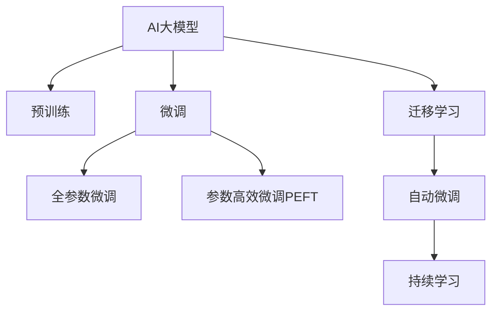

                 

# AI大模型创业：如何应对未来价格战？

人工智能技术的迅猛发展正改变着各行各业的游戏规则，AI大模型作为前沿科技，无疑是创业公司争相抢夺的“香饽饽”。然而，随着市场的不断扩张，越来越多的企业涌入这一领域，AI大模型创业市场也逐渐进入白热化阶段。未来，随着技术迭代和应用成熟，价格战将不可避免地到来。本文将从技术原理、市场策略和未来趋势等角度，探讨如何应对未来的AI大模型价格战。

## 1. 背景介绍

### 1.1 问题由来

随着人工智能技术的不断发展，AI大模型逐渐成为各行业数字化转型的核心引擎。从语音识别、图像处理到自然语言处理（NLP），AI大模型在诸多领域取得了显著的成果。这些大模型通过大规模无标签数据的预训练，具备强大的通用学习和推理能力。然而，随着技术的不断成熟，大模型的商业化应用也逐步增加，这使得越来越多的公司涉足这一领域，导致市场竞争加剧。

### 1.2 问题核心关键点

AI大模型创业面临的核心问题是如何在激烈的价格战中保持竞争力。价格战不仅会影响公司的利润，还可能引起市场秩序的混乱。为了应对价格战，公司需要在技术创新、市场策略和商业模式等方面进行全面优化，确保在竞争中赢得先机。

## 2. 核心概念与联系

### 2.1 核心概念概述

为更好地理解AI大模型创业中的价格战应对策略，本节将介绍几个密切相关的核心概念：

- AI大模型（AI Large Model）：指通过大规模无标签数据预训练，具备通用学习和推理能力的深度学习模型。目前广泛应用于语音识别、图像处理、NLP等诸多领域。

- 预训练（Pre-training）：指在大规模无标签数据上，通过自监督学习任务训练通用模型的过程。预训练使得模型学习到通用的语言、视觉或其他类型的特征表示。

- 微调（Fine-tuning）：指在预训练模型的基础上，使用任务特定的数据进行有监督学习，优化模型在特定任务上的性能。微调可以显著提升模型在特定任务上的效果，如分类、生成等。

- 迁移学习（Transfer Learning）：指将一个领域学习到的知识，迁移到另一个不同但相关的领域的学习范式。大模型的预训练-微调过程即是一种典型的迁移学习方式。

- 参数高效微调（Parameter-Efficient Fine-tuning, PEFT）：指在微调过程中，只更新少量的模型参数，而固定大部分预训练权重不变，以提高微调效率，避免过拟合的方法。

- 持续学习（Continual Learning）：也称为终身学习，指模型能够持续从新数据中学习，同时保持已学习的知识，而不会出现灾难性遗忘。这对于保持大模型的时效性和适应性至关重要。

- 自动微调（AutoML）：通过自动化方法，自动选择最优的模型架构、超参数和微调策略，使模型能够在有限的标注数据下获得最佳性能。

这些核心概念之间的逻辑关系可以通过以下Mermaid流程图来展示：



这个流程图展示了大模型创业的关键概念及其之间的关系：

1. AI大模型通过预训练获得基础能力。
2. 微调是对预训练模型进行任务特定的优化，可以分为全参数微调和参数高效微调（PEFT）。
3. 迁移学习是连接预训练模型与下游任务的桥梁，可以通过微调或自动微调实现。
4. 自动微调是一种自动选择最优微调策略的方法，通常配合超参数优化和算法搜索。
5. 持续学习旨在使模型能够不断学习新知识，同时避免遗忘旧知识。

这些概念共同构成了AI大模型的学习和应用框架，使其能够在各种场景下发挥强大的学习和推理能力。通过理解这些核心概念，我们可以更好地把握AI大模型的应用场景和优化方向。

## 3. 核心算法原理 & 具体操作步骤
### 3.1 算法原理概述

在AI大模型创业中，如何应对价格战的关键在于技术创新和市场策略的结合。本文将从技术创新和市场策略两个方面进行探讨。

### 3.2 算法步骤详解

#### 3.2.1 技术创新

1. **算法优化**：
   - **参数高效微调**：在微调过程中，只更新少量的模型参数，而固定大部分预训练权重不变，以提高微调效率，避免过拟合。
   - **自适应算法**：引入自适应算法，如AdaML、AdaBERT等，动态调整学习率和超参数，提升模型性能。
   - **多任务学习**：引入多任务学习（MTL），通过联合训练多个相关任务，提升模型的泛化能力。

2. **模型优化**：
   - **模型剪枝**：去除不必要的层和参数，减小模型尺寸，加快推理速度。
   - **量化加速**：将浮点模型转为定点模型，压缩存储空间，提高计算效率。
   - **模型并行**：使用模型并行（Model Parallelism），将大模型拆分成多个小模型并行训练和推理，降低计算复杂度。

3. **数据优化**：
   - **数据增强**：通过回译、近义替换等方式扩充训练集，提高模型的鲁棒性和泛化能力。
   - **半监督学习**：利用少量标注数据和大量无标注数据进行半监督学习，提升模型的泛化能力。
   - **联邦学习**：采用联邦学习（Federated Learning），在多个设备或客户端分布式训练模型，保护数据隐私。

#### 3.2.2 市场策略

1. **定价策略**：
   - **免费试用**：提供免费试用期，吸引用户注册和试用，增加市场份额。
   - **阶梯定价**：采用阶梯定价策略，降低对中小企业的门槛，吸引更多客户。
   - **按需付费**：提供灵活的按需付费模式，用户按需使用，降低固定成本。

2. **销售策略**：
   - **渠道销售**：通过线上和线下渠道，进行多渠道销售，覆盖更多潜在客户。
   - **合作伙伴**：与行业龙头企业合作，共同开发市场，扩大市场影响力。
   - **直销模式**：建立直销团队，直接与客户沟通，提升用户体验和满意度。

3. **营销策略**：
   - **品牌建设**：通过品牌建设提升公司形象和市场竞争力。
   - **社交媒体营销**：利用社交媒体平台，进行品牌宣传和用户互动，提升品牌知名度。
   - **内容营销**：发布高质量的技术文章、案例研究、白皮书等，展示公司的技术实力和市场潜力。

### 3.3 算法优缺点

AI大模型创业中的技术创新和市场策略各有优缺点：

#### 技术创新的优点：
- **提升模型性能**：通过算法优化和模型优化，可以显著提升模型的精度和推理速度，提升用户体验。
- **降低成本**：通过参数高效微调和模型并行等技术，可以显著降低训练和推理成本。
- **增强泛化能力**：通过数据增强和半监督学习等技术，可以提升模型的泛化能力，应对多样化的应用场景。

#### 技术创新的缺点：
- **研发成本高**：技术创新需要大量的研发投入，短期内可能无法实现显著的市场效果。
- **市场接受度不确定**：新技术的市场接受度存在不确定性，需要大量的市场验证和推广。

#### 市场策略的优点：
- **快速占领市场**：通过免费试用、阶梯定价等策略，可以迅速占领市场，扩大市场份额。
- **覆盖更多客户**：通过多渠道销售和合作伙伴模式，可以覆盖更多潜在客户，提升市场渗透率。
- **品牌影响力提升**：通过品牌建设和社交媒体营销，可以提升公司的品牌知名度和市场影响力。

#### 市场策略的缺点：
- **过度依赖价格战**：过度依赖价格战可能损害公司的长期利益，导致价格战后的利润下降。
- **客户忠诚度低**：价格战可能导致客户忠诚度降低，客户流失风险增加。

### 3.4 算法应用领域

AI大模型创业中的技术创新和市场策略已在多个领域得到了应用，例如：

1. **医疗领域**：通过AI大模型进行疾病诊断、医疗影像分析等，提升医疗服务水平。
2. **金融领域**：利用AI大模型进行信用评分、风险评估、智能投顾等，优化金融服务。
3. **智能制造**：通过AI大模型进行生产调度、质量检测、故障预测等，提升制造业效率。
4. **智慧城市**：利用AI大模型进行城市管理、交通监控、环境监测等，提升城市智能化水平。
5. **教育领域**：通过AI大模型进行智能教学、作业批改、知识推荐等，提升教育质量。

这些应用领域展示了AI大模型创业的广阔前景和多样化的应用场景。随着技术的不断进步和市场的进一步拓展，AI大模型将在更多行业领域大放异彩。

## 4. 数学模型和公式 & 详细讲解 & 举例说明

### 4.1 数学模型构建

在AI大模型创业中，数学模型和公式主要应用于技术创新方面。以预训练语言模型（PLM）为例，其数学模型如下：

$$ P(\text{Word}_i \mid \text{Context}_{i-1:i+4}) = \frac{\exp(\text{logit}(\text{Word}_i \mid \text{Context}_{i-1:i+4}))}{\sum_j \exp(\text{logit}(\text{Word}_j \mid \text{Context}_{i-1:i+4}))} $$

其中，$\text{logit}(\cdot)$ 表示模型的输出概率，$\text{Context}_{i-1:i+4}$ 表示上下文信息，$\text{Word}_i$ 表示第 $i$ 个单词。

### 4.2 公式推导过程

对于预训练语言模型，其核心目标是学习通用的语言表示。以BERT模型为例，其基本思想是通过掩码语言模型（MLM）和下一句预测任务（NSP）进行预训练，学习语言的基本规律和语义关系。在微调过程中，通过任务特定的数据进行有监督学习，优化模型在特定任务上的性能。

### 4.3 案例分析与讲解

以BERT模型为例，其预训练过程可以分为两步：掩码语言模型（MLM）和下一句预测任务（NSP）。掩码语言模型是指随机掩码部分输入单词，让模型预测被掩码的单词，学习单词的上下文关系。下一句预测任务是指将句子对作为输入，让模型预测两个句子是否为下一句，学习句子之间的关系。

在微调过程中，通过任务特定的数据进行有监督学习，优化模型在特定任务上的性能。以文本分类任务为例，其目标函数为：

$$ \mathcal{L}(\theta) = \frac{1}{N} \sum_{i=1}^N \ell(\text{Word}_i \mid \text{Context}_{i-1:i+4}) $$

其中，$\ell$ 表示损失函数，$N$ 表示训练样本数。

## 5. 项目实践：代码实例和详细解释说明

### 5.1 开发环境搭建

在进行AI大模型创业实践前，我们需要准备好开发环境。以下是使用Python进行PyTorch开发的环境配置流程：

1. 安装Anaconda：从官网下载并安装Anaconda，用于创建独立的Python环境。

2. 创建并激活虚拟环境：
```bash
conda create -n pytorch-env python=3.8 
conda activate pytorch-env
```

3. 安装PyTorch：根据CUDA版本，从官网获取对应的安装命令。例如：
```bash
conda install pytorch torchvision torchaudio cudatoolkit=11.1 -c pytorch -c conda-forge
```

4. 安装Transformers库：
```bash
pip install transformers
```

5. 安装各类工具包：
```bash
pip install numpy pandas scikit-learn matplotlib tqdm jupyter notebook ipython
```

完成上述步骤后，即可在`pytorch-env`环境中开始创业实践。

### 5.2 源代码详细实现

下面我们以医疗领域的疾病诊断为例，给出使用Transformers库对BERT模型进行微调的PyTorch代码实现。

首先，定义疾病诊断任务的数据处理函数：

```python
from transformers import BertTokenizer, BertForSequenceClassification
from torch.utils.data import Dataset, DataLoader
import torch

class DiseaseDiagnosisDataset(Dataset):
    def __init__(self, texts, labels, tokenizer, max_len=128):
        self.texts = texts
        self.labels = labels
        self.tokenizer = tokenizer
        self.max_len = max_len
        
    def __len__(self):
        return len(self.texts)
    
    def __getitem__(self, item):
        text = self.texts[item]
        label = self.labels[item]
        
        encoding = self.tokenizer(text, return_tensors='pt', max_length=self.max_len, padding='max_length', truncation=True)
        input_ids = encoding['input_ids'][0]
        attention_mask = encoding['attention_mask'][0]
        
        # 将标签转换为模型可接受的数字形式
        label = torch.tensor(label, dtype=torch.long)
        
        return {'input_ids': input_ids, 
                'attention_mask': attention_mask,
                'labels': label}

# 定义模型和优化器
model = BertForSequenceClassification.from_pretrained('bert-base-cased', num_labels=2)
optimizer = AdamW(model.parameters(), lr=2e-5)

# 加载数据集
tokenizer = BertTokenizer.from_pretrained('bert-base-cased')
train_dataset = DiseaseDiagnosisDataset(train_texts, train_labels, tokenizer)
dev_dataset = DiseaseDiagnosisDataset(dev_texts, dev_labels, tokenizer)
test_dataset = DiseaseDiagnosisDataset(test_texts, test_labels, tokenizer)

# 训练模型
device = torch.device('cuda') if torch.cuda.is_available() else torch.device('cpu')
model.to(device)
batch_size = 16
for epoch in range(10):
    train_loss = 0
    for batch in DataLoader(train_dataset, batch_size=batch_size):
        input_ids = batch['input_ids'].to(device)
        attention_mask = batch['attention_mask'].to(device)
        labels = batch['labels'].to(device)
        model.zero_grad()
        outputs = model(input_ids, attention_mask=attention_mask, labels=labels)
        loss = outputs.loss
        train_loss += loss.item()
        loss.backward()
        optimizer.step()
    
    print(f'Epoch {epoch+1}, train loss: {train_loss/len(train_dataset):.4f}')
    
    # 在验证集上评估模型
    dev_loss = 0
    for batch in DataLoader(dev_dataset, batch_size=batch_size):
        input_ids = batch['input_ids'].to(device)
        attention_mask = batch['attention_mask'].to(device)
        labels = batch['labels'].to(device)
        with torch.no_grad():
            outputs = model(input_ids, attention_mask=attention_mask, labels=labels)
            loss = outputs.loss
            dev_loss += loss.item()
    
    print(f'Epoch {epoch+1}, dev loss: {dev_loss/len(dev_dataset):.4f}')
    
# 在测试集上评估模型
test_loss = 0
for batch in DataLoader(test_dataset, batch_size=batch_size):
    input_ids = batch['input_ids'].to(device)
    attention_mask = batch['attention_mask'].to(device)
    labels = batch['labels'].to(device)
    with torch.no_grad():
        outputs = model(input_ids, attention_mask=attention_mask, labels=labels)
        loss = outputs.loss
        test_loss += loss.item()
    
print(f'Test loss: {test_loss/len(test_dataset):.4f}')
```

以上是使用PyTorch对BERT进行疾病诊断任务微调的完整代码实现。可以看到，得益于Transformers库的强大封装，我们可以用相对简洁的代码完成BERT模型的加载和微调。

### 5.3 代码解读与分析

让我们再详细解读一下关键代码的实现细节：

**DiseaseDiagnosisDataset类**：
- `__init__`方法：初始化文本、标签、分词器等关键组件。
- `__len__`方法：返回数据集的样本数量。
- `__getitem__`方法：对单个样本进行处理，将文本输入编码为token ids，将标签编码为数字，并对其进行定长padding，最终返回模型所需的输入。

**训练流程**：
- 定义总的epoch数和batch size，开始循环迭代
- 每个epoch内，先在训练集上训练，输出平均loss
- 在验证集上评估，输出验证集上的loss
- 所有epoch结束后，在测试集上评估，输出测试集上的loss

可以看到，PyTorch配合Transformers库使得BERT微调的代码实现变得简洁高效。开发者可以将更多精力放在数据处理、模型改进等高层逻辑上，而不必过多关注底层的实现细节。

当然，工业级的系统实现还需考虑更多因素，如模型的保存和部署、超参数的自动搜索、更灵活的任务适配层等。但核心的微调范式基本与此类似。

## 6. 实际应用场景

### 6.1 医疗领域

在医疗领域，AI大模型可以帮助医生进行疾病诊断、病理分析等任务。传统医疗诊断依赖医生的人工经验和直觉，容易受到主观因素的影响。而AI大模型通过大量医疗数据进行预训练，学习到疾病和症状之间的关系，可以在诊断过程中提供辅助决策，提升诊断的准确性和效率。

在技术实现上，可以收集医院的电子病历、医学影像、基因数据等医疗数据，进行预训练和微调。微调后的模型可以应用于疾病诊断、病理学分析、药物研发等医疗任务，提高医疗服务的智能化水平。

### 6.2 金融领域

在金融领域，AI大模型可以帮助金融机构进行信用评估、风险控制、智能投顾等任务。传统金融分析依赖专家经验，难以应对快速变化的市场环境。而AI大模型通过大量金融数据进行预训练，学习到金融市场的规律和趋势，可以在风险评估和投资决策中提供辅助支持，降低金融风险，提高投资回报。

在技术实现上，可以收集金融机构的交易数据、财务报表、新闻资讯等数据，进行预训练和微调。微调后的模型可以应用于信用评分、风险控制、智能投顾等金融任务，优化金融服务，提升金融机构的竞争力。

### 6.3 智能制造

在智能制造领域，AI大模型可以帮助企业进行生产调度、质量检测、故障预测等任务。传统制造企业依赖人工经验进行生产管理，效率低、成本高。而AI大模型通过大量生产数据进行预训练，学习到生产流程的规律和异常，可以在生产管理中提供辅助决策，提升生产效率，降低成本。

在技术实现上，可以收集企业的生产数据、设备数据、供应链数据等数据，进行预训练和微调。微调后的模型可以应用于生产调度、质量检测、故障预测等制造任务，提升制造企业的智能化水平，实现精益生产和智能制造。

### 6.4 未来应用展望

随着AI大模型的不断发展，其在各个领域的应用将越来越广泛，未来可能出现更多的创新应用。以下是几个未来可能的应用方向：

1. **智慧城市**：利用AI大模型进行城市管理、交通监控、环境监测等，提升城市智能化水平。
2. **智能教育**：通过AI大模型进行智能教学、作业批改、知识推荐等，提升教育质量。
3. **智能客服**：利用AI大模型进行客户咨询、智能问答等，提升客户服务水平。
4. **智能推荐**：通过AI大模型进行内容推荐、商品推荐等，提升用户体验。
5. **智能安全**：利用AI大模型进行网络安全、反欺诈、犯罪预测等，提升安全防护能力。

## 7. 工具和资源推荐

### 7.1 学习资源推荐

为了帮助开发者系统掌握AI大模型的创业技术，这里推荐一些优质的学习资源：

1. **《深度学习》书籍**：《深度学习》（Goodfellow等人著）是深度学习领域的经典之作，涵盖了深度学习的基本概念和算法，适合初学者入门。
2. **Coursera深度学习课程**：Coursera提供的一系列深度学习课程，涵盖了深度学习的基础、应用和前沿技术，适合有一定基础的开发者深入学习。
3. **Arxiv论文**：Arxiv是深度学习研究的重要平台，定期更新最新的深度学习论文，适合研究人员跟踪最新的研究方向。
4. **GitHub开源项目**：GitHub上有许多开源的AI大模型项目，提供了丰富的代码示例和资源，适合开发者学习和参考。
5. **Kaggle竞赛**：Kaggle提供的数据科学竞赛平台，可以参与数据科学和机器学习竞赛，提升实战能力。

通过对这些资源的学习实践，相信你一定能够快速掌握AI大模型的创业技术，并用于解决实际的商业问题。

### 7.2 开发工具推荐

高效的开发离不开优秀的工具支持。以下是几款用于AI大模型创业开发的常用工具：

1. **PyTorch**：基于Python的开源深度学习框架，灵活动态的计算图，适合快速迭代研究。大部分预训练语言模型都有PyTorch版本的实现。
2. **TensorFlow**：由Google主导开发的开源深度学习框架，生产部署方便，适合大规模工程应用。同样有丰富的预训练语言模型资源。
3. **Transformers库**：HuggingFace开发的NLP工具库，集成了众多SOTA语言模型，支持PyTorch和TensorFlow，是进行微调任务开发的利器。
4. **Weights & Biases**：模型训练的实验跟踪工具，可以记录和可视化模型训练过程中的各项指标，方便对比和调优。与主流深度学习框架无缝集成。
5. **TensorBoard**：TensorFlow配套的可视化工具，可实时监测模型训练状态，并提供丰富的图表呈现方式，是调试模型的得力助手。
6. **Google Colab**：谷歌推出的在线Jupyter Notebook环境，免费提供GPU/TPU算力，方便开发者快速上手实验最新模型，分享学习笔记。

合理利用这些工具，可以显著提升AI大模型创业的开发效率，加快创新迭代的步伐。

### 7.3 相关论文推荐

AI大模型创业的研究源于学界的持续研究。以下是几篇奠基性的相关论文，推荐阅读：

1. **Attention is All You Need**：提出了Transformer结构，开启了NLP领域的预训练大模型时代。
2. **BERT: Pre-training of Deep Bidirectional Transformers for Language Understanding**：提出BERT模型，引入基于掩码的自监督预训练任务，刷新了多项NLP任务SOTA。
3. **Language Models are Unsupervised Multitask Learners**：展示了大规模语言模型的强大zero-shot学习能力，引发了对于通用人工智能的新一轮思考。
4. **Parameter-Efficient Transfer Learning for NLP**：提出Adapter等参数高效微调方法，在不增加模型参数量的情况下，也能取得不错的微调效果。
5. **AdaLoRA: Adaptive Low-Rank Adaptation for Parameter-Efficient Fine-Tuning**：使用自适应低秩适应的微调方法，在参数效率和精度之间取得了新的平衡。
6. **AdaML: Efficient, Robust, and Adaptive Meta-Learning**：提出AdaML算法，通过自适应元学习提升模型的泛化能力和鲁棒性。

这些论文代表了大语言模型微调技术的发展脉络。通过学习这些前沿成果，可以帮助研究者把握学科前进方向，激发更多的创新灵感。

## 8. 总结：未来发展趋势与挑战

### 8.1 总结

本文对AI大模型创业中的价格战应对策略进行了全面系统的介绍。首先阐述了AI大模型创业面临的核心问题是如何在激烈的价格战中保持竞争力。然后从技术创新和市场策略两个方面进行探讨，详细介绍了AI大模型创业中的核心概念、技术原理和操作步骤。最后，对AI大模型创业的未来发展趋势和挑战进行了总结。

通过本文的系统梳理，可以看到，AI大模型创业中的价格战应对策略需要在技术创新和市场策略上全面发力，才能在竞争中赢得先机。

### 8.2 未来发展趋势

展望未来，AI大模型创业中的价格战应对策略将呈现以下几个发展趋势：

1. **技术创新成为核心竞争力**：技术创新将成为AI大模型创业的核心竞争力，通过算法优化、模型优化、数据优化等手段，提升模型性能和泛化能力。
2. **市场策略多样化**：市场策略将更加多样化，包括免费试用、阶梯定价、按需付费等多种模式，以满足不同客户的需求。
3. **自动化和智能化水平提升**：自动化和智能化水平将不断提升，通过自动化微调和超参数优化，减少人工干预，提高运营效率。
4. **多领域应用扩展**：AI大模型将在更多领域得到应用，如智慧城市、智能制造、智能教育等，推动各行各业数字化转型。
5. **跨领域融合创新**：AI大模型将与其他人工智能技术进行更多融合创新，如知识表示、因果推理、强化学习等，形成更多跨领域的创新应用。

### 8.3 面临的挑战

尽管AI大模型创业在技术创新和市场策略上不断突破，但在迈向更加智能化、普适化应用的过程中，仍面临诸多挑战：

1. **数据隐私和安全问题**：AI大模型需要大量数据进行训练，数据隐私和安全问题成为重要挑战。如何保护数据隐私，避免数据泄露和滥用，需要更多的技术和法规支持。
2. **计算资源消耗大**：AI大模型的计算资源消耗巨大，如何提高计算效率，降低成本，仍是摆在面前的重要问题。
3. **模型鲁棒性和可解释性不足**：AI大模型在面对复杂环境和多样化的应用场景时，鲁棒性和可解释性仍不足。如何提高模型鲁棒性，增强模型可解释性，需要更多的研究和实践。
4. **市场接受度低**：AI大模型创业初期，市场接受度较低，如何推广和教育市场，提升用户认知度，仍是一个重要问题。

### 8.4 研究展望

面对AI大模型创业中的诸多挑战，未来的研究需要在以下几个方面寻求新的突破：

1. **隐私保护技术研究**：发展更加高效的隐私保护技术，保护数据隐私，避免数据泄露和滥用。
2. **计算资源优化**：研究高效的计算资源优化技术，提高计算效率，降低成本。
3. **模型鲁棒性和可解释性增强**：通过引入因果推理、多任务学习等方法，提高模型的鲁棒性和可解释性，增强模型适应复杂环境和多样化的应用场景。
4. **市场推广和教育**：通过市场推广和教育，提升用户认知度，推广AI大模型创业。

这些研究方向的探索，必将引领AI大模型创业迈向更高的台阶，为人工智能技术在各行各业的落地应用提供新的动力。面向未来，AI大模型创业需要结合技术创新和市场策略，不断优化和创新，才能在激烈的市场竞争中占据优势。

## 9. 附录：常见问题与解答

**Q1：AI大模型创业中的技术创新包括哪些方面？**

A: AI大模型创业中的技术创新主要包括以下几个方面：

1. **算法优化**：包括参数高效微调、自适应算法、多任务学习等。通过算法优化，可以提升模型性能和泛化能力。
2. **模型优化**：包括模型剪枝、量化加速、模型并行等。通过模型优化，可以降低计算资源消耗，提高推理速度。
3. **数据优化**：包括数据增强、半监督学习、联邦学习等。通过数据优化，可以提升模型泛化能力，应对多样化的应用场景。

**Q2：AI大模型创业中的市场策略包括哪些方面？**

A: AI大模型创业中的市场策略主要包括以下几个方面：

1. **定价策略**：包括免费试用、阶梯定价、按需付费等。通过定价策略，可以降低客户进入门槛，扩大市场份额。
2. **销售策略**：包括多渠道销售、合作伙伴、直销模式等。通过销售策略，可以覆盖更多潜在客户，提升市场渗透率。
3. **营销策略**：包括品牌建设、社交媒体营销、内容营销等。通过营销策略，可以提升品牌知名度，推广AI大模型创业。

**Q3：AI大模型创业中如何应对价格战？**

A: 在AI大模型创业中，应对价格战的关键在于技术创新和市场策略的结合。具体方法包括：

1. **提升模型性能**：通过算法优化和模型优化，提升模型精度和推理速度，增强用户粘性。
2. **降低成本**：通过参数高效微调、模型并行等技术，降低训练和推理成本，提高市场竞争力。
3. **市场策略多样化**：通过免费试用、阶梯定价、按需付费等多种模式，降低客户进入门槛，扩大市场份额。
4. **品牌建设和推广**：通过品牌建设、社交媒体营销、内容营销等，提升品牌知名度，推广AI大模型创业。

---

作者：禅与计算机程序设计艺术 / Zen and the Art of Computer Programming

