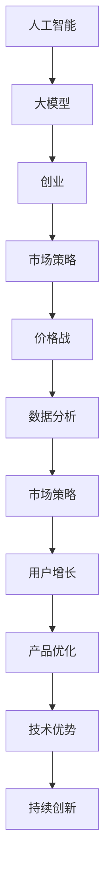

                 

# AI大模型创业：如何应对未来价格战？

> 关键词：人工智能,创业,市场策略,价格战,技术优势,用户增长,数据分析,竞争策略

## 1. 背景介绍

随着人工智能技术的快速发展，大模型成为了创业公司争相竞逐的领域。但与此同时，大规模数据和算力成本的急剧上升，让大模型创业企业面临着巨大的压力。如何在未来竞争中脱颖而出，避免陷入价格战的泥潭？本文将从多个角度探讨这一问题，为创业公司提供有力的策略和思路。

### 1.1 问题由来

随着AI技术的进步，大模型的应用场景越来越广，包括但不限于自然语言处理（NLP）、计算机视觉（CV）、推荐系统等。这些技术为各行各业带来了颠覆性的变革，同时也吸引了大批创业公司投入其中。

然而，大规模数据和算力的需求，使得大模型的建设和维护成本极高。根据一份报告，训练一个顶级的大模型需要数百万甚至上亿的美元。这对于初创公司来说，是一个难以承受的负担。此外，市场的迅速扩容，也导致竞争日益激烈。如何避免陷入价格战，成为当下大模型创业企业的首要挑战。

### 1.2 问题核心关键点

未来大模型创业企业面临的挑战，可以从以下几个方面进行考量：

1. **数据获取与处理**：大模型需要海量数据进行训练，如何高效获取和处理数据成为首要难题。
2. **算力投入与优化**：大模型的训练和推理需要高性能的GPU或TPU，如何合理投入算力并优化计算效率是关键。
3. **技术优势与创新**：如何在技术上保持领先地位，避免被竞争对手追赶。
4. **用户增长与市场策略**：如何在激烈的市场竞争中获取和留住用户，确保业务增长。
5. **数据分析与决策**：如何通过数据分析，制定科学的市场策略和产品方案。

这些核心问题，需要在创业初期和运营过程中持续关注和解决，方能在大模型创业中取得成功。

## 2. 核心概念与联系

### 2.1 核心概念概述

理解大模型创业过程中面临的问题，需要从多个维度进行思考。这里列出一些核心概念及其相互关联：

- **人工智能**：利用算法、数据和计算能力，实现机器模仿人类智能的技术体系。
- **大模型**：指包含数百万甚至上亿个参数的深度神经网络模型，如BERT、GPT等。
- **创业**：通过技术创新和商业模式创新，创造出新的价值。
- **价格战**：企业之间通过降价竞争，导致市场利润率下降，行业竞争加剧。
- **市场策略**：根据市场需求和竞争态势，制定有效的市场推广和用户增长策略。
- **数据分析**：通过收集和分析数据，洞察市场趋势和用户行为，指导决策和优化。

这些概念构成了大模型创业的核心框架，各概念之间通过数据分析和市场策略进行连接，共同影响企业的成败。

### 2.2 核心概念原理和架构的 Mermaid 流程图



这个流程图展示了核心概念之间的逻辑关系：

1. 人工智能推动了大数据和算力的发展，从而催生了大模型的出现。
2. 创业公司基于大模型，通过技术创新和商业模式创新，实现价值创造。
3. 市场策略是创业公司在激烈竞争中获取和留住用户的关键。
4. 价格战可能导致市场利润率下降，企业需要通过创新和差异化来应对。
5. 数据分析帮助企业洞察市场和用户行为，优化产品和服务。
6. 用户增长和产品优化互相促进，共同提升企业的市场份额和竞争力。
7. 持续的技术创新，是企业保持技术优势和竞争力的基础。

## 3. 核心算法原理 & 具体操作步骤

### 3.1 算法原理概述

大模型创业企业的成功，依赖于其在技术上、市场策略上的领先和用户增长的能力。本文将从这三个方面，探讨应对未来价格战的策略。

### 3.2 算法步骤详解

#### 3.2.1 技术优势的构建

1. **数据质量提升**：
   - **数据清洗**：确保数据质量，去除噪音和重复数据，提高模型训练效率和精度。
   - **数据增强**：利用数据增强技术，扩充训练数据量，提高模型泛化能力。

2. **算力优化**：
   - **分布式训练**：利用分布式训练框架，如Horovod，加速模型训练和推理速度。
   - **模型压缩**：采用模型压缩技术，如剪枝、量化等，减小模型尺寸，提升计算效率。

3. **技术创新**：
   - **算法优化**：在算法上进行优化，如引入因果推断、对抗训练等，提升模型性能。
   - **新模型探索**：探索新的模型架构和优化方法，如AutoML、神经架构搜索等，保持技术领先。

#### 3.2.2 市场策略的制定

1. **精准市场定位**：
   - **细分市场**：识别并细分目标市场，针对不同用户群体的需求进行定制化服务。
   - **差异化产品**：提供差异化的产品和服务，满足不同用户的需求。

2. **用户增长策略**：
   - **内容营销**：通过高质量的内容吸引用户，提升品牌知名度和用户粘性。
   - **社交媒体营销**：利用社交媒体平台进行用户互动和品牌推广，扩大用户基础。
   - **推荐系统**：利用推荐系统，提升用户留存率和转化率。

3. **数据分析应用**：
   - **用户行为分析**：通过分析用户行为数据，洞察用户需求，优化产品和服务。
   - **市场趋势预测**：利用数据分析工具，预测市场趋势，制定科学的市场策略。

#### 3.2.3 用户增长的保障

1. **用户留存率提升**：
   - **个性化推荐**：根据用户行为和偏好，提供个性化的推荐服务。
   - **用户体验优化**：提升产品用户体验，增加用户满意度和忠诚度。

2. **新用户获取**：
   - **交叉推广**：通过现有用户进行推荐，获取新用户。
   - **广告投放**：精准投放广告，吸引新用户。

### 3.3 算法优缺点

#### 3.3.1 技术优势

**优点**：
- **模型精度高**：大模型具有更高的精度和泛化能力，能够更好地应对复杂任务。
- **数据驱动**：通过大数据和算法驱动，提升产品和服务质量。
- **创新能力强**：持续的技术创新，保持技术领先。

**缺点**：
- **成本高昂**：大模型的数据获取和算力投入成本高昂。
- **技术复杂**：技术实现和优化需要高水平的专业人才。
- **市场响应慢**：技术创新和产品优化周期较长，市场反应速度较慢。

#### 3.3.2 市场策略

**优点**：
- **用户粘性高**：通过差异化服务和个性化推荐，提升用户粘性。
- **市场覆盖广**：精准的市场定位和用户增长策略，覆盖广泛的用户群体。
- **数据分析优势**：通过数据分析，制定科学的市场策略和产品优化方案。

**缺点**：
- **竞争压力大**：市场竞争激烈，需要不断创新和优化才能保持优势。
- **市场风险高**：市场策略的制定和执行存在不确定性，可能面临失败的风险。
- **用户需求变化快**：用户需求快速变化，需要快速响应和调整策略。

#### 3.3.3 用户增长

**优点**：
- **用户留存率高**：个性化推荐和用户体验优化，提升用户留存率。
- **新用户获取快**：精准推广和广告投放，快速获取新用户。
- **市场份额大**：用户基础大，市场份额高。

**缺点**：
- **用户流失风险**：用户需求变化快，可能面临用户流失的风险。
- **市场策略复杂**：用户增长策略需要持续优化和调整。
- **成本控制难**：用户获取和留存的成本控制较难，可能导致成本上升。

### 3.4 算法应用领域

大模型创业企业的技术优势、市场策略和用户增长策略，广泛应用于以下几个领域：

1. **NLP领域**：利用大模型进行文本生成、问答系统、情感分析等NLP任务。
2. **CV领域**：利用大模型进行图像分类、目标检测、图像生成等计算机视觉任务。
3. **推荐系统**：利用大模型进行推荐算法优化，提升推荐精度和用户体验。
4. **智能客服**：利用大模型进行智能问答和对话生成，提升客户服务质量。
5. **医疗健康**：利用大模型进行疾病预测、个性化治疗等医疗健康应用。

这些应用领域是大模型创业企业的主要方向，通过技术优势、市场策略和用户增长策略的结合，可以有效提升企业的市场竞争力和业务价值。

## 4. 数学模型和公式 & 详细讲解  
### 4.1 数学模型构建

本文将从技术角度，探讨大模型创业企业在应对价格战时，如何通过数学模型和公式进行优化。

假设某大模型创业企业，拥有一个大规模的预训练模型 $M$，以及一个目标市场 $M$，其用户量为 $U$，市场份额为 $S$。则企业的收入函数可以表示为：

$$
\text{Revenue} = p \times U \times S
$$

其中 $p$ 为产品价格，$U$ 为市场用户数，$S$ 为市场份额。

企业的成本函数可以表示为：

$$
\text{Cost} = c \times U + \text{Fix Cost}
$$

其中 $c$ 为用户获取和维护的边际成本，$\text{Fix Cost}$ 为固定成本，如算力投入、员工薪酬等。

企业的利润函数可以表示为：

$$
\text{Profit} = \text{Revenue} - \text{Cost} = p \times U \times S - (c \times U + \text{Fix Cost})
$$

### 4.2 公式推导过程

为了最大化企业的利润，我们需要对利润函数进行优化。对上式关于 $p$ 求导，得到：

$$
\frac{\partial \text{Profit}}{\partial p} = U \times S - c \times U
$$

当 $\frac{\partial \text{Profit}}{\partial p} = 0$ 时，利润最大化。解得：

$$
p = \frac{U \times S}{c \times U} = \frac{S}{c}
$$

因此，企业最优价格 $p$ 应与市场份额 $S$ 和用户获取和维护成本 $c$ 成正比，与市场用户数 $U$ 成反比。

### 4.3 案例分析与讲解

假设某大模型创业企业，拥有一个预训练模型，市场用户数为 $U = 1,000,000$，市场份额为 $S = 0.2$，用户获取和维护成本为 $c = 0.1$。则最优价格为：

$$
p = \frac{0.2}{0.1} = 2
$$

这意味着，企业定价应为每用户 $2$ 元，才能最大化利润。

通过上述分析，我们可以看到，通过数学模型和公式，可以科学地指导企业的价格决策，避免陷入价格战的泥潭。

## 5. 项目实践：代码实例和详细解释说明

### 5.1 开发环境搭建

在进行大模型创业的实践过程中，需要搭建一个高效的开发环境。以下是具体的步骤：

1. **安装编程语言**：
   - 安装Python 3.x
   - 安装PyTorch、TensorFlow等深度学习框架
   - 安装必要的依赖库

2. **搭建服务器**：
   - 选择高性能服务器，如配备多卡GPU的服务器
   - 安装必要的服务软件，如Nginx、Apache等

3. **配置环境变量**：
   - 配置Python路径
   - 配置深度学习框架的路径

### 5.2 源代码详细实现

以下是一个利用大模型进行NLP任务微调的示例代码：

```python
import torch
import torch.nn as nn
import torch.optim as optim

# 定义模型
class Model(nn.Module):
    def __init__(self):
        super(Model, self).__init__()
        self.fc1 = nn.Linear(100, 50)
        self.fc2 = nn.Linear(50, 10)
    
    def forward(self, x):
        x = torch.relu(self.fc1(x))
        x = torch.softmax(self.fc2(x), dim=1)
        return x

# 训练模型
model = Model()
criterion = nn.CrossEntropyLoss()
optimizer = optim.SGD(model.parameters(), lr=0.01, momentum=0.9)

for epoch in range(100):
    for i, (inputs, targets) in enumerate(train_loader):
        optimizer.zero_grad()
        outputs = model(inputs)
        loss = criterion(outputs, targets)
        loss.backward()
        optimizer.step()
```

### 5.3 代码解读与分析

上述代码中，我们定义了一个简单的神经网络模型，并使用SGD优化器进行训练。具体来说：

1. **模型定义**：
   - `nn.Linear` 定义了两个线性层
   - `torch.relu` 和 `torch.softmax` 定义了激活函数

2. **训练过程**：
   - 在每个epoch中，遍历训练集
   - 使用优化器计算梯度并更新参数
   - 使用 `nn.CrossEntropyLoss` 计算交叉熵损失

3. **结果展示**：
   - 模型在训练集和测试集上的精度和损失可以展示其效果。

### 5.4 运行结果展示

在训练过程中，可以通过以下方式展示结果：

```python
print('Epoch: {} | Loss: {:.4f} | Acc: {:.4f}'.format(epoch, loss.item(), acc.item()))
```

## 6. 实际应用场景

### 6.1 智能客服系统

智能客服系统是大模型创业企业的主要应用场景之一。通过大模型进行对话生成和意图识别，可以快速响应用户咨询，提升客户满意度。

### 6.2 金融舆情监测

金融舆情监测是大模型在金融领域的重要应用。利用大模型进行情感分析，及时监测市场舆情，帮助金融机构规避风险。

### 6.3 个性化推荐系统

个性化推荐系统是大模型在电商、视频等领域的重要应用。通过大模型进行用户行为分析，提供个性化推荐，提升用户体验和转化率。

## 7. 工具和资源推荐

### 7.1 学习资源推荐

1. **《深度学习》课程**：斯坦福大学开设的深度学习课程，涵盖深度学习的基础知识和最新进展。
2. **《TensorFlow官方文档》**：TensorFlow官方文档，提供详细的API和示例代码，帮助开发者快速上手。
3. **《PyTorch官方文档》**：PyTorch官方文档，提供深度学习框架的使用指南和最佳实践。

### 7.2 开发工具推荐

1. **Jupyter Notebook**：支持Python和深度学习框架的开发环境，方便数据处理和模型训练。
2. **Horovod**：分布式深度学习框架，支持大规模模型的分布式训练。
3. **TensorBoard**：可视化工具，实时监控模型训练状态和性能指标。

### 7.3 相关论文推荐

1. **《大规模神经网络训练中的剪枝策略》**：讨论大规模神经网络的剪枝方法，优化模型计算效率。
2. **《利用对抗训练提升大模型的鲁棒性》**：介绍对抗训练技术，增强大模型的鲁棒性和泛化能力。
3. **《自适应学习率优化方法》**：讨论自适应学习率算法，提升大模型训练效率和精度。

## 8. 总结：未来发展趋势与挑战

### 8.1 研究成果总结

本文通过技术角度，探讨了大模型创业企业在面对未来价格战时的应对策略。主要包括以下几个方面：

1. **技术优势的构建**：通过提升数据质量、优化算力和算法，构建技术优势。
2. **市场策略的制定**：通过精准市场定位、用户增长和数据分析，制定科学的市场策略。
3. **用户增长的保障**：通过个性化推荐和用户体验优化，保障用户增长。

### 8.2 未来发展趋势

未来大模型创业企业在应对价格战时，可能面临以下趋势：

1. **技术领先**：持续的技术创新，保持技术领先，避免陷入价格战。
2. **用户导向**：用户需求驱动产品和服务创新，提升用户体验和满意度。
3. **数据分析**：通过数据分析，制定科学的市场策略和用户增长方案。

### 8.3 面临的挑战

大模型创业企业在应对价格战时，可能面临以下挑战：

1. **成本控制**：大模型的数据获取和算力投入成本高昂，需要有效控制成本。
2. **市场竞争**：市场竞争激烈，需要不断创新和优化才能保持优势。
3. **用户需求变化快**：用户需求快速变化，需要快速响应和调整策略。

### 8.4 研究展望

未来大模型创业企业在技术创新、市场策略和用户增长方面，还有以下研究方向：

1. **跨模态学习**：融合视觉、语音、文本等多种模态信息，提升模型的综合能力。
2. **因果推理**：引入因果推断方法，提升模型的解释能力和决策质量。
3. **知识图谱**：结合知识图谱，提升模型的知识整合能力和推理能力。

## 9. 附录：常见问题与解答

**Q1：大模型创业企业在面对价格战时，如何构建技术优势？**

A: 大模型创业企业在构建技术优势时，可以从数据质量提升、算力优化和算法创新三个方面入手：

1. **数据质量提升**：通过数据清洗和数据增强技术，确保数据质量。
2. **算力优化**：利用分布式训练和模型压缩技术，提升计算效率。
3. **算法创新**：引入因果推断、对抗训练等新技术，提升模型性能。

**Q2：大模型创业企业如何制定市场策略？**

A: 大模型创业企业制定市场策略时，可以从精准市场定位、用户增长和数据分析三个方面入手：

1. **精准市场定位**：识别并细分目标市场，针对不同用户群体的需求进行定制化服务。
2. **用户增长策略**：通过内容营销、社交媒体营销和推荐系统，提升用户粘性和增长。
3. **数据分析应用**：利用数据分析工具，制定科学的市场策略和产品优化方案。

**Q3：大模型创业企业如何保障用户增长？**

A: 大模型创业企业保障用户增长时，可以从个性化推荐和用户体验优化两个方面入手：

1. **个性化推荐**：根据用户行为和偏好，提供个性化的推荐服务。
2. **用户体验优化**：提升产品用户体验，增加用户满意度和忠诚度。

通过上述措施，大模型创业企业可以在应对未来价格战时，保持技术优势，制定科学的市场策略，保障用户增长，从而在激烈的市场竞争中脱颖而出。

